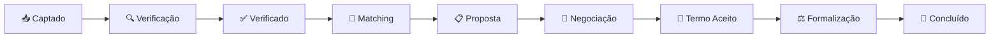

# 05 - Memorando de Essência

Fase: 2 — Identidade
Área: Marketing

<aside>
📋

**Documento Normativo — Repasse Seguro**

Este documento é referência obrigatória para todo conteúdo, comunicação, produto e decisão estratégica da Repasse Seguro. Qualquer material que contradiga o que está aqui deve ser revisado antes de publicação.

</aside>

---

## Memorando de Essência de Produto

### Repasse Seguro — Infraestrutura de Formalização de Cessões Imobiliárias

| **Destinatário** | Shift Labs — Produto, Marketing, Comercial, UX, Engenharia, Jurídico, CS, Operações |
| --- | --- |
| **Escopo** | Documento-âncora de identidade do produto. Define quem a Repasse Seguro é, o que faz, o que não é, como se posiciona e como usar essas definições no dia a dia. |
| **Versão** | v2.0 |
| **Responsável** | Fernando Calado |
| **Data da versão** | 25/02/2026 11:41 (America/Fortaleza) |

---

<aside>
📌

**TL;DR**

- A Repasse Seguro é a **infraestrutura de formalização de cessões de contratos imobiliários** — o **terceiro caminho** entre o distrato punitivo (perda de 25-50%) e a informalidade arriscada (contratos de gaveta).
- **Posicionamento:** "Repasse Seguro é o que transforma insegurança em caminho claro." Infraestrutura de confiança, **não marketplace**.
- **Arquétipos:** Sábio (clareza, orientação) + Cuidador (proteção, suporte).
- **Tom:** Clareza acima de tudo, seriedade sem frieza, transparência radical, empoderamento sem promessa.
- **Propósito triplo:** recuperação patrimonial (cedente), oportunidade verificada (cessionário), inteligência de mercado (ecossistema).
- **Modelo de receita:** 2 comissões sobre resultado — cedente 20% sobre valor recuperado vs distrato, comprador 20% sobre Δ. **Zero assinatura, zero capital em risco.**
- **4 Cenários de Retorno:** A (saldo devedor, RS=0), B (100% pago), C (+30%), D (+50%).
- **5 ICPs:** Cedente PF, Investidor PF na planta, Comprador Oportunista, Corretor/Advogado imobiliário, Incorporadora médio porte.
- **2 Agentes de IA:** 🛡️ Guardião do Retorno (cedente) e 📊 Analista de Oportunidades (cessionário).
- **6 Princípios Inegociáveis:** só cobra sobre resultado, não assume posição financeira, transparência é o produto, formalização é o diferencial, protege ambas as partes, processo antes de escala.
- **Ciclo típico:** 45-60 dias (Captado → Concluído, 9 estados).
- **Breakeven:** ~3 casos/mês.
- **Teste Ácido:** se tirar o nome "Repasse Seguro" do texto e não der para saber que é sobre nós, o texto falhou.
</aside>

---

# 1. O que é a Repasse Seguro

## 1.1 Definição

A **Repasse Seguro** é uma **infraestrutura de formalização de cessões de contratos imobiliários** que conecta cedentes (quem precisa sair do contrato) a cessionários (quem quer entrar), com segurança jurídica, transparência financeira e processo assistido.

Na prática, ela cria o **terceiro caminho** para quem está preso em um contrato imobiliário:

| **Caminho** | **O que acontece** | **Resultado** |
| --- | --- | --- |
| **1. Distrato** | Devolve o imóvel à incorporadora | Perda de 25-50% do valor pago — punitivo e desigual |
| **2. Informalidade** | Contrato de gaveta entre particulares | Sem segurança jurídica, sem trilha de auditoria, risco total |
| **3. Repasse Seguro** ✅ | Cessão formal, verificada, com curadoria e escrow | Processo assistido, transparente, com formalização completa |

## 1.2 Posicionamento: Infraestrutura de Confiança

<aside>
💡

**A Repasse Seguro não é um marketplace. É uma infraestrutura de confiança.**

O foco não é "conectar compradores e vendedores". O foco é **formalizar cessões de contratos imobiliários** com segurança, transparência e processo — transformando o que antes era arriscado e informal em um caminho claro e protegido.

- **O que o mercado oferece:** informalidade (contratos de gaveta) ou penalização (distrato punitivo)
- **O que a RS oferece:** o **terceiro caminho** — formal, transparente e justo
- **Essência:** *"Repasse Seguro é o que transforma insegurança em caminho claro."*
</aside>

## 1.3 O Mercado

<aside>
📊

**R$ 2,5B–4,5B/ano em comissões potenciais.** Mais de 50 mil contratos por ano ficam presos entre o distrato punitivo e a informalidade arriscada. Nenhum player resolve isso com estrutura, governança e trilha de auditoria. O quadrante de alta formalização + receita sobre resultado está **vazio**.

</aside>

---

# 2. Essência da Repasse Seguro

## 2.1 Personalidade de Marca

A Repasse Seguro é uma **marca com personalidade institucional**, construída sobre dois arquétipos complementares:

- **Sábio** — clareza, orientação, conhecimento. *"Eu sei o caminho porque já mapeei todos os cenários."*
- **Cuidador** — proteção, suporte, acolhimento. *"Você não está sozinho nesse processo."*

Não é um classificado frio. Não é um consultor genérico. É a **infraestrutura que transforma medo em processo** — e processo em resultado verificável.

| **Atributo** | **Descrição** | **Na prática** |
| --- | --- | --- |
| **Clara e Acessível** | Linguagem simples para decisões complexas | Frases curtas, vocabulário acessível, zero jargão desnecessário |
| **Séria, mas Acolhedora** | Institucional sem ser burocrática | Tom de orientação, não de cartório nem de startup casual |
| **Transparente por Princípio** | Mostra o cálculo, a fórmula, a fonte | Tabela documentada, dossiê auditável, comissão visível |
| **Protetora, Nunca Paternalista** | Empodera com informação, não decide pelo cliente | Apresenta cenários e dados para o cliente escolher |
| **Neutra e Justa** | Não toma partido entre cedente e cessionário | Regra objetiva: fórmula, fonte, data, evidência |

## 2.2 Essência em Uma Frase

<aside>
🎯

> *"Repasse Seguro é o que transforma insegurança em caminho claro — e caminho claro em decisão justa."*
> 
</aside>

## 2.3 Propósito Triplo

| **#** | **Para Quem** | **Propósito** | **Em uma frase** |
| --- | --- | --- | --- |
| 1 | **Cedente** | Recuperação patrimonial | "Quanto eu perco no distrato?" deixa de ser a única pergunta — agora existe "quanto eu recupero com cessão?" |
| 2 | **Cessionário** | Oportunidade verificada | Imóvel abaixo da tabela com dossiê, verificação documental e segurança jurídica |
| 3 | **Ecossistema** | Inteligência de mercado | Dados reais de cessões formalizadas — Δ, tempo de ciclo, cenários, perfis — que ninguém mais tem |

## 2.4 Valores Que a Repasse Seguro Sempre Comunica

| **#** | **Valor** | **Como Transmitir** |
| --- | --- | --- |
| 1 | **Formalização** | Cessão documentada, com trilha de auditoria e dossiê — o oposto do contrato de gaveta |
| 2 | **Transparência** | Tabela de referência, fórmula pública, cálculo visível — nada fica escondido |
| 3 | **Proteção** | Conta escrow, verificação documental, curadoria — ambas as partes protegidas |
| 4 | **Resultado** | Comissão só no fechamento — se não fecha, ninguém paga nada |
| 5 | **Neutralidade** | A plataforma não toma partido — cedente e cessionário são ambos clientes |

## 2.5 Métricas-Âncora de Sucesso

<aside>
📊

**Como sabemos que a Repasse Seguro está cumprindo o propósito triplo?** Cada stakeholder tem KPIs-âncora que validam o valor entregue.

</aside>

| **Stakeholder** | **KPI-Âncora** | **O que mede** | **Meta de referência** |
| --- | --- | --- | --- |
| **Cedente** | Valor Recuperado vs Distrato | % do valor pago que o cedente recupera em relação ao que receberia no distrato | Recuperação ≥ 80% do valor pago (vs 50-75% no distrato) |
| **Cedente** | Tempo de ciclo (Captado → Concluído) | Dias entre captação do caso e fechamento formal | 45-60 dias (ciclo típico) |
| **Cessionário** | Δ (Delta) — desconto vs tabela | % de desconto real sobre o valor de tabela da incorporadora | Cenários C (+30%) e D (+50%) como referência |
| **Cessionário** | Taxa de verificação completa | % de casos com dossiê completo e verificação documental antes da proposta | 100% — sem exceções |
| **Plataforma** | Casos concluídos / mês | Volume de cessões formalizadas com sucesso | ≥ 3 casos/mês (breakeven) |
| **Plataforma** | NPS por parte (cedente + cessionário) | Satisfação com o processo, transparência e resultado | NPS ≥ 70 para ambas as partes |

---

# 3. Os 6 Princípios Inegociáveis

<aside>
🎯

**Os 6 princípios que guiam todas as decisões de marca, produto e comunicação da Repasse Seguro.** São inegociáveis — se uma decisão contradiz qualquer princípio, a decisão está errada.

</aside>

| **#** | **Princípio** | **O que significa** | **Na prática** |
| --- | --- | --- | --- |
| 1 | **Só cobra quando há resultado** | Comissão incide exclusivamente no fechamento | Se não fecha, ninguém paga nada. Não é feature — é identidade. |
| 2 | **Não assume posição financeira** | Zero capital próprio no deal, zero risco de balanço | A plataforma é neutra — não compra, não vende, não garante. |
| 3 | **Transparência é o produto** | Tabela documentada, fórmula pública, dossiê auditável | Se não pode ser mostrado, não deveria existir. |
| 4 | **Formalização é o diferencial** | Enquanto o mercado opera em gaveta, a RS opera em trilha | A formalização não é burocracia — é a razão de existir. |
| 5 | **Protege ambas as partes** | Cedente e cessionário são clientes. A marca não toma partido. | Regra objetiva: fórmula, fonte, data, evidência. |
| 6 | **Processo antes de escala** | Não abre marketplace sem curadoria, não aceita caso sem verificação | Confiança se constrói caso a caso — não sacrifica governança por volume. |

**Na comunicação, isso significa:**

| **🔴 Nunca diga** | **✅ Sempre diga** |
| --- | --- |
| "Vendemos seu contrato em X dias" | "Formalizamos cessões com processo verificado — ciclo típico de 45-60 dias" |
| "Garantimos a melhor oferta" | "Apresentamos cenários com tabela documentada para você decidir" |
| "Marketplace de imóveis" | "Infraestrutura de formalização de cessões" |
| "Invista em imóveis com desconto" | "Adquira com verificação documental e segurança jurídica" |
| "Compramos seu contrato" | "Conectamos você a um comprador qualificado, com processo assistido" |

---

# 4. O que a Repasse Seguro Faz de Verdade

A Repasse Seguro funciona como uma **camada de formalização, verificação e governança** sobre o mercado secundário de cessões imobiliárias:

## 4.1 Para o Cedente (Recuperação Patrimonial)

<aside>
✅

**Verificar e montar o dossiê do caso**

Contrato, tabela da incorporadora, saldo devedor, cláusulas de cessão, documentação completa — tudo organizado antes de qualquer conversa com comprador.

**Calcular cenários de retorno**

4 cenários documentados (A/B/C/D) com base na tabela de referência. O cedente sabe exatamente o que pode recuperar em cada situação.

**Conectar com comprador qualificado**

Não é vitrine aberta. É curadoria: comprador verificado, com capacidade financeira confirmada, para um caso específico.

**Assistir todo o processo de cessão**

Da captação à anuência da incorporadora, passando por escrow e assinatura. Processo assistido, não self-service.

**Proteger com conta escrow**

Recursos transitam por conta vinculada. Ninguém paga "por fora". Trilha de auditoria completa.

</aside>

## 4.2 Para o Cessionário (Oportunidade Verificada)

<aside>
✅

**Acessar imóveis abaixo da tabela com segurança**

Dossiê verificado, documentação conferida, Δ calculado — oportunidade real, não classificado genérico.

**Conhecer o caso antes de propor**

Dossiê completo com tabela de referência, cálculo de desconto, situação documental e cláusulas de cessão. Zero surpresa.

**Negociar com processo formal**

Termo comercial estruturado, condições claras, conta escrow para garantir ambas as partes.

**Receber suporte na formalização**

Anuência da incorporadora, transferência formal, registro — tudo assistido pela plataforma.

</aside>

## 4.3 Capacidades Estruturadas

| **Capacidade** | **Descrição** | **Impacto** |
| --- | --- | --- |
| **Curadoria de casos** | Verificação documental completa antes de publicar | Só entra caso verificado — zero lixo, zero risco evitável |
| **Dossiê auditável** | Dossiê com contrato, tabela, saldo, cláusulas, trilha completa | Ambas as partes decidem com informação real, não com achismo |
| **Cenários de retorno (A/B/C/D)** | Simulação documentada de ganho para cedente e cessionário | Transparência total sobre o que cada parte ganha ou paga |
| **Conta escrow** | Recursos protegidos em conta vinculada até o fechamento | Segurança financeira para ambas as partes — zero "por fora" |
| **Formalização assistida** | Da captação à anuência, passando por termo e assinatura | Processo de 45-60 dias com 9 estados rastreáveis |
| **🛡️ Guardião do Retorno (IA)** | Agente de IA para cedentes — empático, calmo, educativo | Orienta sobre cenários, responde dúvidas, acompanha o processo |
| **📊 Analista de Oportunidades (IA)** | Agente de IA para cessionários — analítico, orientado a dados | Apresenta Δ, tabela, comparações e oportunidades verificadas |
| **3 Dashboards** | Visões específicas para Cedente, Cessionário e Admin | Cada parte vê exatamente o que precisa, com transparência total |
| **Trilha de auditoria** | Registro completo de cada etapa, decisão e documento | Rastreabilidade total — base para confiança institucional |

---

# 5. O que a Repasse Seguro NÃO é

<aside>
🔴

**A Repasse Seguro NÃO é:**

- Um **marketplace de imóveis** — não é vitrine aberta; é infraestrutura de formalização com curadoria
- Uma **fintech ou intermediação financeira** — não empresta, não investe, não assume posição
- Um **classificado genérico** tipo OLX — não publica sem verificação, não opera sem processo
- Uma **imobiliária** — não vende imóveis; formaliza cessões de contratos
- Um **serviço de consultoria jurídica** — não dá parecer legal; estrutura o processo para que advogados atuem
- Uma **promessa de liquidez** — não garante prazo, não garante resultado; apresenta cenários
- Um **investimento** — não é fundo, não é aplicação, não promete retorno

**Importante:** Se alguém descreve a Repasse Seguro como "marketplace de imóveis" ou "plataforma de investimento", está descrevendo **exatamente o que não somos** e o que nos diferencia.

</aside>

## 5.1 Teste Ácido de Identidade

<aside>
🧪

**Se você tirar o nome "Repasse Seguro" de qualquer texto e não der para saber que é sobre nós, o texto falhou.**

Todo conteúdo, copy, pitch ou feature description precisa carregar pelo menos **um** destes sinais de identidade:

- **Terceiro caminho** (não somos distrato nem informalidade)
- **Formalização com trilha de auditoria** (ninguém mais faz isso no mercado de cessões)
- **Comissão sobre resultado** (se não fecha, ninguém paga)
- **Dossiê verificado** (curadoria antes de qualquer conversa)
- **Infraestrutura de confiança** (não marketplace, não classificado)

Se o texto não contém nenhum desses sinais, **reescreva antes de publicar.**

</aside>

---

# 6. Posição na Cadeia de Cessão Imobiliária

## 6.1 Visão por Stakeholder

| **Stakeholder** | **A RS é** | **Função** | **Valor Entregue** |
| --- | --- | --- | --- |
| **Cedente** | O **caminho seguro para sair** | Verifica, monta dossiê, conecta com comprador qualificado e assiste a formalização | Recuperação patrimonial real vs perda no distrato |
| **Cessionário** | A **fonte de oportunidades verificadas** | Apresenta casos com dossiê, Δ calculado e segurança jurídica | Imóvel abaixo da tabela com processo formal |
| **Corretor/Advogado** | Uma **ferramenta de resolução** | Processo pronto para indicar clientes que precisam sair de contratos | Comissão sobre indicação + resolução sem risco próprio |
| **Incorporadora** | Um **canal de redução de distratos** | Contrato continua ativo com comprador qualificado — sem custo para a incorporadora | Menos distrato, mais fluxo de caixa preservado |
| **Investidor (RS)** | Uma **infraestrutura neutra de mercado** | Formaliza cessões para mercado de R$ 2,5B-4,5B/ano sem capital em risco | Unit economics defensível + moat operacional |

## 6.2 Fluxo Integrado — Ciclo de um Caso

<aside>
💡

**Fluxo de Valor — 9 estados, 45-60 dias:**

1. **Captado** → caso entra na plataforma
2. **Em Verificação** → curadoria documental e montagem do dossiê
3. **Verificado** → dossiê completo, pronto para matching
4. **Em Matching** → conexão com cessionários qualificados
5. **Proposta Recebida** → cessionário fez proposta formal
6. **Em Negociação** → ajustes de termo comercial
7. **Termo Aceito** → ambas as partes concordaram
8. **Em Formalização** → anuência, escrow, assinatura
9. **Concluído** → cessão formalizada, comissões liquidadas
</aside>

---

# 7. Diferenciação vs Concorrentes

<aside>
💡

**O maior concorrente da Repasse Seguro não é uma empresa — é a informalidade.** O mercado de cessões está 90%+ desorganizado. O quadrante de alta formalização + receita sobre resultado está vazio.

</aside>

| **Alternativa** | **O que oferece** | **O que falta** | **RS vs alternativa** |
| --- | --- | --- | --- |
| **Distrato formal** | Segurança jurídica | Custo brutal (25-50% do pago) | RS recupera valor em vez de destruí-lo |
| **Contrato de gaveta** | Velocidade | Zero segurança, risco total | RS formaliza com trilha de auditoria |
| **OLX / WhatsApp** | Alcance | Zero verificação, zero processo | RS faz curadoria antes de qualquer conversa |
| **Dinheiro na Planta** | Rede de investidores | Risco de balanço, opacidade, trilha fraca | RS é neutra — zero capital em risco, transparência total |
| **Desfinancia** | Narrativa emocional | Escopo amplo, sem governança de cessão | RS é especialista em cessão com processo jurídico-first |

### A frase que diferencia

> *O Repasse Seguro não compete com classificados de imóveis. Compete com informalidade, desconfiança e risco jurídico. O moat está em virar o padrão operacional de repasse — o processo que todo corretor, advogado e incorporadora usa quando a cessão é a melhor saída.*
> 

---

# 8. ICPs — Quem é o Cliente Ideal

<aside>
🎯

**A Repasse Seguro não atende qualquer perfil.** O produto funciona melhor com públicos específicos. Conhecer os ICPs garante foco na captação, no produto e na comunicação.

</aside>

| **ICP** | **Perfil** | **Dor principal** | **Argumento-chave** |
| --- | --- | --- | --- |
| **1. Cedente PF** | Pessoa física que comprou na planta e precisa sair (divórcio, perda de renda, mudança de cidade) | Medo de perder 25-50% no distrato; não sabe que existe alternativa | "Você pode recuperar muito mais do que receberia no distrato — com processo formalizado e seguro" |
| **2. Investidor PF na planta** | Pessoa física que comprou como investimento e quer liquidar posição | Contrato travado, sem liquidez; não quer distrato punitivo | "Formalize a saída com Δ documentado e comprador qualificado — sem risco de gaveta" |
| **3. Comprador Oportunista (Cessionário)** | Pessoa física ou investidor que busca imóvel abaixo da tabela com segurança | Medo de golpe em repasse informal; não confia em contrato de gaveta | "Imóvel com desconto real, dossiê verificado e formalização completa — zero risco de gaveta" |
| **4. Corretor / Advogado Imobiliário** | Profissional que recebe clientes com contratos problemáticos | Não tem ferramenta para resolver cessão; perde o cliente ou assume risco | "Indique e ganhe comissão. O processo de formalização é nosso." |
| **5. Incorporadora Médio Porte** | Incorporadora com volume relevante de distratos e interesse em manter contratos ativos | Distrato consome caixa e gera desgaste; cessão reduz impacto | "Reduza distratos sem custo. O contrato continua ativo com comprador qualificado." |

### Anti-ICP — Quem NÃO É Cliente

<aside>
🔴

**Não é ICP:** especuladores que querem "flipar" contratos sem processo, pessoas que buscam promessa de liquidez imediata, quem quer resolver "por fora" sem formalização, incorporadoras que preferem distrato como estratégia de repricing.

A Repasse Seguro **nunca humilha** quem não é ICP. Recusamos com **honestidade respeitosa** — reconhecemos que o momento, perfil ou expectativa não se alinha com o que oferecemos.

</aside>

---

# 9. Modelo Comercial — Cenários de Retorno

<aside>
⚙️

**A Repasse Seguro cobra apenas sobre resultado real — e sempre com fórmula pública.** Zero mensalidade, zero taxa de cadastro, zero capital em risco.

</aside>

## 9.1 Estrutura de Comissão

| **Parte** | **Base de cálculo** | **Comissão** | **Quando paga** |
| --- | --- | --- | --- |
| **Cedente** | 20% sobre o **Valor Recuperado** (ganho real vs o que receberia no distrato) | 20% | Somente no fechamento da cessão |
| **Cessionário** | 20% sobre o **Δ** (diferença entre valor de tabela e valor pago na cessão) | 20% | Somente no fechamento da cessão |

## 9.2 Os 4 Cenários de Retorno

<aside>
💡

**Cada caso gera um cenário diferente.** A comunicação comercial deve sempre apresentar os cenários com transparência — o cedente e o cessionário sabem exatamente o que esperar.

</aside>

| **Cenário** | **Descrição** | **Comissão RS** | **Exemplo (contrato R$ 400k, pago R$ 200k)** |
| --- | --- | --- | --- |
| **A — Saldo devedor** | Cessionário assume apenas saldo devedor (cedente recupera zero além do distrato) | RS = 0 (não há ganho vs distrato) | Cedente recupera o mesmo do distrato — RS não cobra |
| **B — 100% pago** | Cessionário paga o total já investido pelo cedente | 20% sobre ganho vs distrato | Cedente recupera R$ 200k (vs ~R$ 120k no distrato) → RS cobra sobre R$ 80k |
| **C — +30%** | Cessionário paga 130% do valor já investido | 20% de cada lado | Cedente recebe R$ 260k, Δ para cessionário = desconto vs tabela |
| **D — +50%** | Cessionário paga 150% do valor já investido | 20% de cada lado | Cedente recebe R$ 300k, Δ para cessionário menor mas ainda atrativo |

---

# 10. Agentes de IA

<aside>
🎯

**A Repasse Seguro opera com dois agentes de IA especializados**, cada um desenhado para o perfil emocional e informacional do seu público.

</aside>

| **Agente** | **Público** | **Personalidade** | **Função** |
| --- | --- | --- | --- |
| **🛡️ Guardião do Retorno** | Cedente | Empático, calmo, educativo. Tom de orientação — acolhe sem prometer. | Explica cenários, responde dúvidas sobre o processo, acompanha a jornada de recuperação patrimonial |
| **📊 Analista de Oportunidades** | Cessionário | Analítico, objetivo, orientado a dados. Tom de assessoria — informa sem pressionar. | Apresenta Δ, tabela de referência, comparações de mercado e oportunidades verificadas |

**Princípio dos agentes:** ambos seguem os mesmos 6 Princípios Inegociáveis. Nenhum promete resultado. Nenhum pressiona. Nenhum toma partido. Ambos **informam, orientam e acompanham**.

---

# 11. One-Liners Oficiais

<aside>
🎯

**O One-Liner é a frase única que posiciona a Repasse Seguro na mente do mercado.** Use a versão adequada ao contexto — nunca improvise.

</aside>

| **Contexto** | **One-Liner** |
| --- | --- |
| **Site / Hero** | A infraestrutura que transforma contratos travados em cessões formalizadas — com segurança, transparência e resultado. |
| **Pitch (30s)** | Repasse Seguro formaliza cessões de contratos imobiliários para quem precisa sair sem perder no distrato. Verificamos o caso, montamos dossiê, conectamos com comprador qualificado e assistimos todo o processo. Comissão só no fechamento. |
| **Ads / Social (Cedente)** | Preso num contrato imobiliário? Antes de aceitar o distrato, conheça o terceiro caminho. Formalização segura, transparente e sem custo até o resultado. |
| **Ads / Social (Cessionário)** | Imóvel abaixo da tabela com dossiê verificado e segurança jurídica. Sem risco de gaveta, sem surpresa. |
| **Investidor** | Repasse Seguro é infraestrutura neutra de formalização de cessões imobiliárias — mercado de R$ 2,5B-4,5B/ano. Comissão sobre resultado, zero capital em risco, breakeven em 3 casos/mês. |
| **Parceiro (Corretor/Advogado)** | Seu cliente precisa sair de um contrato imobiliário? Indique para a Repasse Seguro. O processo de formalização é nosso, a comissão de indicação é sua. |

### One-Liner Principal (Fórmula: Público + Problema + Solução + Resultado)

> **"Para quem precisa sair de um contrato imobiliário sem perder metade do que pagou, a Repasse Seguro é a infraestrutura que formaliza cessões com verificação, trilha de auditoria e comissão sobre resultado — transformando insegurança em caminho claro."**
> 

---

# 12. Frases que Definem a Repasse Seguro

| **#** | **Frase** | **Contexto de Uso** |
| --- | --- | --- |
| 1 | **"Repasse Seguro é o que transforma insegurança em caminho claro"** | Posicionamento-âncora — usar sempre que possível |
| 2 | **"O terceiro caminho — entre o distrato e a gaveta"** | Diferenciação de mercado — explicar a categoria |
| 3 | **"Infraestrutura de formalização, não marketplace"** | Corrigir percepção errada — sempre que confundirem com vitrine |
| 4 | **"Se não fecha, ninguém paga. Comissão só sobre resultado."** | Argumento comercial — remover objeção de custo |
| 5 | **"Dossiê verificado, trilha de auditoria, conta escrow"** | Prova de processo — demonstrar governança |
| 6 | **"Recuperar valor, não lucrar. Formalizar, não fechar negócio."** | Tom de voz — calibrar vocabulário da equipe |

---

# 13. Como Usar Este Documento

## 13.1 Para o Time Comercial

### Scripts por Público

**Ao falar com um Cedente:**

> **"Você comprou um imóvel na planta e precisa sair do contrato. No distrato, você perde de 25 a 50% do que pagou. Com a Repasse Seguro, a gente formaliza a cessão para um comprador qualificado — e você pode recuperar muito mais. Comissão só no fechamento. Se não fechar, você não paga nada."**
> 

**Ao falar com um Cessionário:**

> **"A Repasse Seguro tem imóveis abaixo da tabela com dossiê verificado. Cada caso tem verificação documental completa, Δ calculado e processo formal com conta escrow. Você compra com desconto real e segurança jurídica — sem risco de contrato de gaveta."**
> 

**Ao falar com Corretor/Advogado:**

> **"Quando seu cliente precisa sair de um contrato imobiliário, indique para a Repasse Seguro. A gente cuida de toda a formalização — verificação, dossiê, matching, anuência, escrow. Você recebe comissão sobre a indicação. Sem risco, sem trabalho operacional."**
> 

**Ao falar com Incorporadora:**

> **"A Repasse Seguro formaliza cessões de contratos. Em vez de distrato, o contrato continua ativo com um comprador qualificado. Sem custo para a incorporadora, sem desgaste. Menos distrato, mais fluxo de caixa preservado."**
> 

---

### Scripts Gerais

**Ao apresentar a Repasse Seguro pela primeira vez:**

> **"A Repasse Seguro formaliza cessões de contratos imobiliários. Para quem precisa sair de um contrato sem perder metade do patrimônio no distrato, somos o terceiro caminho: formal, transparente e com comissão só sobre resultado."**
> 

**Ao diferenciar de "marketplace de imóveis":**

> **"A Repasse Seguro não é marketplace. Não é vitrine aberta. É infraestrutura de formalização — com curadoria de casos, dossiê verificado, trilha de auditoria e conta escrow. Cada caso passa por processo antes de chegar a qualquer comprador."**
> 

**Ao responder "Por que não fazer direto, informal?":**

> **"Contrato de gaveta não tem verificação documental, não tem trilha de auditoria, não tem conta escrow e não tem processo de anuência. É o caminho mais rápido — e o mais arriscado. A Repasse Seguro existe para quem quer fazer certo."**
> 

**Ao posicionar valor por stakeholder:**

| **Stakeholder** | **Script** |
| --- | --- |
| **Cedente** | "Para você, a Repasse Seguro é o caminho para recuperar o máximo do que pagou — sem o risco da gaveta e sem a punição do distrato. Processo verificado, transparente, com comissão só no resultado." |
| **Cessionário** | "Para você, a Repasse Seguro é a fonte de oportunidades verificadas. Imóvel abaixo da tabela com dossiê completo, Δ calculado e formalização assistida. Sem surpresa, sem risco." |
| **Corretor/Advogado** | "Para você, a Repasse Seguro é uma ferramenta de resolução. Seu cliente precisa sair? Indique. O processo é nosso, a comissão é sua." |

## 13.2 Para Produto & UX

**Ao validar features:**

> Toda funcionalidade deve responder a pelo menos uma das três perguntas:
> 

> 1. **Isso ajuda o cedente a recuperar valor patrimonial com mais segurança?**
> 

> 2. **Isso dá ao cessionário mais confiança e transparência na oportunidade?**
> 

> 3. **Isso fortalece a trilha de auditoria e a governança do processo?**
> 

**Ao escrever copy:**

- **Tom:** Sério, acolhedor, claro, transparente
- **Estilo:** Orientação institucional, não startup casual nem cartório burocrático
- **Linguagem:** Simples e acessível — se precisa explicar demais, precisa simplificar

**Ao priorizar roadmap:**

- **MVP:** Foco em **curadoria de casos** + **formalização assistida** + **dossiê verificado**
- **Pós-MVP:** **Agentes de IA** (Guardião + Analista) + **dashboards especializados**
- **Futuro:** **White-label para incorporadoras** + **inteligência de mercado**

## 13.3 Para Marketing & Conteúdo

**Headlines principais:**

1. "O terceiro caminho — entre o distrato e a gaveta"
2. "Infraestrutura de formalização de cessões imobiliárias"
3. "Repasse Seguro é o que transforma insegurança em caminho claro"

**O que NUNCA dizer:**

- "Marketplace de imóveis"
- "Venda seu contrato rápido"
- "Investimento com desconto"
- "Garantimos a melhor oferta"
- "Plataforma de compra e venda"
- "Liquidez garantida"

**Ângulos de campanha:**

| **Ângulo** | **Mensagem** | **Público** |
| --- | --- | --- |
| **Recuperação Patrimonial** | "Antes de aceitar o distrato, conheça o terceiro caminho" | Cedentes PF em crise de contrato |
| **Oportunidade Verificada** | "Imóvel abaixo da tabela com dossiê completo e segurança jurídica" | Cessionários e investidores cautelosos |
| **Confiança Institucional** | "Cada caso passa por verificação, dossiê e trilha de auditoria antes de chegar a você" | Todos os públicos — construção de autoridade |
| **Parceria Profissional** | "Seu cliente precisa sair de um contrato? O processo é nosso, a comissão é sua." | Corretores e advogados imobiliários |
| **Redução de Distrato** | "O contrato continua ativo com um comprador qualificado — sem custo para a incorporadora" | Incorporadoras médio porte |

## 13.4 Para Onboarding de Novos Membros

**Leitura obrigatória:**

| **#** | **Documento** | **O que responde** |
| --- | --- | --- |
| 1 | **Este Memorando de Essência** | O que somos, o que fazemos, o que não somos |
| 2 | [04 - Manifesto da Marca](04%20-%20Manifesto%20da%20Marca%20303d824e597f8023bc06f5f40b1e40ea.md) | Por que existimos — nome, território, arquétipos, princípios |
| 3 | [07 - Tom de Voz e Identidade Verbal](07%20-%20Tom%20de%20Voz%20e%20Identidade%20Verbal%20303d824e597f80c6bb3ff800a72f0c72.md) | Como falamos — vocabulário, estruturas, canais |
| 4 | [15 - Proposta de Valor - Cedente/Cessionário](15%20-%20Proposta%20de%20Valor%20-%20Cedente%20Cession%C3%A1rio%20303d824e597f80ef8783f56e9efc039a.md) | Por que nos contratar — ROI, cenários, argumentos |
| 5 | [14 - Modelo de Negócios](14%20-%20Modelo%20de%20Neg%C3%B3cios%20301d824e597f8003891ac9058bb4f812.md) | Como funciona — comissões, unit economics, ciclo de estados |
| 6 | [03 - One-Liner e ICPs](03%20-%20One-Liner%20e%20ICPs%20301d824e597f8076a76ad0ef11fe3804.md) | Para quem falamos — perfis, dores, argumentos |

**Perguntas para validar compreensão:**

> **"O que a Repasse Seguro é?"**
> 

> Resposta esperada: "A infraestrutura de formalização de cessões de contratos imobiliários — o terceiro caminho entre o distrato punitivo e a informalidade arriscada."
> 

> **"O que a Repasse Seguro NÃO é?"**
> 

> Resposta esperada: "Não é marketplace, não é fintech, não é imobiliária, não é classificado genérico, não é promessa de liquidez."
> 

> **"Quais são os 6 Princípios Inegociáveis?"**
> 

> Resposta esperada: "Só cobra sobre resultado, não assume posição financeira, transparência é o produto, formalização é o diferencial, protege ambas as partes, processo antes de escala."
> 

> **"Como a RS ganha dinheiro?"**
> 

> Resposta esperada: "Duas comissões sobre resultado: 20% do valor recuperado pelo cedente vs distrato, e 20% do Δ para o cessionário. Só no fechamento. Se não fecha, ninguém paga."
> 

> **"Qual o maior concorrente?"**
> 

> Resposta esperada: "A informalidade. Contratos de gaveta, grupos de WhatsApp, corretores sem processo. Nenhum player tem alta formalização + comissão de sucesso."
> 

> **"Qual o Teste Ácido?"**
> 

> Resposta esperada: "Se tirar o nome Repasse Seguro do texto e não der para saber que é sobre nós, o texto falhou."
> 

### Exercício Prático — Teste de Internalização

<aside>
✍️

**Reescreva as frases abaixo usando a essência da Repasse Seguro.** Se a pessoa acertar sem consultar o doc, internalizou.

</aside>

| **#** | **Frase original (errada)** | **Resposta esperada (corrigida)** |
| --- | --- | --- |
| 1 | "A Repasse Seguro é um marketplace de imóveis" | "A Repasse Seguro é uma infraestrutura de formalização de cessões — com curadoria, dossiê verificado e trilha de auditoria." |
| 2 | "A gente vende seu contrato" | "A gente formaliza a cessão do seu contrato para um comprador qualificado — com processo assistido e comissão só no resultado." |
| 3 | "Garantimos a melhor oferta do mercado" | "Apresentamos cenários documentados com tabela de referência. Você decide com informação, não com promessa." |
| 4 | "Invista em imóveis com desconto" | "Adquira imóveis abaixo da tabela com dossiê verificado, segurança jurídica e formalização completa." |
| 5 | "Cobramos uma taxa pelo serviço" | "Comissão só no fechamento — sobre o valor recuperado pelo cedente e o Δ do cessionário. Se não fecha, ninguém paga." |

**Critério de aprovação:** ≥ 4/5 corretas sem consultar documentação.

---

# 14. Conexão com Princípios de Voz

<aside>
🔗

**Como cada seção deste documento se conecta com os 4 Princípios de Voz da Repasse Seguro:**

</aside>

| **Princípio de Voz** | **Seções que materializam** | **Como se manifesta** |
| --- | --- | --- |
| **Clareza acima de tudo** | §1 (Definição), §9 (Cenários), §11 (One-liners) | Linguagem direta, cenários com números, frases sem ambiguidade |
| **Seriedade sem frieza** | §2 (Personalidade), §10 (Agentes de IA), §13 (Scripts) | Tom institucional que acolhe — Sábio + Cuidador na prática |
| **Transparência radical** | §3 (Princípios), §4 (Capacidades), §9 (Comissões) | Fórmula pública, dossiê auditável, trilha de evidências |
| **Empoderamento sem promessa** | §5 (O que NÃO é), §8 (ICPs), §12 (Frases-chave) | Apresenta cenários sem garantir resultado — o cliente decide |

---

# 15. Referências Cruzadas — Mapa do Ecossistema Documental

<aside>
📌

**Este documento é o ponto de partida.** Para aprofundamento, consulte o ecossistema de docs estratégicos abaixo.

</aside>

### Mapa do Ecossistema de Docs

<aside>
🗺️

**Memorando de Essência** → "O que somos" *(você está aqui)*

[04 - Manifesto da Marca](04%20-%20Manifesto%20da%20Marca%20303d824e597f8023bc06f5f40b1e40ea.md) → "Por que existimos"

[15 - Proposta de Valor - Cedente/Cessionário](15%20-%20Proposta%20de%20Valor%20-%20Cedente%20Cession%C3%A1rio%20303d824e597f80ef8783f56e9efc039a.md) → "Por que nos contratar"

[07 - Tom de Voz e Identidade Verbal](07%20-%20Tom%20de%20Voz%20e%20Identidade%20Verbal%20303d824e597f80c6bb3ff800a72f0c72.md) → "Como falamos"

[03 - One-Liner e ICPs](03%20-%20One-Liner%20e%20ICPs%20301d824e597f8076a76ad0ef11fe3804.md) → "Para quem falamos"

[14 - Modelo de Negócios](14%20-%20Modelo%20de%20Neg%C3%B3cios%20301d824e597f8003891ac9058bb4f812.md) → "Como funciona"

</aside>

### Matriz — Quando Usar Qual Doc

| **Situação** | **Doc principal** | **Doc de apoio** |
| --- | --- | --- |
| Escrevendo post ou copy | [07 - Tom de Voz e Identidade Verbal](07%20-%20Tom%20de%20Voz%20e%20Identidade%20Verbal%20303d824e597f80c6bb3ff800a72f0c72.md) | Este Memorando (frases-chave) |
| Reunião com investidor | [15 - Proposta de Valor - Cedente/Cessionário](15%20-%20Proposta%20de%20Valor%20-%20Cedente%20Cession%C3%A1rio%20303d824e597f80ef8783f56e9efc039a.md) | Este Memorando (one-liners) + [14 - Modelo de Negócios](14%20-%20Modelo%20de%20Neg%C3%B3cios%20301d824e597f8003891ac9058bb4f812.md) |
| Pitch comercial (cedente/cessionário) | Este Memorando (scripts §13.1) | [03 - One-Liner e ICPs](03%20-%20One-Liner%20e%20ICPs%20301d824e597f8076a76ad0ef11fe3804.md) |
| Definindo roadmap / features | Este Memorando (§4 + §13.2) | [04 - Manifesto da Marca](04%20-%20Manifesto%20da%20Marca%20303d824e597f8023bc06f5f40b1e40ea.md) |
| Análise competitiva | [04 - Manifesto da Marca](04%20-%20Manifesto%20da%20Marca%20303d824e597f8023bc06f5f40b1e40ea.md) (§8) | Este Memorando (§7) |
| Onboarding de novo membro | Este Memorando (inteiro) | Todos os docs (§13.4) |
| Respondendo objeção "marketplace" | Este Memorando (§1.2 + §5) | [07 - Tom de Voz e Identidade Verbal](07%20-%20Tom%20de%20Voz%20e%20Identidade%20Verbal%20303d824e597f80c6bb3ff800a72f0c72.md) |

---

# 16. Glossário de Termos-Chave

<aside>
📖

**Definições rápidas dos termos mais usados neste ecossistema de docs.** Se alguém perguntar "o que é X?", a resposta está aqui.

</aside>

| **Termo** | **Definição em 1 linha** |
| --- | --- |
| **Cedente** | Quem detém o contrato e precisa sair — transfere seus direitos e obrigações para o cessionário |
| **Cessionário** | Quem adquire o contrato do cedente — assume direitos e obrigações com desconto verificado |
| **Cessão** | Ato formal de transferência de direitos e obrigações de um contrato imobiliário de uma parte para outra |
| **Dossiê** | Conjunto documentado e verificado de informações do caso: contrato, tabela, saldo, cláusulas, trilha |
| **Trilha de auditoria** | Registro cronológico de cada etapa, decisão e documento do processo — base da confiança institucional |
| **Conta Escrow** | Conta vinculada onde os recursos transitam até o fechamento — protege ambas as partes |
| **Anuência** | Concordância formal da incorporadora para a cessão do contrato — etapa obrigatória de formalização |
| **Δ (Delta)** | Diferença entre o valor de tabela da incorporadora e o valor efetivamente pago pelo cessionário na cessão |
| **Valor Recuperado** | Diferença entre o que o cedente recebe na cessão e o que receberia no distrato — base da comissão do cedente |
| **Valor Distrato Referência** | Valor estimado que o cedente receberia no distrato formal (descontada multa de 25-50%) — ponto de comparação |
| **Termo Comercial** | Acordo formalizado entre cedente e cessionário com condições, valores e prazos da cessão |
| **Formalização** | Processo completo de transferência legal e documental do contrato — o oposto do contrato de gaveta |
| **Terceiro caminho** | Posicionamento-âncora: entre o distrato punitivo e a informalidade arriscada, existe a cessão formalizada |
| **Teste Ácido** | Regra: se tirar o nome "Repasse Seguro" do texto e não der para saber que é sobre nós, o texto falhou |
| **Anti-ICP** | Perfis que não se alinham com a RS (especuladores, quem busca liquidez imediata, quem quer informalidade). Recusamos com respeito. |

---

# 17. Changelog

| **#** | **Versão** | **Data** | **Mudanças** |
| --- | --- | --- | --- |
| 1 | **v1.0** | 24/02/2026 | Versão inicial criada para o Menux (perspectiva incorreta). |
| 2 | **v2.0** | 25/02/2026 | **Reescrita completa para Repasse Seguro.** Definição de produto (infraestrutura de formalização de cessões), personalidade de marca (Sábio + Cuidador), propósito triplo (recuperação patrimonial / oportunidade verificada / inteligência de mercado), 6 Princípios Inegociáveis, modelo de comissão (20%/20% sobre resultado), 4 Cenários de Retorno (A/B/C/D), 5 ICPs com Anti-ICP, 2 Agentes de IA (Guardião + Analista), ciclo de 9 estados, diferenciação vs concorrentes, one-liners por contexto, scripts comerciais por público, Teste Ácido adaptado, conexão com Princípios de Voz, mapa do ecossistema documental, glossário de termos-chave. |