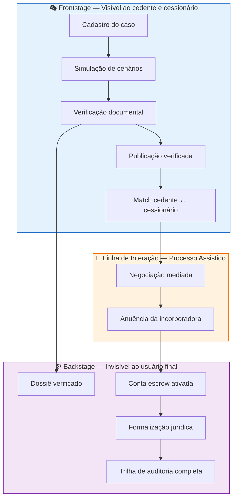
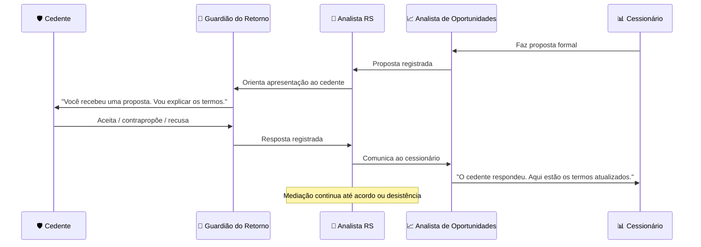

# 11 - Service Design

Fase: 3 — Produto
Área: Produto

<aside>
📋

**Documento Normativo — Repasse Seguro**

Este documento é referência obrigatória para decisões de produto, UX, operações e estratégia da Repasse Seguro. Qualquer feature ou fluxo que contradiga o que está aqui deve ser revisado antes de implementação.

</aside>

---

## Service Design — Repasse Seguro

### Blueprint da Jornada Completa da Infraestrutura de Formalização de Cessões

| **Destinatário** | Shift Labs — Produto, UX, Marketing, Comercial, Jurídico, Engenharia, CS, Operações |
| --- | --- |
| **Escopo** | Service Design da Repasse Seguro: mapa de atores, camadas de serviço, blueprint da jornada em 9 estados, modelo de processo assistido (IA + humano), anti-padrões, KPIs por etapa, variações por perfil e visão futura. |
| **Versão** | v2.1 |
| **Responsável** | Fernando Calado |
| **Data da versão** | 25/02/2026 17:16 (America/Fortaleza) |

---

<aside>
📌

**TL;DR**

- A Repasse Seguro é uma **infraestrutura de formalização de cessões imobiliárias** — o terceiro caminho entre distrato punitivo e contrato de gaveta.
- **Jornada completa de serviço** mapeada em **9 estados**: do primeiro contato do cedente à formalização concluída, com blueprint detalhado.
- **Processo Assistido** em cada ponto de contato: a IA (Guardião do Retorno / Analista de Oportunidades) prepara o terreno → o profissional (analista RS, corretor, advogado) fecha a formalização.
- **Propósito Triplo** como filtro: toda interação gera valor em 3 dimensões — 🛡️ recuperação patrimonial (cedente) · 📊 oportunidade verificada (cessionário) · 🧠 inteligência de mercado (ecossistema).
- **Ciclo de 45-60 dias** do cadastro à formalização. Breakeven estimado em **~3 casos/mês**.
- Comissão **20%/20%** (cedente/cessionário) sobre resultado — se não fecha, ninguém paga.
- Todo o doc alinhado com os **4 Princípios de Voz** (Clareza, Seriedade sem frieza, Transparência radical, Empoderamento sem promessa), **Memorando de Essência v2.0** e os **6 Princípios Inegociáveis**.
</aside>

---

# 1. Visão Geral — O que é Service Design no Contexto Repasse Seguro

O Service Design da Repasse Seguro responde à pergunta: **"Como a jornada funciona?"**

Enquanto o Design Thinking mapeia *para quem* desenhamos e o JTBD define *que trabalho* resolvemos, o Service Design orquestra *como cada momento da experiência se conecta* — do frontstage (cedente + cessionário) ao backstage (verificação documental + anuência + formalização).

## 1.1 Princípios Fundadores

| **Princípio** | **O que significa** | **Na prática RS** |
| --- | --- | --- |
| Processo Assistido | IA e profissional atuam juntos, nunca sozinhos | A IA orienta e organiza; o profissional (analista, corretor, advogado) valida e formaliza |
| Propósito Triplo | Toda interação deve gerar valor em 3 dimensões | 🛡️ Recuperação patrimonial · 📊 Oportunidade verificada · 🧠 Inteligência de mercado |
| Comissão sobre Resultado | Se não fecha, ninguém paga | 20%/20% (cedente + cessionário) — só cobrado após formalização concluída |
| Terceiro Caminho | Nem distrato punitivo, nem informalidade arriscada | Formalização com dossiê verificado, conta escrow e trilha de auditoria |
| Confiança como Infraestrutura | Cada etapa gera evidência auditável | Trilha de auditoria em cada mudança de estado — nada acontece "por fora" |

## 1.2 Teste Ácido do Service Design

> *Se substituir "Repasse Seguro" por qualquer classificado de imóveis e a jornada continuar fazendo sentido, o desenho falhou.*
> 

Cada ponto de contato deve carregar os diferenciais: dossiê verificado, processo assistido, conta escrow, trilha de auditoria e comissão sobre resultado.

---

# 2. Mapa de Atores e Camadas

## 2.1 Atores do Ecossistema

| **Ator** | **Papel** | **Motivação principal** |  |
| --- | --- | --- | --- |
| 🛡️ **Cedente PF** | Quem precisa sair do contrato de imóvel na planta | Recuperar patrimônio sem distrato punitivo |  |
| 📊 **Cessionário** | Comprador/investidor que quer imóvel abaixo da tabela com segurança | Oportunidade verificada, sem risco de gaveta |  |
| 🤝 **Corretor / Advogado** | Parceiro profissional que indica clientes | Comissão justa, não perder o cliente, manter credibilidade |  |
| 🏢 **Incorporadora** | Gestora do contrato original — concede anuência | Reduzir distratos, manter contratos ativos, compliance |  |
| 🤖 **Guardião do Retorno** (IA) | IA voltada ao cedente — empática, educativa, orientadora | Acolher, simular cenários, acompanhar o caso |  |
| 📈 **Analista de Oportunidades** (IA) | IA voltada ao cessionário — analítica, objetiva, orientada a dados | Curadoria verificada, Δ documentado, comparação |  |
| 👤 **Analista RS** | Profissional humano da Repasse Seguro | Verificar dossiê, mediar negociação, garantir formalização |  |

## 2.2 As 3 Camadas do Service Design

---

# 3. Os 9 Estados do Ciclo de Cessão

Antes do blueprint detalhado, é essencial entender os **9 estados** que um caso percorre na Repasse Seguro:

| **#** | **Estado** | **Descrição** | **Ator principal** |
| --- | --- | --- | --- |
| 1 | **Cadastro** | Cedente registra o caso na plataforma | Cedente + Guardião do Retorno |
| 2 | **Simulação** | Cedente visualiza cenários A/B/C/D de retorno | Cedente + Guardião do Retorno |
| 3 | **Verificação** | Analista RS verifica documentação e monta dossiê | Analista RS |
| 4 | **Publicação** | Caso verificado é disponibilizado para cessionários | Plataforma |
| 5 | **Match** | Cessionário demonstra interesse em caso verificado | Cessionário + Analista de Oportunidades |
| 6 | **Negociação** | Mediação entre cedente e cessionário — proposta, contraproposta, acordo | Cedente + Cessionário + Analista RS |
| 7 | **Anuência** | Incorporadora aprova formalmente a cessão | Incorporadora + Analista RS |
| 8 | **Formalização** | Assinatura do contrato de cessão, ativação de escrow, transferência | Todos os atores |
| 9 | **Concluído** | Cessão formalizada — pagamentos realizados, trilha completa | Plataforma (registro) |

<aside>
💡

**Ciclo esperado:** 45-60 dias do estado 1 (Cadastro) ao estado 9 (Concluído). Cada mudança de estado é registrada na trilha de auditoria e comunicada proativamente ao cedente e cessionário.

</aside>

## 3.1 Mapeamento: 9 Estados Estratégicos → 13 Estados Operacionais

O Service Design define **9 estados** da jornada (visão do cedente e do cessionário). A [01 — Regras de Negócio](https://www.notion.so/01-Regras-de-Neg-cio-30ed824e597f805699b1c2eff488e603?pvs=21) (v4.4) implementa essa jornada com **13 estados operacionais**, adicionando granularidade para triagem, bloqueio, reversão e controle administrativo.

A tabela abaixo conecta os dois modelos e define **quais estados são visíveis** ao cedente e ao cessionário (incorporando a Ação 3 da auditoria — visibilidade de estados):

| **Estado Estratégico (SD)** | **Estado(s) Operacional(is) (Regra v4.4)** | **Camada** | **Cedente vê** | **Cessionário vê** |
| --- | --- | --- | --- | --- |
| 1 — Cadastro
2 — Simulação | **Captado** | 🎭 Frontstage | ✅ "Caso registrado" | — |
| 3 — Verificação | **Em Triagem** | ⚙️ Backstage | ⚠️ "Em análise" | — |
| 3 — Verificação (bloqueio) | **Bloqueado** | ⚙️ Backstage | ⚠️ "Pendência identificada" | — |
| 3 — Verificação (aprovado) | **Qualificado** | ⚙️ Backstage | ✅ "Documentação aprovada" | — |
| 4 — Publicação
5 — Match | **Oferta Ativa** | 🎭 Frontstage | ✅ "Disponível para interessados" | ✅ "Oportunidade verificada" |
| 6 — Negociação | **Em Negociação** | 🤝 Linha de Interação | ✅ "Proposta recebida" | ✅ "Em negociação" |
| 7 — Anuência
8 — Formalização | **Em Formalização** | ⚙️ Backstage | ✅ "Em formalização" | ✅ "Aguardando assinatura" |
| 8 — Formalização (4/4 critérios) | **Fechamento** | 🎭 Frontstage | ✅ "Caso fechado!" | ✅ "Caso fechado!" |
| 9 — Concluído (retenção 15d) | **Pós Fechamento** | ⚙️ → 🎭 | ⚠️ "Aguardando confirmação final" | ⚠️ "Aguardando confirmação final" |
| *(sem equivalência estratégica)* | **Em Mediação** | ⚙️ Backstage | ⚠️ "Em análise de reversão" | ⚠️ "Em análise de reversão" |
| 9 — Concluído | **Concluído** | 🎭 Frontstage | ✅ "Concluído — valor transferido" | ✅ "Contrato formalizado" |
| *(transversal — qualquer estado)* | **Cancelado** | Terminal | ✅ "Caso cancelado" | ✅ "Caso cancelado" |
| *(sem equivalência — pós-fechamento)* | **Revertido** | Terminal | ✅ "Caso revertido — valores estornados" | ✅ "Valores estornados" |

<aside>
🔍

**Observações-chave sobre o mapeamento**

1. **Compressão 2→1 (Cadastro + Simulação → Captado):** A simulação de cenários acontece *dentro* do cadastro, antes de entrar na esteira operacional. Para o Admin, é um único estado.
2. **Expansão 1→3 (Verificação → Em Triagem · Bloqueado · Qualificado):** O estado estratégico mais simples se desdobra em 3 estados operacionais para controlar dossiê, adimplência e desbloqueio.
3. **Compressão 2→1 (Publicação + Match → Oferta Ativa):** O match é a *transição* para negociação, não um estado com SLA próprio. Na prática, ambos vivem sob "Oferta Ativa".
4. **Compressão 2→1 (Anuência + Formalização → Em Formalização):** A Regra trata anuência como *critério 3 dos 4 critérios paralelos* do Fechamento (Regra 07), não como etapa sequencial.
5. **Expansão 1→2 (Concluído → Pós Fechamento · Concluído):** Os 15 dias de retenção na Conta Escrow (Regra 06) criam um estado intermediário invisível no modelo estratégico.
6. **3 estados sem equivalência estratégica:** *Em Mediação* (reversão contestada, Regra 09), *Cancelado* (terminal de qualquer estado) e *Revertido* (terminal pós-fechamento com estorno integral) existem apenas no modelo operacional.
</aside>

### Regra de visibilidade

> **Princípio:** O cedente e o cessionário **nunca** veem os nomes operacionais dos estados. Eles veem mensagens em linguagem acessível, alinhadas com os 4 Princípios de Voz. Os nomes operacionais (Captado, Em Triagem, Qualificado…) são visíveis apenas para o Admin.
> 

| **Símbolo** | **Significado** | **Exemplo** |
| --- | --- | --- |
| ✅ | **Visível** — o usuário recebe notificação proativa com status claro | "Seu caso foi registrado" · "Caso fechado!" |
| ⚠️ | **Parcialmente visível** — o usuário vê um status genérico, sem detalhes internos | "Em análise" (não vê se está "Em Triagem" ou "Bloqueado") |
| — | **Não aplicável** — o ator não participa neste momento da jornada | Cessionário não vê nada durante Cadastro/Verificação |

<aside>
⚠️

**Atenção para Produto e UX:** As mensagens na coluna "Cedente vê" e "Cessionário vê" são *sugestões de tom* — os textos finais devem ser definidos no [12 - UX Writing](12%20-%20UX%20Writing%20312d824e597f80f7bbcec784b9830523.md), seguindo os 4 Princípios de Voz e as diretrizes do [07 - Tom de Voz e Identidade Verbal](07%20-%20Tom%20de%20Voz%20e%20Identidade%20Verbal%20303d824e597f80c6bb3ff800a72f0c72.md).

</aside>

---

# 4. Blueprint da Jornada — Estado a Estado

## Estado 1 — Cadastro

| **Dimensão** | **Detalhe** |
| --- | --- |
| **Ação do cedente** | Acessa a RS (via indicação, busca orgânica ou encaminhamento da incorporadora). Inicia cadastro do caso. |
| **Ação da IA (Guardião do Retorno)** | Acolhe o cedente, explica o processo em linguagem acessível, orienta sobre documentação necessária. Tom empático, calmo, educativo. |
| **Ação do Analista RS** | Recebe notificação de novo caso. Não intervém ainda — Guardião conduz. |
| **Propósito Triplo** | 🛡️ Cedente descobre alternativa ao distrato · 📊 Caso registrado no sistema · 🧠 Dados de perfil de cedente coletados |
| **Ponto de atenção** | Formulário mínimo viável — não pedir tudo de uma vez. Cadastro progressivo. Alta fricção = abandono alto. |

**Tom de voz do Guardião do Retorno neste momento:**

> *"Você está no lugar certo. Vou te ajudar a entender suas opções antes de qualquer decisão. Primeiro, me conta: qual é a situação do seu contrato?"*
> 

**Anti-padrão** ❌ — Formulário jurídico extenso como primeira tela. Isso afasta quem já está vulnerável.

---

## Estado 2 — Simulação de Cenários

| **Dimensão** | **Detalhe** |
| --- | --- |
| **Ação do cedente** | Visualiza os 4 cenários de retorno (A/B/C/D) comparando distrato vs cessão com dados reais. |
| **Ação da IA** | Apresenta simulação com fórmula visível, fonte e data. Explica cada cenário em linguagem acessível. Nunca promete — apresenta cenários. |
| **Ação do Analista RS** | Disponível para dúvidas mais complexas — o Guardião escala quando necessário. |
| **Propósito Triplo** | 🛡️ Empoderamento com dados, não com promessa · 📊 Cenários servem de base para negociação futura · 🧠 Dados de mercado secundário enriquecidos |

**Tom de voz do Guardião:**

> *"Aqui estão seus cenários. No distrato, você recuperaria aproximadamente X. Com a cessão, os cenários variam de Y a Z dependendo das condições. Vou explicar cada um."*
> 

**Anti-padrão** ❌ — Simulação que parece promessa de resultado. É cenário, não garantia.

---

## Estado 3 — Verificação Documental

| **Dimensão** | **Detalhe** |
| --- | --- |
| **Ação do cedente** | Envia documentação solicitada (contrato, comprovantes, certidões). |
| **Ação da IA** | Orienta sobre cada documento necessário, valida completude, notifica sobre pendências. |
| **Ação do Analista RS** | **Momento-chave do processo assistido:** verifica autenticidade, monta o dossiê, calcula Δ documentado. |
| **Propósito Triplo** | 🛡️ Segurança jurídica para o cedente · 📊 Dossiê verificado para o cessionário · 🧠 Base de dados documental estruturada |
| **Entregável** | **Dossiê verificado** — documento central que acompanha o caso até a formalização. |

<aside>
🎯

**Insight**

O dossiê verificado é o **ativo mais valioso** da RS. Sem ele, somos mais um classificado. Com ele, somos infraestrutura de confiança. Nenhum caso avança para publicação sem dossiê completo.

</aside>

**Anti-padrão** ❌ — Publicar caso sem verificação para "ganhar velocidade". Isso destrói confiança.

---

## Estado 4 — Publicação Verificada

| **Dimensão** | **Detalhe** |
| --- | --- |
| **Ação do cedente** | Recebe notificação: "Seu caso foi verificado e está disponível para interessados." Acompanha pelo dashboard. |
| **Ação da plataforma** | Caso publicado com ficha completa: localização, incorporadora, Δ, estágio da obra, dossiê auditável. |
| **Ação da IA (Analista de Oportunidades)** | Entra em cena voltada ao cessionário: apresenta oportunidade com dados, comparações e análise do Δ. |
| **Propósito Triplo** | 🛡️ Caso do cedente entra no mercado com proteção · 📊 Cessionário acessa oportunidade auditada · 🧠 Dados de oferta alimentam inteligência de mercado |

**Tom de voz do Analista de Oportunidades:**

> *"Nova oportunidade verificada: apartamento 2 quartos, incorporadora X, Δ de 18% documentado. Dossiê completo disponível. Quer ver os detalhes?"*
> 

**Anti-padrão** ❌ — Apresentar oportunidade sem Δ ou sem fonte documental. Parece classificado, não infraestrutura.

---

## Estado 5 — Match

| **Dimensão** | **Detalhe** |
| --- | --- |
| **Ação do cessionário** | Demonstra interesse no caso verificado. Acessa dossiê completo. Solicita mais informações ou faz proposta. |
| **Ação da IA** | Analista de Oportunidades responde dúvidas, apresenta comparações, orienta sobre processo de proposta. |
| **Ação do cedente** | Recebe notificação: "Há um interessado verificado no seu caso." Acompanha pelo dashboard. |
| **Propósito Triplo** | 🛡️ Cedente sabe que há interesse real · 📊 Cessionário toma decisão informada · 🧠 Dados de demanda por perfil de imóvel |

**Anti-padrão** ❌ — Cessionário fazer proposta sem ter visto o dossiê completo. Decisão sem dados gera problema depois.

---

## Estado 6 — Negociação Mediada

| **Dimensão** | **Detalhe** |
| --- | --- |
| **Ação do cedente** | Recebe proposta do cessionário. Aceita, contrapropõe ou recusa — com orientação do Guardião. |
| **Ação do cessionário** | Faz proposta formal. Aguarda resposta. Ajusta conforme contraproposta. |
| **Ação do Analista RS** | **Mediação profissional:** facilita a negociação, esclarece termos, garante que ambos entendem condições. |
| **Propósito Triplo** | 🛡️ Cedente negocia com suporte, nunca pressionado · 📊 Cessionário tem clareza de condições · 🧠 Dados de negociação enriquecem inteligência de precificação |

**Fluxo do Processo Assistido nesta etapa:**

**Anti-padrão** ❌ — Cedente e cessionário negociando diretamente sem mediação. Isso vira gaveta digital.

---

## Estado 7 — Anuência da Incorporadora

| **Dimensão** | **Detalhe** |
| --- | --- |
| **Ação da incorporadora** | Recebe solicitação de anuência com dossiê completo via plataforma. Aprova, recusa ou solicita ajuste. |
| **Ação do Analista RS** | Prepara e envia documentação para anuência. Acompanha prazos. Escala quando necessário. |
| **Ação do cedente / cessionário** | Acompanham o status pelo dashboard. Recebem notificações de progresso. |
| **Propósito Triplo** | 🛡️ Compliance garantido · 📊 Formalização avança com segurança · 🧠 Dados de taxa e tempo de anuência por incorporadora |
| **Ponto de atenção** | Este estado depende de terceiros (incorporadora). Gestão de expectativa é crítica — comunicar prazos realistas. |

**Anti-padrão** ❌ — Avançar para formalização sem anuência documentada. Isso gera risco jurídico grave.

---

## Estado 8 — Formalização

| **Dimensão** | **Detalhe** |
| --- | --- |
| **Ação do cedente** | Assina contrato de cessão. Confirma termos finais. |
| **Ação do cessionário** | Assina contrato de cessão. Deposita valor na conta escrow. |
| **Ação do Analista RS** | Coordena assinaturas, ativa conta escrow, verifica conformidade de todos os documentos. |
| **Ação da plataforma** | Conta escrow ativada — dinheiro protegido até confirmação de formalização completa. |
| **Propósito Triplo** | 🛡️ Patrimônio do cedente protegido via escrow · 📊 Cessionário sabe que o dinheiro só é liberado com tudo formalizado · 🧠 Dados de formalização consolidados |

<aside>
🎯

**Insight**

A conta escrow é o **coração da confiança transacional** da RS. Sem ela, somos mais um intermediário. Com ela, o dinheiro só muda de mãos quando tudo está formalizado — proteção para ambas as partes.

</aside>

**Anti-padrão** ❌ — Transferência direta entre cedente e cessionário sem escrow. Isso é gaveta com landing page.

---

## Estado 9 — Concluído

| **Dimensão** | **Detalhe** |
| --- | --- |
| **Ação do cedente** | Recebe o valor da cessão (descontada comissão). Caso encerrado com sucesso. |
| **Ação do cessionário** | Contrato de cessão formalizado em seu nome. Assume obrigações com a incorporadora. |
| **Ação da plataforma** | Libera escrow, registra comissões (20%/20%), consolida trilha de auditoria completa, atualiza dados de mercado. |
| **Propósito Triplo** | 🛡️ Patrimônio recuperado · 📊 Investimento formalizado · 🧠 Caso completo alimenta inteligência de precificação |

**Tom de voz do Guardião do Retorno no encerramento:**

> *"Seu caso foi concluído com sucesso. O valor foi transferido e toda a documentação está disponível na sua área. Parabéns por ter escolhido o caminho seguro."*
> 

**Anti-padrão** ❌ — Encerrar sem comunicação clara ou sem disponibilizar documentação final. O cedente precisa sentir que "fechou o ciclo".

---

# 5. Modelo de Processo Assistido — Matriz de Responsabilidades

| **Estado** | **IA faz** | **Profissional humano faz** | **Quem lidera** |
| --- | --- | --- | --- |
| 1 — Cadastro | Acolhe, orienta, coleta dados mínimos | Recebe notificação, não intervém ainda | 🤖 Guardião do Retorno |
| 2 — Simulação | Apresenta cenários com dados, explica | Disponível para dúvidas complexas | 🤖 Guardião do Retorno |
| 3 — Verificação | Orienta sobre documentos, valida completude | Verifica autenticidade, monta dossiê, calcula Δ | 👤 Analista RS |
| 4 — Publicação | Notifica cedente. Analista de Oportunidades apresenta ao cessionário. | Revisa ficha antes da publicação | 🤝 Ambos |
| 5 — Match | Responde dúvidas do cessionário, apresenta comparações | Facilita contato quando necessário | 📈 Analista de Oportunidades |
| 6 — Negociação | Orienta cedente e cessionário sobre termos | Media negociação, esclarece condições | 👤 Analista RS |
| 7 — Anuência | Notifica sobre progresso e prazos | Prepara documentação, acompanha incorporadora | 👤 Analista RS |
| 8 — Formalização | Orienta sobre assinaturas e próximos passos | Coordena assinaturas, ativa escrow, verifica compliance | 👤 Analista RS |
| 9 — Concluído | Agradecimento personalizado, disponibiliza documentação | Confirma liberação de escrow, registra conclusão | 🤝 Ambos |

> **Regra de ouro:** a IA nunca substitui o humano nos momentos de decisão patrimonial (negociação, anuência, formalização). A IA brilha nos momentos de orientação e informação (cadastro, simulação, acompanhamento).
> 

---

# 6. Jornada por Perfil de Cedente — Variações de Contexto

Cada perfil de cedente gera variações na jornada:

| **Perfil** | **Variação na jornada** | **Desafio principal** |  |
| --- | --- | --- | --- |
| Divórcio / separação | Urgência emocional alta, possível conflito entre partes, necessidade de acolhimento extra | Tom empático sem ser condescendente. Guardião deve ser paciente e calmo. |  |
| Perda de renda / desemprego | Pressão financeira imediata, risco de inadimplência, necessidade de velocidade | Gestão de expectativa sobre prazo (45-60 dias). Simulação de cenários é crítica. |  |
| Mudança de cidade | Processo 100% remoto, menos urgência emocional, mais pragmatismo | Experiência digital impecável — sem necessidade de presença física em nenhum momento. |  |
| Investidor que precisa de liquidez | Perfil mais racional, busca maximização do retorno, pode negociar duro | Δ bem documentado e cenários comparativos são o argumento principal. |  |
| Arrependimento da compra | Culpa e desinformação, pode abandonar processo por vergonha | Guardião deve normalizar a situação: "Isso é mais comum do que você imagina." |  |

---

# 7. Métricas do Service Design — KPIs por Estado

| **Estado** | **KPI primário** | **Meta** | **Fonte** |
| --- | --- | --- | --- |
| 1 — Cadastro | Taxa de conclusão do cadastro | ≥ 70% | Analytics de funil |
| 2 — Simulação | Taxa de avanço (simulação → verificação) | ≥ 60% | Analytics de funil |
| 3 — Verificação | Tempo médio de verificação | ≤ 5 dias úteis | SLA interno |
| 4 — Publicação | Tempo até primeiro match | ≤ 15 dias | Analytics de plataforma |
| 5 — Match | Taxa de conversão (match → proposta) | ≥ 40% | Analytics de funil |
| 6 — Negociação | Taxa de acordo | ≥ 60% | Registro de negociações |
| 7 — Anuência | Tempo médio de anuência | ≤ 10 dias úteis | SLA por incorporadora |
| 8 — Formalização | Taxa de conclusão (anuência → formalizado) | ≥ 90% | Registro de casos |
| 9 — Concluído | NPS do cedente + NPS do cessionário | ≥ 70 | Pesquisa pós-caso |
| **Transversal** | Ciclo total (cadastro → concluído) | 45-60 dias | Timestamp de estados |
| **Transversal** | Breakeven operacional | ~3 casos/mês | Unit economics |

---

# 8. Anti-Padrões — O que NÃO Fazer

<aside>
🚫

**Lista de anti-padrões críticos** — se você identificar algum desses no produto, é bug de experiência.

</aside>

| **Anti-padrão** | **Por que é errado** | **O que fazer em vez disso** |
| --- | --- | --- |
| Publicar caso sem verificação documental | Destrói confiança — diferencial core da RS. Vira classificado. | Sempre completar dossiê verificado antes da publicação |
| Transferência sem conta escrow | Elimina proteção transacional — vira gaveta digital | Todo pagamento passa pela conta escrow |
| Negociação direta sem mediação | Sem profissional mediando, o processo informaliza | Analista RS sempre presente na negociação |
| Formalização sem anuência da incorporadora | Risco jurídico grave — cessão pode ser invalidada | Anuência documentada é pré-requisito obrigatório |
| Simulação que parece promessa de resultado | Quebra "Empoderamento sem promessa" — gera expectativa irreal | Sempre apresentar como cenários, com fonte e metodologia visíveis |
| Tom jurídico ou burocrático com o cedente | Cedente já está vulnerável — linguagem técnica afasta | Seguir os 4 Princípios de Voz. Guardião é Cuidador, não advogado. |
| Ignorar acompanhamento entre estados | Cedente se sente abandonado — abandona o processo | Notificações proativas a cada mudança de estado + check-ins entre estados longos |
| Apresentar Δ sem fonte ou metodologia | Parece inflado ou irreal — cessionário desconfia | Transparência radical: fonte, cálculo, data. Sempre. |

---

# 9. Visão Futura — Além da Versão Inicial

<aside>
🔮

**Importante:** Esta seção documenta a **visão de longo prazo**, não a versão inicial. Nenhum item abaixo está no escopo de lançamento.

</aside>

| **Capacidade futura** | **Impacto na jornada** | **Dependência** |  |
| --- | --- | --- | --- |
| Integração com cartórios digitais | Formalização jurídica sem presença física — ciclo mais rápido | APIs de cartórios / plataformas notariais |  |
| API de anuência com incorporadoras | Anuência solicitada e aprovada digitalmente — reduz tempo do estado 7 | Parceria técnica com incorporadoras |  |
| Score de risco do caso | IA avalia probabilidade de conclusão com base em histórico — priorização inteligente | Volume de dados suficiente para modelagem |  |
| Marketplace secundário de cessões recorrentes | Investidores recorrentes com fluxo contínuo de oportunidades verificadas | Base de casos e cessionários suficiente |  |
| Dashboard de inteligência para incorporadoras | Dados em tempo real: volume de cessões, perfil de cedentes, Δ por empreendimento | Parcerias B2B + engine de analytics |  |
| Memória de caso entre interações | Guardião e Analista lembram do contexto anterior — experiência contínua | Persistência de contexto na IA |  |

---

# 10. Conexão com os 4 Princípios de Voz

Cada estado da jornada ativa diferentes Princípios de Voz:

| **Estado** | **Princípio dominante** | **Por quê** |
| --- | --- | --- |
| 1 — Cadastro | Clareza acima de tudo + Empoderamento sem promessa | Acolhimento claro sem criar expectativa irreal |
| 2 — Simulação | Transparência radical + Empoderamento sem promessa | Dados visíveis, cenários com fonte — nunca promessa |
| 3 — Verificação | Seriedade sem frieza + Clareza | Processo rigoroso comunicado com humanidade |
| 4 — Publicação | Transparência radical + Clareza | Ficha com dados completos, Δ documentado, dossiê visível |
| 5 — Match | Transparência radical + Clareza | Cessionário toma decisão com base em dados, não em promessas |
| 6 — Negociação | Seriedade sem frieza + Empoderamento sem promessa | Mediação profissional, termos claros, sem pressão |
| 7 — Anuência | Seriedade sem frieza + Transparência radical | Processo institucional com prazos realistas |
| 8 — Formalização | Clareza acima de tudo + Seriedade sem frieza | Precisão nos termos, confiança no processo |
| 9 — Concluído | Empoderamento sem promessa + Clareza | Reconhecimento genuíno, documentação acessível |

---

# 11. Referências Cruzadas — Mapa do Ecossistema Documental

<aside>
📌

**Este documento faz parte do ecossistema de docs estratégicos da Repasse Seguro.** Para aprofundamento, consulte as fontes abaixo.

</aside>

| **Documento** | **O que responde** | **Link** |
| --- | --- | --- |
| **Memorando de Essência** | O que somos — identidade, propósito triplo, teste ácido, 6 princípios | [05 - Memorando de Essência](05%20-%20Memorando%20de%20Ess%C3%AAncia%20312d824e597f807fb684d0bd73affebd.md) |
| **Manifesto da Marca** | Por que existimos — nome, território, arquétipos, princípios | [04 - Manifesto da Marca](04%20-%20Manifesto%20da%20Marca%20303d824e597f8023bc06f5f40b1e40ea.md) |
| **Tom de Voz e Identidade Verbal** | Como falamos — 4 princípios, vocabulário, régua de formalidade | [07 - Tom de Voz e Identidade Verbal](07%20-%20Tom%20de%20Voz%20e%20Identidade%20Verbal%20303d824e597f80c6bb3ff800a72f0c72.md) |
| **Design Thinking** | Para quem desenhamos — personas, dores, ideação centrada no usuário | [09 - Design Thinking](09%20-%20Design%20Thinking%20312d824e597f80369f96dfc32ef9101a.md) |
| **Jobs To Be Done** | Que "trabalho" cada ator resolve com a RS | [10 - Jobs To Be Done](10%20-%20Jobs%20To%20Be%20Done%20312d824e597f809cbc23ef6b1a495514.md) |
| **Casos de Uso** | Cenários práticos — o que a RS faz em cada situação real | [08 - Casos de Uso](08%20-%20Casos%20de%20Uso%20312d824e597f809fa5bbc5e9bd29efd7.md) |
| **UX Writing** | Textos específicos de cada tela e interação | [12 - UX Writing](12%20-%20UX%20Writing%20312d824e597f80f7bbcec784b9830523.md) |
| **Modelo de Negócios** | Comissões, unit economics, ciclo de estados | [14 - Modelo de Negócios](14%20-%20Modelo%20de%20Neg%C3%B3cios%20301d824e597f8003891ac9058bb4f812.md) |
| **Proposta de Valor** | Por que contratar — ROI, cenários, argumentos | [15 - Proposta de Valor - Cedente/Cessionário](15%20-%20Proposta%20de%20Valor%20-%20Cedente%20Cession%C3%A1rio%20303d824e597f80ef8783f56e9efc039a.md) |
| **One-Liner e ICPs** | 5 ICPs, one-liners oficiais, anti-ICP | [03 - One-Liner e ICPs](03%20-%20One-Liner%20e%20ICPs%20301d824e597f8076a76ad0ef11fe3804.md) |

### Mapa do Ecossistema

<aside>
🗺️

[05 - Memorando de Essência](05%20-%20Memorando%20de%20Ess%C3%AAncia%20312d824e597f807fb684d0bd73affebd.md) → "O que somos"

[04 - Manifesto da Marca](04%20-%20Manifesto%20da%20Marca%20303d824e597f8023bc06f5f40b1e40ea.md) → "Por que existimos"

[07 - Tom de Voz e Identidade Verbal](07%20-%20Tom%20de%20Voz%20e%20Identidade%20Verbal%20303d824e597f80c6bb3ff800a72f0c72.md) → "Como falamos"

[09 - Design Thinking](09%20-%20Design%20Thinking%20312d824e597f80369f96dfc32ef9101a.md) → "Para quem desenhamos"

[10 - Jobs To Be Done](10%20-%20Jobs%20To%20Be%20Done%20312d824e597f809cbc23ef6b1a495514.md) → "Que trabalho resolvemos"

**Service Design** → "Como a jornada funciona" *(você está aqui)*

[08 - Casos de Uso](08%20-%20Casos%20de%20Uso%20312d824e597f809fa5bbc5e9bd29efd7.md) → "O que a RS faz na prática"

</aside>

---

# 12. Changelog

| **#** | **Versão** | **Data** | **Mudanças** |
| --- | --- | --- | --- |
| 1 | **v1.0** | 25/02/2026 | Versão inicial criada para o Menux (perspectiva incorreta). |
| 2 | **v2.0** | 25/02/2026 | **Reescrita completa para Repasse Seguro.** Jornada reestruturada em 9 estados do ciclo de cessão (Cadastro → Concluído). 7 atores mapeados (cedente, cessionário, corretor/advogado, incorporadora, Guardião do Retorno, Analista de Oportunidades, Analista RS). Blueprint estado a estado com ações, propósito triplo e anti-padrões. Modelo de Processo Assistido com matriz de responsabilidades. KPIs por estado. Variações por perfil de cedente. Anti-padrões adaptados. Visão futura. Conexão com 4 Princípios de Voz. Referências cruzadas atualizadas para ecossistema RS. |
| 3 | **v2.1** | 25/02/2026 | **Seção 3.1 — Mapeamento de Estados (Ações 2 + 3 da auditoria).** Adicionada tabela de correspondência entre os 9 estados estratégicos (Service Design) e os 13 estados operacionais (Regra de Negócios v4.4). Incluída regra de visibilidade: quais estados o cedente e o cessionário veem vs. estados internos do Admin. Observações-chave sobre compressões (2→1) e expansões (1→3) entre os modelos. Referência cruzada com UX Writing e Tom de Voz para textos finais das mensagens de status. |