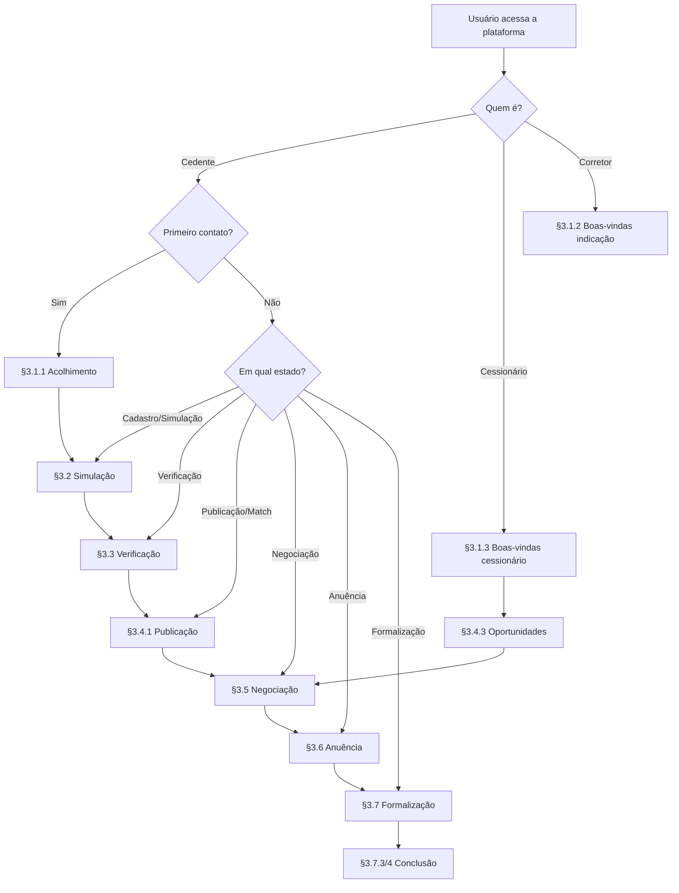

# 12 - UX Writing

Fase: 3 — Produto
Área: Produto

<aside>
📋

**Documento Normativo — Repasse Seguro**

Este documento é referência obrigatória para decisões de produto, UX, operações e estratégia da Repasse Seguro. Qualquer feature ou fluxo que contradiga o que está aqui deve ser revisado antes de implementação.

</aside>

---

## UX Writing — Repasse Seguro

### Diretrizes de Microcopy para a Infraestrutura de Formalização de Cessões

| **Destinatário** | Shift Labs — Produto, UX, Marketing, Comercial, Jurídico, Engenharia, CS, Operações |
| --- | --- |
| **Escopo** | UX Writing da Repasse Seguro: microcopy, templates por estado do ciclo, princípios de escrita, variação por ator, edge cases, frases proibidas, KPIs de qualidade e gate de validação. |
| **Versão** | v2.0 |
| **Responsável** | Fernando Calado |
| **Data da versão** | 25/02/2026 11:41 (America/Fortaleza) |

---

<aside>
📌

**TL;DR**

- **UX Writing é a camada de texto que materializa o Guardião do Retorno e o Analista de Oportunidades na interface** — cada palavra importa para a confiança do cedente e do cessionário.
- **Princípio de confiança:** 1 dado verificado + 1 explicação acessível + 1 próximo passo claro.
- **Templates diferenciados por ator:** Cedente (acolhimento e empoderamento), Cessionário (dados e objetividade), Corretor/Advogado (profissionalismo e parceria).
- **Cobertura dos 15 Casos de Uso v2.0** com templates específicos e mapeamento completo.
- **Gate de qualidade:** toda copy deve reduzir incerteza sem gerar expectativa irreal.
- Alinhado com os **4 Princípios de Voz** (Clareza, Seriedade sem frieza, Transparência radical, Empoderamento sem promessa).
</aside>

---

# 1. Visão Geral e Escopo

## 1.1 Objetivo do Documento

Este documento define **como a Repasse Seguro escreve** — os textos, microcopies, mensagens de erro e templates que aparecem na interface durante toda a jornada dos 9 estados da cessão.

### 1.1.1 O que Este Documento É

- Biblioteca de templates de microcopy organizados por estado da jornada e por ator
- Padrões de escrita que garantem consistência de voz em toda a interface
- Referência prática para UX, Produto e Marketing validarem textos antes de publicar

### 1.1.2 O que Este Documento Não É

- Não define o papel estratégico das IAs (ver Service Design)
- Não define telemetria, eventos ou KPIs de produto
- Não define o posicionamento de marca (ver [07 - Tom de Voz e Identidade Verbal](07%20-%20Tom%20de%20Voz%20e%20Identidade%20Verbal%20303d824e597f80c6bb3ff800a72f0c72.md) e [05 - Memorando de Essência](05%20-%20Memorando%20de%20Ess%C3%AAncia%20312d824e597f807fb684d0bd73affebd.md))

## 1.2 Relação com Service Design e Casos de Uso

<aside>
🎯

**Divisão clara:**

- **Service Design** = como a jornada **funciona** (9 estados, processo assistido)
- **Casos de Uso** = o que a RS **faz** na prática (cenários reais com diálogos)
- **UX Writing** = o que a RS **diz na tela** (microcopy, templates, tom)
</aside>

Todo template aqui deve estar alinhado com os princípios definidos no Memorando de Essência e no Tom de Voz.

## 1.3 Contexto da Versão Inicial

Na versão inicial, a RS **não** integra com cartórios digitais, **não** tem API com incorporadoras, **não** faz score automatizado de risco.

Portanto, toda copy deve:

- Deixar claro que o **Analista RS valida e formaliza** — a IA orienta e organiza
- Nunca prometer automação que não existe
- Tratar dados e simulações como **cenários**, não como garantias

---

# 2. Princípios de Escrita

## 2.1 Tom de Voz na Interface

A RS fala como um **consultor patrimonial de confiança** — empático, transparente, objetivo e sempre com dados.

### 2.1.1 Características da Escrita

- **Frases curtas:** uma ideia por frase, máximo 2 linhas na tela
- **Orientador:** ajuda a entender e decidir, nunca pressiona
- **Contextual:** adapta fala ao momento (acolhimento, simulação, negociação, formalização)
- **Respeitoso:** nunca julga escolhas, nunca minimiza a situação
- **Direto:** sem jargão jurídico desnecessário ("instrumento", "outorgante", "anuente")

### 2.1.2 Variação de Postura por Ator

| **Ator** | **IA** | **Postura na Copy** |
| --- | --- | --- |
| **Cedente PF** | Guardião do Retorno | Empática, educativa, acolhedora. Simplifica linguagem jurídica. Nunca promete. Fórmula: *dado + explicação + próximo passo*. |
| **Cessionário** | Analista de Oportunidades | Analítica, objetiva, orientada a dados. Fórmula: *oportunidade + Δ documentado + comparação*. |
| **Corretor / Advogado** | Analista RS (humano) | Profissional, direta, focada em parceria. Respeita a relação profissional-cliente. |
| **Incorporadora** | Analista RS (humano) | Institucional, orientada a compliance. Dados agregados, sem expor cedentes individuais. |

## 2.2 Princípio de Confiança

<aside>
💡

**Regra de ouro de copy:** Toda informação relevante segue a fórmula:

**1 dado verificado + 1 explicação acessível + 1 próximo passo claro**

</aside>

### 2.2.1 Componentes

- **Dado verificado:** valor, percentual, prazo, fonte — sempre com origem documentada
- **Explicação acessível:** o que o dado significa na prática, sem jargão
- **Próximo passo:** ação clara e sem pressão que move a jornada

### 2.2.2 Exemplos Práticos

> "O Δ do seu caso é de **18%** — isso significa que o valor atual de tabela é 18% acima do que foi pago até agora. **Fonte:** tabela da incorporadora atualizada em jan/2026. Quer ver como isso se traduz nos cenários de retorno?"
> 

> "A incorporadora costuma responder anuências em **8 a 12 dias úteis**. Você vai receber uma notificação assim que houver resposta. Enquanto isso, a documentação continua protegida."
> 

### 2.2.3 Guardrails

- Evitar superlativos vazios ("oportunidade imperdível", "melhor negócio")
- Nunca criar urgência falsa ("última chance", "só hoje")
- Nunca usar linguagem de promessa ("garantimos", "você vai receber X")
- Sempre citar fonte e data de dados numéricos

## 2.3 Regras Gerais de Microcopy

### 2.3.1 Estrutura de Resposta

Toda resposta das IAs segue:

1. **Responder o que foi perguntado** (direto, sem rodeio)
2. **Contextualizar com dados** (fonte, valor, comparação)
3. **Indicar o próximo passo** (ação clara, sem pressão)

### 2.3.2 Limites de Texto

| **Tipo de Mensagem** | **Limite** |
| --- | --- |
| Boas-vindas / Primeiro contato | Máximo 3 frases |
| Explicação de conceito jurídico | Máximo 4 linhas (fórmula de confiança) |
| Simulação de cenário | Máximo 4 cenários com 2 linhas cada |
| Erro / fallback | Máximo 2 frases + 1 alternativa |
| Notificação de status | 1 estado + 1 explicação + 1 próximo passo |

### 2.3.3 Vocabulário Preferido

| **✅ Usar** | **❌ Evitar** |
| --- | --- |
| "cessão de direitos" | "repasse informal" / "venda do contrato" |
| "conta escrow" ou "conta de garantia" | "depósito judicial" / "caução" |
| "dossiê verificado" | "documentação" (genérico) |
| "cenário de retorno" | "previsão" / "garantia de valor" |
| "o analista vai validar" | "o sistema processou" |
| "Δ documentado" | "desconto" / "oportunidade imperdível" |
| "anuência da incorporadora" | "aprovação" (impreciso) |
| "se não fechar, ninguém paga" | "sem riscos" / "gratuito" |

## 2.4 Régua de Formalidade por Cenário

<aside>
📏

**Como o tom varia:** O nível de formalidade muda conforme a gravidade e o contexto. Use esta régua como referência ao validar qualquer copy.

</aside>

| **Cenário** | **Nível** | **Tom** | **Exemplo de Abertura** |
| --- | --- | --- | --- |
| Formalização / Escrow | 🔴 Alto | Preciso, rigoroso, sem margem para dúvida | "O valor será liberado somente após confirmação de todas as etapas." |
| Anuência negada / Problema | 🟠 Médio-alto | Transparente, direto, com alternativa clara | "A incorporadora não aprovou neste momento. O motivo informado foi..." |
| Negociação / Proposta | 🟡 Médio | Objetivo, neutro, com dados de ambos os lados | "Você recebeu uma proposta. Vou explicar os termos e comparar com o cenário de distrato." |
| Simulação / Exploração | 🟢 Médio-leve | Educativo, orientador, com dados acessíveis | "Aqui estão seus cenários. Vou explicar cada um em linguagem simples." |
| Primeiro contato / Acolhimento | 🔵 Leve | Empático, acolhedor, sem pressão | "Você está no lugar certo. Vou te ajudar a entender suas opções." |
| Cessionário explorando | 🟣 Analítico-direto | Dados em primeiro plano, objetivo, sem floreio | "Encontrei 3 oportunidades verificadas no seu perfil. Todas com dossiê completo." |

**Regra geral:** Quanto maior o risco patrimonial (formalização, escrow, anuência), mais formal e preciso o tom. Quanto mais educativo o momento (primeiro contato, simulação), mais acolhedor e acessível.

---

# 3. Templates por Estado da Jornada

## 3.1 Estado 1 — Cadastro (Primeiro Contato)

<aside>
🎯

**Objetivo:** Acolher, explicar o terceiro caminho em linguagem acessível, sem prometer resultados.

**Casos de Uso relacionados:** Caso 1, 2, 4, 15

</aside>

### 3.1.1 Template — Cedente (Guardião do Retorno)

> "Oi, eu sou o Guardião do Retorno. Estou aqui para te ajudar a entender suas opções com o contrato de imóvel na planta. Vou te orientar passo a passo — sem jargão jurídico, sem pressão. Me conta: qual é a situação do seu contrato?"
> 

### 3.1.2 Template — Cedente via indicação de corretor

> "Oi, você foi indicado por [nome do corretor/advogado]. Estou aqui para te ajudar a entender como a cessão pode ser uma alternativa ao distrato. Vamos começar com algumas perguntas simples sobre o seu contrato?"
> 

### 3.1.3 Template — Cessionário (Analista de Oportunidades)

> "Bem-vindo à Repasse Seguro. Aqui você encontra oportunidades verificadas de cessão imobiliária — imóveis na planta abaixo da tabela, com dossiê documental completo e proteção via conta escrow. Me conta: que tipo de imóvel você está buscando?"
> 

### 3.1.4 Checklist de Validação

- ✅ Explicar em **uma frase** o papel da IA
- ✅ Deixar explícito que o analista RS valida e formaliza
- ✅ Evitar "garantimos", "sem riscos" ou "gratuito"
- ✅ Evitar termos jurídicos sem explicação

---

## 3.2 Estado 2 — Simulação de Cenários

<aside>
🎯

**Objetivo:** Apresentar dados comparativos com fonte e metodologia. Empoderar sem prometer.

**Casos de Uso relacionados:** Caso 3, 4

</aside>

### 3.2.1 Template — Apresentação de Cenários

> "Aqui estão os cenários para o seu caso. Todos são estimativas baseadas em dados do seu contrato e do mercado atual — não são promessas de resultado."
> 

### 3.2.2 Template — Cenário Individual

> "**Cenário B — Cessão conservadora:** Recuperação estimada de R$ [valor]. Δ de [X]% em relação à tabela vigente. **Fonte:** tabela da incorporadora, atualizada em [data]."
> 

### 3.2.3 Template — Comparação com Distrato

> "No distrato, a estimativa de recuperação é de R$ [valor] — baseada na cláusula [X] do seu contrato, que prevê retenção de [Y]%. Na cessão, os cenários variam de R$ [min] a R$ [max]."
> 

### 3.2.4 Diretrizes

- Sempre mostrar a **fonte** do dado (cláusula, tabela, data)
- Sempre usar **faixa** (min-max), nunca valor exato como certeza
- Sempre incluir o cenário de distrato como comparação
- Nunca usar "você vai receber" — usar "recuperação estimada" ou "cenário"

---

## 3.3 Estado 3 — Verificação Documental

<aside>
🎯

**Objetivo:** Guiar o envio de documentação com linguagem acessível, sem abandonar o cedente.

**Casos de Uso relacionados:** Caso 5

</aside>

### 3.3.1 Template — Explicação de Documento

> "**Certidão de matrícula:** É o 'RG do imóvel' — um documento do cartório que mostra quem é dono e se há pendências. Você pode solicitar no cartório de registro de imóveis da região. Custa aproximadamente R$ 50-80."
> 

### 3.3.2 Template — Documento Pendente

> "Falta 1 documento para completar seu dossiê: [nome do documento]. Aqui está como conseguir: [explicação]. Se tiver dificuldade, nosso analista pode te orientar."
> 

### 3.3.3 Template — Dossiê Completo

> "Seu dossiê está completo. Agora ele vai para verificação pelo nosso analista. Prazo estimado: até 5 dias úteis. Você recebe uma notificação assim que estiver pronto."
> 

### 3.3.4 Diretrizes

- Explicar cada documento em **linguagem leiga** (ex: "RG do imóvel")
- Informar custo estimado e onde obter
- Nunca abandonar o cedente com lista técnica sem orientação

---

## 3.4 Estados 4-5 — Publicação e Match

<aside>
🎯

**Objetivo:** Comunicar ao cedente que o caso está ativo. Apresentar oportunidades ao cessionário com dados.

**Casos de Uso relacionados:** Caso 6, 7, 8

</aside>

### 3.4.1 Template — Notificação ao Cedente (caso publicado)

> "Seu caso foi verificado e já está disponível para potenciais compradores. Você acompanha o status pelo dashboard. Quando houver um interessado, você será notificado imediatamente."
> 

### 3.4.2 Template — Notificação ao Cedente (match)

> "Boa notícia: há um interessado verificado no seu caso. Nosso analista vai te contatar para explicar os próximos passos. Nenhum compromisso foi assumido — você decide se quer avançar."
> 

### 3.4.3 Template — Oportunidade para Cessionário

> "**Caso #[número]** — Apt [tipologia], [m²], [bairro], incorporadora [nome]. Δ documentado: [X]%. Obra: [Y]% concluída. Dossiê completo disponível. Quer ver os detalhes?"
> 

### 3.4.4 Diretrizes

- Cedente: tom de acompanhamento, sem criar expectativa irreal
- Cessionário: dados em primeiro plano — Δ, incorporadora, estágio da obra
- Nunca dizer "encontramos o comprador perfeito" — usar "interessado verificado"

---

## 3.5 Estado 6 — Negociação

<aside>
🎯

**Objetivo:** Apresentar propostas com neutralidade e dados. Facilitar decisão sem pressão.

**Casos de Uso relacionados:** Caso 9

</aside>

### 3.5.1 Template — Proposta Recebida (cedente)

> "Você recebeu uma proposta de R$ [valor] pelos seus direitos. Comparação: no distrato, a estimativa era R$ [valor distrato]. Esta proposta representa R$ [diferença] a mais. Condições: [resumo]. Você pode aceitar, contrapropor ou recusar."
> 

### 3.5.2 Template — Contraproposta (cessionário)

> "O cedente fez uma contraproposta de R$ [valor]. Com esse valor, o Δ ajustado é de [X]% — [acima/abaixo] da média de cessões recentes na região ([Y]%). Quer aceitar, contrapropor ou desistir?"
> 

### 3.5.3 Template — Acordo Fechado

> "Acordo fechado! Valor acordado: R$ [valor]. Próximo passo: anuência da incorporadora. Nosso analista já está preparando a documentação. Prazo estimado: 8 a 12 dias úteis."
> 

### 3.5.4 Diretrizes

- Tom **neutro** — a IA não toma partido
- Sempre apresentar comparação com distrato (para o cedente) e com tabela (para o cessionário)
- Nunca pressionar para aceitar: "Você pode aceitar, contrapropor ou recusar"

---

## 3.6 Estado 7 — Anuência

<aside>
🎯

**Objetivo:** Gerenciar expectativa sobre prazo de terceiro (incorporadora). Comunicar resultado com transparência.

**Casos de Uso relacionados:** Caso 6, 14

</aside>

### 3.6.1 Template — Anuência Enviada

> "A solicitação de anuência foi enviada para a incorporadora [nome]. Prazo médio de resposta: [X] dias úteis. Você será notificado assim que houver retorno."
> 

### 3.6.2 Template — Anuência Aprovada

> "A incorporadora aprovou a anuência do seu caso. Próximo passo: formalização do contrato de cessão. Nosso analista vai te orientar sobre as assinaturas."
> 

### 3.6.3 Template — Anuência Negada

> "A incorporadora não aprovou a anuência neste momento. Motivo informado: [motivo]. Nossa equipe está verificando se é possível resolver a pendência. Você será informado sobre os próximos passos."
> 

### 3.6.4 Diretrizes

- Prazos sempre em **faixa** ("8 a 12 dias úteis"), nunca exatos
- Se anuência for negada, **sempre informar o motivo** — transparência radical
- Nunca culpar a incorporadora ("está demorando") — usar "prazo dentro do esperado" ou "acima do estimado"

---

## 3.7 Estados 8-9 — Formalização e Conclusão

<aside>
🎯

**Objetivo:** Máxima clareza sobre valores, prazos e condições. Tom mais formal — é momento patrimonial.

**Casos de Uso relacionados:** Caso 10

</aside>

### 3.7.1 Template — Conta Escrow Ativada

> "A conta escrow foi ativada. O valor de R$ [valor] será depositado pelo cessionário e ficará protegido até a conclusão de todas as etapas. Nenhuma transferência acontece sem formalização completa."
> 

### 3.7.2 Template — Assinaturas Pendentes

> "Faltam as assinaturas para concluir. Você receberá o contrato de cessão por email em até [X] dias úteis. Revise com atenção — se tiver dúvidas, nosso analista está disponível."
> 

### 3.7.3 Template — Caso Concluído (cedente)

> "Seu caso foi concluído com sucesso. O valor de R$ [valor líquido] (descontada comissão de 20%) será transferido para sua conta em até 3 dias úteis. Toda a documentação está disponível na sua área. Parabéns por ter escolhido o caminho seguro."
> 

### 3.7.4 Template — Caso Concluído (cessionário)

> "A cessão foi formalizada com sucesso. O contrato está em seu nome e os documentos estão disponíveis na sua área. A incorporadora já foi notificada da transferência de titularidade."
> 

### 3.7.5 Diretrizes

- Tom **formal e preciso** — momento patrimonial, zero ambiguidade
- Valores sempre com **detalhamento** (bruto, comissão, líquido)
- Sempre oferecer acesso à documentação completa
- Encerramento com reconhecimento genuíno, sem marketing

---

# 4. Templates por Cenário Especial

## 4.1 Documentação Jurídica (Linguagem Acessível)

<aside>
📄

**Protocolo:** Todo termo jurídico deve ter uma explicação em linguagem leiga ao lado ou logo após. O cedente não é advogado — trate-o como pessoa inteligente que precisa de contexto.

</aside>

### 4.1.1 Template — Tradução de Termos

| **Termo jurídico** | **Explicação leiga** |
| --- | --- |
| Cessão de direitos | Transferir para outra pessoa o contrato que você tem com a incorporadora |
| Anuência | Aprovação formal da incorporadora para a transferência |
| Conta escrow | Conta de garantia onde o dinheiro fica protegido até tudo estar formalizado |
| Instrumento particular | O contrato que você assinou quando comprou o imóvel |
| Certidão de matrícula | O "RG do imóvel" — documento do cartório com o histórico completo |
| Distrato | Devolver o imóvel para a incorporadora e receber parte do que pagou de volta |
| Trilha de auditoria | Registro de tudo que aconteceu no seu caso — cada ação, cada documento, cada mudança |

### 4.1.2 Frases Proibidas em Contexto Jurídico

- ❌ "Eu garanto que a cessão será aprovada"
- ❌ "Não tem risco nenhum"
- ❌ "Pode assinar sem se preocupar"
- ❌ "É só uma formalidade" (trivializa processo importante)

---

## 4.2 Desistência do Cedente

### 4.2.1 Template — Cancelamento Voluntário

> "Entendido. Você pode cancelar a qualquer momento antes da formalização — sem custo e sem penalidade. Toda a documentação enviada fica protegida. Se precisar voltar no futuro, é só nos procurar."
> 

### 4.2.2 Diretrizes

- Nunca tentar convencer a ficar
- Sempre confirmar que é sem custo e sem penalidade
- Sempre manter a porta aberta para o futuro

---

## 4.3 Acessibilidade e Inclusão

<aside>
♿

**Objetivo:** Garantir que a RS funcione para todos — incluindo idosos, pessoas com baixa literacia digital e cedentes em situação de estresse.

</aside>

### 4.3.1 Template — Navegação Simplificada

> "Sem pressa. Posso te guiar por conversa. Me diz com suas palavras o que está acontecendo com o imóvel e eu te oriento."
> 

### 4.3.2 Template — Idoso / Baixa Literacia Digital

> "Bem-vindo! Vou te ajudar passo a passo. É simples: me conta a sua situação e eu explico suas opções. Se preferir, posso te ligar para fazer isso por telefone."
> 

### 4.3.3 Template — Cedente em Estresse Emocional

> "Entendo que é uma situação difícil. Aqui não tem pressão — vamos no seu ritmo. Posso começar te mostrando as opções de forma simples?"
> 

### 4.3.4 Diretrizes

- Texto compatível com leitores de tela
- Linguagem simples e frases curtas
- Oferecer telefone como canal alternativo
- Botões e CTAs com área de toque ampliada (mínimo 44×44px)
- Nunca assumir incompetência — simplificar o fluxo, não o tom

---

## 4.4 Multilíngue (Visão Futura)

### 4.4.1 Template — Detecção de Idioma

> "I noticed you might prefer English. Would you like me to switch?"
> 

### 4.4.2 Diretrizes

- Termos jurídicos brasileiros mantidos em português com explicação traduzida
- Valores sempre em R$ com conversão opcional

<aside>
🔮

**Visão futura:** Suporte multilíngue completo não faz parte da versão inicial.

</aside>

---

# 5. Edge Cases e Cenários de Erro

## 5.1 Documento Inválido ou Incompleto

> "O documento enviado não pôde ser verificado. Pode ser que esteja desatualizado ou com informações faltando. Aqui está o que precisa: [detalhe]. Se tiver dúvida, nosso analista pode te ajudar."
> 

## 5.2 Incorporadora Sem Cadastro

> "A incorporadora do seu contrato ainda não está na nossa base. Nosso analista vai entrar em contato diretamente para verificar o processo de anuência. Isso pode levar um pouco mais de tempo."
> 

## 5.3 Conexão Instável

> "Parece que a conexão está instável. Seus dados estão salvos — nada foi perdido. Tente novamente em alguns segundos."
> 

## 5.4 Escalada para Analista RS

> "Essa é uma dúvida que nosso analista consegue responder com mais precisão. Quer que eu solicite o contato?"
> 

## 5.5 Caso sem Match após 30 dias

> "Seu caso ainda não recebeu interesse de compradores. Isso pode significar que o Δ atual está abaixo da média da região. Nosso analista pode conversar com você sobre ajustes no valor para aumentar a atratividade."
> 

## 5.6 Diretrizes para Todos os Erros

<aside>
⚙️

**Regras para cenários de erro:**

- Nunca culpar o cedente ou cessionário
- Explicar em **uma frase** o que aconteceu
- Oferecer **duas saídas**: resolver online ou falar com analista
- Assumir limite sem parecer falha do sistema
- Sempre manter caminho humano como alternativa
</aside>

---

# 6. Frases Proibidas

## 6.1 Sobre Garantias

<aside>
🔴

**Nunca usar:**

- "Garantimos que a cessão será aprovada"
- "Você vai receber R$ X"
- "Não tem risco nenhum"

**Motivo:** Resultados dependem de negociação, anuência e formalização. Cenários, nunca promessas. Princípio: Empoderamento sem promessa.

</aside>

## 6.2 Sobre Substituição do Profissional

<aside>
🔴

**Nunca usar:**

- "Você não precisa de advogado"
- "A IA resolve tudo sozinha"

**Motivo:** Processo Assistido — IA orienta, profissional formaliza. Isso é central no Memorando de Essência e no Service Design.

</aside>

## 6.3 Sobre Dados e Marketing

<aside>
🔴

**Nunca usar:**

- "Oportunidade imperdível" / "Última chance"
- "Desconto de X%" (cessão não é desconto, é Δ documentado)
- "Todo mundo está fazendo cessão"

**Motivo:** Seriedade sem frieza. O tom é de infraestrutura de confiança, não de marketplace agressivo.

</aside>

## 6.4 Anti-patterns: Antes × Depois

| **Cenário** | **❌ Antes (ruim)** | **✅ Depois (corrigido)** | **Por quê** |
| --- | --- | --- | --- |
| Primeiro contato | "Bem-vindo! Aqui garantimos a melhor saída para o seu imóvel!" | "Você está no lugar certo. Vou te ajudar a entender suas opções com dados reais." | Não prometer, não usar superlativo |
| Simulação | "Você vai recuperar R$ 170 mil!" | "No cenário mais provável, a recuperação estimada é de R$ 155 a R$ 172 mil. Fonte: tabela jan/2026." | Faixa com fonte, nunca valor absoluto |
| Oportunidade | "Oportunidade imperdível! Apartamento com 20% de desconto!" | "Caso #142: Δ documentado de 22%. Dossiê verificado. Fonte: tabela da incorporadora, jan/2026." | Δ documentado, não "desconto" |
| Anuência | "Relaxa, a incorporadora sempre aprova." | "A solicitação foi enviada. Prazo médio: 8-12 dias úteis. Você será notificado com o resultado." | Não trivializar processo de terceiro |
| Erro | "Ops! Algo deu errado." | "O documento não pôde ser verificado. Pode estar desatualizado. Aqui está como resolver." | Explicar + alternativa, nunca culpar |

---

# 7. Matriz: Casos de Uso × Templates

| **Caso de Uso** | **Seção do Template** | **Ator** |
| --- | --- | --- |
| 1 — Primeiro contato | §3.1 | Cedente |
| 2 — Divórcio | §3.1, §4.3.3 | Cedente |
| 3 — Simulação | §3.2 | Cedente |
| 4 — Perda de renda | §3.1, §3.2 | Cedente |
| 5 — Documentação | §3.3, §4.1 | Cedente |
| 6 — Acompanhamento | §3.4, §3.6 | Cedente |
| 7 — Explorando oportunidades | §3.4.3 | Cessionário |
| 8 — Múltiplos critérios | §3.4.3 | Cessionário |
| 9 — Negociação | §3.5 | Cedente + Cessionário |
| 10 — Formalização e escrow | §3.7 | Cedente + Cessionário |
| 11 — Corretor parceiro | §3.1.2 | Corretor |
| 12 — Inteligência incorporadoras | — | Incorporadora |
| 13 — Desistência | §4.2 | Cedente |
| 14 — Anuência negada | §3.6.3 | Cedente + Cessionário |
| 15 — Acessibilidade | §4.3 | Cedente |

### 7.1 Fluxograma: Qual Template Usar?

---

# 8. KPIs de Qualidade de Copy

| **Métrica** | **O que mede** | **Meta** |
| --- | --- | --- |
| Taxa de compreensão na primeira leitura | Clareza do texto (teste com usuários) | > 90% |
| Taxa de escalada por dúvida de texto | Falhas de comunicação na copy | < 5% |
| Tempo médio de leitura por tela | Economia de atenção do usuário | < 4 segundos |
| Taxa de abandono após mensagem de erro | Qualidade do fallback e alternativas | < 15% |
| NPS de clareza da plataforma | Percepção geral da experiência de texto | > 8/10 |
| Taxa de conclusão de cadastro | Eficácia do onboarding textual | > 70% |

---

# 9. Gate de Qualidade

## 9.1 Gate UX Writing Global

> **Pergunta de validação:** O texto reduz incerteza sem gerar expectativa irreal?
> 
- ✅ Toda copy segue a fórmula de confiança (dado verificado + explicação + próximo passo)
- ✅ Toda resposta tem máximo 1 próximo passo claro
- ✅ Toda mensagem de erro tem fallback e alternativa humana
- ✅ Nenhuma frase proibida aparece
- ✅ Linguagem testada com usuários reais em homologação

## 9.2 Gate por Ator

- ✅ **Cedente:** Zero linguagem jurídica sem explicação, zero promessa de resultado
- ✅ **Cessionário:** Todo Δ com fonte e data. Nunca usar "desconto" — usar "Δ documentado"
- ✅ **Corretor:** Respeitar relacionamento profissional-cliente. Nunca sugerir que a RS substitui o corretor

## 9.3 Gate de Acessibilidade

- ✅ Todo texto funciona sem depender de elementos visuais
- ✅ Linguagem simples e inclusiva em todos os cenários
- ✅ Canal telefônico disponível como alternativa
- ✅ Botões com área de toque adequada

## 9.4 Orientação de Teste A/B de Copy

<aside>
🧪

**Objetivo:** Garantir que variações de copy sejam validadas com dados reais.

</aside>

### 9.4.1 Quando Testar

- Antes de mudar template de primeiro contato ou simulação (§3.1, §3.2)
- Quando uma métrica de copy (§8) ficar abaixo da meta por 2 semanas
- Ao lançar template para novo cenário

### 9.4.2 Como Testar

1. **Definir hipótese:** Ex.: "Boas-vindas com pergunta direta aumenta conversão de cadastro"
2. **Criar 2 variantes:** A (atual) e B (proposta) — uma variável por vez
3. **Dividir tráfego:** 50/50 durante mínimo 7 dias
4. **Medir:** Taxa de avanço, tempo de leitura, taxa de escalada
5. **Decidir:** Variante com melhor resultado vira padrão; empate mantém a atual

### 9.4.3 Regras

- Nunca testar copy de **formalização/escrow** (§3.7) — precisão jurídica não admite variação
- Nunca testar copy de **erro/fallback** (§5) — consistência é prioridade
- Documentar todo teste no changelog

---

# 10. Glossário de Termos de Copy

| **Termo** | **Definição** |
| --- | --- |
| **Microcopy** | Textos curtos da interface — botões, mensagens, tooltips, notificações. É o que o usuário lê na tela. |
| **Fórmula de Confiança** | Dado verificado + explicação acessível + próximo passo claro (§2.2). |
| **Gate de Qualidade** | Pergunta de validação que toda copy deve passar antes de ir para produção (§9). |
| **Fallback** | Resposta alternativa quando o cenário ideal falha (§5). |
| **Escalada** | Momento em que a IA reconhece seu limite e direciona ao Analista RS. |
| **Δ documentado** | Diferença percentual entre valor pago e valor atual de tabela, com fonte e data. |
| **Régua de Formalidade** | Escala de tom que varia conforme o risco — de formal/preciso (formalização) a empático/acolhedor (primeiro contato) (§2.4). |
| **Anti-pattern** | Exemplo de copy ruim que viola os princípios — usado como referência de treinamento (§6.4). |

---

# 11. Conexão com os 4 Princípios de Voz

Cada dimensão do UX Writing ativa diferentes Princípios de Voz:

| **Princípio** | **Manifestação no UX Writing** | **Seções-chave** |
| --- | --- | --- |
| **Clareza acima de tudo** | Frases curtas (máx 2 linhas), vocabulário leigo, tradução de termos jurídicos, limites de texto por tipo | §2.1.1, §2.3.2, §2.3.3, §4.1 |
| **Seriedade sem frieza** | Tom profissional em formalização/anuência, mas empático em acolhimento. Régua de formalidade por cenário. | §2.4, §3.5, §3.6, §3.7 |
| **Transparência radical** | Cenários com fonte e data. Δ sempre com metodologia. Motivos de negativa comunicados. Prazos em faixas realistas. | §2.2, §3.2, §3.6.3, §5 |
| **Empoderamento sem promessa** | Simulações são cenários, não garantias. "Se não fechar, ninguém paga." Cedente decide, nunca é pressionado. | §3.2.4, §3.5.4, §6.1 |

---

# 12. Referências Cruzadas — Mapa do Ecossistema Documental

<aside>
📌

**Este documento faz parte do ecossistema de docs estratégicos da Repasse Seguro.** Para aprofundamento, consulte as fontes abaixo.

</aside>

| **Documento** | **O que responde** | **Link** |
| --- | --- | --- |
| **Memorando de Essência** | O que somos — identidade, propósito triplo, teste ácido, 6 princípios | [05 - Memorando de Essência](05%20-%20Memorando%20de%20Ess%C3%AAncia%20312d824e597f807fb684d0bd73affebd.md) |
| **Manifesto da Marca** | Por que existimos — nome, território, arquétipos, princípios | [04 - Manifesto da Marca](04%20-%20Manifesto%20da%20Marca%20303d824e597f8023bc06f5f40b1e40ea.md) |
| **Tom de Voz e Identidade Verbal** | Como falamos — 4 princípios, vocabulário, régua de formalidade | [07 - Tom de Voz e Identidade Verbal](07%20-%20Tom%20de%20Voz%20e%20Identidade%20Verbal%20303d824e597f80c6bb3ff800a72f0c72.md) |
| **Design Thinking** | Para quem desenhamos — personas, dores, ideação centrada no usuário | [09 - Design Thinking](09%20-%20Design%20Thinking%20312d824e597f80369f96dfc32ef9101a.md) |
| **Jobs To Be Done** | Que "trabalho" cada ator resolve com a RS | [10 - Jobs To Be Done](10%20-%20Jobs%20To%20Be%20Done%20312d824e597f809cbc23ef6b1a495514.md) |
| **Service Design** | Como a jornada funciona — 9 estados, blueprint, processo assistido | [11 - Service Design](11%20-%20Service%20Design%20312d824e597f80b687f6cea30a3a736e.md) |
| **Casos de Uso** | Cenários práticos — o que a RS faz em cada situação real | [08 - Casos de Uso](08%20-%20Casos%20de%20Uso%20312d824e597f809fa5bbc5e9bd29efd7.md) |
| **Modelo de Negócios** | Comissões 20%/20%, unit economics, ciclo de estados | [14 - Modelo de Negócios](14%20-%20Modelo%20de%20Neg%C3%B3cios%20301d824e597f8003891ac9058bb4f812.md) |
| **Proposta de Valor** | Por que contratar — ROI, cenários, argumentos | [15 - Proposta de Valor - Cedente/Cessionário](15%20-%20Proposta%20de%20Valor%20-%20Cedente%20Cession%C3%A1rio%20303d824e597f80ef8783f56e9efc039a.md) |
| **One-Liner e ICPs** | 5 ICPs, one-liners oficiais, anti-ICP | [03 - One-Liner e ICPs](03%20-%20One-Liner%20e%20ICPs%20301d824e597f8076a76ad0ef11fe3804.md) |

### Mapa do Ecossistema

<aside>
🗺️

[05 - Memorando de Essência](05%20-%20Memorando%20de%20Ess%C3%AAncia%20312d824e597f807fb684d0bd73affebd.md) → "O que somos"

[04 - Manifesto da Marca](04%20-%20Manifesto%20da%20Marca%20303d824e597f8023bc06f5f40b1e40ea.md) → "Por que existimos"

[07 - Tom de Voz e Identidade Verbal](07%20-%20Tom%20de%20Voz%20e%20Identidade%20Verbal%20303d824e597f80c6bb3ff800a72f0c72.md) → "Como falamos"

[09 - Design Thinking](09%20-%20Design%20Thinking%20312d824e597f80369f96dfc32ef9101a.md) → "Para quem desenhamos"

[10 - Jobs To Be Done](10%20-%20Jobs%20To%20Be%20Done%20312d824e597f809cbc23ef6b1a495514.md) → "Que trabalho resolvemos"

[11 - Service Design](11%20-%20Service%20Design%20312d824e597f80b687f6cea30a3a736e.md) → "Como a jornada funciona"

[08 - Casos de Uso](08%20-%20Casos%20de%20Uso%20312d824e597f809fa5bbc5e9bd29efd7.md) → "O que a RS faz na prática"

**UX Writing** → "O que a RS diz na tela" *(você está aqui)*

</aside>

---

# 13. Changelog

| **#** | **Versão** | **Data** | **Mudanças** |
| --- | --- | --- | --- |
| 1 | **v1.0** | 27/12/2025 | Documento original com diretrizes básicas de UX Writing para MVP Menux. |
| 2 | **v1.x** | 24-25/02/2026 | Versões intermediárias (v2.0 a v3.0) criadas para o Menux (perspectiva incorreta). |
| 3 | **v2.0** | 25/02/2026 | **Reescrita completa para Repasse Seguro.** Princípio de Encantamento → Princípio de Confiança (dado verificado + explicação acessível + próximo passo). Templates por estado do ciclo de cessão (9 estados). Variação por ator (cedente, cessionário, corretor, incorporadora). Vocabulário adaptado (Δ documentado, conta escrow, dossiê verificado, anuência). Tradução de termos jurídicos. Edge cases específicos (anuência negada, caso sem match, documento inválido). Frases proibidas adaptadas. Anti-patterns atualizados. KPIs de qualidade. Gate por ator. Fluxograma de templates. Glossário. Conexão com 4 Princípios de Voz. Referências cruzadas para ecossistema RS. |