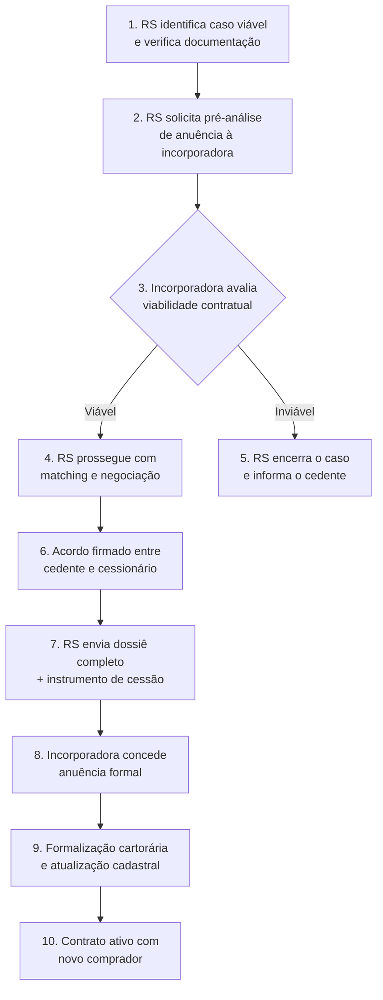

# 16 - Proposta de Valor - Construtoras

Fase: 5 — Comercial
Área: Comercial

# Repasse Seguro — Proposta de Valor para Construtoras e Incorporadoras

## Como reduzir distratos, proteger fluxo de caixa e manter contratos ativos — sem custo e sem risco operacional

| Campo | Valor |
| --- | --- |
| Destinatário | Diretores comerciais, jurídicos e financeiros de construtoras e incorporadoras |
| Escopo | Proposta de valor do Repasse Seguro para construtoras e incorporadoras: impacto econômico do distrato, modelo de cessão formalizada, fluxo de anuência, piloto, objeções e integração operacional |
| Versão | v1.0 |
| Responsável | Max Hoffmann (CPO) |
| Data da Versão | 25/02/2026 16:40 (America/Fortaleza) |

<aside>
📌

**TL;DR**

- **O problema:** cada distrato custa à incorporadora **R$ 225.000+** em devolução de caixa, custo de revenda, desgaste jurídico e unidade parada em estoque. Com Selic a 13%+, a onda de distratos por impossibilidade financeira está acelerando.
- **A solução:** o Repasse Seguro formaliza a cessão do contrato para um comprador qualificado — o contrato **continua ativo**, o fluxo de caixa **não é impactado** e a unidade **não volta ao estoque**.
- **Zero custo:** a incorporadora não paga nada ao Repasse Seguro. A receita do RS vem das comissões sobre cedente e comprador. A incorporadora é beneficiária, não pagante.
- **O que a incorporadora faz:** concede anuência para a cessão. O processo de formalização, verificação, matching e documentação é inteiramente operado pelo RS.
- **Proposta de piloto:** 5 casos em 60 dias, zero custo, trilha de auditoria completa. Métrica de sucesso: distratos evitados e caixa preservado.
- **Impacto estimado:** uma incorporadora com 200 unidades em estoque e 10% de taxa de distrato pode preservar **R$ 4,5M+/ano** em caixa ao converter distratos em cessões formalizadas.
</aside>

---

### 1. Definição Curta

**"O Repasse Seguro é uma infraestrutura de formalização de cessões que permite à construtora converter distratos em contratos ativos — com comprador qualificado, processo verificado e zero custo para a incorporadora."**

---

### 2. O Problema: O Custo Real do Distrato

#### 2.1 O que acontece quando um comprador distrata

Quando um comprador não consegue manter o contrato e opta pelo distrato, a incorporadora enfrenta uma **cadeia de custos** que vai muito além da devolução:

| **#** | **Componente de custo** | **Valor estimado** | **Impacto** |
| --- | --- | --- | --- |
| 1 | Devolução de valores ao comprador | 50–75% do valor pago (Lei 13.786/2018) | Saída de caixa imediata ou parcelada em até 180 dias |
| 2 | Custo de revenda da unidade | 5–8% do VGV da unidade (marketing + comissão) | A unidade precisa ser revendida em cenário de Selic alta — desconto provável |
| 3 | Unidade parada em estoque | Custo de oportunidade + IPTU + condomínio (se entregue) | Capital imobilizado que poderia estar gerando receita |
| 4 | Desgaste jurídico | R$ 5.000–20.000 por caso (advogado + risco de ação) | Mesmo distratos amigáveis consomem tempo jurídico |
| 5 | Impacto contábil | Reversão de receita reconhecida (POC) | Afeta demonstrações financeiras e covenants bancários |
| 6 | Desgaste operacional | Difícil de mensurar | Equipe comercial, jurídica e financeira envolvida em processo improdutivo |

<aside>
🔴

**Custo total estimado por distrato: R$ 225.000+**

Considerando uma unidade de R$ 500k (VGV), com R$ 300k pagos, multa de 50% retida, custo de revenda de 6% e despesas jurídicas. Em empreendimentos de alto padrão, esse custo pode ultrapassar **R$ 500.000 por caso**.

</aside>

#### 2.2 O cenário macroeconômico que agrava

| **Indicador** | **Valor (fev/2026)** |
| --- | --- |
| Selic | 13,25% a.a. (vs 2% em 2020) |
| Juros habitacionais médios | ~11% a.a. (vs ~7% em 2020–2021) |
| Aumento médio nas parcelas de financiamento | +33% vs projeção original do comprador |
| Unidades vendidas na planta (2024) | 400.500 (+20,9% vs 2023) |
| Estimativa de distratos/cessões por ano | 50.000–70.000 casos |

Contratos assinados em **2020–2021** (juros baixos) estão chegando na fase de entrega com custo financeiro muito superior ao planejado. O resultado: distratos por **impossibilidade financeira** — não por arrependimento.

<aside>
🎯

**A questão central para a incorporadora**

O distrato não é apenas uma devolução de dinheiro. É **destruição de valor em cadeia**: caixa que sai, unidade que volta, custo de revenda, desgaste jurídico e impacto contábil. A pergunta é: **existe uma alternativa que mantenha o contrato ativo sem custo para a incorporadora?**

A resposta é sim. Chama-se **cessão formalizada**.

</aside>

#### 2.3 Dimensão do problema para uma incorporadora típica

| **Métrica** | **Incorporadora Pequena** | **Incorporadora Média** | **Incorporadora Grande** |
| --- | --- | --- | --- |
| Unidades em carteira (estoque + vendidas) | 50–100 | 200–500 | 1.000+ |
| Taxa de distrato estimada | 8–12% | 8–12% | 8–12% |
| Distratos por ano | 4–12 | 16–60 | 80–120+ |
| Custo total de distratos/ano (@ R$ 225k) | R$ 0,9M–2,7M | R$ 3,6M–13,5M | R$ 18M–27M+ |
| **Potencial de preservação com cessão** | **R$ 0,7M–2,2M** | **R$ 2,9M–10,8M** | **R$ 14,4M–21,6M+** |

<aside>
💡

**Insight: a cessão é economicamente superior ao distrato para a incorporadora — em todos os cenários.**

No distrato, a incorporadora devolve caixa e revende. Na cessão, o contrato continua ativo com um novo comprador qualificado. O fluxo de pagamentos não é interrompido. A unidade não volta ao estoque. O custo de revenda desaparece.

</aside>

---

### 3. A Solução: Cessão Formalizada via Repasse Seguro

#### 3.1 O que o Repasse Seguro faz

O Repasse Seguro é uma **infraestrutura de formalização** que opera entre o cedente (comprador original) e o cessionário (novo comprador). O papel da incorporadora é **conceder a anuência** — todo o restante do processo é operado pelo RS.

| **#** | **Etapa** | **O que acontece** |
| --- | --- | --- |
| 1 | Cadastro do cedente | O comprador original se cadastra no RS com dados do contrato e documentação. |
| 2 | Verificação documental | RS verifica contrato, pagamentos, tabela vigente e viabilidade de cessão. |
| 3 | Validação de anuência | RS confirma com a incorporadora se a cessão é viável para aquele contrato. |
| 4 | Curadoria e matching | Caso verificado é apresentado a compradores qualificados. |
| 5 | Negociação formalizada | Lance, contraproposta e acordo — tudo documentado com trilha de auditoria. |
| 6 | Formalização da cessão | Instrumento de cessão + anuência da incorporadora + documentação cartorária. |
| 7 | Fechamento | Contrato transferido. Novo comprador assume obrigações. Incorporadora mantém contrato ativo. |

#### 3.2 O que a incorporadora faz vs. o que o RS faz

| **#** | **Atividade** | **Incorporadora** | **Repasse Seguro** |
| --- | --- | --- | --- |
| 1 | Receber e triar pedidos de cessão | — | ✅ Responsável |
| 2 | Verificar documentação do cedente | — | ✅ Responsável |
| 3 | Encontrar comprador qualificado | — | ✅ Responsável |
| 4 | Formalizar negociação e dossiê | — | ✅ Responsável |
| 5 | Preparar instrumento de cessão | — | ✅ Responsável |
| 6 | Conceder anuência | ✅ Responsável | Solicita e acompanha |
| 7 | Atualizar cadastro do contrato | ✅ Responsável | Fornece documentação |
| 8 | Cobrar comissão das partes | — | ✅ Responsável |

<aside>
✅

**A incorporadora concede anuência. O Repasse Seguro faz todo o resto.**

A incorporadora não recruta compradores, não verifica documentação, não opera o processo e não paga nada. O resultado: contrato ativo, fluxo de caixa preservado, unidade fora do estoque.

</aside>

---

### 4. Modelo Econômico: Por Que é Gratuito para a Incorporadora

#### 4.1 De onde vem a receita do RS

O Repasse Seguro cobra comissão de **duas partes** — nenhuma delas é a incorporadora:

| **Fonte de receita** | **Quem paga** | **Base de cálculo** |
| --- | --- | --- |
| Comissão do cedente | O comprador original (que quer sair) | 20% sobre (Valor Recuperado − Valor Distrato Referência) |
| Comissão do comprador | O novo comprador (cessionário) | 20% sobre Δ (Tabela Atual − Tabela do Contrato) |
| **Custo para a incorporadora** | **Nenhum** | **R$ 0** |

#### 4.2 O que a incorporadora ganha (sem pagar)

| **#** | **Benefício** | **Impacto econômico** |
| --- | --- | --- |
| 1 | **Contrato continua ativo** | Fluxo de pagamentos não é interrompido. Receita reconhecida não precisa ser revertida. |
| 2 | **Caixa preservado** | Não há devolução de valores (50–75% do pago). Economia direta de R$ 150k–225k+ por caso. |
| 3 | **Unidade não volta ao estoque** | Elimina custo de revenda (5–8% do VGV), IPTU, condomínio e custo de oportunidade. |
| 4 | **Comprador qualificado** | O cessionário é verificado pelo RS. Entra no contrato com capacidade financeira validada. |
| 5 | **Zero desgaste jurídico** | Cessão formalizada com dossiê e trilha de auditoria. Risco de litígio reduzido drasticamente. |
| 6 | **Proteção contábil** | Sem reversão de POC. Sem impacto em covenants bancários. Demonstrações financeiras preservadas. |

#### 4.3 Exemplo concreto — custo evitado por caso

**Premissas:**

- VGV da unidade: R$ 500.000
- Valor pago pelo cedente: R$ 300.000
- Multa retida no distrato (50%): R$ 150.000
- Devolução ao cedente: R$ 150.000

| **Componente** | **Com distrato** | **Com cessão (RS)** |
| --- | --- | --- |
| Devolução ao cedente | R$ 150.000 | R$ 0 (contrato transferido) |
| Custo de revenda (6% VGV) | R$ 30.000 | R$ 0 (unidade não volta) |
| Custo jurídico | R$ 10.000 | R$ 0 (processo do RS) |
| Tempo de estoque parado (estimativa) | R$ 15.000 (6 meses × custo de oportunidade) | R$ 0 |
| Desconto na revenda (cenário Selic alta) | R$ 25.000 (5% de desconto estimado) | R$ 0 |
| Custo para a incorporadora | R$ 0 | R$ 0 |
| **Custo total evitável** | **R$ 230.000** | **R$ 0** |
| **Economia líquida por caso** | — | **R$ 230.000** |

<aside>
💡

**A lógica é simples:** a incorporadora retém a multa de R$ 150k no distrato, mas gasta R$ 230k para revender a unidade. Na cessão, não retém multa, mas também não gasta nada. O contrato continua ativo, o caixa fica preservado e a unidade permanece vendida.

**Mesmo com a receita da multa, o distrato é mais caro que a cessão.**

</aside>

---

### 5. Fluxo de Anuência

<aside>
⚙️

**A anuência é o único ponto de interação operacional entre a incorporadora e o Repasse Seguro.** O processo é desenhado para ser leve, previsível e documentado.

</aside>

#### 5.1 Fluxo padrão

#### 5.2 O que a incorporadora recebe do RS em cada solicitação

| **Documento** | **Conteúdo** |
| --- | --- |
| Dossiê do caso | Dados do cedente, do cessionário, do contrato original, comprovantes de pagamento, tabela vigente e cálculo de comissões |
| Perfil do cessionário | Dados do novo comprador, capacidade financeira (quando disponível) e intenção documentada |
| Instrumento de cessão (minuta) | Documento base para formalização da transferência contratual |
| Trilha de auditoria | Registro completo de todas as etapas, decisões e comunicações do processo |

#### 5.3 SLA proposto para anuência

| **Etapa** | **SLA sugerido** | **Observação** |
| --- | --- | --- |
| Pré-análise de viabilidade | 5 dias úteis | Confirmação de que a cessão é possível para aquele contrato |
| Anuência formal (após dossiê completo) | 10 dias úteis | Aprovação jurídica e comercial da incorporadora |
| Atualização cadastral | 5 dias úteis após anuência | Registro do novo comprador no sistema da incorporadora |

<aside>
💡

**Nota:** os SLAs são sugeridos e ajustáveis ao processo interno de cada incorporadora. O objetivo é previsibilidade — não pressão. O RS se adapta ao ritmo da incorporadora, desde que o cedente seja informado sobre o prazo esperado.

</aside>

---

### 6. Diferenciais vs. Alternativas

#### 6.1 Por que a cessão é melhor que o distrato — para a incorporadora

| **Dimensão** | **Distrato** | **Cessão via RS** |
| --- | --- | --- |
| Fluxo de caixa | Saída de R$ 150k+ (devolução) | Sem impacto (contrato continua) |
| Estoque | Unidade volta e precisa ser revendida | Unidade permanece vendida |
| Custo de revenda | 5–8% do VGV (marketing + comissão) | R$ 0 |
| Risco jurídico | Possível ação judicial por desacordo | Processo formalizado com trilha de auditoria |
| Impacto contábil | Reversão de POC + impacto em covenants | Nenhum — receita reconhecida mantida |
| Comprador substituto | Precisa ser encontrado pela incorporadora | Fornecido pelo RS (verificado e qualificado) |
| Prazo de resolução | 180 dias (devolução) + meses (revenda) | 45–60 dias (ciclo médio de cessão) |
| Custo para a incorporadora | R$ 225k+ total por caso | R$ 0 |

#### 6.2 Por que a cessão formalizada via RS é melhor que cessão informal

| **Dimensão** | **Cessão informal (gaveta)** | **Cessão via Repasse Seguro** |
| --- | --- | --- |
| Verificação do cessionário | Nenhuma — risco de inadimplência | Documentação verificada + capacidade financeira avaliada |
| Processo de anuência | Ad hoc, sem padrão, desgaste operacional | Dossiê padronizado + SLA definido |
| Trilha de auditoria | Inexistente | Registro completo de todas as etapas |
| Risco de fraude | Alto — contratos falsos, valores inconsistentes | Verificação documental + checklist de consistência |
| Carga operacional para a incorporadora | Alta — precisa validar tudo internamente | Baixa — RS entrega dossiê pronto para análise |
| Custo | R$ 0 (mas risco alto) | R$ 0 (e risco controlado) |

<aside>
🎯

**Posicionamento para a incorporadora**

O Repasse Seguro não é um intermediário tentando lucrar entre as partes. É **infraestrutura de formalização** — a camada de governança que organiza o processo de cessão com verificação, dossiê e trilha de auditoria. A incorporadora recebe um processo pronto, padronizado e rastreável — em vez de pedidos dispersos por e-mail, WhatsApp e corretor informal.

</aside>

---

### 7. Objeções Previsíveis e Respostas

| **Objeção** | **Resposta** |
| --- | --- |
| "Cessão abre precedente ruim — incentiva compradores a repassar em vez de manter o contrato" | O cedente que procura o RS já decidiu sair. A alternativa não é "manter o contrato" — é o distrato. A cessão mantém o contrato ativo com um comprador que quer estar nele. Sem a cessão, a incorporadora devolve caixa e revende a unidade em cenário pior. Com a cessão, nada disso acontece. |
| "Não quero facilitar a saída de compradores" | O comprador que não consegue pagar vai sair de qualquer forma — via distrato, ação judicial ou inadimplência. A cessão é a saída mais ordenada para a incorporadora: contrato ativo, caixa preservado, zero custo. Bloquear a cessão não retém o comprador — apenas transforma a saída em distrato ou litígio. |
| "Já temos processo interno para cessões" | O RS complementa, não substitui. O processo interno da incorporadora cuida da anuência. O RS cuida de tudo que vem antes: triagem, verificação, matching, negociação, dossiê. A incorporadora recebe o caso pronto — com documentação verificada e cessionário qualificado. Reduz carga operacional e padroniza o fluxo. |
| "Como sei que o cessionário é qualificado?" | Cada cessionário passa por verificação documental: identidade, comprovação de renda (quando aplicável), intenção documentada. O dossiê do caso inclui perfil do cessionário para análise da incorporadora. A anuência continua sendo decisão da incorporadora — o RS apenas garante que o caso chegue qualificado. |
| "Não conheço o Repasse Seguro" | Piloto. 5 casos nos próximos 60 dias, zero custo, trilha de auditoria completa. A incorporadora acompanha o processo do início ao fim, avalia a qualidade dos dossiês e decide se continua. Se não convencer, não há obrigação. |
| "Isso pode afetar nossa imagem com compradores novos" | O contrário é verdade. A incorporadora que oferece cessão formalizada como alternativa ao distrato é vista como parceira do comprador — não como adversária. "Se o cenário mudar, existe um caminho." Isso reforça confiança, não enfraquece. |
| "Nosso jurídico vai travar" | O dossiê do RS é construído para facilitar a análise jurídica: contrato original, comprovantes, instrumento de cessão (minuta), trilha de auditoria e checklist de conformidade. Reduz o trabalho do jurídico — não aumenta. E no piloto, o jurídico pode validar o processo antes de escalar. |

---

### 8. Impacto Financeiro Consolidado

<aside>
🎯

**Simulação: incorporadora de médio porte — 200 unidades em carteira**

</aside>

| **Métrica** | **Cenário Conservador** | **Cenário Base** | **Cenário Otimista** |
| --- | --- | --- | --- |
| Unidades em carteira | 200 | 200 | 200 |
| Taxa de distrato/ano | 8% | 10% | 12% |
| Distratos por ano | 16 | 20 | 24 |
| Taxa de conversão em cessão (via RS) | 30% | 50% | 70% |
| Distratos evitados/ano | 5 | 10 | 17 |
| Economia por distrato evitado | R$ 225.000 | R$ 225.000 | R$ 225.000 |
| **Economia total/ano** | **R$ 1.125.000** | **R$ 2.250.000** | **R$ 3.825.000** |
| **Custo para a incorporadora** | **R$ 0** | **R$ 0** | **R$ 0** |

<aside>
✅

**ROI da parceria: infinito.** O custo é zero. Qualquer distrato evitado é economia pura. No cenário base, a incorporadora preserva R$ 2,25M/ano em caixa — sem investir nada.

</aside>

---

### 9. Programa de Piloto

<aside>
✅

**Proposta de piloto — sem custo, sem compromisso, com dados**

</aside>

| **Componente** | **Detalhe** |
| --- | --- |
| Duração | 60 dias |
| Volume | 5 casos de cessão |
| Custo para a incorporadora | R$ 0 |
| Empreendimentos elegíveis | Definidos em conjunto (preferencialmente com histórico de distrato) |
| O que a incorporadora faz | Define ponto de contato + concede anuência nos casos aprovados |
| O que o RS faz | Opera o processo completo + reporta resultados com trilha de auditoria |
| Métricas de sucesso | Casos triados, anuências concedidas, cessões formalizadas, caixa preservado |
| Review final | Reunião de 30 minutos no dia 60 com dados consolidados e decisão de continuidade |

#### 9.1 Critérios de seleção do piloto

| **Critério** | **Ideal** |
| --- | --- |
| Empreendimento | Em obras ou próximo à entrega (fase com maior incidência de distratos) |
| Histórico de distrato | Empreendimento com taxa de distrato acima de 8% |
| Permissão contratual | Contrato permite cessão (com ou sem anuência prévia) |
| Ponto de contato | Acesso direto ao comercial e/ou jurídico para anuência |

> **Próximo passo:** agendar reunião de apresentação com o diretor comercial e/ou jurídico. 30 minutos. Sem compromisso. O objetivo é entender o volume de distratos, os empreendimentos elegíveis e definir os critérios do piloto.
> 

---

### 10. Mensagens-Chave por Interlocutor

#### 10.1 Para o Diretor Comercial

**Mensagem principal:**

*"Cada distrato é uma unidade que volta ao estoque e precisa ser revendida em cenário pior. O Repasse Seguro mantém o contrato ativo com um comprador qualificado — sem custo e sem desgaste operacional."*

**Mensagens de apoio:**

- "Contrato ativo = fluxo de pagamentos mantido. Sem devolução, sem revenda."
- "O cessionário é verificado pelo RS. Chega qualificado para a anuência."
- "Piloto de 5 casos, 60 dias, zero custo. Resultado medido em distratos evitados."

#### 10.2 Para o Diretor Jurídico

**Mensagem principal:**

*"Cada caso chega com dossiê completo, instrumento de cessão e trilha de auditoria. O trabalho do jurídico é analisar um processo pronto — não construir um do zero."*

**Mensagens de apoio:**

- "Trilha de auditoria rastreável em cada etapa. Se não pode ser mostrado, não deveria existir."
- "Cessão formalizada reduz risco de litígio vs. distrato ou contrato de gaveta."
- "No piloto, o jurídico valida o processo antes de escalar."

#### 10.3 Para o Diretor Financeiro

**Mensagem principal:**

*"Cada distrato evitado preserva R$ 225k+ em caixa. Com 10 cessões por ano, a economia é de R$ 2,25M — sem investir nada."*

**Mensagens de apoio:**

- "Sem devolução de valores. Sem reversão de POC. Sem impacto em covenants."
- "O custo de revenda da unidade (5–8% do VGV) desaparece completamente."
- "ROI infinito: custo zero para a incorporadora, economia real por caso."

---

### 11. Conexão com os 4 Princípios de Voz

<aside>
💡

**Como os 4 Princípios Verbais do Repasse Seguro se aplicam na comunicação com incorporadoras**

</aside>

| **Princípio** | **Aplicação na comunicação B2B institucional** | **Exemplo** |
| --- | --- | --- |
| **Clareza acima de tudo** | Números concretos, custo por caso, economia projetada. Sem abstrações. | "Cada distrato evitado preserva R$ 225k+ em caixa. Custo para a incorporadora: R$ 0." |
| **Seriedade sem frieza** | Tom de negócio, não de vendas. Respeito pelo processo interno da incorporadora. Nunca culpar a incorporadora pelo problema do distrato. | "O distrato é resultado de uma mudança macroeconômica — não de falha comercial. A cessão é a saída mais eficiente para ambas as partes." |
| **Transparência radical** | Dossiê aberto, trilha de auditoria, fórmula de comissão visível. A incorporadora vê tudo. | "Cada caso tem dossiê completo com trilha de auditoria. A incorporadora analisa antes de conceder anuência." |
| **Empoderamento sem promessa** | Piloto com dados. Sem garantir volume de cessões. A decisão é da incorporadora. | "5 casos, 60 dias, zero custo. A incorporadora mede os resultados e decide se continua." |

---

### 12. Integração Operacional (Pós-Piloto)

<aside>
⚙️

**Após validação do piloto, a integração pode ser aprofundada sem investimento significativo da incorporadora.**

</aside>

| **#** | **Nível de integração** | **O que muda** | **Quando faz sentido** |
| --- | --- | --- | --- |
| 1 | **Básico (piloto)** | Comunicação por e-mail. Dossiês enviados manualmente. Anuência por documento assinado. | Primeiros 60 dias. Validação de processo. |
| 2 | **Padronizado** | Fluxo de anuência definido com SLA. Ponto de contato fixo. Relatórios mensais. | Após piloto validado. Operação contínua. |
| 3 | **Integrado** | API ou sistema compartilhado para solicitação e aprovação de anuência. Dados em tempo real. | Volume alto (+20 casos/ano). Incorporadoras com sistema próprio. |
| 4 | **Estratégico** | RS como canal oficial de cessão da incorporadora. Co-comunicação com compradores. Referral ativo de casos pela própria incorporadora. | Incorporadoras que querem posicionar cessão como alternativa institucional ao distrato. |

<aside>
💡

**O nível 4 é o cenário mais poderoso para a incorporadora.** Em vez de esperar o comprador procurar o RS, a própria incorporadora pode **direcionar compradores com dificuldade para o canal de cessão** — transformando um problema operacional (distrato) em uma solução institucional (cessão formalizada). A mensagem muda de "vamos devolver seu dinheiro com multa" para "existe um caminho para você sair sem perda — e nós facilitamos."

</aside>

---

<aside>
⚙️

**Mapa do Ecossistema — Referências Cruzadas**

- [15 - Proposta de Valor - Cedente/Cessionário](15%20-%20Proposta%20de%20Valor%20-%20Cedente%20Cession%C3%A1rio%20303d824e597f80ef8783f56e9efc039a.md) — Proposta de valor geral do RS (todos os ICPs, monetização, unit economics)
- [18 - Proposta de Valor - Imobiliárias](18%20-%20Proposta%20de%20Valor%20-%20Imobili%C3%A1rias%20312d824e597f805cbc55f4b726702952.md) — Proposta de valor para imobiliárias como parceiras institucionais
- [04 - Manifesto da Marca](04%20-%20Manifesto%20da%20Marca%20303d824e597f8023bc06f5f40b1e40ea.md) — Território semântico, princípios e posicionamento da marca
- [07 - Tom de Voz e Identidade Verbal](07%20-%20Tom%20de%20Voz%20e%20Identidade%20Verbal%20303d824e597f80c6bb3ff800a72f0c72.md) — 4 Princípios Verbais, vocabulário proprietário, tom por público
- [14 - Modelo de Negócios](14%20-%20Modelo%20de%20Neg%C3%B3cios%20301d824e597f8003891ac9058bb4f812.md) — Estrutura de receita, unit economics, cenários de retorno
- [03 - One-Liner e ICPs](03%20-%20One-Liner%20e%20ICPs%20301d824e597f8076a76ad0ef11fe3804.md) — ICPs detalhados, personas, jornada de compra
</aside>

---

<aside>
⚠️

**Nota de vigência**

Dados quantitativos (custo por distrato, VGV, multa, TAM, taxa de distrato) são estimativas baseadas em dados de mercado e no [14 - Modelo de Negócios](14%20-%20Modelo%20de%20Neg%C3%B3cios%20301d824e597f8003891ac9058bb4f812.md) v3.5. Valores específicos por incorporadora devem ser calibrados no piloto com dados reais. Sempre confirmar valores atualizados no Modelo de Negócios (fonte de verdade).

</aside>

---

<aside>
📋

**Changelog**

**v1.0** — 25/02/2026 — Criação do documento. Proposta de valor específica para construtoras e incorporadoras. Estrutura: custo do distrato, modelo de cessão, fluxo de anuência, impacto financeiro, objeções, programa de piloto, mensagens por interlocutor e níveis de integração operacional.

</aside>