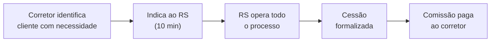

# 17 - Proposta de Valor - Corretores

Fase: 5 — Comercial
Área: Comercial

# Repasse Seguro — Proposta de Valor para Corretores e Advogados Imobiliários

## Como transformar o problema mais frustrante do seu cliente em uma nova fonte de receita — sem operar o processo e sem risco de imagem

| Campo | Valor |
| --- | --- |
| Destinatário | Corretores de imóveis, advogados imobiliários e consultores patrimoniais que atendem compradores de imóveis na planta |
| Escopo | Proposta de valor do Repasse Seguro para corretores e advogados: dor atual, modelo de indicação, comissão, fluxo operacional, objeções, scripts de abordagem e diferenciação profissional |
| Versão | v1.0 |
| Responsável | Max Hoffmann (CPO) |
| Data da Versão | 25/02/2026 16:48 (America/Fortaleza) |

<aside>
📌

**TL;DR**

- **O problema:** quando um cliente comprou na planta e precisa sair do contrato, o corretor não tem ferramenta para resolver. O cliente distrata, perde até 50% do que pagou, e o corretor perde a comissão e o relacionamento.
- **A solução:** o Repasse Seguro formaliza a cessão do contrato para um comprador qualificado. O corretor **indica o caso** e recebe **comissão de indicação no fechamento** — sem operar o processo, sem risco jurídico e sem custo.
- **Comissão estimada:** R$ 5.000–8.000 por caso fechado (percentual sobre a receita do RS, definido no contrato de parceria). Comissão paga somente no Fechamento.
- **Esforço:** 10 minutos para indicar um caso. O RS faz verificação, curadoria, matching, negociação, dossiê e formalização.
- **Diferenciação:** o corretor que oferece cessão formalizada como alternativa ao distrato é visto como **consultor patrimonial** — não como vendedor. Isso retém clientes e gera indicações.
- **Zero custo:** não há adesão, mensalidade ou fee por indicação.
</aside>

---

### 1. Definição Curta

**"O Repasse Seguro permite que você resolva o problema mais doloroso do seu cliente — sair de um contrato na planta sem perder metade do que pagou — e ainda ganhe comissão por isso. Você indica, nós operamos, todo mundo ganha."**

---

### 2. O Problema: O Que Você Perde Hoje

#### 2.1 O cenário que todo corretor conhece

O cliente ligou. Comprou um imóvel na planta em 2021, quando a Selic estava a 2%. Agora, com juros a 13%+, não consegue financiar na entrega. Precisa sair do contrato.

**O que acontece?**

| **Cenário** | **O que o cliente faz** | **O que o corretor perde** |
| --- | --- | --- |
| Distrato | Aceita multa de 25–50% (Lei 13.786/2018). Perde R$ 75k–150k de R$ 300k pagos. | Comissão original perdida ou estornada. Cliente sai frustrado. Relacionamento encerrado. |
| Repasse informal | Anuncia em OLX, WhatsApp, grupo de Facebook. Encontra alguém. Faz contrato de gaveta. | O corretor não participa. Zero receita. Se der problema, o cliente pode culpar quem indicou. |
| Corretor tenta intermediar | O corretor encontra alguém interessado e tenta fechar a cessão. | Sem processo, sem verificação, sem trilha. Se a incorporadora negar anuência ou o negócio der errado, o corretor assume o risco de imagem. |
| Cliente procura advogado | Contrata advogado para negociar distrato ou entrar com ação. | O corretor perde o cliente e qualquer possibilidade de receita futura. |

<aside>
🔴

**O resultado:** em todos os cenários, o corretor perde. Perde comissão, perde relacionamento, perde a chance de resolver o problema do cliente. E o cliente guarda a frustração — dificilmente volta.

</aside>

#### 2.2 A dimensão do problema

| **Métrica** | **Valor** |
| --- | --- |
| Unidades vendidas na planta (2024) | 400.500 (+20,9% vs 2023) |
| Estimativa de distratos/cessões por ano | 50.000–70.000 casos |
| % que passa por corretor em algum momento | ~60% (direto ou via imobiliária) |
| Casos que poderiam gerar comissão de indicação | 30.000–42.000/ano |
| Comissão média de indicação por caso | R$ 5.000–8.000 |

<aside>
🎯

**Cada cliente que distrata é uma comissão que evapora.** E se existisse uma forma de transformar esse distrato em receita — sem operar nada, sem risco, e ainda resolvendo o problema do cliente?

É isso que o Repasse Seguro oferece.

</aside>

---

### 3. A Solução: Indica, Ganha, Mantém o Cliente

#### 3.1 Como funciona para o corretor

| **#** | **Etapa** | **Quem faz** | **Tempo do corretor** |
| --- | --- | --- | --- |
| 1 | Identifica que o cliente precisa sair do contrato | **Corretor** | Atendimento normal |
| 2 | Indica o caso ao Repasse Seguro | **Corretor** | 10 minutos |
| 3 | Triagem e verificação documental | Repasse Seguro | — |
| 4 | Curadoria e matching com compradores | Repasse Seguro | — |
| 5 | Negociação formalizada + dossiê | Repasse Seguro | — |
| 6 | Formalização da cessão + anuência | Repasse Seguro | — |
| 7 | Fechamento: instrumento assinado | Repasse Seguro | — |
| 8 | Comissão de indicação paga | Repasse Seguro → **Corretor** | — |

<aside>
✅

**10 minutos para indicar. Zero para operar. R$ 5.000–8.000 de comissão no fechamento.** O corretor não verifica documentação, não negocia com comprador, não cuida de anuência, não faz dossiê. Indica e recebe.

</aside>

#### 3.2 O que o corretor ganha além da comissão

| **#** | **Benefício** | **Por que importa** |
| --- | --- | --- |
| 1 | **Resolve o problema do cliente** | O cliente que ia perder R$ 150k no distrato recupera R$ 270k+. A gratidão gera indicações. |
| 2 | **Mantém o relacionamento** | Em vez de perder o cliente para o distrato ou para um advogado, o corretor continua sendo o ponto de confiança. |
| 3 | **Diferenciação profissional** | O corretor que oferece cessão formalizada é visto como consultor patrimonial — não como vendedor de imóveis. |
| 4 | **Proteção de imagem** | O RS opera com verificação, dossiê e trilha de auditoria. O corretor indica para um processo sério — não para um esquema informal. |
| 5 | **Receita sobre base existente** | O cliente já é do corretor. O custo de aquisição é zero. A comissão é 100% incremental. |
| 6 | **Acesso a compradores qualificados** | O RS atrai compradores que buscam imóveis abaixo da tabela. O corretor pode captar esses leads para futuras vendas. |

---

### 4. Modelo de Comissão

#### 4.1 Como funciona

| **Componente** | **Detalhe** |
| --- | --- |
| Quem paga a comissão | O Repasse Seguro — sobre sua própria receita. O corretor não cobra nada do cliente. |
| Base de cálculo | Percentual sobre a receita do RS no caso indicado (ticket combinado médio: R$ 50k) |
| Quando paga | Somente no Fechamento (instrumento de cessão assinado + preço confirmado) |
| Comissão estimada por caso | R$ 5.000–8.000 |
| Custo para o corretor | R$ 0 — zero adesão, zero mensalidade, zero fee |

#### 4.2 Exemplo concreto

**Premissas do caso:**

- Valor pago pelo cedente: R$ 300.000
- Distrato referência (50% retido): R$ 150.000
- Cenário B (recupera 100% do pago): R$ 300.000
- Ticket combinado do RS (cedente + comprador): R$ 50.000

| **O que acontece com o cliente** | **Sem RS (distrato)** | **Com RS (cessão)** |
| --- | --- | --- |
| Valor pago pelo cliente | R$ 300.000 | R$ 300.000 |
| Multa / retenção | R$ 150.000 (50%) | — |
| Cliente recebe líquido | R$ 150.000 | R$ 270.000 |
| **Ganho do cliente vs distrato** | — | **+R$ 120.000** |

| **O que acontece com o corretor** | **Sem RS** | **Com RS** |
| --- | --- | --- |
| Comissão sobre o distrato | R$ 0 | — |
| Comissão de indicação | — | R$ 5.000–8.000 |
| Tempo investido | Horas (tentando resolver informalmente) | 10 minutos (indicação) |
| Risco de imagem | Alto (se intermediar informalmente) | Zero (processo formalizado do RS) |
| Relacionamento com o cliente | Encerrado (frustração) | Fortalecido (gratidão) |

<aside>
💡

**A conta é simples.** O cliente ganha R$ 120k a mais que no distrato. O corretor ganha R$ 5k–8k que não existiriam. E o relacionamento continua — em vez de acabar em frustração.

**Sem o RS, os dois perdem. Com o RS, os dois ganham.**

</aside>

#### 4.3 Projeção para um corretor ativo

| **Métrica** | **1 caso/mês** | **2 casos/mês** | **4 casos/mês** |
| --- | --- | --- | --- |
| Indicações por mês | 2 | 4 | 8 |
| Taxa de conversão (indicação → fechamento) | 50% | 50% | 50% |
| Casos fechados por mês | 1 | 2 | 4 |
| Comissão mensal estimada | R$ 5.000–8.000 | R$ 10.000–16.000 | R$ 20.000–32.000 |
| **Comissão anual estimada** | **R$ 60.000–96.000** | **R$ 120.000–192.000** | **R$ 240.000–384.000** |

<aside>
✅

**Receita 100% incremental.** Não substitui comissão de vendas novas. Não exige investimento. Não exige operar nada. É uma segunda camada de receita sobre clientes que, sem o RS, gerariam zero.

</aside>

---

### 5. Quem É o Caso Ideal

#### 5.1 Sinais de que o cliente precisa do RS

O corretor não precisa ser especialista em cessão. Precisa reconhecer os sinais:

- *"Comprei na planta, mas não vou conseguir financiar na entrega."*
- *"A construtora quer ficar com metade do que paguei."*
- *"Quero sair do contrato, mas não sei como."*
- *"Já tentei anunciar no OLX, mas tenho medo de golpe."*
- *"Meu advogado disse que o distrato é a única opção."*
- *"Conhece alguém que queira comprar meu contrato?"*
- *"Preciso do dinheiro, mas não quero perder tudo."*

#### 5.2 Perfil do cedente ideal

| **Critério** | **Perfil ideal** |
| --- | --- |
| Tipo de contrato | Compra na planta (incorporação) |
| Valor pago acumulado | Acima de R$ 80.000 |
| Estágio do empreendimento | Em obras ou próximo à entrega |
| Motivo da saída | Impossibilidade financeira, mudança de planos, necessidade de liquidez |
| Documentação | Contrato assinado + comprovantes de pagamento disponíveis |
| Incorporadora | Permite cessão (validado pelo RS na triagem) |

<aside>
🔴

**Casos que NÃO são para o RS (MVP)**

- Imóveis prontos e quitados (venda convencional — o corretor já faz isso).
- Financiamentos bancários puros sem contrato na planta.
- Disputas judiciais já em curso.
- Valor pago abaixo de R$ 80k (ticket não cobre custo operacional).
- MCMV com restrições severas de cessão.
</aside>

---

### 6. Scripts de Abordagem

#### 6.1 Quando o cliente menciona que precisa sair do contrato

> *"[Nome], entendo que a situação mudou. Antes de seguir com o distrato, quero te apresentar uma alternativa que pode fazer muita diferença.*
> 

> 
> 

> *Trabalho com o Repasse Seguro, que é uma plataforma de formalização de cessões. Eles verificam a documentação, encontram um comprador qualificado e formalizam tudo com segurança jurídica. Você só paga uma comissão se o repasse acontecer de verdade.*
> 

> 
> 

> *No caso do distrato, você receberia cerca de R$ [valor]. Via cessão, o potencial de recuperação é significativamente maior. Posso te indicar para uma avaliação gratuita do seu caso?"*
> 

#### 6.2 Quando o cliente já decidiu distratar

> *"[Nome], respeito sua decisão. Só quero garantir que você conheça todas as opções antes de assinar.*
> 

> 
> 

> *O distrato vai reter R$ [valor da multa]. Existe uma alternativa chamada cessão de contrato — basicamente, transferir o contrato para outro comprador que queira o imóvel. É formalizado, com verificação documental e trilha de auditoria.*
> 

> 
> 

> *Se quiser, posso indicar seu caso para uma avaliação sem compromisso. Leva 48 horas e não custa nada. Se não for viável, você segue com o distrato normalmente."*
> 

#### 6.3 Quando o cliente pergunta sobre repasse informal

> *"[Nome], entendo que parece mais simples. Mas contrato de gaveta não tem proteção jurídica. Se o comprador não pagar, se a incorporadora não reconhecer, se der qualquer problema — você assume o risco.*
> 

> 
> 

> *O Repasse Seguro formaliza tudo: verificação, dossiê, trilha de auditoria, anuência da incorporadora. Você tem segurança e eu acompanho o processo. Sem custo pra você — a comissão é sobre o resultado."*
> 

#### 6.4 Quando outro corretor indica (advogado)

> *"[Nome do advogado], sei que você atende clientes com contratos na planta que precisam sair. Em vez de entrar com ação ou negociar distrato, existe uma alternativa mais rápida e com resultado melhor pra o cliente.*
> 

> 
> 

> *O Repasse Seguro formaliza cessões de contrato com verificação, dossiê e anuência da incorporadora. O prazo é de semanas, não de anos. E você pode indicar o caso e receber comissão de indicação no fechamento — sem operar nada."*
> 

---

### 7. Objeções Previsíveis e Respostas

| **Objeção** | **Resposta** |
| --- | --- |
| "Não quero dividir comissão" | Não há divisão. A comissão de indicação é receita nova — não existiria sem o RS. Sem o repasse, o cliente distrata e ninguém ganha nada. Com o RS, você ganha R$ 5k–8k sobre um caso que geraria zero. |
| "Eu mesmo posso intermediar a cessão" | Pode. Mas sem processo padronizado, sem verificação documental e sem trilha de auditoria, o risco é seu. Se a incorporadora negar anuência, se o comprador desistir, se a documentação estiver irregular — quem responde? O RS cuida de tudo e você recebe comissão sem risco. |
| "Meu cliente não vai querer pagar comissão" | O cliente não paga nada ao corretor. A comissão de indicação sai da receita do RS. O que o cliente paga é a comissão do RS — 20% sobre o ganho em relação ao distrato. No exemplo: paga R$ 30k de comissão, mas recebe R$ 120k a mais que no distrato. A comissão é invisível quando o ganho é grande. |
| "Não entendo de cessão de contrato" | Não precisa. O RS faz tudo: verificação, curadoria, matching, negociação, dossiê, formalização. Você só precisa identificar o cliente com necessidade e indicar. 10 minutos. |
| "E se der problema e o cliente me culpar?" | O RS opera com transparência radical: fórmula pública, dossiê auditável, trilha de auditoria em cada etapa. Você indicou para um processo profissional e formalizado — não para um esquema informal. Se algo não funcionar (ex: incorporadora nega anuência), o RS comunica com clareza e o cliente entende que o processo foi sério. |
| "Nunca ouvi falar do Repasse Seguro" | Indica um caso e acompanha. Sem custo, sem compromisso. Você vê o processo, avalia a qualidade e decide se continua indicando. Se não convencer, não indica mais. |
| "Meu foco é venda de imóvel novo" | Continua sendo. A indicação leva 10 minutos — e gera R$ 5k–8k. Não tira foco. É receita extra sobre um cliente que, sem o RS, você perderia. E o cliente que você ajuda a sair do contrato vai lembrar de você quando quiser comprar outro imóvel. |

---

### 8. Diferenciação Profissional

<aside>
🎯

**O corretor que oferece cessão formalizada muda de categoria na cabeça do cliente.**

</aside>

| **Dimensão** | **Corretor comum** | **Corretor parceiro do RS** |
| --- | --- | --- |
| Quando o cliente precisa sair do contrato | "Não é comigo. Procura a incorporadora." | "Existe uma alternativa ao distrato. Posso te indicar." |
| Percepção do cliente | Vendedor de imóvel | Consultor patrimonial |
| Relacionamento pós-venda | Encerra na entrega das chaves | Continua em qualquer cenário |
| Indicações recebidas | "Ele vendeu meu apartamento" | "Ele me salvou de perder R$ 150k. Fala com ele." |
| Receita em cenário de crise | Cai (menos vendas novas) | Diversificada (vendas + indicações de cessão) |

<aside>
💡

**Insight:** em um mercado com Selic alta e onda de distratos, o corretor que só vende imóvel novo está vulnerável. O corretor que também resolve problemas de saída tem **duas fontes de receita** — e uma reputação que gera indicações espontâneas.

</aside>

---

### 9. Para Advogados Imobiliários

<aside>
⚙️

**A proposta para advogados tem o mesmo modelo, mas linguagem e argumentos diferentes.**

</aside>

#### 9.1 O que muda para o advogado

| **Dimensão** | **Via judicial / distrato** | **Via RS (cessão)** |
| --- | --- | --- |
| Prazo de resolução | 2–4 anos (judicial) ou 180 dias (distrato) | 45–60 dias (ciclo médio de cessão) |
| Resultado para o cliente | Multa de 25–50% + espera | Recuperação de até 95% do valor pago |
| Honorários do advogado | R$ 5k–20k (incerto, depende do resultado) | Comissão de indicação paga no fechamento (R$ 5k–8k) |
| Risco | Resultado incerto no Judiciário | Processo formalizado com trilha de auditoria |
| Imagem profissional | "Advogado que briga com incorporadora" | "Advogado que resolve sem litígio" |

#### 9.2 Argumento central para o advogado

*"Seu cliente quer sair do contrato. Você pode entrar com ação (2–4 anos, resultado incerto) ou negociar distrato (multa de 25–50%). Ou pode indicar para o Repasse Seguro: cessão formalizada em 45–60 dias, com verificação, dossiê e trilha de auditoria. O cliente recupera mais. Você ganha comissão de indicação. E ninguém entra em litígio."*

#### 9.3 Modelo combinado (advogado + corretor)

Quando o cliente chega por meio de um advogado que foi indicado por um corretor, ambos podem ser parceiros:

- **Corretor:** indica o caso. Recebe comissão de indicação.
- **Advogado:** acompanha a formalização jurídica. Pode ser co-parceiro com comissão específica.

O RS define as regras de comissão no contrato de parceria para evitar conflito.

---

### 10. Âncoras de Comparação

<aside>
🎯

**O que o corretor compara (conscientemente ou não)**

</aside>

| **Cenário** | **Sem Repasse Seguro** | **Com Repasse Seguro** |
| --- | --- | --- |
| Cliente quer sair do contrato | Distrata. Corretor perde comissão e cliente. | Indica ao RS. Ganha R$ 5k–8k e mantém relacionamento. |
| Esforço | Horas tentando resolver informalmente (ou zero, se desistir). | 10 minutos para indicar. RS opera tudo. |
| Risco | Alto (intermediação informal) ou zero (não faz nada). | Zero. Processo formalizado do RS. |
| Custo | R$ 0 (mas perde receita potencial). | R$ 0 (e ganha receita real). |
| Reputação | "Não pude ajudar." | "Encontrei uma solução para o seu problema." |

---

### 11. Mensagens-Chave

#### 11.1 Mensagem principal

**"Seu cliente comprou na planta e agora precisa sair. Você pode perdê-lo no distrato — ou indicar para o Repasse Seguro e ganhar comissão enquanto resolve o problema. Você indica, nós operamos, todo mundo ganha."**

#### 11.2 Mensagens de apoio

- "10 minutos para indicar. R$ 5.000–8.000 de comissão no fechamento."
- "Sem operar nada. Sem risco de imagem. Sem custo."
- "O cliente que você ajuda a sair do contrato vai lembrar de você quando quiser comprar outro imóvel."
- "O distrato paga R$ 0 para o corretor. O repasse paga R$ 5k–8k."
- "Indica um caso e acompanha. Se não convencer, não indica mais."

#### 11.3 Frase-âncora (para memorizar)

**"Distrato = perda para todo mundo. Cessão = ganho para todo mundo."**

---

### 12. Conexão com os 4 Princípios de Voz

<aside>
💡

**Como os 4 Princípios Verbais do Repasse Seguro se aplicam na comunicação com corretores e advogados**

</aside>

| **Princípio** | **Aplicação** | **Exemplo** |
| --- | --- | --- |
| **Clareza acima de tudo** | Comissão, processo e tempo explicados sem jargão. Números concretos. | "R$ 5k–8k por caso. 10 minutos para indicar. RS opera tudo." |
| **Seriedade sem frieza** | Tom de colega profissional. Sem floreio. Respeito pelo tempo e foco do corretor. | "Seu foco é venda nova. Isso é receita extra — sem tirar seu tempo." |
| **Transparência radical** | Modelo de comissão aberto. Processo visível. Acompanhamento em cada etapa. | "Você é notificado em cada mudança de estado. Sem surpresas." |
| **Empoderamento sem promessa** | Indica um caso e avalia. Sem promessa de volume ou resultado garantido. | "Indica um caso e acompanha. Se não convencer, não indica mais." |

---

### 13. Como Começar

<aside>
✅

**3 passos. 10 minutos. Zero custo.**

</aside>

| **#** | **Passo** | **Detalhe** |
| --- | --- | --- |
| 1 | **Cadastre-se como parceiro** | Formulário simples + contrato de parceria com termos de comissão. |
| 2 | **Indique seu primeiro caso** | Cliente com contrato na planta que precisa sair. Envie pelo formulário ou contato direto. |
| 3 | **Acompanhe e receba** | O RS opera o processo. Você é notificado em cada etapa. Comissão paga no fechamento. |

> **O melhor momento para indicar é agora.** Se você tem um cliente que precisa sair de um contrato na planta, esse caso pode gerar R$ 5.000–8.000 para você — em vez de R$ 0.
> 

---

<aside>
⚙️

**Mapa do Ecossistema — Referências Cruzadas**

- [15 - Proposta de Valor - Cedente/Cessionário](15%20-%20Proposta%20de%20Valor%20-%20Cedente%20Cession%C3%A1rio%20303d824e597f80ef8783f56e9efc039a.md) — Proposta de valor geral do RS (todos os ICPs, monetização, unit economics)
- [18 - Proposta de Valor - Imobiliárias](18%20-%20Proposta%20de%20Valor%20-%20Imobili%C3%A1rias%20312d824e597f805cbc55f4b726702952.md) — Proposta para imobiliárias como parceiras institucionais
- [16 - Proposta de Valor - Construtoras](16%20-%20Proposta%20de%20Valor%20-%20Construtoras%20312d824e597f809498f1cb8f004fcc94.md) — Proposta para construtoras e incorporadoras
- [04 - Manifesto da Marca](04%20-%20Manifesto%20da%20Marca%20303d824e597f8023bc06f5f40b1e40ea.md) — Território semântico, princípios e posicionamento da marca
- [07 - Tom de Voz e Identidade Verbal](07%20-%20Tom%20de%20Voz%20e%20Identidade%20Verbal%20303d824e597f80c6bb3ff800a72f0c72.md) — 4 Princípios Verbais, vocabulário proprietário, tom por público
- [14 - Modelo de Negócios](14%20-%20Modelo%20de%20Neg%C3%B3cios%20301d824e597f8003891ac9058bb4f812.md) — Estrutura de receita, unit economics, cenários de retorno
- [03 - One-Liner e ICPs](03%20-%20One-Liner%20e%20ICPs%20301d824e597f8076a76ad0ef11fe3804.md) — ICPs detalhados, personas, jornada de compra
</aside>

---

<aside>
⚠️

**Nota de vigência**

Dados quantitativos (comissão, TAM, ticket) verificados e alinhados com o [14 - Modelo de Negócios](14%20-%20Modelo%20de%20Neg%C3%B3cios%20301d824e597f8003891ac9058bb4f812.md) e a [15 - Proposta de Valor - Cedente/Cessionário](15%20-%20Proposta%20de%20Valor%20-%20Cedente%20Cession%C3%A1rio%20303d824e597f80ef8783f56e9efc039a.md) em 25/02/2026. Valores de comissão de indicação são estimativas — definição final no contrato de parceria. Sempre confirmar valores atualizados no Modelo de Negócios (fonte de verdade).

</aside>

---

<aside>
📋

**Changelog**

**v1.0** — 25/02/2026 — Criação do documento. Proposta de valor específica para corretores de imóveis e advogados imobiliários. Estrutura: problema, modelo de indicação, comissão, scripts de abordagem, objeções, diferenciação profissional, seção específica para advogados e como começar.

</aside>