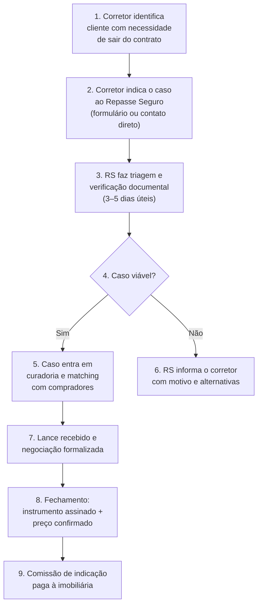

# 18 - Proposta de Valor - Imobiliárias

Fase: 5 — Comercial
Área: Comercial

# Repasse Seguro — Proposta de Valor para Imobiliárias

## Como sua imobiliária pode transformar distratos em receita recorrente — sem risco e sem operar o processo

| Campo | Valor |
| --- | --- |
| Destinatário | Diretores comerciais, sócios e gestores de imobiliárias parceiras |
| Escopo | Proposta de valor do Repasse Seguro para imobiliárias: problema, oportunidade, modelo de parceria, receita por indicação, fluxo operacional, onboarding e programa de parceria institucional |
| Versão | v1.0 |
| Responsável | Max Hoffmann (CPO) |
| Data da Versão | 25/02/2026 16:35 (America/Fortaleza) |

<aside>
📌

**TL;DR**

- **O problema:** toda imobiliária perde clientes para o distrato. O comprador que não consegue financiar na entrega distrata, a imobiliária perde a comissão e o relacionamento. Não existe ferramenta institucional para resolver isso.
- **A oportunidade:** o Repasse Seguro é uma infraestrutura de formalização de cessões que permite à imobiliária **indicar clientes que precisam sair de contratos** e receber comissão de indicação no fechamento — sem operar o processo, sem risco de imagem e sem custo fixo.
- **Receita estimada:** uma imobiliária de médio porte com 15–20 corretores pode gerar **3–5 indicações/mês**. Com ticket médio de comissão de indicação entre R$ 5.000–8.000, isso representa **R$ 15.000–40.000/mês** em receita incremental — 100% margem.
- **Zero custo:** não há mensalidade, adesão ou fee por indicação. A comissão só existe quando o repasse acontece de verdade.
- **Diferenciação competitiva:** a imobiliária que oferece cessão formalizada como serviço se posiciona como referência em soluções patrimoniais — enquanto as demais apenas vendem e revendem.
</aside>

---

### 1. Definição Curta

**"O Repasse Seguro permite que sua imobiliária transforme distratos em receita — indicando clientes que precisam sair de contratos para um processo formalizado de cessão, com comissão paga no fechamento e zero risco operacional."**

---

### 2. O Problema: O Que a Imobiliária Perde Hoje

#### 2.1 O cenário atual

Quando um comprador que adquiriu imóvel na planta precisa sair do contrato, a imobiliária enfrenta um **beco sem saída**:

| **Cenário** | **O que acontece** | **Impacto na imobiliária** |
| --- | --- | --- |
| Cliente distrata | Multa de 25–50% (Lei 13.786/2018). Devolução em até 180 dias. | Comissão de venda original é perdida ou estornada. Cliente sai insatisfeito. Relacionamento encerrado. |
| Cliente tenta repasse informal | Contrato de gaveta, grupo de WhatsApp, anúncio em classificado. | A imobiliária não participa. Zero receita. Risco de imagem se o cliente se envolve em fraude. |
| Corretor tenta intermediar sozinho | Sem processo padronizado, sem verificação, sem trilha. | Risco jurídico para a imobiliária. Responsabilidade por informação incorreta. Desgaste operacional sem receita garantida. |

#### 2.2 O contexto que agrava

Contratos assinados em **2020–2021** (Selic a ~2%) estão chegando na fase de entrega com Selic acima de **13% a.a.** (fev/2026). Muitos compradores que planejavam financiar na entrega descobriram que as parcelas ficaram **+33% mais caras**.

O resultado: uma onda de distratos por **impossibilidade financeira** — não por arrependimento.

<aside>
🎯

**O que isso significa para a imobiliária**

Cada distrato é um cliente que a imobiliária vendeu, atendeu, acompanhou — e agora perde. A comissão original evapora. O relacionamento termina em frustração. E a imobiliária não tem nenhuma ferramenta para oferecer uma alternativa.

**O Repasse Seguro muda isso.** Em vez de perder o cliente, a imobiliária indica o caso para um processo formalizado de cessão — e ganha comissão no fechamento.

</aside>

#### 2.3 A dimensão do problema

| **Métrica** | **Valor** |
| --- | --- |
| Unidades vendidas na planta (2024) | 400.500 (+20,9% vs 2023) |
| Estimativa de distratos/cessões por ano | 50.000–70.000 casos |
| Ticket médio de comissão (cedente + comprador) | R$ 50.000 por caso |
| Participação das imobiliárias na originação | ~60% das vendas na planta passam por imobiliárias |
| **Receita potencial perdida pelo mercado imobiliário** | **30.000–42.000 casos/ano que poderiam gerar comissão de indicação** |

---

### 3. A Oportunidade: O Que o Repasse Seguro Oferece

#### 3.1 Para a imobiliária como instituição

| **#** | **Benefício** | **Como funciona** |
| --- | --- | --- |
| 1 | **Nova linha de receita** | Comissão de indicação paga no fechamento do repasse. Receita 100% incremental — não canibaliza venda nova. |
| 2 | **Retenção de clientes** | Em vez de perder o cliente no distrato, a imobiliária oferece uma alternativa. O relacionamento continua. |
| 3 | **Diferenciação competitiva** | A imobiliária que oferece cessão formalizada se posiciona como referência em soluções patrimoniais — não apenas em vendas. |
| 4 | **Zero risco operacional** | A imobiliária indica. O Repasse Seguro opera o processo inteiro: verificação, curadoria, formalização, dossiê, trilha de auditoria. |
| 5 | **Zero custo fixo** | Não há mensalidade, adesão ou investimento. A comissão só existe quando o repasse fecha. |
| 6 | **Captação de compradores** | Casos disponíveis no Repasse Seguro atraem compradores que buscam imóveis abaixo da tabela — a imobiliária pode captar esses leads para vendas futuras. |

#### 3.2 Para os corretores da imobiliária

| **Dor do corretor** | **Como o RS resolve** |
| --- | --- |
| "Meu cliente quer sair do contrato e eu não tenho como ajudar" | Indica para o RS. O processo é formalizado. O corretor recebe comissão e mantém o cliente. |
| "Perco comissão toda vez que o cliente distrata" | Se o repasse fecha, o corretor ganha comissão de indicação — em vez de perder tudo. |
| "Tenho medo de me envolver em repasse informal" | O RS opera com verificação documental, dossiê e trilha de auditoria. O corretor indica, não opera. |
| "Não sei precificar uma cessão" | O RS tem simulador de cenários, fórmula pública de comissão e dossiê com tabela documentada. |

<aside>
💡

**Insight estratégico**

A imobiliária que treina seus corretores para identificar e indicar casos de cessão cria uma **segunda camada de receita** sobre a mesma base de clientes. O custo de aquisição desse "lead" é zero — o cliente já é da imobiliária.

</aside>

---

### 4. Como Funciona na Prática

#### 4.1 Fluxo operacional para a imobiliária

#### 4.2 O que a imobiliária faz vs. o que o RS faz

| **#** | **Etapa** | **Imobiliária** | **Repasse Seguro** |
| --- | --- | --- | --- |
| 1 | Identificar cliente com necessidade | ✅ Responsável | — |
| 2 | Indicar o caso | ✅ Responsável | Recebe e registra |
| 3 | Verificação documental | — | ✅ Responsável |
| 4 | Curadoria e matching | — | ✅ Responsável |
| 5 | Negociação e formalização | — | ✅ Responsável |
| 6 | Dossiê e trilha de auditoria | — | ✅ Responsável |
| 7 | Fechamento e documentação | — | ✅ Responsável |
| 8 | Pagamento da comissão | Recebe | ✅ Processa |

<aside>
✅

**A imobiliária indica. O Repasse Seguro opera.** Zero envolvimento operacional, zero risco jurídico, zero custo. A comissão chega quando o caso fecha.

</aside>

---

### 5. Modelo de Receita para a Imobiliária

#### 5.1 Como a comissão de indicação funciona

A comissão de indicação é um **percentual sobre a receita do Repasse Seguro** no caso indicado. A imobiliária não cobra o cedente nem o comprador — quem paga é o RS, sobre sua própria receita.

| **Componente** | **Valor** |
| --- | --- |
| Receita do RS por caso (cedente + comprador) | R$ 50.000 (ticket combinado médio) |
| Comissão de indicação (sobre receita RS) | Definida no contrato de parceria — paga no Fechamento |
| Quando paga | Somente no Fechamento (instrumento assinado + preço confirmado) |
| Custo para a imobiliária | R$ 0 — zero mensalidade, zero adesão, zero fee |

#### 5.2 Exemplo concreto — imobiliária de médio porte

**Premissas do exemplo:**

- Imobiliária com 15 corretores ativos
- 2–4 indicações por mês (1 indicação a cada 4–7 corretores/mês)
- Ticket combinado médio por caso: R$ 50.000
- Ciclo médio de fechamento: 45–60 dias

| **Métrica** | **Cenário Conservador** | **Cenário Base** | **Cenário Otimista** |
| --- | --- | --- | --- |
| Indicações por mês | 2 | 4 | 6 |
| Taxa de conversão (indicação → fechamento) | 40% | 50% | 60% |
| Casos fechados por mês | ~1 | 2 | 3–4 |
| Receita mensal estimada (indicação) | R$ 5.000–8.000 | R$ 10.000–16.000 | R$ 20.000–32.000 |
| **Receita anual estimada** | **R$ 60.000–96.000** | **R$ 120.000–192.000** | **R$ 240.000–384.000** |

<aside>
💡

**Contexto de margem**

Essa receita é **100% margem** para a imobiliária. Não há custo operacional (o RS opera), não há investimento em marketing (o cliente já é da imobiliária), não há risco (só paga se fechar). É receita incremental pura sobre uma base de clientes que, sem o RS, geraria zero.

</aside>

#### 5.3 O que NÃO é custo

- Não há taxa de adesão ao programa.
- Não há mensalidade ou assinatura.
- Não há fee por indicação (a comissão é sobre resultado).
- Não há investimento em treinamento (o RS fornece material e capacitação).
- Não há custo de plataforma ou sistema.

---

### 6. Diferenciais vs. Alternativas

| **Alternativa** | **O que a imobiliária faz hoje** | **Com o Repasse Seguro** |
| --- | --- | --- |
| Não fazer nada | Cliente distrata. Imobiliária perde comissão e relacionamento. | Imobiliária indica o caso, ganha comissão e mantém o cliente. |
| Corretor intermedia sozinho | Sem processo, sem verificação, sem trilha. Risco jurídico para a imobiliária. | Processo formalizado, dossiê verificado, trilha de auditoria. Zero risco. |
| Encaminhar para advogado | Perde o cliente e a comissão. O advogado fica com o caso. | O advogado pode ser co-parceiro. A imobiliária mantém a comissão de indicação. |
| Anunciar em OLX / WhatsApp | Imobiliária coloca nome em risco. Zero verificação, zero controle. | Casos curados com documentação verificada. A marca da imobiliária fica protegida. |
| Criar processo interno | Custo de estruturação, jurídico, compliance, tecnologia. Inviável para maioria. | Infraestrutura pronta. A imobiliária só indica — o RS faz o resto. |

<aside>
🎯

**Posicionamento competitivo da imobiliária**

A imobiliária que fecha parceria com o Repasse Seguro pode comunicar ao mercado: *"Não abandonamos nossos clientes quando o cenário muda. Se você precisa sair do contrato, temos uma solução formalizada, verificada e segura."*

Isso é **diferenciação real** — enquanto a concorrência perde o cliente no distrato, sua imobiliária retém o relacionamento e gera receita.

</aside>

---

### 7. Objeções Previsíveis e Respostas

#### 7.1 Objeções do diretor comercial

| **Objeção** | **Resposta** |
| --- | --- |
| "Meus corretores já resolvem isso informalmente" | Resolver informalmente coloca a imobiliária em risco. Se um contrato de gaveta der problema, a responsabilidade pode recair sobre quem intermediou. O RS formaliza com dossiê, trilha de auditoria e processo jurídico-first. A imobiliária indica, não opera — e a comissão vem sem risco. |
| "Não quero perder foco na venda de imóveis novos" | A imobiliária não perde foco. O corretor identifica o caso (algo que já faz naturalmente no atendimento) e indica ao RS. O processo inteiro é operado por nós. É 10 minutos do tempo do corretor para gerar R$ 5.000–8.000 de receita. |
| "Distratos são problema da incorporadora, não nosso" | Distratos são problema de quem perde receita com eles. Quando o cliente distrata, a imobiliária perde a comissão original e o relacionamento. Com o RS, a imobiliária transforma o distrato em receita adicional — e ainda mantém o cliente. |
| "Não conheço o Repasse Seguro. Como sei que é confiável?" | Piloto. 3 a 5 casos nos próximos 60 dias, sem custo e sem compromisso. A imobiliária acompanha o processo do início ao fim. Se os resultados não convencerem, não há obrigação de continuar. |
| "O cliente pode se incomodar com a indicação" | O cliente está com medo de perder R$ 200k no distrato. A indicação para um processo formalizado de cessão não incomoda — alivia. A imobiliária que oferece alternativa é vista como parceira, não como vendedora. |

#### 7.2 Objeções do corretor individual

| **Objeção** | **Resposta** |
| --- | --- |
| "Não quero dividir comissão" | A comissão de indicação é receita que não existiria sem o RS. Sem o repasse, o cliente distrata e ninguém ganha nada. Com o RS, o corretor ganha comissão sobre um caso que, de outra forma, seria perda total. |
| "Não entendo de cessão de contrato" | Não precisa. O RS faz tudo: verificação, curadoria, formalização, dossiê. O corretor só precisa identificar o cliente com necessidade e fazer a indicação. Fornecemos treinamento de 30 minutos para a equipe. |
| "E se o cliente reclamar depois?" | O RS opera com transparência radical: fórmula pública de comissão, dossiê auditável, trilha completa. O corretor indica para um processo verificado — não para um esquema informal. A imobiliária e o corretor ficam protegidos. |

---

### 8. Programa de Parceria Institucional

#### 8.1 Estrutura do programa

<aside>
⚙️

**O programa é desenhado para ser simples de adotar e escalável.** Não exige mudança de processo da imobiliária — apenas adiciona uma nova capacidade ao atendimento existente.

</aside>

| **Componente** | **Descrição** |
| --- | --- |
| **Onboarding** | Reunião de alinhamento (1h) + treinamento para corretores (30min) + material de apoio |
| **Contrato de parceria** | Termo simples com regras claras: comissão, prazo, obrigações, exclusividade (se aplicável) |
| **Canal de indicação** | Formulário dedicado + contato direto com equipe RS. Resposta em até 24h úteis. |
| **Acompanhamento** | Notificação em cada mudança de estado do caso. Corretor e gestor informados em tempo real. |
| **Relatórios** | Relatório mensal: indicações, status, conversão, comissões pagas e pipeline. |
| **Suporte** | Canal dedicado para dúvidas operacionais e suporte ao corretor. |

#### 8.2 Onboarding — passo a passo

| **#** | **Etapa** | **Prazo** | **Entregável** |
| --- | --- | --- | --- |
| 1 | Reunião de apresentação | Dia 1 | Alinhamento comercial + definição de contato principal |
| 2 | Assinatura do contrato de parceria | Dia 1–3 | Contrato assinado com termos de comissão e operação |
| 3 | Treinamento da equipe de corretores | Dia 3–5 | Sessão de 30 minutos (presencial ou remota) + material de referência |
| 4 | Ativação do canal de indicação | Dia 5 | Formulário ativo + contatos operacionais definidos |
| 5 | Primeira indicação | Dia 5–15 | Primeiro caso enviado e triado |
| 6 | Review de 30 dias | Dia 30 | Análise de resultados + ajustes operacionais |

#### 8.3 Material de apoio para corretores

O Repasse Seguro fornece à imobiliária:

- **Guia rápido** (1 página): como identificar um caso, como indicar, o que esperar.
- **Script de abordagem**: frases prontas para o corretor oferecer a alternativa ao cliente.
- **FAQ do corretor**: respostas para as dúvidas mais comuns.
- **Simulador de cenários**: ferramenta para mostrar ao cliente quanto pode recuperar vs. distrato.

---

### 9. Como o Corretor Identifica um Caso

<aside>
🎯

**Sinais de que o cliente é um caso para o RS**

O corretor não precisa ser especialista em cessões. Precisa apenas reconhecer os sinais abaixo durante o atendimento regular.

</aside>

#### 9.1 Perguntas-gatilho (o cliente diz algo assim)

- *"Comprei na planta, mas não vou conseguir financiar na entrega."*
- *"A construtora quer ficar com metade do que paguei."*
- *"Quero sair do contrato, mas não sei como."*
- *"Já tentei anunciar no OLX, mas tenho medo."*
- *"Meu advogado disse que o distrato é a única opção."*
- *"Conhece alguém que queira comprar meu contrato?"*

#### 9.2 Perfil típico do cedente

| **Critério** | **Perfil ideal** |
| --- | --- |
| Tipo de contrato | Compra na planta (incorporação) |
| Valor pago acumulado | Acima de R$ 80.000 |
| Estágio do empreendimento | Em obras ou próximo à entrega |
| Motivo da saída | Impossibilidade financeira, mudança de planos, necessidade de liquidez |
| Documentação | Contrato assinado + comprovantes de pagamento disponíveis |
| Incorporadora | Permite cessão (validado pelo RS na triagem) |

<aside>
🔴

**Casos que NÃO são para o RS (MVP)**

- Imóveis prontos e quitados (venda convencional — a imobiliária já faz isso).
- Financiamentos bancários puros sem contrato na planta.
- Disputas judiciais em curso.
- Valor pago abaixo de R$ 80k (ticket não cobre custo operacional).
- MCMV com restrições severas de cessão.
</aside>

#### 9.3 Script sugerido para o corretor

> **Quando o cliente menciona que precisa sair do contrato:**
> 

> 
> 

> *"[Nome], entendo que a situação mudou. Antes de seguir com o distrato, existe uma alternativa que pode te ajudar a recuperar uma parte muito maior do que você pagou. Trabalhamos com o Repasse Seguro, que é uma plataforma de formalização de cessões — eles verificam a documentação, encontram um comprador qualificado e formalizam tudo com segurança. Você só paga uma comissão se o repasse acontecer de verdade. Posso te indicar para uma avaliação gratuita do seu caso?"*
> 

---

### 10. Mensagens-Chave

#### 10.1 Para o diretor comercial da imobiliária

**Mensagem principal:**

*"Cada distrato é receita que sua imobiliária perde. O Repasse Seguro transforma essa perda em uma nova linha de receita — com processo formalizado, zero risco e comissão paga no fechamento."*

**Mensagens de apoio:**

- "Seus corretores já identificam esses casos no dia a dia. O que faltava era uma ferramenta profissional para resolver."
- "Zero custo fixo, zero risco operacional. Se o repasse não fecha, ninguém paga nada."
- "Piloto de 3 a 5 casos em 60 dias. A imobiliária acompanha tudo e decide se continua."

#### 10.2 Para o gestor de equipe

- "Treinamento de 30 minutos. Material de apoio pronto. O corretor indica, o RS opera."
- "Relatórios mensais com indicações, status e comissões. Visibilidade total."
- "Diferenciação para a equipe: em vez de perder o cliente, oferece solução."

#### 10.3 Para o corretor

- "Indica o caso. O RS faz o resto. Você recebe comissão sem operar nada."
- "Seu cliente vai te agradecer por apresentar uma alternativa ao distrato."
- "10 minutos para indicar um caso. R$ 5.000–8.000 de comissão no fechamento."

---

### 11. Âncoras de Comparação

<aside>
🎯

**O que o diretor comercial compara (conscientemente ou não)**

</aside>

| **Cenário** | **Sem Repasse Seguro** | **Com Repasse Seguro** |
| --- | --- | --- |
| Cliente quer sair do contrato | Distrata. Imobiliária perde comissão e cliente. | Indica ao RS. Ganha comissão de indicação e mantém relacionamento. |
| Receita sobre base existente | R$ 0 sobre clientes que distratam. | R$ 120k–192k/ano (cenário base, imobiliária 15 corretores). |
| Posicionamento no mercado | "Vendemos imóveis." (igual a todas). | "Oferecemos soluções patrimoniais completas — inclusive quando o cenário muda." |
| Risco jurídico | Corretor intermedia informalmente. Risco para a imobiliária. | Processo formalizado com dossiê e trilha. Zero risco. |
| Investimento necessário | Criar processo interno: jurídico + compliance + tecnologia. | R$ 0. Infraestrutura pronta. Onboarding em 5 dias. |

---

### 12. Piloto: Como Começar

<aside>
✅

**Proposta de piloto — sem custo e sem compromisso**

</aside>

| **Componente** | **Detalhe** |
| --- | --- |
| Duração | 60 dias |
| Volume | 3 a 5 casos indicados |
| Custo para a imobiliária | R$ 0 |
| O que a imobiliária faz | Treina equipe (30min) + indica casos identificados |
| O que o RS faz | Opera o processo completo + reporta resultados |
| Métricas de sucesso | Casos triados, taxa de viabilidade, casos fechados, comissão gerada |
| Review final | Reunião de 30 minutos no dia 60 com dados e decisão de continuidade |

> **Próximo passo:** agendar reunião de apresentação com o diretor comercial. 30 minutos. Sem compromisso. O objetivo é entender o volume de distratos atual e dimensionar a oportunidade específica da imobiliária.
> 

---

### 13. Conexão com os 4 Princípios de Voz

<aside>
💡

**Como os 4 Princípios Verbais do Repasse Seguro se aplicam na comunicação com imobiliárias**

</aside>

| **Princípio** | **Aplicação na comunicação B2B** | **Exemplo** |
| --- | --- | --- |
| **Clareza acima de tudo** | Comissão, processo e responsabilidades explicados sem jargão. Números concretos. | "Comissão de indicação paga no fechamento. Sem mensalidade. Sem custo fixo." |
| **Seriedade sem frieza** | Tom institucional e profissional. Sem linguagem de "parceria genérica". Respeito pelo negócio da imobiliária. | "Entendemos que sua prioridade é venda nova. A cessão é uma segunda camada de receita — sem tirar foco." |
| **Transparência radical** | Modelo de comissão aberto. Processo visível. Relatórios mensais. | "Você acompanha cada caso do início ao fim. Relatório mensal com indicações, status e comissões." |
| **Empoderamento sem promessa** | Dados e cenários — sem garantir volume ou resultado. Piloto sem compromisso. | "3 a 5 casos em 60 dias. A imobiliária mede os resultados e decide." |

---

<aside>
⚙️

**Mapa do Ecossistema — Referências Cruzadas**

- [15 - Proposta de Valor - Cedente/Cessionário](15%20-%20Proposta%20de%20Valor%20-%20Cedente%20Cession%C3%A1rio%20303d824e597f80ef8783f56e9efc039a.md) — Proposta de valor geral do RS (todos os ICPs, monetização, unit economics)
- [04 - Manifesto da Marca](04%20-%20Manifesto%20da%20Marca%20303d824e597f8023bc06f5f40b1e40ea.md) — Território semântico, princípios e posicionamento da marca
- [07 - Tom de Voz e Identidade Verbal](07%20-%20Tom%20de%20Voz%20e%20Identidade%20Verbal%20303d824e597f80c6bb3ff800a72f0c72.md) — 4 Princípios Verbais, vocabulário proprietário, tom por público
- [14 - Modelo de Negócios](14%20-%20Modelo%20de%20Neg%C3%B3cios%20301d824e597f8003891ac9058bb4f812.md) — Estrutura de receita, unit economics, cenários de retorno
- [03 - One-Liner e ICPs](03%20-%20One-Liner%20e%20ICPs%20301d824e597f8076a76ad0ef11fe3804.md) — ICPs detalhados, personas, jornada de compra
</aside>

---

<aside>
⚠️

**Nota de vigência**

Dados quantitativos (comissão, TAM, ticket, margem, breakeven) verificados e alinhados com o [14 - Modelo de Negócios](14%20-%20Modelo%20de%20Neg%C3%B3cios%20301d824e597f8003891ac9058bb4f812.md) e a [15 - Proposta de Valor - Cedente/Cessionário](15%20-%20Proposta%20de%20Valor%20-%20Cedente%20Cession%C3%A1rio%20303d824e597f80ef8783f56e9efc039a.md) em 25/02/2026. Sempre confirmar valores atualizados nesses documentos (fonte de verdade).

</aside>

---

<aside>
📋

**Changelog**

**v1.0** — 25/02/2026 — Criação do documento. Proposta de valor específica para imobiliárias como parceiras institucionais do Repasse Seguro. Estrutura: problema, oportunidade, modelo de receita, fluxo operacional, programa de parceria, objeções, mensagens-chave e piloto.

</aside>