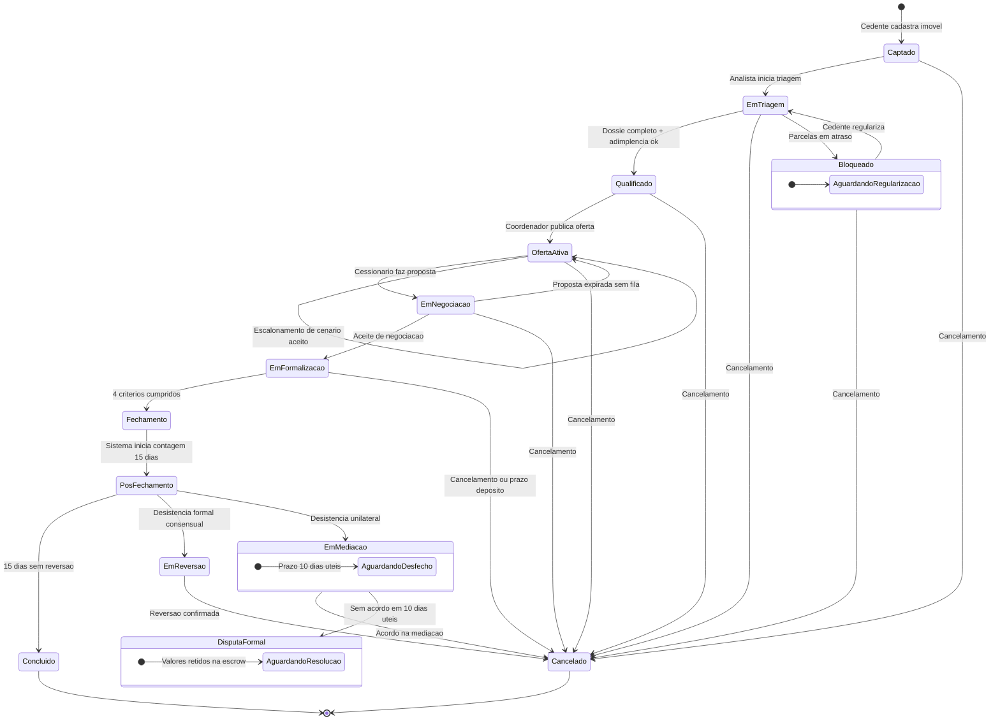

# 🏗️ Regras de Negócio — Fundação e Acessos

## Módulo Admin — Repasse Seguro

| **Campo** | **Valor** |
|---|---|
| **Destinatário** | Equipe de Produto e Engenharia |
| **Escopo** | Glossário · Tipos de usuário e perfis · Cadastro e autenticação · Estados e ciclo de vida do caso · Onboarding · Mapa de módulos · Cadastro e elegibilidade do caso |
| **Módulo** | Admin |
| **Parte** | Parte 1 de 5 — Fundação e Acessos |
| **Versão** | v1.2 |
| **Responsável** | Claude Code Desktop |
| **Data da versão** | 2026-03-22 (America/Fortaleza) |
| **Continuidade** | Início |
| **Origem do arquivo de entrada** | 01 - Regras de Negócio.md |

---

> 📌 **TL;DR**
>
> Este arquivo estabelece a base conceitual e de acesso do Módulo Admin do Repasse Seguro. Cobre: o glossário completo de termos do negócio, os 4 perfis internos de operador (Analista, Coordenador, Gestor Financeiro e Master) com suas permissões, as regras de cadastro e autenticação, o ciclo de vida completo do caso com seus 14 estados, as regras de elegibilidade para entrada de um caso na plataforma (adimplência, dossiê mínimo e unicidade de imóvel) e o mapa de todos os módulos da sidebar. A numeração de RNs neste arquivo vai de **RN-001 a RN-017** (v1.0) e **RN-139 a RN-140** (correções v1.1).

---

## 🎯 Contexto Estratégico

O Repasse Seguro é uma plataforma que intermediação de cessões de contratos imobiliários. O **Módulo Admin** é a dashboard operacional interna usada pelos operadores do Repasse Seguro para gerenciar todo o ciclo de vida de um caso: desde a captação do imóvel pelo Cedente até a distribuição final dos valores pela Conta Escrow.

O Admin é uma **dashboard única com menu lateral (sidebar) fixo** no lado esquerdo da tela. Cada clique no menu lateral muda a área de trabalho à direita sem recarregar a página.

---

## 1. Glossário

| **Termo** | **Definição** |
|---|---|
| **Cedente** | Pessoa que tem um contrato de imóvel com uma construtora e quer transferir esse contrato para outra pessoa. É quem "vende" o direito de repasse. |
| **Cessionário** | Pessoa que adquire o direito do contrato do Cedente. É quem "compra" o repasse. Também chamado de Comprador ou Investidor. |
| **Caso** | Cada imóvel cadastrado na plataforma por um Cedente. O caso percorre vários estados, da captação até a conclusão. É a unidade central de trabalho do Admin. |
| **Dossiê** | Conjunto de documentos e evidências obrigatórias de um caso. Inclui contrato original, comprovantes de pagamento, tabelas de preço e instrumento de cessão assinado. O dossiê nunca é apagado, mesmo após a conclusão ou cancelamento do caso. |
| **Cenário de Retorno (A, B, C, D)** | Opção escolhida pelo Cedente no momento do cadastro do imóvel. Define quanto ele quer receber de volta. A = transfere apenas o saldo devedor (sem receber valor adicional). B = recebe 100% do que pagou. C = recebe 100% do que pagou + 30% de valorização. D = recebe 100% do que pagou + 50% de valorização. |
| **Tabela do Contrato** | Preço do imóvel conforme o contrato original entre o Cedente e a construtora, na data da assinatura. |
| **Tabela Atual** | Preço do imóvel na data em que o Cessionário faz a proposta. Pode ser obtida da construtora, de oferta pública ou de avaliação formal com laudo. |
| **Delta (Δ)** | Diferença entre a Tabela Atual e a Tabela do Contrato. Exemplo: Tabela Atual R$ 600.000 e Tabela do Contrato R$ 500.000 → Δ = R$ 100.000. |
| **Valor Recuperado** | Quanto o Cedente efetivamente recebe no fechamento do repasse, antes do desconto da comissão do RS. |
| **Valor Distrato Referência** | Quanto o Cedente receberia se desistisse do contrato pela via do distrato. Para fins de cálculo, corresponde a 50% do valor pago pelo Cedente (percentual configurável pelo Master). |
| **Conta Escrow** | Conta garantia operada por um parceiro financeiro regulado. O Cessionário deposita o valor total da transação nessa conta antes do Fechamento. O dinheiro só é liberado após o Admin confirmar todos os critérios do Fechamento. Protege todas as partes contra fraude ou inadimplência. |
| **Fechamento** | Evento que confirma a conclusão do negócio. Exige 4 critérios cumpridos ao mesmo tempo: instrumento assinado, preço confirmado por evidência, anuência da construtora obtida e depósito do Cessionário confirmado na Conta Escrow. |
| **Termo Comercial** | Documento formalizado entre as partes e o Repasse Seguro. Define os percentuais de comissão, as condições de cada caso e as responsabilidades de cada parte. |
| **Escalonamento** | Quando o caso não atrai comprador no cenário escolhido, o Cedente pode aceitar descer para o cenário imediatamente inferior (D→C, C→B, B→A). O escalonamento é sempre descendente. Subir de cenário exige cancelar o caso e cadastrar novamente. |
| **Anuência** | Autorização formal da construtora para transferir o contrato de uma pessoa para outra. Obrigatória quando o contrato original exige. |
| **Reversão** | Cancelamento do negócio dentro dos 15 dias corridos após o Fechamento. A Conta Escrow estorna os valores integralmente ao Cessionário. O RS não recebe comissão. |
| **Proposta** | Oferta financeira feita pelo Cessionário para adquirir um repasse. Dispara o início da negociação. |
| **SLA** | Prazo máximo para completar cada etapa do processo. Se estourar, o sistema gera alerta automático. |
| **Sidebar** | Menu fixo no lado esquerdo da dashboard Admin. Permite navegar entre as áreas sem sair da plataforma. |
| **ZapSign** | Ferramenta de assinatura eletrônica integrada à plataforma para assinar o Instrumento de Cessão, o Termo Comercial e o Termo de Aceite de Escalonamento. |
| **Guardião do Retorno** | Agente de IA responsável por validar e proteger os cenários de retorno do Cedente. |
| **Analista de Oportunidades** | Agente de IA responsável por identificar e qualificar oportunidades de match entre ofertas ativas e Cessionários. |

---

## 2. Mapa de Módulos (Sidebar)

| **Menu** | **Objetivo** | **Quem acessa** |
|---|---|---|
| **Dashboard** | Resumo operacional visual da situação atual de toda a plataforma. Primeira tela ao fazer login. | Todos os perfis (conteúdo filtrado por perfil) |
| **Pipeline** | Visão geral de todos os casos por status (kanban ou lista). | Analista (só seus casos), Coordenador, Master (todos), Gestor Financeiro (somente leitura) |
| **Triagem** | Fila de casos aguardando verificação documental. Área principal do Analista. | Analista, Coordenador, Master |
| **Negociação** | Painel de mediação de propostas entre Cedente e Cessionário. | Analista, Coordenador, Master |
| **Formalização** | Gestão de assinaturas (ZapSign), anuência da construtora e depósito na Conta Escrow. | Analista, Coordenador, Master |
| **Financeiro** | Conta Escrow, faturas, comissões, distribuição de valores e inadimplência. Área principal do Gestor Financeiro. | Coordenador (somente leitura), Gestor Financeiro, Master |
| **Supervisão IA** | Logs dos agentes de IA, controle de takeover e métricas de desempenho. | Coordenador, Master |
| **Usuários** | Cadastro e gestão de Cedentes, Cessionários e operadores internos. | Coordenador (leitura + edição básica), Master (tudo) |
| **Relatórios** | Métricas de SLA, volume, receita, conversão e auditoria. | Coordenador (sem Receita), Gestor Financeiro (Receita + Auditoria), Master (tudo) |
| **Configurações** | Parâmetros globais: percentuais, prazos, templates, limiares de IA. | Apenas Master |

---

## 3. Perfis de Operador

### 3.1 Descrição dos Perfis

| **Perfil** | **Função** | **Atribuição** |
|---|---|---|
| **Analista** | Executa a operação diária: triagem, negociação, formalização e fechamento dos casos atribuídos. | Atribuído pelo Master. Trabalha apenas em casos designados pelo Coordenador. |
| **Coordenador** | Supervisiona os Analistas, atribui casos, aprova escalonamentos, cancela casos, resolve escalações de negociação e media disputas. | Atribuído pelo Master. |
| **Gestor Financeiro** | Monitora a Conta Escrow, processa estornos, inicia reversões e exporta relatórios financeiros. | Atribuído pelo Master. |
| **Master** | Acesso irrestrito a todas as telas e ações. Cria e gerencia operadores, configura parâmetros globais, aprova bloqueios de distribuição. | Perfil de máxima autoridade. Deve haver pelo menos 1 Master ativo. |

### 3.2 Matriz de Permissões por Menu

| **Perfil** | **Dashboard** | **Pipeline** | **Triagem** | **Negociação** | **Formalização** | **Financeiro** | **Supervisão IA** | **Usuários** | **Relatórios** | **Configurações** |
|---|---|---|---|---|---|---|---|---|---|---|
| **Analista** | ✅ (seus casos) | ✅ (seus casos) | ✅ | ✅ | ✅ | 🚫 | 🚫 | 🚫 | 🚫 | 🚫 |
| **Coordenador** | ✅ (todos) | ✅ (todos) | ✅ | ✅ | ✅ | ✅ (leitura) | ✅ | ✅ (leitura+edição) | ✅ (sem Receita) | 🚫 |
| **Gestor Financeiro** | ✅ (financeiro) | ✅ (leitura) | 🚫 | 🚫 | 🚫 | ✅ | 🚫 | ✅ (somente leitura) | ✅ (Receita+Auditoria) | 🚫 |
| **Master** | ✅ (tudo) | ✅ (tudo) | ✅ | ✅ | ✅ | ✅ | ✅ | ✅ | ✅ | ✅ |

---

## 4. Entidades do Negócio

| **Entidade** | **O que é** | **Quem cria** | **Quem edita** | **Quando deixa de valer** |
|---|---|---|---|---|
| **Caso** | Representa um imóvel em processo de repasse. É a unidade central de trabalho. | Cedente (via cadastro) | Analista, Coordenador | Quando é Concluído ou Cancelado |
| **Dossiê** | Pasta de evidências do caso. Garante rastreabilidade. | Sistema (automático ao criar o caso) | Analista (anexa documentos) | Nunca. Arquivado mesmo após conclusão |
| **Proposta** | Oferta financeira do Cessionário. Dispara o início da negociação. | Cessionário | Cessionário (antes do aceite) | Quando aceita, recusada ou caso cancelado |
| **Termo Comercial** | Contrato que define comissões e condições. | Analista (gera pelo sistema) | Analista (antes da assinatura) | Quando o caso é Concluído ou Cancelado |
| **Conta Escrow do Caso** | Conta garantia individual vinculada ao caso. | Sistema (automático ao entrar em Formalização) | Não editável | Quando os valores são 100% distribuídos ou estornados |
| **Fatura de Comissão** | Registro formal da comissão devida ao RS. | Sistema (automático no Fechamento) | Não editável | Quando paga via escrow ou cancelada |
| **Envelope ZapSign** | Pacote de assinatura eletrônica. | Analista (envia pelo sistema) | Não editável após envio | Quando todos assinam ou caso é cancelado |
| **Alerta de SLA** | Aviso automático quando um prazo está próximo de estourar ou já estourou. | Sistema (automático) | Não editável | Quando a ação pendente é resolvida |

---

## 5. Ciclo de Vida do Caso — Estados e Transições

### 5.1 Diagrama de Estados

### 5.2 Tabela de Estados

| **Estado** | **Descrição** | **Quem atua** | **Tipo** |
|---|---|---|---|
| **Captado** | Cedente acabou de cadastrar o imóvel. Aguarda início da triagem. | Sistema (automático) | Transitório |
| **Em Triagem** | Analista verifica dossiê e adimplência. | Analista | Ativo |
| **Bloqueado** | Parcelas em atraso. Aguardando regularização do Cedente. | Cedente | Pausado |
| **Qualificado** | Dossiê aprovado. Pronto para publicação de oferta. | Coordenador | Transitório |
| **Oferta Ativa** | Oferta publicada. Aguardando propostas de Cessionários. | Sistema / Cessionário | Ativo |
| **Em Negociação** | Pelo menos 1 proposta recebida. Lances e contrapropostas em andamento. | Analista / Coordenador | Ativo |
| **Em Formalização** | Negociação concluída. Assinaturas, anuência e depósito em andamento. | Analista / Cessionário | Ativo |
| **Fechamento** | 4 critérios cumpridos. Admin confirmou o fechamento. | Analista | Transitório |
| **Pós Fechamento** | Contagem de 15 dias corridos. Valores retidos na escrow. | Sistema (automático) | Ativo |
| **Em Reversão** | Desistência comunicada com aceite consensual. Conta Escrow congelada. | Gestor Financeiro | Ativo |
| **Em Mediação** | Mediação formal em curso. Conta Escrow 100% congelada. | Coordenador | Ativo |
| **Disputa Formal** | Mediação falhou. Valores retidos até resolução extrajudicial ou judicial. | Master / Externo | Pausado |
| **Concluído** | Negócio finalizado. Valores distribuídos pela Conta Escrow. | Sistema (automático) | **Terminal** |
| **Cancelado** | Caso encerrado. Valores estornados se aplicável. | Coordenador / Master | **Terminal** |

---

## 6. Regras de Negócio — Cadastro e Elegibilidade

---

**RN-001: Adimplência obrigatória como requisito de triagem**

> Origem: Regra 01 (arquivo de entrada)

🎯 **Objetivo do módulo de triagem:** Garantir que somente contratos com parcelas em dia avancem na esteira. Contratos inadimplentes têm a anuência da construtora negada, o que inviabiliza o fechamento e desperdiça o trabalho de todos os envolvidos.

**Atores:** Cedente (envia comprovantes), Analista (verifica), Coordenador (aprova exceção), Sistema (bloqueia)

**Objeto principal:** Caso

**Estados possíveis do objeto:** Em Triagem → Qualificado (se adimplente) | Em Triagem → Bloqueado (se inadimplente) | Bloqueado → Em Triagem (após regularização)

**Operações principais:** Verificar, Bloquear, Desbloquear

1. O Cedente cadastra o imóvel e o Analista abre o caso para triagem.
2. O sistema verifica se o dossiê contém os comprovantes de pagamento das últimas 3 parcelas e a declaração de adimplência assinada.
3. **Se todos os comprovantes estão presentes e as parcelas estão em dia:** o Analista avança o caso para "Qualificado". O sistema registra carimbo com nome do Analista, data e hora.
4. **Se qualquer parcela está em atraso ou o comprovante está ausente:** o Analista clica em "Bloquear Caso". O sistema muda o status para "Bloqueado" e envia notificação automática ao Cedente com orientações para regularização.
5. **Efeito no estado do objeto:** Em Triagem → Bloqueado (inadimplente) | Em Triagem → Qualificado (adimplente).
6. **Consequência se violada:** Caso avança sem validação de adimplência. A construtora nega a anuência na etapa de Formalização, causando cancelamento tardio, retrabalho e possível estorno de depósito da Conta Escrow.

**RN-001.a: Exceção de adimplência por confirmação da construtora**

> Origem: Regra 01 — Exceções (arquivo de entrada)

1. A construtora envia confirmação formal por escrito (e-mail ou ofício) declarando que não há pendências no contrato.
2. O sistema verifica se a confirmação foi anexada ao dossiê pelo Analista.
3. **Se a confirmação foi anexada e o Coordenador aprovou:** o Analista registra a exceção no dossiê e avança o caso para "Qualificado".
4. **Se a confirmação não foi obtida ou o Coordenador não aprovou:** o Analista não pode registrar a exceção. O caso permanece em "Bloqueado".
5. **Efeito no estado do objeto:** Bloqueado → Qualificado (apenas com aprovação do Coordenador).
6. **Consequência se violada:** Exceção registrada sem aprovação do Coordenador gera risco jurídico e financeiro para o Repasse Seguro.

**Mensagens ao usuário:**
- Bloqueio por inadimplência (ao Cedente): "Seu caso foi bloqueado por pendência de parcelas. Regularize as parcelas indicadas e envie o comprovante de pagamento para desbloquear."
- Desbloqueio após regularização (ao Cedente): "Seu comprovante foi validado. Seu caso voltou para análise e será avaliado em até 3 dias úteis."

**Edge cases:**
- Cedente envia comprovante ilegível: o Analista rejeita o documento e solicita reenvio. O caso permanece em "Bloqueado".
- Caso permanece "Bloqueado" por mais de 60 dias corridos sem ação do Cedente: o sistema sugere cancelamento ao Coordenador (ver TR-04, Parte 01.3).
- Desbloqueio exige que o motivo original tenha sido resolvido. O Analista não pode desbloquear sem novo comprovante válido.

**Estados de interface (Triagem/Bloqueio):** [CORRIGIDO: PROBLEMA-001]
- Estado normal: checklist de documentos com status individual (Pendente ⏳, Verificado ✅, Rejeitado ❌).
- Estado bloqueado: banner fixo no topo do painel do caso com label "Caso Bloqueado — Inadimplência" em fundo vermelho. Todas as ações de avanço ficam desabilitadas. Apenas "Desbloquear" fica ativo (para Analista atribuído e Coordenador).
- Estado de carregamento: ao clicar "Bloquear Caso", botão muda para estado de processamento (spinner + texto "Bloqueando..."). Após confirmação, exibe toast de sucesso.
- Feedback ao Cedente: após bloqueio, o painel do Cedente exibe banner informativo com lista de parcelas pendentes e botão "Enviar Comprovante".

**Micro-interação de bloqueio/desbloqueio:** [CORRIGIDO: PROBLEMA-002]
- Ao clicar "Bloquear Caso", o sistema exibe modal de confirmação: "Confirma o bloqueio por inadimplência? O Cedente será notificado automaticamente." com botões "Confirmar" e "Cancelar".
- Ao clicar "Desbloquear", o sistema exibe checklist dos motivos originais com indicação de resolução antes de permitir confirmação.

---

**RN-002: Dossiê mínimo de 6 documentos para aprovação de triagem**

> Origem: Regra 02 (arquivo de entrada)

🎯 **Objetivo:** Garantir que nenhum caso avance para oferta sem documentação completa. Um dossiê incompleto pode inviabilizar o fechamento meses depois.

**Operações principais:** Verificar, Solicitar, Aprovar

1. O Analista seleciona o caso na fila de triagem e abre a aba "Dossiê".
2. O sistema apresenta o checklist dos 6 documentos obrigatórios com o status de cada um (Pendente, Verificado ou Rejeitado):
   - 2.1. Contrato original do imóvel com a construtora.
   - 2.2. Comprovantes das últimas 3 parcelas pagas.
   - 2.3. Declaração de adimplência assinada pelo Cedente.
   - 2.4. Documento de identidade do Cedente (RG ou CNH).
   - 2.5. Comprovante de endereço atualizado (emitido nos últimos 90 dias).
   - 2.6. Tabela do Contrato (valor original do imóvel).
3. **Se todos os 6 documentos estão com status "Verificado":** o botão "Aprovar Triagem" fica ativo. O Analista clica para avançar o caso para "Qualificado".
4. **Se falta algum documento ou algum foi rejeitado:** o botão "Aprovar Triagem" permanece inativo. O Analista clica em "Solicitar Documentos". O sistema envia ao Cedente a lista exata dos documentos pendentes. O caso permanece em "Em Triagem".
5. **Efeito no estado do objeto:** Em Triagem → Qualificado (todos os 6 documentos verificados).
6. **Consequência se violada:** Não existe "aprovação condicional" de triagem. Casos aprovados sem dossiê completo geram risco de cancelamento por falta de documentação no fechamento.

**Mensagens ao usuário:**
- Documentos faltantes (ao Cedente): "Faltam os seguintes documentos para completar sua triagem: [lista]. Envie-os pelo painel para prosseguir."
- Todos os documentos verificados (ao Analista): "Todos os documentos foram verificados. A triagem pode ser aprovada."
- Documento rejeitado (ao Cedente): "O documento [nome] foi rejeitado. Motivo: [justificativa do Analista]. Envie uma nova versão para continuar."

**Edge cases:**
- Cedente reenvia documento rejeitado: o novo documento substitui o anterior no checklist, mas o histórico do documento anterior é preservado no dossiê.
- Cada documento verificado recebe carimbo imutável com nome do Analista, data e hora.
- Não existe aprovação condicional. Nenhum perfil pode avançar o caso sem os 6 documentos verificados.

**Estados de interface (Dossiê/Checklist):** [CORRIGIDO: PROBLEMA-003]
- Barra de progresso no topo do painel: "X de 6 documentos verificados" com preenchimento proporcional.
- Cada item do checklist exibe ícone de status: ⏳ Pendente (cinza), ✅ Verificado (verde), ❌ Rejeitado (vermelho).
- Botão "Aprovar Triagem" desabilitado com tooltip explicativo enquanto houver pendências: "Faltam X documentos para habilitar a aprovação."
- Botão "Solicitar Documentos" gera preview do e-mail que será enviado ao Cedente antes de confirmar o envio.

**Feedback de verificação individual:** [CORRIGIDO: PROBLEMA-004]
- Ao clicar "Verificar" em um documento, o sistema exibe animação de transição do ícone ⏳ → ✅ com micro-animação de check (0,3s).
- Ao clicar "Rejeitar", o sistema exige campo de justificativa (mínimo 10 caracteres) antes de confirmar. O ícone muda de ⏳ → ❌.
- O carimbo de verificação é exibido como tooltip ao passar o cursor sobre o ícone ✅: "Verificado por [Nome] em [data] às [hora]".

---

**RN-003: Um caso ativo por imóvel por Cedente**

> Origem: Regra 03 e Suposição S3 (arquivo de entrada)

🎯 **Objetivo:** Evitar que o mesmo imóvel gere dois processos simultâneos, o que causaria cobranças duplicadas e conflito operacional.

1. O Cedente tenta cadastrar um imóvel na plataforma.
2. O sistema verifica se já existe um caso ativo (em qualquer status exceto Concluído ou Cancelado) para o mesmo imóvel e o mesmo Cedente.
3. **Se não existe caso ativo para esse imóvel e esse Cedente:** o sistema permite o novo cadastro normalmente.
4. **Se já existe um caso ativo para o mesmo imóvel e o mesmo Cedente:** o sistema bloqueia o novo cadastro e exibe mensagem ao Cedente.
5. **Efeito no estado do objeto:** O caso duplicado não é criado. O caso existente permanece inalterado.
6. **Consequência se violada:** O mesmo imóvel pode gerar cobranças conflitantes e dois processos paralelos para o mesmo contrato.

**RN-003.a: Cadastro simultâneo por Cedentes diferentes no mesmo imóvel**

> Origem: Regra 03 — Condições (arquivo de entrada)

1. Dois Cedentes diferentes tentam cadastrar o mesmo imóvel ao mesmo tempo.
2. O sistema permite ambos os cadastros, pois podem existir co-proprietários legítimos.
3. **Se os CPFs/CNPJs dos Cedentes são diferentes:** o sistema cria ambos os casos e gera alerta automático ao Coordenador para verificação de legitimidade (possível co-propriedade ou tentativa de fraude).
4. **Se os CPFs/CNPJs dos Cedentes são iguais:** aplicar RN-003 (bloqueio por duplicata do mesmo Cedente).
5. **Consequência se violada:** Um imóvel pode ser negociado em dois processos paralelos sem que nenhuma parte saiba, gerando conflito de direitos.

**Mensagens ao usuário:**
- Cadastro bloqueado por duplicata (ao Cedente): "Você já tem um caso ativo para este imóvel. Acompanhe o caso existente no seu painel."
- Novo cadastro após cancelamento (ao Cedente): o sistema permite normalmente, sem bloqueio nem mensagem de alerta.

**Edge cases:**
- Se o caso anterior foi Cancelado ou Concluído, o Cedente pode cadastrar o mesmo imóvel novamente sem restrições.
- A tentativa de cadastro duplicado é registrada no log com data e identificação do Cedente.

**Feedback de bloqueio de cadastro duplicado:** [CORRIGIDO: PROBLEMA-005]
- Mensagem de bloqueio exibida inline no formulário de cadastro, não em modal, para que o Cedente possa corrigir sem perder dados preenchidos.
- Link direto para o caso ativo existente no painel do Cedente: "Ir para o caso ativo".
- Se o Cedente tem caso em outro status (Cancelado/Concluído), nenhuma mensagem é exibida e o cadastro prossegue normalmente.

**Alerta de co-propriedade (RN-003.a):** [CORRIGIDO: PROBLEMA-006]
- Alerta ao Coordenador exibido como card destacado no Pipeline com badge "Possível co-propriedade" em amarelo.
- O card contém: endereço do imóvel, nomes dos dois Cedentes, data de ambos os cadastros e botão "Investigar".
- [DECISÃO APLICADA: DEC-001] O alerta de co-propriedade não bloqueia nenhum dos dois cadastros. Justificativa: bloquear ambos penalizaria Cedentes legítimos de co-propriedade, e a verificação pelo Coordenador é suficiente para detectar fraude.

---

## 7. Regras de Negócio — Perfis, Permissões e Autenticação

---

**RN-004: Perfis de acesso e permissões do Admin**

> Origem: Regra 12 (arquivo de entrada)

🎯 **Objetivo:** Garantir que cada operador veja e faça apenas o que é necessário para sua função, protegendo dados financeiros, a privacidade das partes e a integridade operacional.

**Atores:** Master (atribui perfis), todos os operadores (recebem perfil)

**Objeto principal:** Perfil de operador

**Estados possíveis:** Ativo, Inativo, Suspenso

**Operações principais:** Atribuir, Alterar, Suspender, Reativar

1. O Master acessa o menu "Configurações" e cria ou edita o perfil de um operador.
2. O sistema verifica se o operador existe no cadastro e se o Master está autenticado.
3. **Se o operador existe e o perfil selecionado é válido:** o sistema atualiza o perfil do operador imediatamente. A sidebar do operador é atualizada na próxima vez que ele acessar a plataforma.
4. **Se o Master tenta alterar o próprio perfil para um nível inferior e ele é o único Master ativo:** o sistema bloqueia a alteração.
5. **Efeito no estado do objeto:** Perfil anterior → Novo perfil. A mudança é imediata e registrada no log de auditoria.
6. **Consequência se violada:** Operadores com permissões excessivas podem executar ações fora de sua competência, gerando risco financeiro, legal ou operacional.

**RN-004.a: Tentativa de acesso a área não permitida**

> Origem: Regra 12 — Ação (arquivo de entrada)

1. Um operador tenta acessar um menu ou ação que não pertence ao seu perfil.
2. O sistema verifica o perfil do operador contra a lista de permissões do recurso solicitado.
3. **Se o operador não tem permissão:** o sistema bloqueia o acesso e exibe mensagem de acesso negado. A tentativa é registrada no log.
4. **Se o operador tem permissão:** o sistema exibe normalmente o menu ou executa a ação.
5. **Consequência se violada:** Acesso indevido a dados financeiros, decisões operacionais ou configurações pode comprometer a operação e a segurança da plataforma.

**Mensagens ao usuário:**
- Acesso negado: "Você não tem permissão para acessar esta área. Contate o Master para alterar seu perfil."
- Ação bloqueada por perfil: "Sua função não permite executar esta ação. Solicite ao Coordenador ou Master."

**Comportamento visual de acesso negado:** [CORRIGIDO: PROBLEMA-007]
- Menus sem permissão não aparecem na sidebar (ocultação total, não botão desabilitado). O operador nunca vê menus aos quais não tem acesso.
- Se o operador tentar acessar uma URL restrita diretamente (via barra de endereço), o sistema exibe tela de acesso negado com: ícone de cadeado, mensagem de acesso negado e botão "Voltar à Dashboard".
- [DECISÃO APLICADA: DEC-002] Menus restritos são ocultados (não desabilitados). Justificativa: exibir menus desabilitados gera curiosidade desnecessária e confusão sobre o que o operador deveria ou não acessar. Ocultar simplifica a interface para cada perfil.

**Feedback imediato de mudança de perfil (RN-004):** [CORRIGIDO: PROBLEMA-008]
- Após o Master alterar o perfil de um operador, o operador logado recebe notificação via painel: "Seu perfil foi atualizado para [novo perfil]. A sidebar foi atualizada."
- A sidebar é atualizada sem necessidade de logout/login. Os menus mudam dinamicamente ao navegar para a próxima tela.

---

**RN-005: Autenticação e segurança de acesso**

> Origem: USR-08 (arquivo de entrada)

🎯 **Objetivo:** Garantir que apenas pessoas autorizadas acessem a plataforma e que sessões comprometidas sejam encerradas automaticamente.

**Objeto principal:** Sessão do operador

**Estados possíveis:** Ativa, Expirada, Bloqueada

1. O operador acessa a plataforma e informa e-mail e senha.
2. O sistema verifica as credenciais e o status da conta (ativa, inativa, suspensa, bloqueada).
3. **Se as credenciais são válidas e a conta está ativa:** o sistema inicia a sessão. Para operadores do Admin (Analista, Coordenador, Gestor Financeiro, Master), o sistema exige o código de autenticação de dois fatores (2FA) via aplicativo autenticador antes de liberar o acesso.
4. **Se o e-mail ou a senha estão incorretos:** o sistema registra a tentativa. Após 5 tentativas consecutivas com falha, a conta é bloqueada automaticamente por 30 minutos para operadores do Admin (15 minutos para Cedentes e Cessionários).
5. **Efeito no estado do objeto:** Sessão criada (ativa) → Sessão expirada por inatividade conforme o perfil:
   - **Operadores Admin** (Analista, Coordenador, Gestor Financeiro, Master): **8 horas** de inatividade.
   - **Cedentes:** **24 horas** de inatividade.
   - **Cessionários:** **30 minutos** de inatividade (definido no módulo Cessionário/01.1 RN-004).
   > **Nota (CORREÇÃO #02):** Cessionários têm sessão mais curta (30 min) por estarem em fluxo de transação financeira sensível; Cedentes têm 24 horas por interagirem em fluxos documentais com menor risco imediato.
6. **Consequência se violada:** Acesso não autorizado à plataforma pode comprometer dados sensíveis de operação, informações das partes e movimentações financeiras.

**RN-005.a: Requisitos mínimos de senha**

> Origem: USR-08 (arquivo de entrada) | [DECISÃO AUTÔNOMA — padrão adotado conforme USR-08: 8 caracteres, 1 maiúscula, 1 número. Alternativa descartada: exigir caractere especial, descartada por aumentar abandono sem ganho relevante de segurança no perfil de usuário B2B.]

1. O operador tenta definir ou redefinir sua senha.
2. O sistema verifica se a senha atende aos requisitos mínimos configurados em "Configurações > Perfis e Acessos".
3. **Se a senha atende:** o sistema aceita e salva.
4. **Se a senha não atende:** o sistema exibe quais critérios estão faltando e não salva até que todos sejam cumpridos.
5. O padrão configurável é: mínimo 8 caracteres, ao menos 1 letra maiúscula, ao menos 1 número.

**Mensagens ao usuário:**
- Conta bloqueada por tentativas: "Sua conta foi temporariamente bloqueada por segurança. Aguarde 30 minutos ou contate o Master para desbloqueio imediato."
- Sessão expirada: "Sua sessão expirou por inatividade. Faça login novamente para continuar."
- Senha não atende aos requisitos: "Sua senha precisa ter pelo menos 8 caracteres, 1 letra maiúscula e 1 número. Tente novamente."

**Estados de interface (Login e Autenticação):** [CORRIGIDO: PROBLEMA-009]
- Tela de login: campos de e-mail e senha com validação inline em tempo real. Botão "Entrar" desabilitado até que ambos os campos estejam preenchidos.
- Estado de carregamento no login: botão "Entrar" muda para spinner + "Verificando..." ao clicar.
- Tela de 2FA: campo numérico de 6 dígitos com auto-foco. Timer regressivo de 30 segundos para expiração do código. Link "Reenviar código" ativado após 30 segundos.
- Contador de tentativas visível: após a 3ª tentativa falha, exibir "X de 5 tentativas restantes" em amarelo. Após bloqueio, exibir timer regressivo de desbloqueio.

**Fluxo de recuperação de senha:** [CORRIGIDO: PROBLEMA-010]
- [DECISÃO APLICADA: DEC-003] O fluxo de "Esqueci minha senha" envia link de redefinição para o e-mail cadastrado. O link expira em 1 hora. Justificativa: links de redefinição sem expiração representam risco de segurança; 1 hora é padrão de mercado e equilibra segurança com usabilidade.
- Mensagem após solicitar redefinição: "Se o e-mail informado estiver cadastrado, você receberá um link de redefinição. Verifique sua caixa de entrada e spam."
- O sistema não confirma nem nega a existência do e-mail no banco para evitar enumeração de contas.

---

**RN-006: Unicidade de cadastro de Cedente e Cessionário**

> Origem: USR-01 (arquivo de entrada)

1. Uma pessoa tenta se cadastrar na plataforma como Cedente ou Cessionário.
2. O sistema verifica se o CPF ou CNPJ informado já está vinculado a um cadastro existente no mesmo tipo de perfil.
3. **Se o CPF/CNPJ não está em uso para aquele tipo de perfil:** o sistema cria o cadastro normalmente.
4. **Se o CPF/CNPJ já está em uso para o mesmo tipo de perfil:** o sistema bloqueia o novo cadastro e informa que o documento já está registrado.
5. **Restrição anti-self-dealing:** o sistema bloqueia que o mesmo CPF/CNPJ seja Cessionário em um caso onde já figure como Cedente e vice-versa. A mesma pessoa pode ser Cedente em um caso e Cessionário em outro caso diferente, mas nunca nos dois lados do mesmo caso.
6. **Consequência se violada:** O mesmo imóvel pode ser negociado consigo mesmo, gerando conflito de interesse e fraude financeira.

**Mensagens ao usuário:**
- Tentativa de self-dealing: "Não é permitido negociar consigo mesmo. O CPF informado já está cadastrado como Cedente neste caso."
- CPF/CNPJ já cadastrado: "Este documento já está vinculado a um cadastro como [Cedente/Cessionário]. Faça login com sua conta existente."

**Feedback de validação de cadastro:** [CORRIGIDO: PROBLEMA-011]
- Validação de CPF/CNPJ em tempo real (enquanto digita): formato inválido exibe erro inline vermelho "CPF/CNPJ inválido".
- Validação de duplicidade ao sair do campo (onBlur): consulta ao servidor para verificar se já existe cadastro. Se existir, exibe mensagem inline com link "Fazer login".
- Validação de self-dealing ocorre ao submeter proposta, não no cadastro. Mensagem exibida na tela de submissão da proposta.

---

**RN-007: Verificação de identidade do Cessionário (KYC)**

> Origem: USR-07 (arquivo de entrada)

1. O Cessionário tenta submeter sua primeira proposta para um caso.
2. O sistema verifica se o Cessionário completou a verificação de identidade (KYC).
3. **Se o KYC está completo e aprovado:** o sistema permite a submissão da proposta normalmente.
4. **Se o KYC está incompleto ou pendente:** o sistema bloqueia a proposta e solicita que o Cessionário complete a verificação antes de prosseguir. A verificação exige: (a) documento de identidade (RG ou CNH), (b) comprovante de endereço emitido nos últimos 90 dias, (c) selfie com prova de vida (liveness check).
5. **Efeito no estado do objeto:** Cessionário sem KYC não pode submeter proposta. Após aprovação do KYC, a restrição é removida permanentemente para aquele perfil.
6. **Consequência se violada:** Cessionários não verificados podem submeter propostas fraudulentas, comprometendo o processo de negociação e o depósito na Conta Escrow.

**Mensagens ao usuário:**
- KYC pendente: "Antes de fazer uma proposta, complete a verificação de identidade. Acesse 'Meu Perfil' para enviar os documentos necessários."
- KYC aprovado: "Sua identidade foi verificada. Você já pode submeter propostas."
- KYC em análise: "Seus documentos foram recebidos e estão em análise. A validação automática leva até 5 minutos. Se for necessária revisão manual, o prazo é de até 24 horas úteis. Você será notificado quando a verificação for concluída." [CORREÇÃO #03]
- KYC rejeitado: "Sua verificação de identidade não pôde ser concluída. Motivo: [justificativa]. Envie novos documentos para tentar novamente."

**Estados do KYC no perfil do Cessionário:** [CORRIGIDO: PROBLEMA-012]
- Não iniciado: badge cinza "KYC Pendente" com botão "Iniciar Verificação".
- Em análise: badge amarelo "KYC em Análise" com indicação de prazo estimado (até 24 horas úteis para revisão manual; até 5 minutos para validação automática via OCR/liveness).
- Aprovado: badge verde "Identidade Verificada" permanente.
- Rejeitado: badge vermelho "KYC Rejeitado" com motivo e botão "Reenviar Documentos".
- [DECISÃO APLICADA: DEC-004 — CORRIGIDO #03] O prazo de análise do KYC é de **até 5 minutos** para validação automática (OCR + liveness check). Quando a validação automática não for conclusiva e o caso for encaminhado para revisão manual, o prazo é de **24 horas úteis**. Justificativa: a validação automática cobre a maioria dos casos; a revisão manual de 24h (antes "2 dias úteis") reduz o atrito para o Cessionário sem comprometer a qualidade da verificação.

---

**RN-008: Validação de e-mail antes da primeira proposta**

> Origem: USR-02 (arquivo de entrada)

1. Um Cedente ou Cessionário tenta executar sua primeira ação na plataforma (Cedente: cadastrar imóvel | Cessionário: submeter proposta).
2. O sistema verifica se o e-mail do usuário foi confirmado por link de validação.
3. **Se o e-mail está validado:** o sistema permite a ação normalmente.
4. **Se o e-mail ainda não foi validado:** o sistema bloqueia a ação e exibe instrução para verificar a caixa de entrada e clicar no link de confirmação enviado no cadastro.
5. **Consequência se violada:** Sem validação de e-mail, notificações críticas (SLA, depósitos, fechamentos) podem não chegar ao destinatário, causando falhas operacionais.

**Mensagens ao usuário:**
- E-mail não validado: "Confirme seu e-mail antes de continuar. Um link de confirmação foi enviado para [e-mail mascarado]. Verifique também a pasta de spam."

**Fluxo de validação de e-mail:** [CORRIGIDO: PROBLEMA-013]
- Tela de bloqueio exibe: mensagem de e-mail não validado, e-mail mascarado (ex: f***@email.com), botão "Reenviar E-mail de Confirmação" e link "Alterar e-mail".
- Após reenvio: toast de confirmação "E-mail reenviado com sucesso." Botão "Reenviar" desabilitado por 60 segundos para evitar spam.
- Após validação: redirecionamento automático para a ação que o usuário tentava executar (cadastrar imóvel ou submeter proposta).
- [DECISÃO APLICADA: DEC-005] O link de validação de e-mail expira em 24 horas. Após expiração, o usuário precisa solicitar novo link. Justificativa: links sem expiração representam risco de segurança se o e-mail for comprometido.

---

## 8. Regras de Negócio — Dashboard (DASH)

---

**RN-009: Visibilidade da Dashboard por perfil**

> Origem: DASH-01 (arquivo de entrada)

🎯 **Objetivo do módulo Dashboard:** Oferecer ao operador uma visão consolidada e em tempo real do estado geral da operação. É a primeira tela exibida ao fazer login e funciona como painel de controle executivo.

**Atores:** Todos os perfis (conteúdo filtrado individualmente)

**Objeto principal:** Indicadores operacionais (KPIs)

**Operações principais:** Visualizar, Filtrar, Exportar, Navegar

1. O operador faz login na plataforma.
2. O sistema direciona o operador para a Dashboard automaticamente (independente do perfil).
3. O sistema verifica o perfil do operador logado e filtra os componentes visíveis conforme a tabela abaixo:

| **Componente** | **Analista** | **Coordenador** | **Gestor Financeiro** | **Master** |
|---|---|---|---|---|
| Casos ativos | ✅ (seus) | ✅ (todos) | 🚫 | ✅ (todos) |
| Casos com SLA estourado | ✅ (seus) | ✅ (todos) | ✅ (somente leitura) | ✅ (todos) |
| Receita do mês (R$) | 🚫 | ✅ | ✅ | ✅ |
| Receita em pipeline (R$) | 🚫 | ✅ | ✅ | ✅ |
| Taxa de conversão (mês) | 🚫 | ✅ | 🚫 | ✅ |
| Alertas pendentes | ✅ (seus) | ✅ (todos) | 🚫 | ✅ (todos) |
| Distribuição por status | ✅ (seus casos) | ✅ (global) | ✅ (somente leitura) | ✅ (global) |
| Feed de atividade | ✅ (seus casos) | ✅ (completo) | ✅ (eventos financeiros) | ✅ (completo) |
| Resumo por Analista | 🚫 | ✅ | 🚫 | ✅ |
| Exportar snapshot | 🚫 | ✅ | ✅ | ✅ |

4. **Se o operador tenta acessar um componente bloqueado para seu perfil:** o sistema não exibe o componente (não mostra nem oculto).
5. **Consequência se violada:** Analistas com acesso a KPIs financeiros podem tomar decisões fora de sua alçada. Gestores Financeiros com acesso a dados operacionais podem agir em etapas que não lhes competem.

**Hierarquia visual da Dashboard:** [CORRIGIDO: PROBLEMA-014]
- Área superior: KPIs em cards compactos dispostos em grid (2x3 em desktop, 1 coluna em mobile). Cada card exibe: label, valor principal (tamanho grande), variação percentual vs. mês anterior (seta verde/vermelha).
- Área central: gráfico de distribuição por status (maior destaque visual).
- Área inferior: feed de atividade com scroll infinito e alertas pendentes.
- Responsividade: em telas menores que 768px, cards de KPI empilham verticalmente. Gráficos adaptam para visualização simplificada.

---

**RN-010: Dashboard como tela inicial obrigatória e somente leitura**

> Origem: DASH-02 e DASH-05 (arquivo de entrada)

1. O operador conclui o login com sucesso.
2. O sistema redireciona automaticamente para a Dashboard, independente do perfil.
3. **A Dashboard é uma tela de leitura e navegação:** nenhuma ação operacional (aprovar, cancelar, fechar, mediar) pode ser executada diretamente nela. Para agir, o operador deve navegar até a tela específica correspondente.
4. **Essa configuração não é alterável pelo usuário:** nenhum perfil pode definir outra tela como inicial.
5. **Consequência se violada:** Operadores que não passam pela visão geral podem perder alertas críticos de SLA, depósitos pendentes ou falhas de agentes de IA.

---

**RN-011: Dados em tempo real com cache e estado offline**

> Origem: DASH-03 (arquivo de entrada)

1. O operador abre a Dashboard ou clica no botão "Atualizar".
2. O sistema busca os dados mais recentes e exibe skeleton placeholder (retângulo cinza pulsante) em cada card enquanto os dados carregam.
3. **Se os dados carregam com sucesso:** o sistema exibe os valores atualizados. Os dados são atualizados automaticamente a cada 60 segundos.
4. **Se um card falha ao carregar após 10 segundos:** o card exibe ícone de alerta com a mensagem de erro e botão "Tentar novamente". A falha é individual por card; os demais exibem normalmente.
5. **Se o operador perde a conexão durante o uso:** o sistema exibe banner fixo no topo da tela com aviso de modo offline. Os dados exibidos são os últimos válidos com indicação de há quantos minutos foram atualizados. Ao reconectar, o banner desaparece e os dados são atualizados automaticamente.
6. **Consequência se violada:** Operadores tomam decisões com base em dados desatualizados sem saber, o que pode gerar erros em casos com SLA próximo do limite.

**Mensagens ao usuário:**
- Card com falha: "Não foi possível carregar este indicador. Tente novamente."
- Modo offline: "Você está offline. Os dados exibidos podem estar desatualizados."

---

**RN-012: Estado vazio da Dashboard (onboarding)**

> Origem: DASH-06 (arquivo de entrada)

1. O operador acessa a Dashboard e o sistema verifica se existem casos na plataforma.
2. **Se não existem casos (primeiro acesso ou operação nova):** o sistema exibe o card de boas-vindas com links para as principais ações iniciais: "Criar primeiro operador" (redireciona para Usuários) e "Configurar parâmetros" (redireciona para Configurações). Os KPIs zerados são exibidos com opacidade reduzida. Os gráficos exibem mensagem de dados insuficientes.
3. **Se já existem casos na plataforma:** o sistema exibe os dados normalmente. O card de boas-vindas não aparece.
4. **O card de boas-vindas desaparece automaticamente quando o primeiro caso é captado.**

---

**RN-139: Priorização de alertas na Dashboard por criticidade**

> Origem: DASH-04 (arquivo de entrada)

1. O operador acessa o painel de alertas e pendências na Dashboard.
2. O sistema classifica e ordena os alertas exibidos conforme a criticidade de cada tipo.
3. **Se existem alertas de múltiplos tipos ao mesmo tempo:** o sistema exibe na seguinte ordem obrigatória: (1) casos com SLA estourado, (2) depósitos pendentes próximos do prazo, (3) alertas de agentes de IA não resolvidos, (4) escalonamentos sugeridos.
4. **Se não existem alertas de uma categoria:** essa categoria é omitida do painel. Apenas as categorias com alertas ativos são exibidas.
5. Cada alerta é clicável e direciona o operador para a tela específica de ação: SLA estourado → Pipeline; depósito pendente → Formalização; alerta de IA → Supervisão IA; escalonamento sugerido → Pipeline.
6. **Consequência se violada:** Alertas menos críticos podem ser vistos antes de casos com SLA estourado, fazendo o operador perder prazos irreversíveis enquanto atende pendências de menor urgência.

---

## 9. Regras de Negócio — Pipeline (P)

---

**RN-013: Visibilidade e controle de concorrência no Pipeline**

> Origem: P-01 e P-06 (arquivo de entrada)

🎯 **Objetivo do módulo Pipeline:** Permitir visão panorâmica de todos os casos com capacidade de filtrar, buscar, ordenar e agir rapidamente sobre cada caso.

**Atores:** Analista (seus casos), Coordenador/Master (todos), Gestor Financeiro (somente leitura)

**Objeto principal:** Caso

**Operações principais:** Visualizar, Filtrar, Buscar, Arrastar (kanban), Atribuir, Cancelar, Exportar

1. O operador acessa o menu "Pipeline".
2. O sistema filtra a lista de casos conforme o perfil: Analista vê apenas os casos atribuídos a ele; Coordenador e Master veem todos os casos; Gestor Financeiro vê todos em modo somente leitura.
3. **Se dois operadores tentam alterar o mesmo caso ao mesmo tempo:** o sistema usa lock otimista — o primeiro a confirmar é aceito; o segundo recebe mensagem de conflito e precisa recarregar antes de tentar novamente.
4. **Se o operador tenta mover um card para um status não permitido pela state machine:** o sistema bloqueia a transição e exibe mensagem.

**Mensagens ao usuário:**
- Transição não permitida: "Transição não permitida de [status atual] para [status destino]. Consulte o fluxo de estados permitidos."
- Conflito de edição simultânea: "Este caso foi atualizado por outro operador. Recarregue para ver as alterações."

---

**RN-014: Ordenação e alertas de SLA no Pipeline**

> Origem: P-04 e P-05 (arquivo de entrada)

1. O Pipeline exibe os casos ordenados por padrão pelo SLA restante crescente (mais urgente primeiro) dentro de cada coluna ou grupo de status.
2. O operador pode alterar a ordenação para outros critérios manualmente.
3. Casos com SLA com 20% ou menos do prazo restante recebem destaque amarelo com label textual "SLA próximo".
4. Casos com SLA estourado recebem destaque vermelho com label textual "SLA estourado".
5. O tooltip ao passar o cursor sobre o indicador exibe: "SLA: X dias restantes de Y" ou "SLA estourado há X dias".
6. **Consequência se violada:** Casos críticos ficam misturados com os demais e o operador perde o prazo sem perceber.

---

## 10. Regras Transversais de Fundação

---

**RN-015: Isolamento total de dados entre Cedente e Cessionário**

> Origem: Regra 11 (arquivo de entrada)

🎯 **Objetivo:** Impedir que as partes negociem fora da plataforma, eliminando a receita do Repasse Seguro e comprometendo a segurança jurídica da operação.

1. Qualquer operador, em qualquer tela da plataforma, tenta visualizar dados cruzados de Cedente e Cessionário.
2. O sistema filtra automaticamente os campos visíveis em cada painel.
3. **O Cedente nunca vê:** nome, telefone, e-mail ou qualquer dado de contato do Cessionário.
4. **O Cessionário nunca vê:** valor pago pelo Cedente, cenário escolhido, termos de negociação ou dados pessoais do Cedente além do necessário para assinar o instrumento.
5. **Exceção de Formalização:** na etapa de assinatura via ZapSign, o nome completo e CPF/CNPJ das partes são compartilhados exclusivamente dentro do documento de cessão para viabilizar a assinatura. Nenhum outro dado é exposto.
6. **Consequência se violada:** As partes estabelecem contato direto, contornam a plataforma e o Repasse Seguro perde a comissão da transação.

---

**RN-016: Registro obrigatório de todas as transições de status (Auditoria)**

> Origem: Regra 14 (arquivo de entrada)

🎯 **Objetivo:** Garantir rastreabilidade completa de toda mudança de estado do caso para investigação de disputas e medição de SLAs.

1. Qualquer evento que mude o status de um caso é processado pelo sistema.
2. O sistema registra automaticamente: ID do caso, status anterior, novo status, data e hora, nome do responsável pela ação e motivo (quando aplicável).
3. **O registro é automático e imutável:** nenhum perfil pode editar ou excluir registros de auditoria. Nem mesmo o Master.
4. **Consequência se violada:** Disputas entre as partes não podem ser investigadas, SLAs não podem ser medidos e o compliance da operação fica comprometido.

---

**RN-017: Proteção do último Master ativo**

> Origem: USR-04 (arquivo de entrada)

1. O único Master ativo na plataforma tenta desativar ou suspender seu próprio perfil.
2. O sistema verifica se existe pelo menos um outro Master ativo.
3. **Se existe outro Master ativo:** o sistema permite a desativação ou suspensão normalmente.
4. **Se este é o único Master ativo:** o sistema bloqueia a ação e exibe mensagem explicativa.
5. **Consequência se violada:** A plataforma fica sem nenhum operador com acesso às Configurações e à gestão de perfis, travando a operação indefinidamente.

**Mensagens ao usuário:**
- Bloqueio do último Master: "Não é possível desativar o último Master. Crie outro Master ativo antes de realizar esta ação."

**Feedback visual da proteção do último Master:** [CORRIGIDO: PROBLEMA-017]
- Quando o Master é o único ativo, o botão "Desativar" no próprio perfil aparece desabilitado com tooltip: "Você é o único Master ativo. Crie outro Master antes de desativar."
- A ação de rebaixamento de perfil (Master → Coordenador) também é bloqueada com a mesma lógica.

---

**RN-140: Preservação permanente de dados de usuários inativos e suspensos**

> Origem: USR-05 (arquivo de entrada)

1. Um operador (Coordenador ou Master) desativa ou suspende um usuário (Cedente, Cessionário ou operador interno).
2. O sistema muda o status do usuário para "Inativo" ou "Suspenso" conforme a ação executada.
3. **O sistema preserva integralmente todos os dados e o histórico do usuário:** casos vinculados, propostas, documentos, registros de auditoria e eventos de notificação permanecem acessíveis para consulta.
4. **Nenhuma informação é apagada automaticamente** pela desativação ou suspensão.
5. **Se uma solicitação de exclusão por LGPD for recebida:** a exclusão ou anonimização só é permitida após o encerramento de todas as obrigações contratuais ativas do usuário. Enquanto houver caso ativo vinculado, o sistema bloqueia a exclusão e exibe mensagem explicativa.
6. **Consequência se violada:** A exclusão de dados de usuários envolvidos em casos finalizados compromete a rastreabilidade de disputas e a conformidade legal da operação.

**Mensagens ao usuário:**
- Bloqueio de exclusão por obrigação ativa: "Não é possível excluir este usuário. Ele possui obrigações contratuais ativas. Aguarde a conclusão ou cancelamento de todos os casos vinculados."

---

## 11. Pendências e Decisões Autônomas

| **ID** | **Tipo** | **Descrição** | **Decisão ou Pendência** |
|---|---|---|---|
| DA-001 | Decisão Autônoma | Requisito de selfie com liveness check no KYC do Cessionário. Alternativa seria apenas foto estática do documento. | [DECISÃO AUTÔNOMA — adotada liveness check conforme USR-07. Alternativa de foto estática descartada por ser facilmente burlável com documento de terceiro.] |
| DA-002 | Decisão Autônoma | Tempo de bloqueio de conta após 5 tentativas de login para Cedentes/Cessionários: 15 minutos. Alternativa seria 30 minutos (igual aos operadores). | [DECISÃO AUTÔNOMA — 15 minutos para Cedentes/Cessionários, 30 minutos para operadores. Justificativa: menor frustração para usuários externos que podem ter digitado a senha errada por engano.] |
| DP-001 | Definição Pendente | Parceiro financeiro que operará a Conta Escrow. Sem definição, o fluxo financeiro completo não pode ser testado. | [DEFINIÇÃO PENDENTE — Opção A: instituição de pagamento regulada (menor custo, menor complexidade). Opção B: banco comercial com conta garantia (maior credibilidade, maior custo). Decisão bloqueante para go-live conforme Suposição S4.] |

---

## 12. Changelog

| **Versão** | **Data** | **Alteração** |
|---|---|---|
| v1.0 | 2026-03-22 | Criação do arquivo. Reescrita e reestruturação completa a partir do arquivo de entrada v4.10. |
| v1.1 | 2026-03-22 | Correções v1.1 — 13 RNs adicionadas (RN-139 a RN-151). |
| v1.2 | 2026-03-22 | Auditoria UX — Camada de UX adicionada: estados de interface, feedback, micro-interações, acessibilidade e fluxos de recuperação (PROBLEMA-001 a PROBLEMA-017, DEC-001 a DEC-006). |

---

*Parte 1 de 5 — Continua em: `01.2 - Regras de Negócio — Módulos Core e Receita.md` (RN-018 em diante)*
