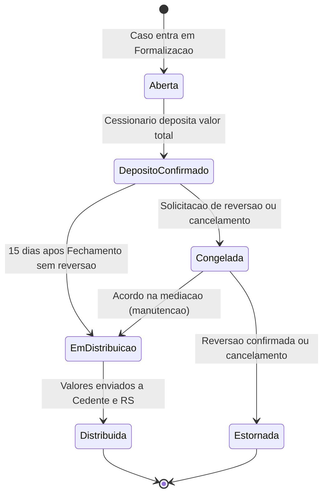
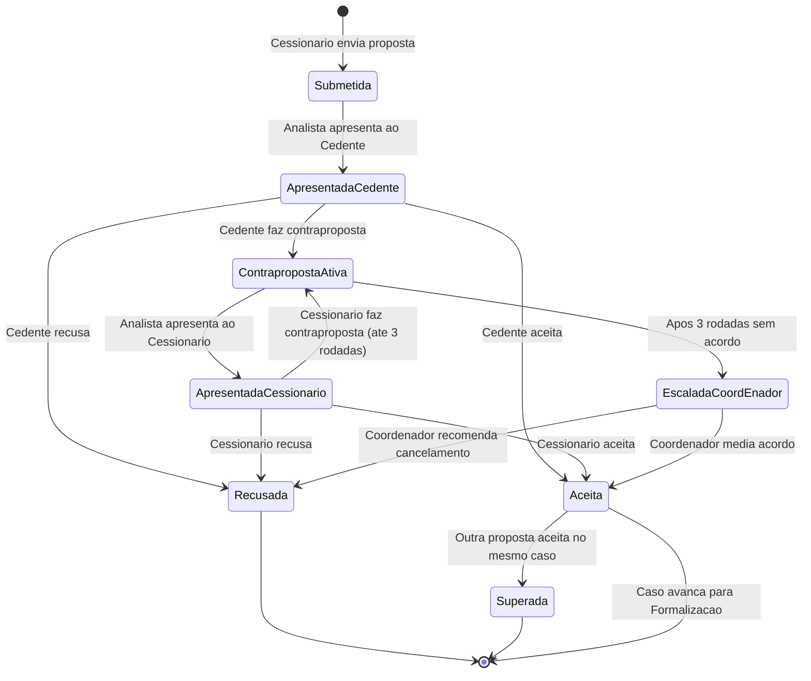
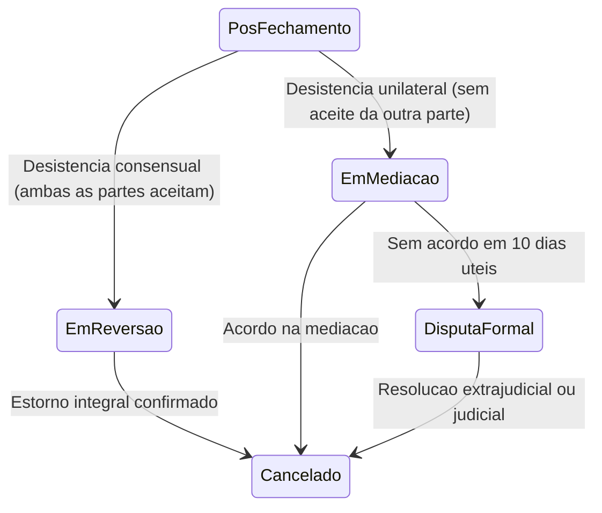

# 💰 Regras de Negócio — Módulos Core e Receita

## Módulo Admin — Repasse Seguro

| **Campo** | **Valor** |
|---|---|
| **Destinatário** | Equipe de Produto e Engenharia |
| **Escopo** | Comissões · Conta Escrow · Fechamento · Negociação · Formalização · Reversão · Cancelamento · Prazo de depósito |
| **Módulo** | Admin |
| **Parte** | Parte 2 de 5 — Módulos Core e Receita |
| **Versão** | v1.2 |
| **Responsável** | Claude Code Desktop |
| **Data da versão** | 2026-03-22 (America/Fortaleza) |
| **Continuidade** | RN-017 (Parte 01.1) |
| **Origem do arquivo de entrada** | 01 - Regras de Negócio.md |

---

> 📌 **TL;DR**
>
> Este arquivo cobre os módulos que geram receita diretamente ou são indispensáveis para o fluxo principal do produto: cálculo de comissões (Cedente e Cessionário), fluxo da Conta Escrow, 4 critérios obrigatórios para o Fechamento, escalonamento de cenário, fluxo completo de negociação (propostas, rodadas, escalação), formalização (ZapSign, anuência, depósito), reversão dentro dos 15 dias e cancelamento definitivo. A numeração de RNs neste arquivo vai de **RN-018 a RN-054** (v1.0) e **RN-141 a RN-147** (correções v1.1).

---

## 🎯 Contexto dos Módulos Core

Os módulos desta parte são o coração financeiro e operacional do Repasse Seguro. Remover qualquer um deles interrompe o faturamento ou torna o fluxo principal inviável.

**Critério de classificação:** Remover qualquer módulo desta parte quebra o faturamento ou o fluxo principal do produto.

**Módulos cobertos nesta parte:**
- **Comissões e Conta Escrow** — como a receita é calculada, recebida e distribuída
- **Fechamento e Validações** — o evento que gera a receita
- **Negociação** — como as propostas são intermediadas
- **Formalização** — os 4 critérios que habilitam o Fechamento
- **Reversão e Cancelamento** — o que acontece quando o negócio não se concretiza

---

## 1. Módulo: Comissões e Conta Escrow

### 1.1 Visão Geral do Módulo

🎯 **Objetivo:** Garantir que o Repasse Seguro receba suas comissões de forma segura e automática, sem depender de cobrança direta às partes. A Conta Escrow elimina o risco de inadimplência e protege todas as partes contra fraude.

**Atores envolvidos:** Cessionário (deposita), Analista (confirma fechamento), Gestor Financeiro (monitora e distribui), Sistema (calcula e distribui automaticamente)

**Objeto principal:** Conta Escrow do Caso

**Estados possíveis:**

**Operações principais:** Criar, Depositar, Reter, Distribuir, Congelar, Estornar

### 1.2 Regras de Negócio

---

**RN-018: Cálculo da comissão do Cedente por cenário**

> Origem: Regra 04 (arquivo de entrada)

1. O caso atinge o status "Fechamento" com todos os critérios cumpridos.
2. O sistema verifica o cenário de retorno registrado no caso e os valores confirmados no dossiê (Valor Recuperado e Valor Distrato Referência).
3. **Se o cenário é A:** a comissão do Cedente é R$ 0,00. O sistema registra automaticamente comissão zerada para o Cedente.
4. **Se o cenário é B, C ou D:** o sistema calcula automaticamente a comissão: 20% sobre (Valor Recuperado − Valor Distrato Referência). O Analista confere o cálculo e confirma antes da distribuição.
5. **Efeito no estado do objeto:** A fatura de comissão é criada com status "Pendente" → muda para "Distribuída" após a liberação da Conta Escrow.
6. **Consequência se violada:** Comissão calculada sobre cenário errado gera distribuição indevida pela Conta Escrow, causando prejuízo ao RS ou conflito com o Cedente.

**Fórmulas por cenário:**

| **Cenário** | **Valor Distrato Referência** | **Base de Cálculo** | **Comissão RS** |
|---|---|---|---|
| **A** | 50% do valor pago | — | R$ 0,00 |
| **B** | 50% do valor pago | Valor Recuperado − Distrato Ref. | 20% da base |
| **C** | 50% do valor pago | Valor Recuperado − Distrato Ref. | 20% da base |
| **D** | 50% do valor pago | Valor Recuperado − Distrato Ref. | 20% da base |

💡 **Exemplo Cenário B:** Cedente pagou R$ 300.000. Distrato Ref. = R$ 150.000. Valor Recuperado = R$ 300.000. Base = R$ 150.000. Comissão = R$ 30.000. Cedente recebe R$ 270.000.

💡 **Exemplo Cenário D:** Cedente pagou R$ 500.000. Distrato Ref. = R$ 250.000. Valor Recuperado = R$ 750.000. Base = R$ 500.000. Comissão = R$ 100.000. Cedente recebe R$ 650.000.

**Edge cases:**
- O percentual de 50% do Distrato Referência é configurável pelo Master em "Configurações > Comissões". Alterações afetam apenas novos casos.
- O percentual de comissão de 20% também é configurável (intervalo: 5% a 50%). Alterações afetam apenas novos casos.
- Calcular comissão sobre o cenário errado (ex: caso escalado de D para C, mas comissão calculada em D) é o erro mais comum. O Analista deve sempre verificar o cenário vigente no momento do fechamento.

---

**RN-019: Cálculo da comissão do Cessionário sobre o Delta**

> Origem: Regra 05 (arquivo de entrada)

1. O caso atinge o status "Fechamento".
2. O sistema verifica os valores da Tabela Atual e da Tabela do Contrato confirmados no dossiê.
3. O sistema calcula: Δ = Tabela Atual − Tabela do Contrato.
4. **Se Δ é positivo:** comissão do Cessionário = 20% de Δ. O Cessionário já depositou esse valor na Conta Escrow.
5. **Se Δ é zero ou negativo:** a comissão variável é R$ 0. O sistema verifica se a exceção do Cenário A está ativa nas Configurações.
6. **Exceção Cenário A com Δ = 0:** se ativada nas Configurações, a comissão passa a ser 20% do Valor Pago pelo Cedente (pois o Cessionário se beneficia da estrutura da plataforma mesmo sem desconto de tabela).
7. **Efeito no estado do objeto:** Comissão calculada e registrada na fatura.
8. **Consequência se violada:** Sem confirmar a fonte da Tabela Atual, o cálculo do Delta pode estar errado, gerando comissão incorreta.

**Hierarquia de fontes para a Tabela Atual** (em ordem de preferência):
1. Tabela oficial da construtora (maior credibilidade)
2. Oferta pública comprovável (segunda opção)
3. Avaliação formal com laudo (terceira opção)

⚙️ Se nenhuma fonte estiver disponível e documentada no dossiê, o caso não pode ser fechado.

💡 **Exemplo com valorização:** Tabela Atual R$ 700.000. Tabela do Contrato R$ 500.000. Δ = R$ 200.000. Comissão = R$ 40.000.

💡 **Exemplo Cenário A + Δ = 0:** Ambas as tabelas = R$ 500.000. Cedente pagou R$ 200.000. Comissão (exceção) = R$ 40.000.

**RN-019.a: Aprovação com 4 olhos da Tabela Atual em casos de alto valor**

> Origem: Decisão autônoma — gap identificado em auditoria cross-doc (2026-03-22)

1. Após o Analista registrar a fonte e o valor da Tabela Atual no dossiê, o sistema verifica o valor do Delta (Tabela Atual − Tabela do Contrato).
2. **Se o Delta for igual ou superior a R$ 100.000:** o sistema exige aprovação do Coordenador antes de habilitar o critério de Fechamento correspondente.
3. O Coordenador recebe notificação: "O Delta calculado para o caso [ID] é de R$ [X]. Revise a fonte da Tabela Atual e confirme ou conteste o valor."
4. **Se o Coordenador confirma:** o critério é marcado como atendido. O carimbo registra ambos — Analista (registrou) e Coordenador (aprovou).
5. **Se o Coordenador contesta:** o Analista recebe notificação com o motivo e deve revisar a fonte ou apresentar evidência adicional. O caso permanece em Formalização.
6. O limiar de R$ 100.000 é configurável pelo Master em Configurações → Comissões → "Limiar de revisão do Delta".

**Consequência se violada:** Em casos de alto valor, a escolha unilateral da fonte da Tabela Atual pelo Analista pode gerar comissão incorreta de dezenas de milhares de reais, com risco de disputa financeira e dano à reputação da plataforma.

---

**RN-020: Fluxo completo da Conta Escrow**

> Origem: Regra 06 (arquivo de entrada)

🎯 **Objeto principal:** Conta Escrow individual vinculada ao caso.

1. O caso muda para o status "Em Formalização".
2. **Etapa 1 — Criação:** o sistema cria automaticamente uma Conta Escrow com identificação única vinculada ao caso. A Conta Escrow tem status "Aberta".
3. **Etapa 2 — Depósito:** o sistema envia instruções de depósito ao Cessionário automaticamente. O Cessionário deposita o valor total (preço do repasse + comissão do Cessionário) na Conta Escrow. O sistema confirma o depósito e muda o status para "Depósito Confirmado".
4. **Etapa 3 — Retenção pré-Fechamento:** o valor fica retido na Conta Escrow. O botão "Confirmar Fechamento" só fica ativo com o depósito confirmado como um dos 4 critérios (conforme RN-022).
5. **Etapa 4 — Retenção pós-Fechamento:** após o Fechamento, os valores permanecem retidos por 15 dias corridos. Se nenhuma parte solicitar reversão, a distribuição é liberada.
6. **Etapa 5 — Distribuição automática:** após 15 dias sem reversão, a Conta Escrow distribui automaticamente: (a) ao Cedente: Valor Recuperado − Comissão do Cedente; (b) ao Repasse Seguro: Comissão do Cedente + Comissão do Cessionário; (c) crédito residual (se houver): devolvido ao Cessionário com comprovante detalhado.
7. **Consequência se violada:** Sem a Conta Escrow, o RS depende de cobrança direta das partes, expondo-se ao risco de calote e fraude.

**RN-020.a: Conta Escrow individual por caso**

> Origem: FIN-01 (arquivo de entrada)

1. Cada caso possui sua própria Conta Escrow, criada automaticamente ao entrar em Formalização.
2. Não existe compartilhamento de conta entre casos diferentes.
3. **Consequência se violada:** Valores de casos distintos se misturam, tornando a distribuição e o estorno inviáveis sem investigação manual.

**RN-020.b: Tolerância de valor no depósito**

> Origem: FIN-08 (arquivo de entrada)

1. O parceiro financeiro confirma o valor creditado na Conta Escrow.
2. O sistema compara o valor confirmado com o valor esperado.
3. **Se a diferença é de até R$ 0,50 (positiva ou negativa):** o sistema aceita o depósito como "Confirmado". Se houver excedente, o valor é registrado como "Crédito residual" e devolvido ao Cessionário na distribuição.
4. **Se o valor depositado é abaixo da margem de tolerância (depósito parcial):** o sistema não confirma o depósito. O status permanece "Aguardando depósito" e o Cessionário é notificado para complementar.
5. **Restrição de moeda:** a plataforma opera exclusivamente em BRL (R$). Depósitos em moeda estrangeira ou de contas internacionais não são aceitos.

**Mensagens ao usuário:**
- Depósito parcial detectado: "O valor recebido na Conta Escrow está abaixo do esperado. Deposite o valor restante de R$ [diferença] para confirmar o pagamento."
- Depósito confirmado: "Seu depósito de R$ [valor] foi recebido e confirmado na Conta Escrow."

**RN-020.c: Modalidade de depósito fracionado para Cessionários qualificados**

> Origem: Decisão autônoma — gap identificado em auditoria cross-doc (2026-03-22)

1. O Master pode habilitar a modalidade "Cessionário Qualificado" para perfis de Cessionário que atendam critérios configuráveis (ex: histórico de N fechamentos concluídos na plataforma, sem reversões).
2. **Cessionários Qualificados** podem depositar em 2 etapas:
   - **50% ao entrar em Formalização:** valor depositado imediatamente na Conta Escrow como sinal de comprometimento. Habilita o início das assinaturas e da obtenção de anuência.
   - **50% restantes até 3 dias úteis antes do prazo final de Fechamento:** o sistema notifica o Cessionário com antecedência de 5 dias úteis.
3. **O Fechamento só é habilitado com 100% depositado confirmado.** O depósito fracionado não altera os 4 critérios obrigatórios.
4. **Se o Cessionário não completar o depósito no prazo:** o sistema notifica o Analista e inicia o fluxo de inadimplência (conforme RN-090). O sinal de 50% permanece retido na Conta Escrow até resolução.
5. A modalidade fracionada é registrada no Termo Comercial do caso e comunicada ao Cedente na abertura da Formalização.
6. **Cessionários padrão (não qualificados) seguem o fluxo integral** conforme RN-020.

**Consequência se não implementado:** Investidores com múltiplos casos simultâneos ou valores elevados evitam a plataforma por indisponibilidade de capital, reduzindo o pool de Cessionários qualificados.

**Estados visuais da Conta Escrow no painel de Formalização:** [CORRIGIDO: PROBLEMA-018]
- Aberta: ícone de cofre aberto + label "Aguardando depósito" (cinza).
- Depósito Confirmado: ícone de cofre fechado + label "Depósito confirmado" (verde) + valor confirmado.
- Em Distribuição: ícone de setas divergentes + label "Distribuição em andamento" (azul).
- Distribuída: ícone de check + label "Valores distribuídos" (verde escuro).
- Congelada: ícone de cadeado + label "Conta congelada" (vermelho) + motivo do congelamento.
- Estornada: ícone de seta reversa + label "Valor estornado" (laranja) + comprovante disponível.

**Feedback de confirmação de depósito:** [CORRIGIDO: PROBLEMA-019]
- Ao confirmar o depósito automaticamente via webhook, o painel do Analista exibe notificação em tempo real com animação de transição do status.
- O Cessionário recebe e-mail com comprovante digital e resumo: valor depositado, data, identificador da conta.

---

**RN-021: Distribuição automática com notificação prévia**

> Origem: Regra 06 — Etapa 5, FIN-02 (arquivo de entrada)

1. O sistema verifica diariamente se alguma Conta Escrow atingiu 14 dias pós-Fechamento sem reversão.
2. **24 horas antes da distribuição automática:** o Gestor Financeiro recebe notificação com resumo dos valores a serem distribuídos.
3. **Se o Gestor Financeiro não bloqueia a distribuição:** no 15º dia, a Conta Escrow distribui automaticamente.
4. **Se o Gestor Financeiro identifica irregularidade e clica em "Bloquear Distribuição":** o sistema exige justificativa escrita (mínimo 20 caracteres) e encaminha para aprovação do Master. O bloqueio é aprovado ou negado em até 24 horas.
5. **Se o Master não aprova o bloqueio em 24 horas:** a distribuição prossegue automaticamente.
6. **Consequência se violada:** Distribuição sem revisão pode enviar valores incorretos a destinatários errados, gerando disputa financeira irreversível.

**Mensagens ao usuário:**
- Notificação prévia (ao Gestor Financeiro): "A Conta Escrow do caso [ID] será distribuída em 24 horas. Revise os valores e bloqueie se necessário."
- Bloqueio aprovado (ao Gestor Financeiro): "O bloqueio de distribuição foi aprovado pelo Master. A distribuição permanece suspensa."
- Prazo de aprovação expirado (ao Gestor Financeiro): "O prazo de aprovação expirou. A distribuição será retomada automaticamente."

---

**RN-022: Taxas bancárias e responsabilidades**

> Origem: FIN-09 (arquivo de entrada)

1. O Cessionário recebe as instruções de depósito na Conta Escrow.
2. As instruções informam claramente: o valor esperado = preço do repasse + comissão do Cessionário.
3. **As taxas de transferência (TED, PIX, DOC) para depósito são de responsabilidade do Cessionário.** O Cessionário deve somar a taxa do meio de pagamento ao valor a ser depositado.
4. **As taxas de distribuição (Conta Escrow → Cedente e Conta Escrow → RS) são absorvidas pelo parceiro financeiro** como parte do custo operacional da Conta Escrow. Se o parceiro repassar taxas sobre a distribuição, o valor é descontado da comissão do RS, nunca do valor do Cedente.
5. **Consequência se violada:** O Cedente pode receber menos do que contratado, gerando conflito e possível disputa jurídica.

---

**RN-141: Estorno sempre integral — sem estorno parcial**

> Origem: FIN-04 (arquivo de entrada)

1. Um estorno é solicitado para um caso (por reversão dentro dos 15 dias ou por cancelamento com depósito ativo).
2. O sistema verifica o valor integral depositado pelo Cessionário na Conta Escrow.
3. **O sistema sempre estorna o valor integral:** o total depositado pelo Cessionário é devolvido integralmente, sem deduções.
4. **Não existe estorno parcial na plataforma.** Se qualquer operador tentar registrar um estorno de valor inferior ao total, o sistema bloqueia a operação.
5. **Efeito no estado do objeto:** Conta Escrow muda de "Congelada" para "Estornada" após a confirmação do estorno integral.
6. **Consequência se violada:** Estorno parcial deixa o Cessionário sem parte do valor depositado sem contrapartida contratual, gerando disputa jurídica e responsabilidade para o RS.

**Mensagens ao usuário:**
- Tentativa de estorno parcial bloqueada: "O estorno deve ser do valor integral depositado. Não é possível processar estornos parciais nesta plataforma."

---

**RN-142: Comissão do RS no Cenário A — distribuição obrigatória mesmo com comissão do Cedente zerada**

> Origem: FIN-06 (arquivo de entrada)

1. O caso atinge o Fechamento com cenário de retorno A (comissão do Cedente = R$ 0,00).
2. O Gestor Financeiro acessa o painel de distribuição da Conta Escrow para o caso.
3. **O sistema calcula a distribuição corretamente:** ao Cedente, o Valor Recuperado (sem desconto de comissão); ao Repasse Seguro, apenas a comissão do Cessionário (20% sobre o valor que o Cessionário pagou acima do saldo devedor).
4. **O Gestor deve conferir que a comissão do Cedente está zerada e a comissão do Cessionário está corretamente calculada** antes de confirmar a distribuição.
5. **Efeito no estado do objeto:** a Conta Escrow executa a distribuição e muda de "Em Distribuição" para "Distribuída".
6. **Consequência se violada:** Deixar de distribuir a comissão do Cessionário para o RS no Cenário A significa perda de receita legítima da operação.

---

## 2. Módulo: Fechamento e Validações

### 2.1 Visão Geral do Módulo

🎯 **Objetivo:** Garantir que nenhum caso seja fechado sem toda a documentação, formalização e garantia financeira. O Fechamento é o evento que gera a receita do RS.

**Atores envolvidos:** Analista (confirma), Coordenador (supervisiona), ZapSign (assinaturas), Construtora (anuência), Cessionário (depósito)

**Objeto principal:** Caso (transição para Fechamento)

**Estados do processo:** Em Formalização → Fechamento → Pós Fechamento

---

**RN-023: Quatro critérios obrigatórios e simultâneos para o Fechamento**

> Origem: Regra 07 (arquivo de entrada)

⚙️ **Os 4 critérios devem ser verdadeiros ao mesmo tempo. Não existe ordem obrigatória entre eles. Não existe fechamento parcial ou condicional.**

1. O Analista acessa a tela de Formalização e visualiza o painel de critérios do caso.
2. O sistema verifica o status de cada um dos 4 critérios:
   - 2.1. **Instrumento assinado:** todas as partes (Cedente, Cessionário e representante do RS) assinaram o Instrumento de Cessão e o Termo Comercial via ZapSign.
   - 2.2. **Preço confirmado por evidência:** o dossiê contém documento da Tabela Atual (com data da proposta e fonte identificada) e da Tabela do Contrato.
   - 2.3. **Anuência da construtora:** a construtora autorizou formalmente a cessão (quando exigida pelo contrato original).
   - 2.4. **Depósito na Conta Escrow confirmado:** o Cessionário depositou o valor total e o sistema confirmou o crédito (conforme RN-020 e RN-020.b).
3. **Se todos os 4 critérios estão cumpridos:** o botão "Confirmar Fechamento" fica ativo. O Analista clica para confirmar.
4. **Se qualquer critério está pendente:** o botão "Confirmar Fechamento" permanece inativo. O sistema exibe quais critérios ainda estão pendentes.
5. **Efeito no estado do objeto:** Em Formalização → Fechamento → Pós Fechamento. O sistema inicia a contagem de 15 dias de retenção na Conta Escrow.
6. **Consequência se violada:** Fechar sem evidências gera disputa posterior impossível de resolver. Fechar sem depósito expõe o RS ao risco de calote.

**Registros obrigatórios no Fechamento:**
- Data e hora do clique de confirmação
- Nome do Analista que confirmou
- Screenshot do estado dos 4 critérios no momento da confirmação
- Cópias dos documentos assinados via ZapSign
- Comprovante de depósito na Conta Escrow

**Mensagens ao usuário:**
- Fechamento indisponível: "Pendência: [critério faltante]. O fechamento só é liberado quando todos os 4 critérios estiverem cumpridos."
- Fechamento confirmado (ao Analista): "Fechamento confirmado com sucesso. Período de retenção de 15 dias iniciado."
- Fechamento confirmado (ao Cedente e Cessionário): "O fechamento do caso [ID] foi confirmado. O período de 15 dias para reversão começou hoje."

**Painel visual dos 4 critérios de Fechamento:** [CORRIGIDO: PROBLEMA-020]
- Layout: 4 cards dispostos em grid 2x2. Cada card exibe: nome do critério, status (Pendente ⏳ / Cumprido ✅), data de cumprimento e link para evidência.
- O botão "Confirmar Fechamento" fica abaixo dos 4 cards, centralizado, com destaque visual (cor primária, tamanho grande).
- Quando todos os 4 critérios estão cumpridos: os 4 cards ficam verdes e o botão "Confirmar Fechamento" ativa com animação sutil de pulsação por 3 segundos para chamar atenção.
- Quando qualquer critério está pendente: botão desabilitado com tooltip listando os critérios faltantes.

**Confirmação de Fechamento — ação destrutiva:** [CORRIGIDO: PROBLEMA-021]
- Ao clicar "Confirmar Fechamento", o sistema exibe modal de confirmação com resumo: valor da transação, partes envolvidas, cenário e comissões calculadas. Botão "Confirmar Fechamento" no modal exige digitação da palavra "CONFIRMAR" para evitar cliques acidentais.
- [DECISÃO APLICADA: DEC-007] O Fechamento exige digitação de confirmação textual ("CONFIRMAR") em vez de apenas dois cliques. Justificativa: como o Fechamento é irreversível (RN-024) e gera obrigações financeiras, a barreira de confirmação textual reduz erros acidentais.

---

---

**RN-022.a: Fluxo de obtenção e registro da anuência da construtora**

> Origem: Decisão autônoma — gap identificado em auditoria cross-doc (2026-03-22)

🎯 **Objetivo:** Garantir que a anuência da construtora seja obtida, documentada e rastreável antes de habilitar o critério de Fechamento correspondente.

**Atores:** Analista (solicita e registra), Coordenador (aprova exceção), Construtora (fornece), Sistema (monitora SLA)

**Fluxo principal:**
1. Ao entrar em Formalização, o Analista acessa o painel e verifica se o contrato exige anuência da construtora.
2. **Se o contrato exige anuência:** o Analista clica em "Registrar Solicitação de Anuência" e informa: data do envio, canal utilizado (e-mail, portal da construtora, presencial) e contato responsável na construtora.
3. O sistema registra a solicitação com timestamp e inicia contagem de SLA.
4. **SLA de resposta da construtora:** 15 dias corridos a partir do registro da solicitação.
   - No 10º dia sem retorno: o sistema envia alerta automático ao Analista e ao Coordenador.
   - No 15º dia sem retorno: o sistema escala para o Coordenador com sugestão de ação (reenvio formal, contato da diretoria, exceção).
5. **Ao receber a anuência:** o Analista anexa o documento (e-mail, ofício ou comprovante do portal) ao dossiê e clica em "Confirmar Anuência". O sistema aplica carimbo imutável com nome do Analista, data e hora.
6. O critério "Anuência da construtora" é marcado como atendido no checklist de Fechamento.

**Exceção — contrato sem exigência de anuência:**
1. O Analista marca "Contrato não exige anuência" com justificativa obrigatória (ex: "Cláusula X do contrato dispensa anuência para cessões entre pessoas físicas").
2. O Coordenador deve confirmar a exceção em até 2 dias úteis.
3. Após confirmação do Coordenador, o critério é marcado automaticamente como atendido.

**Validação de valor para aprovação com 4 olhos:**
- Casos com Valor Recuperado acima de R$ 500.000: a confirmação da anuência exige validação adicional do Coordenador, independente de quem for o Analista responsável.

**Estados do critério:**
- `Não solicitada` → `Solicitada` → `Recebida e verificada` (atendido) | `Em atraso` (alerta) | `Dispensada` (exceção aprovada)

**Consequência se violada:** Fechar um caso sem anuência quando o contrato exige gera nulidade jurídica da cessão, com risco de reversão por parte da construtora após o dinheiro já ter sido distribuído.

---

**RN-024: Fechamento irreversível**

> Origem: FORM-05 (arquivo de entrada)

1. O Fechamento é confirmado pelo Analista.
2. **Uma vez confirmado, o Fechamento não pode ser desfeito pelo Admin.** Não existe "desfazer fechamento" como ação direta.
3. **A única forma de reverter o negócio após o Fechamento** é pelo fluxo formal de reversão dentro dos 15 dias corridos (conforme RN-040).
4. **Consequência se violada:** Permitir desfazer o Fechamento sem o fluxo de reversão formal exporia o RS a fraudes e a distribuições incorretas.

---

**RN-025: Escalonamento de cenário**

> Origem: Regra 08 (arquivo de entrada)

🎯 **Objetivo:** Permitir que o Cedente reduza a expectativa de retorno de forma controlada e documentada, aumentando a probabilidade de atrair um Cessionário.

**Sequência de escalonamento possível:** D → C → B → A (sempre descendente, nunca ascendente)

1. O caso permanece em "Oferta Ativa" por mais de 30 dias corridos sem receber nenhuma proposta.
2. O sistema gera alerta de "Estagnação" para o Coordenador visível no Pipeline.
3. **Se o Coordenador avalia e aciona a sugestão:** o sistema envia ao Cedente uma simulação comparativa com os valores do cenário atual e do cenário inferior.
4. O Cedente responde pelo painel: aceita ou recusa.
5. **Se o Cedente aceita:** o aceite é formalizado via ZapSign (Termo de Aceite de Escalonamento). Após a assinatura, o caso volta para "Oferta Ativa" com o novo cenário. O timer de SLA de 30 dias reinicia a partir da data do escalonamento aceito.
6. **Se o Cedente recusa:** o caso permanece no cenário atual em "Oferta Ativa".
7. **Exceção:** o Cedente pode solicitar escalonamento voluntário a qualquer momento, sem precisar aguardar os 30 dias. O fluxo a partir do passo 3 é o mesmo.
8. **Restrição:** o escalonamento é sempre descendente. Para subir de cenário (ex: de B para C), o Cedente deve cancelar o caso atual e cadastrar novamente com o novo cenário desejado.
9. **Consequência se violada:** Casos estagnados acumulam SLA estourado sem perspectiva de fechamento, comprometendo o pipeline de receita.

**RN-025.a: Conflito entre escalonamento e negociação ativa**

> Origem: NEG-09 (arquivo de entrada)

1. O Cedente solicita escalonamento de cenário enquanto há proposta ativa em negociação.
2. O sistema coloca o escalonamento em fila e notifica o Cedente.
3. **Se a negociação resulta em aceite:** o escalonamento é cancelado automaticamente (o caso avançou para Formalização).
4. **Se a negociação resulta em recusa ou expiração:** o escalonamento é processado automaticamente.
5. **Consequência:** o escalonamento nunca interrompe uma negociação em curso, preservando a integridade do processo.

**Mensagens ao usuário:**
- Escalonamento em fila (ao Cedente): "Seu pedido de escalonamento será processado após a conclusão da negociação em andamento."
- Simulação comparativa (ao Cedente): "No cenário atual ([cenário]) você receberia R$ [valor A]. No cenário [abaixo] você receberia R$ [valor B]. A diferença é R$ [delta]."

**Interface da simulação de escalonamento:** [CORRIGIDO: PROBLEMA-022]
- A simulação comparativa é apresentada como tabela lado a lado: cenário atual vs. cenário proposto. Valores em destaque com cores: verde para valores maiores, vermelho para menores.
- Botões "Aceitar Escalonamento" e "Recusar" são exibidos abaixo da tabela. O botão "Aceitar" dispara o envio do Termo de Aceite via ZapSign.
- Se o Cedente recusa, o sistema exibe toast: "Escalonamento recusado. O caso permanece no cenário [atual]."
- Se o Cedente já está no Cenário A (último cenário possível), o botão de escalonamento não é exibido. O sistema mostra: "Este caso já está no cenário mais acessível. Não há escalonamento disponível."

---

## 3. Módulo: Negociação

### 3.1 Visão Geral do Módulo

🎯 **Objetivo:** Centralizar a gestão de propostas e mediação entre Cedente e Cessionário, garantindo que o Admin intermedie todas as interações financeiras de forma estruturada, dentro dos limites de rodadas e SLA.

**Atores envolvidos:** Cessionário (submete proposta), Analista (medeia), Coordenador (medeia após escalação), Cedente (responde)

**Objeto principal:** Proposta

**Estados possíveis da Proposta:**

**Operações principais:** Submeter, Apresentar, Aceitar, Recusar, Contraproposta, Escalar, Registrar Aceite

### 3.2 Regras de Negócio

---

**RN-026: Fluxo de propostas e contrapropostas com limite de rodadas**

> Origem: Regra 16 e Suposição S8 (arquivo de entrada)

1. O Cessionário submete uma proposta para um caso em "Oferta Ativa".
2. O sistema valida se a proposta atende ao valor mínimo do cenário (conforme RN-028). Se não atender, a proposta é rejeitada automaticamente antes de chegar ao Analista.
3. **Se a proposta é válida:** o caso muda para "Em Negociação". O sistema notifica o Analista responsável.
4. O Analista apresenta a proposta ao Cedente (sem revelar a identidade ou dados pessoais do Cessionário).
5. O Cedente responde: (a) aceitar, (b) recusar, ou (c) fazer contraproposta com valor diferente.
6. **Se o Cedente aceita:** o Analista registra o Aceite de Negociação. O caso avança para "Em Formalização". Todas as demais propostas ativas do mesmo caso são encerradas com status "Proposta superada".
7. **Se o Cedente recusa:** a proposta é encerrada. O caso retorna para "Oferta Ativa" se não houver outras propostas na fila.
8. **Se o Cedente faz contraproposta:** o Analista apresenta ao Cessionário. Cada rodada de contraproposta conta como 1 rodada. Limite: 3 rodadas.
9. **Após 3 rodadas sem acordo:** o sistema escala obrigatoriamente para o Coordenador. O Analista não pode iniciar uma 4ª rodada.
10. **Efeito no estado do objeto:** Oferta Ativa → Em Negociação (proposta recebida) | Em Negociação → Em Formalização (aceite registrado).
11. **Consequência se violada:** Sem limite de rodadas, negociações se arrastam indefinidamente, estourando o SLA e comprometendo o pipeline.

**Mensagens ao usuário:**
- Aceite registrado (ao Analista): "Aceite registrado com sucesso. O caso avançou para Formalização."
- Escalação automática (ao Coordenador): "A negociação do caso [ID] atingiu o limite de 3 rodadas. O caso foi escalado para mediação ativa."

**Painel de Negociação — layout e estados:** [CORRIGIDO: PROBLEMA-023]
- Layout dividido em 3 colunas: (1) lista de propostas à esquerda, (2) detalhe da proposta selecionada ao centro, (3) histórico de rodadas à direita.
- Cada proposta na lista exibe: valor, data, rodada atual (ex: "Rodada 2 de 3") e status (Ativa, Aceita, Recusada, Expirada, Superada).
- Indicador de rodadas: barra de progresso com 3 segmentos. Segmentos preenchidos = rodadas concluídas. Ao atingir 3/3, a barra fica vermelha com label "Escalação obrigatória".
- Timer de resposta: contador regressivo visível na proposta ativa: "X dias restantes para resposta."
- Propostas superadas exibem badge "Superada" em cinza com linha tachada sobre o valor.

**Fluxo de contraproposta:** [CORRIGIDO: PROBLEMA-024]
- Ao clicar "Contraproposta", o sistema abre campo de valor pré-preenchido com o valor anterior. O Analista ajusta e confirma.
- Se o valor da contraproposta é igual ao anterior, o sistema exibe aviso: "O valor informado é igual ao anterior. Confirma?"
- [DECISÃO APLICADA: DEC-008] O campo de contraproposta é pré-preenchido com o último valor para agilizar a edição. Justificativa: a maioria das contrapropostas são ajustes pequenos do valor anterior, e o pré-preenchimento reduz erro de digitação.

---

**RN-027: Prazo de resposta por rodada de negociação**

> Origem: NEG-02 (arquivo de entrada)

1. Uma proposta ou contraproposta é apresentada a uma das partes.
2. O sistema inicia o contador de 3 dias úteis para resposta.
3. **No 3º dia útil sem resposta:** o sistema envia lembrete automático à parte que não respondeu.
4. **No 5º dia útil sem resposta:** a rodada é encerrada como "Sem resposta" e o sistema executa a ação automática conforme a parte que não respondeu:
   - **Se foi o Cedente:** a proposta é devolvida ao Cessionário com status "Sem resposta do Cedente". Se não há outras propostas na fila, o caso retorna para "Oferta Ativa".
   - **Se foi o Cessionário:** a proposta é encerrada. Se não há outras propostas na fila, o caso retorna para "Oferta Ativa".
5. Em ambos os cenários, o evento é registrado no dossiê e o Analista responsável é notificado.
6. **Consequência se violada:** Sem prazo de resposta, uma das partes pode paralisar indefinidamente a negociação sem consequência.

**Mensagens ao usuário:**
- Lembrete de resposta (3 dias) ao Cedente: "Você tem uma proposta de R$ [valor] aguardando sua resposta. Prazo: [data]."
- Proposta expirada sem resposta (ao Cessionário): "Sua proposta de R$ [valor] para o caso [ID] não obteve resposta do Cedente no prazo de 5 dias úteis. A proposta foi encerrada. Você pode submeter uma nova proposta a qualquer momento."
- Proposta expirada (ao Cedente): "Você não respondeu à proposta recebida no prazo de 5 dias úteis. A proposta foi encerrada automaticamente."

---

**RN-028: Proposta mínima por cenário**

> Origem: NEG-03 (arquivo de entrada)

1. O Cessionário submete uma proposta para um caso.
2. O sistema calcula o valor mínimo permitido conforme o cenário do caso.
3. **Se a proposta é igual ou superior ao valor mínimo:** a proposta é aceita pelo sistema e enviada para o fluxo normal.
4. **Se a proposta está abaixo do valor mínimo:** o sistema rejeita automaticamente e notifica o Cessionário. O caso permanece em "Oferta Ativa".
5. **Não existe teto de proposta.** O Cessionário pode oferecer qualquer valor acima do mínimo. Se a proposta exceder 30% acima da Tabela Atual, o sistema exibe alerta informativo ao Analista (alerta não bloqueia a proposta).
6. **Consequência se violada:** Propostas abaixo do mínimo gerariam distribuição insuficiente para cobrir a comissão do RS.

**Mensagens ao usuário:**
- Proposta abaixo do mínimo: "A proposta mínima para este caso é R$ [valor]. Ajuste sua proposta para continuar."
- Proposta atípica (ao Analista): "Proposta atípica: valor [X]% acima da Tabela Atual. Verifique antes de apresentar ao Cedente."

---

**RN-029: Histórico imutável de propostas**

> Origem: NEG-04 (arquivo de entrada)

1. Uma proposta ou resposta é registrada no sistema.
2. O sistema salva o registro com: valor, data, parte proponente, número da rodada e status.
3. **O registro não pode ser editado ou excluído por nenhum perfil** após ser criado.
4. **Consequência se violada:** Sem imutabilidade, disputas sobre o que foi oferecido e acordado não podem ser resolvidas.

---

**RN-030: Propostas simultâneas de múltiplos Cessionários**

> Origem: NEG-06 (arquivo de entrada)

1. Múltiplos Cessionários fazem propostas para o mesmo caso em "Oferta Ativa".
2. O sistema permite negociações paralelas e independentes. Cada proposta tem sua própria timeline de rodadas.
3. O Analista apresenta ao Cedente a melhor proposta primeiro (maior valor). Se recusada, apresenta a próxima.
4. **Ao Registrar Aceite de uma proposta:** todas as demais propostas ativas do mesmo caso são encerradas automaticamente com status "Proposta superada". Os respectivos Cessionários são notificados.
5. **Não existe reserva de exclusividade durante a negociação:** o Cedente pode aceitar a melhor proposta a qualquer momento.
6. **Consequência se violada:** Múltiplos Cessionários podem acreditar que "ganharam" o caso, gerando conflito e obrigação de estornos.

**Mensagens ao usuário:**
- Proposta superada (ao Cessionário): "Sua proposta para o caso [ID] foi superada por outra proposta aceita pelo Cedente. O caso foi concluído."

---

**RN-031: Anti-fraude e rate limiting de propostas**

> Origem: NEG-08 (arquivo de entrada)

1. Um Cessionário submete propostas na plataforma.
2. O sistema monitora o volume de submissões:
   - **Limite de 3 propostas simultâneas** em casos diferentes por Cessionário. Se atingir, o sistema bloqueia novas propostas até que uma das anteriores seja encerrada.
   - **Mais de 10 propostas em 24 horas:** o sistema bloqueia temporariamente novas submissões por 6 horas e gera alerta ao Coordenador.
3. **Propostas com padrão atípico** (valores idênticos em múltiplos casos, submissão automatizada detectada): o sistema sinaliza para revisão manual pelo Analista antes de apresentar ao Cedente.
4. **Consequência se violada:** Submissões em massa podem saturar o sistema de negociação e indicar atividade fraudulenta.

---

**RN-144: Anonimato absoluto entre Cedente e Cessionário na Negociação**

> Origem: NEG-01 (arquivo de entrada)

1. O Analista acessa a tela de Negociação para mediar propostas entre as partes.
2. O sistema exibe os dados de cada parte em painéis separados e isolados na tela.
3. **Os dados de identidade (nome, telefone, e-mail, CPF) do Cedente e do Cessionário nunca aparecem na mesma visualização ao mesmo tempo.**
4. **Nenhuma exportação ou relatório gerado a partir da tela de Negociação pode cruzar dados pessoais das duas partes** em um mesmo documento.
5. **Consequência se violada:** As partes identificam uma à outra, estabelecem contato direto fora da plataforma e o RS perde a comissão da transação.

---

**RN-145: Escalação obrigatória após 3 rodadas de negociação**

> Origem: NEG-05 (arquivo de entrada)

1. O Analista acompanha as rodadas de negociação de uma proposta.
2. O sistema conta as rodadas: cada envio de proposta ou contraproposta registrada equivale a uma rodada.
3. **Ao final da 3ª rodada sem acordo:** o sistema bloqueia automaticamente o início de uma nova rodada pelo Analista e exige que o Coordenador assuma a mediação.
4. **Se o Analista tenta iniciar uma 4ª rodada sem a escalação:** o sistema bloqueia a ação e exibe mensagem obrigatória.
5. **Se o Coordenador assume a mediação:** o Coordenador pode propor um valor intermediário, encerrar a negociação ou cancelar a proposta.
6. **Efeito no estado do objeto:** a negociação muda de "Em Negociação" para "Em Mediação pelo Coordenador" ao entrar na escalação.
7. **Consequência se violada:** Sem limite de rodadas, a negociação pode se arrastar indefinidamente, estourando o SLA e comprometendo o pipeline de receita.

**Mensagens ao usuário:**
- Bloqueio da 4ª rodada (ao Analista): "Esta negociação atingiu o limite de 3 rodadas. A escalação ao Coordenador é obrigatória para prosseguir."

---

**RN-146: Validação de proposta — piso obrigatório, sem teto, alerta para valor atípico**

> Origem: NEG-07 (arquivo de entrada)

1. O Cessionário submete uma proposta de valor para adquirir um repasse.
2. O sistema verifica se o valor proposto está acima do valor mínimo do cenário (piso calculado conforme RN-028).
3. **Se o valor está abaixo do piso:** o sistema rejeita automaticamente a proposta e notifica o Cessionário com o valor mínimo aceitável.
4. **Se o valor está acima do piso:** a proposta é aceita para avaliação. Não existe teto de proposta — o Cessionário pode oferecer qualquer valor acima do mínimo.
5. **Se o valor está mais de 30% acima da Tabela Atual:** o sistema exibe alerta informativo ao Analista: "Proposta atípica: valor X% acima da Tabela Atual." O alerta é apenas informativo e não bloqueia a proposta.
6. **Consequência se violada:** Aceitar proposta abaixo do piso prejudica o Cedente. Bloquear propostas altas legítimas reduz a chance de fechamento.

**Mensagens ao usuário:**
- Proposta abaixo do piso (ao Cessionário): "A proposta mínima para este caso é R$ [valor]. Ajuste o valor para prosseguir."
- Alerta de valor atípico (ao Analista, informativo): "Proposta atípica: valor [X]% acima da Tabela Atual. Revise se necessário antes de apresentar ao Cedente."

---

## 4. Módulo: Formalização

### 4.1 Visão Geral do Módulo

🎯 **Objetivo:** Permitir que o Analista acompanhe e gerencie todos os requisitos necessários para o Fechamento: assinaturas eletrônicas, anuência da construtora e depósito na Conta Escrow. Funciona como checklist visual dos 4 critérios obrigatórios.

**Atores envolvidos:** Analista (gerencia), Coordenador (escalações), Cessionário (deposita), Cedente (assina), Construtora (anuência), ZapSign (assinaturas)

**Objeto principal:** Caso em Formalização

**Estados do caso neste módulo:** Em Formalização → Fechamento (após 4 critérios) | Em Formalização → Cancelado (anuência negada, prazo expirado)

**Operações principais:** Enviar ZapSign, Registrar anuência, Confirmar evidência de preço, Confirmar depósito, Confirmar Fechamento

### 4.2 Regras de Negócio

---

**RN-032: Gestão de assinaturas via ZapSign**

> Origem: Regra 07 — critério 1, FORM-03, FORM-06 (arquivo de entrada)

1. O Analista clica em "Enviar para Assinatura" na tela de Formalização.
2. O sistema gera o envelope ZapSign com os documentos: Instrumento de Cessão + Termo Comercial.
3. O sistema envia o envelope para os 3 signatários: Cedente, Cessionário e representante do RS.
4. O status das assinaturas atualiza automaticamente conforme as assinaturas são recebidas via webhook do ZapSign.
5. **Se uma parte não assinar em 5 dias úteis:** o sistema envia lembrete automático via ZapSign.
6. **Limite de reenvios:** máximo de 3 reenvios por signatário. Após 3 reenvios sem assinatura, o Coordenador avalia cancelamento.
7. **Se o ZapSign estiver indisponível:** o Analista registra a indisponibilidade no caso com timestamp. O SLA da etapa de assinatura é pausado automaticamente. Se a indisponibilidade ultrapassar 24 horas, o Coordenador pode autorizar assinatura por meio alternativo (e-mail com confirmação formal + upload de comprovante), registrada no dossiê como exceção.
8. **Consequência se violada:** Fechamento sem assinatura do instrumento gera nulidade jurídica da cessão.

**Mensagens ao usuário:**
- Envelope enviado (ao Analista): "Envelope enviado para assinatura. Aguardando assinaturas: 0 de 3."
- Lembrete de assinatura (ao Cedente/Cessionário via ZapSign): enviado automaticamente pela integração ZapSign.
- Indisponibilidade ZapSign: "Não foi possível gerar o envelope. Verifique a conexão e tente novamente. Se o problema persistir, o SLA será pausado automaticamente."

---

**RN-033: Gestão de anuência da construtora**

> Origem: Regra 07 — critério 3, FORM-02 (arquivo de entrada)

1. O Analista registra a solicitação de anuência no caso: data de envio, nome da construtora e forma de envio.
2. A construtora responde em prazo não controlado pela plataforma.
3. **Se a anuência é obtida:** o Analista faz upload do documento de anuência e marca o critério como "Obtida".
4. **Se a construtora nega formalmente:** o Analista registra a negativa no dossiê. O caso muda para "Cancelado" com motivo "Anuência Negada". Ambas as partes são notificadas. Se houver depósito na Conta Escrow, o estorno integral é iniciado automaticamente (conforme RN-044).
5. **Se não houver resposta em 15 dias úteis:** o sistema gera alerta ao Coordenador para escalação via contato direto com a construtora.
6. **Prazo-teto de 90 dias corridos:** se a construtora não responder em 90 dias corridos, o Coordenador decide entre: (a) cancelar o caso ou (b) escalação institucional (contato com diretoria da construtora). A decisão é registrada no dossiê com justificativa.
7. **Consequência se violada:** Fechamento sem anuência gera nulidade da cessão e possível ação judicial da construtora.

**Mensagens ao usuário:**
- Anuência negada (ao Cedente): "A construtora negou a anuência para a cessão do imóvel [nome]. O caso foi cancelado. Entre em contato com o suporte para mais informações."
- Anuência negada (ao Cessionário): "O caso [ID] foi cancelado por negativa de anuência da construtora. Se houver depósito na Conta Escrow, o estorno será processado automaticamente."

---

**RN-034: Prazo para depósito na Conta Escrow**

> Origem: Regra 15 (arquivo de entrada)

🎯 **Objetivo:** Garantir que o Cessionário deposite dentro de um prazo razoável, evitando que o caso fique travado em Formalização indefinidamente e que o Cedente perca a oportunidade de buscar outro comprador.

1. O caso entra em "Em Formalização". O sistema envia automaticamente as instruções de depósito ao Cessionário no mesmo dia.
2. O sistema exibe timer regressivo de 10 dias úteis no painel do Admin.
3. **No 7º dia útil sem depósito:** o sistema envia lembrete automático ao Cessionário.
4. **No 10º dia útil sem depósito:** o sistema gera alerta ao Coordenador. O Coordenador pode conceder prorrogação de até +5 dias úteis com justificativa obrigatória. Limite: uma única prorrogação.
5. **No 15º dia útil total (10 + 5) sem depósito:** o sistema cancela automaticamente o caso e notifica Cedente e Cessionário.
6. **Se o depósito é confirmado a qualquer momento dentro do prazo:** o timer é encerrado e o card de Depósito Escrow muda para "Depósito Confirmado" (✅).
7. **Consequência se violada:** O caso fica preso indefinidamente em Formalização, bloqueando o Cedente de buscar outro Cessionário.

**Mensagens ao usuário:**
- Instruções de depósito (ao Cessionário): "Para avançar com o caso [ID], deposite R$ [valor total] na Conta Escrow até [data]. Prazo: 10 dias úteis."
- Lembrete no 7º dia (ao Cessionário): "Lembrete: seu depósito na Conta Escrow do caso [ID] ainda não foi recebido. Prazo restante: [X] dias úteis."
- Cancelamento automático (ao Cessionário e Cedente): "O caso [ID] foi cancelado automaticamente por falta de depósito na Conta Escrow dentro do prazo de 15 dias úteis."

---

**RN-035: Depósito parcial não aceito**

> Origem: FORM-04 (arquivo de entrada)

1. O parceiro financeiro confirma um crédito na Conta Escrow do caso.
2. O sistema compara o valor creditado com o valor total esperado (preço do repasse + comissão do Cessionário).
3. **Se o valor está dentro da tolerância de R$ 0,50 (conforme RN-020.b):** o sistema confirma o depósito.
4. **Se o valor está abaixo da tolerância:** o sistema não confirma o depósito. O status permanece "Aguardando depósito". O Cessionário é notificado para complementar o valor.
5. **Consequência se violada:** Aceitar depósito parcial como completo gera distribuição incorreta na Conta Escrow.

---

**RN-036: Contingência de integração com ZapSign e parceiro escrow**

> Origem: FORM-06 e FORM-07 (arquivo de entrada)

1. Uma integração crítica (ZapSign ou parceiro escrow) apresenta falha ou indisponibilidade.
2. O sistema registra o início da indisponibilidade com timestamp e casos impactados.
3. **Se a indisponibilidade dura até 24 horas:** o SLA da etapa correspondente é pausado automaticamente. O Analista aguarda a retomada da integração.
4. **Se a indisponibilidade ultrapassa 24 horas:** o Coordenador é notificado e pode: (a) para ZapSign: autorizar assinatura por meio alternativo registrado como exceção no dossiê; (b) para escrow: conceder prorrogação do prazo de depósito equivalente ao tempo de indisponibilidade.
5. **Política de retry de webhooks:** 3 tentativas automáticas com intervalos de 30 segundos, 5 minutos e 30 minutos. Se todas falharem, o sistema registra "Webhook falho" no log e gera alerta ao Coordenador. O Analista pode forçar sincronização manual clicando em "Verificar status".
6. **Varredura automática:** a cada 15 minutos, o sistema verifica se há envelopes ZapSign ou depósitos escrow com status divergente entre a plataforma e o serviço externo.
7. **Consequência se violada:** Falhas de integração sem contingência travam indefinidamente casos em Formalização.

---

**RN-143: Ordem dos critérios de fechamento — qualquer sequência é válida**

> Origem: FORM-01 (arquivo de entrada)

1. O Analista acompanha o cumprimento dos 4 critérios obrigatórios para o Fechamento de um caso.
2. O sistema verifica o status de cada critério de forma independente: instrumento assinado, preço confirmado por evidência, anuência da construtora e depósito na Conta Escrow.
3. **Não existe ordem obrigatória para cumprir os 4 critérios.** Eles podem ser cumpridos em qualquer sequência conforme a disponibilidade das partes e da construtora.
4. **O Fechamento exige apenas que todos os 4 critérios estejam com status "Cumprido" ao mesmo tempo.** O sistema habilita o botão "Confirmar Fechamento" somente quando os 4 critérios estão simultaneamente ativos.
5. **Consequência se violada:** Exigir uma ordem artificial para os critérios pode travar o Fechamento mesmo quando todos os requisitos já foram cumpridos.

---

## 5. Módulo: Reversão e Cancelamento

### 5.1 Visão Geral do Módulo

🎯 **Objetivo:** Proteger todas as partes quando o negócio não se concretiza. A Conta Escrow garante que os valores sejam devolvidos ou distribuídos corretamente, conforme o desfecho.

**Atores envolvidos:** Cedente/Cessionário (solicitam), Coordenador (media), Gestor Financeiro (executa), Master (decide disputas)

**Objeto principal:** Caso em Pós Fechamento, Em Reversão, Em Mediação ou Disputa Formal

**Estados possíveis:**

**Operações principais:** Iniciar Reversão, Abrir Mediação, Estornar, Congelar, Registrar Disputa

### 5.2 Regras de Negócio

---

**RN-037: Reversão consensual dentro de 15 dias**

> Origem: Regra 09 (arquivo de entrada)

1. O caso está no status "Pós Fechamento" (dentro dos 15 dias corridos após o Fechamento).
2. Uma das partes comunica desistência formal por escrito.
3. A outra parte confirma aceite por escrito.
4. O Gestor Financeiro clica em "Iniciar Reversão" no menu Financeiro.
5. O sistema muda o status para "Em Reversão" e congela qualquer distribuição da Conta Escrow.
6. Após confirmação da reversão, a Conta Escrow devolve o valor integral ao Cessionário. O RS não recebe comissão.
7. O caso muda para "Cancelado".
8. **Consequência se violada:** Sem o fluxo formal de reversão, o RS pode distribuir os valores antes da desistência ser registrada, tornando o estorno impossível.

**Registros obrigatórios:**
- Comunicação de desistência salva no dossiê
- Aceite da contraparte registrado com data
- Nome do Gestor que autorizou
- Comprovante de estorno da Conta Escrow

**Mensagens ao usuário:**
- Reversão iniciada (ao Cedente e Cessionário): "A reversão do caso [ID] foi iniciada. Os valores serão estornados integralmente ao Cessionário."
- Estorno concluído (ao Cessionário): "O estorno de R$ [valor] foi processado para sua conta."

---

**RN-038: Desistência unilateral e mediação formal**

> Origem: Regra 09 — Exceções (arquivo de entrada)

1. O caso está em "Pós Fechamento". Uma parte comunica desistência, mas a outra **não aceita**.
2. O Coordenador abre processo de mediação formal com prazo de 10 dias úteis.
3. O caso muda para "Em Mediação". A Conta Escrow permanece **100% congelada** durante toda a mediação.
4. **Se houver acordo dentro de 10 dias úteis:**
   - 4a. Se acordam estorno: a Conta Escrow executa o estorno integral ao Cessionário. O caso vai para "Cancelado".
   - 4b. Se acordam manter o negócio: a Conta Escrow retoma a contagem de distribuição. O caso retorna a "Pós Fechamento".
5. **Se não houver acordo em 10 dias úteis:** o Master registra a situação como "Disputa Formal". Os valores permanecem retidos na Conta Escrow até resolução extrajudicial ou judicial entre as partes. O RS não participa da resolução jurídica, apenas custodia os valores.
6. **Efeito no estado do objeto:** Pós Fechamento → Em Mediação → Cancelado (com acordo) | Em Mediação → Disputa Formal (sem acordo).
7. **Consequência se violada:** Sem mediação estruturada, as partes ficam sem canal formal de resolução e o RS fica exposto a ação judicial.

---

**RN-039: Reversão após os 15 dias**

> Origem: Regra 09 — Exceções finais (arquivo de entrada)

1. Os 15 dias corridos de retenção se esgotam sem solicitação de reversão.
2. A Conta Escrow distribui automaticamente os valores (conforme RN-020 — Etapa 5).
3. **Após a distribuição, não existe reversão posterior pela plataforma.** Qualquer disputa entre as partes após a distribuição é tratada exclusivamente fora da plataforma (via judicial ou extrajudicial). O RS não custodia mais os valores.
4. **Consequência:** as partes devem agir dentro dos 15 dias se desejam reverter. Após esse prazo, a plataforma encerrou sua responsabilidade sobre os valores.

---

**RN-040: Cancelamento definitivo do caso**

> Origem: Regra 10 (arquivo de entrada)

1. O Coordenador ou Master decide cancelar um caso (em qualquer status, exceto "Concluído").
2. O operador clica em "Cancelar Caso" e informa a justificativa obrigatória por escrito.
3. O sistema muda o status para "Cancelado".
4. **Se há valor na Conta Escrow:** o valor é devolvido integralmente ao Cessionário.
5. **Se há assinaturas pendentes no ZapSign:** todos os envelopes pendentes são invalidados.
6. Cedente e Cessionário são notificados automaticamente.
7. **Restrição para Pós Fechamento:** se o caso está em "Pós Fechamento" com depósito ativo na Conta Escrow, o cancelamento direto não é permitido. O Coordenador deve primeiro iniciar o fluxo de reversão (RN-037 ou RN-038) para garantir o estorno correto antes do cancelamento.
8. **O cancelamento é irreversível.** Se o Cedente quiser tentar novamente, precisará criar um novo caso do zero.
9. **Consequência se violada:** Cancelamento sem estorno dos valores da Conta Escrow gera prejuízo ao Cessionário.

**Mensagens ao usuário:**
- Cancelamento efetuado (ao Cedente): "O caso [ID] foi cancelado. Motivo: [justificativa]. O dossiê está disponível para consulta."
- Cancelamento efetuado (ao Cessionário): "O caso [ID] foi cancelado. Motivo: [justificativa]. Se havia depósito na Conta Escrow, o estorno será processado automaticamente."

**Modal de cancelamento — ação destrutiva:** [CORRIGIDO: PROBLEMA-025]
- Modal exibe resumo do caso: ID, status atual, partes envolvidas, valor na Conta Escrow (se houver).
- Campo de justificativa obrigatório com mínimo 20 caracteres e contador de caracteres visível.
- Botão "Cancelar Caso" em vermelho com ícone de alerta. Botão "Voltar" em cinza.
- Se o caso está em Pós Fechamento com depósito: modal exibe aviso destacado em amarelo "Este caso possui depósito ativo na Conta Escrow. Use o fluxo de reversão em vez do cancelamento direto." O botão "Cancelar Caso" fica desabilitado; apenas "Iniciar Reversão" fica ativo.

**Reversão — fluxo visual:** [CORRIGIDO: PROBLEMA-026]
- Ao iniciar reversão, o painel exibe timeline visual com etapas: (1) Solicitação recebida → (2) Aceite da contraparte → (3) Aprovação do Gestor → (4) Estorno processado → (5) Caso cancelado.
- Cada etapa mostra status (pendente/concluída) e data/hora de conclusão.
- Timer regressivo de 15 dias visível no topo do caso em Pós Fechamento: "X dias restantes para solicitação de reversão."

---

**RN-041: Cancelamento durante Formalização com depósito ativo**

> Origem: FORM-08 (arquivo de entrada)

1. Um caso em "Em Formalização" com depósito confirmado na Conta Escrow é cancelado (ex: anuência negada, desistência do Cedente).
2. O sistema identifica o depósito ativo e congela a Conta Escrow automaticamente.
3. O sistema inicia o estorno integral ao Cessionário automaticamente, sem necessidade de ação manual adicional.
4. O estorno deve ser processado em até 5 dias úteis.
5. O Gestor Financeiro recebe notificação e deve confirmar a conclusão do estorno.
6. **Consequência se violada:** Cancelamento sem estorno automático deixa o Cessionário sem o dinheiro e sem o imóvel.

---

**RN-147: Drag & drop no Pipeline respeita as regras de transição de estado**

> Origem: P-02 (arquivo de entrada)

1. O operador acessa o Pipeline em modo Kanban e tenta arrastar um card de uma coluna para outra.
2. O sistema verifica se a transição de status de origem para destino é permitida pelo diagrama de estados do caso.
3. **Se a transição é permitida:** o sistema executa a mudança de status, move o card para a nova coluna e registra o evento no log de auditoria.
4. **Se a transição não é permitida:** o sistema bloqueia o movimento do card, que retorna à posição original, e exibe mensagem ao operador. As colunas de destino não permitidas são destacadas visualmente (fundo cinza + ícone de cadeado) durante o arrasto para indicar o bloqueio antes de o card ser solto.
5. **Consequência se violada:** Permitir transições arbitrárias quebra a integridade do ciclo de vida do caso, ignorando etapas obrigatórias como triagem, formalização e depósito.

**Mensagens ao usuário:**
- Transição bloqueada: "Transição não permitida de [status atual] para [status destino]. Consulte o fluxo de estados permitidos."

---

## 6. Permissões por Módulo — Resumo

### Módulo Negociação

| **Perfil** | **Pode fazer** | **Não pode fazer** |
|---|---|---|
| Analista | Apresentar propostas. Registrar aceite. Escalar para Coordenador. | Mediar após escalação. Cancelar negociação. |
| Coordenador | Tudo do Analista + mediar após escalação. Propor valor intermediário. Cancelar negociação. | — |
| Gestor Financeiro | Sem acesso a esta tela. | Tudo. |
| Master | Tudo. | — |

### Módulo Formalização

| **Perfil** | **Pode fazer** | **Não pode fazer** |
|---|---|---|
| Analista | Enviar ZapSign. Registrar anuência. Confirmar evidência de preço. Confirmar Fechamento. | Conceder prorrogação de depósito. Cancelar caso. |
| Coordenador | Tudo do Analista + conceder prorrogação. Cancelar caso. Escalar anuência. | — |
| Gestor Financeiro | Sem acesso a esta tela. | Tudo. |
| Master | Tudo. | — |

### Módulo Financeiro — Reversão e Escrow

| **Perfil** | **Pode fazer** | **Não pode fazer** |
|---|---|---|
| Analista | Sem acesso a esta tela. | Tudo. |
| Coordenador | Visualizar (somente leitura). Conceder prorrogação de depósito. | Processar estornos. Bloquear distribuição. |
| Gestor Financeiro | Monitorar escrow. Processar estornos. Iniciar reversão. Bloquear distribuição (com aprovação do Master). | Cancelar casos. Conceder prorrogação. |
| Master | Tudo. Aprovar bloqueio de distribuição. | — |

---

## 7. Edge Cases Críticos

| **Situação** | **Comportamento esperado** | **RN de referência** |
|---|---|---|
| Fechamento confirmado com ZapSign indisponível | Não é possível confirmar sem assinatura digital. SLA pausado. Contingência apenas com autorização do Coordenador. | RN-036 |
| Cessionário não deposita e o prazo expira durante feriado | O prazo é contado em dias úteis. Feriados não contam. | RN-034 |
| Construtora não responde em 90 dias corridos | Coordenador decide: cancelar ou escalação institucional. Registra decisão no dossiê. | RN-033 |
| Cedente solicita escalonamento no mesmo dia que Cessionário faz proposta | Escalonamento fica em fila até negociação ser concluída. | RN-025.a |
| Valor depositado é R$ 0,30 a menos do esperado | Aceito como depósito confirmado (dentro da tolerância de R$ 0,50). | RN-020.b |
| Valor depositado é R$ 1,00 a menos do esperado | Tratado como depósito parcial. Cessionário notificado para complementar. | RN-035 |
| Dois operadores tentam confirmar o Fechamento ao mesmo tempo | Lock otimista: o primeiro confirma, o segundo recebe mensagem de conflito. Conforme RN-013. | RN-013, RN-023 |
| Cedente desiste no 14º dia após Fechamento (consensual) | Dentro dos 15 dias. Reversão permitida. Estorno integral. | RN-037 |
| Cedente desiste no 16º dia após Fechamento | Fora dos 15 dias. Distribuição já realizada. Plataforma não intermedia. | RN-039 |

---

## 8. Pendências e Decisões Autônomas

| **ID** | **Tipo** | **Descrição** | **Decisão ou Pendência** |
|---|---|---|---|
| DA-003 | Decisão Autônoma | Prazo de resposta para lembrete de proposta (3 dias úteis) e encerramento por inatividade (5 dias úteis). Não estava especificado com precisão absoluta. | [DECISÃO AUTÔNOMA — adotados os valores do NEG-02: 3 dias úteis para lembrete, 5 dias para encerramento. Alternativa de 2 e 4 dias descartada por criar urgência excessiva em negociações legítimas.] |
| DA-004 | Decisão Autônoma | Na reversão consensual, o RS não recebe nenhuma comissão mesmo após 14 dias de retenção. | [DECISÃO AUTÔNOMA — conforme Regra 09: estorno integral ao Cessionário, RS recebe R$ 0. Alternativa de cobrar taxa proporcional pelo período retido descartada por criar conflito com o modelo de "comissão de sucesso".] |
| DP-002 | Definição Pendente | Definição de quais contratos de construtoras exigem anuência e quais não exigem. | [DEFINIÇÃO PENDENTE — Opção A: sempre exigir anuência (conservador, seguro, pode atrasar todos os casos). Opção B: exigir apenas quando o contrato original menciona necessidade de autorização (requer análise jurídica caso a caso). Recomendação: consultar Jurídico antes do go-live.] |

---

## 9. Changelog

| **Versão** | **Data** | **Alteração** |
|---|---|---|
| v1.0 | 2026-03-22 | Criação do arquivo. Reescrita e reestruturação completa a partir do arquivo de entrada v4.10. |
| v1.1 | 2026-03-22 | Correções v1.1 — RNs adicionadas (RN-141 a RN-147). |
| v1.2 | 2026-03-22 | Auditoria UX — Camada de UX adicionada: estados de Conta Escrow, painel de critérios de Fechamento, interface de negociação, fluxos de reversão e cancelamento (PROBLEMA-018 a PROBLEMA-026, DEC-007 a DEC-008). |

---

*Parte 2 de 5 — Continua em: `01.3 - Regras de Negócio — Módulos Operação e Suporte.md` (RN-055 em diante)*
