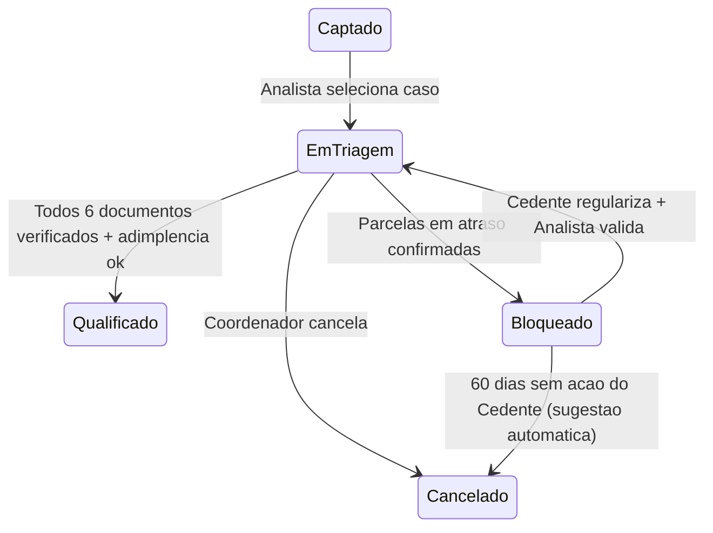
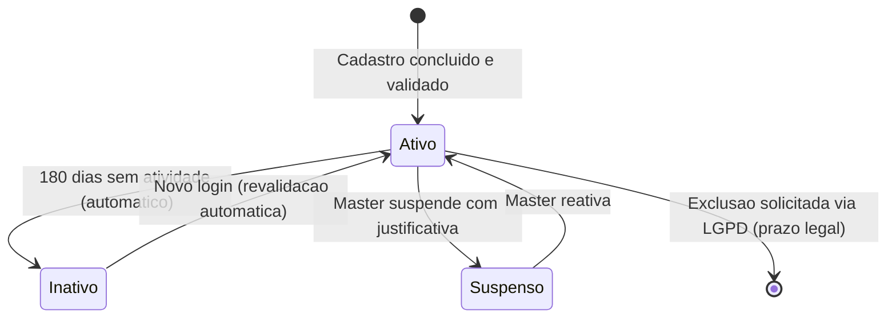

# ⚙️ Regras de Negócio — Módulos Operação e Suporte

## Módulo Admin — Repasse Seguro

| **Campo** | **Valor** |
|---|---|
| **Destinatário** | Equipe de Produto e Engenharia |
| **Escopo** | Triagem documental · SLAs operacionais · Notificações automáticas · Gestão de usuários · Fluxos operacionais consolidados · Plano de testes |
| **Módulo** | Admin |
| **Parte** | Parte 3 de 5 — Módulos Operação e Suporte |
| **Versão** | v1.2 |
| **Responsável** | Claude Code Desktop |
| **Data da versão** | 2026-03-22 (America/Fortaleza) |
| **Continuidade** | RN-054 (Parte 01.2) |
| **Origem do arquivo de entrada** | 01 - Regras de Negócio.md |

---

> 📌 **TL;DR**
>
> Este arquivo cobre os módulos que sustentam a operação diária sem gerar receita diretamente: o módulo de Triagem (verificação documental e adimplência), os SLAs por etapa do ciclo de vida, o sistema de notificações automáticas, a gestão de usuários e os fluxos operacionais consolidados de ponta a ponta. A numeração de RNs neste arquivo vai de **RN-055 a RN-086** (v1.0) e **RN-148** (correção v1.1).

---

## 🎯 Contexto dos Módulos de Operação

Estes módulos não geram receita diretamente, mas sem eles a operação trava: sem triagem não há casos qualificados, sem SLAs os prazos se perdem, sem notificações as partes ficam no escuro e sem gestão de usuários não há controle de quem acessa o quê.

**Critério de classificação:** Remover qualquer módulo desta parte quebra a operação interna, mas não interrompe imediatamente o faturamento de casos já em andamento.

**Módulos cobertos nesta parte:**
- **Triagem** — verificação documental e adimplência
- **SLAs** — prazos por etapa e consequências de estouro
- **Notificações** — eventos, destinatários e canais
- **Usuários** — cadastro, verificação, suspensão e proteção de dados
- **Fluxos Operacionais** — os 5 caminhos possíveis de um caso

---

## 1. Módulo: Triagem

### 1.1 Visão Geral do Módulo

🎯 **Objetivo:** Centralizar o trabalho de verificação documental e validação de adimplência, garantindo que o Analista tenha todas as ferramentas para aprovar ou bloquear casos de forma eficiente e rastreável.

**Atores envolvidos:** Cedente (envia documentos), Analista (verifica), Coordenador (aprova exceções e desbloqueios), Sistema (notifica e registra)

**Objeto principal:** Caso em triagem

**Estados possíveis neste módulo:**

**Operações principais:** Verificar documento, Rejeitar documento, Solicitar documentos, Aprovar triagem, Bloquear caso, Desbloquear caso, Registrar exceção

### 1.2 Regras de Negócio

---

**RN-055: Ordem FIFO obrigatória na fila de triagem**

> Origem: TR-01 (arquivo de entrada)

1. O Analista acessa o menu "Triagem" e visualiza a fila de casos aguardando verificação.
2. A fila é ordenada por data de entrada — o caso mais antigo aparece primeiro (FIFO).
3. **Se o Analista seleciona o próximo caso da fila (o mais antigo):** o painel de trabalho abre normalmente sem alerta.
4. **Se o Analista seleciona um caso fora da ordem FIFO (não é o mais antigo):** o sistema exibe alerta informativo amarelo no topo do painel: "Este caso não é o próximo na fila. O caso [ID do mais antigo] aguarda há mais tempo." com link "Ir para o caso mais antigo". A seleção fora de ordem é **permitida**, mas registrada no log de auditoria com timestamp e identificação do Analista.
5. **Consequência se violada:** Casos antigos acumulam SLA estourado enquanto casos recentes são atendidos primeiro, gerando inequidade e estouro sistêmico de prazos.

**Interface da fila de triagem:** [CORRIGIDO: PROBLEMA-027]
- Lista ordenada por data de entrada (FIFO). Cada item exibe: ID do caso, endereço do imóvel, data de entrada, tempo na fila (ex: "Há 2 dias"), progresso do dossiê (ex: "3/6 documentos").
- O caso no topo da fila (mais antigo) recebe destaque visual: borda esquerda colorida (azul) e label "Próximo na fila".
- Ao selecionar caso fora de ordem: o alerta amarelo é exibido como banner fixo no topo do painel de trabalho, com botão "Ir para o caso mais antigo" e link para o caso prioritário.
- [DECISÃO APLICADA: DEC-009] O alerta de FIFO é informativo (amarelo) e não bloqueante. Justificativa: bloquear completamente a seleção fora de ordem impediria o Analista de atender urgências operacionais legítimas (ex: caso com SLA prestes a estourar).

**Estado vazio da fila de triagem:** [CORRIGIDO: PROBLEMA-028]
- Quando não há casos aguardando triagem: ícone ilustrativo de checklist vazio + texto "Todos os casos foram triados. Não há pendências no momento." Sem botão de ação (Analistas não criam casos).

---

**RN-056: Carimbo imutável de verificação de documento**

> Origem: TR-02 (arquivo de entrada)

1. O Analista abre um documento do dossiê e clica em "Verificar".
2. O sistema registra o carimbo automaticamente com: nome do Analista, data e hora da verificação.
3. **O carimbo é imutável após aplicado.** Nenhum perfil pode remover ou alterar a verificação registrada.
4. **Exceção para reenvio:** quando o Cedente reenvia um documento rejeitado, o novo documento substitui o anterior no checklist. O histórico do documento anterior é preservado no dossiê, mas o carimbo de "Verificado" precisa ser aplicado novamente ao novo documento.
5. **Consequência se violada:** Sem carimbo imutável, disputas sobre "quem aprovou o documento" não podem ser resolvidas.

---

**RN-148: Reenvio de documento — novo arquivo substitui anterior, histórico preservado**

> Origem: TR-03 (arquivo de entrada)

1. O Cedente reenvia um documento que foi rejeitado pelo Analista na triagem.
2. O sistema verifica que existe um documento anterior registrado com status "Rejeitado" para o mesmo tipo documental.
3. **O novo documento enviado substitui o anterior na checklist ativa de triagem.** O Analista visualiza apenas o novo documento no checklist e precisa verificá-lo novamente.
4. **O documento anterior não é apagado:** o sistema preserva o histórico completo, incluindo o arquivo rejeitado, o motivo da rejeição, o carimbo do Analista e a data/hora. O histórico fica acessível na aba "Histórico" do dossiê.
5. **Efeito no estado do objeto:** o status do item na checklist muda de "Rejeitado" (❌) para "Pendente" (⏳) ao receber o novo documento, aguardando nova verificação pelo Analista.
6. **Consequência se violada:** Sobrescrever o documento anterior sem preservar o histórico elimina a evidência de que um documento foi rejeitado, comprometendo a rastreabilidade do dossiê.

---

**RN-057: Salvamento automático de progresso de triagem**

> Origem: Seção 4.3 — Funcionalidade 6 (arquivo de entrada)

1. O Analista inicia a verificação de documentos de um caso na Triagem.
2. O Analista interrompe o trabalho (fecha o painel, navega para outra tela ou seleciona outro caso na fila) antes de concluir todos os 6 documentos.
3. **O sistema salva automaticamente o progresso parcial:** documentos já verificados mantêm status "Verificado" (✅) e rejeitados mantêm "Rejeitado" (❌).
4. **Quando o Analista retorna ao caso:** o painel exibe o estado exatamente como foi deixado, com indicador "Verificação em andamento — X de 6 documentos revisados".
5. **Consequência se violada:** O Analista perde o trabalho parcial e precisa refazer toda a verificação, aumentando o tempo de triagem e o risco de estouro de SLA.

---

**RN-058: Bloqueio de caso por inadimplência e desbloqueio**

> Origem: TR-04 e TR-05 (arquivo de entrada)

1. O Analista identifica parcelas em atraso e bloqueia o caso (conforme RN-001).
2. O sistema muda o status para "Bloqueado" e notifica o Cedente.
3. **Após 60 dias corridos sem ação do Cedente:** o sistema sugere automaticamente o cancelamento ao Coordenador. O Coordenador decide entre cancelar ou manter o caso bloqueado aguardando mais.
4. **Para desbloquear o caso:** apenas o Analista atribuído ou o Coordenador podem executar o desbloqueio. O desbloqueio exige que o motivo original do bloqueio tenha sido resolvido — comprovantes atualizados devem estar anexados ao dossiê antes do desbloqueio.
5. **Consequência se violada:** Desbloquear sem resolução do motivo faz o caso avançar para triagem com o mesmo problema que causou o bloqueio, resultando em bloqueio novamente na Formalização.

**Mensagens ao usuário:**
- Sugestão de cancelamento após 60 dias (ao Coordenador): "O caso [ID] está bloqueado há 60 dias sem ação do Cedente. Recomenda-se cancelamento. Acesse o caso para decidir."

---

## 2. Módulo: SLAs (Prazos por Etapa)

### 2.1 Visão Geral do Módulo

🎯 **Objetivo:** Manter o ciclo de vida do caso previsível. Sem SLAs, os casos podem se arrastar indefinidamente, comprometendo o pipeline de receita e a satisfação das partes.

**Atores envolvidos:** Sistema (monitora e alerta), Analista (cumpre), Coordenador (prioriza e resolve estouros), Master (configura prazos)

**Objeto principal:** Transição de status do Caso

**Operações principais:** Monitorar, Alertar, Escalar, Configurar

### 2.2 Tabela Completa de SLAs

| **Transição** | **SLA Alvo** | **SLA Máximo** | **Se estourar** |
|---|---|---|---|
| Captado → Em Triagem | Imediato | 24 horas | Alerta automático ao Coordenador |
| Em Triagem → Qualificado | 3 dias úteis | 5 dias úteis | Cedente notificado. Coordenador prioriza. |
| Qualificado → Oferta Ativa | 2 dias úteis | 3 dias úteis | Caso entra na fila automática de publicação |
| Oferta Ativa → Em Negociação | 15 dias corridos | 30 dias corridos | Avaliação de escalonamento de cenário (conforme RN-025) |
| Em Negociação → Em Formalização | 10 dias úteis | 20 dias úteis | Coordenador aciona mediação ativa |
| Em Formalização → Fechamento | 10 dias úteis | 20 dias úteis | Escalar pendência de anuência ou depósito na escrow |
| Pós Fechamento → Concluído | 15 dias corridos | 15 dias corridos | Fixo (prazo de reversão). Conta Escrow distribui automaticamente |

### 2.3 Regras de Negócio

---

**RN-059: SLAs por etapa e alertas automáticos**

> Origem: Regra 13 (arquivo de entrada)

1. O sistema monitora continuamente o tempo decorrido em cada etapa para cada caso ativo.
2. **Quando o SLA restante atinge 20% do prazo máximo:** o sistema gera alerta no painel do Analista responsável e do Coordenador com label "SLA próximo". Não envia e-mail neste momento.
3. **Quando o SLA máximo é atingido:** o sistema gera alerta crítico por e-mail e painel para o Coordenador e o Master com label "SLA estourado".
4. O sistema não cancela nem bloqueia o caso automaticamente por SLA estourado — a ação corretiva é tomada pelo operador.
5. **Efeito:** Alerta no painel muda de cor: verde (dentro do SLA) → amarelo (≤20% restante) → vermelho (estourado).
6. **Consequência se violada:** Sem alertas, os operadores não sabem quais casos estão em risco de atraso, resultando em estouro sistemático de prazos.

**Mensagens ao usuário:**
- SLA próximo de estourar (no painel): "Atenção: o caso [ID] está a [X]% do SLA máximo da etapa [etapa]. [N] dia(s) restante(s)."
- SLA estourado (por e-mail e painel): "URGENTE: o caso [ID] estourou o SLA da etapa [etapa]. Ação imediata necessária."

**Indicadores visuais de SLA em todas as telas:** [CORRIGIDO: PROBLEMA-029]
- Badge de SLA obrigatório em todo card de caso: verde (dentro do SLA), amarelo (≤20% restante), vermelho (estourado).
- Tooltip do badge: "SLA: X de Y dias. Etapa: [nome da etapa]."
- O badge é consistente em tamanho, posição e cores em todas as telas: Dashboard, Pipeline, Triagem, Negociação e Formalização.
- Contador regressivo: nos cards de caso com SLA amarelo ou vermelho, exibir número de dias restantes em destaque (ex: "-2d" para estourados, "1d" para próximos).

**Acessibilidade dos alertas de SLA:** [CORRIGIDO: PROBLEMA-030]
- Alertas de SLA não dependem apenas de cor: incluem ícone diferenciado (check para verde, relógio para amarelo, exclamação para vermelho) e label textual.
- Leitores de tela anunciam: "Caso [ID], SLA [estado]: [dias restantes ou dias em atraso]."

---

**RN-060: Reinício de SLA após escalonamento de cenário**

> Origem: Regra 08 — Ação, item 6 (arquivo de entrada)

1. O Cedente aceita o escalonamento de cenário e assina o Termo de Aceite via ZapSign.
2. O caso retorna para "Oferta Ativa" com o novo cenário.
3. **O timer de SLA de 30 dias corridos para a transição "Oferta Ativa → Em Negociação" reinicia a partir da data do escalonamento aceito.**
4. O alerta de estagnação que disparou o escalonamento é marcado como resolvido.
5. **Consequência se violada:** Sem reiniciar o timer, o alerta de estagnação re-dispara imediatamente após o escalonamento, gerando confusão operacional.

---

**RN-061: SLA pausado durante indisponibilidade de integração**

> Origem: FORM-06 (arquivo de entrada)

1. Uma integração crítica (ZapSign ou parceiro escrow) fica indisponível durante a etapa de Formalização.
2. O sistema registra o início da indisponibilidade com timestamp.
3. **O SLA da etapa de Formalização é pausado automaticamente** durante o período de indisponibilidade confirmada.
4. O sistema registra início e fim da pausa.
5. **Consequência se violada:** Casos são penalizados no SLA por falhas de terceiros fora do controle da operação.

---

## 3. Módulo: Notificações Automáticas

### 3.1 Visão Geral do Módulo

🎯 **Objetivo:** Garantir que todas as partes recebam informações críticas no momento certo. Sem notificações, prazos estouram por falta de visibilidade.

**Atores envolvidos:** Sistema (dispara), Cedente, Cessionário, Analista, Coordenador, Gestor Financeiro (recebem)

**Objeto principal:** Evento do ciclo de vida do caso

**Canais de notificação:** E-mail (sempre ativo) e Painel interno da sidebar (sempre ativo). SMS e WhatsApp estão previstos para versões futuras.

**Operações principais:** Disparar, Entregar, Registrar, Alertar falhas

### 3.2 Regras de Negócio

---

**RN-062: SLA de entrega de notificações**

> Origem: Regra 17 — SLA de entrega (arquivo de entrada)

1. Um evento do ciclo de vida do caso é disparado.
2. O sistema envia a notificação correspondente.
3. **Notificações no painel interno:** devem aparecer ao destinatário em até **30 segundos** após o evento.
4. **Notificações por e-mail:** devem ser enviadas em até **5 minutos** após o evento.
5. **Exceção ZapSign:** notificações de assinatura seguem o SLA do próprio ZapSign (fora do controle do RS).
6. **Se o SLA de entrega é violado:** o sistema gera alerta técnico interno para monitoramento. Não é visível no Admin, mas é rastreável em logs de infraestrutura.
7. **Consequência se violada:** Operadores e partes ficam sem informações críticas no tempo necessário para agir, causando estouro de SLAs operacionais.

---

**RN-063: Tabela completa de eventos e destinatários**

> Origem: Regra 17 — Tabela de eventos (arquivo de entrada)

| **Evento** | **Destinatário(s)** | **Canal** |
|---|---|---|
| Caso captado (novo cadastro) | Analista atribuído, Coordenador | E-mail + Painel |
| Dossiê incompleto (documentos pendentes) | Cedente | E-mail + Painel |
| Caso bloqueado por inadimplência | Cedente | E-mail + Painel |
| Caso qualificado e publicado | Cedente | E-mail + Painel |
| Nova proposta recebida | Analista, Cedente (sem dados do Cessionário) | E-mail + Painel |
| Contraproposta recebida | Analista, parte destinatária | E-mail + Painel |
| Negociação escalada para Coordenador | Coordenador | E-mail + Painel |
| Aceite de negociação confirmado | Cedente, Cessionário, Analista | E-mail + Painel |
| Instruções de depósito na Conta Escrow | Cessionário | E-mail + Painel |
| Lembrete de depósito pendente (7 dias úteis) | Cessionário | E-mail + Painel |
| Depósito confirmado na Conta Escrow | Analista, Gestor Financeiro | E-mail + Painel |
| Envelope ZapSign enviado para assinatura | Cedente, Cessionário | E-mail (via ZapSign) |
| Todas as assinaturas concluídas | Analista | E-mail + Painel |
| Fechamento confirmado | Cedente, Cessionário, Gestor Financeiro | E-mail + Painel |
| Início do período de reversão (15 dias) | Cedente, Cessionário | E-mail + Painel |
| Distribuição da Conta Escrow realizada | Cedente, Cessionário, Gestor Financeiro | E-mail + Painel |
| Caso cancelado | Cedente, Cessionário (se aplicável) | E-mail + Painel |
| SLA próximo de estourar (≤20% do prazo máximo) | Analista responsável, Coordenador | Painel (somente) |
| SLA estourado | Coordenador, Master | E-mail + Painel |
| Sugestão de escalonamento de cenário | Cedente | E-mail + Painel |
| Reversão iniciada | Cedente, Cessionário, Gestor Financeiro | E-mail + Painel |
| Mediação iniciada (desistência unilateral) | Cedente, Cessionário, Coordenador | E-mail + Painel |
| Prorrogação de depósito concedida | Cessionário, Analista | E-mail + Painel |

---

**RN-064: Falhas de entrega de notificação**

> Origem: Regra 17 — Exceções (arquivo de entrada)

1. O sistema tenta enviar uma notificação por e-mail a um destinatário.
2. **Se o e-mail é inválido ou retorna como bounced (não entregue):** o sistema registra a falha e gera alerta para o Coordenador.
3. O Coordenador verifica e corrige o e-mail do usuário (conforme permissão de edição de dados básicos).
4. Após correção, o sistema pode reenviar a notificação pendente.
5. **Cada notificação enviada fica registrada com:** evento, destinatário, canal, data/hora e status de entrega (entregue ou falhou com motivo).
6. **Consequência se violada:** Uma parte pode tomar decisões sem informações críticas, ou perder o prazo de depósito, de reversão ou de assinatura.

**Centro de notificações no painel interno:** [CORRIGIDO: PROBLEMA-031]
- Ícone de sino na barra superior com badge numérico (quantidade de notificações não lidas).
- Ao clicar no sino: painel dropdown com lista de notificações em ordem cronológica reversa. Cada item exibe: ícone do tipo de evento, texto resumido, data/hora relativa ("há 5 min") e indicador de lida/não lida.
- Botão "Marcar todas como lidas" no topo do painel.
- Cada notificação é clicável e redireciona para a tela de contexto (ex: notificação de depósito confirmado abre a Formalização do caso).
- [DECISÃO APLICADA: DEC-010] Notificações não lidas são destacadas com fundo levemente mais escuro e ponto azul na lateral. Justificativa: o destaque sutil evita poluição visual mantendo a distinção clara entre lidas e não lidas.

**Falha de entrega — feedback ao operador:** [CORRIGIDO: PROBLEMA-032]
- Notificações com falha de entrega exibem badge "Falhou" em vermelho no log de notificações.
- O Coordenador visualiza o motivo da falha (e-mail inválido, bounce, etc.) e tem acesso direto ao botão "Corrigir E-mail" que abre o perfil do usuário.
- Após correção, botão "Reenviar" fica ativo ao lado da notificação falhada.

---

## 4. Módulo: Usuários

### 4.1 Visão Geral do Módulo

🎯 **Objetivo:** Centralizar a gestão de todos os usuários da plataforma — Cedentes, Cessionários e operadores internos — com controle de acesso, verificação de identidade e proteção de dados.

**Atores envolvidos:** Master (cria e gerencia operadores, suspende usuários), Coordenador (visualiza e edita dados básicos), Gestor Financeiro (somente leitura para reconciliação)

**Objeto principal:** Usuário (Cedente, Cessionário ou Operador)

**Estados possíveis do usuário:**

**Operações principais:** Criar operador, Visualizar perfil, Editar dados básicos, Suspender, Reativar, Alterar perfil, Processar solicitação LGPD

### 4.2 Regras de Negócio

---

**RN-065: Criação de operador interno**

> Origem: Seção 4.8 — Funcionalidade 2 (arquivo de entrada)

1. O Master acessa o menu "Usuários > Aba Operadores" e clica em "Novo Operador".
2. O Master preenche: nome, e-mail e perfil (Analista, Coordenador, Gestor Financeiro ou Master).
3. O sistema valida o e-mail em tempo real:
   - **Formato inválido:** exibe mensagem inline antes de salvar.
   - **E-mail já cadastrado:** exibe mensagem inline antes de salvar.
4. **Se os dados são válidos:** o sistema cria o operador, envia convite por e-mail com link de primeiro acesso e exibe confirmação ao Master.
5. **Se a criação falha:** exibe mensagem de erro e nenhum operador é criado.
6. **Somente o Master pode criar operadores internos.**
7. **Consequência se violada:** Operadores sem cadastro formal não têm rastreabilidade de ações, comprometendo a auditoria.

**Mensagens ao usuário:**
- E-mail inválido (ao Master): "Informe um e-mail válido."
- E-mail duplicado (ao Master): "Este e-mail já está vinculado a um operador."
- Criação bem-sucedida (ao Master): "Operador criado com sucesso. Convite enviado para [e-mail]."

---

**RN-066: Suspensão de usuário**

> Origem: Seção 4.8 — Funcionalidade 4 (arquivo de entrada)

1. O Master identifica um usuário (Cedente, Cessionário ou operador) que precisa ser suspenso.
2. O Master clica em "Suspender" no perfil do usuário e informa a justificativa obrigatória (mínimo 20 caracteres).
3. **Ao confirmar a suspensão:**
   - O acesso do usuário à plataforma é bloqueado imediatamente.
   - Se o usuário suspenso é um Cedente: casos ativos ficam congelados.
   - Se o usuário suspenso é um Cessionário: propostas ativas são canceladas.
   - O sistema envia notificação ao usuário suspenso por e-mail.
4. **A suspensão é reversível:** o Master pode reativar o usuário a qualquer momento.
5. **Consequência se violada:** Usuários suspensos sem bloqueio imediato continuam agindo na plataforma durante o período de investigação.

**Mensagens ao usuário:**
- Notificação de suspensão (ao usuário): "Seu acesso à plataforma Repasse Seguro foi temporariamente suspenso. Entre em contato com o suporte para mais informações."

**Modal de suspensão — confirmação com impacto:** [CORRIGIDO: PROBLEMA-033]
- Ao clicar "Suspender", o sistema exibe modal com resumo de impacto: "Suspender [nome] afetará: [X] casos ativos (congelados) e [Y] propostas ativas (canceladas)."
- Campo de justificativa obrigatório (mínimo 20 caracteres) com contador.
- Botão "Confirmar Suspensão" em vermelho. Botão "Cancelar" em cinza.
- Após confirmação, toast de sucesso: "Usuário suspenso. [X] casos congelados e [Y] propostas canceladas."

---

**RN-067: Inatividade automática e reativação por login**

> Origem: Seção 4.8 — Funcionalidade 5 (arquivo de entrada)

1. O sistema monitora a data do último acesso de cada usuário.
2. **Após 180 dias corridos sem acesso:** o status do usuário muda automaticamente para "Inativo".
3. **Para reativar:** o usuário faz login normalmente. O sistema revalida as credenciais e restaura o status "Ativo" automaticamente.
4. **Dados e histórico preservados:** usuários inativos ou suspensos têm seus dados e histórico integralmente preservados. Nenhuma informação é apagada.
5. **Consequência se violada:** Usuários inativos acumulam na base sem controle, dificultando a gestão e aumentando o risco de acesso com credenciais antigas.

---

**RN-068: Alteração de perfil de operador**

> Origem: Seção 4.8 — Funcionalidade 6, Regra 12 (arquivo de entrada)

1. O Master acessa o perfil de um operador na aba "Operadores".
2. O Master seleciona o novo perfil no dropdown e confirma a alteração.
3. O sistema atualiza o perfil imediatamente. A sidebar do operador reflete as novas permissões na próxima vez que ele navegar pela plataforma.
4. A alteração gera registro de auditoria com: operador, perfil anterior, novo perfil, data/hora e Master responsável.
5. **Somente o Master pode alterar perfis de operadores.**
6. **Consequência se violada:** Operadores com perfis incorretos executam ações fora de sua alçada ou ficam sem acesso a telas necessárias para seu trabalho.

---

**RN-069: Isolamento de dados na tela de Usuários**

> Origem: USR-03 (arquivo de entrada)

1. O operador acessa o menu "Usuários" e visualiza perfis de Cedentes e Cessionários.
2. **A tela nunca exibe em nenhum lugar qual Cessionário está vinculado a qual Cedente.**
3. A vinculação entre Cessionário e Cedente só é visível dentro do contexto de um caso específico, nos menus Pipeline, Negociação, Formalização e Financeiro.
4. **Consequência se violada:** Operadores poderiam mapear relacionamentos entre partes e vazar informações que permitem negociação direta fora da plataforma.

---

**RN-070: Processamento de solicitação de exclusão de dados (LGPD)**

> Origem: USR-06 (arquivo de entrada)

1. Um Cedente ou Cessionário solicita a exclusão de seus dados pessoais (direito previsto na LGPD — Art. 18).
2. O Master registra a solicitação com a data exata de recebimento e encaminha ao Jurídico.
3. **Prazo máximo de resposta ao titular: 15 dias corridos** a partir da data de recebimento (conforme Art. 18, §5° da LGPD).
4. O sistema exibe timer regressivo no perfil do usuário solicitante (visível apenas para o Master).
5. **Se o prazo é ultrapassado sem resposta registrada:** o sistema gera alerta crítico ao Master.
6. **Dados vinculados a casos concluídos, em mediação ou em disputa formal:** não podem ser apagados imediatamente por obrigação legal de retenção. O titular **deve ser informado desta justificativa dentro do prazo de 15 dias.**
7. **Consequência se violada:** O Repasse Seguro fica sujeito a sanções da ANPD (Autoridade Nacional de Proteção de Dados) por descumprimento do prazo.

**Mensagens ao usuário:**
- Solicitação recebida (ao titular): "Sua solicitação de exclusão de dados foi recebida. Você receberá uma resposta em até 15 dias."
- Dados retidos por obrigação legal (ao titular): "Parte dos seus dados está vinculada a processos com obrigação legal de retenção. Detalharemos quais dados e por quanto tempo em resposta enviada ao seu e-mail em até 15 dias."

**Painel de gestão LGPD (visível apenas para Master):** [CORRIGIDO: PROBLEMA-034]
- Aba "Solicitações LGPD" no módulo Usuários com lista de solicitações pendentes.
- Cada solicitação exibe: nome do titular (mascarado), tipo de solicitação (exclusão/acesso/correção), data de recebimento, timer regressivo dos 15 dias e status (Pendente/Em Análise/Respondida/Vencida).
- Solicitações com prazo ≤ 3 dias: badge amarelo "Prazo próximo". Solicitações vencidas: badge vermelho "Prazo excedido".
- Botão "Registrar Resposta" abre formulário com campo de resposta e opção de anexar documentação.

---

**RN-071: Exportação de lista de usuários**

> Origem: Seção 4.8 — Funcionalidade 7 (arquivo de entrada)

1. O Master ou Coordenador clica em "Exportar" na tela de Usuários.
2. O sistema gera um arquivo CSV com os dados filtrados.
3. **Restrição de segurança:** a exportação de Cessionários não inclui CPF/CNPJ no arquivo exportado.
4. **Se a exportação é bem-sucedida:** exibe toast com link para download.
5. **Se a exportação falha:** exibe toast de erro com opção de nova tentativa.
6. **Consequência se violada:** Exportar CPF/CNPJ em massa viola o princípio de minimização de dados da LGPD.

---

## 5. Fluxos Operacionais Consolidados

Os 5 fluxos abaixo descrevem os caminhos possíveis de um caso de ponta a ponta. Cada fluxo referencia as RNs detalhadas nas Partes 01.1 e 01.2.

---

**RN-072: Fluxo feliz — caminho ideal**

> Origem: Seção 7.1 (arquivo de entrada)

1. **Captação:** o Cedente cadastra o imóvel. O sistema cria o caso com status "Captado" e gera o dossiê vazio.
2. **Triagem (conforme RN-001, RN-002):** o Analista verifica adimplência e dossiê. Tudo aprovado → status "Qualificado".
3. **Publicação:** o Coordenador publica a oferta → status "Oferta Ativa".
4. **Negociação (conforme RN-026):** o Cessionário faz proposta. O Cedente aceita na 1ª rodada → status "Em Formalização".
5. **Formalização (conforme RN-020, RN-034):** ZapSign enviado. Cessionário deposita na Conta Escrow dentro de 10 dias úteis. Anuência obtida.
6. **Fechamento (conforme RN-023):** 4 critérios cumpridos. Analista confirma → status "Fechamento" → "Pós Fechamento".
7. **Conclusão:** 15 dias sem reversão. Conta Escrow distribui automaticamente → status "Concluído".

**Ciclo estimado:** 45 a 60 dias.

---

**RN-073: Fluxo com pendência documental**

> Origem: Seção 7.2 (arquivo de entrada)

1. O Cedente cadastra o imóvel.
2. O Analista identifica que faltam documentos obrigatórios no dossiê (conforme RN-002).
3. O sistema notifica o Cedente com a lista exata dos documentos pendentes (conforme RN-063).
4. O Cedente envia os documentos faltantes pelo painel.
5. O Analista valida os novos documentos e avança para "Qualificado".
6. O fluxo segue normalmente a partir da publicação.

**Impacto operacional:** Atrasa o SLA de triagem. Se o Cedente não enviar em 5 dias úteis, o Coordenador é alertado.

---

**RN-074: Fluxo com bloqueio por inadimplência**

> Origem: Seção 7.3 (arquivo de entrada)

1. O Cedente cadastra o imóvel.
2. O Analista identifica parcelas em atraso (conforme RN-001).
3. O status muda para "Bloqueado". O Cedente é notificado com orientações para regularização.
4. O Cedente regulariza as parcelas e envia os comprovantes.
5. O Analista valida o desbloqueio (conforme RN-058). O status volta para "Em Triagem".
6. O fluxo segue normalmente.

**Impacto operacional:** O caso fica congelado até regularização. Após 60 dias corridos sem ação do Cedente, o sistema sugere cancelamento ao Coordenador.

---

**RN-075: Fluxo com cancelamento**

> Origem: Seção 7.4 (arquivo de entrada)

O cancelamento pode ocorrer em qualquer etapa (exceto após "Concluído"). Cenários comuns:

1. **Cancelamento na Triagem:** o Cedente desiste voluntariamente. O Coordenador cancela com justificativa (conforme RN-040).
2. **Cancelamento por anuência negada:** a construtora recusa a anuência durante a Formalização. O Coordenador cancela. A Conta Escrow estorna o valor ao Cessionário (conforme RN-033 e RN-041).
3. **Cancelamento por prazo de depósito:** o Cessionário não deposita em 15 dias úteis. O sistema cancela automaticamente (conforme RN-034).
4. **Cancelamento após escalonamento recusado:** o caso em "Oferta Ativa" por muito tempo, o Cedente recusa o escalonamento e o Coordenador avalia e pode cancelar.

**Em todos os cenários:** justificativa obrigatória, dossiê arquivado, partes notificadas, Conta Escrow estorna (se aplicável).

---

**RN-076: Fluxo com disputa — reversão unilateral**

> Origem: Seção 7.5 (arquivo de entrada)

1. O caso está em "Pós Fechamento" (dentro dos 15 dias corridos).
2. Uma parte comunica desistência, mas a outra **não aceita** (conforme RN-038).
3. O Coordenador abre mediação formal de 10 dias úteis. A Conta Escrow fica 100% congelada.
4. **Desfecho 1 — Acordo:** as partes concordam (estorno ou manutenção). A Conta Escrow executa.
5. **Desfecho 2 — Sem acordo:** o Master registra "Disputa Formal". Os valores permanecem retidos até resolução extrajudicial ou judicial. O RS custodia os valores via escrow, mas não participa da resolução jurídica.

**Impacto financeiro:** Disputas formais travam receita indefinidamente. O pipeline deve considerar esse risco no forecast.

---

## 6. Plano de Testes Não Técnico

> 📌 **Sobre este plano:** Voltado para Produto, Operação e QA funcional. Cada cenário descreve o que fazer, o que observar e qual o resultado esperado. Os cenários T01–T39 testam regras isoladas. Para testes de fluxo completo (end-to-end), execute os fluxos dos RN-072 a RN-076 na sequência.

### 6.1 Testes de Cadastro e Elegibilidade

| **#** | **Cenário** | **Resultado esperado** | **RN de referência** |
|---|---|---|---|
| T01 | Cadastrar imóvel com dossiê completo e adimplência ok. | Caso criado com status "Captado". Analista avança para "Qualificado". | RN-001, RN-002 |
| T02 | Cadastrar imóvel com 2 parcelas em atraso. | Caso bloqueado. Cedente notificado com orientações de regularização. | RN-001 |
| T03 | Cadastrar imóvel com dossiê incompleto (faltam 2 documentos). | Caso permanece "Em Triagem". Cedente notificado com lista de documentos faltantes. | RN-002 |
| T04 | Tentar cadastrar imóvel que já tem caso ativo. | Sistema bloqueia. Mensagem: "Você já tem um caso ativo para este imóvel." | RN-003 |
| T05 | Cadastrar imóvel que teve caso anterior cancelado. | Sistema permite novo cadastro normalmente. | RN-003 |

### 6.2 Testes de Comissões

| **#** | **Cenário** | **Resultado esperado** | **RN de referência** |
|---|---|---|---|
| T06 | Fechar caso no Cenário A. | Comissão do Cedente = R$ 0. Comissão do Cessionário calculada sobre o Delta. | RN-018, RN-019 |
| T07 | Fechar caso no Cenário B com Valor Recuperado R$ 300.000 e Distrato R$ 150.000. | Comissão Cedente = 20% de R$ 150.000 = R$ 30.000. | RN-018 |
| T08 | Fechar caso Cenário A com Delta = 0 (sem valorização). | Comissão Cessionário = 20% do Valor Pago pelo Cedente (exceção ativada). | RN-019 |
| T09 | Verificar que o sistema calcula automaticamente e apresenta ao Analista. | Tela mostra fórmula, valores de entrada e resultado antes da confirmação. | RN-018, RN-019 |

### 6.3 Testes da Conta Escrow

| **#** | **Cenário** | **Resultado esperado** | **RN de referência** |
|---|---|---|---|
| T10 | Caso entra em "Em Formalização". | Sistema cria Conta Escrow com ID único. Cessionário recebe instruções de depósito. | RN-020 |
| T11 | Cessionário deposita valor total. | Status "Depósito Confirmado" visível no Admin. Botão de fechamento fica habilitado (se outros 3 critérios ok). | RN-020, RN-023 |
| T12 | Cessionário não deposita em 7 dias úteis. | Sistema envia lembrete automático ao Cessionário. | RN-034 |
| T13 | Cessionário não deposita em 10 dias úteis. | Alerta para Coordenador. Opção de prorrogação (5 dias) ou cancelamento. | RN-034 |
| T14 | Cessionário não deposita em 15 dias úteis (com prorrogação). | Sistema cancela automaticamente. Cedente e Cessionário notificados. | RN-034 |
| T15 | 15 dias pós Fechamento sem reversão. | Conta Escrow distribui automaticamente. Cedente recebe líquido, RS recebe comissões. | RN-020, RN-021 |

### 6.4 Testes de Fechamento e Reversão

| **#** | **Cenário** | **Resultado esperado** | **RN de referência** |
|---|---|---|---|
| T16 | Tentar fechar caso com apenas 3 dos 4 critérios. | Botão "Confirmar Fechamento" inativo. Mensagem indica pendência específica. | RN-023 |
| T17 | Fechar caso com 4 critérios cumpridos. | Status muda para "Fechamento" → "Pós Fechamento". Contagem de 15 dias inicia. | RN-023 |
| T18 | Desistência consensual dentro de 15 dias. | Gestor inicia reversão. Escrow estorna integral ao Cessionário. RS recebe R$ 0. | RN-037 |
| T19 | Desistência unilateral dentro de 15 dias. | Mediação de 10 dias úteis. Escrow congelada. Escalação para Master se sem acordo. | RN-038 |
| T20 | Cancelar caso com valor na Conta Escrow. | Valor estornado integralmente ao Cessionário. Status "Cancelado". | RN-040 |

### 6.5 Testes de Negociação

| **#** | **Cenário** | **Resultado esperado** | **RN de referência** |
|---|---|---|---|
| T21 | Cessionário faz proposta e Cedente aceita na 1ª rodada. | Caso avança para "Em Formalização". Aceite registrado no dossiê. | RN-026 |
| T22 | 3 contrapropostas sem acordo. | Sistema escala para Coordenador automaticamente. Coordenador assume mediação. | RN-026 |
| T23 | Caso em Oferta Ativa por 30 dias sem nenhuma proposta. | Sistema sugere escalonamento de cenário. Cedente recebe simulação comparativa. | RN-025 |
| T24 | Cedente aceita escalonamento de D para C. | Termo assinado via ZapSign. Caso volta para "Oferta Ativa" com novo cenário. Timer SLA reinicia. | RN-025, RN-060 |

### 6.6 Testes de Acesso e Permissões

| **#** | **Cenário** | **Resultado esperado** | **RN de referência** |
|---|---|---|---|
| T25 | Analista tenta acessar menu "Financeiro". | Acesso negado. Mensagem de permissão insuficiente. | RN-004 |
| T26 | Cessionário tenta ver dados pessoais do Cedente na plataforma. | Campos filtrados. Nenhum dado sensível visível. | RN-015 |
| T27 | Master altera perfil de Analista para Coordenador. | Sidebar atualizada imediatamente. Novos menus visíveis. Log registrado. | RN-068 |

### 6.7 Testes de Notificações

| **#** | **Cenário** | **Resultado esperado** | **RN de referência** |
|---|---|---|---|
| T28 | Caso captado. Verificar notificação para Analista. | E-mail enviado em até 5 min. Notificação no painel em até 30 seg. | RN-062, RN-063 |
| T29 | SLA de triagem a 80% do prazo máximo. | Alerta no painel do Analista e Coordenador. Sem e-mail (apenas painel). | RN-059, RN-062 |

### 6.8 Testes de Auditoria

| **#** | **Cenário** | **Resultado esperado** | **RN de referência** |
|---|---|---|---|
| T30 | Qualquer mudança de status do caso. | Registro automático: status anterior, novo status, data/hora, responsável, motivo. | RN-016 |
| T31 | Tentar editar ou excluir registro de auditoria. | Operação bloqueada. Registros são imutáveis para todos os perfis. | RN-016 |

### 6.9 Testes Adicionais Recomendados

| **#** | **Cenário** | **Resultado esperado** | **RN de referência** |
|---|---|---|---|
| T32 | Cessionário sem KYC completo tenta fazer proposta. | Sistema bloqueia proposta. Solicita conclusão do KYC. | RN-007 |
| T33 | Mesmo CPF tenta ser Cessionário em caso onde já é Cedente. | Sistema bloqueia. Mensagem: "Não é permitido negociar consigo mesmo." | RN-006 |
| T34 | Cessionário envia mais de 10 propostas em 24 horas. | Sistema bloqueia novas submissões por 6 horas. Alerta ao Coordenador. | RN-031 |
| T35 | Proposta enviada a caso quando negociação expira sem resposta do Cedente (5 dias úteis). | Proposta encerrada. Caso retorna para "Oferta Ativa" se sem fila. | RN-027 |
| T36 | Tentar cancelar caso em "Pós Fechamento" diretamente. | Sistema bloqueia. Exige iniciar fluxo de reversão primeiro. | RN-040 |
| T37 | Coordenador não acessa Supervisão IA por 48 horas. | Master recebe notificação de prioridade crítica. Alertas escalados automaticamente. | RN-082 (Parte 01.4) |
| T38 | Agente IA entra em loop (timeout). | Takeover automático. Agente pausado. Coordenador e Master notificados. | RN-082 (Parte 01.4) |
| T39 | Último Master tenta desativar o próprio perfil. | Sistema bloqueia. Mensagem: "Não é possível desativar o último Master." | RN-017 |

---

## 7. Pendências e Decisões Autônomas

| **ID** | **Tipo** | **Descrição** | **Decisão ou Pendência** |
|---|---|---|---|
| DA-005 | Decisão Autônoma | O fluxo de reenvio de notificação após correção de e-mail bounced não estava especificado. | [DECISÃO AUTÔNOMA — após correção do e-mail pelo Coordenador, o sistema recoloca a notificação na fila de envio. Alternativa de exigir reenvio manual descartada por gerar sobrecarga ao Coordenador.] |
| DA-006 | Decisão Autônoma | Prazo para sugestão de cancelamento após caso bloqueado por inadimplência: 60 dias corridos. | [DECISÃO AUTÔNOMA — adotado conforme TR-04. Alternativa de 30 dias descartada por ser muito curta para Cedentes com dificuldades financeiras legítimas.] |
| DP-003 | Definição Pendente | Canal de notificação para Cedentes e Cessionários via SMS/WhatsApp (mencionado como versão futura). | [DEFINIÇÃO PENDENTE — Opção A: SMS (maior alcance, menor custo). Opção B: WhatsApp via API oficial (melhor engajamento, maior custo e complexidade). Não bloqueante para go-live — apenas E-mail + Painel no MVP.] |

---

## 8. Changelog

| **Versão** | **Data** | **Alteração** |
|---|---|---|
| v1.0 | 2026-03-22 | Criação do arquivo. Reescrita e reestruturação completa a partir do arquivo de entrada v4.10. |
| v1.1 | 2026-03-22 | Correções v1.1 — RN-148 adicionada. |
| v1.2 | 2026-03-22 | Auditoria UX — Camada de UX adicionada: fila de triagem, SLA visual, notificações, suspensão, LGPD (PROBLEMA-027 a PROBLEMA-034, DEC-009 a DEC-010). |

---

*Parte 3 de 5 — Continua em: `01.4 - Regras de Negócio — Módulos Administração e Configuração.md` (RN-087 em diante)*
