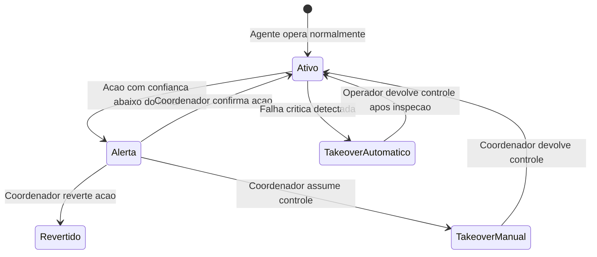

# 🔧 Regras de Negócio — Módulos Administração e Configuração

## Módulo Admin — Repasse Seguro

| **Campo** | **Valor** |
|---|---|
| **Destinatário** | Equipe de Produto e Engenharia |
| **Escopo** | Financeiro (gestão) · Supervisão de IA · Relatórios · Configurações globais |
| **Módulo** | Admin |
| **Parte** | Parte 4 de 5 — Módulos Administração e Configuração |
| **Versão** | v1.2 |
| **Responsável** | Claude Code Desktop |
| **Data da versão** | 2026-03-22 (America/Fortaleza) |
| **Continuidade** | RN-086 (Parte 01.3) |
| **Origem do arquivo de entrada** | 01 - Regras de Negócio.md |

---

> 📌 **TL;DR**
>
> Este arquivo cobre os módulos usados para configurar, monitorar ou administrar o sistema: o Financeiro (gestão da Conta Escrow, distribuição, inadimplência, conciliação), a Supervisão de IA (logs, alertas, takeover dos agentes Guardião do Retorno e Analista de Oportunidades), os Relatórios (SLA, Volume, Receita, Conversão, Auditoria, Agentes IA) e as Configurações globais (parâmetros de comissão, prazos, integrações, templates). A numeração de RNs neste arquivo vai de **RN-087 a RN-120** (v1.0) e **RN-149** (correção v1.1).

---

## 🎯 Contexto dos Módulos de Administração

Estes módulos permitem que o Repasse Seguro gerencie a operação, monitore a automação de IA e ajuste os parâmetros do sistema sem precisar de alterações de código.

**Critério de classificação:** Remover qualquer módulo desta parte quebra a capacidade de monitorar, configurar ou auditar o sistema — o faturamento não para imediatamente, mas a gestão e a conformidade ficam comprometidas.

**Módulos cobertos nesta parte:**
- **Financeiro (gestão)** — monitoramento de escrow, distribuição, estorno, inadimplência e conciliação bancária
- **Supervisão IA** — controle humano sobre os agentes de IA
- **Relatórios** — métricas operacionais e financeiras
- **Configurações** — parâmetros globais da plataforma

---

## 1. Módulo: Financeiro (Gestão)

### 1.1 Visão Geral do Módulo

🎯 **Objetivo:** Centralizar toda a gestão financeira da plataforma: monitorar depósitos na Conta Escrow, acompanhar distribuições, visualizar comissões do RS, processar estornos, identificar inadimplência e garantir conciliação bancária.

**Atores envolvidos:** Gestor Financeiro (ações principais), Coordenador (somente leitura + prorrogação), Master (aprova bloqueios)

**Objeto principal:** Conta Escrow do Caso

**Estados possíveis da Conta Escrow:** Aberta, Depósito Confirmado, Em Distribuição, Distribuída, Congelada, Bloqueada (aguardando aprovação), Estornada

**Operações principais:** Monitorar, Bloquear distribuição, Liberar distribuição, Iniciar estorno, Conciliar, Exportar relatório

### 1.2 Regras de Negócio

---

**RN-087: Monitoramento de Contas Escrow em tempo real**

> Origem: FIN-01, Seção 4.6 — Funcionalidade 1 (arquivo de entrada)

1. O Gestor Financeiro acessa o menu "Financeiro > Aba Contas Escrow".
2. O sistema exibe a lista de todas as Contas Escrow com status atualizado em tempo real.
3. Filtros disponíveis: por status, por faixa de valor e por data prevista de distribuição.
4. Ao clicar em uma conta, o sistema abre painel lateral com: dados do caso, valor esperado, valor depositado, data do depósito, data prevista de distribuição, breakdown da distribuição (Cedente e RS) e histórico completo de movimentações.
5. **Contas com depósito pendente** recebem destaque visual com label textual "Prazo próximo" (amarelo) ou "Prazo estourado" (vermelho), acompanhado de tooltip com os dias restantes ou dias em atraso.
6. **Consequência se violada:** Sem monitoramento em tempo real, o Gestor Financeiro não identifica depósitos pendentes a tempo de agir antes do cancelamento automático.

**Interface do painel financeiro:** [CORRIGIDO: PROBLEMA-035]
- Tabela com colunas: ID do caso, Status da Conta Escrow, Valor Esperado, Valor Depositado, Data do Depósito, Data Prevista de Distribuição, Ações.
- Filtros de status exibidos como chips clicáveis acima da tabela (ex: Aberta, Depósito Confirmado, Em Distribuição, etc.). Filtro ativo = chip preenchido.
- Painel lateral (drawer) ao clicar em uma conta: exibe breakdown detalhado da distribuição com visualização de barras empilhadas mostrando a proporção Cedente vs. RS.
- Cores de destaque nos labels de status: verde (Confirmado/Distribuído), amarelo (Prazo próximo), vermelho (Estourado/Congelado), cinza (Aberta).

---

**RN-088: Bloqueio de distribuição com aprovação do Master**

> Origem: FIN-03, Seção 4.6 — Funcionalidade 2 (arquivo de entrada)

1. O Gestor Financeiro identifica irregularidade em uma Conta Escrow prestes a ser distribuída.
2. O Gestor clica em "Bloquear Distribuição" e informa a justificativa obrigatória (mínimo 20 caracteres).
3. O sistema muda o status da Conta Escrow para "Bloqueada" e envia solicitação de aprovação ao Master.
4. **Se o Master aprova em até 24 horas:** a distribuição permanece suspensa até que o Gestor resolva a irregularidade e libere manualmente.
5. **Se o Master não aprova em até 24 horas:** o sistema retoma a distribuição automaticamente. O status da conta volta para "Em Distribuição".
6. **Congelamento em mediação (FIN-05):** quando a Conta Escrow está congelada por mediação ativa (conforme RN-038), nenhuma movimentação é possível até o desfecho. O Gestor não pode forçar distribuição ou estorno durante a mediação.
7. **Consequência se violada:** Distribuição sem revisão pode enviar valores incorretos, gerando disputa financeira irreversível.

**Mensagens ao usuário:**
- Bloqueio enviado para aprovação (ao Gestor): "Distribuição bloqueada. Solicitação de aprovação enviada ao Master."
- Prazo de aprovação expirado (ao Gestor): "O prazo de aprovação expirou. A distribuição será retomada automaticamente."

**RN-088.a: Escalonamento de aprovação de bloqueio**

> Origem: Decisão autônoma — gap identificado em auditoria cross-doc (2026-03-22)

1. Ao solicitar bloqueio de distribuição, o sistema envia notificação imediata ao Master por e-mail e push (painel Admin).
2. **Após 8 horas sem resposta do Master:** o sistema reenvia a notificação com marcação de urgência: "Distribuição será liberada automaticamente em [X] horas se não houver aprovação."
3. **Após 16 horas sem resposta:** o sistema notifica todos os Masters ativos cadastrados na plataforma (pode haver mais de um Master). Se nenhum Master estiver ativo, notifica o e-mail de emergência configurado em Configurações → Segurança.
4. **Se o e-mail de emergência não estiver configurado** e o prazo de 24h expirar: a distribuição retoma normalmente, mas o sistema gera incidente automático no log de auditoria com severidade alta: "Bloqueio de distribuição expirou sem aprovação — Master não respondeu."
5. **Ação obrigatória pós-incidente:** o Master deve registrar no sistema a justificativa da não-resposta em até 2 dias úteis. Incidentes não justificados são consolidados no Relatório de Auditoria mensal.

---

**RN-089: Processamento de estorno**

> Origem: Regra 09, Seção 4.6 — Funcionalidade 3 (arquivo de entrada)

1. O Gestor Financeiro clica em "Iniciar Reversão" para um caso que solicitou desistência.
2. O sistema exibe modal de confirmação com resumo: valor depositado e partes envolvidas.
3. **Ao confirmar:** o sistema congela a Conta Escrow imediatamente e inicia o fluxo de reversão.
4. **Estorno sempre total (FIN-04):** estornos são sempre do valor integral depositado pelo Cessionário. Não existe estorno parcial.
5. Comprovante de estorno é gerado automaticamente e salvo no dossiê.
6. **Consequência se violada:** Estorno parcial deixa valor retido na Conta Escrow sem destinatário definido, gerando problema contábil e legal.

---

**RN-090: Painel de inadimplência**

> Origem: FIN-05, Seção 4.6 — Funcionalidade 4 (arquivo de entrada)

1. O Gestor Financeiro acessa o menu "Financeiro > Aba Inadimplência".
2. O sistema exibe a lista de casos com depósito pendente, mostrando: dias desde o envio das instruções, prazo restante e número de prorrogações concedidas.
3. **Alertas visuais com label textual:**
   - "Prazo próximo" (amarelo) quando restam 3 ou menos dias úteis.
   - "Prazo estourado" (vermelho) quando o prazo foi superado.
4. **Ações disponíveis por perfil:**
   - Gestor Financeiro: "Enviar Lembrete", "Marcar para Cancelamento".
   - Coordenador: "Conceder Prorrogação" (uma única vez, +5 dias úteis).
5. **Consequência se violada:** Sem painel de inadimplência, depósitos em atraso passam despercebidos e casos são cancelados sem que o Coordenador tenha tido a chance de conceder prorrogação.

---

**RN-091: Conciliação bancária**

> Origem: Seção 4.6 — Funcionalidade 6, FIN-08 (arquivo de entrada)

1. O Gestor Financeiro registra a confirmação do parceiro financeiro para cada movimentação (depósito ou distribuição).
2. O sistema compara o valor confirmado pelo parceiro com o valor registrado na plataforma.
3. **Se os valores conferem (diferença ≤ R$ 0,50):** a movimentação recebe badge "Conciliado" com label textual verde.
4. **Se os valores divergem (diferença > R$ 0,50):** a movimentação recebe badge "Divergência detectada" com label textual vermelho, exibindo: valor esperado, valor confirmado pelo parceiro e a diferença. A movimentação fica com status "Em conciliação" até resolução.
5. O Gestor deve investigar e registrar justificativa antes de fechar a divergência.
6. **Consequência se violada:** Divergências não identificadas geram prejuízo para o RS ou para as partes sem que ninguém perceba.

---

**RN-092: Relatório financeiro mensal automático**

> Origem: Seção 4.6 — Funcionalidade 5, REL-03 (arquivo de entrada)

1. No 1º dia útil de cada mês, o sistema gera automaticamente o relatório financeiro do mês anterior.
2. O relatório contém: receita total (comissões distribuídas), volume de transações, ticket médio, taxa de reversão e projeção de receita baseada no pipeline atual.
3. O relatório é enviado automaticamente por e-mail ao Gestor Financeiro e ao Master.
4. O relatório também é exportável em PDF e CSV a qualquer momento a partir do menu "Relatórios".
5. **Consequência se violada:** Sem relatório mensal automático, o controle financeiro depende de ação manual que pode ser esquecida.

---

## 2. Módulo: Supervisão IA

### 2.1 Visão Geral do Módulo

🎯 **Objetivo:** Permitir que o Coordenador e o Master monitorem em tempo real a atividade dos agentes de IA, revisem decisões automatizadas, identifiquem anomalias e intervenham (takeover) quando necessário. Este módulo é o painel de controle humano sobre a automação inteligente.

**Atores envolvidos:** Coordenador (revisão diária obrigatória, takeover), Master (aprovação de escalações, ajuste de limiares)

**Agentes supervisionados:**
- **Guardião do Retorno:** valida e protege os cenários de retorno do Cedente.
- **Analista de Oportunidades:** identifica e qualifica oportunidades de match entre ofertas ativas e Cessionários.

**Objeto principal:** Ação de agente de IA

**Estados possíveis do agente por caso:**

**Operações principais:** Monitorar, Revisar alerta, Confirmar ação, Reverter ação, Assumir controle (takeover), Devolver controle, Exportar logs

### 2.2 Regras de Negócio

---

**RN-093: Monitoramento passivo contínuo de agentes**

> Origem: Regra 18 — Camada 1 (arquivo de entrada)

1. O Coordenador ou Master acessa o menu "Supervisão IA".
2. O sistema exibe o dashboard de métricas por agente: ações nas últimas 24h, taxa de acerto, alertas de baixa confiança e takeovers ativos.
3. Cada ação de agente é registrada no log com: caso vinculado, tipo de ação, dados de entrada, resultado e nível de confiança (%).
4. **Indicadores de confiança com label textual:**
   - ≥ 80%: badge verde com label "Alta"
   - 60% a 79%: badge amarelo com label "Média"
   - < 60%: badge vermelho com label "Baixa"
5. O log atualiza automaticamente em até **10 segundos** após cada ação do agente.
6. **Consequência se violada:** O Coordenador não detecta padrões problemáticos nos agentes, como queda progressiva de confiança que antecipa falha crítica.

---

**RN-094: Alertas de baixa confiança e ações do Coordenador**

> Origem: Regra 18 — Camada 2 (arquivo de entrada)

1. Um agente executa uma ação com nível de confiança abaixo do limiar configurado (padrão: 80%).
2. O sistema gera alerta automático para o Coordenador: badge vermelho na aba "Alertas" e ícone no menu "Supervisão IA" na sidebar.
3. O Coordenador abre o alerta e visualiza: ação executada, confiança obtida vs. limiar, dados de entrada e resultado.
4. O Coordenador escolhe uma das três ações:
   - **(a) Confirmar:** a ação é mantida como está. Alerta resolvido.
   - **(b) Reverter:** a ação é desfeita. O Analista responsável pelo caso recebe tarefa manual para executar a ação.
   - **(c) Takeover:** o agente é pausado para o caso específico (conforme RN-095).
5. **Cada ação sobre o alerta exige justificativa escrita** e gera registro de auditoria imutável.
6. **Consequência se violada:** Sem revisão dos alertas, o agente continua executando ações incorretas que afetam o fluxo operacional dos casos.

---

**RN-095: Takeover manual e automático**

> Origem: Regra 18 — Camada 3, SIA-03, SIA-04 (arquivo de entrada)

1. O Coordenador ou Master decide intervir em um agente para um caso específico.

**Takeover manual:**
1. O operador clica em "Assumir Controle" no painel do agente.
2. O sistema exibe modal de confirmação com aviso: "O agente será pausado e todas as ações pendentes ficarão sob sua responsabilidade."
3. Após confirmação, o agente é pausado **apenas para aquele caso específico**. O agente continua operando normalmente nos demais casos.
4. Todas as ações que seriam do agente passam a ser manuais no painel do operador até que o takeover seja encerrado.

**Takeover automático (falha crítica):**
1. O sistema detecta falha crítica no agente (conforme RN-096).
2. O agente é pausado automaticamente e imediatamente para o caso afetado.
3. O sistema gera alerta crítico com notificação imediata para Coordenador e Master.
4. **Após takeover automático, o agente não pode se reativar sozinho (SIA-04).** Apenas um operador pode devolver o controle após inspeção.

**Encerrar takeover:**
1. O operador clica em "Devolver Controle".
2. O sistema exibe modal de confirmação.
3. Após confirmação, o agente retoma a operação autônoma para aquele caso.
4. O takeover é registrado com: data, nome de quem assumiu, motivo, duração e ações manuais realizadas.

**Limite de takeovers simultâneos (SIA-03):**
- Um operador pode manter até **5 takeovers simultâneos**.
- Se atingir o limite e ocorrer uma nova falha crítica: o caso é escalado automaticamente ao Master (ou ao próximo Coordenador disponível) em vez de ser bloqueado.

**Consequência se violada:** Sem takeover, agentes com falha crítica continuam tentando executar ações, gerando loops e estados inconsistentes nos casos.

**Mensagens ao usuário:**
- Takeover assumido: "Controle assumido. O agente [nome] foi pausado para o caso [ID]."
- Controle devolvido: "Controle devolvido. O agente [nome] retomou a operação para o caso [ID]."
- Limite de takeovers atingido: "Você já tem 5 takeovers ativos. Devolva o controle de um caso antes de assumir outro."

---

**RN-095.a: Thresholds de confiança e regras de takeover dos agentes de IA**

> Origem: Decisão autônoma — gap identificado em auditoria cross-doc (2026-03-22)

🎯 **Objetivo:** Definir o nível de autonomia de cada agente de IA e os gatilhos que obrigam intervenção humana, garantindo que a automação não execute ações críticas sem supervisão adequada.

---

**Guardião do Retorno**

| Nível de confiança | Faixa | Ação do agente | Ação humana requerida |
|---|---|---|---|
| Alto | ≥ 90% | Age autonomamente | Apenas registro no log |
| Médio | 70–89% | Age + notifica Analista | Analista confirma em até 4h ou reverte |
| Baixo | 50–69% | Sugere + aguarda | Analista decide manualmente |
| Indeterminado | < 50% | Não age | Analista decide integralmente |

**Situações em que o Guardião NUNCA age autonomamente (takeover obrigatório):**
- Escalonamento de cenário (descida de D→C, C→B ou B→A): sempre requer confirmação explícita do Cedente e registro pelo Analista.
- Bloqueio de caso por adimplência: sempre requer confirmação do Analista.
- Qualquer ação que altere valores financeiros calculados.

---

**Analista de Oportunidades**

| Nível de confiança | Faixa | Ação do agente | Ação humana requerida |
|---|---|---|---|
| Alto | ≥ 85% | Envia sugestão de match ao Analista | Analista aprova ou descarta |
| Médio | 60–84% | Registra oportunidade como "Em análise" | Analista avalia no prazo de 24h |
| Baixo | < 60% | Registra no log sem notificar | Sem ação humana requerida |

**Situações em que o Analista de Oportunidades NUNCA contata diretamente um Cessionário:**
- O agente nunca envia comunicação direta ao Cessionário sem aprovação prévia do Analista humano.
- O agente nunca confirma aceite de proposta. Apenas sugere; o aceite é sempre do Analista ou do Cedente.

---

**Configuração dos thresholds:**
- Os thresholds de confiança são configuráveis pelo Master em Configurações → IA → "Thresholds de autonomia".
- Alterações nos thresholds entram em vigor imediatamente e são registradas no log de auditoria com o nome do Master e timestamp.
- O intervalo permitido de configuração: mínimo 50%, máximo 95% (para o threshold "Alto"). O sistema impede configuração abaixo de 50% para evitar que o agente aja com confiança insuficiente.

**Alerta de degradação de performance:**
- Se um agente tiver taxa de reversão humana superior a 30% em 7 dias corridos, o sistema notifica o Master: "O [agente] teve [X]% de suas ações revertidas nos últimos 7 dias. Considere revisar os thresholds ou acionar suporte técnico."

**Consequência se violada:** Agentes sem threshold definido podem agir em casos críticos com baixa confiança, gerando erros financeiros ou de comunicação difíceis de rastrear e reverter.

**Interface de Supervisão IA:** [CORRIGIDO: PROBLEMA-036]
- Dashboard dividido em 2 áreas: (1) métricas resumidas no topo (cards com ações 24h, confiança média, alertas pendentes, takeovers ativos); (2) log de ações abaixo em tabela com scroll.
- Cada ação no log exibe: timestamp, agente (Guardião/Analista de Oportunidades), caso, tipo de ação, confiança (com badge colorido), resultado.
- Aba "Alertas" com badge numérico (quantidade de alertas pendentes) separada da aba "Log".
- Cada alerta exibe 3 botões de ação lado a lado: "Confirmar" (verde), "Reverter" (amarelo), "Takeover" (vermelho).
- Indicador de takeover ativo: badge persistente na barra superior da plataforma informando "X takeover(s) ativo(s)" com link direto para o painel.

**Modal de takeover:** [CORRIGIDO: PROBLEMA-037]
- Modal de confirmação exibe: nome do agente, caso afetado, última ação executada, motivo sugerido.
- Campo de justificativa obrigatório.
- Após confirmação: o card do caso no log muda de cor para indicar "Controle manual ativo" (borda laranja).
- Contador de takeovers ativos visível no canto do painel: "X/5 takeovers em uso."

---

**RN-096: Definição de falha crítica — 6 eventos gatilho**

> Origem: SIA-06 (arquivo de entrada)

Um agente entra em **falha crítica** e sofre takeover automático imediato quando qualquer um dos seguintes eventos é detectado:

1. **Loop detectado:** o agente executou a mesma ação 3 ou mais vezes consecutivas no mesmo caso em menos de 60 segundos.
2. **Timeout de ação:** o agente não respondeu dentro do tempo configurado (padrão: 30 segundos, configurável em "Configurações > Agentes de IA").
3. **Erro de sistema:** a API do agente retornou erro de sistema (falha interna não tratada).
4. **Dados corrompidos:** o agente gerou resultado com campos obrigatórios vazios ou valores fora do domínio esperado (exemplo: valor de comissão negativo, percentual de confiança negativo ou acima de 100%).
5. **Conflito de versão:** o agente tentou atuar sobre um caso cujo estado foi alterado por outro processo entre o momento da leitura e o momento da escrita.
6. **Violação de regra de negócio:** o agente executou ação que contradiz uma regra explícita (exemplo: aprovar proposta abaixo do valor mínimo do cenário).

Para cada falha crítica, o sistema registra: tipo do evento, timestamp, dados de contexto (caso, ação tentada, estado do caso no momento). O agente é pausado imediatamente para o caso afetado.

---

**RN-097: Revisão diária obrigatória e cadeia de escalação**

> Origem: SIA-01 (arquivo de entrada)

1. O sistema registra o último acesso de cada Coordenador à tela de Supervisão IA.
2. **Após 24 horas sem acesso:** o sistema gera alerta ao Master: "Coordenador [nome] não acessou Supervisão IA nas últimas 24h. [X] alertas pendentes."
3. **Após 48 horas sem acesso:** o Master recebe notificação de prioridade crítica. Todos os alertas pendentes do período são escalados automaticamente ao Master.
4. **Após 72 horas sem acesso:** o sistema registra incidente de governança no log de auditoria. O Master deve tomar ação sobre o Coordenador (reatribuição ou suspensão temporária das responsabilidades de IA).
5. **A cadeia de escalação é individual por Coordenador.** Se houver múltiplos Coordenadores, cada um é monitorado de forma independente.
6. **Consequência se violada:** Alertas de agentes de IA acumulam sem revisão, podendo causar ações incorretas em múltiplos casos durante dias.

---

**RN-098: Escalação automática de alertas não resolvidos**

> Origem: SIA-02 (arquivo de entrada)

1. Um alerta de baixa confiança é gerado para o Coordenador.
2. O sistema monitora o tempo desde a geração do alerta.
3. **Após 48 horas sem resolução:** o alerta é automaticamente escalado ao Master com prioridade crítica.
4. O Master vê o alerta com badge "Escalado automaticamente" e pode executar as mesmas ações do Coordenador (Confirmar, Reverter ou Takeover).
5. **Consequência se violada:** Alertas críticos ficam pendentes indefinidamente sem responsável, comprometendo a supervisão da IA.

---

**RN-099: Modo "Supervisão Total" — confirmação obrigatória de ações**

> Origem: SIA-07 (arquivo de entrada)

1. O Master ativa o modo "Supervisão Total" nas Configurações.
2. Neste modo, **todas as ações de ambos os agentes ficam em fila aguardando confirmação humana** antes de serem executadas.
3. **Sequência de escalação por timeout:**
   - **Após 4 horas sem confirmação:** o sistema alerta o Coordenador: "Ação do agente [nome] aguarda confirmação há 4h. Caso [ID]."
   - **Após 8 horas sem confirmação:** o alerta é escalado ao Master com prioridade alta.
   - **Após 12 horas sem confirmação:** a ação é automaticamente descartada (não executada). O caso recebe flag "Ação pendente manual" e o Analista responsável é notificado para executar a ação manualmente. O evento é registrado como "Timeout de supervisão" no log de auditoria.
4. **Recomendação:** o modo de Supervisão Total é indicado nos primeiros 30 dias de operação, enquanto os agentes estão sendo calibrados.
5. **Consequência se violada:** No modo Supervisão Total, ações não confirmadas dentro de 12 horas são descartadas e precisam ser refeitas manualmente, gerando atraso operacional.

---

**RN-100: Histórico de calibração do limiar de confiança**

> Origem: SIA-05 (arquivo de entrada)

1. O Master altera o limiar de confiança de um agente nas Configurações.
2. O sistema registra na tela de Supervisão IA o histórico de calibrações com: valor anterior, novo valor, data/hora, Master responsável e justificativa.
3. O histórico é imutável e visível para Coordenador e Master.
4. **Limiar configurável:** intervalo de 50% a 95%. O padrão inicial é 80%.
5. **Recomendação:** revisar mensalmente com base na taxa de falsos positivos (alertas desnecessários) e falsos negativos (erros não detectados).
6. **Consequência se violada:** Sem histórico, é impossível identificar se uma mudança de limiar causou aumento de alertas ou de erros.

---

## 3. Módulo: Relatórios

### 3.1 Visão Geral do Módulo

🎯 **Objetivo:** Fornecer visão analítica completa da operação para suportar decisões estratégicas: desempenho de SLA, volume de casos, receita gerada, taxas de conversão e trilha de auditoria completa.

**Atores envolvidos:** Coordenador (SLA, Volume, Conversão, Agentes IA), Gestor Financeiro (Receita, Auditoria), Master (todos os relatórios)

**Objeto principal:** Dados agregados da operação

**Operações principais:** Visualizar, Filtrar, Exportar (CSV e PDF), Agendar envio automático

### 3.2 Regras de Negócio

---

**RN-101: Relatório de SLA**

> Origem: Seção 4.9 — Funcionalidade 1, REL-01 (arquivo de entrada)

1. O operador acessa o menu "Relatórios > Aba SLA".
2. O sistema exibe tabela com cada transição de status: SLA alvo, SLA máximo, tempo médio real, % dentro do SLA e % estourado.
3. Gráfico de tendência mostra a evolução do % de SLA cumprido ao longo do tempo.
4. Ranking de Analistas por desempenho (tempo médio de resolução por etapa).
5. Ao clicar em uma etapa com estouro, o sistema exibe os casos específicos com link direto para cada um.
6. **Os dados são atualizados com atraso máximo de 15 minutos** (não são batch noturno).
7. **Período máximo de consulta:** até 24 meses de histórico.
8. **Consequência se violada:** Sem dados de SLA, o Coordenador não identifica gargalos sistêmicos e não pode tomar ação preventiva.

---

**RN-102: Relatório de Volume**

> Origem: Seção 4.9 — Funcionalidade 2 (arquivo de entrada)

1. O operador acessa "Relatórios > Aba Volume".
2. O sistema exibe:
   - Distribuição de casos por status no período selecionado (gráfico de barras).
   - Distribuição de casos por cenário (A, B, C, D) com percentuais.
   - Evolução temporal: casos captados, fechados e cancelados por semana ou mês.
   - Comparação de períodos: mês atual vs. anterior, trimestre atual vs. anterior.
3. **Consequência se violada:** Sem dados de volume, o Master não consegue identificar sazonalidade ou avaliar o crescimento do pipeline.

---

**RN-103: Relatório de Receita**

> Origem: Seção 4.9 — Funcionalidade 3 (arquivo de entrada)

1. O operador com permissão acessa "Relatórios > Aba Receita".
2. O sistema exibe:
   - Receita realizada: comissões efetivamente distribuídas pela Conta Escrow no período.
   - Receita em pipeline: comissões estimadas de casos em "Pós Fechamento" (aguardando 15 dias).
   - Receita projetada: estimativa baseada em casos em Formalização e Negociação (usando taxa de conversão histórica).
   - Breakdown por cenário: receita por cenário (A, B, C, D).
   - Ticket médio: comissão média por caso fechado.
   - Receita perdida: total de comissões que seriam geradas por casos cancelados ou revertidos.
3. **Acesso restrito:** apenas Gestor Financeiro e Master têm acesso a esta aba. Coordenador não vê dados de receita detalhados.
4. **Consequência se violada:** Exposição de dados financeiros ao Coordenador sem necessidade operacional viola o princípio de acesso mínimo necessário.

---

**RN-104: Relatório de Conversão (Funil)**

> Origem: Seção 4.9 — Funcionalidade 4 (arquivo de entrada)

1. O operador acessa "Relatórios > Aba Conversão".
2. O sistema exibe funil visual: Captado → Qualificado → Oferta Ativa → Em Negociação → Em Formalização → Fechamento → Concluído.
3. Cada etapa mostra: quantidade absoluta, % de conversão da etapa anterior e % de perda.
4. O sistema identifica automaticamente os pontos de maior perda.
5. Tempo médio de cada etapa do funil.
6. **Consequência se violada:** Sem dados de conversão, o Master não sabe onde estão os maiores desperdícios no funil.

---

**RN-105: Trilha de auditoria imutável nos Relatórios**

> Origem: Regra 14, REL-04 (arquivo de entrada)

1. O operador acessa "Relatórios > Aba Auditoria".
2. O sistema exibe tabela com todos os registros de auditoria: ID do caso, status anterior, novo status, data/hora, usuário responsável e motivo.
3. Filtros disponíveis: por caso, por usuário, por tipo de transição, por data.
4. **Os registros são imutáveis.** Nenhum perfil pode editar, excluir ou filtrar para ocultar registros.
5. Exportável em CSV para auditoria externa.
6. **Consequência se violada:** Registros mutáveis inviabilizam qualquer auditoria interna ou externa.

---

**RN-106: Relatório de Agentes IA**

> Origem: Seção 4.9 — Funcionalidade 6 (arquivo de entrada)

1. O operador acessa "Relatórios > Aba Agentes IA".
2. O sistema exibe resumo mensal: ações totais, confiança média, alertas gerados, takeovers, taxa de acerto.
3. Comparação mês a mês para avaliar evolução dos agentes.
4. **Alerta de calibração automático:** se a taxa de alertas exceder 15% das ações no período, o sistema exibe recomendação automática ao Master para revisar o limiar ou os parâmetros do agente.
5. **Consequência se violada:** O Master não tem dados para decidir se os agentes precisam de recalibração.

---

**RN-107: Permissões de acesso por aba de Relatórios**

> Origem: REL-05 (arquivo de entrada)

| **Perfil** | **Pode ver** | **Não pode ver** |
|---|---|---|
| Analista | Sem acesso a esta tela. | Tudo. |
| Coordenador | Abas SLA, Volume, Conversão e Agentes IA. | Aba Receita. |
| Gestor Financeiro | Abas Receita e Auditoria. | Abas SLA, Volume, Conversão e Agentes IA. |
| Master | Todas as abas. Pode agendar envio automático. | — |

---

**RN-108: Exportação universal e agendamento**

> Origem: Seção 4.9 — Funcionalidade 7 (arquivo de entrada)

1. O operador clica em "Exportar" em qualquer aba de Relatórios.
2. O sistema gera o arquivo no formato selecionado (CSV ou PDF).
3. **PDFs incluem gráficos renderizados**, adequados para apresentações.
4. **CSVs incluem dados brutos**, adequados para análise em planilhas.
5. Ao clicar em "Exportar", o botão muda para estado de processamento. Ao concluir, exibe toast com link de download.
6. **Agendamento de envio automático (apenas Master):** o Master pode agendar envio por e-mail de qualquer relatório com frequência diária, semanal ou mensal para destinatários configurados.
7. **Consequência se violada:** Sem exportação funcional, dados de auditoria não podem ser entregues a auditores externos.

**Interface de Relatórios — estados e feedback:** [CORRIGIDO: PROBLEMA-038]
- Cada aba de relatório exibe: filtros no topo (período, perfil, cenário), área de gráficos ao centro, tabela de dados detalhados abaixo.
- Estado de carregamento: skeleton placeholders nos gráficos e tabelas enquanto os dados carregam.
- Estado vazio: se não há dados para o período selecionado, exibir: ícone de gráfico vazio + "Sem dados para o período selecionado. Ajuste os filtros para visualizar resultados."
- Exportação: botão "Exportar" com dropdown para selecionar formato (CSV ou PDF). Ao clicar, o botão muda para spinner + "Gerando...". Ao concluir, toast com link de download. Se falhar, toast de erro com botão "Tentar novamente".
- [DECISÃO APLICADA: DEC-011] O download de exportações é feito via link temporário (expira em 1 hora) em vez de download direto. Justificativa: exportações grandes podem demorar e o operador pode navegar para outra tela enquanto o arquivo é gerado.

**Acessibilidade dos gráficos:** [CORRIGIDO: PROBLEMA-039]
- Todos os gráficos possuem tabela alternativa acessível por leitores de tela (aria-label com descrição dos dados).
- Cores dos gráficos seguem paleta com contraste mínimo de 4.5:1 conforme WCAG 2.1 AA.
- Tooltips nos gráficos são acessíveis via teclado (Tab navega entre pontos de dados).

---

**RN-149: Período máximo de consulta nos Relatórios — 24 meses de histórico**

> Origem: REL-02 (arquivo de entrada)

1. O operador acessa qualquer aba de Relatórios e seleciona um período de consulta.
2. O sistema verifica se o intervalo selecionado está dentro do limite de 24 meses contados a partir da data atual.
3. **Se o período está dentro dos 24 meses:** os dados são carregados e exibidos normalmente.
4. **Se o operador seleciona um período anterior a 24 meses:** o seletor limita automaticamente a data inicial ao limite de 24 meses disponíveis e exibe aviso informativo ao operador.
5. **Se o operador precisa de dados anteriores a 24 meses:** o operador deve solicitar a exportação sob demanda ao Master, que acessa os dados históricos arquivados fora do período padrão de consulta.
6. **Consequência se violada:** Permitir consultas ilimitadas no histórico sem controle pode sobrecarregar o sistema com queries de anos de dados, impactando o desempenho de toda a plataforma.

**Mensagens ao usuário:**
- Período ajustado automaticamente: "O período máximo de consulta é de 24 meses. A data inicial foi ajustada para [data]. Para dados anteriores, solicite exportação ao Master."

---

## 4. Módulo: Configurações

### 4.1 Visão Geral do Módulo

🎯 **Objetivo:** Permitir que o Master configure todos os parâmetros operacionais da plataforma sem necessidade de alteração de código. É a tela mais restrita do sistema.

**Atores envolvidos:** Master (único com acesso)

**Objeto principal:** Parâmetro de configuração

**Seções disponíveis:** Comissões · Prazos e SLAs · Conta Escrow · ZapSign · Agentes de IA · Notificações · Perfis e Acessos · Templates · Sistema

**Operações principais:** Visualizar, Alterar, Confirmar (dupla confirmação), Reverter (rollback), Auditar histórico

### 4.2 Regras de Negócio

---

**RN-109: Acesso exclusivo do Master às Configurações**

> Origem: CONF-01 (arquivo de entrada)

1. Qualquer operador (Analista, Coordenador ou Gestor Financeiro) tenta acessar o menu "Configurações".
2. O sistema verifica o perfil do operador.
3. **Se o perfil não é Master:** o sistema bloqueia o acesso e exibe mensagem.
4. **Se o perfil é Master:** o sistema exibe a tela de Configurações com todas as seções.
5. **Consequência se violada:** Parâmetros críticos como percentual de comissão e prazo de reversão podem ser alterados por operadores sem autorização, comprometendo toda a operação.

**Mensagens ao usuário:**
- Acesso negado (a qualquer não-Master): "Você não tem permissão para acessar as Configurações. Esta área é restrita ao Master."

**Interface de Configurações:** [CORRIGIDO: PROBLEMA-040]
- Layout: menu lateral com seções (Comissões, Prazos, Conta Escrow, ZapSign, Agentes IA, Notificações, Perfis, Templates, Sistema). Área de conteúdo à direita.
- Cada parâmetro exibe: label descritivo, valor atual, campo editável, valor padrão (em texto menor abaixo do campo) e botão "Reverter ao padrão".
- Parâmetros com confirmação dupla (RN-112) exibem ícone de cadeado ao lado do label, com tooltip: "Alteração requer confirmação dupla."
- Histórico de alterações: link "Ver histórico" ao lado de cada parâmetro abre painel com registros de auditoria específicos daquele parâmetro.

**Feedback de confirmação dupla:** [CORRIGIDO: PROBLEMA-041]
- Ao salvar parâmetro crítico: primeiro modal mostra resumo da alteração. Segundo modal exige clicar "Confirmo a alteração" com checkbox "Li e entendo o impacto nos novos casos."
- Se o Master cancela no segundo modal, nenhuma alteração é aplicada.
- Toast de confirmação: "Parâmetro [nome] atualizado de [valor anterior] para [novo valor]. Afeta apenas novos casos."

**Estado de manutenção (RN-119):** [CORRIGIDO: PROBLEMA-042]
- Ao ativar modo manutenção: modal de confirmação exibe "Ativar modo manutenção encerrará todas as sessões de outros operadores. Confirma?".
- Durante manutenção: banner vermelho fixo no topo da tela do Master: "Modo manutenção ativo. Apenas Masters têm acesso."
- Usuários não-Master veem tela de manutenção com: ícone de ferramenta, "Estamos em manutenção programada. Tente novamente em alguns minutos." e timer estimado (se configurado pelo Master).

---

**RN-110: Registro obrigatório de auditoria para toda alteração**

> Origem: CONF-02 (arquivo de entrada)

1. O Master altera qualquer parâmetro nas Configurações.
2. O sistema exige justificativa escrita antes de salvar.
3. **Após a confirmação:** o sistema registra imutavelmente: parâmetro alterado, valor anterior, novo valor, data/hora, Master responsável e justificativa.
4. O histórico de alterações é visível na mesma tela de cada seção.
5. **Consequência se violada:** Sem auditoria de configurações, é impossível investigar por que um parâmetro crítico foi alterado e quem foi o responsável.

---

**RN-111: Alterações afetam apenas novos casos ou novos eventos**

> Origem: CONF-03 (arquivo de entrada)

1. O Master altera um parâmetro (percentual de comissão, prazo de reversão, SLA, limiar de IA etc.).
2. **A alteração afeta apenas casos criados ou eventos gerados após a data da alteração.**
3. Casos em andamento no momento da alteração **mantêm os parâmetros vigentes no momento de sua criação** (snapshot de configuração).
4. **Implementação obrigatória:** a engenharia deve manter versionamento de parâmetros — cada caso armazena cópia dos parâmetros vigentes no momento de sua criação.
5. **Consequência se violada:** Casos em andamento podem ter comissões recalculadas com percentuais diferentes do acordado com as partes, gerando conflito contratual.

---

**RN-112: Confirmação dupla para alterações críticas**

> Origem: CONF-04 (arquivo de entrada)

Os seguintes parâmetros exigem **confirmação dupla** antes de serem salvos (o sistema exibe resumo da alteração e solicita uma segunda confirmação explícita do Master):

1. Percentual de comissão (Cedente ou Cessionário)
2. Prazo de reversão (período de retenção da Conta Escrow)
3. Modo de distribuição escrow (automático vs. manual)

**Fluxo:**
1. O Master altera o parâmetro e clica em "Salvar".
2. O sistema exibe modal de confirmação: "Você está prestes a alterar [parâmetro] de [valor anterior] para [novo valor]. Esta alteração afeta apenas novos casos. Confirmar?"
3. O Master confirma uma segunda vez. Só então o parâmetro é salvo.
4. **Consequência se violada:** Alteração acidental de parâmetros críticos pode gerar prejuízo financeiro em múltiplos casos futuros antes de ser percebida.

---

**RN-113: Rollback de parâmetros numéricos**

> Origem: CONF-05 (arquivo de entrada)

1. O Master identifica que uma alteração recente de parâmetro foi incorreta.
2. O Master clica em "Reverter" ao lado do parâmetro na seção de Configurações.
3. O sistema restaura o valor anterior do parâmetro.
4. O rollback também gera registro de auditoria com: parâmetro, valor revertido, valor anterior restaurado, data/hora e Master responsável.
5. **O rollback aplica-se apenas para parâmetros numéricos** (comissão, prazos, limiares). Alterações de templates e integrações não têm rollback automático.
6. **Consequência se violada:** Sem rollback, corrigir um erro de configuração requer digitação manual do valor anterior, que pode ser lembrado incorretamente.

---

**RN-114: Configuração de comissões**

> Origem: Seção 4.10 — Seção 1 (arquivo de entrada)

1. O Master acessa "Configurações > Comissões".
2. O sistema exibe os parâmetros configuráveis:
   - **Percentual de comissão:** padrão 20%. Intervalo permitido: 5% a 50%.
   - **Exceção Cenário A (Δ = 0):** ativar/desativar a exceção da comissão do Cessionário quando Delta é zero (conforme RN-019). Recomendação: manter ativada para garantir viabilidade comercial.
   - **Piso de comissão:** valor mínimo de comissão por caso (padrão: R$ 0). Se definido, garante receita mínima mesmo em casos de baixo valor.
3. Todas as alterações exigem justificativa e geram auditoria (conforme RN-110).
4. Alterações de percentual exigem confirmação dupla (conforme RN-112).
5. **Consequência se violada:** Percentual incorreto afeta todos os casos futuros, gerando distribuição incorreta pela Conta Escrow.

---

**RN-115: Configuração de prazos e SLAs**

> Origem: Seção 4.10 — Seção 2 (arquivo de entrada)

1. O Master acessa "Configurações > Prazos e SLAs".
2. O sistema exibe tabela editável com todos os SLAs (conforme tabela da RN-059).
3. Parâmetros ajustáveis adicionais:
   - **Prazo de reversão:** padrão 15 dias corridos. Intervalo: 7 a 30 dias. Alteração afeta apenas novos fechamentos. Exige confirmação dupla.
   - **Prazo de depósito escrow:** padrão 10 dias úteis + 5 de prorrogação. Ajustável.
   - **Prazo de escalonamento automático:** padrão 30 dias corridos sem proposta. Ajustável.
   - **Prazo de mediação:** padrão 10 dias úteis. Ajustável.
4. Todas as alterações geram auditoria (conforme RN-110) e afetam apenas eventos futuros (conforme RN-111).

---

**RN-116: Configuração dos agentes de IA**

> Origem: Seção 4.10 — Seção 5 (arquivo de entrada)

1. O Master acessa "Configurações > Agentes de IA".
2. O sistema exibe os parâmetros configuráveis por agente:
   - **Limiar de confiança — Guardião do Retorno:** padrão 80%. Ajustável de 50% a 95%. Alteração exige justificativa.
   - **Limiar de confiança — Analista de Oportunidades:** padrão 80%. Ajustável independentemente do outro agente.
   - **Timeout de ação:** tempo máximo para o agente responder antes de gerar falha crítica. Padrão: 30 segundos.
   - **Escalação automática de alertas:** prazo para escalar alerta não resolvido ao Master. Padrão: 48 horas.
   - **Modo de operação:** "Autônomo" (padrão) ou "Supervisão Total" (todas as ações aguardam confirmação humana, conforme RN-099). Supervisão Total recomendada nos primeiros 30 dias.
3. Toda alteração de limiar gera registro no histórico de calibração da Supervisão IA (conforme RN-100).

---

**RN-117: Configuração de notificações**

> Origem: Seção 4.10 — Seção 6 (arquivo de entrada)

1. O Master acessa "Configurações > Notificações".
2. O Master pode personalizar cada template de e-mail: assunto, corpo e rodapé.
3. **Canais ativos no MVP:** E-mail (sempre ativo) e Painel (sempre ativo).
4. **Horário de envio configurável:** restringir e-mails a horário comercial (8h–20h) ou permitir 24h. Padrão: 24h para alertas críticos, horário comercial para demais.
5. **SLA de entrega configurável:** padrão 30 segundos para painel e 5 minutos para e-mail. Ajustável.
6. **Consequência se violada:** E-mails enviados fora do horário comercial podem ser ignorados por Cedentes e Cessionários, comprometendo a resposta a eventos críticos.

---

**RN-118: Limitações do MVP**

> Origem: CONF-06 (arquivo de entrada)

No MVP, as seguintes funcionalidades **não estão disponíveis** e não devem ser exibidas como opções na interface:

1. Perfis de operador customizados (apenas os 4 perfis fixos: Analista, Coordenador, Gestor Financeiro, Master).
2. Multi-moeda (apenas BRL no MVP).
3. Integração com SMS ou WhatsApp para notificações.

Estas funcionalidades estão previstas para versões futuras e são registradas no backlog consolidado (Parte 01.5).

---

**RN-119: Modo de manutenção**

> Origem: Seção 4.10 — Seção 9 (arquivo de entrada)

1. O Master ativa o modo de manutenção nas Configurações.
2. **Imediatamente:** o sistema bloqueia o acesso de todos os perfis exceto Master.
3. Usuários que tentam acessar a plataforma durante a manutenção veem mensagem de indisponibilidade temporária.
4. Sessões ativas de não-Masters são encerradas.
5. Ao desativar o modo de manutenção, o acesso é restaurado para todos os perfis.
6. **Consequência se violada:** Manutenções executadas com usuários ativos podem gerar dados inconsistentes se ações são executadas durante a janela de manutenção.

**Mensagens ao usuário:**
- Acesso durante manutenção: "A plataforma está em manutenção programada. Tente novamente em alguns minutos."

---

**RN-120: Snapshots de configuração por caso**

> Origem: CONF-03 — Nota de implementação (arquivo de entrada)

1. No momento da criação de cada caso, o sistema registra automaticamente uma cópia dos parâmetros de configuração vigentes.
2. Esta cópia (snapshot) é armazenada vinculada ao caso e nunca é alterada por mudanças futuras de configuração.
3. Todos os cálculos de comissão, SLA e distribuição daquele caso são realizados com base no snapshot, não nos parâmetros atuais.
4. O Analista pode visualizar os parâmetros do snapshot de um caso específico no dossiê.
5. **Consequência se violada:** Um caso aberto em abril com comissão de 20% pode ter seus cálculos refeitos em agosto com 25% após uma alteração de configuração, gerando distribuição incorreta.

---

## 5. Permissões Consolidadas dos Módulos desta Parte

### Módulo Financeiro (Gestão)

| **Perfil** | **Pode fazer** | **Não pode fazer** |
|---|---|---|
| Analista | Sem acesso a esta tela. | Tudo. |
| Coordenador | Visualizar tudo (somente leitura). Conceder prorrogação de depósito. | Processar estornos. Bloquear distribuição. Exportar (somente leitura). |
| Gestor Financeiro | Monitorar Conta Escrow. Processar estornos. Iniciar reversão. Bloquear distribuição (com aprovação do Master). Exportar relatórios. | Cancelar casos. |
| Master | Tudo. Aprovar bloqueio de distribuição. | — |

### Módulo Supervisão IA

| **Perfil** | **Pode fazer** | **Não pode fazer** |
|---|---|---|
| Analista | Sem acesso a esta tela. | Tudo. |
| Coordenador | Visualizar logs e alertas. Confirmar/reverter ações. Iniciar/encerrar takeover. Exportar logs. | Alterar limiar de confiança (apenas em Configurações, via Master). |
| Gestor Financeiro | Sem acesso a esta tela. | Tudo. |
| Master | Tudo do Coordenador + alterar limiar (via Configurações). Receber alertas de governança. | — |

### Módulo Relatórios

| **Perfil** | **Pode fazer** | **Não pode fazer** |
|---|---|---|
| Analista | Sem acesso a esta tela. | Tudo. |
| Coordenador | Ver SLA, Volume, Conversão, Agentes IA. Exportar CSV/PDF. | Ver Receita. Agendar envio automático. |
| Gestor Financeiro | Ver Receita e Auditoria. Exportar CSV/PDF. | Ver SLA, Volume, Conversão, Agentes IA. |
| Master | Tudo. Exportar. Agendar envio automático. | — |

### Módulo Configurações

| **Perfil** | **Pode fazer** | **Não pode fazer** |
|---|---|---|
| Analista | Sem acesso a esta tela. | Tudo. |
| Coordenador | Sem acesso a esta tela. | Tudo. |
| Gestor Financeiro | Sem acesso a esta tela. | Tudo. |
| Master | Tudo. Alterar todos os parâmetros globais. Configurar integrações. Gerenciar templates. Ativar modo manutenção. | — |

---

## 6. Edge Cases Críticos

| **Situação** | **Comportamento esperado** | **RN de referência** |
|---|---|---|
| Agente executa ação correta mas com confiança de 79% (abaixo do limiar de 80%) | Alerta gerado. Coordenador revisa e pode confirmar. A ação já foi executada. | RN-094 |
| Coordenador está em férias e não acessa Supervisão IA por 3 dias | Após 24h: alerta ao Master. Após 48h: escalação crítica. Após 72h: incidente de governança registrado. | RN-097 |
| Master altera percentual de comissão de 20% para 25% | Casos em andamento mantêm 20% (snapshot). Casos futuros usam 25%. | RN-111, RN-120 |
| Gestor Financeiro bloqueia distribuição e Master não aprova em 24h | Distribuição prossegue automaticamente ao final das 24h. | RN-088 |
| Divergência de R$ 0,30 entre parceiro e sistema | Dentro da tolerância de R$ 0,50. Badge "Conciliado". | RN-091 |
| Divergência de R$ 1,20 entre parceiro e sistema | Acima da tolerância. Badge "Divergência detectada". Gestor deve investigar. | RN-091 |
| Dois agentes entram em falha crítica simultaneamente para casos diferentes | Ambos sofrem takeover automático independentemente. Coordenador recebe duas notificações críticas. | RN-095, RN-096 |
| Alerta de IA não resolvido após 47 horas | Ainda não escalado (prazo é 48h). Coordenador tem 1 hora restante. | RN-098 |

---

## 7. Pendências e Decisões Autônomas

| **ID** | **Tipo** | **Descrição** | **Decisão ou Pendência** |
|---|---|---|---|
| DA-007 | Decisão Autônoma | Tolerância de R$ 0,50 na conciliação bancária. O valor exato não estava especificado no contexto de conciliação (FIN-08 menciona para depósitos). | [DECISÃO AUTÔNOMA — adotado R$ 0,50 também para conciliação bancária, consistente com FIN-08. Alternativa de tolerância zero descartada por gerar falsos positivos em todos os casos com arredondamento bancário.] |
| DA-008 | Decisão Autônoma | Período mínimo de dados para ativar projeção de receita no Dashboard: 3 meses completos de histórico. | [DECISÃO AUTÔNOMA — adotado conforme menção na seção 4.1 do arquivo de entrada. Alternativa de 1 mês descartada por gerar projeções estatisticamente irrelevantes.] |
| DP-004 | Definição Pendente | Definição dos dados bancários do RS para recebimento das comissões distribuídas pela Conta Escrow (Configurações > Conta Escrow). | [DEFINIÇÃO PENDENTE — não é decisão de produto, é operacional/financeira. O Gestor Financeiro deve preencher antes do go-live. Não bloqueante para desenvolvimento, mas bloqueante para operação real.] |

---

## 8. Changelog

| **Versão** | **Data** | **Alteração** |
|---|---|---|
| v1.0 | 2026-03-22 | Criação do arquivo. Reescrita e reestruturação completa a partir do arquivo de entrada v4.10. |
| v1.1 | 2026-03-22 | Correções v1.1 — RN-149 adicionada. |
| v1.2 | 2026-03-22 | Auditoria UX — Camada de UX adicionada: painel financeiro, supervisão IA, relatórios, configurações, manutenção (PROBLEMA-035 a PROBLEMA-042, DEC-011). |

---

*Parte 4 de 5 — Continua em: `01.5 - Regras de Negócio — Integrações, Transversais e Consolidação.md` (RN-121 em diante)*
