# 12 - Modelo de Dados (ERD / Schema)

## Repasse Seguro — Módulo Admin

| **Campo** | **Valor** |
|---|---|
| **Destinatário** | Engenharia e Arquitetura |
| **Escopo** | Modelo de dados relacional completo: entidades, atributos, relacionamentos, índices, enums e regras de integridade |
| **Módulo** | Admin |
| **Versão** | v1.0 |
| **Responsável** | Claude Code Desktop |
| **Data** | 2026-03-22 (America/Fortaleza) |
| **Dependências** | 01.1–01.5 Regras de Negócio · 02 Stacks · 05.1–05.5 PRD |

---

> 📌 **TL;DR**
>
> - **19 tabelas** no schema principal (`repasse_seguro`).
> - **1 schema separado** para audit trail (`audit`) — append-only, retenção 5 anos (RN-129).
> - **Convenções:** UUID v4 como PK em todas as tabelas. Soft delete com `deleted_at`. Versioning com `version` para lock otimista (RN-130). `@db.Timestamptz` obrigatório.
> - **Snapshot de configuração** por caso (RN-111) — tabela `case_config_snapshot`.
> - **Banco:** PostgreSQL 17+ via Supabase. ORM: Prisma 6+.
> - Todas as tabelas com `created_at`, `updated_at`. Tabelas de domínio + `created_by`, `updated_by`.

---

## 1. Visão Geral do Modelo

### 1.1 Schemas PostgreSQL

| **Schema** | **Propósito** | **Tabelas** |
|---|---|---|
| `public` | Domínio principal da aplicação | 19 tabelas |
| `audit` | Trilha de auditoria imutável append-only | 1 tabela (`audit_logs`) |

### 1.2 Domínios Funcionais

```
AUTENTICAÇÃO E USUÁRIOS
├── users (operadores internos)
├── user_profiles (perfis de operador)
├── cedentes (usuários externos — Cedentes)
└── cessionarios (usuários externos — Cessionários)

CASOS E CICLO DE VIDA
├── cases (entidade central)
├── case_config_snapshots (snapshot de configuração no momento da criação)
└── case_status_history (histórico de mudanças de estado)

DOSSIÊ E DOCUMENTOS
└── dossie_documents (documentos do dossiê por caso)

NEGOCIAÇÃO
├── proposals (propostas do Cessionário)
└── counterproposals (contrapropostas do RS)

FORMALIZAÇÃO
├── zapsign_envelopes (envelopes de assinatura)
└── formalization_criteria (critérios de formalização por caso)

FINANCEIRO
├── escrow_accounts (Conta Escrow por caso)
├── escrow_transactions (movimentações da Conta Escrow)
├── commission_invoices (faturas de comissão)
└── distributions (distribuições de valores)

NOTIFICAÇÕES
└── notification_logs (log de notificações enviadas)

SUPERVISÃO IA
└── ai_agent_decisions (decisões dos agentes de IA)

CONFIGURAÇÕES
└── global_configs (parâmetros globais da plataforma)
```

---

## 2. Diagrama ERD (Mermaid)

```mermaid
erDiagram
    users {
        uuid id PK
        string email
        string name
        string role
        boolean is_active
        boolean two_fa_enabled
        string two_fa_secret
        int failed_login_attempts
        timestamp locked_until
        timestamp created_at
        timestamp updated_at
        timestamp deleted_at
    }

    cedentes {
        uuid id PK
        string name
        string cpf
        string email
        string phone
        string address
        string status
        int version
        timestamp created_at
        timestamp updated_at
        timestamp deleted_at
    }

    cessionarios {
        uuid id PK
        string name
        string cpf
        string email
        string phone
        string status
        int version
        timestamp created_at
        timestamp updated_at
        timestamp deleted_at
    }

    cases {
        uuid id PK
        uuid cedente_id FK
        uuid assigned_analyst_id FK
        string status
        string scenario
        string property_address
        decimal contract_table_value
        decimal current_table_value
        string current_table_source
        decimal paid_amount
        decimal delta
        decimal estimated_recovered_value
        decimal distrato_reference_value
        string cancellation_reason
        int version
        uuid created_by FK
        uuid updated_by FK
        timestamp created_at
        timestamp updated_at
        timestamp deleted_at
    }

    case_config_snapshots {
        uuid id PK
        uuid case_id FK
        decimal commission_cedente_pct
        decimal commission_cessionario_pct
        decimal delta_review_threshold
        decimal distrato_reference_pct
        timestamp snapshot_at
    }

    case_status_history {
        uuid id PK
        uuid case_id FK
        string from_status
        string to_status
        uuid changed_by FK
        string reason
        timestamp created_at
    }

    dossie_documents {
        uuid id PK
        uuid case_id FK
        string document_type
        string storage_path
        string status
        string rejection_reason
        uuid verified_by FK
        timestamp verified_at
        int version
        uuid created_by FK
        timestamp created_at
        timestamp updated_at
        timestamp deleted_at
    }

    proposals {
        uuid id PK
        uuid case_id FK
        uuid cessionario_id FK
        decimal proposed_value
        string status
        timestamp expires_at
        int version
        timestamp created_at
        timestamp updated_at
        timestamp deleted_at
    }

    counterproposals {
        uuid id PK
        uuid proposal_id FK
        uuid case_id FK
        decimal counter_value
        string reason
        uuid created_by FK
        timestamp created_at
    }

    zapsign_envelopes {
        uuid id PK
        uuid case_id FK
        string document_type
        string zapsign_document_token
        string status
        jsonb signatories
        timestamp expires_at
        int resend_count
        uuid created_by FK
        timestamp created_at
        timestamp updated_at
        timestamp deleted_at
    }

    formalization_criteria {
        uuid id PK
        uuid case_id FK
        boolean signatures_ok
        boolean annuence_ok
        boolean annuence_na
        string annuence_protocol
        string annuence_document_path
        boolean deposit_ok
        boolean instrument_ok
        boolean delta_approved
        uuid delta_approved_by FK
        timestamp delta_approved_at
        timestamp created_at
        timestamp updated_at
    }

    escrow_accounts {
        uuid id PK
        uuid case_id FK
        string celcoin_account_id
        string status
        decimal expected_amount
        decimal deposited_amount
        decimal residual_credit
        timestamp deposit_confirmed_at
        timestamp distribution_due_at
        timestamp distributed_at
        boolean distribution_blocked
        string block_reason
        uuid blocked_by FK
        uuid block_approved_by FK
        int version
        timestamp created_at
        timestamp updated_at
    }

    escrow_transactions {
        uuid id PK
        uuid escrow_account_id FK
        string transaction_type
        decimal amount
        string description
        string celcoin_transaction_id
        uuid created_by FK
        timestamp created_at
    }

    commission_invoices {
        uuid id PK
        uuid case_id FK
        string party_type
        decimal commission_amount
        decimal base_amount
        decimal commission_pct
        string status
        timestamp distributed_at
        timestamp created_at
        timestamp updated_at
    }

    distributions {
        uuid id PK
        uuid case_id FK
        uuid escrow_account_id FK
        string recipient_type
        uuid recipient_id FK
        decimal amount
        string status
        string celcoin_transfer_id
        timestamp distributed_at
        timestamp created_at
    }

    notification_logs {
        uuid id PK
        uuid case_id FK
        uuid recipient_id FK
        string recipient_type
        string channel
        string event_type
        string status
        jsonb payload
        string error_message
        timestamp created_at
    }

    ai_agent_decisions {
        uuid id PK
        uuid case_id FK
        string agent_name
        string decision_type
        jsonb decision_data
        decimal confidence_score
        string outcome
        string operator_feedback
        uuid reviewed_by FK
        timestamp created_at
    }

    global_configs {
        uuid id PK
        string config_key
        string config_value
        string data_type
        string description
        uuid updated_by FK
        string update_reason
        timestamp created_at
        timestamp updated_at
    }

    cases ||--o{ dossie_documents : "tem"
    cases ||--o{ proposals : "recebe"
    cases ||--o{ zapsign_envelopes : "tem"
    cases ||--|| formalization_criteria : "tem"
    cases ||--|| escrow_accounts : "tem"
    cases ||--o{ case_status_history : "tem"
    cases ||--|| case_config_snapshots : "tem"
    cases ||--o{ commission_invoices : "gera"
    cases ||--o{ distributions : "gera"
    cases ||--o{ notification_logs : "gera"
    cases ||--o{ ai_agent_decisions : "recebe"
    cases }o--|| cedentes : "pertence a"
    cases }o--|| users : "atribuído a"
    proposals ||--o{ counterproposals : "tem"
    proposals }o--|| cessionarios : "feita por"
    escrow_accounts ||--o{ escrow_transactions : "tem"
    escrow_accounts ||--o{ distributions : "origina"
```



---

## 3. Especificação Detalhada das Tabelas

### 3.1 `users` — Operadores internos

| **Coluna** | **Tipo** | **Nullable** | **Default** | **Descrição** |
|---|---|---|---|---|
| `id` | `UUID` | NOT NULL | `gen_random_uuid()` | PK |
| `email` | `VARCHAR(255)` | NOT NULL | — | E-mail único. Index único. |
| `name` | `VARCHAR(255)` | NOT NULL | — | Nome completo |
| `role` | `ENUM UserRole` | NOT NULL | — | ANALISTA / COORDENADOR / GESTOR_FINANCEIRO / MASTER |
| `password_hash` | `VARCHAR(255)` | NOT NULL | — | Bcrypt. Nunca exposto na API. |
| `is_active` | `BOOLEAN` | NOT NULL | `true` | Conta ativa |
| `two_fa_enabled` | `BOOLEAN` | NOT NULL | `false` | 2FA ativo (RN-005) |
| `two_fa_secret` | `VARCHAR(255)` | NULL | — | TOTP secret (criptografado em repouso) |
| `failed_login_attempts` | `INTEGER` | NOT NULL | `0` | Contador de falhas. Reset ao login bem-sucedido. |
| `locked_until` | `TIMESTAMPTZ` | NULL | — | Bloqueio por 30min após 5 falhas (RN-005) |
| `version` | `INTEGER` | NOT NULL | `1` | Lock otimista (RN-130) |
| `created_at` | `TIMESTAMPTZ` | NOT NULL | `NOW()` | — |
| `updated_at` | `TIMESTAMPTZ` | NOT NULL | `NOW()` | — |
| `deleted_at` | `TIMESTAMPTZ` | NULL | — | Soft delete |

**Índices:**
- `UNIQUE(email)` — login
- `INDEX(role)` — filtro por perfil
- `INDEX(is_active, deleted_at)` — listagens ativas

**Enums:**
```sql
CREATE TYPE "UserRole" AS ENUM ('ANALISTA', 'COORDENADOR', 'GESTOR_FINANCEIRO', 'MASTER');
```

---

### 3.2 `cedentes` — Usuários externos: Cedentes

| **Coluna** | **Tipo** | **Nullable** | **Descrição** |
|---|---|---|---|
| `id` | `UUID` | NOT NULL | PK |
| `name` | `VARCHAR(255)` | NOT NULL | Nome completo |
| `cpf` | `VARCHAR(14)` | NOT NULL | CPF formatado (000.000.000-00). Único. |
| `email` | `VARCHAR(255)` | NOT NULL | E-mail. Único. |
| `phone` | `VARCHAR(20)` | NULL | Telefone (WhatsApp primário) |
| `address` | `TEXT` | NULL | Endereço de correspondência |
| `status` | `ENUM UserExternalStatus` | NOT NULL | ATIVO / SUSPENSO / INATIVO |
| `suspension_reason` | `TEXT` | NULL | Motivo da suspensão |
| `version` | `INTEGER` | NOT NULL | Lock otimista |
| `created_by` | `UUID` | NULL | FK → users.id (operador que cadastrou) |
| `updated_by` | `UUID` | NULL | FK → users.id |
| `created_at` | `TIMESTAMPTZ` | NOT NULL | — |
| `updated_at` | `TIMESTAMPTZ` | NOT NULL | — |
| `deleted_at` | `TIMESTAMPTZ` | NULL | Soft delete |

**Enums:**
```sql
CREATE TYPE "UserExternalStatus" AS ENUM ('ATIVO', 'SUSPENSO', 'INATIVO');
```

---

### 3.3 `cessionarios` — Usuários externos: Cessionários

Estrutura idêntica à `cedentes`. Separação por tipo de ator do negócio.

---

### 3.4 `cases` — Entidade central

| **Coluna** | **Tipo** | **Nullable** | **Descrição** |
|---|---|---|---|
| `id` | `UUID` | NOT NULL | PK |
| `cedente_id` | `UUID` | NOT NULL | FK → cedentes.id |
| `assigned_analyst_id` | `UUID` | NULL | FK → users.id (Analista atribuído) |
| `status` | `ENUM CaseStatus` | NOT NULL | Estado atual do ciclo de vida |
| `scenario` | `ENUM CaseScenario` | NOT NULL | A / B / C / D |
| `property_address` | `TEXT` | NOT NULL | Endereço completo do imóvel |
| `contract_table_value` | `DECIMAL(15,2)` | NOT NULL | Tabela do Contrato (R$) |
| `current_table_value` | `DECIMAL(15,2)` | NULL | Tabela Atual (R$) — preenchida na formalização |
| `current_table_source` | `ENUM TableSource` | NULL | CONSTRUTORA / OFERTA_PUBLICA / LAUDO |
| `paid_amount` | `DECIMAL(15,2)` | NOT NULL | Quanto o Cedente pagou ao contrato |
| `delta` | `DECIMAL(15,2)` | NULL | Calculado: current_table_value − contract_table_value |
| `estimated_recovered_value` | `DECIMAL(15,2)` | NULL | Valor que o Cedente deve receber |
| `distrato_reference_value` | `DECIMAL(15,2)` | NULL | 50% do paid_amount (snapshot no momento do cálculo) |
| `commission_cedente_amount` | `DECIMAL(15,2)` | NULL | Comissão calculada para o Cedente |
| `commission_cessionario_amount` | `DECIMAL(15,2)` | NULL | Comissão calculada para o Cessionário |
| `delta_review_required` | `BOOLEAN` | NOT NULL | `false` padrão. true quando Delta ≥ threshold |
| `delta_review_approved` | `BOOLEAN` | NULL | NULL=pendente, true=aprovado, false=rejeitado |
| `closed_at` | `TIMESTAMPTZ` | NULL | Timestamp do Fechamento |
| `post_closing_deadline` | `TIMESTAMPTZ` | NULL | closed_at + 15 dias (reversão) |
| `cancellation_reason` | `TEXT` | NULL | Motivo do cancelamento (quando Cancelado) |
| `version` | `INTEGER` | NOT NULL | `1` — lock otimista |
| `created_by` | `UUID` | NOT NULL | FK → users.id |
| `updated_by` | `UUID` | NOT NULL | FK → users.id |
| `created_at` | `TIMESTAMPTZ` | NOT NULL | — |
| `updated_at` | `TIMESTAMPTZ` | NOT NULL | — |
| `deleted_at` | `TIMESTAMPTZ` | NULL | Soft delete |

**Enums:**
```sql
CREATE TYPE "CaseStatus" AS ENUM (
  'CAPTADO', 'EM_TRIAGEM', 'BLOQUEADO', 'QUALIFICADO',
  'OFERTA_ATIVA', 'EM_NEGOCIACAO', 'EM_FORMALIZACAO',
  'FECHAMENTO', 'POS_FECHAMENTO', 'EM_REVERSAO',
  'EM_MEDIACAO', 'DISPUTA_FORMAL', 'CONCLUIDO', 'CANCELADO'
);

CREATE TYPE "CaseScenario" AS ENUM ('A', 'B', 'C', 'D');

CREATE TYPE "TableSource" AS ENUM ('CONSTRUTORA', 'OFERTA_PUBLICA', 'LAUDO');
```

**Índices:**
- `INDEX(cedente_id)` — casos por cedente
- `INDEX(assigned_analyst_id)` — casos por analista
- `INDEX(status)` — filtro por estado
- `INDEX(status, assigned_analyst_id)` — Pipeline do Analista
- `INDEX(created_at)` — ordenação FIFO

---

### 3.5 `case_config_snapshots` — Snapshot de configuração

Armazena os parâmetros globais vigentes no momento da criação do caso (RN-111).

| **Coluna** | **Tipo** | **Nullable** | **Descrição** |
|---|---|---|---|
| `id` | `UUID` | NOT NULL | PK |
| `case_id` | `UUID` | NOT NULL | FK → cases.id. Índice único. |
| `commission_cedente_pct` | `DECIMAL(5,2)` | NOT NULL | % comissão Cedente no momento |
| `commission_cessionario_pct` | `DECIMAL(5,2)` | NOT NULL | % comissão Cessionário no momento |
| `delta_review_threshold` | `DECIMAL(15,2)` | NOT NULL | Limiar de revisão do Delta |
| `distrato_reference_pct` | `DECIMAL(5,2)` | NOT NULL | % do Valor Distrato Referência |
| `scenario_a_exception_active` | `BOOLEAN` | NOT NULL | Exceção Cenário A com Δ=0 ativa? |
| `snapshot_at` | `TIMESTAMPTZ` | NOT NULL | Momento do snapshot |

---

### 3.6 `case_status_history` — Histórico de estados

| **Coluna** | **Tipo** | **Nullable** | **Descrição** |
|---|---|---|---|
| `id` | `UUID` | NOT NULL | PK |
| `case_id` | `UUID` | NOT NULL | FK → cases.id |
| `from_status` | `ENUM CaseStatus` | NULL | NULL para a primeira transição |
| `to_status` | `ENUM CaseStatus` | NOT NULL | Estado de destino |
| `changed_by` | `UUID` | NULL | FK → users.id (NULL para transições automáticas do sistema) |
| `reason` | `TEXT` | NULL | Motivo da transição |
| `metadata` | `JSONB` | NULL | Dados adicionais da transição |
| `created_at` | `TIMESTAMPTZ` | NOT NULL | — |

**Índices:** `INDEX(case_id, created_at)` — timeline do caso.

---

### 3.7 `dossie_documents` — Documentos do dossiê

| **Coluna** | **Tipo** | **Nullable** | **Descrição** |
|---|---|---|---|
| `id` | `UUID` | NOT NULL | PK |
| `case_id` | `UUID` | NOT NULL | FK → cases.id |
| `document_type` | `ENUM DocumentType` | NOT NULL | Tipo do documento |
| `storage_path` | `TEXT` | NOT NULL | Path no Supabase Storage (UUID v4) |
| `original_filename` | `VARCHAR(255)` | NOT NULL | Nome original do arquivo |
| `mime_type` | `VARCHAR(100)` | NOT NULL | — |
| `file_size_bytes` | `INTEGER` | NOT NULL | Tamanho em bytes |
| `status` | `ENUM DocumentStatus` | NOT NULL | PENDENTE / VERIFICADO / REJEITADO |
| `rejection_reason` | `TEXT` | NULL | Motivo da rejeição |
| `verified_by` | `UUID` | NULL | FK → users.id |
| `verified_at` | `TIMESTAMPTZ` | NULL | — |
| `version` | `INTEGER` | NOT NULL | `1` |
| `created_by` | `UUID` | NOT NULL | FK → users.id |
| `updated_by` | `UUID` | NOT NULL | FK → users.id |
| `created_at` | `TIMESTAMPTZ` | NOT NULL | — |
| `updated_at` | `TIMESTAMPTZ` | NOT NULL | — |
| `deleted_at` | `TIMESTAMPTZ` | NULL | Soft delete — dossiê nunca apagado (RN-002) |

**Enums:**
```sql
CREATE TYPE "DocumentType" AS ENUM (
  'CONTRATO_ORIGINAL', 'COMPROVANTE_PAGAMENTO', 'TABELA_PRECO',
  'INSTRUMENTO_CESSAO', 'DECLARACAO_ADIMPLENCIA', 'RG_CPF',
  'CONFIRMACAO_CONSTRUTORA', 'COMPROVANTE_LAUDO', 'OUTRO'
);

CREATE TYPE "DocumentStatus" AS ENUM ('PENDENTE', 'VERIFICADO', 'REJEITADO');
```

---

### 3.8 `proposals` — Propostas do Cessionário

| **Coluna** | **Tipo** | **Nullable** | **Descrição** |
|---|---|---|---|
| `id` | `UUID` | NOT NULL | PK |
| `case_id` | `UUID` | NOT NULL | FK → cases.id |
| `cessionario_id` | `UUID` | NOT NULL | FK → cessionarios.id |
| `proposed_value` | `DECIMAL(15,2)` | NOT NULL | Valor proposto |
| `status` | `ENUM ProposalStatus` | NOT NULL | ATIVA / ACEITA / RECUSADA / EXPIRADA / CANCELADA |
| `expires_at` | `TIMESTAMPTZ` | NOT NULL | Prazo da proposta |
| `rejection_reason` | `TEXT` | NULL | Motivo da recusa (quando RECUSADA) |
| `accepted_by` | `UUID` | NULL | FK → users.id (Analista que aceitou) |
| `accepted_at` | `TIMESTAMPTZ` | NULL | — |
| `version` | `INTEGER` | NOT NULL | `1` |
| `created_at` | `TIMESTAMPTZ` | NOT NULL | — |
| `updated_at` | `TIMESTAMPTZ` | NOT NULL | — |
| `deleted_at` | `TIMESTAMPTZ` | NULL | Soft delete |

**Enums:**
```sql
CREATE TYPE "ProposalStatus" AS ENUM ('ATIVA', 'ACEITA', 'RECUSADA', 'EXPIRADA', 'CANCELADA');
```

---

### 3.9 `counterproposals` — Contrapropostas do RS

| **Coluna** | **Tipo** | **Nullable** | **Descrição** |
|---|---|---|---|
| `id` | `UUID` | NOT NULL | PK |
| `proposal_id` | `UUID` | NOT NULL | FK → proposals.id |
| `case_id` | `UUID` | NOT NULL | FK → cases.id |
| `counter_value` | `DECIMAL(15,2)` | NOT NULL | Valor da contraproposta |
| `reason` | `TEXT` | NULL | Justificativa |
| `created_by` | `UUID` | NOT NULL | FK → users.id |
| `created_at` | `TIMESTAMPTZ` | NOT NULL | — |

---

### 3.10 `zapsign_envelopes` — Envelopes de assinatura

| **Coluna** | **Tipo** | **Nullable** | **Descrição** |
|---|---|---|---|
| `id` | `UUID` | NOT NULL | PK |
| `case_id` | `UUID` | NOT NULL | FK → cases.id |
| `document_type` | `ENUM EnvelopeDocumentType` | NOT NULL | INSTRUMENTO_CESSAO / TERMO_COMERCIAL / TERMO_ACEITE_ESCALON. |
| `zapsign_document_token` | `VARCHAR(255)` | NULL | Token retornado pelo ZapSign |
| `status` | `ENUM EnvelopeStatus` | NOT NULL | RASCUNHO / ENVIADO / PARCIALMENTE_ASSINADO / CONCLUIDO / EXPIRADO / CANCELADO |
| `signatories` | `JSONB` | NOT NULL | Array de signatários com: name, email, cpf, signing_url, signed_at, status |
| `expires_at` | `TIMESTAMPTZ` | NULL | Expiração do envelope (default: 30 dias) |
| `resend_count` | `INTEGER` | NOT NULL | `0` — contador de reenvios (max 3) |
| `version` | `INTEGER` | NOT NULL | `1` |
| `created_by` | `UUID` | NOT NULL | FK → users.id |
| `updated_by` | `UUID` | NOT NULL | FK → users.id |
| `created_at` | `TIMESTAMPTZ` | NOT NULL | — |
| `updated_at` | `TIMESTAMPTZ` | NOT NULL | — |
| `deleted_at` | `TIMESTAMPTZ` | NULL | Soft delete |

**Enums:**
```sql
CREATE TYPE "EnvelopeStatus" AS ENUM (
  'RASCUNHO', 'ENVIADO', 'PARCIALMENTE_ASSINADO',
  'CONCLUIDO', 'EXPIRADO', 'CANCELADO'
);

CREATE TYPE "EnvelopeDocumentType" AS ENUM (
  'INSTRUMENTO_CESSAO', 'TERMO_COMERCIAL', 'TERMO_ACEITE_ESCALON'
);
```

---

### 3.11 `formalization_criteria` — Critérios de formalização

Um registro por caso. Controla os 4 critérios do Fechamento (RN-022/023).

| **Coluna** | **Tipo** | **Nullable** | **Descrição** |
|---|---|---|---|
| `id` | `UUID` | NOT NULL | PK |
| `case_id` | `UUID` | NOT NULL | FK → cases.id. Índice único. |
| `signatures_ok` | `BOOLEAN` | NOT NULL | `false` — todas as assinaturas concluídas? |
| `signatures_envelope_id` | `UUID` | NULL | FK → zapsign_envelopes.id |
| `annuence_required` | `BOOLEAN` | NOT NULL | `true` — anuência exigida pelo contrato? |
| `annuence_ok` | `BOOLEAN` | NOT NULL | `false` — anuência confirmada? |
| `annuence_protocol` | `VARCHAR(255)` | NULL | Protocolo/referência da anuência |
| `annuence_document_path` | `TEXT` | NULL | Path no Storage do doc de anuência |
| `annuence_confirmed_by` | `UUID` | NULL | FK → users.id |
| `annuence_confirmed_at` | `TIMESTAMPTZ` | NULL | — |
| `deposit_ok` | `BOOLEAN` | NOT NULL | `false` — depósito confirmado na Escrow? |
| `instrument_signed_ok` | `BOOLEAN` | NOT NULL | `false` — instrumento assinado por todos? |
| `delta_review_required` | `BOOLEAN` | NOT NULL | `false` |
| `delta_approved` | `BOOLEAN` | NULL | NULL=pendente |
| `delta_approved_by` | `UUID` | NULL | FK → users.id |
| `delta_approved_at` | `TIMESTAMPTZ` | NULL | — |
| `created_at` | `TIMESTAMPTZ` | NOT NULL | — |
| `updated_at` | `TIMESTAMPTZ` | NOT NULL | — |

---

### 3.12 `escrow_accounts` — Conta Escrow por caso

| **Coluna** | **Tipo** | **Nullable** | **Descrição** |
|---|---|---|---|
| `id` | `UUID` | NOT NULL | PK |
| `case_id` | `UUID` | NOT NULL | FK → cases.id. Índice único (1:1). |
| `celcoin_account_id` | `VARCHAR(255)` | NULL | ID da conta no Celcoin |
| `status` | `ENUM EscrowStatus` | NOT NULL | ABERTA / DEPOSITO_CONFIRMADO / EM_DISTRIBUICAO / DISTRIBUIDA / CONGELADA / BLOQUEADA / ESTORNADA |
| `expected_amount` | `DECIMAL(15,2)` | NOT NULL | Valor esperado do Cessionário |
| `deposited_amount` | `DECIMAL(15,2)` | NOT NULL | `0.00` — valor efetivamente depositado |
| `residual_credit` | `DECIMAL(15,2)` | NOT NULL | `0.00` — diferença a devolver ao Cessionário |
| `deposit_confirmed_at` | `TIMESTAMPTZ` | NULL | — |
| `distribution_due_at` | `TIMESTAMPTZ` | NULL | Prazo para depósito (configurável) |
| `closing_confirmed_at` | `TIMESTAMPTZ` | NULL | Timestamp do Fechamento (T+15 começa aqui) |
| `reversao_deadline` | `TIMESTAMPTZ` | NULL | closing_confirmed_at + 15 dias corridos |
| `distributed_at` | `TIMESTAMPTZ` | NULL | — |
| `distribution_blocked` | `BOOLEAN` | NOT NULL | `false` |
| `block_reason` | `TEXT` | NULL | Justificativa do bloqueio |
| `blocked_by` | `UUID` | NULL | FK → users.id (Gestor Financeiro) |
| `block_approved_by` | `UUID` | NULL | FK → users.id (Master) |
| `block_approved_at` | `TIMESTAMPTZ` | NULL | — |
| `version` | `INTEGER` | NOT NULL | `1` |
| `created_at` | `TIMESTAMPTZ` | NOT NULL | — |
| `updated_at` | `TIMESTAMPTZ` | NOT NULL | — |

**Enums:**
```sql
CREATE TYPE "EscrowStatus" AS ENUM (
  'ABERTA', 'DEPOSITO_CONFIRMADO', 'EM_DISTRIBUICAO',
  'DISTRIBUIDA', 'CONGELADA', 'BLOQUEADA', 'ESTORNADA'
);
```

---

### 3.13 `escrow_transactions` — Movimentações da Conta Escrow

| **Coluna** | **Tipo** | **Nullable** | **Descrição** |
|---|---|---|---|
| `id` | `UUID` | NOT NULL | PK |
| `escrow_account_id` | `UUID` | NOT NULL | FK → escrow_accounts.id |
| `transaction_type` | `ENUM EscrowTransactionType` | NOT NULL | DEPOSITO / DISTRIBUICAO_CEDENTE / DISTRIBUICAO_RS / ESTORNO / CREDITO_RESIDUAL |
| `amount` | `DECIMAL(15,2)` | NOT NULL | Valor da movimentação |
| `description` | `TEXT` | NULL | Descrição livre |
| `celcoin_transaction_id` | `VARCHAR(255)` | NULL | ID da transação no Celcoin |
| `created_by` | `UUID` | NULL | FK → users.id (NULL para transações automáticas) |
| `created_at` | `TIMESTAMPTZ` | NOT NULL | — |

---

### 3.14 `commission_invoices` — Faturas de comissão

| **Coluna** | **Tipo** | **Nullable** | **Descrição** |
|---|---|---|---|
| `id` | `UUID` | NOT NULL | PK |
| `case_id` | `UUID` | NOT NULL | FK → cases.id |
| `party_type` | `ENUM CommissionParty` | NOT NULL | CEDENTE / CESSIONARIO |
| `commission_amount` | `DECIMAL(15,2)` | NOT NULL | Valor da comissão calculada |
| `base_amount` | `DECIMAL(15,2)` | NOT NULL | Base de cálculo utilizada |
| `commission_pct` | `DECIMAL(5,2)` | NOT NULL | Percentual aplicado (snapshot) |
| `status` | `ENUM InvoiceStatus` | NOT NULL | PENDENTE / DISTRIBUIDA / CANCELADA |
| `distributed_at` | `TIMESTAMPTZ` | NULL | — |
| `created_at` | `TIMESTAMPTZ` | NOT NULL | — |
| `updated_at` | `TIMESTAMPTZ` | NOT NULL | — |

**Enums:**
```sql
CREATE TYPE "CommissionParty" AS ENUM ('CEDENTE', 'CESSIONARIO');
CREATE TYPE "InvoiceStatus" AS ENUM ('PENDENTE', 'DISTRIBUIDA', 'CANCELADA');
```

---

### 3.15 `distributions` — Distribuições de valores

| **Coluna** | **Tipo** | **Nullable** | **Descrição** |
|---|---|---|---|
| `id` | `UUID` | NOT NULL | PK |
| `case_id` | `UUID` | NOT NULL | FK → cases.id |
| `escrow_account_id` | `UUID` | NOT NULL | FK → escrow_accounts.id |
| `recipient_type` | `ENUM DistributionRecipient` | NOT NULL | CEDENTE / REPASSE_SEGURO / CESSIONARIO |
| `recipient_id` | `UUID` | NULL | FK → cedentes.id, cessionarios.id ou NULL (RS) |
| `amount` | `DECIMAL(15,2)` | NOT NULL | Valor distribuído |
| `status` | `ENUM DistributionStatus` | NOT NULL | PENDENTE / PROCESSADA / FALHA |
| `celcoin_transfer_id` | `VARCHAR(255)` | NULL | ID da transferência Celcoin |
| `error_message` | `TEXT` | NULL | Erro caso falha |
| `distributed_at` | `TIMESTAMPTZ` | NULL | — |
| `created_at` | `TIMESTAMPTZ` | NOT NULL | — |

**Enums:**
```sql
CREATE TYPE "DistributionRecipient" AS ENUM ('CEDENTE', 'REPASSE_SEGURO', 'CESSIONARIO');
CREATE TYPE "DistributionStatus" AS ENUM ('PENDENTE', 'PROCESSADA', 'FALHA');
```

---

### 3.16 `notification_logs` — Log de notificações

| **Coluna** | **Tipo** | **Nullable** | **Descrição** |
|---|---|---|---|
| `id` | `UUID` | NOT NULL | PK |
| `case_id` | `UUID` | NULL | FK → cases.id (NULL para notificações de sistema) |
| `recipient_id` | `UUID` | NOT NULL | ID do destinatário |
| `recipient_type` | `ENUM NotificationRecipientType` | NOT NULL | USER / CEDENTE / CESSIONARIO |
| `channel` | `ENUM NotificationChannel` | NOT NULL | EMAIL / WHATSAPP / SMS |
| `event_type` | `VARCHAR(100)` | NOT NULL | Código do evento (ex: CASE_BLOCKED) |
| `status` | `ENUM NotificationStatus` | NOT NULL | ENVIADA / FALHA / PENDENTE |
| `payload` | `JSONB` | NOT NULL | Conteúdo enviado |
| `provider_message_id` | `VARCHAR(255)` | NULL | ID retornado pela Meta/Twilio |
| `error_message` | `TEXT` | NULL | Erro de envio |
| `created_at` | `TIMESTAMPTZ` | NOT NULL | — |

**Enums:**
```sql
CREATE TYPE "NotificationChannel" AS ENUM ('EMAIL', 'WHATSAPP', 'SMS');
CREATE TYPE "NotificationStatus" AS ENUM ('ENVIADA', 'FALHA', 'PENDENTE');
CREATE TYPE "NotificationRecipientType" AS ENUM ('USER', 'CEDENTE', 'CESSIONARIO');
```

---

### 3.17 `ai_agent_decisions` — Decisões dos agentes de IA

| **Coluna** | **Tipo** | **Nullable** | **Descrição** |
|---|---|---|---|
| `id` | `UUID` | NOT NULL | PK |
| `case_id` | `UUID` | NULL | FK → cases.id (NULL para decisões de sistema) |
| `agent_name` | `ENUM AIAgentName` | NOT NULL | GUARDIAO_RETORNO / ANALISTA_OPORTUNIDADES |
| `decision_type` | `VARCHAR(100)` | NOT NULL | Tipo de decisão (ex: VALIDAR_CENARIO) |
| `decision_data` | `JSONB` | NOT NULL | Dados da decisão (input/output do agente) |
| `confidence_score` | `DECIMAL(5,2)` | NOT NULL | 0.00–100.00% |
| `outcome` | `VARCHAR(100)` | NULL | Resultado observado |
| `operator_feedback` | `TEXT` | NULL | Feedback do operador que revisou |
| `reviewed_by` | `UUID` | NULL | FK → users.id |
| `reviewed_at` | `TIMESTAMPTZ` | NULL | — |
| `created_at` | `TIMESTAMPTZ` | NOT NULL | — |

**Enums:**
```sql
CREATE TYPE "AIAgentName" AS ENUM ('GUARDIAO_RETORNO', 'ANALISTA_OPORTUNIDADES');
```

---

### 3.18 `global_configs` — Parâmetros globais

| **Coluna** | **Tipo** | **Nullable** | **Descrição** |
|---|---|---|---|
| `id` | `UUID` | NOT NULL | PK |
| `config_key` | `VARCHAR(100)` | NOT NULL | Chave única. Índice único. |
| `config_value` | `TEXT` | NOT NULL | Valor como string (conversão no app) |
| `data_type` | `VARCHAR(20)` | NOT NULL | DECIMAL / INTEGER / BOOLEAN / STRING |
| `description` | `TEXT` | NULL | Descrição para o Master |
| `min_value` | `VARCHAR(50)` | NULL | Valor mínimo permitido |
| `max_value` | `VARCHAR(50)` | NULL | Valor máximo permitido |
| `update_reason` | `TEXT` | NOT NULL | Motivo da última alteração (auditoria) |
| `updated_by` | `UUID` | NOT NULL | FK → users.id (apenas Master) |
| `created_at` | `TIMESTAMPTZ` | NOT NULL | — |
| `updated_at` | `TIMESTAMPTZ` | NOT NULL | — |

**Chaves de configuração padrão:**

| **config_key** | **Valor padrão** | **Tipo** |
|---|---|---|
| `COMMISSION_CEDENTE_PCT` | `20.00` | DECIMAL |
| `COMMISSION_CESSIONARIO_PCT` | `20.00` | DECIMAL |
| `DELTA_REVIEW_THRESHOLD` | `100000.00` | DECIMAL |
| `DISTRATO_REFERENCE_PCT` | `50.00` | DECIMAL |
| `SCENARIO_A_EXCEPTION_ACTIVE` | `false` | BOOLEAN |
| `DEPOSIT_DEADLINE_DAYS` | `7` | INTEGER |
| `ENVELOPE_EXPIRY_DAYS` | `30` | INTEGER |
| `BLOCKED_CASE_CANCELLATION_DAYS` | `60` | INTEGER |
| `POST_CLOSING_REVERSAL_DAYS` | `15` | INTEGER |
| `LOGIN_MAX_ATTEMPTS` | `5` | INTEGER |
| `LOGIN_BLOCK_MINUTES` | `30` | INTEGER |

---

## 4. Schema de Auditoria (`audit`)

### 4.1 `audit.audit_logs` — Trilha imutável

**Regra:** INSERT only. UPDATE e DELETE proibidos a nível de banco (Row Level Security).

| **Coluna** | **Tipo** | **Nullable** | **Descrição** |
|---|---|---|---|
| `id` | `UUID` | NOT NULL | PK |
| `event_type` | `VARCHAR(100)` | NOT NULL | Código do evento (ex: CASE_STATUS_CHANGED) |
| `table_name` | `VARCHAR(100)` | NOT NULL | Tabela afetada |
| `record_id` | `UUID` | NOT NULL | ID do registro afetado |
| `old_data` | `JSONB` | NULL | Estado anterior (NULL para INSERT) |
| `new_data` | `JSONB` | NULL | Estado novo (NULL para DELETE) |
| `changed_by` | `UUID` | NULL | FK → users.id (NULL para ações de sistema) |
| `ip_address` | `INET` | NULL | IP do requisitante |
| `user_agent` | `TEXT` | NULL | — |
| `request_id` | `UUID` | NULL | Correlation ID da requisição |
| `created_at` | `TIMESTAMPTZ` | NOT NULL | — |

**Retenção:** 5 anos (RN-129). Política de retenção via pg_partman por mês.

---

## 5. Regras de Integridade Referencial

### 5.1 Cascades

| **Tabela pai** | **Tabela filha** | **ON DELETE** | **ON UPDATE** |
|---|---|---|---|
| `cases` | `dossie_documents` | RESTRICT | CASCADE |
| `cases` | `proposals` | RESTRICT | CASCADE |
| `cases` | `zapsign_envelopes` | RESTRICT | CASCADE |
| `cases` | `formalization_criteria` | RESTRICT | CASCADE |
| `cases` | `escrow_accounts` | RESTRICT | CASCADE |
| `cases` | `case_status_history` | RESTRICT | CASCADE |
| `cases` | `commission_invoices` | RESTRICT | CASCADE |
| `cases` | `distributions` | RESTRICT | CASCADE |
| `escrow_accounts` | `escrow_transactions` | RESTRICT | CASCADE |

**Nota:** RESTRICT em `cases` — casos nunca são hard-deleted. Soft delete via `deleted_at`.

### 5.2 Regras de Negócio via Constraints

```sql
-- Valor de comissão sempre positivo ou zero
ALTER TABLE commission_invoices ADD CONSTRAINT chk_commission_amount CHECK (commission_amount >= 0);

-- Percentual de comissão entre 5% e 50%
ALTER TABLE global_configs ADD CONSTRAINT chk_commission_pct CHECK (
  config_key NOT IN ('COMMISSION_CEDENTE_PCT', 'COMMISSION_CESSIONARIO_PCT')
  OR (CAST(config_value AS DECIMAL) BETWEEN 5.00 AND 50.00)
);

-- Depósito da escrow sempre >= 0
ALTER TABLE escrow_accounts ADD CONSTRAINT chk_deposited_amount CHECK (deposited_amount >= 0);

-- Versão começa em 1
ALTER TABLE cases ADD CONSTRAINT chk_version_min CHECK (version >= 1);

-- Reenvios ZapSign: máximo 3
ALTER TABLE zapsign_envelopes ADD CONSTRAINT chk_resend_count CHECK (resend_count <= 3);
```

---

## 6. Índices de Performance

### 6.1 Índices críticos para consultas frequentes

```sql
-- Pipeline: filtro por status + analista (consulta mais frequente no Admin)
CREATE INDEX idx_cases_status_analyst ON cases(status, assigned_analyst_id) WHERE deleted_at IS NULL;

-- Triagem: fila FIFO
CREATE INDEX idx_cases_triagem_fifo ON cases(created_at ASC) WHERE status IN ('CAPTADO', 'EM_TRIAGEM') AND deleted_at IS NULL;

-- Financeiro: contas escrow ativas
CREATE INDEX idx_escrow_status ON escrow_accounts(status) WHERE status NOT IN ('DISTRIBUIDA', 'ESTORNADA');

-- Dossiê: documentos por caso e status
CREATE INDEX idx_dossie_case_status ON dossie_documents(case_id, status) WHERE deleted_at IS NULL;

-- Propostas ativas por caso
CREATE INDEX idx_proposals_case_active ON proposals(case_id, status) WHERE status = 'ATIVA' AND deleted_at IS NULL;

-- Auditoria: busca por record
CREATE INDEX idx_audit_record ON audit.audit_logs(record_id, created_at DESC);

-- Notificações: busca por destinatário e status
CREATE INDEX idx_notif_recipient ON notification_logs(recipient_id, status, created_at DESC);

-- Decisões de IA: por agente e período
CREATE INDEX idx_ai_decisions_agent ON ai_agent_decisions(agent_name, created_at DESC);
```

---

## 7. Estratégia de Supabase Realtime

### 7.1 Tabelas com subscriptions ativas

| **Tabela** | **Evento** | **Consumer** | **Justificativa** |
|---|---|---|---|
| `cases` | UPDATE (status) | Pipeline Kanban (T-020) | Atualização em tempo real (RN-151, ≤5s) |
| `escrow_accounts` | UPDATE (status, deposited_amount) | Financeiro (T-060) | Monitoramento de escrow em tempo real (RN-087) |
| `ai_agent_decisions` | INSERT | Supervisão IA (T-070) | Refresh de 10s (RN-093) |
| `formalization_criteria` | UPDATE | Formalização (T-051) | Critérios atualizados por webhooks externos |
| `zapsign_envelopes` | UPDATE (status, signatories) | Formalização (T-052) | Webhook ZapSign → DB → Realtime |

### 7.2 Row Level Security (RLS)

- Ativado em todas as tabelas do schema `public`.
- Políticas definidas por role (Analista vê apenas seus casos, etc.) — detalhes no D16 (API).
- Schema `audit` tem política: INSERT permitido para `service_role` apenas. SELECT permitido para `authenticated` (com filtro por `changed_by`). UPDATE/DELETE proibidos.

---

## 8. Rastreabilidade ERD → Regras de Negócio

| **Tabela** | **RNs primárias** |
|---|---|
| `users` | RN-005, RN-006, RN-007, RN-008 |
| `cedentes` / `cessionarios` | RN-009, RN-010, RN-082, RN-083 |
| `cases` | RN-001 a RN-017, RN-022, RN-023 |
| `case_config_snapshots` | RN-111 |
| `case_status_history` | RN-129 (audit), RN-130 (versioning) |
| `dossie_documents` | RN-002, RN-003, RN-004 |
| `proposals` | RN-031, RN-031.a, RN-032, RN-033 |
| `zapsign_envelopes` | RN-034, RN-035, RN-036, RN-121 a RN-125 |
| `formalization_criteria` | RN-022, RN-023, RN-024, RN-025, RN-026 |
| `escrow_accounts` | RN-020, RN-020.a, RN-020.b, RN-087 a RN-092 |
| `escrow_transactions` | RN-020, RN-088, RN-089 |
| `commission_invoices` | RN-018, RN-019, RN-019.a |
| `distributions` | RN-021, RN-090 |
| `notification_logs` | RN-055 a RN-067 |
| `ai_agent_decisions` | RN-093 a RN-098 |
| `global_configs` | RN-111 a RN-120 |
| `audit.audit_logs` | RN-129, RN-130, RN-131 |

---

*Documento gerado por Claude Code Desktop — Pipeline ShiftLabs v9.5 — 2026-03-22*
