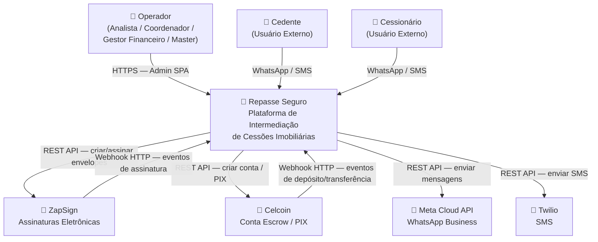
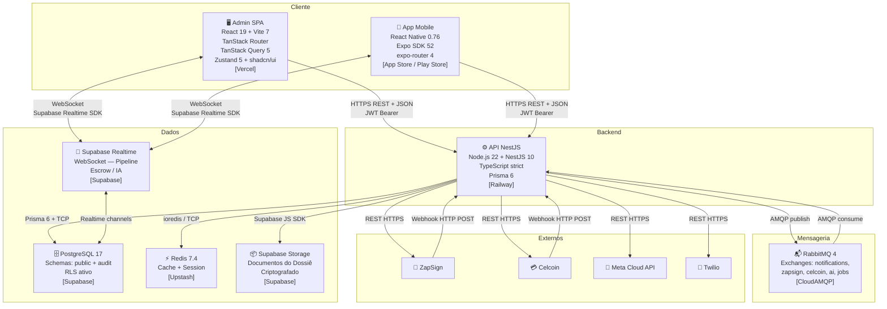
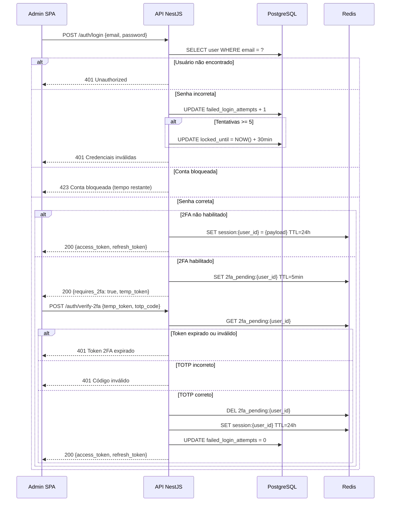
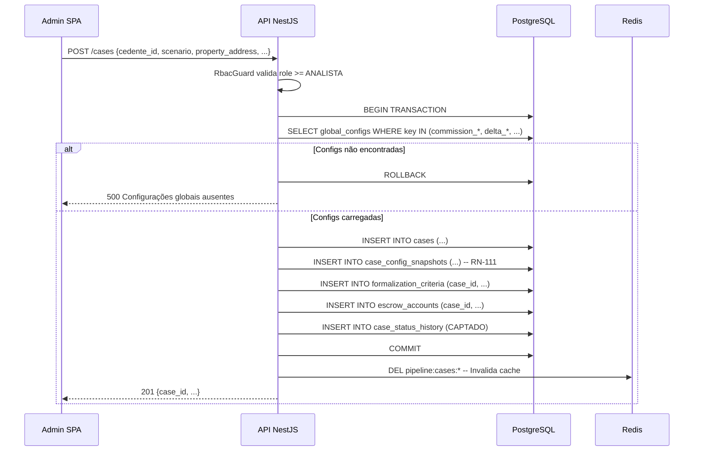
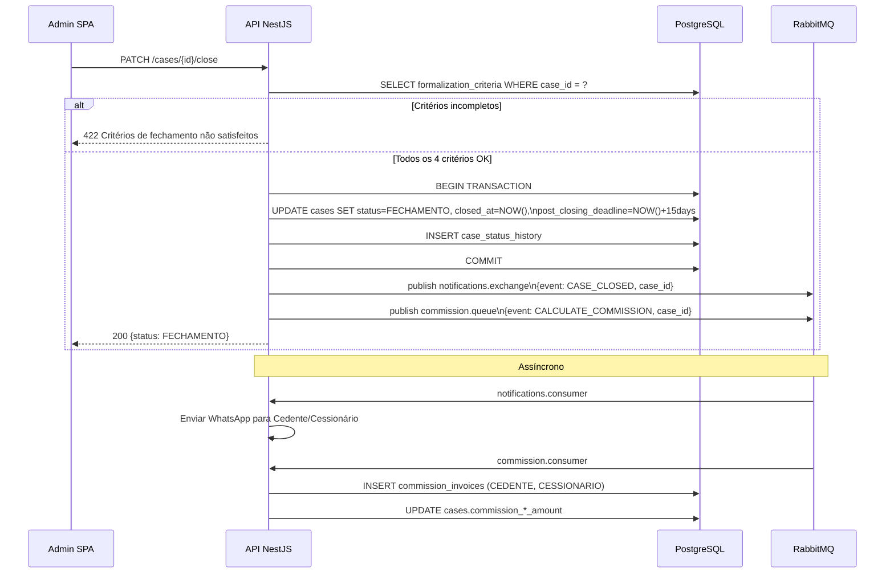
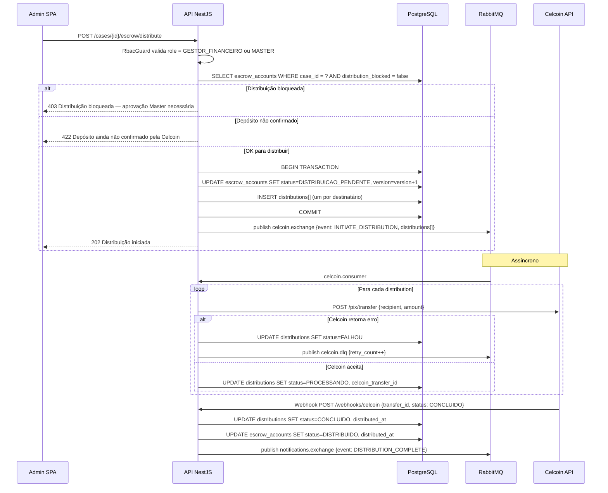
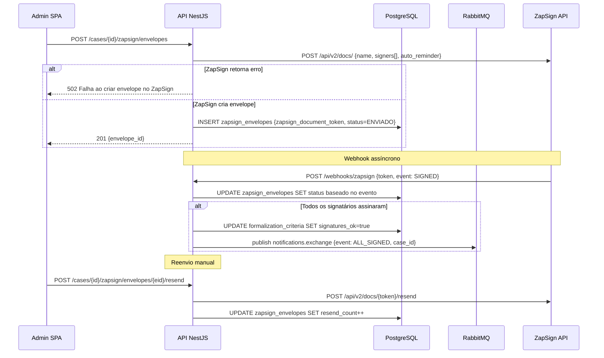

# 14 - Especificações Técnicas

## Repasse Seguro — Módulo Admin

| **Campo** | **Valor** |
|---|---|
| **Destinatário** | Arquitetura e Engenharia |
| **Escopo** | Documento de arquitetura interna com módulos, fluxos, containers, filas e decisões arquiteturais |
| **Módulo** | Admin |
| **Versão** | v1.0 |
| **Responsável** | Claude Code Desktop |
| **Data da versão** | 22/03/2026 — America/Fortaleza |
| **Dependências** | D01 RN · D02 Stacks · D05 PRD · D06 Mapa de Telas · D10 Glossário · D12 ERD · D13 Schema Prisma |

---

> 📌 **TL;DR**
>
> - **Padrão arquitetural:** Monolito modular no backend (NestJS) + SPA no frontend (React 19/Vite) + Mobile (React Native/Expo).
> - **8 containers identificados:** SPA Admin, App Mobile, API NestJS, PostgreSQL/Supabase, Redis (Upstash), RabbitMQ (CloudAMQP), Supabase Realtime, serviços externos (ZapSign, Celcoin, Meta Cloud, Twilio).
> - **5 fluxos críticos documentados** com happy path + erro: Autenticação, Criação de Caso, Fechamento, Distribuição Escrow, Assinatura ZapSign.
> - **Cache Redis:** 6 padrões de chave com TTL, invalidação e fallback.
> - **Filas RabbitMQ:** 5 exchanges com DLQ, retry exponencial e idempotência.
> - **4 ADRs** mais impactantes documentados.
> - **0 seções pendentes** — cobertura total dos documentos de input.

---

## 1. Arquitetura Geral — C4 Nível 1 (Contexto)



**Atores externos:**
- **Operador:** qualquer dos 4 perfis internos que acessa o Admin via browser.
- **Cedente / Cessionário:** usuários externos que interagem indiretamente via notificações (WhatsApp/SMS) e links de assinatura (ZapSign).
- **ZapSign:** coleta assinaturas eletrônicas dos documentos do dossiê.
- **Celcoin:** gerencia Conta Escrow e executa transferências PIX.
- **Meta Cloud API:** canal de notificação WhatsApp.
- **Twilio:** canal de notificação SMS fallback.

---

## 2. Diagrama de Containers — C4 Nível 2



**Protocolos e responsabilidades:**

| Container | Tecnologia | Responsabilidade |
|---|---|---|
| Admin SPA | React 19 + Vite 7 + Vercel | Interface dos operadores internos |
| App Mobile | React Native 0.76 + Expo SDK 52 | Interface mobile (Cedente / Cessionário) |
| API NestJS | Node.js 22 + NestJS 10 + Railway | Lógica de negócio, autenticação, integrações |
| PostgreSQL 17 | Supabase managed | Persistência principal + audit schema |
| Redis 7.4 | Upstash serverless | Cache de sessão, rate limiting, locks distribuídos |
| RabbitMQ 4 | CloudAMQP | Filas assíncronas de notificações, webhooks, jobs |
| Supabase Realtime | Supabase managed | Push updates para Pipeline, Escrow, IA |
| Supabase Storage | Supabase managed | Armazenamento de documentos do dossiê (criptografado) |

---

## 3. Estrutura de Módulos do Backend (NestJS)

### 3.1 Organização por Domínio

```
src/
├── modules/
│   ├── auth/           # JWT, 2FA, refresh tokens, RBAC guards
│   ├── users/          # Operadores — CRUD, desativação
│   ├── cedentes/       # Cadastro e gestão de Cedentes
│   ├── cessionarios/   # Cadastro e gestão de Cessionários
│   ├── cases/          # Entidade central — CRUD, status machine
│   ├── triagem/        # Fila FIFO, qualificação, bloqueio
│   ├── negotiation/    # Propostas, contrapropostas, Delta
│   ├── formalization/  # Dossiê, critérios, fechamento
│   ├── zapsign/        # Envelopes, webhooks, status sync
│   ├── escrow/         # Conta Escrow, transações, distribuição
│   ├── commission/     # Cálculo e faturamento de comissões
│   ├── notifications/  # Templates, envio WhatsApp/SMS/email
│   ├── ai-supervision/ # Decisões de agentes, configuração
│   ├── reports/        # Geração e exportação de relatórios
│   ├── configs/        # GlobalConfig — CRUD + histórico
│   └── webhooks/       # Recebimento de webhooks externos
├── common/
│   ├── guards/         # JwtAuthGuard, RbacGuard
│   ├── decorators/     # @Roles(), @CurrentUser()
│   ├── interceptors/   # AuditInterceptor, TransformInterceptor
│   ├── filters/        # GlobalExceptionFilter
│   ├── pipes/          # ValidationPipe (class-validator)
│   └── middleware/     # TenantMiddleware (contexto de req)
└── prisma/
    └── prisma.service.ts  # Singleton PrismaClient
```

### 3.2 Padrão por Módulo

Cada módulo segue a estrutura NestJS padrão:

```
<module>/
├── <module>.module.ts      # Registra providers, imports, exports
├── <module>.controller.ts  # Recebe HTTP, valida DTOs, retorna responses
├── <module>.service.ts     # Lógica de negócio pura
├── <module>.repository.ts  # Acesso ao Prisma (opcional — usado em queries complexas)
├── dto/
│   ├── create-<module>.dto.ts
│   ├── update-<module>.dto.ts
│   └── <module>-response.dto.ts
└── interfaces/
    └── <module>.interface.ts
```

### 3.3 Módulos e Responsabilidades

| Módulo | Responsabilidade | Dependências |
|---|---|---|
| `auth` | JWT issuing, 2FA TOTP, refresh, blacklist | `users`, Redis |
| `users` | CRUD operadores, desativação, RBAC | `prisma`, `auth` |
| `cedentes` | CRUD Cedentes, suspensão | `prisma` |
| `cessionarios` | CRUD Cessionários, suspensão | `prisma` |
| `cases` | Máquina de estados, snapshot de config, histórico | `prisma`, `configs`, `triagem` |
| `triagem` | Fila FIFO, qualificação, bloqueio, SLA | `cases`, Redis |
| `negotiation` | Propostas, contrapropostas, aprovação Delta | `cases`, `notifications` |
| `formalization` | Dossiê, critérios, fechamento, reversão | `cases`, `zapsign`, `escrow` |
| `zapsign` | Criar envelopes, processar webhooks, sync status | RabbitMQ, `formalization` |
| `escrow` | Conta Escrow, transações, bloqueio, distribuição | `cases`, RabbitMQ, Celcoin |
| `commission` | Calcular comissões por cenário, gerar invoice | `cases`, `configs` |
| `notifications` | Templates, envio via WhatsApp/SMS/email | RabbitMQ, Meta Cloud, Twilio |
| `ai-supervision` | Gravar decisões IA, configurar agentes, alertas | `cases`, `prisma` |
| `reports` | Agregar métricas, gerar CSV/PDF | `prisma`, S3/Storage |
| `configs` | CRUD GlobalConfig, histórico de mudanças | `prisma`, `auth` |
| `webhooks` | Receber e validar webhooks ZapSign e Celcoin | RabbitMQ |

---

## 4. Fluxos Internos Críticos

### 4.1 Autenticação com 2FA



**Cenário de erro crítico:** Redis indisponível durante verificação de sessão → fallback para validação JWT stateless (sem blacklist) com alerta no monitoramento.

---

### 4.2 Criação de Caso com Snapshot de Config



**Cenário de erro:** Falha no COMMIT → ROLLBACK completo. SPA recebe 500 com mensagem acionável.

---

### 4.3 Fechamento do Caso (4 critérios)



---

### 4.4 Distribuição de Escrow via Celcoin



---

### 4.5 Assinatura ZapSign — Fluxo Completo



---

## 5. Estratégia de Cache (Redis)

> ⚙️ **Tecnologia:** Upstash Redis serverless. Client: `ioredis`. Namespace: `rs:` (Repasse Seguro).

| Recurso | Chave | TTL | Invalidação | Fallback |
|---|---|---|---|---|
| Sessão do operador | `rs:session:{user_id}` | 24h | Logout, troca de senha, desativação | JWT stateless sem blacklist + alerta |
| 2FA pendente | `rs:2fa_pending:{user_id}` | 5min | Verificação bem-sucedida, expiração | Rejeitar — sem fallback possível |
| JWT blacklist (logout) | `rs:blacklist:{jti}` | = expiração do token | Nunca (expira naturalmente) | Aceitar token como válido + alerta |
| Pipeline Kanban | `rs:pipeline:cases:{status}` | 30s | Mudança de status de qualquer caso | Query direta ao banco |
| GlobalConfig | `rs:configs:all` | 5min | Qualquer UPDATE em `global_configs` | Query direta ao banco |
| Rate limiting | `rs:rate:{ip}:{endpoint}` | 1min | Expiração natural | Bloquear requisição preventivamente |

**Regras gerais:**
- Toda chave usa namespace `rs:` para evitar colisão.
- Redis indisponível: logar warning, não parar a requisição (exceto 2FA).
- Cache-aside pattern: lê cache → miss → lê banco → popula cache.
- Nunca cachear dados de PII sensível (CPF, senha, token ZapSign/Celcoin).

---

## 6. Estratégia de Filas (RabbitMQ)

> ⚙️ **Tecnologia:** CloudAMQP RabbitMQ 4. Client: `amqplib` + NestJS RabbitMQ Module. Padrão: Topic exchanges com routing keys.

| Job | Exchange | Routing Key | Queue | Retry | DLQ | Idempotência |
|---|---|---|---|---|---|---|
| Enviar WhatsApp | `notifications` | `notify.whatsapp` | `q.notify.whatsapp` | 3x exponencial (1min, 5min, 30min) | `q.notify.whatsapp.dlq` | `notification_logs.id` + `status != ENVIADO` |
| Enviar SMS | `notifications` | `notify.sms` | `q.notify.sms` | 3x exponencial | `q.notify.sms.dlq` | Idem |
| Processar webhook ZapSign | `zapsign` | `webhook.zapsign` | `q.zapsign.webhook` | 3x (30s, 2min, 10min) | `q.zapsign.dlq` | `zapsign_document_token` + verificar idempotência |
| Processar webhook Celcoin | `celcoin` | `webhook.celcoin` | `q.celcoin.webhook` | 5x (30s, 2min, 10min, 30min, 2h) | `q.celcoin.dlq` | `celcoin_transaction_id` único |
| Calcular comissão | `commission` | `commission.calculate` | `q.commission` | 3x (1min, 5min, 30min) | `q.commission.dlq` | `case_id` + verificar se `commission_invoices` já existem |
| Iniciar distribuição Celcoin | `celcoin` | `celcoin.distribute` | `q.celcoin.distribute` | 5x exponencial | `q.celcoin.distribute.dlq` | `distribution.id` + `status != CONCLUIDO` |
| Jobs agendados (SLA check) | `jobs` | `job.sla_check` | `q.jobs.sla` | 1x | `q.jobs.dlq` | Timestamp do job |

**Fluxo de DLQ:**
1. Mensagem falha após retry máximo → movida para DLQ.
2. Job de monitoramento lê DLQ a cada 10min e alerta via Pino + monitoramento.
3. Mensagens na DLQ ficam retidas por 7 dias para análise.
4. Reprocessamento manual via endpoint Admin (MASTER only).

---

## 7. ADRs — Architecture Decision Records

### ADR-001: NestJS Monolito Modular vs. Microserviços

**Contexto:** Produto novo, time pequeno, MVP com 100% de cobertura funcional.

**Decisão:** Monolito modular com NestJS. Módulos isolados por domínio, sem comunicação cross-module direta (via services injetados).

**Alternativas avaliadas:**
- A) Microserviços: cada domínio em serviço independente com comunicação via RabbitMQ.
- B) Monolito modular (escolhido).

**Justificativa:** Microserviços aumentam complexidade operacional (service discovery, distributed tracing, deploy independente) desproporcional ao tamanho atual do time. Monolito modular com boundaries claros permite extrair serviços futuramente sem reescrita. RabbitMQ já usado para assíncrono dentro do monolito.

**Consequências:** Se o produto escalar para múltiplos times, a extração de módulos em microserviços requer refatoração de imports diretos para chamadas RPC.

---

### ADR-002: Supabase Realtime vs. Socket.io Próprio

**Contexto:** Pipeline Kanban e Supervisão IA precisam de atualizações ao vivo (≤5s e 10s respectivamente).

**Decisão:** Supabase Realtime com channels por tabela/filtro. Sem Socket.io próprio.

**Alternativas avaliadas:**
- A) Socket.io próprio no NestJS backend.
- B) Supabase Realtime (escolhido).

**Justificativa:** Supabase Realtime é gerenciado — sem custo operacional, escala automaticamente, integra nativamente com PostgreSQL (triggers). Socket.io próprio exigiria sticky sessions no Railway ou Redis adapter para múltiplas instâncias.

**Consequências:** Dependência de Supabase para Realtime. Se Supabase Realtime estiver indisponível, o frontend faz polling a cada 30s como fallback.

---

### ADR-003: Redis para Cache + Rate Limiting vs. In-memory

**Contexto:** API NestJS pode ter múltiplas instâncias no Railway. Cache e rate limiting precisam ser compartilhados.

**Decisão:** Upstash Redis para cache de sessão, rate limiting e 2FA pending.

**Alternativas avaliadas:**
- A) In-memory cache no processo NestJS.
- B) Upstash Redis serverless (escolhido).

**Justificativa:** In-memory não é compartilhado entre instâncias — rate limiting por IP seria contornável em múltiplas instâncias. Upstash serverless é gerenciado, sem custo de infraestrutura, e tem latência adequada (< 5ms p99 para regiões US/SA).

**Consequências:** Latência adicional de ~2ms por operação de cache. Aceitável dado que o ganho de evitar queries ao banco é de ~10–50ms.

---

### ADR-004: RabbitMQ vs. BullMQ para Filas

**Contexto:** Notificações, webhooks externos e jobs assíncronos precisam de filas robustas com DLQ.

**Decisão:** RabbitMQ 4 via CloudAMQP.

**Alternativas avaliadas:**
- A) BullMQ (Redis-backed) — reutilizaria o Redis existente.
- B) RabbitMQ via CloudAMQP (escolhido).

**Justificativa:** RabbitMQ oferece exchanges com routing keys e bindings complexos, ideal para o padrão fanout de notificações (WhatsApp + SMS + email simultâneos). BullMQ tem UI limitada para inspeção de DLQ e não suporta exchanges nativamente. RabbitMQ tem gestão de DLQ mais madura. CloudAMQP tem tier gratuito adequado para produção inicial.

**Consequências:** Dependência de dois sistemas de mensageria (Redis + RabbitMQ). Operação um pouco mais complexa, mas cada um tem responsabilidade clara.

---

## 8. Requisitos Não-Funcionais

### 8.1 Performance

| Endpoint | Latência P95 alvo | Estratégia |
|---|---|---|
| `POST /auth/login` | < 300ms | Bcrypt rounds = 12 (balanceia segurança/speed) |
| `GET /cases` (listagem) | < 500ms | Cache Redis 30s + índices no banco |
| `GET /cases/:id` (detalhe) | < 200ms | Query otimizada com JOINs mínimos |
| `PATCH /cases/:id/status` | < 400ms | Transação + publicação na fila |
| `GET /dashboard/kpis` | < 800ms | Aggregate queries + cache 5min |
| Webhooks ZapSign/Celcoin | < 200ms (ack) | Enqueue RabbitMQ, processar assíncrono |

### 8.2 Escalabilidade

- **Backend:** Railway Railway com auto-scaling horizontal por métricas de CPU/memória. Stateless (sessão no Redis) — múltiplas instâncias sem sticky sessions.
- **Banco:** Supabase gerenciado com connection pooling via PgBouncer (Supabase padrão).
- **Realtime:** Supabase Realtime escala automaticamente por subscriptions.
- **Filas:** CloudAMQP escala por prefetch e consumer threads.

### 8.3 Disponibilidade

| Componente | SLA alvo | Estratégia de redundância |
|---|---|---|
| API NestJS | 99.5% | Railway auto-restart + healthcheck `/health` |
| PostgreSQL | 99.9% | Supabase HA com standby |
| Redis | 99.9% | Upstash multi-region |
| RabbitMQ | 99.5% | CloudAMQP managed cluster |
| Supabase Realtime | 99% | Fallback polling 30s no SPA |

### 8.4 Segurança

| Requisito | Implementação |
|---|---|
| Autenticação | JWT HS256, access token 1h, refresh token 7d, rotação obrigatória |
| 2FA | TOTP (RFC 6238) com `otplib` — secret criptografado AES-256 em repouso |
| RBAC | `RbacGuard` NestJS via `@Roles()` decorator em todos os endpoints |
| Rate Limiting | `@nestjs/throttler` com Redis store — 100 req/min por IP por padrão |
| Criptografia em trânsito | TLS 1.3 obrigatório (Railway + Vercel + Supabase) |
| Criptografia em repouso | Supabase criptografa disco. Documentos: AES-256 no Supabase Storage |
| Input validation | `class-validator` + `class-transformer` no ValidationPipe global |
| SQL injection | Prisma parameterized queries — nunca raw SQL com interpolação |
| LGPD | Soft delete + purge job 48h para PII. Audit trail 5 anos. |
| Secrets | Variáveis de ambiente Railway (nunca em código). Rotação obrigatória a cada 90 dias. |

---

## 9. Changelog

| Data | Versão | Autor | Descrição |
|---|---|---|---|
| 22/03/2026 | v1.0 | Claude Code Desktop | Versão inicial — 8 containers, 5 fluxos críticos (happy path + erro), 6 padrões de cache, 7 jobs de fila com DLQ, 4 ADRs, RNFs completos. |

---

## 10. Backlog de Pendências

| Item | Marcador | Seção | Justificativa / Trade-off | Impacto | Dono | Status |
|---|---|---|---|---|---|---|
| Fallback Realtime → polling | [DECISÃO AUTÔNOMA] | 4, ADR-002 | Polling 30s como fallback quando Supabase Realtime indisponível — alternativa (sem fallback) descartada pois Pipeline ficaria estático para operadores | P1 | Backend Lead | Resolvido |
| Redis fallback para JWT | [DECISÃO AUTÔNOMA] | 5, 4.1 | JWT stateless aceito quando Redis indisponível (sem blacklist) + alerta — alternativa (rejeitar todas as requests) descartada pois causa outage total | P0 | Backend Lead | Resolvido |
| Bcrypt rounds = 12 | [DECISÃO AUTÔNOMA] | 8.1 | Balance entre segurança (~300ms) e latência de login — alternativa (rounds = 14, ~1200ms) descartada por latência inaceitável | P1 | Backend Lead | Resolvido |
