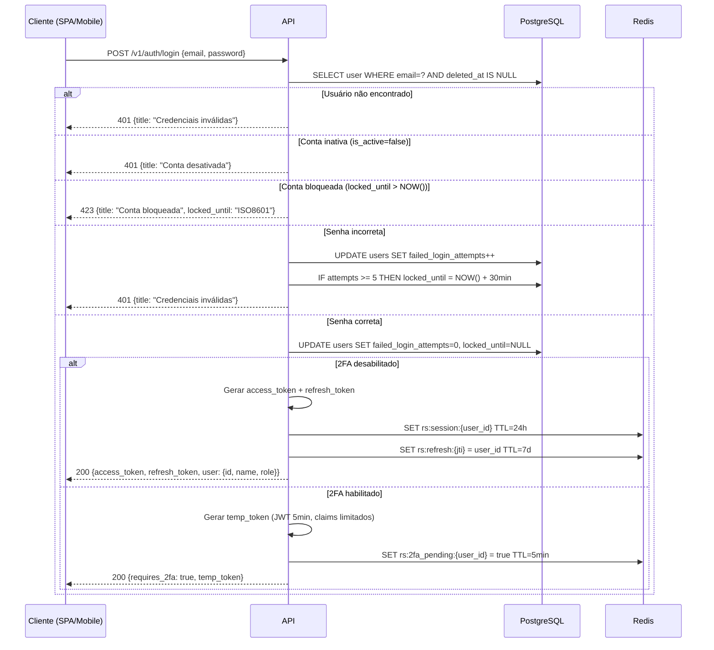
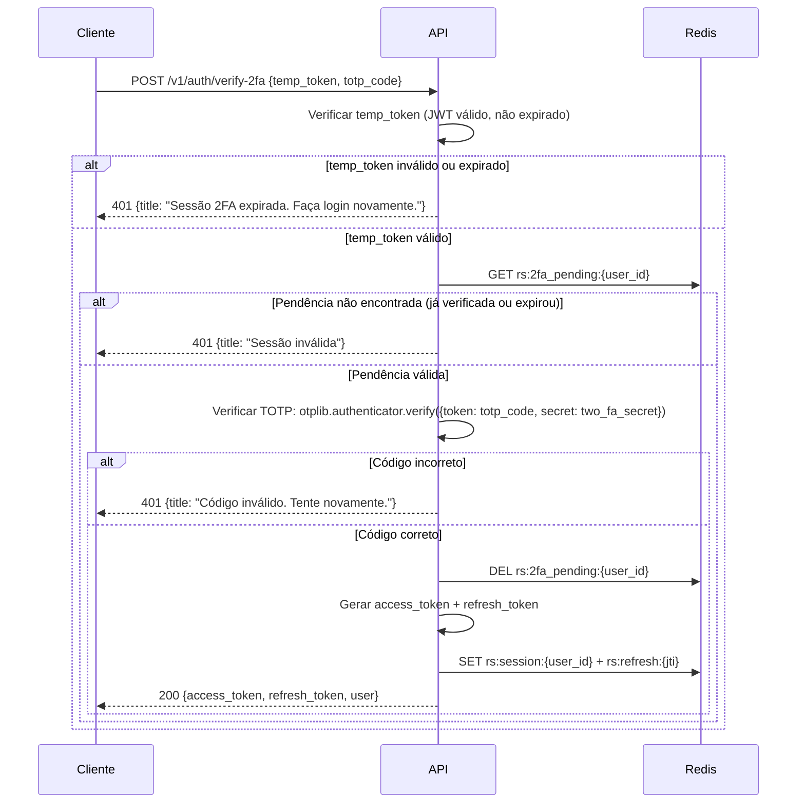
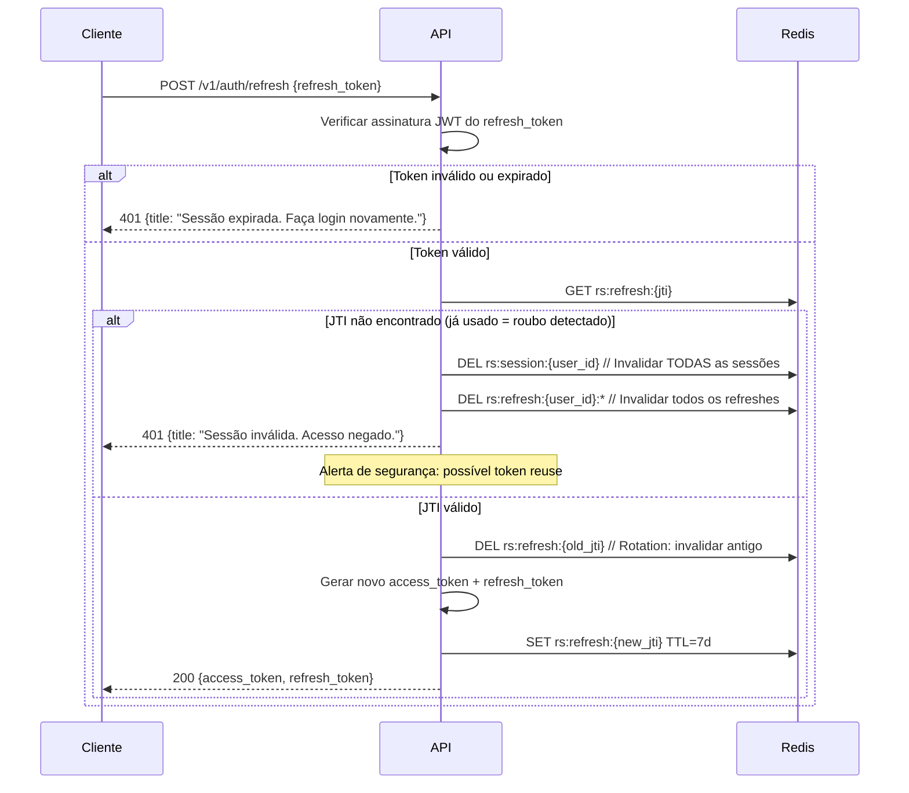

# 18 - Fluxos de Autenticação e Autorização

## Repasse Seguro — Admin + Mobile

| **Campo** | **Valor** |
|---|---|
| **Destinatário** | Backend Lead, Frontend Lead, QA, Segurança |
| **Escopo** | Fluxos completos de autenticação JWT, 2FA TOTP, refresh, RBAC e proteção de rotas |
| **Versão** | v1.0 |
| **Responsável** | Claude Code Desktop |
| **Data** | 22/03/2026 — America/Fortaleza |
| **Dependências** | D01 RN (RN-001 a RN-010) · D02 Stacks · D13 Schema Prisma · D14 Especificações Técnicas |

---

> 📌 **TL;DR**
>
> - **JWT HS256** — access token 1h, refresh token 7d com rotação.
> - **2FA TOTP (RFC 6238)** — obrigatório para MASTER e COORDENADOR; opcional para ANALISTA e GESTOR_FINANCEIRO.
> - **Bloqueio de conta:** 5 tentativas → 30 minutos (RN-005). Contador reset no login bem-sucedido.
> - **RBAC:** hierarquia `MASTER > COORDENADOR > GESTOR_FINANCEIRO > ANALISTA`. `@Roles()` decorator em todos os endpoints.
> - **Refresh rotation:** novo refresh token a cada uso — token antigo invalidado imediatamente.
> - **Mobile:** JWT idêntico ao web + biometria como segundo fator no device.

---

## 1. Tokens JWT

### 1.1 Estrutura do Access Token

```json
{
  "sub": "user_uuid",
  "email": "operador@repasseseguro.com.br",
  "role": "ANALISTA",
  "name": "Nome do Operador",
  "jti": "unique_token_id",
  "iat": 1711094400,
  "exp": 1711098000  // +1h
}
```

### 1.2 Estrutura do Refresh Token

```json
{
  "sub": "user_uuid",
  "jti": "unique_refresh_id",
  "iat": 1711094400,
  "exp": 1711699200  // +7d
}
```

### 1.3 Armazenamento

| Contexto | Access Token | Refresh Token |
|---|---|---|
| Admin SPA (web) | `sessionStorage` (tab-scoped) | `httpOnly cookie` (secure, SameSite=Strict) |
| App Mobile | `expo-secure-store` | `expo-secure-store` |

> 🔴 **Anti-padrão:** Nunca armazenar tokens em `localStorage` (persistente, vulnerável a XSS). `sessionStorage` é descartado ao fechar a aba — sessão expirada é comportamento esperado.

---

## 2. Fluxo de Login



---

## 3. Fluxo de Verificação 2FA



---

## 4. Fluxo de Refresh Token



---

## 5. Fluxo de Logout

```typescript
// auth.service.ts
async logout(userId: string, jti: string): Promise<void> {
  // 1. Adicionar JTI à blacklist (expira com o token)
  const tokenExp = this.jwtService.decode(token)?.exp;
  const ttl = tokenExp - Math.floor(Date.now() / 1000);
  if (ttl > 0) {
    await redis.setex(`rs:blacklist:${jti}`, ttl, '1');
  }

  // 2. Invalidar sessão no Redis
  await redis.del(`rs:session:${userId}`);

  // 3. Invalidar refresh token
  await redis.del(`rs:refresh:${jti}`);
}
```

---

## 6. Validação de Token em Cada Request

```typescript
// jwt.strategy.ts
@Injectable()
export class JwtStrategy extends PassportStrategy(Strategy) {
  async validate(payload: JwtPayload) {
    // 1. Verificar blacklist
    const blacklisted = await redis.get(`rs:blacklist:${payload.jti}`);
    if (blacklisted) throw new UnauthorizedException('Token revogado');

    // 2. Verificar sessão ativa
    const session = await redis.get(`rs:session:${payload.sub}`);
    if (!session) throw new UnauthorizedException('Sessão expirada');

    // 3. Verificar usuário ainda ativo no banco
    const user = await prisma.user.findFirst({
      where: { id: payload.sub, is_active: true, deleted_at: null },
      select: { id: true, role: true, name: true, email: true },
    });
    if (!user) throw new UnauthorizedException('Usuário não encontrado ou inativo');

    return user; // Disponível em @CurrentUser()
  }
}
```

---

## 7. RBAC — Controle de Acesso por Role

### 7.1 Hierarquia de Roles

```
MASTER           → Acesso total — todas as operações incluindo configs críticas
  └─ COORDENADOR → Supervisão de analistas, aprovações, configurações gerais
       └─ GESTOR_FINANCEIRO → Módulo financeiro exclusivo
       └─ ANALISTA         → Operações do dia a dia (triagem, negociação, formalização)
```

> ⚙️ **Nota:** GESTOR_FINANCEIRO e ANALISTA são paralelos — não há hierarquia entre eles. Cada um tem acesso exclusivo ao seu domínio.

### 7.2 Implementação

```typescript
// roles.decorator.ts
export const Roles = (...roles: UserRole[]) => SetMetadata(ROLES_KEY, roles);

// rbac.guard.ts
@Injectable()
export class RbacGuard implements CanActivate {
  canActivate(context: ExecutionContext): boolean {
    const requiredRoles = this.reflector.getAllAndOverride<UserRole[]>(ROLES_KEY, [
      context.getHandler(),
      context.getClass(),
    ]);
    if (!requiredRoles) return true; // Sem restrição de role

    const { user } = context.switchToHttp().getRequest();

    // MASTER sempre tem acesso
    if (user.role === UserRole.MASTER) return true;

    return requiredRoles.some((role) => user.role === role);
  }
}

// Uso em controllers
@Get('/cases')
@UseGuards(JwtAuthGuard, RbacGuard)
@Roles(UserRole.ANALISTA, UserRole.COORDENADOR, UserRole.GESTOR_FINANCEIRO)
async getCases() { ... }
```

### 7.3 Matriz de Acesso por Módulo

| Módulo | ANALISTA | COORDENADOR | GESTOR_FINANCEIRO | MASTER |
|---|---|---|---|---|
| Dashboard | Leitura | Leitura | Leitura | Leitura + Config |
| Pipeline | CRUD próprio | CRUD todos | Leitura | CRUD + Cancel |
| Triagem | CRUD | CRUD + Supervisão | — | CRUD |
| Negociação | CRUD | CRUD + Aprovação Delta | — | CRUD |
| Formalização | CRUD dossiê | Aprovar docs + Critérios | — | CRUD |
| Financeiro | — | — | CRUD completo | CRUD + Desbloquear |
| Supervisão IA | — | Leitura + Review | — | Config |
| Usuários | — | Leitura operadores | — | CRUD |
| Relatórios | — | Leitura + Exportar | Financeiros | Todos |
| Configurações | — | Leitura | — | CRUD |

---

## 8. Configuração de 2FA

### 8.1 Habilitação pelo Usuário

```typescript
// POST /v1/auth/2fa/setup — gerar QR code para configuração
async setup2FA(userId: string) {
  const secret = authenticator.generateSecret();
  const otpauth = authenticator.keyuri(
    user.email,
    'Repasse Seguro',
    secret
  );
  // Salvar secret temporariamente (apenas após confirmar)
  await redis.setex(`rs:2fa_setup:${userId}`, 600, secret); // 10min para confirmar
  return { otpauth_url: otpauth, secret }; // Exibir QR code na UI
}

// POST /v1/auth/2fa/confirm — confirmar com primeiro código TOTP
async confirm2FA(userId: string, totp_code: string) {
  const secret = await redis.get(`rs:2fa_setup:${userId}`);
  if (!secret) throw new BadRequestException('Setup expirado');

  const valid = authenticator.verify({ token: totp_code, secret });
  if (!valid) throw new UnprocessableEntityException('Código inválido');

  // Criptografar e salvar o secret no banco
  const encryptedSecret = encrypt(secret, process.env.CRYPTO_KEY);
  await prisma.user.update({
    where: { id: userId },
    data: { two_fa_enabled: true, two_fa_secret: encryptedSecret },
  });
  await redis.del(`rs:2fa_setup:${userId}`);
}
```

### 8.2 Criptografia do TOTP Secret

```typescript
// crypto.service.ts — AES-256-GCM
import * as crypto from 'crypto';

const ALGORITHM = 'aes-256-gcm';
const KEY = Buffer.from(process.env.CRYPTO_KEY, 'hex'); // 32 bytes

function encrypt(text: string): string {
  const iv = crypto.randomBytes(16);
  const cipher = crypto.createCipheriv(ALGORITHM, KEY, iv);
  const encrypted = Buffer.concat([cipher.update(text, 'utf8'), cipher.final()]);
  const tag = cipher.getAuthTag();
  return `${iv.toString('hex')}:${encrypted.toString('hex')}:${tag.toString('hex')}`;
}

function decrypt(encryptedText: string): string {
  const [ivHex, encHex, tagHex] = encryptedText.split(':');
  const iv = Buffer.from(ivHex, 'hex');
  const encrypted = Buffer.from(encHex, 'hex');
  const tag = Buffer.from(tagHex, 'hex');
  const decipher = crypto.createDecipheriv(ALGORITHM, KEY, iv);
  decipher.setAuthTag(tag);
  return Buffer.concat([decipher.update(encrypted), decipher.final()]).toString('utf8');
}
```

---

## 9. Proteção de Rotas no Frontend (SPA)

```typescript
// router.tsx — TanStack Router com beforeLoad guard
const protectedRoute = createRootRouteWithContext<RouterContext>()({
  beforeLoad: ({ context, location }) => {
    if (!context.auth.isAuthenticated) {
      throw redirect({
        to: '/login',
        search: { redirect: location.href },
      });
    }
  },
});

// Guard por role
const masterOnlyRoute = createRoute({
  beforeLoad: ({ context }) => {
    if (context.auth.user?.role !== 'MASTER') {
      throw redirect({ to: '/dashboard', search: { error: 'forbidden' } });
    }
  },
});
```

---

## 10. Segurança Adicional

| Medida | Implementação |
|---|---|
| Rate limiting no login | 10 req/min por IP (throttler global) |
| CORS | Apenas `FRONTEND_URL` e `MOBILE_DEEP_LINK_SCHEME` permitidos |
| Helmet | Headers de segurança: CSP, HSTS, X-Frame-Options |
| Input sanitization | `class-validator` + `class-transformer` no ValidationPipe |
| SQL injection | Prisma parameterized queries exclusivamente |
| Password hashing | bcrypt com 12 rounds |
| Brute force | Bloqueio por conta (5 tentativas) + rate limit por IP |

---

## 11. Changelog

| Versão | Data | Autor | Descrição |
|---|---|---|---|
| v1.0 | 22/03/2026 | Claude Code Desktop | Versão inicial — JWT, 2FA TOTP, refresh rotation, blacklist, RBAC hierárquico, criptografia de secret, proteção de rotas frontend. |
