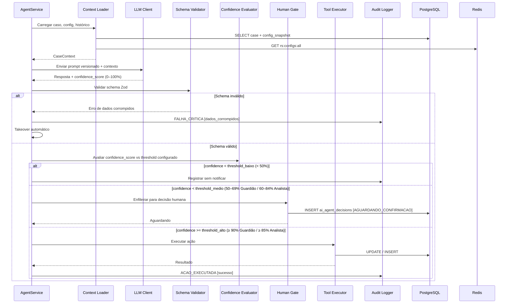
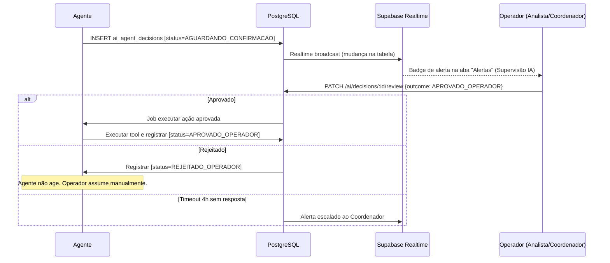

# 19 - Criação de Agentes de IA

## Repasse Seguro — Módulo Admin

| **Campo** | **Valor** |
|---|---|
| **Destinatário** | Arquitetura e Engenharia de IA |
| **Escopo** | Guia de decisão para arquitetura de agentes de IA, tools, memória, RAG e contratos de saída |
| **Versão** | v1.0 |
| **Responsável** | Claude Code Desktop |
| **Data** | 22/03/2026 — America/Fortaleza |
| **Dependências** | D01 RN · D02 Stacks · D05 PRD · D14 Especificações Técnicas |

---

> 📌 **TL;DR**
>
> - **2 agentes definidos:** Guardião do Retorno (executor com tools + aprovação humana) e Analista de Oportunidades (informacional com output estruturado).
> - **Stack obrigatória:** TypeScript / NestJS no backend; LLM: `[DECISÃO AUTÔNOMA]` Claude 3.5 Haiku para execuções operacionais frequentes.
> - **Sem RAG:** nenhum dos agentes depende de base documental — decisões baseadas em dados estruturados do banco, não em documentos livres.
> - **Memória:** curta por execução (contexto do caso); sem memória longa persistente — agentes são stateless entre execuções.
> - **Guardrails críticos:** thresholds de confiança configuráveis (50–95%), takeover manual em 1 clique, takeover automático em falha crítica (6 gatilhos definidos).
> - **Human-in-the-loop obrigatório:** escalonamento de cenário, ações que alteram valores financeiros, comunicação direta com Cessionário — sempre requerem aprovação humana.
> - **Observabilidade:** cada execução registra agente, caso, ação, confiança, resultado, latência e custo estimado.

---

## 1. Critérios de Decisão: Tipo de Agente

### 1.1 Tabela de Decisão por Caso de Uso

| Cenário | Tipo de agente | Justificativa |
|---|---|---|
| Monitorar comportamento de inadimplência do cedente e sugerir escalonamento de cenário | Executor + aprovação humana | Age (cria sugestão) mas escalonamento requer confirmação explícita do Analista; risco financeiro direto |
| Identificar match entre Cedente e Cessionários potenciais | Informacional com output estruturado | Não age sobre sistemas externos — apenas sugere ao Analista com schema validável |
| Detectar loop ou timeout de agente e acionar takeover automático | Executor sem aprovação | Falha crítica = ação imediata obrigatória; threshold binário, não depende de LLM |
| Exibir métricas de ações 24h, confiança média e alertas na Supervisão IA | Informacional (agregação de dados) | Consulta banco e Redis; nenhuma ação executada |
| Enviar notificação WhatsApp/SMS ao Cedente | Executor + aprovação condicional | Aprovação obrigatória quando iniciada por agente; direta quando iniciada por operador humano |

### 1.2 Regra Binária de Classificação

```
SE o agente modifica estado externo (banco, API, fila) → Agente executor
SE o resultado tem risco financeiro, jurídico ou operacional relevante → + Aprovação humana obrigatória
SE a qualidade depende de documentos ou histórico textual → + RAG
SE o histórico altera a próxima decisão → + Memória longa
SE a saída precisa ser validada por schema → Output estruturado obrigatório
```

---

## 2. Arquitetura Base do Agente

### 2.1 Componentes Obrigatórios

Cada agente implementado no Repasse Seguro deve conter os seguintes componentes:

| Componente | Responsabilidade |
|---|---|
| **Context Loader** | Carrega dados do caso do banco (Prisma) e configurações ativas (Redis cache) |
| **LLM Client** | Envia prompt estruturado ao modelo, recebe output validado |
| **Schema Validator** | Valida output do LLM contra schema Zod antes de qualquer ação |
| **Tool Executor** | Executa chamadas externas (banco, API, fila) com retry e circuit breaker |
| **Confidence Evaluator** | Verifica se nível de confiança retornado pelo LLM autoriza ação autônoma |
| **Human Gate** | Bloqueia execução e enfileira para aprovação quando regra humana for ativada |
| **Audit Logger** | Registra cada etapa: entrada, decisão, confiança, saída, custo |
| **Failure Handler** | Detecta os 6 eventos de falha crítica e aciona takeover automático |

### 2.2 Estado e Ciclo de Execução

```
IDLE → CONTEXT_LOADING → PROMPT_BUILD → LLM_CALL → SCHEMA_VALIDATION
     → CONFIDENCE_CHECK → [HUMAN_GATE?] → TOOL_EXECUTION → AUDIT → IDLE
```

**Estados persistidos por agente + caso:**
- `ATIVO` — operando normalmente
- `PAUSADO_MANUAL` — takeover humano ativo
- `PAUSADO_AUTO` — falha crítica detectada; aguarda inspeção humana
- `AGUARDANDO_CONFIRMACAO` — ação em fila para aprovação (Human Gate)
- `SUPERVISAO_TOTAL` — modo obrigatório de aprovação prévia de todas as ações

### 2.3 Fluxo Completo



---

## 3. Agentes Implementados

### 3.1 Agente: Guardião do Retorno

**Objetivo:** Monitorar comportamento de inadimplência e condições de mercado para sugerir ou acionar escalonamento de cenário (D→C→B→A), identificar riscos de abandono do Cedente e manter o Analista informado sobre urgências operacionais.

**Tipo:** Executor + aprovação humana (para ações financeiras ou de escalonamento)

**Fronteira:**
- ✅ Faz: monitorar, sugerir escalonamento, gerar alerta de baixa confiança, registrar log
- ❌ Não faz: executar escalonamento de cenário autonomamente, alterar valores financeiros, bloquear conta

**Gatilhos de execução:**
- Evento de mudança de status de caso (publicado via RabbitMQ exchange `ai`)
- Job periódico a cada 15 minutos para casos em `OFERTA_ATIVA` e `EM_NEGOCIACAO`

**Thresholds padrão (configuráveis pelo Master):**

| Nível | Faixa | Ação autônoma | Ação humana |
|---|---|---|---|
| Alto | ≥ 90% | Age autonomamente + registra no log | Apenas registro |
| Médio | 70–89% | Age + notifica Analista | Analista confirma em até 4h ou reverte |
| Baixo | 50–69% | Sugere + aguarda | Analista decide manualmente |
| Indeterminado | < 50% | Não age | Analista decide integralmente |

**Ações NUNCA autônomas (takeover obrigatório):**
- Escalonamento de cenário (D→C, C→B, B→A)
- Bloqueio de caso por inadimplência
- Qualquer ação que altere valores financeiros calculados

---

### 3.2 Agente: Analista de Oportunidades

**Objetivo:** Identificar correspondências (match) entre casos de Cedentes em busca de Cessionários e perfis de Cessionários cadastrados, sugerindo ao Analista humano os melhores candidatos para contato.

**Tipo:** Informacional com output estruturado

**Fronteira:**
- ✅ Faz: analisar perfis, gerar sugestão de match, registrar oportunidade
- ❌ Não faz: contatar Cessionário diretamente, confirmar aceite de proposta, enviar notificação sem aprovação do Analista

**Gatilhos de execução:**
- Caso avança para `OFERTA_ATIVA`
- Novo Cessionário cadastrado com perfil compatível (job RabbitMQ exchange `ai`)

**Thresholds padrão:**

| Nível | Faixa | Ação autônoma | Ação humana |
|---|---|---|---|
| Alto | ≥ 85% | Envia sugestão de match ao Analista | Analista aprova ou descarta |
| Médio | 60–84% | Registra oportunidade como "Em análise" | Analista avalia em até 24h |
| Baixo | < 60% | Registra no log sem notificar | Sem ação requerida |

---

## 4. Tools e Capacidades Externas

### 4.1 Tabela de Tools por Agente

| Tool | Agente | Critério de chamada | Input esperado | Output esperado |
|---|---|---|---|---|
| `getCaseContext` | Ambos | Sempre, início de cada execução | `case_id: UUID` | `CaseContext` (status, cenário, valores, histórico) |
| `getActiveConfigs` | Ambos | Sempre, início de cada execução | — | `GlobalConfig[]` (thresholds, parâmetros financeiros) |
| `getCessionarioProfiles` | Analista de Oportunidades | Quando caso em `OFERTA_ATIVA` | `case_id, scenario` | `CessionarioProfile[]` ordenados por score |
| `createAiDecision` | Ambos | Após validação de schema + confidence | `AiDecisionInput` | `AiAgentDecision` (ID da decisão registrada) |
| `updateCaseStatus` | Guardião | Apenas confiança ≥ 90% e ação não restrita | `case_id, new_status, reason, agent_id` | `CaseStatusHistory` |
| `enqueueHumanReview` | Ambos | Confiança em faixa média | `decision_id, priority` | `void` |
| `enqueueNotification` | Guardião | Após ação executada com confiança ≥ 70% | `NotificationPayload` | `void` |
| `triggerAutoTakeover` | Ambos | Falha crítica detectada | `case_id, agent_name, failure_type` | `void` |

### 4.2 Tratamento de Erro por Tool

| Erro | Ação |
|---|---|
| Timeout (> 5s) para tools de banco | Retry com backoff: 100ms, 500ms, 2s → falha crítica após 3 tentativas |
| `P2034` Prisma (conflito de versão) | Registrar como falha crítica tipo `CONFLITO_VERSAO`, acionar takeover |
| Tool retorna dados fora do domínio | Registrar como falha crítica tipo `DADOS_CORROMPIDOS`, acionar takeover |
| API externa indisponível (Celcoin, ZapSign) | Não bloqueia execução do agente; registrar tentativa como pendente |

### 4.3 Circuit Breaker

```typescript
// Regra: após 5 falhas em 60s na mesma tool → abrir circuito por 5 minutos
const circuitBreaker = {
  threshold: 5,          // falhas consecutivas
  window: 60,            // segundos
  cooldown: 300,         // segundos de espera antes de tentar novamente
  onOpen: (toolName) => {
    logger.warn({ tool: toolName }, 'Circuit breaker aberto');
    auditLog.record('CIRCUIT_BREAKER_OPEN', { toolName });
  }
};
```

---

## 5. LLM Padrão

### 5.1 Modelo

**`[DECISÃO AUTÔNOMA]`** — Claude 3.5 Haiku como modelo padrão para ambos os agentes.

- **Opção escolhida:** Claude 3.5 Haiku (Anthropic)
- **Alternativa descartada:** GPT-4o-mini (OpenAI) — latência similar, mas mantém consistência com o ecossistema Anthropic e contrato único de fornecedor.
- **Critério:** custo por token inferior a modelos maiores (Claude 3.5 Sonnet, GPT-4o), latência < 2s para contextos de até 4k tokens, output JSON confiável com saída estruturada.

Para revisão de escalações críticas pelo Coordenador humano: sem LLM — lógica determinística baseada em regras de negócio.

### 5.2 Regras de Prompt

- Prompts são **versionados** com `prompt_version` no header do sistema.
- Todo prompt de sistema contém: objetivo do agente, contexto atual do caso, thresholds vigentes, lista de ações permitidas, ações proibidas, formato de saída esperado.
- **Temperature:** `0.1` (ambos os agentes) — previsibilidade máxima, sem criatividade.
- **Max tokens output:** 512 tokens (Guardião), 1024 tokens (Analista de Oportunidades).
- **Output mode:** `json_object` — saída sempre em JSON, rejeitada se não parsear.

### 5.3 Limites de Uso

| Limite | Valor | Ação ao atingir |
|---|---|---|
| Tokens por execução (input) | 4.096 tokens | Truncar histórico de ações mais antigas antes de enviar |
| Custo por execução | R$ 0,05 (estimativa) | Log de alerta quando execução exceder 3× a média |
| Execuções simultâneas por agente | 20 | Fila RabbitMQ — execuções extras aguardam slot disponível |
| Timeout de chamada LLM | 10 segundos | Retry 1× após 2s → falha crítica tipo `TIMEOUT` |

### 5.4 Contrato de Saída — Guardião do Retorno

```typescript
// schema Zod obrigatório
const GuardiaoOutputSchema = z.object({
  action: z.enum(['SUGGEST_ESCALATION', 'SEND_ALERT', 'NO_ACTION', 'WAIT_HUMAN']),
  confidence_score: z.number().min(0).max(100),
  reasoning: z.string().min(10).max(500),
  suggested_new_scenario: z.enum(['A', 'B', 'C', 'D']).optional(),
  urgency: z.enum(['LOW', 'MEDIUM', 'HIGH', 'CRITICAL']),
  requires_human_approval: z.boolean(),
});
```

### 5.5 Contrato de Saída — Analista de Oportunidades

```typescript
const AnalistaOutputSchema = z.object({
  action: z.enum(['SUGGEST_MATCH', 'LOG_ONLY', 'NO_MATCH']),
  confidence_score: z.number().min(0).max(100),
  matches: z.array(z.object({
    cessionario_id: z.string().uuid(),
    match_score: z.number().min(0).max(100),
    reasoning: z.string().min(10).max(300),
  })).max(5),
  requires_human_approval: z.literal(true), // sempre true — agente nunca age diretamente
});
```

---

## 6. Memória, Contexto e Estado

### 6.1 Decisão: sem memória longa persistente

**`[DECISÃO AUTÔNOMA]`** — Os agentes são **stateless** entre execuções. Cada execução recebe o contexto completo do caso via `getCaseContext` (banco), sem necessidade de memória acumulada.

- **Alternativa descartada:** memória de entidade por caso (armazenar histórico resumido em Redis por `case_id`).
- **Critério:** o banco já armazena `CaseStatusHistory` e `AiAgentDecision` com histórico completo. Duplicar em memória separada geraria inconsistência. O custo de tokens adicionais para incluir histórico relevante no prompt é aceitável.

### 6.2 Memória de Sessão (curta)

| Tipo | Uso | Escrita | Leitura | Expiração |
|---|---|---|---|---|
| Contexto de execução | Evitar chamadas redundantes ao banco na mesma execução | Início da execução | Durante execução | Ao finalizar execução (em memória, sem Redis) |
| Circuit breaker state | Rastrear falhas consecutivas por tool | A cada falha | Antes de cada chamada | TTL 60s (Redis: `rs:agent:circuit:{tool_name}`) |
| Takeover state | Saber se agente está pausado para um caso | Ao acionar takeover | Início de cada execução | Até operador liberar manualmente (`rs:agent:takeover:{agent}:{case_id}`) |

### 6.3 Estado de Takeover no Redis

```
rs:agent:takeover:{agent_name}:{case_id}
  → Valor: JSON { operator_id, reason, started_at }
  → TTL: sem expiração automática (apenas remoção manual pelo operador)
```

---

## 7. RAG e Conhecimento Recuperável

**`[DECISÃO AUTÔNOMA]`** — RAG não implementado nesta versão.

- **Opção escolhida:** sem RAG.
- **Alternativa descartada:** RAG sobre base de casos históricos (embeddings de decisões passadas para orientar agente).
- **Critério:** os agentes operam sobre dados estruturados (banco relacional + configurações) — não há base documental livre que justifique indexação vetorial. O histórico relevante é recuperável via queries SQL determinísticas. Embeddings adicionariam complexidade operacional sem ganho funcional comprovado na fase atual.
- **Revisão:** reavaliar após 6 meses de operação — se padrões de escalonamento forem complexos o suficiente para justificar similaridade semântica entre casos históricos.

---

## 8. Guardrails e Aprovação Humana

### 8.1 Limites de Autonomia por Agente

| Ação | Guardião | Analista de Oportunidades |
|---|---|---|
| Registrar log de decisão | Autônomo | Autônomo |
| Enviar alerta ao Analista (in-app) | Autônomo (confiança ≥ 70%) | Autônomo (confiança ≥ 60%) |
| Sugerir match de Cessionário | — | Autônomo (confiança ≥ 85%) |
| Atualizar status do caso | Confiança ≥ 90% + ação não restrita | NUNCA |
| Escalonar cenário | NUNCA autônomo | NUNCA |
| Enviar notificação ao Cedente/Cessionário | Aprovação do Analista obrigatória | Aprovação do Analista obrigatória |
| Alterar valores financeiros | NUNCA | NUNCA |
| Bloquear caso por inadimplência | NUNCA autônomo | NUNCA |

### 8.2 Human-in-the-Loop: Fluxo de Aprovação



### 8.3 Modo Supervisão Total (RN-099)

Quando ativado pelo Master:
- **Todas** as ações de ambos os agentes ficam em `AGUARDANDO_CONFIRMACAO` antes de executar.
- Ações sem confirmação em 4h geram alerta ao Coordenador.
- Recomendado para os primeiros 30 dias de operação.
- Configurado em `GlobalConfig` chave `AI_SUPERVISION_TOTAL_MODE` (boolean).

### 8.4 Falha Crítica — 6 Gatilhos de Takeover Automático (RN-096)

| # | Gatilho | Tipo registrado |
|---|---|---|
| 1 | Mesma ação executada 3+ vezes em 60s no mesmo caso | `LOOP_DETECTADO` |
| 2 | LLM não respondeu em 10s (1 retry) | `TIMEOUT_ACAO` |
| 3 | API do LLM retornou erro 5xx | `ERRO_SISTEMA` |
| 4 | Output com campos obrigatórios ausentes ou fora de domínio (confiança < 0 ou > 100) | `DADOS_CORROMPIDOS` |
| 5 | Conflito de versão ao tentar atuar sobre caso (Prisma P2034) | `CONFLITO_VERSAO` |
| 6 | Ação que contradiz regra de negócio explícita | `VIOLACAO_REGRA` |

**Em todos os casos:** agente pausado imediatamente para o caso afetado, Coordenador e Master notificados, registro na trilha de auditoria.

### 8.5 Limite de Takeovers Simultâneos

- Máximo 5 takeovers simultâneos por operador (RN-095).
- Tentativa de assumir o 6° bloqueia com mensagem: "Você já tem 5 takeovers ativos."
- Limite verificado via Redis: `rs:agent:takeover_count:{operator_id}` (incrementado/decrementado a cada take/release).

---

## 9. Prompts e Versionamento

### 9.1 Estrutura de Prompt

Cada prompt é composto de 4 blocos obrigatórios:

```
[SYSTEM]
Você é o {agent_name} do Repasse Seguro.
Versão do prompt: {prompt_version}
Data: {current_date}
Objetivo: {objective}
Ações permitidas: {allowed_actions}
Ações proibidas: {forbidden_actions}
Threshold de confiança configurado: Alto={high_threshold}%, Médio={medium_threshold}%

[CONTEXT]
Caso: {case_id}
Status atual: {current_status}
Cenário: {scenario}
Histórico recente (últimas 5 ações): {recent_history}
Parâmetros financeiros vigentes: {financial_params}

[INSTRUCTIONS]
Analise o contexto e determine:
1. Qual ação deve ser tomada (ou não tomada)
2. Seu nível de confiança (0–100%)
3. Justificativa objetiva (mín. 10 palavras)
4. Se requer aprovação humana

[OUTPUT FORMAT]
Responda APENAS com JSON válido conforme schema abaixo:
{output_schema_json}
```

### 9.2 Versionamento

- Prompts armazenados em: `apps/api/src/modules/ai-supervision/prompts/`
- Nomenclatura: `{agent-name}.v{N}.prompt.ts` (ex: `guardiao.v1.prompt.ts`)
- Versão ativa controlada via `GlobalConfig` chave `AI_GUARDIAO_PROMPT_VERSION` e `AI_ANALISTA_PROMPT_VERSION`.
- **Toda alteração de prompt** gera nova versão de arquivo — nunca sobrescrever o arquivo existente.
- Versão do prompt registrada em cada `AiAgentDecision` no campo `prompt_version`.

### 9.3 Testes de Regressão de Prompt

- Cada nova versão de prompt deve passar por suite de testes com **20 casos de teste fixos** (10 por agente).
- Casos de teste armazenados em: `apps/api/src/modules/ai-supervision/prompts/__tests__/`
- Critério de aprovação: saída correta (action + confidence ≥ threshold) em ≥ 90% dos casos de teste.
- Testes executados via `pnpm --filter api test:ai-prompts` antes de qualquer deploy que altere `prompt_version`.

---

## 10. Observabilidade e Auditoria

### 10.1 Logs Estruturados por Execução (Pino)

Cada execução de agente registra no log estruturado do NestJS (Pino):

```json
{
  "level": "info",
  "timestamp": "2026-03-22T10:00:00.000Z",
  "context": "AiAgentService",
  "agent_name": "GUARDIAO_RETORNO",
  "case_id": "uuid",
  "prompt_version": "v1",
  "action": "SUGGEST_ESCALATION",
  "confidence_score": 87,
  "outcome": "AGUARDANDO_CONFIRMACAO",
  "latency_ms": 1240,
  "token_input": 1823,
  "token_output": 312,
  "estimated_cost_brl": 0.012,
  "requires_human_approval": true,
  "failure_type": null
}
```

### 10.2 Rastreamento (Tracing)

- Cada execução recebe um `execution_id` (UUID v4) gerado no início.
- `execution_id` propaga para todos os registros relacionados: log Pino, `AiAgentDecision`, `audit.audit_logs`.
- Correlação possível via `execution_id` + `case_id` + `agent_name` + `timestamp`.

### 10.3 Métricas Redis (agregadas em tempo real)

```
rs:ai:metrics:{agent_name}:actions_24h     → contador com TTL 24h
rs:ai:metrics:{agent_name}:confidence_avg  → média móvel, atualizada a cada execução
rs:ai:metrics:{agent_name}:alerts_pending  → contador de decisões em AGUARDANDO_CONFIRMACAO
rs:ai:metrics:{agent_name}:takeovers_active → contador de takeovers ativos
```

Exibidas no dashboard de Supervisão IA (Seção D09 T-085) com atualização a cada 10 segundos via Supabase Realtime (RN-093).

### 10.4 Custo por Execução

- `estimated_cost_brl` calculado no momento do log: `(token_input * input_price + token_output * output_price) * exchange_rate`.
- Valores de referência armazenados em `GlobalConfig`: `AI_TOKEN_PRICE_INPUT`, `AI_TOKEN_PRICE_OUTPUT`, `AI_USD_BRL_RATE`.
- Alerta automático ao Master quando custo médio de 7 dias ultrapassa 3× a baseline (RN configurável).

### 10.5 Auditoria de Ações Sensíveis

Toda ação que modifica estado externo (banco, fila) é registrada no schema `audit.audit_logs` com:

| Campo | Valor |
|---|---|
| `table_name` | `ai_agent_decisions` |
| `operation` | `INSERT` ou `UPDATE` |
| `actor_type` | `AGENT` |
| `actor_id` | `agent_name` |
| `context` | `{ case_id, execution_id, confidence_score, action, prompt_version }` |
| `created_at` | Timestamp UTC |

---

## 11. Anti-Patterns

| Anti-pattern | Por que é proibido |
|---|---|
| Agente sem `confidence_score` no output | Impossível aplicar thresholds. Toda saída deve incluir confiança 0–100%. |
| LLM com `temperature > 0.3` em agente operacional | Variabilidade alta gera outputs inconsistentes em casos idênticos — imprevisível para auditoria |
| Prompt sem versionamento | Impossível reproduzir decisão passada ou debugar regressão de comportamento |
| Agente escrevendo no banco sem Schema Validator | Risco de dados corrompidos; `AiAgentDecision` inválido pode travar fluxo operacional |
| Agente reativando takeover automático por conta própria | RN-095 é explícita: agente pausado por falha crítica NÃO pode se reativar sem operador humano |
| Armazenar contexto do agente em `localStorage` ou `sessionStorage` | Sensível; contexto de execução só em memória de processo ou Redis com TTL |
| Chamar tool de banco sem timeout | Uma query lenta pode bloquear a execução indefinidamente; timeout 5s obrigatório |
| Enviar comunicação ao Cessionário sem aprovação do Analista | RN-095.a é explícita; violação gera risco jurídico e de relacionamento |
| Agente com autonomia sobre ações financeiras | Valores de Conta Escrow, comissão ou distribuição NUNCA podem ser alterados por agente sem aprovação humana |
| Output livre (string sem schema) para ações executáveis | Impossível validar; risco de action injection; saída deve ser JSON com schema Zod |
| Retry de LLM sem backoff | Tempestade de chamadas paralelas esgota rate limit da API; backoff exponencial obrigatório |

---

## 12. Changelog

| Versão | Data | Autor | Descrição |
|---|---|---|---|
| v1.0 | 22/03/2026 | Claude Code Desktop | Versão inicial — 2 agentes (Guardião do Retorno e Analista de Oportunidades), arquitetura stateless, thresholds configuráveis, 6 gatilhos de falha crítica, Human Gate, modo Supervisão Total, prompts versionados, observabilidade completa. |

---

## 13. Backlog de Pendências

| Item | Marcador | Seção | Justificativa / Trade-off | Impacto | Dono | Status |
|---|---|---|---|---|---|---|
| LLM padrão: Claude 3.5 Haiku | `[DECISÃO AUTÔNOMA]` | 5.1 | Claude 3.5 Haiku escolhido por custo/token inferior, latência aceitável (< 2s) e ecossistema único Anthropic. Alternativa: GPT-4o-mini (OpenAI) — performance similar mas fornecedor adicional. | Custo operacional e latência | Engenharia | Decidido |
| Sem RAG nesta versão | `[DECISÃO AUTÔNOMA]` | 7 | Agentes operam sobre dados estruturados; RAG adicionaria complexidade sem ganho funcional comprovado no estágio atual. Reavaliar após 6 meses de operação. | Escalabilidade futura | Arquitetura | Decidido, revisão em 6 meses |
| Memória stateless entre execuções | `[DECISÃO AUTÔNOMA]` | 6.1 | Banco já armazena histórico completo; memória longa redundante geraria inconsistência. Custo adicional de tokens aceitável para contexto via query SQL. | Previsibilidade + consistência | Backend | Decidido |
