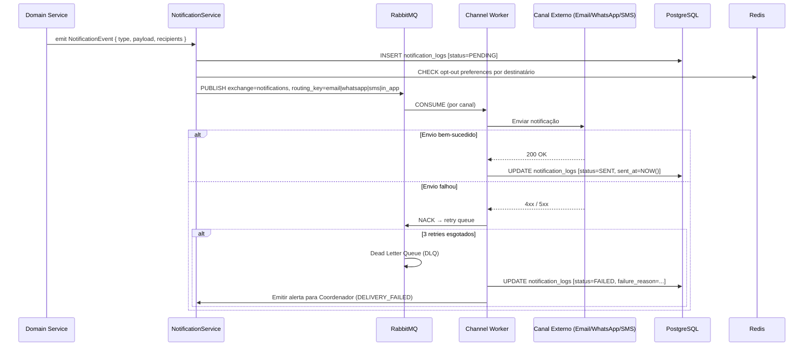

# 21 - Notificações, Templates e Implementação

## Repasse Seguro — Módulo Admin

| **Campo** | **Valor** |
|---|---|
| **Destinatário** | Backend, Produto e Design |
| **Escopo** | Sistema de notificações com canais, templates, fila, opt-out, tracking e testes |
| **Versão** | v1.0 |
| **Responsável** | Claude Code Desktop |
| **Data** | 22/03/2026 — America/Fortaleza |
| **Status** | Aprovado |
| **Dependências** | D01 RN · D08 UX Writing · D11 Mobile · D14 Especificações Técnicas · D16 Documentação de API · D17 Integrações Externas |

---

> 📌 **TL;DR**
>
> - **4 canais ativos:** E-mail (sempre ativo), Painel in-app (sempre ativo), WhatsApp Business (Meta Cloud API), SMS (Twilio — fallback WhatsApp).
> - **22 templates** documentados cobrindo todos os eventos do ciclo de vida de um Caso.
> - **Envio 100% assíncrono:** RabbitMQ exchange `notifications` com DLQ, retry 3× (30s, 2min, 10min).
> - **SLA de entrega:** E-mail em até 5 minutos; Painel em até 30 segundos após evento (RN-062).
> - **Notificações críticas** (bloqueio de conta, fechamento, reversão, SLA estourado) não podem ser desativadas.
> - **Fallback WhatsApp → SMS → log de falha** para destinatários externos (Cedente/Cessionário).
> - **LGPD:** opt-out disponível para notificações não críticas; dados de tracking retidos por 90 dias.

---

## 1. Arquitetura de Notificações

O fluxo de notificações segue o padrão: **evento de domínio → service de notificações → fila RabbitMQ por canal → worker de entrega → tracking**.



> ⚙️ **Regra inegociável:** Nenhuma notificação pode ser enviada de forma síncrona durante a request principal. Todo envio passa pela fila RabbitMQ, mesmo que o worker consuma quase instantaneamente. Envio síncrono é proibido.

---

## 2. Canais

### 2.1 E-mail

| Atributo | Valor |
|---|---|
| **Provedor** | `[DECISÃO AUTÔNOMA]` Resend — API moderna, bounce tracking, templates React Email. Alternativa descartada: SendGrid (custo maior no tier inicial). |
| **Prioridade** | Todos os eventos críticos e de ciclo de vida |
| **Rate limit** | 10 e-mails/segundo global; 5 e-mails/minuto por destinatário |
| **Retry** | 3× com backoff: 30s, 2min, 10min |
| **Fallback** | Sem fallback para e-mail — bounce registrado e Coordenador alertado (RN-064) |
| **Bounce handling** | Webhook Resend → `POST /v1/webhooks/resend` → status `FAILED` + alerta ao Coordenador |
| **SLA** | Fila processada em até 5 minutos após evento (RN-062) |

**Payload padrão:**
```typescript
interface EmailPayload {
  to: string;          // e-mail do destinatário
  subject: string;     // assunto
  template_id: string; // nome do template
  variables: Record<string, string | number>; // variáveis do template
  correlation_id: string;
  priority: 'critical' | 'high' | 'normal' | 'low';
}
```

### 2.2 Painel In-App

| Atributo | Valor |
|---|---|
| **Mecanismo** | Supabase Realtime (WebSocket) — INSERT em `notification_logs` com `channel='in_app'` |
| **Prioridade** | Todos os eventos |
| **Rate limit** | Sem limite (painel interno) |
| **Retry** | Não aplicável — Realtime garante entrega se conexão ativa; mensagens perdidas carregadas no próximo login via query |
| **Persistência** | Notificações armazenadas em `notification_logs`, retidas por 90 dias |
| **SLA** | Exibido em até 30 segundos após evento (RN-062) |
| **Badge** | Ícone de sino na barra superior com contador de não lidas |

### 2.3 WhatsApp Business (Meta Cloud API)

| Atributo | Valor |
|---|---|
| **Destinatários** | Cedente e Cessionário (usuários externos) |
| **Tipo de mensagem** | Templates pré-aprovados pela Meta (HSM) |
| **Rate limit** | Conforme tier de WhatsApp Business Account — padrão 250 conversas/dia |
| **Retry** | 2× com backoff: 1min, 5min |
| **Fallback** | Se falha após 2 retries → SMS via Twilio |
| **Opt-out** | Disponível para notificações não críticas. Críticas (fechamento, reversão, bloqueio) não podem ser desativadas |
| **Referência** | D17 — Integrações Externas, seção ZapSign/Meta |

**Payload padrão:**
```typescript
interface WhatsAppPayload {
  to: string;              // número no formato +5511999999999
  template_name: string;   // nome do template aprovado pela Meta
  language_code: string;   // 'pt_BR'
  components: Array<{
    type: 'body' | 'header' | 'button';
    parameters: Array<{ type: 'text'; text: string }>;
  }>;
  correlation_id: string;
}
```

### 2.4 SMS (Twilio)

| Atributo | Valor |
|---|---|
| **Uso** | Fallback quando WhatsApp falha ou destinatário sem WhatsApp |
| **Destinatários** | Cedente e Cessionário (usuários externos) |
| **Rate limit** | Conforme plano Twilio — padrão 1 msg/seg por número |
| **Retry** | 2× com backoff: 1min, 5min |
| **Fallback** | Se SMS falha após 2 retries → registrar como `FAILED` e alertar Coordenador |
| **Opt-out** | Disponível para notificações não críticas |

---

## 3. Templates

### 3.1 Inventário Completo

| ID | Nome do Template | Evento Gatilho | Canais | Prioridade | Desativável | Variáveis |
|---|---|---|---|---|---|---|
| `T-01` | `rs_caso_captado` | Caso captado (novo cadastro) | E-mail + Painel | High | Não | `case_id`, `analyst_name`, `created_at` |
| `T-02` | `rs_dossie_incompleto` | Documentos pendentes no dossiê | E-mail + Painel + WhatsApp | High | Não | `case_id`, `cedente_name`, `pending_docs[]`, `deadline` |
| `T-03` | `rs_caso_bloqueado` | Caso bloqueado por inadimplência | E-mail + Painel + WhatsApp | Critical | Não | `case_id`, `cedente_name`, `block_reason` |
| `T-04` | `rs_caso_qualificado` | Caso qualificado e publicado | E-mail + Painel + WhatsApp | High | Não | `case_id`, `cedente_name`, `scenario` |
| `T-05` | `rs_nova_proposta` | Nova proposta recebida | E-mail + Painel | High | Não | `case_id`, `analyst_name`, `proposed_value` |
| `T-06` | `rs_contraproposta` | Contraproposta recebida | E-mail + Painel + WhatsApp | High | Não | `case_id`, `counter_value`, `expires_at` |
| `T-07` | `rs_negociacao_escalada` | Negociação escalada para Coordenador | E-mail + Painel | High | Não | `case_id`, `analyst_name`, `escalation_reason` |
| `T-08` | `rs_aceite_confirmado` | Aceite de negociação confirmado | E-mail + Painel + WhatsApp | High | Não | `case_id`, `accepted_value`, `cedente_name`, `cessionario_name` |
| `T-09` | `rs_instrucoes_deposito` | Instruções de depósito na Conta Escrow | E-mail + Painel + WhatsApp | Critical | Não | `case_id`, `cessionario_name`, `escrow_amount`, `pix_key`, `deadline` |
| `T-10` | `rs_lembrete_deposito` | Lembrete de depósito pendente (7 dias úteis) | E-mail + Painel + WhatsApp | High | Não | `case_id`, `cessionario_name`, `escrow_amount`, `days_remaining` |
| `T-11` | `rs_deposito_confirmado` | Depósito confirmado na Conta Escrow | E-mail + Painel | High | Não | `case_id`, `confirmed_amount`, `confirmed_at` |
| `T-12` | `rs_envelope_zapsign` | Envelope ZapSign enviado para assinatura | E-mail via ZapSign | High | Não | Gerenciado pela ZapSign |
| `T-13` | `rs_assinaturas_concluidas` | Todas as assinaturas concluídas | E-mail + Painel | High | Não | `case_id`, `envelope_type`, `signed_at` |
| `T-14` | `rs_fechamento_confirmado` | Fechamento confirmado | E-mail + Painel + WhatsApp | Critical | Não | `case_id`, `cedente_name`, `cessionario_name`, `net_value`, `closed_at` |
| `T-15` | `rs_periodo_reversao` | Início do período de reversão (15 dias) | E-mail + Painel + WhatsApp | Critical | Não | `case_id`, `reversal_deadline`, `cedente_name`, `cessionario_name` |
| `T-16` | `rs_distribuicao_realizada` | Distribuição da Conta Escrow realizada | E-mail + Painel + WhatsApp | Critical | Não | `case_id`, `cedente_amount`, `rs_fee`, `distributed_at` |
| `T-17` | `rs_caso_cancelado` | Caso cancelado | E-mail + Painel + WhatsApp | High | Não | `case_id`, `cedente_name`, `cancel_reason` |
| `T-18` | `rs_sla_proximo` | SLA ≤20% do prazo máximo | Painel (somente) | Normal | Sim | `case_id`, `current_stage`, `sla_deadline`, `sla_percentage_remaining` |
| `T-19` | `rs_sla_estourado` | SLA estourado | E-mail + Painel | Critical | Não | `case_id`, `current_stage`, `overdue_since`, `analyst_name` |
| `T-20` | `rs_escalonamento_sugerido` | Sugestão de escalonamento de cenário | E-mail + Painel + WhatsApp | High | Não | `case_id`, `current_scenario`, `suggested_scenario`, `reason` |
| `T-21` | `rs_reversao_iniciada` | Reversão iniciada | E-mail + Painel + WhatsApp | Critical | Não | `case_id`, `reversal_initiator`, `reversal_reason`, `cedente_name`, `cessionario_name` |
| `T-22` | `rs_mediacao_iniciada` | Mediação iniciada (desistência unilateral) | E-mail + Painel + WhatsApp | Critical | Não | `case_id`, `mediator_name`, `cedente_name`, `cessionario_name` |

### 3.2 Exemplo de Template — E-mail (T-09 Instruções de Depósito)

```typescript
// templates/email/rs_instrucoes_deposito.tsx (React Email)
export function InstrucoesDepositoEmail({ variables }: { variables: T09Variables }) {
  return (
    <Html>
      <Head />
      <Body>
        <Container>
          <Heading>Instruções para Depósito na Conta Escrow</Heading>
          <Text>Olá, {variables.cessionario_name}.</Text>
          <Text>
            O aceite para o Caso {variables.case_id} foi confirmado.
            Realize o depósito no valor de <strong>R$ {variables.escrow_amount}</strong>
            até <strong>{variables.deadline}</strong>.
          </Text>
          <Section>
            <Text><strong>Chave PIX:</strong> {variables.pix_key}</Text>
          </Section>
          <Text>Após o depósito, a formalização será iniciada automaticamente.</Text>
          <Hr />
          <Text style={{ fontSize: '12px', color: '#6b7280' }}>
            Repasse Seguro · {variables.case_id}
          </Text>
        </Container>
      </Body>
    </Html>
  );
}
```

---

## 4. Preferências do Usuário (Opt-Out)

### 4.1 Modelo de Preferências

```typescript
// Schema de preferências no PostgreSQL
interface NotificationPreference {
  user_id: string;
  channel: 'email' | 'whatsapp' | 'sms' | 'in_app';
  category: NotificationCategory;
  enabled: boolean;
  updated_at: Date;
}

type NotificationCategory =
  | 'sla_alert'           // alertas de SLA (desativável)
  | 'case_lifecycle'      // ciclo de vida do caso (NÃO desativável)
  | 'financial'           // eventos financeiros (NÃO desativável)
  | 'formalization'       // formalização e assinaturas (NÃO desativável)
  | 'operational';        // operacional (desativável)
```

### 4.2 Regra de Notificações Críticas

> 🔴 **Regra inegociável:** As categorias `case_lifecycle`, `financial` e `formalization` **nunca podem ser desativadas** pelo usuário, independentemente do canal. Toda tentativa de desativar via API retorna `422 BIZ_001: notificação crítica não pode ser desativada`.

| Categoria | Desativável | Canais afetados | Templates |
|---|---|---|---|
| `case_lifecycle` | Não | Todos | T-01 a T-08, T-14, T-17 |
| `financial` | Não | Todos | T-09, T-10, T-11, T-16 |
| `formalization` | Não | Todos | T-12, T-13, T-15, T-21, T-22 |
| `sla_alert` | Sim (exceto `sla_estourado`) | Painel, E-mail | T-18, T-19 |
| `operational` | Sim | E-mail, WhatsApp, SMS | T-07, T-20 |

### 4.3 API de Preferências

```http
GET /v1/notifications/preferences
→ Lista preferências do usuário autenticado

PATCH /v1/notifications/preferences
Body: { "channel": "whatsapp", "category": "sla_alert", "enabled": false }
→ 200 OK | 422 BIZ_001 (categoria crítica)

PUT /v1/notifications/preferences/reset
→ Restaurar defaults do perfil
```

---

## 5. Fila e Processamento

### 5.1 Configuração RabbitMQ

| Exchange | Tipo | Routing Keys | DLQ |
|---|---|---|---|
| `rs.notifications` | Topic | `email`, `whatsapp`, `sms`, `in_app` | `rs.notifications.dlq` |

**Queues por canal:**

| Queue | Routing Key | Concorrência | Prefetch | DLQ TTL |
|---|---|---|---|---|
| `notifications.email` | `email` | 5 workers | 10 | 24h |
| `notifications.whatsapp` | `whatsapp` | 3 workers | 5 | 6h |
| `notifications.sms` | `sms` | 3 workers | 5 | 6h |
| `notifications.in_app` | `in_app` | 10 workers | 50 | 1h |

### 5.2 Retry Policy

```typescript
// retry.config.ts
export const notificationRetryConfig = {
  email: {
    maxRetries: 3,
    delays: [30_000, 120_000, 600_000], // 30s, 2min, 10min
  },
  whatsapp: {
    maxRetries: 2,
    delays: [60_000, 300_000],          // 1min, 5min → fallback SMS
  },
  sms: {
    maxRetries: 2,
    delays: [60_000, 300_000],          // 1min, 5min → DLQ + alerta
  },
  in_app: {
    maxRetries: 1,
    delays: [5_000],                    // 5s → DLQ (carregado no próximo login)
  },
};
```

### 5.3 Lógica de Fallback WhatsApp → SMS

```typescript
// workers/whatsapp.worker.ts
async function processWhatsAppNotification(msg: NotificationJob) {
  try {
    await metaCloudApi.sendTemplate(msg.payload);
    await updateNotificationLog(msg.id, 'SENT', 'whatsapp');
  } catch (error) {
    if (msg.retryCount >= 2) {
      // Fallback para SMS
      await rabbitMQ.publish('rs.notifications', 'sms', {
        ...msg,
        channel: 'sms',
        retryCount: 0,
        fallback_from: 'whatsapp',
      });
      await updateNotificationLog(msg.id, 'FALLBACK_SMS', 'whatsapp');
    } else {
      throw error; // RabbitMQ irá retentar
    }
  }
}
```

---

## 6. Tracking e Métricas

### 6.1 Schema de Evento de Tracking

Cada notificação gera um registro em `notification_logs`:

```typescript
interface NotificationLog {
  id: string;           // UUID v4
  correlation_id: string;
  template_id: string;
  event_type: string;   // ex: 'rs_caso_captado'
  channel: 'email' | 'whatsapp' | 'sms' | 'in_app';
  recipient_id: string; // UUID do usuário
  recipient_contact: string; // e-mail ou telefone (hash em logs)
  status: NotificationStatus;
  failure_reason?: string;
  sent_at?: Date;
  delivered_at?: Date;  // confirmado via webhook do provedor
  read_at?: Date;       // apenas in-app
  retry_count: number;
  fallback_channel?: string;
  case_id?: string;     // contexto do caso quando aplicável
  created_at: Date;
}

type NotificationStatus =
  | 'PENDING'
  | 'QUEUED'
  | 'SENT'
  | 'DELIVERED'
  | 'READ'          // apenas in-app
  | 'FAILED'
  | 'FALLBACK_SMS'  // WhatsApp → SMS ativado
  | 'BOUNCED';      // e-mail inválido
```

### 6.2 Eventos de Tracking

| Evento | Trigger | Canal |
|---|---|---|
| `PENDING` | Notificação criada, aguardando fila | Todos |
| `QUEUED` | Publicado no RabbitMQ | Todos |
| `SENT` | Enviado ao provedor com sucesso | Todos |
| `DELIVERED` | Webhook de confirmação do provedor | E-mail (Resend), WhatsApp (Meta) |
| `READ` | Usuário abriu o painel e marcou como lida | In-app |
| `FAILED` | Retries esgotados + fallback esgotado | Todos |

### 6.3 Métricas Dashboard (Supervisão Interna)

| Métrica | Período | Alerta |
|---|---|---|
| Taxa de falha por canal | 24h rolling | > 5% → alerta Slack `#alertas-producao` |
| SLA de entrega (e-mail) | Real-time | > 5min mediana → alerta |
| Notificações na DLQ | Real-time | > 0 → alerta imediato |
| Taxa de bounce (e-mail) | 7 dias | > 2% → alerta ao Master |
| Fallback WhatsApp→SMS | 24h | > 10% → alerta de degradação WhatsApp |

---

## 7. Testes

### 7.1 Modo Preview (Desenvolvimento)

```typescript
// config/notifications.ts
if (process.env.NODE_ENV === 'development') {
  // Interceptar todos os envios — nunca atingir provedores reais
  notificationService.setInterceptor((payload) => {
    logger.info({ payload }, '[PREVIEW] Notificação interceptada');
    return { status: 'SENT', message_id: `preview_${Date.now()}` };
  });
}
```

### 7.2 Testes de Integração Obrigatórios

| Cenário | Canal | Validação |
|---|---|---|
| Template com variáveis ausentes | E-mail | Erro de validação antes de enfileirar |
| Bounce de e-mail | E-mail | Status `BOUNCED` + alerta ao Coordenador |
| Retry após falha | WhatsApp | 2 retries com delay correto; fallback SMS ativado |
| Notificação crítica com opt-out | E-mail | Ignorar opt-out; enviar normalmente |
| SLA de fila (< 5min) | E-mail | Medir tempo event → SENT em ambiente staging |
| Opt-out de categoria não crítica | WhatsApp | Não enfileirar se opt-out ativo |

---

## 8. LGPD e Compliance

| Dado | Tratamento | Base Legal | Retenção |
|---|---|---|---|
| E-mail do destinatário | Armazenado em `notification_logs.recipient_contact` | Execução de contrato | 90 dias |
| Telefone (WhatsApp/SMS) | Armazenado em `notification_logs.recipient_contact` | Execução de contrato | 90 dias |
| Conteúdo das mensagens | Não armazenado no log — apenas template_id + variáveis | — | Não armazenado |
| Histórico de opt-out | Armazenado em `notification_preferences` | Legítimo interesse | Indefinido (até exclusão) |

> 🔴 **Regra LGPD:** O conteúdo renderizado da mensagem (texto completo) nunca é armazenado. Apenas o `template_id` e as `variables` são logados. Em caso de solicitação de acesso LGPD, reconstituir via template + variáveis salvas. Dados de contato retidos por 90 dias após o evento — purgados automaticamente por job diário.

---

## 9. Anti-Patterns

### ❌ Anti-exemplo 1 — Template hardcoded no código

```typescript
// ERRADO
await emailService.send({
  to: user.email,
  subject: 'Depósito confirmado',
  body: `Olá ${user.name}, seu depósito de R$ ${amount} foi confirmado.`,
});

// CORRETO — template versionado com variáveis
await notificationService.emit({
  template_id: 'rs_deposito_confirmado',
  channel: 'email',
  recipient_id: user.id,
  variables: { case_id, confirmed_amount: amount, confirmed_at },
});
```

### ❌ Anti-exemplo 2 — Envio síncrono na request principal

```typescript
// ERRADO — bloqueia a resposta ao cliente
async function confirmDeposit(caseId: string) {
  await escrowService.confirm(caseId);
  await emailService.send(depositConfirmedEmail); // BLOQUEIA
  return { status: 'ok' };
}

// CORRETO — publicar evento na fila e retornar imediatamente
async function confirmDeposit(caseId: string) {
  await escrowService.confirm(caseId);
  await rabbitMQ.publish('rs.notifications', 'email', { template_id: 'rs_deposito_confirmado', ... });
  return { status: 'ok' }; // resposta imediata ao cliente
}
```

### ❌ Anti-exemplo 3 — Push sem deep link contextual

```typescript
// ERRADO
await expoPush.send({ to: deviceToken, body: 'Seu depósito foi confirmado.' });

// CORRETO — deep link contextual
await expoPush.send({
  to: deviceToken,
  body: 'Depósito confirmado no Caso #12345.',
  data: { deep_link: 'repasseseguro://cases/uuid/escrow' },
});
```

### ❌ Anti-exemplo 4 — Desativar notificação crítica via opt-out

```typescript
// ERRADO — verificar opt-out sem distinguir categoria crítica
if (!userPreferences.emailEnabled) return; // desativa até notificações críticas

// CORRETO — respeitar opt-out somente para categorias não críticas
const isCritical = CRITICAL_CATEGORIES.includes(templateConfig.category);
if (!isCritical && !userPreferences.emailEnabled) return;
// categorias críticas sempre enviam
```

---

## 10. Glossário

| Termo | Definição |
|---|---|
| **Template** | Modelo de mensagem versionado com variáveis dinâmicas — nunca hardcoded |
| **DLQ** | Dead Letter Queue — fila de mensagens que falharam após todos os retries |
| **Bounce** | E-mail não entregue por endereço inválido ou caixa cheia |
| **Fallback** | Canal alternativo ativado quando canal primário falha (WhatsApp → SMS) |
| **HSM** | Highly Structured Message — template WhatsApp pré-aprovado pela Meta |
| **Opt-out** | Desativação voluntária de um tipo de notificação pelo usuário |
| **Tracking** | Registro de cada etapa do ciclo de vida de uma notificação |
| **SLA de entrega** | Tempo máximo garantido entre o evento e a notificação chegar ao destinatário |

---

## 11. Changelog

| Versão | Data | Autor | Descrição |
|---|---|---|---|
| v1.0 | 22/03/2026 | Claude Code Desktop | Versão inicial — 4 canais, 22 templates, fila RabbitMQ com DLQ, retry por canal, fallback WhatsApp→SMS, opt-out com proteção de categorias críticas, tracking end-to-end, LGPD. |

---

## 12. Backlog de Pendências

| Item | Marcador | Seção | Justificativa / Trade-off | Impacto | Dono | Status |
|---|---|---|---|---|---|---|
| Provedor de e-mail: Resend | `[DECISÃO AUTÔNOMA]` | 2.1 | Resend: API moderna, templates React Email, custo menor no tier inicial. Alternativa: SendGrid (maior custo, mais maduro em enterprise). Critério: custo inicial + DX para geração por IA. | Custo operacional | Engenharia | Decidido |
