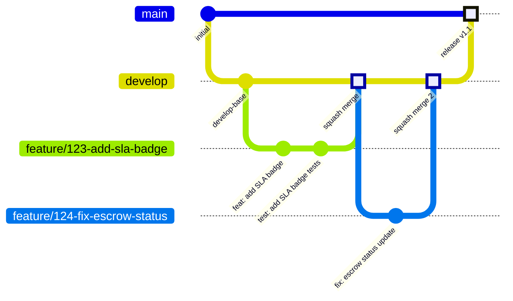
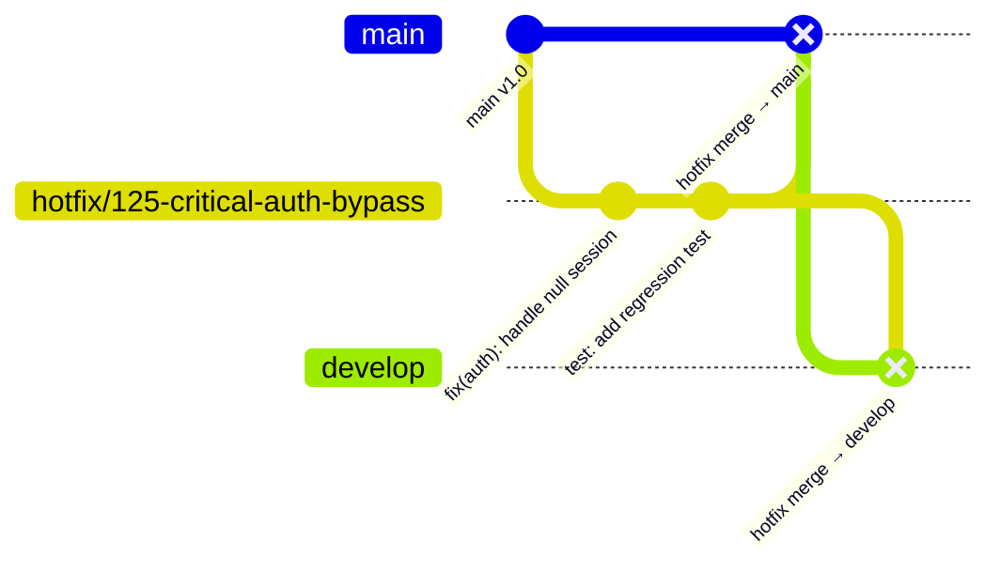

# 23 - Guia de Contribuição

## Repasse Seguro — Módulo Admin

| **Campo** | **Valor** |
|---|---|
| **Destinatário** | Engenharia |
| **Escopo** | Regras de contribuição: branching, commits, PR flow, review, merge e hotfix |
| **Versão** | v1.0 |
| **Responsável** | Claude Code Desktop |
| **Data** | 22/03/2026 — America/Fortaleza |
| **Status** | Aprovado |
| **Dependências** | D02 Stacks · D22 Guia de Ambiente, Setup Local e Secrets |

---

> 📌 **TL;DR**
>
> - **Branching:** trunk-based com `main` (produção) + `develop` (staging) + branches de feature de curta duração (máximo 3 dias).
> - **Commits:** Conventional Commits obrigatório — `tipo(escopo): descrição` — `feat`, `fix`, `refactor`, `test`, `chore`, `ci`, `docs`, `style`.
> - **PR:** máximo 400 linhas, template obrigatório, 1 aprovação mínima, SLA de review de 24h.
> - **Merge:** squash para features e bugfix; merge commit para releases e hotfix.
> - **Hotfix:** branch `hotfix/` a partir de `main`, aprovação express (2h), deploy direto.
> - **Branches protegidas:** `main` e `develop` — push direto proibido para ambas.
> - **CI obrigatório:** type-check + lint + testes passando antes de qualquer merge em `develop` ou `main`.

---

## 1. Branching Strategy

### 1.1 Modelo

**`[DECISÃO AUTÔNOMA]`** — Trunk-based development com dois branches de longa duração (`main` e `develop`).

- **Opção escolhida:** Trunk-based com `main` + `develop` + feature branches de curta duração.
- **Alternativa descartada:** Git-flow completo (`main`, `develop`, `release/*`, `feature/*`, `hotfix/*`) — overhead desnecessário para equipe pequena operada por Claude Code Desktop. Mais branches = mais conflitos e rebase sem ganho proporcional.
- **Critério:** previsibilidade de integração contínua, minimizar branches de longa duração, facilitar deploy automatizado.

### 1.2 Branches Protegidas

| Branch | Proteção | Acesso |
|---|---|---|
| `main` | Push direto proibido. Merge somente via PR com 1 aprovação + CI passing. | Merge autorizado: Tech Lead ou CD automático via tag |
| `develop` | Push direto proibido. Merge somente via PR com 1 aprovação + CI passing. | Merge autorizado: qualquer membro aprovado |

### 1.3 Nomenclatura de Branches

| Tipo | Prefixo | Formato | Exemplo |
|---|---|---|---|
| Feature | `feature/` | `feature/{issue-id}-descricao-curta` | `feature/123-add-sla-badge` |
| Bugfix | `bugfix/` | `bugfix/{issue-id}-descricao-curta` | `bugfix/124-fix-escrow-status` |
| Hotfix | `hotfix/` | `hotfix/{issue-id}-descricao-curta` | `hotfix/125-critical-auth-bypass` |
| Refactor | `refactor/` | `refactor/{issue-id}-descricao-curta` | `refactor/126-extract-case-service` |
| Chore | `chore/` | `chore/{escopo}-descricao-curta` | `chore/update-prisma-schema` |

> ⚙️ **Regra:** branches de feature devem durar no máximo **3 dias úteis**. Features grandes devem ser divididas em PRs menores com feature flags se necessário.

### 1.4 Diagrama do Fluxo



---

## 2. Convenção de Commits

### 2.1 Formato Obrigatório (Conventional Commits)

```
tipo(escopo): descrição curta em minúsculas (máximo 72 chars)

[corpo opcional — explicar o porquê, não o quê]

[rodapé opcional — issue refs, breaking changes]
```

### 2.2 Tipos Permitidos

| Tipo | Quando usar |
|---|---|
| `feat` | Nova funcionalidade visível ao usuário |
| `fix` | Correção de bug |
| `refactor` | Refatoração sem mudança de comportamento |
| `test` | Adição ou correção de testes |
| `chore` | Tarefas de manutenção: dependências, config, build |
| `ci` | Alterações no pipeline de CI/CD |
| `docs` | Documentação apenas |
| `style` | Formatação, espaçamento (sem mudança de lógica) |
| `perf` | Melhoria de performance |

### 2.3 Escopos Recomendados

| Escopo | Módulo |
|---|---|
| `auth` | Autenticação e autorização |
| `cases` | Casos e ciclo de vida |
| `escrow` | Conta Escrow e financeiro |
| `zapsign` | Integração ZapSign |
| `ai` | Agentes de IA e Supervisão IA |
| `notifications` | Sistema de notificações |
| `users` | Gestão de usuários |
| `ui` | Componentes de UI (SPA) |
| `mobile` | App Mobile |
| `infra` | Infraestrutura, Docker, CI |
| `prisma` | Schema e migrations |

### 2.4 Exemplos — Bons vs. Ruins

| ✅ Correto | ❌ Incorreto |
|---|---|
| `feat(cases): add SLA countdown timer to case card` | `fix stuff` |
| `fix(auth): handle account locked response with timer` | `update` |
| `refactor(escrow): extract distribution logic to service` | `WIP` |
| `test(ai): add unit tests for confidence threshold guard` | `changes` |
| `chore(prisma): add index on case_status_history.case_id` | `misc` |
| `ci: add type-check step before test in CI pipeline` | `minor fix` |
| `docs(api): update auth endpoints in OpenAPI spec` | `some fixes` |

> 🔴 **Proibido:** commits com mensagem genérica como `fix`, `update`, `WIP`, `changes`, `misc`. Commits assim são bloqueados pelo commitlint no pre-commit hook.

---

## 3. Pull Request Flow

### 3.1 Template de PR

```markdown
## Descrição
<!-- O que foi feito e por quê — máximo 3 parágrafos -->

## Tipo de Mudança
- [ ] Nova funcionalidade (feat)
- [ ] Correção de bug (fix)
- [ ] Refatoração (refactor)
- [ ] Chore / CI / Docs

## Checklist
- [ ] Código compila sem erros (`pnpm typecheck`)
- [ ] Lint sem erros (`pnpm lint`)
- [ ] Testes passando (`pnpm test`)
- [ ] Migrations criadas se houver mudança no schema
- [ ] `pnpm --filter api prisma generate` rodado após mudança de schema
- [ ] Sem dados sensíveis hardcoded (senhas, tokens, API keys)
- [ ] Comportamento testado localmente

## Referência
<!-- Issue: #123 | Jira: RS-456 -->

## Screenshots / Vídeo (UI)
<!-- Se aplicável: antes / depois -->
```

### 3.2 Regras de Tamanho

| Métrica | Limite | O que fazer quando excede |
|---|---|---|
| Linhas alteradas por PR | 400 linhas | Dividir em PRs menores com escopo claro |
| Arquivos alterados | 20 arquivos | Separar por domínio (ex: backend + frontend em PRs separados) |
| Número de commits | Sem limite | Squash no merge elimina o histórico interno |

### 3.3 Regras de Abertura

- PR sem template preenchido é **fechado imediatamente** sem review.
- PR com título genérico (`"fixes"`, `"update"`) é **fechado imediatamente**.
- PR que mistura features não relacionadas é **fechado imediatamente** — abrir dois PRs separados.
- PR deve ser aberto como **draft** enquanto ainda em progresso; converter para "Ready for Review" apenas quando concluído.

### 3.4 SLA de Review

| Prioridade | SLA | Quando usar |
|---|---|---|
| Normal | 24h úteis | Feature ou refactor padrão |
| Urgente | 4h | Bugfix em staging que bloqueia QA |
| Express (Hotfix) | 2h | Correção crítica em produção |

---

## 4. Code Review Guidelines

### 4.1 Critérios de Verificação (ordem de prioridade)

1. **Funcionalidade:** o código faz o que diz que faz? Os casos de borda estão cobertos?
2. **Testes:** os testes cobrem o caminho feliz e pelo menos 1 caso de borda?
3. **Segurança:** nenhum dado sensível exposto, sem SQL injection, sem XSS, sem privilege escalation?
4. **Legibilidade:** outro dev entenderia o código sem perguntar ao autor?
5. **Performance:** há queries N+1 óbvias? Alguma chamada síncrona que deveria ser assíncrona?
6. **Padrões:** segue a arquitetura de pastas (D15), nomenclatura (D10) e Error Classes (D20)?

### 4.2 Bloqueadores de Aprovação (Request Changes)

O reviewer **deve** solicitar mudanças se:
- Dado sensível (senha, token, CPF) em log ou resposta de erro
- Teste faltando para lógica de negócio nova
- Transação de banco sem rollback em operação multi-step
- `any` em TypeScript sem justificativa inline
- Error engolido sem log nem propagação
- Violação de regra de negócio documentada nos RNs

### 4.3 Sugestões (sem bloqueio)

O reviewer pode sugerir sem bloquear:
- Nomes mais descritivos de variáveis
- Extração de função para melhorar leitura
- Comentário explicativo em lógica não óbvia
- Performance: usar `select` no Prisma em vez de buscar todos os campos

### 4.4 Tom de Feedback

- Sempre sobre o código, nunca sobre a pessoa.
- Sugestão: "Considero extrair X para melhorar a leitura — o que acha?"
- Bloqueador: "Este campo expõe CPF em plaintext no log — necessário mascarar antes do merge."
- Nunca: "Isso está errado" sem contexto ou sugestão.

---

## 5. Merge Strategy

### 5.1 Regra por Tipo de Branch

| Origem | Destino | Estratégia | Motivo |
|---|---|---|---|
| `feature/*` | `develop` | Squash merge | Histório limpo — 1 commit por feature |
| `bugfix/*` | `develop` | Squash merge | Idem |
| `refactor/*` | `develop` | Squash merge | Idem |
| `develop` | `main` | Merge commit | Preservar histórico de releases |
| `hotfix/*` | `main` E `develop` | Merge commit | Rastreabilidade de correção crítica |

### 5.2 Quem Faz o Merge

- `feature/*` → `develop`: **autor do PR**, após aprovação de 1 reviewer
- `develop` → `main`: **Tech Lead** ou **CI/CD automático via tag**
- `hotfix/*` → `main`: **Tech Lead** após aprovação express

### 5.3 Regras de Rebase

- **Rebase é proibido** em branches que outros membros já puxaram (sem `--force-push` em branches compartilhadas).
- Antes de abrir o PR, fazer `git rebase develop` localmente para incorporar mudanças recentes.
- Conflitos no PR: **o autor do PR** é responsável por resolvê-los via rebase local + force push na própria branch de feature.

---

## 6. Hotfix Flow

Hotfix é usado exclusivamente para bugs críticos **em produção** que impactam usuários ativamente.

### 6.1 Critério para Hotfix

| Situação | Hotfix? |
|---|---|
| Login bloqueado para todos os usuários | ✅ Sim |
| Dados financeiros incorretos na Conta Escrow | ✅ Sim |
| Bug de segurança (exposição de dados) | ✅ Sim |
| Feature com comportamento inesperado não crítico | ❌ Não — bugfix normal |
| Erro de UI que não afeta operação | ❌ Não — bugfix normal |

### 6.2 Fluxo de Hotfix



### 6.3 Procedimento

1. Criar `hotfix/{issue-id}-descricao` a partir de `main` (não de `develop`).
2. Implementar correção mínima + teste de regressão.
3. Abrir PR com título `[HOTFIX]` prefixando o título.
4. Notificar Tech Lead no canal `#eng-hotfix` com link do PR.
5. Review express (SLA 2h) por Tech Lead.
6. Merge para `main` → deploy imediato.
7. Merge para `develop` — sem abrir novo PR (cherry-pick ou merge direto).
8. Criar tag de patch (`v1.0.1`) no commit de merge em `main`.

---

## 7. CI/CD Integration

### 7.1 Checks Obrigatórios Antes do Merge

Todo PR para `develop` ou `main` deve passar nos seguintes checks automatizados:

| Check | Comando | Bloqueia merge se falhar? |
|---|---|---|
| Type check | `pnpm typecheck` | Sim |
| Lint | `pnpm lint` | Sim |
| Testes unitários + integração | `pnpm test` | Sim |
| Prisma schema válido | `pnpm --filter api prisma validate` | Sim |
| Build de produção | `pnpm build` | Sim (apenas para merge em `main`) |

### 7.2 Pre-commit Hooks (Local)

```bash
# .husky/pre-commit (configurado via husky + lint-staged)
#!/bin/sh
pnpm lint-staged
```

```json
// package.json (raiz)
{
  "lint-staged": {
    "**/*.{ts,tsx}": ["eslint --fix", "prettier --write"],
    "apps/api/prisma/schema.prisma": ["prisma format"]
  }
}
```

### 7.3 Commit Message Validation

```bash
# .husky/commit-msg
#!/bin/sh
npx --no -- commitlint --edit "$1"
```

Regex do commitlint: `^(feat|fix|refactor|test|chore|ci|docs|style|perf)(\(.+\))?: .{1,72}$`

---

## 8. Release Flow

### 8.1 Versioning (Semver)

| Tipo de Release | Versão | Quando |
|---|---|---|
| Feature release | `MINOR` (v1.1.0) | Novas funcionalidades sem breaking change |
| Bugfix release | `PATCH` (v1.0.1) | Correções sem nova funcionalidade |
| Breaking change | `MAJOR` (v2.0.0) | Mudanças de API incompatíveis |
| Hotfix | `PATCH` (v1.0.1) | Correção crítica em produção |

### 8.2 Processo de Release

1. Validar que todos os PRs do sprint estão merged em `develop`.
2. Executar smoke tests em staging.
3. Criar PR `develop` → `main` com título `release: v{versão}`.
4. Tech Lead revisa e aprova.
5. Merge em `main` → deploy automático via Railway (vide D24).
6. Criar tag Git: `git tag v{versão} && git push origin v{versão}`.
7. Atualizar `CHANGELOG.md` com os commits da release.

---

## 9. Glossário

| Termo | Definição |
|---|---|
| **Squash merge** | Combinar todos os commits de uma branch em um único commit no destino |
| **Merge commit** | Manter todos os commits originais + criar um commit de merge |
| **Trunk-based** | Estratégia onde branches de feature duram pouco e são integradas frequentemente ao branch principal |
| **Conventional Commits** | Especificação de formato de commit messages com tipo, escopo e descrição |
| **Pre-commit hook** | Script executado automaticamente antes de criar um commit local |
| **CI/CD** | Continuous Integration / Continuous Deployment — automação de build, testes e deploy |
| **Cherry-pick** | Copiar commits específicos de uma branch para outra sem merge completo |
| **Draft PR** | PR marcado como rascunho — sinaliza trabalho em progresso, não solicita review |

---

## 10. Changelog

| Versão | Data | Autor | Descrição |
|---|---|---|---|
| v1.0 | 22/03/2026 | Claude Code Desktop | Versão inicial — trunk-based branching, Conventional Commits, template de PR, SLA de review, squash merge, hotfix flow, pre-commit hooks, release flow. |

---

## 11. Backlog de Pendências

| Item | Marcador | Seção | Justificativa | Impacto | Dono | Status |
|---|---|---|---|---|---|---|
| Branching trunk-based vs Git-flow | `[DECISÃO AUTÔNOMA]` | 1.1 | Trunk-based escolhido por simplicidade e velocidade de integração. Git-flow descartado por overhead para equipe pequena com CI/CD automatizado. | Fluxo de trabalho | Engenharia | Decidido |
