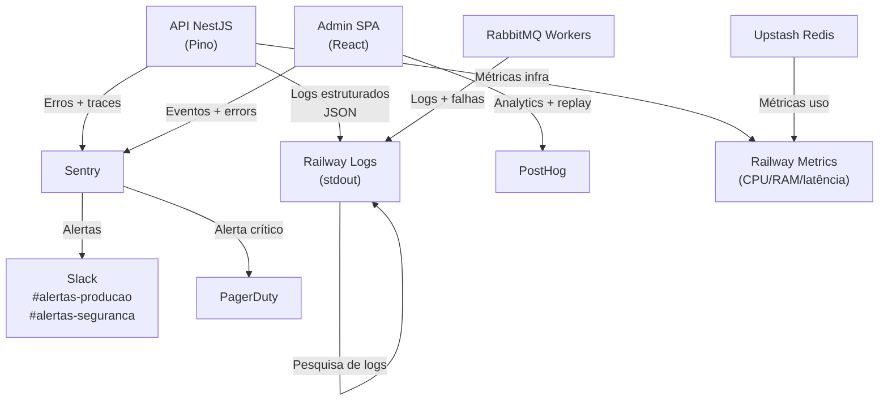

# 25 - Observabilidade e Logs

## Repasse Seguro — Módulo Admin

| **Campo** | **Valor** |
|---|---|
| **Destinatário** | Backend, DevOps e Operação |
| **Escopo** | Estratégia de logs, métricas, alertas, dashboards, retenção e resposta operacional |
| **Versão** | v1.0 |
| **Responsável** | Claude Code Desktop |
| **Data** | 22/03/2026 — America/Fortaleza |
| **Status** | Aprovado |
| **Dependências** | D02 Stacks · D14 Especificações Técnicas · D16 Documentação de API |

---

> 📌 **TL;DR**
>
> - **Stack:** Pino (logs estruturados), Sentry (error tracking + alertas), PostHog (analytics SPA), Railway metrics (infra), Upstash Redis metrics.
> - **Correlation ID** obrigatório em todo log, toda resposta de erro e todo job de fila — gerado no gateway e propagado até DLQ.
> - **4 níveis de log:** `debug` (dev only), `info`, `warn`, `error` — cada um com retenção e destinatário diferente.
> - **Dados proibidos em logs:** senha, token JWT, CPF em texto, PIX key, `api_key`, `secret` — masking obrigatório via `pino-serializers`.
> - **10 métricas definidas** com threshold e ação esperada — nenhuma métrica decorativa.
> - **6 alertas críticos** com severidade, canal e SOP vinculado.
> - **Retenção:** logs `error` e `warn` — 90 dias; `info` — 30 dias; auditoria — 5 anos.

---

## 1. Arquitetura de Observabilidade



**Papéis das ferramentas:**

| Ferramenta | Papel | Acesso |
|---|---|---|
| **Pino** (NestJS) | Logs estruturados JSON — toda camada da API e workers | Interno |
| **Railway Logs** | Agregação e pesquisa de stdout/stderr em produção e staging | DevOps, Engenharia |
| **Sentry** | Error tracking, performance tracing, alertas de exceção | Engenharia |
| **PostHog** | Analytics de uso do SPA, session replay, feature flags | Produto, Engenharia |
| **Railway Metrics** | CPU, RAM, latência de request, deployment health | DevOps |
| **Upstash Console** | Métricas de Redis (hit rate, latência, uso de memória) | DevOps |

---

## 2. Níveis de Log

| Nível | Quando usar | Campos obrigatórios | Retenção | Consome |
|---|---|---|---|---|
| `debug` | Rastreamento de execução detalhado — somente em `development` | `message`, `context`, `correlation_id` | Nenhuma (não persistido em prod) | Dev local |
| `info` | Eventos de negócio relevantes: caso criado, login, status mudado, job executado | `message`, `context`, `correlation_id`, `event_type`, `actor_id` | 30 dias | Engenharia, Operação |
| `warn` | Erros esperados (VAL, AUTH, BIZ): falha de validação, sessão expirada, lock otimista | `message`, `error_code`, `correlation_id`, `request_path` | 30 dias | Engenharia |
| `error` | Erros inesperados: INT_001, EXT_001, falha crítica de agente, job na DLQ | `message`, `error_code`, `correlation_id`, `stack` (interno), `context` | 90 dias | Engenharia, On-call |

> ⚙️ **Regra:** `debug` é explicitamente bloqueado em `production` e `staging` via `LOG_LEVEL=info` nas variáveis de ambiente. Nenhum `console.log()` é permitido — apenas `logger.*()` do Pino.

---

## 3. Formato de Log Estruturado

### 3.1 Schema Padrão

```json
{
  "level": "info",
  "timestamp": "2026-03-22T10:00:00.000Z",
  "service": "api",
  "version": "1.0.0",
  "environment": "production",
  "context": "CasesService",
  "message": "Case status updated",
  "correlation_id": "a1b2c3d4-e5f6-7890-abcd-ef1234567890",
  "request_id": "req_b2c3d4e5",
  "actor_id": "user_uuid",
  "actor_role": "ANALISTA",
  "event_type": "CASE_STATUS_UPDATED",
  "metadata": {
    "case_id": "case_uuid",
    "from_status": "EM_TRIAGEM",
    "to_status": "QUALIFICADO"
  }
}
```

### 3.2 Log de Erro (com masking)

```json
{
  "level": "error",
  "timestamp": "2026-03-22T10:05:00.000Z",
  "service": "api",
  "context": "GlobalExceptionFilter",
  "message": "External service error",
  "correlation_id": "b2c3d4e5-f6a7-8901-bcde-f12345678901",
  "error_code": "EXT_001",
  "request_path": "/v1/cases/uuid/zapsign",
  "request_method": "POST",
  "actor_id": "user_uuid",
  "metadata": {
    "service": "ZapSign",
    "upstream_status": 503
  }
}
```

**O campo `stack` é incluído apenas no log interno — nunca na resposta ao cliente.**

### 3.3 Configuração Pino com Sanitização

```typescript
// logger/pino.config.ts
export const pinoLoggerOptions: LoggerOptions = {
  level: process.env.LOG_LEVEL || 'info',
  redact: {
    paths: [
      'req.headers.authorization',
      'req.headers.cookie',
      '*.password',
      '*.token',
      '*.secret',
      '*.api_key',
      '*.cpf',
      '*.pix_key',
      '*.credit_card',
    ],
    censor: '[REDACTED]',
  },
  serializers: {
    req: (req) => ({
      id: req.id,
      method: req.method,
      url: req.url,
      // headers NÃO incluídos
    }),
    err: (err) => ({
      type: err.constructor?.name,
      message: err.message,
      // stack apenas em development
      ...(process.env.NODE_ENV !== 'production' && { stack: err.stack }),
    }),
  },
  transport: process.env.NODE_ENV === 'development'
    ? { target: 'pino-pretty', options: { colorize: true } }
    : undefined,
};
```

---

## 4. O que Logar

| Evento | Nível | Campos Obrigatórios | Risco Coberto |
|---|---|---|---|
| Login bem-sucedido | `info` | `actor_id`, `actor_role`, `ip_hash`, `event_type=USER_LOGIN` | Auditoria de acesso |
| Login falhou (senha incorreta) | `warn` | `email_hash`, `ip_hash`, `attempt_count`, `event_type=LOGIN_FAILED` | Brute force |
| Conta bloqueada | `warn` | `actor_id`, `ip_hash`, `locked_until`, `event_type=ACCOUNT_LOCKED` | Segurança |
| Logout | `info` | `actor_id`, `jti`, `event_type=USER_LOGOUT` | Auditoria de sessão |
| Caso criado | `info` | `actor_id`, `case_id`, `scenario`, `event_type=CASE_CREATED` | Rastreabilidade |
| Status do caso alterado | `info` | `actor_id`, `case_id`, `from_status`, `to_status`, `event_type=CASE_STATUS_UPDATED` | Ciclo de vida |
| Configuração global alterada | `info` | `actor_id`, `config_key`, `old_value_hash`, `new_value_hash`, `event_type=CONFIG_UPDATED` | Auditoria de configuração |
| Distribuição escrow executada | `info` | `actor_id`, `case_id`, `escrow_id`, `amount_brl`, `event_type=ESCROW_DISTRIBUTED` | Financeiro |
| Serviço externo retornou erro | `error` | `correlation_id`, `service`, `upstream_status`, `endpoint` | Integração |
| Job na DLQ (dead letter) | `error` | `correlation_id`, `queue`, `job_type`, `retry_count`, `failure_reason` | Confiabilidade |
| Agente IA executou ação | `info` | `agent_name`, `case_id`, `action`, `confidence_score`, `execution_id` | Supervisão IA |
| Falha crítica de agente | `error` | `agent_name`, `case_id`, `failure_type`, `execution_id` | Supervisão IA |
| Token JWT rejeitado (blacklist) | `warn` | `jti_hash`, `ip_hash`, `event_type=TOKEN_REVOKED_USED` | Segurança |

---

## 5. O que Não Logar

> 🔴 **Dados proibidos em qualquer log:**

| Dado | Regra |
|---|---|
| `password`, `password_hash` | Nunca logar — nem em debug |
| JWT completo (access ou refresh) | Logar apenas `jti` (ID do token) |
| CPF, RG, passaporte | Hash SHA-256 truncado em 8 chars: `sha256:ab12ef34` |
| Chave PIX, dados bancários | Mascarar: `****1234` |
| `api_key`, `secret`, `client_secret` | `[REDACTED]` via `pino.redact` |
| Headers `Authorization`, `Cookie` | Não serializar — removidos em `req serializer` |
| E-mail completo | Hash em logs de auditoria: `sha256:f3d9ab12` |
| Telefone | Mascarar: `+55 (11) ****-5678` |
| Conteúdo de mensagens WhatsApp/SMS | Apenas `template_id` + hash de variáveis |
| Stack trace em resposta ao cliente | Apenas em `pino.error()` interno |

**Revisão:** auditoria automática de logs via Sentry antes de cada release — qualquer match no pattern `/(cpf|password|token|secret|pix)/i` em plaintext gera alerta de segurança.

---

## 6. Correlation ID e Rastreabilidade

### 6.1 Geração e Propagação

```typescript
// middleware/correlation-id.middleware.ts
@Injectable()
export class CorrelationIdMiddleware implements NestMiddleware {
  use(req: Request, res: Response, next: NextFunction) {
    const correlationId =
      (req.headers['x-correlation-id'] as string) ?? randomUUID();
    req['correlationId'] = correlationId;
    res.setHeader('x-correlation-id', correlationId);

    // Disponível em todo logger.child({ correlationId })
    const logger = pino.child({ correlation_id: correlationId });
    req['logger'] = logger;
    next();
  }
}
```

### 6.2 Propagação por Camada

| Camada | Mecanismo | Campo |
|---|---|---|
| HTTP Request | Header `X-Correlation-Id` | `req.headers['x-correlation-id']` |
| NestJS Service | `req['correlationId']` injetado via middleware | `logger.child({ correlation_id })` |
| RabbitMQ Job | Campo `correlation_id` no payload da mensagem | `msg.properties.correlationId` |
| Worker assíncrono | Propagado desde o payload do job | `job.correlation_id` |
| Resposta de erro ao cliente | Campo `correlation_id` no body RFC 7807 | `res.body.correlation_id` |
| Sentry | Tag `correlation_id` no contexto do evento | `Sentry.setTag('correlation_id', id)` |
| Auditoria | Coluna `correlation_id` em `audit.audit_logs` | Persistido no INSERT |

---

## 7. Métricas

### 7.1 Métricas de Aplicação

| Métrica | Objetivo | Unidade | Target | Threshold Alerta | Ação |
|---|---|---|---|---|---|
| `api.request.latency.p95` | Latência do 95° percentil das requests | ms | < 500ms | > 1000ms por 5min | Investigar queries N+1 ou locks de banco |
| `api.request.error_rate` | Taxa de erros 5xx | % | < 0.5% | > 2% por 5min | Verificar logs de erro, possível deploy com bug |
| `api.auth.login.failure_rate` | Taxa de falhas de login por IP | req/min | < 5/min por IP | > 20/min por IP | Possível brute force — bloquear IP temporariamente |
| `api.case.status_transition.rate` | Transições de status de casos por minuto | eventos/min | Baseline + 30% | Queda > 50% por 15min | Pipeline travado — verificar banco e fila |

### 7.2 Métricas de Infraestrutura

| Métrica | Objetivo | Unidade | Target | Threshold | Ação |
|---|---|---|---|---|---|
| `railway.cpu_usage` | Consumo de CPU da API | % | < 70% | > 85% por 10min | Scale up automático Railway ou investigar query pesada |
| `railway.memory_usage` | Consumo de memória | % | < 75% | > 90% por 5min | Memory leak — reiniciar + investigar |
| `redis.hit_rate` | Taxa de acerto do cache Redis | % | > 85% | < 70% por 10min | TTL muito curto ou chaves expiradas — revisar estratégia de cache |
| `redis.memory_usage` | Uso de memória Redis | % do limite | < 70% | > 85% | Revisar TTLs, possível crescimento descontrolado de chaves |

### 7.3 Métricas de Fila (RabbitMQ)

| Métrica | Objetivo | Threshold | Ação |
|---|---|---|---|
| `rabbitmq.queue.depth` | Tamanho das filas | > 500 mensagens por 5min | Workers travados ou lentos — verificar workers e DLQ |
| `rabbitmq.dlq.count` | Mensagens na Dead Letter Queue | > 0 | Investigar imediatamente — mensagens perdidas |
| `rabbitmq.consumer.lag` | Lag de consumo (produção vs consumo) | > 1000 por 10min | Adicionar workers temporariamente |

### 7.4 Métricas de Negócio

| Métrica | Objetivo | Frequência |
|---|---|---|
| Casos criados por hora | Volume operacional normal | Cada hora |
| Taxa de fechamento de casos | Eficiência do ciclo operacional | Diária |
| Ações de agente IA por hora | Volume de automação | Cada hora |
| Distribuições escrow executadas | Volume financeiro | Cada hora |
| Notificações na DLQ | Falhas de entrega | Tempo real |

---

## 8. SLI, SLO e Error Budget

| Indicador (SLI) | Objetivo (SLO) | Error Budget (30 dias) |
|---|---|---|
| Disponibilidade da API | ≥ 99.5% de requests com status 2xx ou 4xx (excluindo 5xx) | 3.6 horas de degradação/mês |
| Latência p95 de endpoints críticos (`/auth/login`, `/cases/:id/status`) | ≤ 500ms em 95% das requests | 5% das requests podem exceder |
| SLA de entrega de e-mail | ≥ 95% dos e-mails enviados em até 5 minutos | 5% de e-mails podem atrasar |
| Taxa de erro de jobs RabbitMQ | ≤ 1% de jobs na DLQ | 1 em 100 jobs pode falhar permanentemente |

> ⚙️ **Error budget tracking:** verificado manualmente pelo Tech Lead a cada sprint (2 semanas). Se error budget de disponibilidade estiver > 50% consumido na metade do ciclo → congelar features, focar em estabilidade.

---

## 9. Alertas

| Alerta | Condição | Severidade | Canal | Responsável | Ação Imediata |
|---|---|---|---|---|---|
| **Alta taxa de erros 5xx** | `api.error_rate` > 2% por 5min | Critical | PagerDuty + Slack `#alertas-producao` | Engenharia on-call | Verificar Railway logs, último deploy, banco |
| **DLQ com mensagens** | `rabbitmq.dlq.count` > 0 | High | Slack `#alertas-producao` | Engenharia | Inspecionar DLQ, verificar workers |
| **Latência p95 > 1s** | `api.request.latency.p95` > 1000ms por 5min | High | Slack `#alertas-producao` | Engenharia | Verificar queries lentas, CPU, índices |
| **Brute force de login** | `api.auth.login.failure_rate` > 20/min por IP | Critical | PagerDuty + Slack `#alertas-seguranca` | Engenharia + Master | Bloquear IP, verificar se conta comprometida |
| **Serviço externo degradado** | `EXT_001` > 5% de chamadas em 5min | High | Slack `#alertas-producao` | Engenharia | Verificar status page do serviço (ZapSign/Celcoin/Meta) |
| **Falha crítica de agente IA** | `agent.failure.critical` qualquer evento | High | Slack `#alertas-producao` | Engenharia + Coordenador | Verificar takeover automático, inspecionar logs do agente |
| **Memória Railway > 90%** | `railway.memory_usage` > 90% por 5min | High | Slack `#alertas-producao` | Engenharia | Reiniciar instância + investigar memory leak |
| **Taxa de bounce de e-mail > 2%** | `email.bounce_rate` > 2% em 7 dias | Normal | Slack `#alertas-producao` | Engenharia | Verificar qualidade dos endereços, reputação de domínio |

---

## 10. Dashboards

### 10.1 Dashboard: Saúde da API

**Pergunta guia:** "A API está respondendo dentro do SLO agora?"

**Widgets obrigatórios:**
- Latência p50/p95/p99 (últimas 1h, 24h)
- Taxa de erro 5xx (últimas 1h)
- Throughput (req/min, últimas 1h)
- Top 5 endpoints mais lentos (últimas 24h)
- Disponibilidade (% uptime, últimos 7 dias)

### 10.2 Dashboard: Operação de Casos

**Pergunta guia:** "O pipeline de casos está fluindo normalmente?"

**Widgets obrigatórios:**
- Casos criados por hora (últimas 24h)
- Distribuição de casos por status (pizza)
- Transições de status por hora (linha)
- Casos com SLA estourado (contador + lista)
- Volume de distribuições escrow (últimas 24h)

### 10.3 Dashboard: Supervisão IA

**Pergunta guia:** "Os agentes de IA estão operando dentro dos parâmetros?"

**Widgets obrigatórios:**
- Ações por agente por hora (últimas 24h)
- Confiança média por agente (linha temporal)
- Alertas pendentes de baixa confiança (contador)
- Takeovers ativos agora (contador)
- Taxa de reversão humana (últimos 7 dias)

### 10.4 Dashboard: Infra e Fila

**Pergunta guia:** "A infraestrutura está com folga suficiente para aguentar o volume atual?"

**Widgets obrigatórios:**
- CPU e RAM Railway (gauge)
- Redis hit rate + uso de memória (gauge)
- Tamanho das filas RabbitMQ por exchange (barras)
- Mensagens na DLQ (contador com histórico)
- Latência de consumo de workers (p95)

---

## 11. Retenção e Custos

| Tipo de Dado | Ambiente | Retenção | Justificativa |
|---|---|---|---|
| Logs `error` e `warn` | Produção | 90 dias | Janela suficiente para investigação de incidentes |
| Logs `info` | Produção | 30 dias | Volume alto — custo vs benefício |
| Logs `debug` | Não persistido | — | Somente desenvolvimento local |
| Logs `error` e `warn` | Staging | 14 dias | Debugging de ambiente, menor importância |
| `audit.audit_logs` (PostgreSQL) | Produção | 5 anos | RN-129 — obrigação legal e auditoria financeira |
| Sentry events (errors) | Produção | 90 dias | Plano Sentry team inclui 90 dias |
| Sentry performance traces | Produção | 30 dias | Volume alto — custo por evento |
| PostHog eventos | Produção | 12 meses | Análise de produto e sazonalidade |
| `notification_logs` (PostgreSQL) | Produção | 90 dias | LGPD — 90 dias conforme política D21 |

> ⚙️ **Custo estimado Railway Logs:** logs estruturados JSON de ~300 bytes médios. A 1.000 req/dia com ~5 logs por request = 1.5M logs/dia = ~450MB/dia. A 30 dias = ~13.5GB. Dentro do tier Railway incluído. Revisar após crescimento de volume.

---

## 12. Health Checks e Pós-Deploy

### 12.1 Endpoint de Health

```http
GET /health
→ 200 OK:
{
  "status": "ok",
  "database": "ok",
  "redis": "ok",
  "rabbitmq": "ok",
  "timestamp": "2026-03-22T10:00:00.000Z",
  "version": "1.0.0"
}

→ 503 Service Unavailable (qualquer dependência crítica down):
{
  "status": "degraded",
  "database": "ok",
  "redis": "error",
  "rabbitmq": "ok"
}
```

### 12.2 Checklist de Verificação Pós-Deploy

Após cada deploy em staging ou produção, verificar em ordem:

1. `GET /health` retorna `200 { status: "ok" }` — banco, Redis e RabbitMQ conectados
2. Taxa de erros 5xx zero nos primeiros 5 minutos pós-deploy
3. Login bem-sucedido com usuário de teste (`master@repasseseguro.com.br`)
4. Criação de caso de teste via API — status `201 Created`
5. Refresh token funcional
6. Fila RabbitMQ consumindo — nenhuma mensagem acumulando
7. Sentry não registrou novos erros no contexto do deploy

**Se qualquer item falhar:** acionar rollback imediato (Railway → deploy anterior).

---

## 13. Integração com Runbook

| Alerta | Runbook Associado |
|---|---|
| Alta taxa de erros 5xx | Runbook: "Investigação de erros 5xx em produção" |
| DLQ com mensagens | Runbook: "Recuperação de mensagens da Dead Letter Queue" |
| Brute force de login | Runbook: "Resposta a tentativa de ataque de força bruta" |
| Falha crítica de agente IA | Runbook: "Inspeção e recuperação de agente de IA em falha crítica" |
| Serviço externo degradado | Runbook: "Degradação de integração externa (ZapSign/Celcoin/Meta)" |
| Memória Railway crítica | Runbook: "Escalonamento de instância e investigação de memory leak" |

> Runbooks completos definidos em D26 — Runbook Operacional.

---

## 14. Changelog

| Versão | Data | Autor | Descrição |
|---|---|---|---|
| v1.0 | 22/03/2026 | Claude Code Desktop | Versão inicial — stack Pino/Sentry/PostHog, 4 níveis de log, correlation ID end-to-end, 13 eventos, 10 métricas, SLOs, 8 alertas, 4 dashboards, política de retenção. |

---

## 15. Backlog de Pendências

| Item | Marcador | Seção | Justificativa | Impacto | Dono | Status |
|---|---|---|---|---|---|---|
| Nenhuma pendência aberta | — | — | Todas as decisões resolvidas com contexto dos documentos de input | — | — | Fechado |
