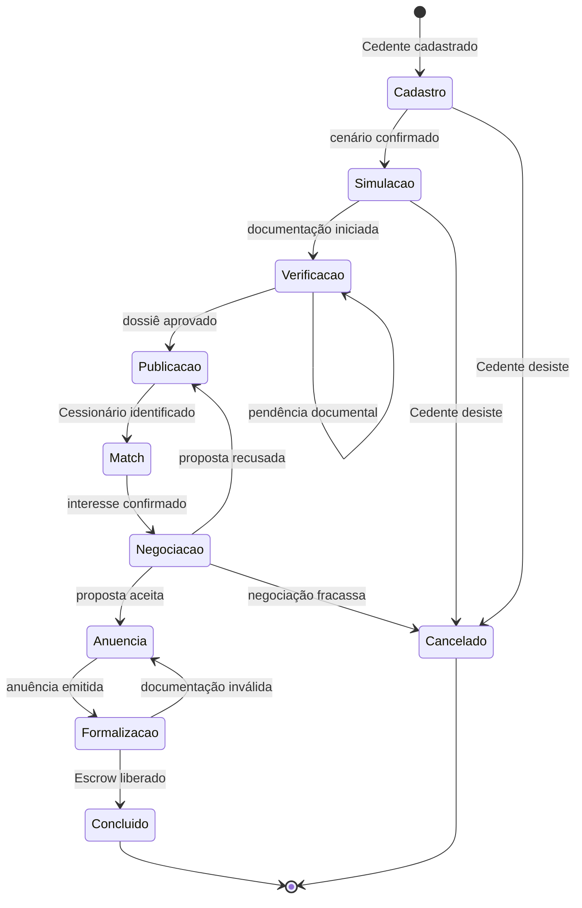

# Regras de Negócio — CRM Repasse Seguro

| **Destinatário** | Equipe de Produto e Engenharia |
|---|---|
| **Escopo** | Fundação, glossário, tipos de usuário, permissões, autenticação, ciclo de vida do caso e onboarding do CRM interno |
| **Parte** | Parte 1 de 5 — Fundação e Acessos |
| **Versão** | v1.0 |
| **Responsável** | Claude Code Desktop |
| **Data da versão** | 2026-03-23 (America/Fortaleza) |
| **Continuidade** | Início — RN-001 a RN-038 |

---

> 📌 **TL;DR**
>
> - **4 tipos de usuário interno:** Admin RS, Coordenador RS, Analista RS e Parceiro Externo (corretor/advogado).
> - **9 estados do Caso** mapeados com transições e responsáveis definidos — é o objeto soberano do CRM.
> - **Distribuição de módulos:** Core/Receita (01.2) → Casos, Negociações, Comissões, Dossiê · Operação e Suporte (01.3) → Contatos, Atividades, Comunicação, SLA · Administração (01.4) → Equipe, Dashboard, Configurações, Integrações.
> - **Regras inegociáveis:** nenhum caso avança de estado sem validação da condição de saída; comissão só é registrada após Fechamento com 3 critérios cumulativos atendidos; dados de Cedente e Cessionário são isolados entre si — o CRM vê tudo, usuário externo não.
> - **LGPD:** acesso a dados pessoais de contatos é restrito ao Analista RS responsável pelo caso e ao Admin RS.
> - **Intervalo de RNs desta parte:** RN-001 a RN-038.
> - **Seções críticas pendentes:** nenhuma — todos os módulos têm insumo suficiente para geração completa.

---

## 🎯 1. Contexto Estratégico

O CRM da Repasse Seguro é o sistema interno de gestão operacional dos Analistas RS. Ele centraliza todo o ciclo de vida de um caso de cessão imobiliária — do primeiro contato do Cedente ao fechamento da formalização — e serve como painel de controle para a equipe humana que opera o **Processo Assistido**: a IA orienta e organiza, o profissional RS valida e formaliza.

O CRM não é um software de vendas genérico. Cada entidade, estado e regra aqui documentada reflete a especificidade do modelo: **comissão sobre resultado, ciclo de 45–60 dias, dossiê verificado e conta escrow como condição de fechamento**.

---

## 📖 2. Glossário

| **Termo** | **Definição** |
|---|---|
| **Caso** | Unidade operacional central do CRM. Representa um contrato imobiliário em processo de cessão, do cadastro do Cedente até a formalização concluída. Cada Caso tem exatamente 1 Cedente titular e pode ter 1 Cessionário ativo por vez. |
| **Cedente** | Pessoa física ou jurídica que detém o contrato imobiliário e deseja repassá-lo. Cadastrado como Contato com papel "Cedente" no CRM. |
| **Cessionário** | Pessoa física ou jurídica que adquire o contrato repassado. Cadastrado como Contato com papel "Cessionário" no CRM. |
| **Analista RS** | Profissional interno da Repasse Seguro responsável por conduzir um ou mais Casos. Papel operacional principal do CRM. |
| **Coordenador RS** | Profissional interno que supervisiona a equipe de Analistas RS, redistribui Casos e acessa relatórios consolidados. |
| **Admin RS** | Administrador do sistema — acesso irrestrito a todos os Casos, Contatos, configurações e logs de auditoria. |
| **Parceiro Externo** | Corretor ou advogado que indicou o Cedente ou o Cessionário para a plataforma. Acesso restrito ao status resumido dos Casos em que tem participação. |
| **Dossiê** | Conjunto de documentos verificados de um Caso: tabela atual, tabela contrato, comprovante de saldo devedor, documentos pessoais do Cedente e instrumento de cessão assinado. |
| **Δ (Delta)** | Diferença econômica entre a Tabela Atual e a Tabela do Contrato. Base de cálculo da comissão do Cessionário. Se Δ ≤ 0, a comissão do Cessionário é calculada sobre o Valor Pago pelo Cedente. |
| **Cenário (A/B/C/D)** | Opção de retorno escolhida pelo Cedente no cadastro. Determina a meta de valor recuperado e a base de cálculo da comissão do Cedente. Dado confidencial — nunca exposto ao Cessionário. |
| **Fechamento** | Evento que dispara a cobrança de comissão. Requer 3 critérios cumulativos: (1) instrumento de cessão assinado por todas as partes, (2) anuência da incorporadora confirmada e (3) comprovante de transação financeira na conta escrow. |
| **Conta Escrow** | Mecanismo financeiro que retém o valor da transação até o cumprimento das condições de Fechamento. A liberação é registrada no Caso e dispara o cálculo e cobrança das comissões. |
| **Atividade** | Registro de interação vinculada a um Caso ou Contato: ligação, reunião, e-mail, WhatsApp, nota interna. |
| **Follow-up** | Atividade futura agendada com prazo e responsável definidos. |
| **SLA do Caso** | Prazo máximo esperado para cada estado do Caso. Violação de SLA gera alerta automático ao Coordenador RS. |
| **Match** | Evento em que o sistema identifica compatibilidade entre um Caso publicado (Cedente) e um Cessionário interessado. |
| **Anuência** | Autorização formal da incorporadora para a transferência do contrato. Condição obrigatória para o Fechamento. |
| **Perda Evitada** | Diferença entre o que o Cedente receberia no distrato e o que recebe via cessão. Métrica de valor gerado pelo Caso. |
| **Termo Comercial** | Documento que formaliza as condições específicas de comissão de um Caso (piso, teto, percentual negociado). |

---

## 👤 3. Tipos de Usuário e Matriz de Permissões

### 3.1 Papéis internos e externos

| **Papel** | **Tipo** | **Escopo de acesso** |
|---|---|---|
| **Admin RS** | Interno | Irrestrito — todos os Casos, Contatos, Configurações, Logs, Relatórios |
| **Coordenador RS** | Interno | Todos os Casos e Contatos da equipe; redistribuição; relatórios consolidados; sem acesso a configurações do sistema |
| **Analista RS** | Interno | Apenas os Casos atribuídos a si e os Contatos vinculados a esses Casos |
| **Parceiro Externo** | Externo | Somente o status resumido dos Casos em que foi registrado como indicador |

### 3.2 Matriz de permissões detalhada

| **Ação** | **Admin RS** | **Coordenador RS** | **Analista RS** | **Parceiro Externo** |
|---|---|---|---|---|
| Criar Caso | ✅ Sim | ✅ Sim | ✅ Sim | ❌ Não |
| Editar Caso | ✅ Qualquer | ✅ Da equipe | ✅ Próprios | ❌ Não |
| Avançar estado do Caso | ✅ Qualquer | ✅ Da equipe | ✅ Próprios | ❌ Não |
| Ver todos os Casos | ✅ Sim | ✅ Da equipe | ❌ Apenas próprios | ❌ Não |
| Acessar dados pessoais do Cedente | ✅ Sim | ✅ Sim | ✅ Próprios Casos | ❌ Não |
| Acessar dados pessoais do Cessionário | ✅ Sim | ✅ Sim | ✅ Próprios Casos | ❌ Não |
| Ver Cenário (A/B/C/D) do Cedente | ✅ Sim | ✅ Sim | ✅ Próprios Casos | ❌ Não |
| Registrar Atividade | ✅ Sim | ✅ Sim | ✅ Próprios Casos | ❌ Não |
| Criar/editar Follow-up | ✅ Sim | ✅ Sim | ✅ Próprios Casos | ❌ Não |
| Redistribuir Caso entre Analistas | ✅ Sim | ✅ Sim | ❌ Não | ❌ Não |
| Registrar Comissão | ✅ Sim | ✅ Sim | ✅ Próprios Casos | ❌ Não |
| Aplicar desconto de comissão | ✅ Sim | ✅ Mediante critério | ❌ Não | ❌ Não |
| Ver status resumido do Caso | ✅ Sim | ✅ Sim | ✅ Próprios | ✅ Própria indicação |
| Acessar Dashboard consolidado | ✅ Sim | ✅ Sim | ❌ Não | ❌ Não |
| Gerenciar usuários da equipe | ✅ Sim | ❌ Não | ❌ Não | ❌ Não |
| Acessar configurações do sistema | ✅ Sim | ❌ Não | ❌ Não | ❌ Não |
| Exportar dados | ✅ Sim | ✅ Consolidado | ✅ Próprios Casos | ❌ Não |
| Ver log de auditoria | ✅ Sim | ✅ Da equipe | ❌ Não | ❌ Não |

---

## 🔐 4. Autenticação e Controle de Sessão

**RN-001: Acesso ao CRM por usuário interno**

1. O usuário interno (Admin RS, Coordenador RS ou Analista RS) acessa a URL do CRM.
2. O sistema verifica se há sessão ativa válida via Supabase Auth.
3. **Se há sessão ativa:** o sistema carrega o painel conforme o papel do usuário (Admin RS → visão geral; Coordenador RS → painel da equipe; Analista RS → fila de Casos próprios).
4. **Se não há sessão ativa:** o sistema exibe a tela de login com e-mail e senha. Após autenticação bem-sucedida, redireciona ao painel do papel correspondente.
5. **Se as credenciais estão incorretas:** o sistema exibe: "E-mail ou senha incorretos. Verifique seus dados e tente novamente." O campo de senha é limpo automaticamente.
6. **Consequência se violada:** acesso não autorizado a dados pessoais de Cedentes e Cessionários, violação de LGPD e risco de vazamento de informações comercialmente sensíveis.

---

**RN-002: Bloqueio por tentativas de login malsucedidas**

1. O usuário tenta login e erra a senha.
2. O sistema registra cada tentativa com carimbo de data/hora e IP.
3. **Após 5 tentativas incorretas consecutivas em até 15 minutos:** o sistema bloqueia o acesso da conta por 30 minutos e envia notificação ao e-mail cadastrado: "Detectamos múltiplas tentativas de login sem sucesso. Sua conta foi temporariamente bloqueada. Se não foi você, redefina sua senha." [DECISÃO AUTÔNOMA — 5 tentativas / 15 min / bloqueio 30 min: padrão SaaS B2B conservador, equilibrando segurança e usabilidade para equipes com acesso via mobile/escritório.]
4. **Se o usuário tenta logar durante o bloqueio:** o sistema exibe: "Sua conta está temporariamente bloqueada por segurança. Tente novamente em [tempo restante] ou redefina sua senha agora."
5. **Consequência se violada:** exposição a ataques de força bruta contra contas com acesso a dados pessoais sensíveis.

---

**RN-003: Expiração de sessão por inatividade**

1. O usuário autenticado deixa o CRM sem interação.
2. O sistema detecta inatividade após **60 minutos** sem ação. [DECISÃO AUTÔNOMA — 60 min: padrão SaaS B2B interno; ambiente de trabalho contínuo não justifica sessões curtas de 15–30 min como em banking.]
3. **Após 60 minutos sem ação:** o sistema exibe aviso: "Sua sessão expira em 5 minutos por inatividade. Clique em qualquer lugar para continuar."
4. **Se o usuário não interagir nos 5 minutos seguintes:** a sessão é encerrada e o sistema redireciona ao login, preservando a URL de retorno.
5. **Consequência se violada:** sessão aberta em máquina compartilhada ou desacompanhada expõe dados sensíveis de Casos e Contatos.

---

**RN-004: Acesso do Parceiro Externo**

1. O Parceiro Externo (corretor/advogado) recebe convite por e-mail gerado pelo Analista RS responsável.
2. O sistema cria uma conta com papel "Parceiro Externo" vinculada ao e-mail informado.
3. **Se o Parceiro aceita o convite em até 7 dias:** é redirecionado à tela de definição de senha e, após, ao painel com os Casos em que consta como indicador. [DECISÃO AUTÔNOMA — 7 dias: padrão de convite corporativo; suficiente sem criar janelas longas de invite aberto.]
4. **Se o convite não for aceito em 7 dias:** o link expira. O Analista RS pode reenviar o convite manualmente.
5. **O Parceiro Externo vê apenas:** estado atual do Caso, fase do ciclo, data estimada de fechamento e se há pendência de documento da sua parte. Dados pessoais de Cedente e Cessionário nunca são exibidos.
6. **Consequência se violada:** exposição de dados confidenciais de negociação a terceiros sem contrato de sigilo, criando risco jurídico e comercial.

---

**RN-005: Recuperação de senha**

1. O usuário clica em "Esqueci minha senha" na tela de login.
2. O sistema solicita o e-mail cadastrado.
3. **Se o e-mail está cadastrado:** envia link de redefinição com validade de 2 horas. [DECISÃO AUTÔNOMA — 2h: segurança sem inconveniência; links de redefinição de 15–30 min são excessivamente restritivos para ambientes corporativos.]
4. **Se o e-mail não está cadastrado:** o sistema exibe a mesma mensagem de confirmação ("Um link de redefinição foi enviado, caso esse e-mail esteja cadastrado.") para não revelar a existência de contas — proteção contra enumeração de usuários.
5. **Se o link expirar:** o usuário acessa novamente o fluxo de recuperação para solicitar novo link.
6. **Consequência se violada:** links de redefinição sem expiração criam janela permanente de comprometimento de conta.

---

## 🔄 5. Estados e Ciclo de Vida do Caso

### 5.1 Os 9 estados do Caso

| **#** | **Estado** | **Responsável** | **SLA esperado** | **Condição de saída** |
|---|---|---|---|---|
| 1 | **Cadastro** | Analista RS | 1 dia útil | Cedente cadastrado + cenário escolhido |
| 2 | **Simulação** | Analista RS + Cedente | 2 dias úteis | Cedente confirmou o cenário desejado |
| 3 | **Verificação** | Analista RS | 5 dias úteis | Dossiê completo e aprovado pelo Coordenador RS |
| 4 | **Publicação** | Analista RS | 1 dia útil | Caso publicado no marketplace com dossiê verificado |
| 5 | **Match** | Sistema + Analista RS | 3 dias úteis | Cessionário identificado e interesse confirmado |
| 6 | **Negociação** | Analista RS | 7 dias úteis | Proposta aceita por ambas as partes |
| 7 | **Anuência** | Analista RS + Incorporadora | 10 dias úteis | Anuência emitida pela incorporadora |
| 8 | **Formalização** | Analista RS | 5 dias úteis | Instrumento assinado + Escrow depositado |
| 9 | **Concluído** | Sistema | — | Escrow liberado + comissão registrada |

> 💡 **Ciclo total estimado:** 45–60 dias do cadastro à conclusão. Ciclos acima de 60 dias geram alerta automático ao Coordenador RS.

### 5.2 Diagrama de estados

---

**RN-006: Criação de um novo Caso**

1. O Analista RS clica em "Novo Caso" no CRM.
2. O sistema abre o formulário de cadastro com campos obrigatórios: nome do Cedente, telefone, e-mail, empreendimento (nome e endereço), valor do contrato original (Tabela Contrato) e cenário escolhido (A, B, C ou D).
3. **Se todos os campos obrigatórios estão preenchidos:** o sistema cria o Caso no estado "Cadastro", atribui ao Analista RS que criou, gera um identificador único no formato `RS-YYYY-NNNN` e exibe a tela do Caso recém-criado.
4. **Se algum campo obrigatório está ausente:** o sistema marca os campos faltantes em vermelho e exibe: "Preencha todos os campos obrigatórios para continuar."
5. **Efeito no estado:** `[Novo]` → `Cadastro`.
6. **Consequência se violada:** Casos sem dados mínimos não permitem simulação de cenários nem verificação documental — travam o pipeline.

---

**RN-007: Avanço de estado do Caso**

1. O Analista RS aciona o botão de avanço de estado no Caso.
2. O sistema verifica se a condição de saída do estado atual foi atendida (conforme tabela 5.1).
3. **Se a condição de saída está atendida:** o sistema avança o Caso para o próximo estado, registra o carimbo de data/hora e o responsável pela transição no log de auditoria.
4. **Se a condição de saída não está atendida:** o sistema bloqueia o avanço e exibe a lista de pendências não resolvidas: "Para avançar este Caso, resolva as pendências: [lista]."
5. **Efeito no estado:** estado atual → próximo estado sequencial (conforme diagrama 5.2).
6. **Consequência se violada:** Casos avançando sem condição de saída atendida comprometem a integridade do dossiê e o Fechamento.

---

**RN-008: Cancelamento de Caso**

1. O Analista RS ou Coordenador RS aciona "Cancelar Caso" em qualquer estado anterior ao "Concluído".
2. O sistema exige seleção obrigatória de um motivo de cancelamento: Cedente desistiu · Documentação inválida sem possibilidade de correção · Nenhum Cessionário encontrado · Anuência negada pela incorporadora · Outros (campo aberto obrigatório).
3. **Se o motivo está selecionado:** o sistema move o Caso para "Cancelado", registra data, responsável e motivo no log de auditoria. Nenhuma comissão é registrada.
4. **Se nenhum motivo está selecionado:** o sistema bloqueia o cancelamento: "Selecione um motivo para o cancelamento antes de continuar."
5. **Casos cancelados:** ficam arquivados, acessíveis para consulta, mas não podem ser reativados — um novo Caso deve ser aberto se o Cedente retornar.
6. **Consequência se violada:** cancelamentos sem motivo impedem análise de funil e identificação de gargalos operacionais.

---

**RN-009: Alerta de SLA vencido**

1. O sistema verifica diariamente, às 08h00 (America/Fortaleza), o SLA de cada Caso ativo.
2. **Se um Caso está no estado atual por mais de 80% do SLA esperado sem avançar:** o sistema envia alerta para o Analista RS responsável e para o Coordenador RS: "O Caso [RS-XXXX] está há [N] dias no estado [Estado]. O SLA esperado é de [N] dias úteis."
3. **Se um Caso ultrapassa 100% do SLA sem avançar:** o sistema envia alerta de urgência ao Coordenador RS e ao Admin RS, com badge vermelho visível no Caso.
4. **Se o Ciclo Total do Caso supera 60 dias corridos:** alerta consolidado ao Coordenador RS com recomendação de reavaliação.
5. **Consequência se violada:** atrasos não monitorados acumulam e geram cancelamentos evitáveis, prejudicando o breakeven operacional.

---

## 🚀 6. Onboarding de Novos Usuários Internos

**RN-010: Criação de conta para novo Analista RS ou Coordenador RS**

1. O Admin RS acessa "Equipe" → "Convidar membro".
2. O sistema solicita: nome completo, e-mail corporativo e papel (Analista RS ou Coordenador RS).
3. **Se os dados são válidos e o e-mail não está cadastrado:** o sistema envia convite com link de ativação de conta válido por 48 horas. [DECISÃO AUTÔNOMA — 48h: padrão de onboarding corporativo; tempo suficiente para o usuário acessar o e-mail sem criar janelas longas.]
4. **Se o e-mail já existe no sistema:** o sistema exibe: "Este e-mail já está associado a uma conta. Se precisar alterar o papel, edite o perfil do usuário existente."
5. **Ao ativar a conta:** o novo membro define senha, completa o perfil (foto opcional, telefone de contato) e visualiza o tour interativo do CRM.
6. **Consequência se violada:** convites sem expiração criam contas em estado indeterminado e expõem o CRM a acessos não autorizados.

---

**RN-011: Tour interativo de onboarding**

1. Na primeira sessão após ativação da conta, o sistema exibe o tour interativo automaticamente.
2. O tour cobre: criação de Caso, registro de Atividade, avanço de estado, uso do Dashboard pessoal e acesso à central de ajuda.
3. **Se o usuário pula o tour:** o sistema registra a decisão e disponibiliza o tour novamente em "Ajuda → Tour guiado" a qualquer momento.
4. **O tour não bloqueia o uso do sistema.** O usuário pode interagir com o CRM a qualquer momento durante ou após o tour.
5. **Consequência se violada:** sem onboarding guiado, a curva de aprendizado dos Analistas RS aumenta, impactando tempo médio de abertura do primeiro Caso.

---

## 🔒 7. LGPD e Privacidade

**RN-012: Princípio de acesso mínimo a dados pessoais**

1. O sistema carrega dados pessoais de Cedentes e Cessionários (CPF/CNPJ, endereço, documentos) apenas quando o Analista RS está na tela do Caso específico.
2. Em listagens, buscas e dashboards, os dados pessoais são mascarados (ex: "João S." no lugar de "João Silva", CPF exibido apenas com 3 dígitos visíveis).
3. **O Parceiro Externo nunca acessa dados pessoais de Contatos**, independentemente do estado do Caso.
4. **Logs de acesso a dados pessoais são registrados automaticamente:** usuário, data/hora, Caso acessado e ação realizada.
5. **Consequência se violada:** exposição de dados pessoais a usuários não autorizados configura infração à LGPD (Lei 13.709/2018), sujeitando a empresa a sanção administrativa e reputacional.

---

**RN-013: Retenção e exclusão de dados pessoais**

1. Dados pessoais de Contatos de Casos **Cancelados** são mantidos por 5 anos para fins de auditoria e cumprimento de obrigações legais. [DECISÃO AUTÔNOMA — 5 anos: prazo de prescrição geral do Código Civil para contratos imobiliários; adequado para defesa em eventual litígio.]
2. Dados pessoais de Casos **Concluídos** são mantidos por 10 anos após a data de fechamento. [DECISÃO AUTÔNOMA — 10 anos: prazo de prescrição para ações reais imobiliárias (art. 205 do CC/2002).]
3. **Após os prazos acima:** os dados pessoais são anonimizados automaticamente. Os registros do Caso (estados, datas, valores agregados) são mantidos indefinidamente para inteligência de mercado.
4. **O titular dos dados pode solicitar acesso, correção ou exclusão de seus dados pessoais** via canal oficial. O Admin RS tem até 15 dias corridos para responder. [DECISÃO AUTÔNOMA — 15 dias: prazo razoável dentro do espírito da LGPD, que não define prazo específico para CRMs privados, mas 30 dias é o prazo máximo recomendado pela ANPD.]
5. **Consequência se violada:** retenção inadequada ou resposta fora de prazo a requisições de titulares configura infração ao art. 18 da LGPD.

---

## 📊 8. Estados e Ciclo de Vida dos Objetos Secundários

### 8.1 Contato

| **Estado** | **Descrição** |
|---|---|
| **Ativo** | Contato com Caso aberto em qualquer estado |
| **Sem Caso Ativo** | Contato cadastrado mas sem Caso em andamento |
| **Arquivado** | Contato sem interação há mais de 12 meses e sem Caso aberto |

**RN-014: Criação de Contato**

1. O sistema cria automaticamente um Contato ao criar um novo Caso (Cedente) ou ao vincular um Cessionário a um Caso existente.
2. **Se o e-mail ou CPF/CNPJ já existe em outro Contato:** o sistema alerta o Analista RS: "Este contato já está cadastrado. Deseja vincular o Caso ao contato existente ou criar um novo?" O Analista escolhe.
3. **Se o Analista opta por vincular:** o Caso é associado ao Contato existente, preservando o histórico de interações.
4. **Se o Analista opta por criar novo:** um novo Contato é criado com flag de "possível duplicata" para revisão do Coordenador RS.
5. **Consequência se violada:** duplicatas de Contatos fragmentam o histórico de interações e comprometem a análise de recorrência de Cedentes/Cessionários.

### 8.2 Atividade

| **Estado** | **Descrição** |
|---|---|
| **Registrada** | Atividade passada registrada manualmente ou automaticamente |
| **Agendada** | Follow-up futuro com data, hora e responsável definidos |
| **Vencida** | Follow-up que passou da data sem marcação de conclusão |
| **Concluída** | Follow-up executado e marcado como concluído pelo Analista RS |

**RN-015: Alerta de Atividade vencida**

1. O sistema verifica diariamente, às 08h00, Follow-ups com data passada e status diferente de "Concluída".
2. **Para cada Follow-up vencido:** o sistema exibe badge "Atrasado" no Caso correspondente e envia notificação ao Analista RS responsável: "Você tem [N] follow-up(s) vencido(s). Acesse sua fila para atualizar."
3. **Se um Caso tem Follow-up vencido há mais de 3 dias úteis:** o sistema notifica também o Coordenador RS.
4. **Consequência se violada:** follow-ups vencidos sem resolução indicam Casos sem toque ativo, aumentando risco de perda de Cedente ou Cessionário por falta de contato.

---

> ⚙️ **Continuidade → Parte 01.2:** Os módulos de Casos, Negociação, Comissão e Dossiê estão documentados na Parte 01.2 (Core / Receita), a partir de RN-039. Os módulos de Contatos, Atividades e Comunicação estão na Parte 01.3, e Equipe, Dashboard e Configurações na Parte 01.4.
