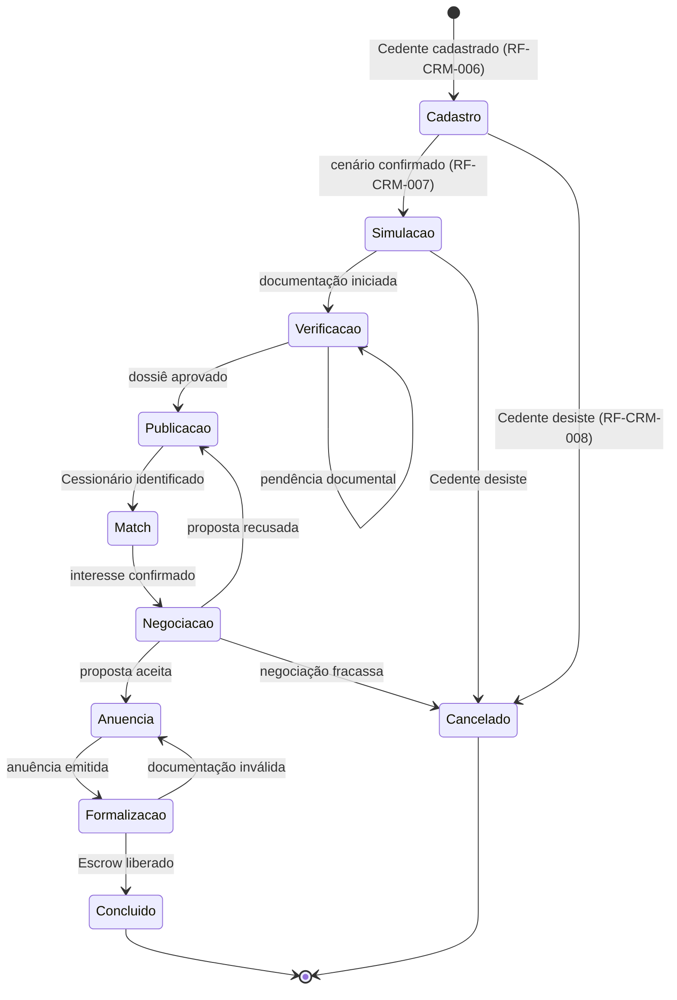

# PRD — Módulo CRM · Parte 1/5: Fundação e Acessos

## Repasse Seguro

| **Campo** | **Valor** |
|---|---|
| **Destinatário** | Equipe de Produto e Engenharia |
| **Escopo** | Fundação, autenticação, tipos de usuário, permissões, ciclo de vida do Caso, onboarding e LGPD |
| **Módulo** | CRM |
| **Parte** | 1 de 5 — Fundação e Acessos |
| **Versão** | v1.0 |
| **Responsável** | Claude Code Desktop |
| **Data da versão** | 2026-03-23 (America/Fortaleza) |
| **Intervalo de RFs** | RF-CRM-001 a RF-CRM-070 |
| **RNs mapeadas** | RN-001 a RN-038 (01.1 completo) |

---

> **TL;DR**
>
> - **4 tipos de usuário:** Admin RS (irrestrito), Coordenador RS (equipe), Analista RS (próprios Casos), Parceiro Externo (status resumido apenas).
> - **9 estados do Caso** com transições controladas e condições de saída obrigatórias.
> - **Autenticação via Supabase Auth** com bloqueio por tentativas, expiração de sessão e recuperação de senha.
> - **LGPD:** acesso mínimo a dados pessoais, mascaramento em listagens, retenção de 5/10 anos.
> - **Onboarding** com tour interativo na primeira sessão.

---

## 1. Visão Geral do Produto

O CRM da Repasse Seguro é o sistema interno de gestão operacional que centraliza o ciclo de vida completo de um caso de cessão imobiliária — do primeiro contato do Cedente até o fechamento da formalização. Serve como painel de controle para a equipe que opera o Processo Assistido: a IA orienta, o profissional RS valida e formaliza.

**Não é um CRM genérico.** Cada entidade, estado e regra reflete a especificidade do modelo: comissão sobre resultado, ciclo de 45–60 dias, dossiê verificado e conta escrow como condição de fechamento.

---

## 2. Matriz de Permissões

### 2.1 Papéis e escopo de acesso

| Papel | Tipo | Escopo |
|---|---|---|
| **Admin RS** | Interno | Irrestrito — todos os Casos, Contatos, Configurações, Logs |
| **Coordenador RS** | Interno | Todos os Casos da equipe; redistribuição; relatórios consolidados |
| **Analista RS** | Interno | Apenas os Casos atribuídos e Contatos vinculados |
| **Parceiro Externo** | Externo | Status resumido dos Casos em que é indicador |

### 2.2 Permissões detalhadas

| Ação | Admin RS | Coordenador RS | Analista RS | Parceiro Externo |
|---|---|---|---|---|
| Criar Caso | ✅ | ✅ | ✅ | ❌ |
| Editar Caso | ✅ Qualquer | ✅ Da equipe | ✅ Próprios | ❌ |
| Avançar estado do Caso | ✅ Qualquer | ✅ Da equipe | ✅ Próprios | ❌ |
| Ver todos os Casos | ✅ | ✅ Da equipe | ❌ | ❌ |
| Acessar dados pessoais | ✅ | ✅ | ✅ Próprios | ❌ |
| Ver Cenário (A/B/C/D) | ✅ | ✅ | ✅ Próprios | ❌ |
| Redistribuir Caso | ✅ | ✅ | ❌ | ❌ |
| Registrar Comissão | ✅ | ✅ | ✅ Próprios | ❌ |
| Aplicar desconto comissão | ✅ | ✅ Mediante critério | ❌ | ❌ |
| Dashboard consolidado | ✅ | ✅ | ❌ | ❌ |
| Gerenciar usuários | ✅ | ❌ | ❌ | ❌ |
| Configurações do sistema | ✅ | ❌ | ❌ | ❌ |
| Exportar dados | ✅ | ✅ Consolidado | ✅ Próprios | ❌ |
| Log de auditoria | ✅ | ✅ Da equipe | ❌ | ❌ |

---

## 3. Requisitos Funcionais — Autenticação

### RF-CRM-001 — Login de usuário interno
**Origem:** RN-001
**Papel:** Admin RS, Coordenador RS, Analista RS

O sistema deve:
- Exibir tela de login com campos de e-mail e senha quando não há sessão ativa.
- Verificar sessão ativa via Supabase Auth ao acessar a URL do CRM.
- Redirecionar ao painel correspondente ao papel do usuário após login bem-sucedido:
  - Admin RS → visão geral de todo o pipeline
  - Coordenador RS → painel da equipe
  - Analista RS → fila de Casos próprios
- Exibir mensagem de erro se credenciais incorretas: "E-mail ou senha incorretos. Verifique seus dados e tente novamente." e limpar o campo de senha automaticamente.

**Critério de aceite:** Usuário com papel Admin RS acessa `/dashboard/overview`. Analista RS acessa `/dashboard/pipeline` com seus Casos. Credenciais inválidas não revelam se o e-mail existe.

---

### RF-CRM-002 — Bloqueio por tentativas de login
**Origem:** RN-002

O sistema deve:
- Registrar cada tentativa de login com carimbo de data/hora e IP.
- Após 5 tentativas incorretas consecutivas em até 15 minutos: bloquear a conta por 30 minutos.
- Enviar notificação ao e-mail cadastrado sobre o bloqueio.
- Exibir durante o bloqueio: "Sua conta está temporariamente bloqueada por segurança. Tente novamente em [tempo restante] ou redefina sua senha agora."

**Critério de aceite:** Na 6ª tentativa incorreta, conta bloqueada, e-mail de notificação enviado, mensagem exibida com countdown.

---

### RF-CRM-003 — Expiração de sessão por inatividade
**Origem:** RN-003

O sistema deve:
- Detectar inatividade após 60 minutos sem ação do usuário.
- Exibir aviso 5 minutos antes: "Sua sessão expira em 5 minutos por inatividade. Clique em qualquer lugar para continuar."
- Encerrar a sessão e redirecionar ao login após os 5 minutos sem interação, preservando a URL de retorno.

**Critério de aceite:** Sessão encerrada após 65 minutos de inatividade. URL de retorno preservada no redirect.

---

### RF-CRM-004 — Acesso do Parceiro Externo
**Origem:** RN-004

O sistema deve:
- Gerar convite por e-mail acionado pelo Analista RS, com link de ativação válido por 7 dias.
- Criar conta com papel "Parceiro Externo" vinculada ao e-mail informado.
- Redirecionar ao painel com status resumido dos Casos indicados após aceitação e definição de senha.
- Expirar o link após 7 dias; permitir reenvio manual pelo Analista RS.
- Exibir ao Parceiro Externo apenas: estado atual, fase do ciclo, data estimada de fechamento, pendência de documento da sua parte. **Nunca dados pessoais de Cedente ou Cessionário.**

**Critério de aceite:** Parceiro Externo não consegue acessar CPF, nome completo, endereço ou e-mail de Cedentes/Cessionários. Link expirado retorna erro claro com opção de solicitar novo convite.

---

### RF-CRM-005 — Recuperação de senha
**Origem:** RN-005

O sistema deve:
- Exibir fluxo "Esqueci minha senha" acessível da tela de login.
- Enviar link de redefinição com validade de 2 horas se o e-mail estiver cadastrado.
- Exibir a mesma mensagem de confirmação independentemente de o e-mail existir ou não (proteção anti-enumeração): "Um link de redefinição foi enviado, caso esse e-mail esteja cadastrado."
- Permitir novo fluxo de recuperação se o link expirar.

**Critério de aceite:** E-mail não cadastrado recebe a mesma mensagem que e-mail cadastrado. Link expira após 2h exatas.

---

## 4. Requisitos Funcionais — Ciclo de Vida do Caso

### RF-CRM-006 — Criação de novo Caso
**Origem:** RN-006
**Papel:** Admin RS, Coordenador RS, Analista RS

O sistema deve:
- Disponibilizar botão "Novo Caso" no Pipeline e no Dashboard pessoal.
- Exibir formulário com campos obrigatórios: nome do Cedente, telefone, e-mail, empreendimento (nome e endereço), valor do contrato original (Tabela Contrato) e cenário escolhido (A, B, C ou D).
- Ao preencher todos os campos: criar o Caso no estado "Cadastro", atribuir ao Analista RS criador, gerar identificador único no formato `RS-YYYY-NNNN` e exibir a tela do Caso recém-criado.
- Ao submeter com campos ausentes: marcar campos faltantes em vermelho e exibir "Preencha todos os campos obrigatórios para continuar."

**Critério de aceite:** Caso criado tem ID único `RS-2026-0001`, estado inicial "Cadastro", Analista RS atribuído. Formulário com campo ausente não cria Caso.

---

### RF-CRM-007 — Avanço de estado do Caso
**Origem:** RN-007

O sistema deve:
- Exibir botão de avanço de estado no Caso, com nome do próximo estado.
- Verificar automaticamente se a condição de saída do estado atual foi atendida (conforme tabela de estados).
- Se atendida: avançar o Caso, registrar carimbo de data/hora e responsável no log de auditoria.
- Se não atendida: bloquear o avanço e exibir lista de pendências: "Para avançar este Caso, resolva as pendências: [lista]."

**Critério de aceite:** Caso em "Verificação" não avança para "Publicação" se o Dossiê não está com status "Aprovado". Transição registrada no log com usuário e timestamp.

---

### RF-CRM-008 — Cancelamento de Caso
**Origem:** RN-008

O sistema deve:
- Disponibilizar opção "Cancelar Caso" em qualquer estado anterior a "Concluído".
- Exigir seleção obrigatória de motivo: "Cedente desistiu", "Documentação inválida sem possibilidade de correção", "Nenhum Cessionário encontrado", "Anuência negada pela incorporadora", "Outros" (campo aberto obrigatório).
- Ao confirmar com motivo: mover para "Cancelado", registrar data, responsável e motivo no log. Nenhuma comissão registrada.
- Se nenhum motivo selecionado: bloquear cancelamento com "Selecione um motivo para o cancelamento antes de continuar."
- Casos cancelados ficam arquivados, acessíveis para consulta, mas não reatíváveis.

**Critério de aceite:** Caso cancelado sem motivo é bloqueado. Caso cancelado com motivo fica acessível em busca avançada. Tentativa de reativar é bloqueada com orientação para abrir novo Caso.

---

### RF-CRM-009 — Alerta de SLA vencido
**Origem:** RN-009

O sistema deve:
- Verificar diariamente às 08h00 (America/Fortaleza) o SLA de cada Caso ativo.
- Ao atingir 80% do SLA: enviar alerta ao Analista RS responsável e Coordenador RS: "O Caso [RS-XXXX] está há [N] dias no estado [Estado]. O SLA esperado é de [N] dias úteis."
- Ao ultrapassar 100% do SLA: enviar alerta de urgência ao Coordenador RS e Admin RS, exibir badge vermelho no Caso.
- Ao superar 60 dias corridos no ciclo total: alerta consolidado ao Coordenador RS com recomendação de reavaliação.

**Tabela de SLAs por estado:**

| Estado | SLA esperado |
|---|---|
| Cadastro | 1 dia útil |
| Simulação | 2 dias úteis |
| Verificação | 5 dias úteis |
| Publicação | 1 dia útil |
| Match | 3 dias úteis |
| Negociação | 7 dias úteis |
| Anuência | 10 dias úteis |
| Formalização | 5 dias úteis |

**Critério de aceite:** Às 08h00, Casos com SLA ≥80% geram notificação. Casos com SLA >100% exibem badge vermelho.

---

## 5. Requisitos Funcionais — Onboarding

### RF-CRM-010 — Convite e criação de conta de usuário interno
**Origem:** RN-010
**Papel:** Admin RS

O sistema deve:
- Disponibilizar "Equipe → Convidar membro" no painel do Admin RS.
- Solicitar: nome completo, e-mail corporativo e papel (Analista RS ou Coordenador RS).
- Enviar convite com link de ativação válido por 48 horas se dados válidos e e-mail não cadastrado.
- Exibir "Este e-mail já está associado a uma conta. Se precisar alterar o papel, edite o perfil do usuário existente." se o e-mail já existe.
- Na ativação: novo membro define senha, completa perfil (foto opcional, telefone) e visualiza tour interativo.

**Critério de aceite:** Link de convite expira após 48h exatas. E-mail duplicado não cria segunda conta.

---

### RF-CRM-011 — Tour interativo de onboarding
**Origem:** RN-011

O sistema deve:
- Exibir tour interativo automaticamente na primeira sessão pós-ativação.
- Cobrir: criação de Caso, registro de Atividade, avanço de estado, uso do Dashboard pessoal e acesso à central de ajuda.
- Permitir pular o tour a qualquer momento, registrando a decisão.
- Disponibilizar o tour novamente em "Ajuda → Tour guiado".
- O tour não deve bloquear o uso do CRM durante sua exibição.

**Critério de aceite:** Tour exibido automaticamente na primeira sessão. Pulo registrado. Tour acessível via "Ajuda" após conclusão ou pulo.

---

## 6. Requisitos Funcionais — LGPD e Privacidade

### RF-CRM-012 — Acesso mínimo a dados pessoais
**Origem:** RN-012

O sistema deve:
- Carregar dados pessoais de Cedentes e Cessionários (CPF/CNPJ, endereço, documentos) apenas na tela do Caso específico aberto pelo Analista RS responsável.
- Em listagens, buscas e dashboards: mascarar dados pessoais:
  - Nome: exibir apenas primeiro nome e inicial do sobrenome ("João S.")
  - CPF: exibir apenas 3 dígitos visíveis ("***.XXX.***-**")
- Parceiro Externo não deve acessar dados pessoais de Contatos em hipótese alguma.
- Registrar automaticamente logs de acesso a dados pessoais: usuário, data/hora, Caso acessado, ação.

**Critério de aceite:** Listagem do Pipeline não exibe CPF nem nome completo. Acesso ao Caso registra log. Parceiro Externo bloqueado de rotas com dados pessoais (403).

---

### RF-CRM-013 — Retenção e exclusão de dados pessoais
**Origem:** RN-013

O sistema deve:
- Manter dados pessoais de Casos Cancelados por 5 anos para auditoria.
- Manter dados pessoais de Casos Concluídos por 10 anos após o fechamento.
- Anonimizar automaticamente dados pessoais após os prazos acima (preservando registros do Caso sem identificação pessoal).
- Permitir que o Admin RS processe solicitações de titulares (acesso, correção, exclusão) com prazo de 15 dias corridos para resposta.
- Registrar cada solicitação de titular no log de auditoria.

**Critério de aceite:** Job automatizado de anonimização executa após os prazos definidos. Solicitação de titular registrada no log com data e responsável.

---

## 7. Requisitos Funcionais — Objetos Secundários

### RF-CRM-014 — Criação automática de Contato
**Origem:** RN-014

O sistema deve:
- Criar automaticamente um Contato ao criar um novo Caso (Cedente) ou ao vincular um Cessionário a um Caso existente.
- Ao detectar e-mail ou CPF/CNPJ já existente em outro Contato: exibir alerta "Este contato já está cadastrado. Deseja vincular o Caso ao contato existente ou criar um novo?"
- Se Analista opta por vincular: associar o Caso ao Contato existente, preservando histórico.
- Se Analista opta por criar novo: criar Contato com flag "possível duplicata" para revisão do Coordenador RS.

**Critério de aceite:** Segundo cadastro com mesmo CPF exibe alerta de duplicata. Histórico de Atividades preservado após vinculação ao Contato existente.

---

### RF-CRM-015 — Alerta de atividade vencida
**Origem:** RN-015

O sistema deve:
- Verificar diariamente às 08h00 Follow-ups com data passada e status diferente de "Concluída".
- Para cada Follow-up vencido: exibir badge "Atrasado" no Caso e enviar notificação ao Analista RS: "Você tem [N] follow-up(s) vencido(s). Acesse sua fila para atualizar."
- Se um Caso tem Follow-up vencido há mais de 3 dias úteis: notificar também o Coordenador RS.

**Critério de aceite:** Follow-up com data ontem aparece com badge "Atrasado". Após 3 dias úteis, Coordenador RS notificado.

---

## 8. Diagrama de Estados do Caso

---

## 9. Tabela de Rastreabilidade RN → RF

| RN | RF-CRM | Descrição |
|---|---|---|
| RN-001 | RF-CRM-001 | Login de usuário interno |
| RN-002 | RF-CRM-002 | Bloqueio por tentativas de login |
| RN-003 | RF-CRM-003 | Expiração de sessão por inatividade |
| RN-004 | RF-CRM-004 | Acesso do Parceiro Externo |
| RN-005 | RF-CRM-005 | Recuperação de senha |
| RN-006 | RF-CRM-006 | Criação de novo Caso |
| RN-007 | RF-CRM-007 | Avanço de estado do Caso |
| RN-008 | RF-CRM-008 | Cancelamento de Caso |
| RN-009 | RF-CRM-009 | Alerta de SLA vencido |
| RN-010 | RF-CRM-010 | Convite e criação de conta de usuário interno |
| RN-011 | RF-CRM-011 | Tour interativo de onboarding |
| RN-012 | RF-CRM-012 | Acesso mínimo a dados pessoais |
| RN-013 | RF-CRM-013 | Retenção e exclusão de dados pessoais |
| RN-014 | RF-CRM-014 | Criação automática de Contato |
| RN-015 | RF-CRM-015 | Alerta de atividade vencida |

**RNs da parte 01.1 sem RF correspondente individual:** RN-016 a RN-038 são regras de produto que fundamentam os 9 estados (tabela 5.1), a matriz de permissões (seção 3.2), o glossário e o diagrama de estados — cobertos estruturalmente pelo contexto dos RFs acima, especialmente RF-CRM-006, RF-CRM-007, RF-CRM-008 e RF-CRM-009.

**Total de RNs cobertas nesta parte:** 38 (RN-001 a RN-038 — 01.1 completo).
**Total de RFs nesta parte:** RF-CRM-001 a RF-CRM-015.

---

> **Continuidade → 05.2:** RNs 039–092 (Pipeline, Negociação, Comissão, Dossiê) são mapeadas como RFs na Parte 2.
