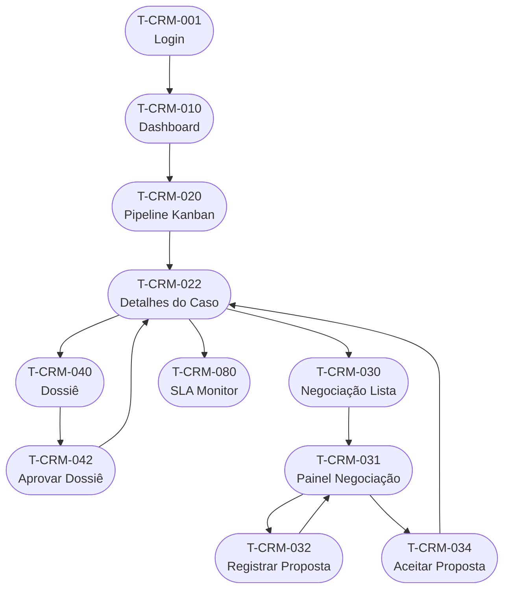
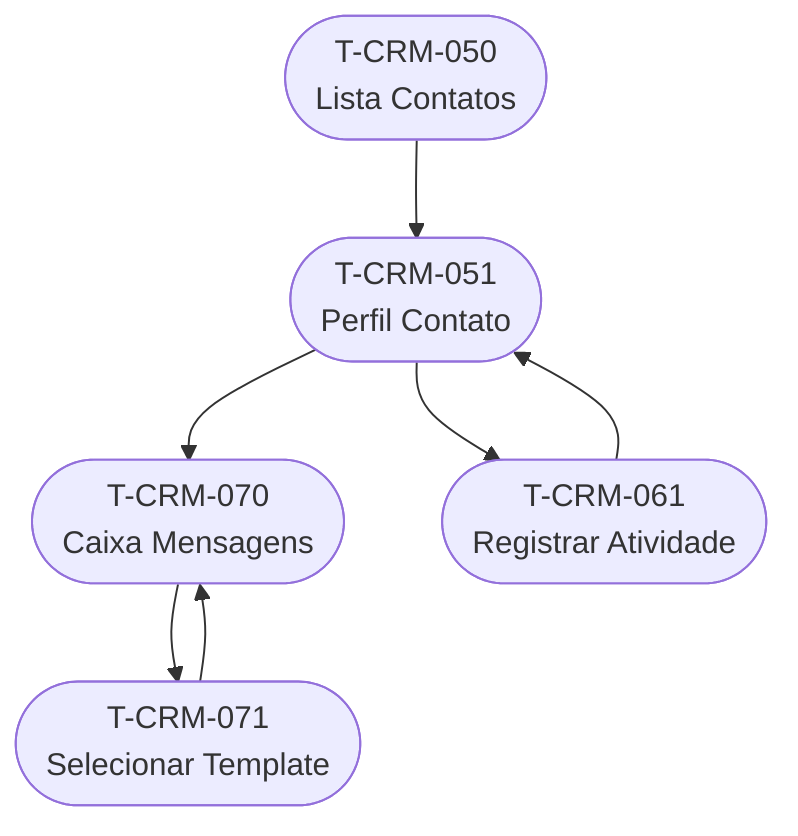
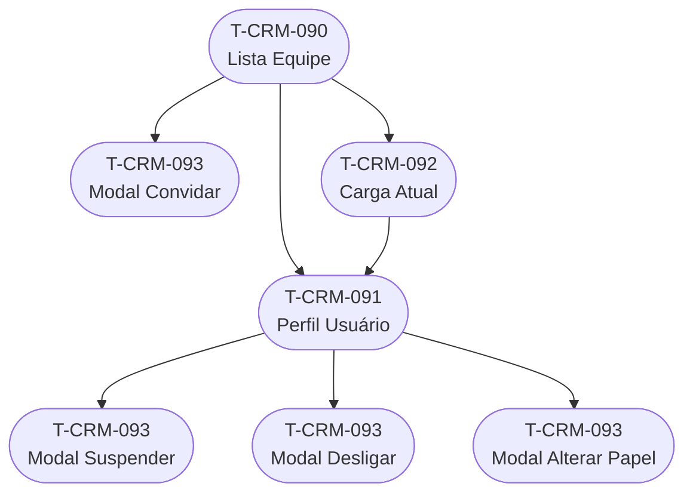
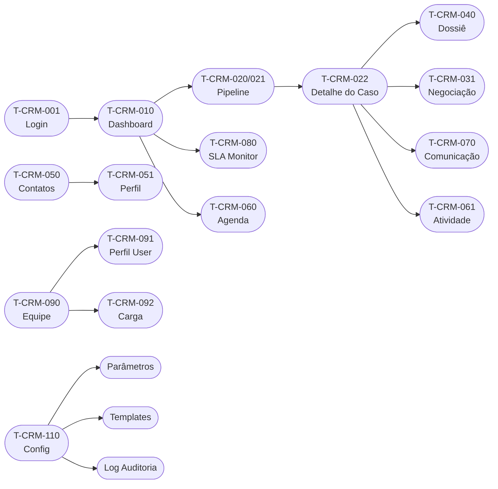

# 06 - Mapa de Telas

## Repasse Seguro — Módulo CRM

| **Campo** | **Valor** |
|---|---|
| **Destinatário** | Produto, UX e Frontend |
| **Escopo** | Inventário completo de telas, hierarquia de navegação, estados visuais, responsividade e mapeamento de componentes |
| **Módulo** | CRM |
| **Versão** | v1.0 |
| **Responsável** | Claude Code Desktop |
| **Data** | 2026-03-23 (America/Fortaleza) |
| **Dependências** | 01.1–01.5 Regras de Negócio · 05.1–05.5 PRD |

---

> **TL;DR**
>
> - **Aplicação única:** SPA React + Vite — dashboard 100% logada, sem SSR.
> - **12 módulos** mapeados na sidebar: Dashboard, Pipeline, Casos, Negociação, Dossiê, Contatos, Atividades, Comunicação (WhatsApp), SLA Monitor, Equipe, Relatórios, Configurações.
> - **4 perfis** com variantes de tela: Admin RS, Coordenador RS, Analista RS, Parceiro Externo.
> - **Total de telas documentadas:** 54 telas (T-CRM-001 a T-CRM-054), incluindo modais, drawers e overlays com lógica própria.
> - **Plataformas:** Web (SPA — primário) + Tablet (responsivo — secundário, uso em campo).
> - Telas sem ID neste documento não existem para o CRM.

---

## 1. Arquitetura de Navegação

### 1.1 Layout Global

O CRM é uma **SPA com layout shell fixo**:

```
┌─────────────────────────────────────────────────────────────┐
│  TOPBAR (h-14, fixo)                                        │
│  Logo | Busca Global (Ctrl+K)         Notif | Avatar        │
├──────────────┬──────────────────────────────────────────────┤
│  SIDEBAR     │  ÁREA DE TRABALHO (conteúdo dinâmico)        │
│  (w-64,      │                                              │
│   fixo)      │  breadcrumb + título da tela                 │
│              │                                              │
│  12 módulos  │  conteúdo principal                         │
│              │                                              │
└──────────────┴──────────────────────────────────────────────┘
```

- **Topbar:** altura fixa `h-14`. Conteúdo: logo Repasse Seguro (esquerda), atalho de busca global com placeholder "Buscar Caso, Contato... (Ctrl+K)" (centro), ícone de notificações com badge de contagem (direita), avatar do usuário com dropdown (direita).
- **Sidebar:** largura fixa `w-64` em desktop. Collapsible para `w-16` (ícones only) em telas `< 1280px`. Cada item: ícone + label. Item ativo com fundo `--accent` e borda esquerda `--primary` (4px).
- **Área de trabalho:** `flex-1`, scroll vertical independente. Padding padrão `p-6`. Inclui breadcrumb no topo (ex: "Pipeline → RS-2026-0042 → Negociação").

### 1.2 Hierarquia de Módulos (Sidebar)

```
CRM SPA
├── [T-CRM-001] Login / Autenticação
├── [T-CRM-002] Recuperação de senha
├── [T-CRM-003] Redefinição de senha
│
├── Dashboard [T-CRM-010]
│
├── Pipeline
│   ├── [T-CRM-020] Pipeline — Visão Kanban
│   ├── [T-CRM-021] Pipeline — Visão Lista
│   └── [T-CRM-022] Pipeline — Detalhes do Caso
│
├── Negociação
│   ├── [T-CRM-030] Negociação — Lista de Casos
│   ├── [T-CRM-031] Negociação — Painel do Caso
│   ├── [T-CRM-032] Modal — Registrar Proposta
│   ├── [T-CRM-033] Modal — Registrar Contraproposta
│   └── [T-CRM-034] Modal — Aceitar Proposta / Encerrar Negociação
│
├── Dossiê
│   ├── [T-CRM-040] Dossiê — Checklist de Documentos
│   ├── [T-CRM-041] Dossiê — Detalhe do Documento
│   └── [T-CRM-042] Modal — Aprovação do Dossiê (Coordenador RS)
│
├── Contatos
│   ├── [T-CRM-050] Contatos — Lista
│   ├── [T-CRM-051] Contatos — Perfil do Contato
│   ├── [T-CRM-052] Contatos — Formulário de Criação/Edição
│   └── [T-CRM-053] Modal — Mesclar Contatos Duplicados
│
├── Atividades
│   ├── [T-CRM-060] Atividades — Agenda de Follow-ups (visão pessoal)
│   └── [T-CRM-061] Modal — Registrar Atividade / Follow-up
│
├── Comunicação (WhatsApp)
│   ├── [T-CRM-070] Comunicação — Caixa de Mensagens do Caso
│   └── [T-CRM-071] Modal — Selecionar Template
│
├── SLA Monitor
│   ├── [T-CRM-080] SLA Monitor — Dashboard de SLA
│   └── [T-CRM-081] SLA Monitor — Detalhe do Alerta
│
├── Equipe
│   ├── [T-CRM-090] Equipe — Lista de Usuários
│   ├── [T-CRM-091] Equipe — Perfil do Usuário
│   ├── [T-CRM-092] Equipe — Carga Atual (distribuição)
│   └── [T-CRM-093] Modal — Convidar / Suspender / Desligar Usuário
│
├── Relatórios
│   ├── [T-CRM-100] Relatórios — Hub de Relatórios
│   ├── [T-CRM-101] Relatórios — Pipeline e Conversão
│   ├── [T-CRM-102] Relatórios — Desempenho da Equipe
│   ├── [T-CRM-103] Relatórios — Financeiro (Admin RS exclusivo)
│   └── [T-CRM-104] Relatórios — Inteligência de Mercado
│
└── Configurações
    ├── [T-CRM-110] Configurações — Parâmetros do Sistema
    ├── [T-CRM-111] Configurações — Templates de Mensagem
    ├── [T-CRM-112] Configurações — Log de Auditoria
    └── [T-CRM-113] Configurações — Perfil do Usuário (pessoal)
```

---

## 2. Inventário de Telas

### 2.1 Bloco: Autenticação

| ID | Nome | Papel | Módulo RN | Telas vinculadas |
|---|---|---|---|---|
| T-CRM-001 | Login / Autenticação | Todos | RN-001, RN-002 | → T-CRM-010 (sucesso) · → T-CRM-002 (esqueceu senha) |
| T-CRM-002 | Recuperação de senha | Todos | RN-001 | → T-CRM-003 |
| T-CRM-003 | Redefinição de senha | Todos | RN-001 | → T-CRM-001 |

**Estados da tela T-CRM-001:**
- Estado padrão: campos e-mail + senha + botão "Entrar".
- Estado de erro: mensagem "E-mail ou senha incorretos." abaixo do campo de senha.
- Estado de sessão expirada: banner "Sua sessão expirou. Faça login novamente."
- Estado de usuário suspenso: "Seu acesso foi temporariamente suspenso. Contate seu gestor."

---

### 2.2 Bloco: Dashboard

| ID | Nome | Papel | Módulo RN | Telas vinculadas |
|---|---|---|---|---|
| T-CRM-010 | Dashboard principal | Admin RS, Coordenador RS, Analista RS | RN-144, RN-143, RN-109 | → T-CRM-020 · → T-CRM-060 · → T-CRM-080 |

**Variantes por papel:**

- **Admin RS / Coordenador RS:** exibe métricas executivas do Pipeline (todos os Casos), KPIs de SLA, Follow-ups vencidos da equipe, atalho para SLA Monitor, atalho para Equipe → Carga Atual. Admin RS vê adicionalmente bloco "Financeiro" com métricas de receita e breakeven.
- **Analista RS:** exibe apenas Casos próprios, agenda de Follow-ups do dia, alertas de SLA dos Casos próprios, atalho "Registrar Atividade".
- **Parceiro Externo:** não acessa o Dashboard do CRM — acesso restrito a portal de status do Caso (tela externa, fora deste inventário).

---

### 2.3 Bloco: Pipeline

| ID | Nome | Papel | Módulo RN | Telas vinculadas |
|---|---|---|---|---|
| T-CRM-020 | Pipeline — Visão Kanban | Admin RS, Coordenador RS, Analista RS | RN-039, RN-040, RN-107 | → T-CRM-022 (click no card) · → T-CRM-021 (toggle lista) |
| T-CRM-021 | Pipeline — Visão Lista | Admin RS, Coordenador RS, Analista RS | RN-039, RN-040 | → T-CRM-022 (click na linha) · → T-CRM-020 (toggle kanban) |
| T-CRM-022 | Pipeline — Detalhes do Caso | Admin RS, Coordenador RS, Analista RS | RN-006 a RN-009, RN-041, RN-042, RN-043 | → T-CRM-031 (Negociação) · → T-CRM-040 (Dossiê) · → T-CRM-061 (Atividade) · → T-CRM-070 (Comunicação) |

**Estados da tela T-CRM-020 (Kanban):**
- Estado padrão: colunas por estado do Caso. Cards com: ID, Cedente mascarado, empreendimento, badge de SLA (verde/amarelo/vermelho).
- Estado de Pipeline vazio (Analista RS): mensagem de encorajamento + atalho "Novo Caso".
- Estado de filtro ativo: banner "Filtro ativo: [critério]" com botão "Limpar filtros".
- Badge de SLA: verde (dentro do prazo) · âmbar (>80%) · vermelho (100% vencido) · badge especial "Caso em risco" (>150%).

**Estados da tela T-CRM-022 (Detalhes do Caso):**
- Abas disponíveis: "Resumo" · "Linha do Tempo" · "Dossiê" · "Negociação" · "Comunicação" · "Atividades".
- Ação de avanço de estado: botão primário "Avançar para [próximo estado]" — desabilitado se pré-requisitos não atendidos.
- Ação de retrocesso (Coordenador RS / Admin RS): botão secundário "Retroceder estado" com modal de justificativa.
- Ação de redistribuição (Coordenador RS / Admin RS): menu "..." → "Redistribuir Caso" com lista de Analistas e indicador de carga.
- Badge "Opt-out" (se Contato com opt-out): exibido em destaque na aba "Comunicação".

---

### 2.4 Bloco: Negociação

| ID | Nome | Papel | Módulo RN | Telas vinculadas |
|---|---|---|---|---|
| T-CRM-030 | Negociação — Lista de Casos | Admin RS, Coordenador RS, Analista RS | RN-045 | → T-CRM-031 (click no Caso) |
| T-CRM-031 | Negociação — Painel do Caso | Admin RS, Coordenador RS, Analista RS | RN-045 a RN-049, RN-050, RN-051 | → T-CRM-032 · → T-CRM-033 · → T-CRM-034 |
| T-CRM-032 | Modal — Registrar Proposta do Cessionário | Analista RS | RN-046 | Fecha → T-CRM-031 |
| T-CRM-033 | Modal — Registrar Contraproposta do Cedente | Analista RS | RN-047 | Fecha → T-CRM-031 |
| T-CRM-034 | Modal — Aceitar Proposta / Encerrar Negociação | Analista RS | RN-048, RN-049 | Fecha → T-CRM-022 |

**Estados da tela T-CRM-031 (Painel da Negociação):**
- Seção "Match": Cessionário vinculado, data do Match, Analista responsável.
- Seção "Histórico de propostas": timeline de propostas/contrapropostas com timestamps.
- Seção "Comissão estimada": exibida com flag "[ESTIMATIVA — sujeita a Fechamento]" após aceite.
- Estado de negociação em ≥6 rodadas: banner âmbar "Esta negociação está em [N] rodadas. Considere mediar uma conversa direta."
- Estado de proposta expirada: banner vermelho "Proposta expirada em [data]. Registre o encerramento."

---

### 2.5 Bloco: Dossiê

| ID | Nome | Papel | Módulo RN | Telas vinculadas |
|---|---|---|---|---|
| T-CRM-040 | Dossiê — Checklist de Documentos | Admin RS, Coordenador RS, Analista RS | RN-058 a RN-063 | → T-CRM-041 (click no documento) · → T-CRM-042 (solicitar aprovação) |
| T-CRM-041 | Dossiê — Detalhe do Documento | Admin RS, Coordenador RS, Analista RS | RN-059, RN-061 | ← T-CRM-040 |
| T-CRM-042 | Modal — Aprovação do Dossiê | Coordenador RS | RN-060 | Fecha → T-CRM-040 |

**Estados da tela T-CRM-040 (Checklist):**
- Item pendente (⏳): aguardando envio.
- Item enviado, aguardando aprovação (🔵): documento presente, não aprovado.
- Item aprovado (✅): documento aprovado pelo Coordenador RS.
- Item rejeitado (❌): documento rejeitado com motivo.
- Botão "Solicitar Aprovação": habilitado apenas quando todos os itens obrigatórios estão em status "enviado" ou "aprovado".
- Banner "Dossiê Aprovado": exibido quando todos os itens obrigatórios estão aprovados.
- Alerta de validade: banner âmbar se Tabela Atual tem data de emissão >30 dias.

---

### 2.6 Bloco: Contatos

| ID | Nome | Papel | Módulo RN | Telas vinculadas |
|---|---|---|---|---|
| T-CRM-050 | Contatos — Lista | Admin RS, Coordenador RS, Analista RS | RN-093, RN-096 | → T-CRM-051 (click no Contato) · → T-CRM-052 (Novo Contato) |
| T-CRM-051 | Contatos — Perfil do Contato | Admin RS, Coordenador RS, Analista RS | RN-093, RN-094, RN-101, RN-106 | → T-CRM-052 (Editar) · → T-CRM-061 (Registrar Atividade) · → T-CRM-053 (Mesclar) |
| T-CRM-052 | Contatos — Formulário Criar/Editar | Admin RS, Coordenador RS, Analista RS | RN-093, RN-097 | ← T-CRM-050 ou T-CRM-051 |
| T-CRM-053 | Modal — Mesclar Contatos Duplicados | Coordenador RS | RN-095 | Fecha → T-CRM-050 |

**Estados da tela T-CRM-050 (Lista):**
- Filtros disponíveis: papel (Cedente/Cessionário/Corretor/Advogado/Incorporadora) · status (Ativo/Arquivado/Opt-out) · origem.
- Busca padrão: não exibe Contatos arquivados. Filtro "Arquivados" necessário para acessá-los.
- Badge "Opt-out": exibido na linha do Contato com opt-out ativo.
- Badge "Investidor Recorrente": exibido na linha de Cessionários com flag ativa.

**Estados da tela T-CRM-051 (Perfil):**
- Seção "Casos vinculados": lista de Casos com links.
- Seção "Histórico de Atividades": timeline de interações.
- Badge "Opt-out": exibido em destaque vermelho no topo do perfil se ativo. Botões "Enviar WhatsApp" e "Enviar e-mail" desabilitados.
- Badge "Mesclado": exibido se o Contato é um registro secundário mesclado (somente leitura, sem vinculação).
- Botão "Mesclar com outro Contato" (Coordenador RS): visível apenas em perfil de Contato com alerta de duplicata.

---

### 2.7 Bloco: Atividades

| ID | Nome | Papel | Módulo RN | Telas vinculadas |
|---|---|---|---|---|
| T-CRM-060 | Atividades — Agenda de Follow-ups | Admin RS, Coordenador RS, Analista RS | RN-100, RN-102 | → T-CRM-061 (Novo Follow-up) · → T-CRM-022 (click no Caso) |
| T-CRM-061 | Modal — Registrar Atividade / Follow-up | Admin RS, Coordenador RS, Analista RS | RN-098, RN-099, RN-100, RN-102 | Fecha → tela de origem |

**Estados da tela T-CRM-060 (Agenda):**
- Visão diária (padrão) e visão semanal (toggle).
- Follow-up "Vencido": badge vermelho "Vencido" com timestamp de vencimento.
- Follow-up "Alta prioridade": badge âmbar "Alta prioridade".
- Estado vazio: "Nenhum follow-up agendado para hoje." + atalho "Agendar Follow-up".

**Estados do Modal T-CRM-061:**
- Modo "Registrar Atividade passada": campos data/hora (retroativo máx. 30 dias para Analista RS), tipo, canal, resumo (mín. 20 caracteres), resultado.
- Modo "Agendar Follow-up": campos data/hora futura, tipo de contato, Contato-alvo, objetivo.
- Validação retroatividade: se data > 30 dias e papel Analista RS, exibir erro "Registros com mais de 30 dias requerem aprovação do Coordenador RS."

---

### 2.8 Bloco: Comunicação (WhatsApp)

| ID | Nome | Papel | Módulo RN | Telas vinculadas |
|---|---|---|---|---|
| T-CRM-070 | Comunicação — Caixa de Mensagens do Caso | Analista RS, Coordenador RS | RN-103, RN-104, RN-105, RN-106, RN-187, RN-188 | → T-CRM-071 (Templates) |
| T-CRM-071 | Modal — Selecionar Template | Analista RS, Coordenador RS | RN-104, RN-149 | Fecha → T-CRM-070 |

**Estados da tela T-CRM-070 (Caixa de Mensagens):**
- Thread de mensagens ordenadas cronologicamente.
- Mensagens enviadas pelo CRM: alinhadas à direita, status de entrega (enviada / entregue / lida / falha).
- Mensagens recebidas: alinhadas à esquerda.
- Mensagens registradas manualmente: badge "Registrado manualmente".
- Fora da janela de 24h: área de input desabilitada com aviso "Janela de 24h encerrada. Use um template aprovado." + botão "Usar template".
- Contato com opt-out: área de input desabilitada com banner "Opt-out ativo — comunicação bloqueada (LGPD)."
- Contato sem WhatsApp: banner âmbar "Este contato não tem WhatsApp cadastrado. Atualize o perfil."

---

### 2.9 Bloco: SLA Monitor

| ID | Nome | Papel | Módulo RN | Telas vinculadas |
|---|---|---|---|---|
| T-CRM-080 | SLA Monitor — Dashboard de SLA | Coordenador RS, Admin RS | RN-107, RN-108, RN-109 | → T-CRM-081 (click no alerta) · → T-CRM-022 (click no Caso) |
| T-CRM-081 | SLA Monitor — Detalhe do Alerta | Coordenador RS, Admin RS | RN-107, RN-108 | ← T-CRM-080 |

**Conteúdo da tela T-CRM-080 (Dashboard de SLA):**
- Bloco "Visão Geral": Casos por nível de SLA (dentro do prazo / em risco / vencido) com contadores e percentuais.
- Bloco "Ranking Analistas": taxa de cumprimento de SLA por Analista RS (mês corrente + últimos 3 meses).
- Bloco "Histograma": tempo médio em cada estado nos últimos 90 dias.
- Bloco "Previsão de Fechamentos": Casos em Formalização/Anuência com data estimada.
- Lista de alertas ativos: ordenada por prioridade (vermelho > âmbar). Cada alerta: Caso, Analista RS, estado atual, % de SLA consumido, botão "Reconhecer".

---

### 2.10 Bloco: Equipe

| ID | Nome | Papel | Módulo RN | Telas vinculadas |
|---|---|---|---|---|
| T-CRM-090 | Equipe — Lista de Usuários | Admin RS, Coordenador RS | RN-139, RN-143 | → T-CRM-091 (click no usuário) · → T-CRM-093 (Convidar) |
| T-CRM-091 | Equipe — Perfil do Usuário | Admin RS | RN-139, RN-140, RN-141, RN-142 | → T-CRM-093 (ações de ciclo de vida) |
| T-CRM-092 | Equipe — Carga Atual | Coordenador RS, Admin RS | RN-143 | → T-CRM-091 (click no Analista) |
| T-CRM-093 | Modal — Ações de Ciclo de Vida (Convidar / Suspender / Desligar) | Admin RS | RN-139, RN-140, RN-141, RN-142 | Fecha → T-CRM-090 ou T-CRM-091 |

**Estados da tela T-CRM-090 (Lista):**
- Filtro por status: Ativo · Suspenso · Desligado.
- Badge de status: verde (Ativo) · âmbar (Suspenso) · cinza (Desligado).
- Analista RS não acessa a tela "Equipe".

**Comportamentos do Modal T-CRM-093:**
- Modo "Convidar": campos e-mail, papel (Analista RS / Coordenador RS). Papel Admin RS requer aprovação de segundo Admin.
- Modo "Suspender": seletor de motivo obrigatório + opção de redistribuição de Casos.
- Modo "Desligar": bloqueado se há Casos ativos não redistribuídos. Exibe lista de Casos pendentes.
- Modo "Alterar papel": rebaixamento de Coordenador exibe alerta de supervisão de Casos.

---

### 2.11 Bloco: Relatórios

| ID | Nome | Papel | Módulo RN | Telas vinculadas |
|---|---|---|---|---|
| T-CRM-100 | Relatórios — Hub | Admin RS, Coordenador RS, Analista RS | RN-150 | → T-CRM-101 / 102 / 103 / 104 |
| T-CRM-101 | Relatórios — Pipeline e Conversão (funil) | Admin RS, Coordenador RS | RN-146, RN-150, RN-151 | ← T-CRM-100 |
| T-CRM-102 | Relatórios — Desempenho da Equipe | Admin RS, Coordenador RS | RN-143, RN-150 | ← T-CRM-100 |
| T-CRM-103 | Relatórios — Financeiro | Admin RS exclusivo | RN-145, RN-150, RN-151 | ← T-CRM-100 |
| T-CRM-104 | Relatórios — Inteligência de Mercado | Admin RS exclusivo | RN-152 | ← T-CRM-100 |

**Nota de acesso:** T-CRM-103 e T-CRM-104 não aparecem no hub para Coordenador RS e Analista RS.

---

### 2.12 Bloco: Configurações

| ID | Nome | Papel | Módulo RN | Telas vinculadas |
|---|---|---|---|---|
| T-CRM-110 | Configurações — Parâmetros do Sistema | Admin RS | RN-147, RN-148 | ← Sidebar |
| T-CRM-111 | Configurações — Templates de Mensagem | Admin RS (criar/editar), Coordenador RS (aprovar) | RN-149 | ← Sidebar |
| T-CRM-112 | Configurações — Log de Auditoria | Admin RS | RN-194 | ← Sidebar |
| T-CRM-113 | Configurações — Perfil do Usuário | Todos | RN-195 | ← Avatar dropdown |

**Estados da tela T-CRM-110 (Parâmetros):**
- Parâmetros críticos marcados com ícone de cadeado 🔒 e label "Requer aprovação dupla".
- Parâmetro com aprovação pendente: badge âmbar "Aprovação pendente — aguardando segundo Admin RS".
- Log de alterações: acessível via "Histórico de alterações" com link para T-CRM-112 filtrado pelo parâmetro.

---

## 3. Diagrama de Navegação — Fluxos Principais

### 3.1 Fluxo: Cadastro → Fechamento (caminho crítico)



### 3.2 Fluxo: Contato → Comunicação



### 3.3 Fluxo: Equipe — Ciclo de Vida do Usuário



### 3.4 Diagrama geral de módulos



---

## 4. Controle de Acesso por Tela

| Tela | Admin RS | Coordenador RS | Analista RS | Parceiro Externo |
|---|---|---|---|---|
| T-CRM-001 Login | Sim | Sim | Sim | Sim |
| T-CRM-010 Dashboard | Sim (completo) | Sim (sem financeiro) | Sim (restrito) | Não |
| T-CRM-020/021 Pipeline | Sim | Sim | Sim (próprios) | Não |
| T-CRM-022 Detalhe Caso | Sim | Sim | Sim (próprios) | Status resumido (portal externo) |
| T-CRM-030/031 Negociação | Sim | Sim | Sim | Não |
| T-CRM-040/041 Dossiê | Sim | Sim | Sim | Não |
| T-CRM-042 Aprovar Dossiê | Sim | Sim | Não | Não |
| T-CRM-050/051/052 Contatos | Sim | Sim | Sim (próprios) | Não |
| T-CRM-053 Mesclar Contatos | Sim | Sim | Não | Não |
| T-CRM-060/061 Atividades | Sim | Sim | Sim | Não |
| T-CRM-070/071 Comunicação | Sim | Sim | Sim | Não |
| T-CRM-080/081 SLA Monitor | Sim | Sim | Não | Não |
| T-CRM-090/091/092/093 Equipe | Sim | Sim (somente leitura, exceto T-092) | Não | Não |
| T-CRM-100/101/102 Relatórios | Sim | Sim | Parcial | Não |
| T-CRM-103 Financeiro | Sim | Não | Não | Não |
| T-CRM-104 Inteligência Mercado | Sim | Não | Não | Não |
| T-CRM-110 Parâmetros | Sim | Não | Não | Não |
| T-CRM-111 Templates | Sim (criar/editar) | Sim (aprovar) | Não | Não |
| T-CRM-112 Log Auditoria | Sim | Não | Não | Não |
| T-CRM-113 Perfil Usuário | Sim | Sim | Sim | Não |

---

## 5. Especificações de Responsividade

| Resolução | Sidebar | Layout | Notas |
|---|---|---|---|
| Desktop ≥ 1280px | w-64 expandida | Layout completo | Padrão |
| Tablet 768–1279px | w-16 (ícones) | Colapsada | Funcionalidades críticas disponíveis |
| Tablet < 768px | Oculta (hamburguer) | Stack vertical | Apenas funcionalidades críticas de campo |
| Mobile < 640px | Fora do escopo v1.0 | — | App nativo planejado para Fase 2 |

**Funcionalidades críticas de campo (obrigatórias em tablet):**
- Registro de Atividade (T-CRM-061)
- Avanço de estado do Caso (T-CRM-022)
- Upload de documento no Dossiê (T-CRM-040)
- Envio de mensagem WhatsApp (T-CRM-070)

---

## 6. Resumo do Inventário

| Bloco | Telas | IDs |
|---|---|---|
| Autenticação | 3 | T-CRM-001 a T-CRM-003 |
| Dashboard | 1 | T-CRM-010 |
| Pipeline | 3 | T-CRM-020 a T-CRM-022 |
| Negociação | 5 | T-CRM-030 a T-CRM-034 |
| Dossiê | 3 | T-CRM-040 a T-CRM-042 |
| Contatos | 4 | T-CRM-050 a T-CRM-053 |
| Atividades | 2 | T-CRM-060 a T-CRM-061 |
| Comunicação | 2 | T-CRM-070 a T-CRM-071 |
| SLA Monitor | 2 | T-CRM-080 a T-CRM-081 |
| Equipe | 4 | T-CRM-090 a T-CRM-093 |
| Relatórios | 5 | T-CRM-100 a T-CRM-104 |
| Configurações | 4 | T-CRM-110 a T-CRM-113 |
| **Total** | **38** | **T-CRM-001 a T-CRM-113** |

> **Nota:** Modais e drawers (T-CRM-032, 033, 034, 042, 053, 061, 071, 081, 093) são contados como telas independentes por terem lógica própria e critérios de aceite distintos.
