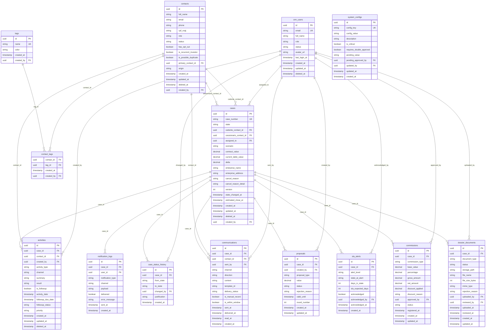

# 12 - Modelo de Dados (ERD Schema)

## Repasse Seguro — Módulo CRM

| **Campo** | **Valor** |
|---|---|
| **Destinatário** | Engenharia e Arquitetura |
| **Escopo** | Modelo de dados relacional completo do CRM: entidades, atributos, tipos, constraints, relacionamentos, índices e políticas de RLS |
| **Módulo** | CRM |
| **Versão** | v1.0 |
| **Responsável** | Claude Code Desktop |
| **Data** | 2026-03-23 (America/Fortaleza) |
| **Dependências** | 01.1–01.5 Regras de Negócio · 02 Stacks · 05.1–05.5 PRD |

---

> **TL;DR**
>
> - **15 tabelas** no schema `public` + 1 tabela de auditoria no schema `audit`.
> - **Convenções:** UUID v4 como PK em todas as tabelas. Soft delete com `deleted_at`. `@db.Timestamptz` obrigatório. Valores monetários em `Decimal(15,2)`.
> - **Tabelas principais:** `cases`, `contacts`, `activities`, `communications`, `commissions`, `dossier_documents`, `crm_users`, `audit_logs`, `sla_alerts`, `proposals`, `case_status_history`, `tags`, `contact_tags`, `notification_logs`, `system_configs`.
> - **RLS:** por `assigned_to` (Analista RS) e `role` (Admin/Coordenador para visão ampla).
> - **Banco:** PostgreSQL 17+ via Supabase. ORM: Prisma 6+.

---

## 1. Visão Geral do Modelo

### 1.1 Schemas PostgreSQL

| **Schema** | **Propósito** | **Tabelas** |
|---|---|---|
| `public` | Domínio principal do CRM | 15 tabelas |
| `audit` | Trilha de auditoria imutável append-only | 1 tabela (`audit_logs`) |

### 1.2 Domínios Funcionais

```
USUÁRIOS E ACESSO
└── crm_users (operadores internos: Admin RS, Coordenador RS, Analista RS)

CONTATOS
└── contacts (Cedentes, Cessionários, Parceiros, Incorporadoras)

CASOS E CICLO DE VIDA
├── cases (entidade central do CRM)
├── case_status_history (histórico append-only de transições de estado)
└── sla_alerts (alertas de SLA por caso)

ATIVIDADES
└── activities (registros e follow-ups vinculados a casos ou contatos)

COMUNICAÇÃO
└── communications (mensagens WhatsApp e e-mails vinculados a casos)

NEGOCIAÇÃO E PROPOSTAS
└── proposals (propostas e contrapropostas por caso)

COMISSÕES
└── commissions (registros de comissão por caso — após fechamento)

DOSSIÊ E DOCUMENTOS
└── dossier_documents (documentos do dossiê por caso)

TAGS
├── tags (tags reutilizáveis)
└── contact_tags (N:N entre contacts e tags)

NOTIFICAÇÕES
└── notification_logs (log de notificações enviadas)

CONFIGURAÇÕES
└── system_configs (parâmetros globais do CRM)

AUDITORIA
└── audit.audit_logs (trilha append-only — schema separado)
```

---

## 2. Diagrama ERD (Mermaid)



---

## 3. Especificação das Tabelas

### 3.1 `crm_users` — Usuários Internos do CRM

| **Campo** | **Tipo** | **Constraint** | **Descrição** |
|---|---|---|---|
| `id` | `UUID` | PK, default `gen_random_uuid()` | Identificador único — sincronizado com Supabase Auth `auth.users.id` |
| `email` | `VARCHAR(255)` | NOT NULL, UNIQUE | E-mail corporativo do usuário |
| `full_name` | `VARCHAR(255)` | NOT NULL | Nome completo |
| `role` | `ENUM(crm_role)` | NOT NULL | `ADMIN_RS`, `COORDENADOR_RS`, `ANALISTA_RS` |
| `status` | `ENUM(user_status)` | NOT NULL, default `ACTIVE` | `ACTIVE`, `SUSPENDED`, `DEACTIVATED` |
| `avatar_url` | `TEXT` | NULL | URL da foto de perfil (Supabase Storage) |
| `last_login_at` | `TIMESTAMPTZ` | NULL | Último login registrado |
| `created_at` | `TIMESTAMPTZ` | NOT NULL, default `now()` | Data de criação |
| `updated_at` | `TIMESTAMPTZ` | NOT NULL, default `now()` | Data de última atualização |
| `deleted_at` | `TIMESTAMPTZ` | NULL | Soft delete |

**Índices:**
- `idx_crm_users_email` — `email` (busca de login)
- `idx_crm_users_role_status` — `(role, status)` (filtro de equipe)

**RLS:**
- `SELECT`: usuário vê apenas seu próprio registro; Admin RS e Coordenador RS veem todos os registros ativos.
- `UPDATE`: usuário atualiza apenas seu próprio perfil; Admin RS atualiza qualquer registro.

---

### 3.2 `contacts` — Contatos (Cedentes, Cessionários, Parceiros)

| **Campo** | **Tipo** | **Constraint** | **Descrição** |
|---|---|---|---|
| `id` | `UUID` | PK | — |
| `full_name` | `VARCHAR(255)` | NOT NULL | Nome completo ou razão social |
| `email` | `VARCHAR(255)` | NULL | E-mail do contato |
| `phone` | `VARCHAR(20)` | NULL | Telefone / WhatsApp |
| `cpf_cnpj` | `VARCHAR(18)` | NULL | CPF ou CNPJ (sem formatação) |
| `role` | `ENUM(contact_role)` | NOT NULL | `CEDENTE`, `CESSIONARIO`, `CORRETOR`, `ADVOGADO`, `INCORPORADORA` |
| `status` | `ENUM(contact_status)` | NOT NULL, default `ACTIVE` | `ACTIVE`, `ARCHIVED`, `OPT_OUT` |
| `has_opt_out` | `BOOLEAN` | NOT NULL, default `false` | Flag de opt-out de comunicação (LGPD) |
| `is_recurrent_investor` | `BOOLEAN` | NOT NULL, default `false` | Flag de investidor recorrente (Cessionário) |
| `is_possible_duplicate` | `BOOLEAN` | NOT NULL, default `false` | Flag de duplicata sinalizada (RN-014) |
| `primary_contact_id` | `UUID` | FK `contacts.id`, NULL | Referência ao registro principal após mesclagem |
| `origin` | `VARCHAR(100)` | NULL | Canal de origem do contato |
| `created_at` | `TIMESTAMPTZ` | NOT NULL, default `now()` | — |
| `updated_at` | `TIMESTAMPTZ` | NOT NULL, default `now()` | — |
| `deleted_at` | `TIMESTAMPTZ` | NULL | Soft delete (retenção LGPD: 5 anos para cancelados, 10 anos para concluídos — RN-013) |
| `created_by` | `UUID` | FK `crm_users.id`, NOT NULL | Analista RS que criou o contato |

**Índices:**
- `idx_contacts_email` — `email`
- `idx_contacts_cpf_cnpj` — `cpf_cnpj` (detecção de duplicatas)
- `idx_contacts_role_status` — `(role, status)`
- `idx_contacts_created_by` — `created_by`

**RLS:**
- Analista RS: vê apenas contatos vinculados a seus próprios casos.
- Coordenador RS: vê todos os contatos da equipe.
- Admin RS: vê todos os contatos.

---

### 3.3 `cases` — Casos (Entidade Central)

| **Campo** | **Tipo** | **Constraint** | **Descrição** |
|---|---|---|---|
| `id` | `UUID` | PK | — |
| `case_number` | `VARCHAR(20)` | NOT NULL, UNIQUE | Formato `RS-YYYY-NNNN` (gerado na criação) |
| `state` | `ENUM(case_state)` | NOT NULL, default `CADASTRO` | Estado atual do caso |
| `cedente_contact_id` | `UUID` | FK `contacts.id`, NOT NULL | Contato Cedente titular |
| `cessionario_contact_id` | `UUID` | FK `contacts.id`, NULL | Contato Cessionário vinculado (preenchido no Match) |
| `assigned_to` | `UUID` | FK `crm_users.id`, NOT NULL | Analista RS responsável |
| `scenario` | `ENUM(cedente_scenario)` | NULL | Cenário escolhido pelo Cedente: `A`, `B`, `C`, `D` |
| `contract_value` | `DECIMAL(15,2)` | NOT NULL | Valor da Tabela Contrato (R$) |
| `current_table_value` | `DECIMAL(15,2)` | NULL | Valor da Tabela Atual (R$) |
| `delta` | `DECIMAL(15,2)` | NULL | Δ = `current_table_value - contract_value` |
| `enterprise_name` | `VARCHAR(255)` | NOT NULL | Nome do empreendimento |
| `enterprise_address` | `TEXT` | NULL | Endereço do empreendimento |
| `cancel_reason` | `ENUM(cancel_reason)` | NULL | Motivo do cancelamento (se cancelado) |
| `cancel_reason_detail` | `TEXT` | NULL | Detalhamento do motivo "Outros" |
| `version` | `INT` | NOT NULL, default `1` | Optimistic locking |
| `state_changed_at` | `TIMESTAMPTZ` | NOT NULL, default `now()` | Data/hora da última mudança de estado |
| `estimated_close_at` | `TIMESTAMPTZ` | NULL | Data estimada de fechamento |
| `created_at` | `TIMESTAMPTZ` | NOT NULL, default `now()` | — |
| `updated_at` | `TIMESTAMPTZ` | NOT NULL, default `now()` | — |
| `deleted_at` | `TIMESTAMPTZ` | NULL | Soft delete |
| `created_by` | `UUID` | FK `crm_users.id`, NOT NULL | Usuário que criou o caso |

**Índices:**
- `idx_cases_case_number` — `case_number`
- `idx_cases_state` — `state`
- `idx_cases_assigned_to` — `assigned_to`
- `idx_cases_cedente` — `cedente_contact_id`
- `idx_cases_state_changed_at` — `state_changed_at` (SLA check)
- `idx_cases_created_at` — `created_at`

**RLS:**
- Analista RS: vê apenas casos com `assigned_to = auth.uid()`.
- Coordenador RS: vê todos os casos da equipe (join com `crm_users`).
- Admin RS: vê todos os casos.

---

### 3.4 `case_status_history` — Histórico de Estados (Append-only)

| **Campo** | **Tipo** | **Constraint** | **Descrição** |
|---|---|---|---|
| `id` | `UUID` | PK | — |
| `case_id` | `UUID` | FK `cases.id`, NOT NULL | Caso relacionado |
| `from_state` | `ENUM(case_state)` | NULL | Estado de origem (NULL na criação) |
| `to_state` | `ENUM(case_state)` | NOT NULL | Estado destino |
| `changed_by` | `UUID` | FK `crm_users.id`, NOT NULL | Usuário que realizou a transição |
| `justification` | `TEXT` | NULL | Justificativa obrigatória para retrocesso de estado |
| `created_at` | `TIMESTAMPTZ` | NOT NULL, default `now()` | — |

> **Append-only:** sem `UPDATE` ou `DELETE` permitidos nesta tabela.

**Índices:**
- `idx_case_status_history_case_id` — `case_id`
- `idx_case_status_history_created_at` — `created_at`

---

### 3.5 `sla_alerts` — Alertas de SLA

| **Campo** | **Tipo** | **Constraint** | **Descrição** |
|---|---|---|---|
| `id` | `UUID` | PK | — |
| `case_id` | `UUID` | FK `cases.id`, NOT NULL | Caso em alerta |
| `alert_level` | `ENUM(sla_alert_level)` | NOT NULL | `WARNING` (>80%), `CRITICAL` (100%), `URGENT` (>150%) |
| `state_at_alert` | `ENUM(case_state)` | NOT NULL | Estado do caso quando o alerta foi gerado |
| `days_in_state` | `INT` | NOT NULL | Dias no estado atual quando o alerta disparou |
| `sla_expected_days` | `INT` | NOT NULL | SLA esperado para o estado (dias úteis) |
| `acknowledged` | `BOOLEAN` | NOT NULL, default `false` | Se o alerta foi reconhecido |
| `acknowledged_by` | `UUID` | FK `crm_users.id`, NULL | Usuário que reconheceu |
| `acknowledged_at` | `TIMESTAMPTZ` | NULL | Data/hora do reconhecimento |
| `created_at` | `TIMESTAMPTZ` | NOT NULL, default `now()` | — |

**Índices:**
- `idx_sla_alerts_case_id` — `case_id`
- `idx_sla_alerts_acknowledged` — `acknowledged` (filtro de alertas ativos)
- `idx_sla_alerts_created_at` — `created_at`

---

### 3.6 `activities` — Atividades e Follow-ups

| **Campo** | **Tipo** | **Constraint** | **Descrição** |
|---|---|---|---|
| `id` | `UUID` | PK | — |
| `case_id` | `UUID` | FK `cases.id`, NULL | Caso vinculado (opcional se vinculado a contato direto) |
| `contact_id` | `UUID` | FK `contacts.id`, NULL | Contato vinculado |
| `created_by` | `UUID` | FK `crm_users.id`, NOT NULL | Analista RS que registrou |
| `activity_type` | `ENUM(activity_type)` | NOT NULL | `CALL`, `MEETING`, `EMAIL`, `WHATSAPP`, `INTERNAL_NOTE` |
| `channel` | `VARCHAR(50)` | NULL | Canal utilizado (detalhe do tipo) |
| `summary` | `TEXT` | NOT NULL | Resumo da atividade (mín. 20 caracteres) |
| `result` | `ENUM(activity_result)` | NULL | `POSITIVE`, `NEUTRAL`, `NO_ANSWER`, `NEGATIVE` |
| `is_followup` | `BOOLEAN` | NOT NULL, default `false` | Se é um follow-up agendado |
| `activity_date` | `TIMESTAMPTZ` | NOT NULL | Data/hora da atividade passada |
| `followup_due_date` | `TIMESTAMPTZ` | NULL | Prazo do follow-up (se `is_followup = true`) |
| `followup_status` | `ENUM(followup_status)` | NULL | `SCHEDULED`, `COMPLETED`, `OVERDUE` |
| `priority` | `ENUM(activity_priority)` | NOT NULL, default `NORMAL` | `NORMAL`, `HIGH` |
| `created_at` | `TIMESTAMPTZ` | NOT NULL, default `now()` | — |
| `updated_at` | `TIMESTAMPTZ` | NOT NULL, default `now()` | — |
| `deleted_at` | `TIMESTAMPTZ` | NULL | Soft delete |

**Índices:**
- `idx_activities_case_id` — `case_id`
- `idx_activities_created_by` — `created_by`
- `idx_activities_followup_due_date` — `followup_due_date` (verificação diária de vencidos)
- `idx_activities_followup_status` — `followup_status`

---

### 3.7 `communications` — Comunicações (WhatsApp / E-mail)

| **Campo** | **Tipo** | **Constraint** | **Descrição** |
|---|---|---|---|
| `id` | `UUID` | PK | — |
| `case_id` | `UUID` | FK `cases.id`, NULL | Caso vinculado |
| `contact_id` | `UUID` | FK `contacts.id`, NOT NULL | Contato destinatário ou remetente |
| `sent_by` | `UUID` | FK `crm_users.id`, NULL | Usuário que enviou (NULL se recebido) |
| `channel` | `ENUM(comm_channel)` | NOT NULL | `WHATSAPP`, `EMAIL` |
| `direction` | `ENUM(comm_direction)` | NOT NULL | `OUTBOUND`, `INBOUND` |
| `content` | `TEXT` | NOT NULL | Conteúdo da mensagem |
| `template_id` | `VARCHAR(100)` | NULL | ID do template Meta (se usado) |
| `delivery_status` | `ENUM(delivery_status)` | NOT NULL, default `SENT` | `SENT`, `DELIVERED`, `READ`, `FAILED` |
| `is_manual_record` | `BOOLEAN` | NOT NULL, default `false` | Se foi registrado manualmente no CRM |
| `is_within_window` | `BOOLEAN` | NOT NULL, default `true` | Se enviado dentro da janela de 24h |
| `sent_at` | `TIMESTAMPTZ` | NOT NULL | Data/hora do envio ou recebimento |
| `delivered_at` | `TIMESTAMPTZ` | NULL | Data/hora da entrega confirmada |
| `read_at` | `TIMESTAMPTZ` | NULL | Data/hora da leitura confirmada |
| `created_at` | `TIMESTAMPTZ` | NOT NULL, default `now()` | — |

> **Append-only:** registros de comunicação não são editados ou deletados. Sem `deleted_at`.

**Índices:**
- `idx_communications_case_id` — `case_id`
- `idx_communications_contact_id` — `contact_id`
- `idx_communications_sent_at` — `sent_at`

---

### 3.8 `proposals` — Propostas e Contrapropostas

| **Campo** | **Tipo** | **Constraint** | **Descrição** |
|---|---|---|---|
| `id` | `UUID` | PK | — |
| `case_id` | `UUID` | FK `cases.id`, NOT NULL | Caso da negociação |
| `created_by` | `UUID` | FK `crm_users.id`, NOT NULL | Analista RS que registrou |
| `proposal_type` | `ENUM(proposal_type)` | NOT NULL | `PROPOSAL` (Cessionário), `COUNTEROFFER` (Cedente), `FINAL_OFFER` |
| `value` | `DECIMAL(15,2)` | NOT NULL | Valor proposto (R$) |
| `status` | `ENUM(proposal_status)` | NOT NULL, default `ACTIVE` | `ACTIVE`, `ACCEPTED`, `REJECTED`, `EXPIRED` |
| `rejection_reason` | `TEXT` | NULL | Motivo da rejeição |
| `valid_until` | `TIMESTAMPTZ` | NULL | Validade da proposta |
| `round_number` | `INT` | NOT NULL, default `1` | Número da rodada de negociação |
| `created_at` | `TIMESTAMPTZ` | NOT NULL, default `now()` | — |
| `updated_at` | `TIMESTAMPTZ` | NOT NULL, default `now()` | — |

**Índices:**
- `idx_proposals_case_id` — `case_id`
- `idx_proposals_status` — `status`

---

### 3.9 `commissions` — Comissões

| **Campo** | **Tipo** | **Constraint** | **Descrição** |
|---|---|---|---|
| `id` | `UUID` | PK | — |
| `case_id` | `UUID` | FK `cases.id`, NOT NULL | Caso do fechamento |
| `commission_type` | `ENUM(commission_type)` | NOT NULL | `CEDENTE`, `CESSIONARIO`, `PARCEIRO` |
| `base_value` | `DECIMAL(15,2)` | NOT NULL | Valor base de cálculo |
| `percentage` | `DECIMAL(5,4)` | NOT NULL | Percentual aplicado (ex: 0.0500 = 5%) |
| `gross_amount` | `DECIMAL(15,2)` | NOT NULL | Valor bruto calculado |
| `net_amount` | `DECIMAL(15,2)` | NOT NULL | Valor líquido (após desconto) |
| `discount_applied` | `DECIMAL(15,2)` | NOT NULL, default `0` | Valor do desconto concedido |
| `discount_reason` | `TEXT` | NULL | Justificativa do desconto |
| `approved_by` | `UUID` | FK `crm_users.id`, NULL | Admin RS que aprovou desconto |
| `status` | `ENUM(commission_status)` | NOT NULL, default `PENDING` | `PENDING`, `REGISTERED`, `PAID`, `CANCELLED` |
| `registered_at` | `TIMESTAMPTZ` | NULL | Data de registro efetivo |
| `created_at` | `TIMESTAMPTZ` | NOT NULL, default `now()` | — |
| `updated_at` | `TIMESTAMPTZ` | NOT NULL, default `now()` | — |

**Índices:**
- `idx_commissions_case_id` — `case_id`
- `idx_commissions_status` — `status`
- `idx_commissions_registered_at` — `registered_at` (relatórios financeiros)

---

### 3.10 `dossier_documents` — Documentos do Dossiê

| **Campo** | **Tipo** | **Constraint** | **Descrição** |
|---|---|---|---|
| `id` | `UUID` | PK | — |
| `case_id` | `UUID` | FK `cases.id`, NOT NULL | Caso do dossiê |
| `document_type` | `ENUM(dossier_doc_type)` | NOT NULL | `TABELA_ATUAL`, `TABELA_CONTRATO`, `SALDO_DEVEDOR`, `DOCS_PESSOAIS`, `INSTRUMENTO_CESSAO` |
| `status` | `ENUM(doc_status)` | NOT NULL, default `PENDING` | `PENDING`, `UPLOADED`, `APPROVED`, `REJECTED` |
| `storage_path` | `TEXT` | NULL | Caminho no Supabase Storage |
| `file_name` | `VARCHAR(255)` | NULL | Nome original do arquivo |
| `file_size_bytes` | `INT` | NULL | Tamanho do arquivo em bytes |
| `mime_type` | `VARCHAR(100)` | NULL | Tipo MIME (`application/pdf`, `image/jpeg`, etc.) |
| `rejection_reason` | `TEXT` | NULL | Motivo de rejeição pelo Coordenador RS |
| `uploaded_by` | `UUID` | FK `crm_users.id`, NULL | Analista RS que fez upload |
| `reviewed_by` | `UUID` | FK `crm_users.id`, NULL | Coordenador RS que aprovou/rejeitou |
| `uploaded_at` | `TIMESTAMPTZ` | NULL | Data/hora do upload |
| `reviewed_at` | `TIMESTAMPTZ` | NULL | Data/hora da revisão |
| `created_at` | `TIMESTAMPTZ` | NOT NULL, default `now()` | — |
| `updated_at` | `TIMESTAMPTZ` | NOT NULL, default `now()` | — |

**Índices:**
- `idx_dossier_documents_case_id` — `case_id`
- `idx_dossier_documents_status` — `status`

---

### 3.11 `tags` e `contact_tags` — Tags de Contato

**`tags`:**

| **Campo** | **Tipo** | **Constraint** | **Descrição** |
|---|---|---|---|
| `id` | `UUID` | PK | — |
| `name` | `VARCHAR(50)` | NOT NULL, UNIQUE | Nome da tag |
| `color` | `VARCHAR(7)` | NOT NULL | Hex color (ex: `#FF5733`) |
| `created_at` | `TIMESTAMPTZ` | NOT NULL | — |
| `created_by` | `UUID` | FK `crm_users.id`, NOT NULL | — |

**`contact_tags`:**

| **Campo** | **Tipo** | **Constraint** | **Descrição** |
|---|---|---|---|
| `contact_id` | `UUID` | FK `contacts.id`, PK composta | — |
| `tag_id` | `UUID` | FK `tags.id`, PK composta | — |
| `created_at` | `TIMESTAMPTZ` | NOT NULL | — |
| `created_by` | `UUID` | FK `crm_users.id`, NOT NULL | — |

---

### 3.12 `notification_logs` — Log de Notificações

| **Campo** | **Tipo** | **Constraint** | **Descrição** |
|---|---|---|---|
| `id` | `UUID` | PK | — |
| `case_id` | `UUID` | FK `cases.id`, NULL | Caso relacionado (quando aplicável) |
| `user_id` | `UUID` | FK `crm_users.id`, NOT NULL | Destinatário da notificação |
| `notification_type` | `VARCHAR(50)` | NOT NULL | `SLA_WARNING`, `FOLLOWUP_OVERDUE`, `CASE_ADVANCED`, etc. |
| `channel` | `VARCHAR(20)` | NOT NULL | `EMAIL`, `IN_APP`, `SSE` |
| `payload` | `JSONB` | NOT NULL | Dados da notificação (título, corpo, link) |
| `delivered` | `BOOLEAN` | NOT NULL, default `false` | Se foi entregue com sucesso |
| `error_message` | `TEXT` | NULL | Mensagem de erro (se falhou) |
| `sent_at` | `TIMESTAMPTZ` | NOT NULL, default `now()` | — |
| `created_at` | `TIMESTAMPTZ` | NOT NULL, default `now()` | — |

---

### 3.13 `system_configs` — Parâmetros do Sistema

| **Campo** | **Tipo** | **Constraint** | **Descrição** |
|---|---|---|---|
| `id` | `UUID` | PK | — |
| `config_key` | `VARCHAR(100)` | NOT NULL, UNIQUE | Chave do parâmetro |
| `config_value` | `TEXT` | NOT NULL | Valor atual |
| `description` | `TEXT` | NULL | Descrição do parâmetro |
| `is_critical` | `BOOLEAN` | NOT NULL, default `false` | Se requer aprovação dupla |
| `requires_double_approval` | `BOOLEAN` | NOT NULL, default `false` | Se mudança requer segundo Admin RS |
| `pending_value` | `TEXT` | NULL | Valor pendente de segunda aprovação |
| `pending_approved_by` | `UUID` | FK `crm_users.id`, NULL | Primeiro Admin RS que aprovou |
| `updated_by` | `UUID` | FK `crm_users.id`, NOT NULL | Último usuário que atualizou |
| `updated_at` | `TIMESTAMPTZ` | NOT NULL, default `now()` | — |
| `created_at` | `TIMESTAMPTZ` | NOT NULL, default `now()` | — |

---

### 3.14 `audit.audit_logs` — Trilha de Auditoria (Schema separado)

| **Campo** | **Tipo** | **Constraint** | **Descrição** |
|---|---|---|---|
| `id` | `UUID` | PK | — |
| `table_name` | `VARCHAR(100)` | NOT NULL | Tabela afetada |
| `record_id` | `UUID` | NOT NULL | PK do registro afetado |
| `action` | `VARCHAR(10)` | NOT NULL | `INSERT`, `UPDATE`, `DELETE` |
| `old_data` | `JSONB` | NULL | Dados antes da alteração |
| `new_data` | `JSONB` | NULL | Dados após a alteração |
| `changed_by` | `UUID` | NOT NULL | `auth.uid()` no momento da operação |
| `ip_address` | `VARCHAR(45)` | NULL | IP do solicitante |
| `user_agent` | `TEXT` | NULL | User agent do browser |
| `created_at` | `TIMESTAMPTZ` | NOT NULL, default `now()` | — |

> **Append-only:** sem `UPDATE` ou `DELETE`. Retenção: 5 anos (RN-013 adaptado ao CRM).

**Índices:**
- `idx_audit_logs_table_record` — `(table_name, record_id)`
- `idx_audit_logs_changed_by` — `changed_by`
- `idx_audit_logs_created_at` — `created_at` (retenção e paginação)

---

## 4. Enums

| **Enum** | **Valores** |
|---|---|
| `crm_role` | `ADMIN_RS`, `COORDENADOR_RS`, `ANALISTA_RS` |
| `user_status` | `ACTIVE`, `SUSPENDED`, `DEACTIVATED` |
| `contact_role` | `CEDENTE`, `CESSIONARIO`, `CORRETOR`, `ADVOGADO`, `INCORPORADORA` |
| `contact_status` | `ACTIVE`, `ARCHIVED`, `OPT_OUT` |
| `case_state` | `CADASTRO`, `SIMULACAO`, `VERIFICACAO`, `PUBLICACAO`, `MATCH`, `NEGOCIACAO`, `ANUENCIA`, `FORMALIZACAO`, `CONCLUIDO`, `CANCELADO` |
| `cedente_scenario` | `A`, `B`, `C`, `D` |
| `cancel_reason` | `CEDENTE_DESISTIU`, `DOCUMENTACAO_INVALIDA`, `SEM_CESSIONARIO`, `ANUENCIA_NEGADA`, `OUTROS` |
| `activity_type` | `CALL`, `MEETING`, `EMAIL`, `WHATSAPP`, `INTERNAL_NOTE` |
| `activity_result` | `POSITIVE`, `NEUTRAL`, `NO_ANSWER`, `NEGATIVE` |
| `followup_status` | `SCHEDULED`, `COMPLETED`, `OVERDUE` |
| `activity_priority` | `NORMAL`, `HIGH` |
| `comm_channel` | `WHATSAPP`, `EMAIL` |
| `comm_direction` | `OUTBOUND`, `INBOUND` |
| `delivery_status` | `SENT`, `DELIVERED`, `READ`, `FAILED` |
| `proposal_type` | `PROPOSAL`, `COUNTEROFFER`, `FINAL_OFFER` |
| `proposal_status` | `ACTIVE`, `ACCEPTED`, `REJECTED`, `EXPIRED` |
| `commission_type` | `CEDENTE`, `CESSIONARIO`, `PARCEIRO` |
| `commission_status` | `PENDING`, `REGISTERED`, `PAID`, `CANCELLED` |
| `dossier_doc_type` | `TABELA_ATUAL`, `TABELA_CONTRATO`, `SALDO_DEVEDOR`, `DOCS_PESSOAIS`, `INSTRUMENTO_CESSAO` |
| `doc_status` | `PENDING`, `UPLOADED`, `APPROVED`, `REJECTED` |
| `sla_alert_level` | `WARNING`, `CRITICAL`, `URGENT` |

---

## 5. Políticas de RLS

### 5.1 Tabela `cases`

```sql
-- Analista RS: apenas seus próprios casos
CREATE POLICY "analista_rs_see_own_cases"
ON cases FOR SELECT
USING (
  assigned_to = auth.uid()
  AND deleted_at IS NULL
);

-- Coordenador RS e Admin RS: todos os casos ativos
CREATE POLICY "coord_admin_see_all_cases"
ON cases FOR SELECT
USING (
  EXISTS (
    SELECT 1 FROM crm_users
    WHERE id = auth.uid()
    AND role IN ('COORDENADOR_RS', 'ADMIN_RS')
    AND deleted_at IS NULL
  )
  AND deleted_at IS NULL
);
```

### 5.2 Tabela `contacts`

```sql
-- Analista RS: apenas contatos vinculados a seus casos
CREATE POLICY "analista_rs_see_contacts"
ON contacts FOR SELECT
USING (
  EXISTS (
    SELECT 1 FROM cases
    WHERE (cedente_contact_id = contacts.id OR cessionario_contact_id = contacts.id)
    AND assigned_to = auth.uid()
    AND deleted_at IS NULL
  )
  AND contacts.deleted_at IS NULL
);
```

### 5.3 Tabela `audit.audit_logs`

```sql
-- Apenas Admin RS pode ler o log de auditoria
CREATE POLICY "admin_rs_read_audit"
ON audit.audit_logs FOR SELECT
USING (
  EXISTS (
    SELECT 1 FROM crm_users
    WHERE id = auth.uid()
    AND role = 'ADMIN_RS'
    AND deleted_at IS NULL
  )
);

-- Nenhum usuário pode inserir/atualizar/deletar diretamente — apenas via trigger
```

---

## 6. Controle de Versão

| **Versão** | **Data** | **Responsável** | **Alteração** |
|---|---|---|---|
| v1.0 | 2026-03-23 | Claude Code Desktop | Versão inicial — 15 tabelas public + 1 tabela audit, 20 enums, políticas RLS |
