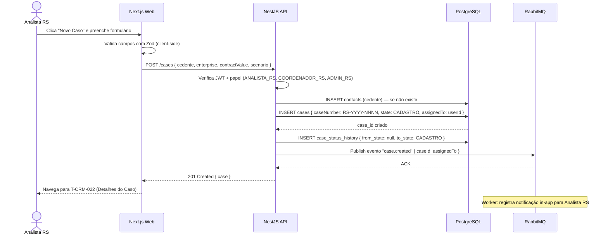
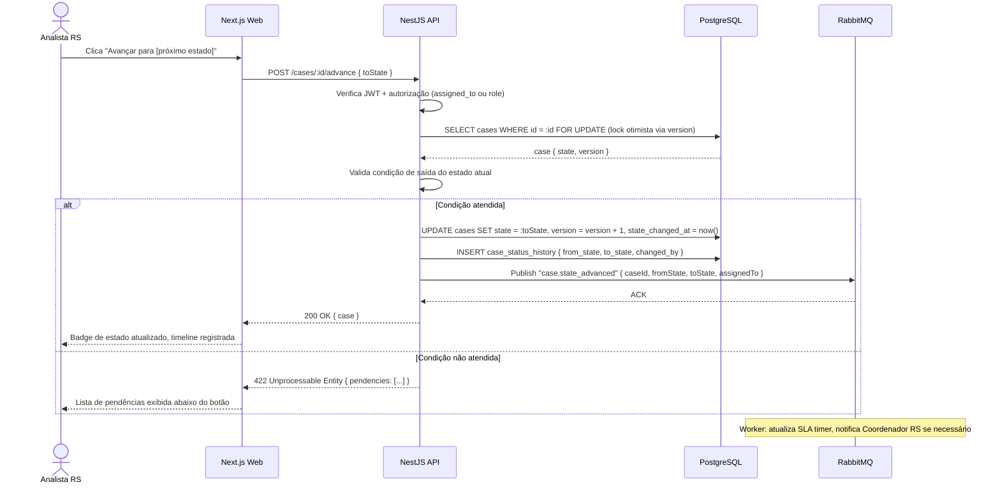
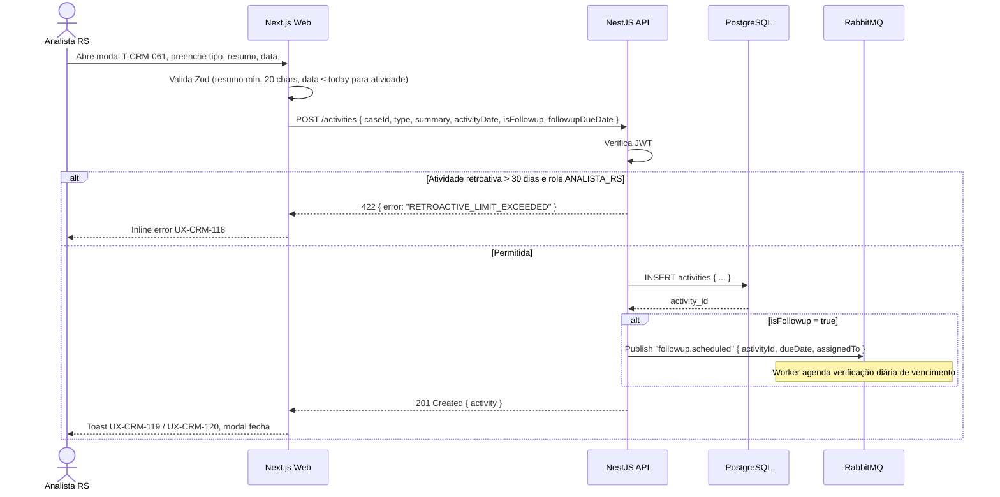
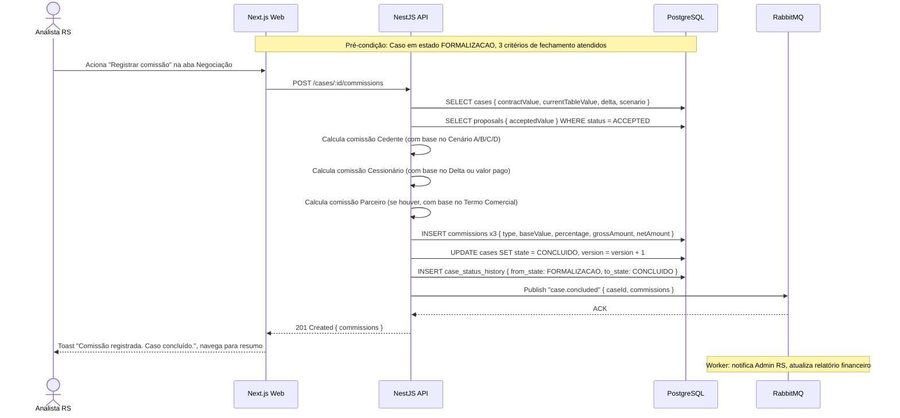
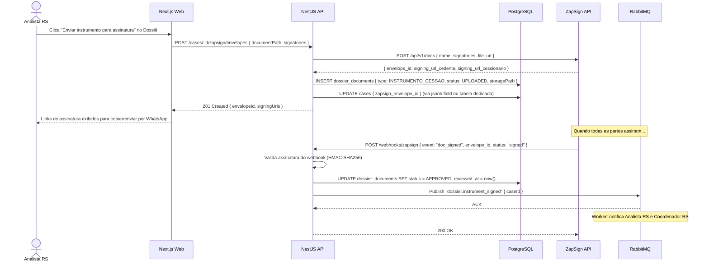

# 14 - Especificações Técnicas

## Repasse Seguro — Módulo CRM

| **Campo** | **Valor** |
|---|---|
| **Destinatário** | Tech Lead, Backend Lead, Frontend Lead, DevOps |
| **Escopo** | Arquitetura interna do CRM: monorepo, stack, fluxos críticos, endpoints, ADRs e contratos de integração |
| **Módulo** | CRM |
| **Versão** | v1.0 |
| **Responsável** | Claude Code Desktop |
| **Data** | 2026-03-23 (America/Fortaleza) |
| **Dependências** | 01.1–01.5 Regras de Negócio · 02 Stacks · 05.1–05.5 PRD · 12 ERD Schema · 13 Schema Prisma |

---

> **TL;DR**
>
> - **Monorepo Turborepo** com 3 workspaces: `apps/web` (Next.js 15), `apps/api` (NestJS 10), `packages/shared`.
> - **Sem app mobile MVP** — web-only (responsivo ≥768px). Ver Doc 11.
> - **6 fluxos críticos** documentados com diagramas de sequência Mermaid.
> - **PostgreSQL 17 / Supabase** + Redis Upstash + RabbitMQ CloudAMQP.
> - **7 ADRs** documentadas neste arquivo.
> - **SLA de performance:** API < 200ms no p95 para endpoints críticos.

---

## 1. Arquitetura Geral

### 1.1 Monorepo Turborepo

```
repasse-seguro/                    ← raiz do monorepo
├── apps/
│   ├── web/                       ← Next.js 15 App Router (CRM + portal externo)
│   └── api/                       ← NestJS 10 (API REST + workers)
├── packages/
│   ├── shared/                    ← Tipos TypeScript, DTOs, utilitários compartilhados
│   ├── database/                  ← Prisma schema + client exportado
│   └── ui/                        ← Componentes shadcn/ui customizados
├── turbo.json                     ← Pipeline de builds Turborepo
├── pnpm-workspace.yaml
└── package.json
```

### 1.2 Stack Normativa

| **Camada** | **Tecnologia** | **Versão** | **Propósito** |
|---|---|---|---|
| Frontend web | Next.js (App Router) | 15.x | SPA/SSR do CRM |
| UI Components | shadcn/ui + Radix UI | latest | Componentes acessíveis |
| Estilização | Tailwind CSS | 3.x | Utility-first CSS |
| Estado servidor | TanStack Query | 5.x | Cache e sync de dados |
| Formulários | React Hook Form + Zod | latest | Validação type-safe |
| Backend API | NestJS | 10.x | REST API + workers |
| ORM | Prisma | 6.x | Acesso ao banco |
| Banco de dados | PostgreSQL | 17 via Supabase | Persistência principal |
| Auth | Supabase Auth | latest | Sessões e JWT |
| Storage | Supabase Storage | latest | Documentos do Dossiê |
| Cache / Rate limit | Redis (Upstash) | serverless | Cache de sessões, throttle |
| Message broker | RabbitMQ (CloudAMQP) | latest | Eventos assíncronos |
| Assinatura digital | ZapSign | API v2 | Instrumentos de cessão |
| WhatsApp | Meta Business API | latest | Comunicação com contatos |
| Monorepo | Turborepo | latest | Build pipeline |
| Package manager | pnpm | 9.x | Workspaces |

> Referência normativa completa: Doc 02 (Stacks).

### 1.3 Diagrama de Componentes

```
┌─────────────────────────────────────────────────────────────────┐
│  Browser (Next.js 15 App Router)                                │
│  ┌─────────────────────────────────────────────────────────┐    │
│  │  CRM SPA (Client Components + Server Components)        │    │
│  │  TanStack Query ←→ REST API                             │    │
│  │  Supabase Auth SDK (sessão JWT)                         │    │
│  └─────────────────────────────────────────────────────────┘    │
└─────────────────────────────────────────┬───────────────────────┘
                                          │ HTTPS
┌─────────────────────────────────────────▼───────────────────────┐
│  NestJS 10 API                                                   │
│  ┌────────────┐  ┌────────────┐  ┌────────────┐  ┌───────────┐ │
│  │ Auth Guard │  │ Cases      │  │ Contacts   │  │ Reports   │ │
│  │ RLS Guard  │  │ Module     │  │ Module     │  │ Module    │ │
│  └────────────┘  └─────┬──────┘  └─────┬──────┘  └─────┬─────┘ │
│                        │               │                │       │
│  ┌─────────────────────▼───────────────▼────────────────▼─────┐ │
│  │  Prisma Client (PostgreSQL 17 / Supabase)                   │ │
│  └────────────────────────────────────────────────────────────┘ │
│                                                                  │
│  ┌────────────────┐  ┌─────────────────┐  ┌────────────────┐   │
│  │ Redis Upstash  │  │ RabbitMQ        │  │ Supabase       │   │
│  │ (cache/throttle│  │ CloudAMQP       │  │ Storage        │   │
│  └────────────────┘  │ (eventos async) │  │ (documentos)   │   │
│                      └────────┬────────┘  └────────────────┘   │
│                               │                                  │
│  ┌────────────────────────────▼──────────────────────────────┐  │
│  │  Workers NestJS                                            │  │
│  │  sla-checker.worker  |  notification.worker              │  │
│  │  whatsapp.worker      |  report-generator.worker         │  │
│  └───────────────────────────────────────────────────────────┘  │
└──────────────────────────────────────────────────────────────────┘
                        │                │
               ┌────────▼─────┐  ┌───────▼──────┐
               │  ZapSign API │  │  Meta WA API │
               └──────────────┘  └──────────────┘
```

---

## 2. Fluxos Críticos

### 2.1 Fluxo 1 — Criação de Caso



### 2.2 Fluxo 2 — Avanço de Estado do Caso



### 2.3 Fluxo 3 — Registro de Atividade / Follow-up



### 2.4 Fluxo 4 — Cálculo e Registro de Comissão



### 2.5 Fluxo 5 — Geração de Relatório

```mermaid
sequenceDiagram
    actor U as Admin RS / Coordenador RS
    participant W as Next.js Web
    participant API as NestJS API
    participant MQ as RabbitMQ
    participant Worker as Report Worker
    participant DB as PostgreSQL
    participant S3 as Supabase Storage

    U->>W: Seleciona relatório, período e clica "Exportar"
    W->>API: POST /reports/generate { type, dateFrom, dateTo, filters }
    API->>API: Verifica role (Admin/Coordenador para maioria; Admin para Financeiro)
    API->>MQ: Publish "report.requested" { reportType, userId, params }
    API-->>W: 202 Accepted { jobId }
    W-->>U: "Relatório em processamento. Você receberá uma notificação quando estiver pronto."

    MQ->>Worker: Consume "report.requested"
    Worker->>DB: Executa query de relatório (pode ser pesada)
    DB-->>Worker: Dataset
    Worker->>Worker: Gera CSV / XLSX
    Worker->>S3: Upload do arquivo gerado
    S3-->>Worker: signed_url (validade 1h)
    Worker->>DB: INSERT notification_logs { type: REPORT_READY, payload: { signedUrl } }
    Worker->>API: POST /notifications/push { userId, payload }
    API-->>W: SSE event "notification" { type: REPORT_READY, downloadUrl }
    W-->>U: Toast "Relatório pronto. Baixar agora." com link
```

### 2.6 Fluxo 6 — Integração ZapSign (Assinatura Digital)



---

## 3. Contratos de API

### 3.1 Padrão de Resposta

```typescript
// Sucesso
{
  data: T,
  meta?: {
    page: number,
    pageSize: number,
    total: number
  }
}

// Erro
{
  error: {
    code: string,      // Código interno (ex: "CASE_NOT_FOUND", "SLA_CONDITION_FAILED")
    message: string,   // Mensagem legível em português
    details?: Record<string, string[]>  // Erros de validação por campo
  }
}
```

### 3.2 Endpoints Principais

#### Casos

| **Método** | **Endpoint** | **Descrição** | **Auth** | **SLA** |
|---|---|---|---|---|
| `GET` | `/cases` | Listar casos (com filtros, paginação) | JWT + role | <200ms p95 |
| `POST` | `/cases` | Criar novo caso | JWT (ANALISTA+) | <300ms p95 |
| `GET` | `/cases/:id` | Detalhe do caso | JWT + RLS | <150ms p95 |
| `PATCH` | `/cases/:id` | Atualizar campos do caso | JWT + RLS | <200ms p95 |
| `POST` | `/cases/:id/advance` | Avançar estado | JWT + RLS | <500ms p95 |
| `POST` | `/cases/:id/cancel` | Cancelar caso | JWT + RLS | <300ms p95 |
| `GET` | `/cases/:id/timeline` | Histórico de estados | JWT + RLS | <200ms p95 |

#### Contatos

| **Método** | **Endpoint** | **Descrição** | **Auth** | **SLA** |
|---|---|---|---|---|
| `GET` | `/contacts` | Listar contatos | JWT + role | <200ms p95 |
| `POST` | `/contacts` | Criar contato | JWT (ANALISTA+) | <200ms p95 |
| `GET` | `/contacts/:id` | Perfil do contato | JWT + RLS | <150ms p95 |
| `PATCH` | `/contacts/:id` | Atualizar contato | JWT + RLS | <200ms p95 |
| `POST` | `/contacts/:id/opt-out` | Registrar opt-out | JWT (ANALISTA+) | <200ms p95 |
| `POST` | `/contacts/merge` | Mesclar duplicatas | JWT (COORD+) | <500ms p95 |

#### Atividades

| **Método** | **Endpoint** | **Descrição** | **Auth** | **SLA** |
|---|---|---|---|---|
| `GET` | `/activities` | Listar atividades (com filtros) | JWT + role | <200ms p95 |
| `POST` | `/activities` | Registrar atividade / follow-up | JWT (ANALISTA+) | <200ms p95 |
| `PATCH` | `/activities/:id` | Atualizar follow-up | JWT + RLS | <200ms p95 |
| `POST` | `/activities/:id/complete` | Marcar follow-up como concluído | JWT + RLS | <200ms p95 |

#### Comunicações

| **Método** | **Endpoint** | **Descrição** | **Auth** | **SLA** |
|---|---|---|---|---|
| `GET` | `/cases/:id/communications` | Thread de mensagens do caso | JWT + RLS | <200ms p95 |
| `POST` | `/cases/:id/communications` | Enviar mensagem WhatsApp | JWT (ANALISTA+) | <500ms p95 |
| `POST` | `/cases/:id/communications/manual` | Registrar mensagem manualmente | JWT (ANALISTA+) | <200ms p95 |

#### Negociação

| **Método** | **Endpoint** | **Descrição** | **Auth** | **SLA** |
|---|---|---|---|---|
| `GET` | `/cases/:id/proposals` | Listar propostas do caso | JWT + RLS | <200ms p95 |
| `POST` | `/cases/:id/proposals` | Registrar proposta | JWT (ANALISTA+) | <200ms p95 |
| `POST` | `/cases/:id/proposals/:proposalId/accept` | Aceitar proposta | JWT (ANALISTA+) | <300ms p95 |

#### Dossiê

| **Método** | **Endpoint** | **Descrição** | **Auth** | **SLA** |
|---|---|---|---|---|
| `GET` | `/cases/:id/dossier` | Checklist do dossiê | JWT + RLS | <200ms p95 |
| `POST` | `/cases/:id/dossier/upload` | Upload de documento | JWT (ANALISTA+) | <2000ms p95 |
| `POST` | `/cases/:id/dossier/approve` | Aprovar dossiê completo | JWT (COORD+) | <300ms p95 |
| `PATCH` | `/cases/:id/dossier/:docId/reject` | Rejeitar documento | JWT (COORD+) | <200ms p95 |
| `POST` | `/cases/:id/zapsign/envelopes` | Enviar instrumento para ZapSign | JWT (ANALISTA+) | <2000ms p95 |

#### SLA e Alertas

| **Método** | **Endpoint** | **Descrição** | **Auth** | **SLA** |
|---|---|---|---|---|
| `GET` | `/sla/dashboard` | Dashboard de SLA | JWT (COORD+) | <300ms p95 |
| `GET` | `/sla/alerts` | Alertas ativos | JWT (COORD+) | <200ms p95 |
| `POST` | `/sla/alerts/:id/acknowledge` | Reconhecer alerta | JWT (COORD+) | <200ms p95 |

#### Relatórios

| **Método** | **Endpoint** | **Descrição** | **Auth** | **SLA** |
|---|---|---|---|---|
| `POST` | `/reports/generate` | Solicitar geração de relatório | JWT (COORD+) | <200ms p95 (resposta 202) |
| `GET` | `/reports/jobs/:jobId` | Status do job de geração | JWT + role | <100ms p95 |

#### Equipe

| **Método** | **Endpoint** | **Descrição** | **Auth** | **SLA** |
|---|---|---|---|---|
| `GET` | `/team/users` | Listar usuários | JWT (COORD+) | <200ms p95 |
| `POST` | `/team/invite` | Convidar membro | JWT (ADMIN) | <300ms p95 |
| `POST` | `/team/users/:id/suspend` | Suspender usuário | JWT (ADMIN) | <200ms p95 |
| `POST` | `/team/users/:id/deactivate` | Desligar usuário | JWT (ADMIN) | <500ms p95 |
| `GET` | `/team/workload` | Carga de casos por Analista | JWT (COORD+) | <200ms p95 |

#### Webhooks

| **Método** | **Endpoint** | **Descrição** | **Auth** |
|---|---|---|---|
| `POST` | `/webhooks/zapsign` | Receber eventos ZapSign | HMAC-SHA256 |
| `POST` | `/webhooks/whatsapp` | Receber mensagens WhatsApp | Meta Verify Token |

---

## 4. Workers e Processamento Assíncrono

### 4.1 `sla-checker.worker`

- **Trigger:** cron diário às 08h00 (`America/Fortaleza`) via NestJS `@Cron`.
- **Função:** percorre todos os casos ativos, calcula dias em estado atual vs. SLA esperado.
- **Regras:**
  - >80% do SLA → cria `SlaAlert { level: WARNING }`, publica em RabbitMQ → worker de notificação.
  - 100% do SLA → cria `SlaAlert { level: CRITICAL }`, notifica Analista RS + Coordenador RS.
  - >150% do SLA → `SlaAlert { level: URGENT }`, notifica Coordenador RS + Admin RS.
  - Ciclo total >60 dias corridos → alerta consolidado ao Coordenador RS.
- **Idempotência:** verifica se já existe alerta do mesmo nível para o caso no dia atual antes de criar novo.

### 4.2 `followup-checker.worker`

- **Trigger:** cron diário às 08h00 (`America/Fortaleza`).
- **Função:** busca todos os follow-ups com `followup_due_date < now()` e `followup_status = SCHEDULED`.
- **Ação:** atualiza `followup_status = OVERDUE`, publica evento de notificação.
- **Notificação >3 dias vencido:** publica evento adicional para notificar Coordenador RS.

### 4.3 `notification.worker`

- **Trigger:** consome fila `crm.notifications` do RabbitMQ.
- **Função:** processa eventos de notificação e entrega via in-app (SSE), e-mail (Resend) ou log.
- **Dead Letter Queue:** falhas após 3 tentativas vão para `crm.notifications.dlq` com `x-death` headers.

### 4.4 `whatsapp.worker`

- **Trigger:** consome fila `crm.whatsapp.outbound`.
- **Função:** envia mensagens via Meta Business API, atualiza `delivery_status` no banco.
- **Janela de 24h:** verifica se contato enviou mensagem nas últimas 24h. Se não, exige template.
- **Retry:** 3 tentativas com backoff exponencial (1s, 3s, 9s).

### 4.5 `report-generator.worker`

- **Trigger:** consome fila `crm.reports`.
- **Função:** executa queries pesadas de relatório, gera XLSX/CSV, faz upload no Supabase Storage.
- **Timeout:** máximo 5 minutos por relatório. Se ultrapassar, registra erro e notifica usuário.

---

## 5. Cache Strategy (Redis Upstash)

| **Chave** | **Valor** | **TTL** | **Invalidação** |
|---|---|---|---|
| `cases:summary:{userId}` | Resumo do pipeline do Analista RS | 60 segundos | Ao avançar estado ou criar caso |
| `sla:dashboard:{teamId}` | Dados do SLA Monitor (Coord/Admin) | 120 segundos | Ao criar/reconhecer alerta |
| `system:configs` | Parâmetros do sistema | 300 segundos | Ao salvar configuração |
| `user:session:{userId}` | Metadados de sessão (role, preferências) | 3600 segundos | Ao fazer logout ou alterar papel |
| `rate:login:{ip}` | Contador de tentativas de login | 900 segundos (15 min) | Após bloqueio resolvido |

---

## 6. Segurança

### 6.1 Autenticação e Autorização

- **JWT:** gerado pelo Supabase Auth. Validado no NestJS via `JwtAuthGuard` em todas as rotas (exceto webhooks com HMAC).
- **Roles Guard:** `@Roles(CrmRole.ADMIN_RS, CrmRole.COORDENADOR_RS)` — decorator por endpoint.
- **RLS Passthrough:** o NestJS usa `SET LOCAL app.user_id = $userId` via middleware antes de cada query Prisma para ativar RLS.

### 6.2 Proteção de Dados Sensíveis

- CPF/CNPJ e dados pessoais de Contatos: mascarados em listagens. Expostos apenas na tela do Caso (RN-012).
- Cenário do Cedente (A/B/C/D): campo `scenario` retornado apenas para `ANALISTA_RS` (próprio caso), `COORDENADOR_RS` e `ADMIN_RS`.
- Logs de acesso a dados pessoais: middleware de auditoria registra todo acesso a `contacts.cpf_cnpj`.

### 6.3 Webhook Security

- **ZapSign:** valida assinatura HMAC-SHA256 do payload com chave secreta configurada em `ZAPSIGN_WEBHOOK_SECRET`.
- **Meta WhatsApp:** valida `X-Hub-Signature-256` com `WHATSAPP_APP_SECRET`.
- Qualquer webhook com assinatura inválida retorna `401 Unauthorized` sem processar payload.

---

## 7. ADRs — Architecture Decision Records

### ADR-001: Monorepo com Turborepo

**Contexto:** Repasse Seguro tem múltiplos apps (CRM, portal externo, futuramente app mobile) com lógica compartilhada (tipos, validações, componentes UI).

**Decisão:** Monorepo gerenciado pelo Turborepo com pnpm workspaces.

**Justificativa:** Elimina duplicação de tipos entre frontend e backend; cache de builds Turborepo reduz CI em ~60% em mudanças incrementais; facilita extração de packages compartilhados sem overhead de publicação em npm privado.

**Consequências:** Curva de aprendizado inicial de ~1 semana para novos devs; build inicial mais lento (mitigado pelo cache).

---

### ADR-002: Next.js App Router sem SSR em páginas autenticadas

**Contexto:** O CRM é uma aplicação 100% autenticada. Não há conteúdo público indexável.

**Decisão:** Páginas do CRM usam Server Components para fetch de dados inicial (sem `useEffect` para dados), mas o layout shell é client-side após hidratação. Sem necessidade de SSR completo.

**Justificativa:** Server Components reduzem o bundle JS enviado ao browser em ~30%. Fetch de dados no servidor elimina waterfall de requisições. O CRM não se beneficia de SSR tradicional por não ter SEO.

**Consequências:** Desenvolvedores devem distinguir claramente Server vs. Client Components. Sem acesso a `localStorage` em Server Components.

---

### ADR-003: RabbitMQ em vez de Postgres-backed queues

**Contexto:** Eventos assíncronos no CRM: alertas de SLA, notificações, envio de WhatsApp, geração de relatórios.

**Decisão:** RabbitMQ (CloudAMQP) como message broker.

**Justificativa:** Volume esperado de eventos: ~500–2000/dia no MVP. Pg-backed queues (como `pg-boss`) seriam suficientes, mas RabbitMQ oferece DLQ nativa, routing por exchange e visibilidade via painel CloudAMQP sem código adicional. O custo de manutenção do CloudAMQP é baixo para o volume do MVP.

**Consequências:** Dependência externa adicional; necessidade de monitorar DLQ ativamente.

---

### ADR-004: Redis Upstash (serverless) em vez de Redis gerenciado

**Contexto:** Cache de sessões, rate limiting e dados frequentes no CRM.

**Decisão:** Upstash (serverless Redis) em vez de Redis gerenciado (ElastiCache, Railway).

**Justificativa:** No MVP, o CRM terá ~15–50 usuários simultâneos. Upstash cobra por requisição — custo praticamente zero no MVP. Elimina overhead de provisionamento e manutenção de instância Redis. Se o produto escalar, migrar para Redis gerenciado é uma mudança de configuração de URL.

**Consequências:** Latência ligeiramente maior (20–40ms) em comparação com Redis co-located. Aceitável para os casos de uso identificados.

---

### ADR-005: Supabase Auth em vez de Auth customizado

**Contexto:** Autenticação do CRM — sessões, JWT, recuperação de senha, convites.

**Decisão:** Supabase Auth como provider de autenticação.

**Justificativa:** Integração nativa com RLS do PostgreSQL via `auth.uid()`. Gerenciamento de refresh tokens, recovery e invites sem código personalizado. O risco de lock-in é aceitável — a interface GoTrue é padrão e pode ser substituída por Auth.js se necessário.

**Consequências:** Dependência do Supabase para autenticação. Customizações avançadas (ex: SSO SAML) requerem plano Supabase Pro.

---

### ADR-006: Soft Delete global via Middleware Prisma

**Contexto:** LGPD exige exclusão lógica com retenção e posterior anonimização. Dados de Casos concluídos devem ser retidos por 10 anos.

**Decisão:** Soft delete em todas as entidades de negócio via `deleted_at` + Middleware Prisma que intercepta deletes e filtra registros deletados em queries.

**Justificativa:** Abordagem consistente sem necessidade de condição `WHERE deleted_at IS NULL` explícita em cada query. A auditoria de deleções é capturada pelo audit trail. Purge físico de PII pode ser executado assincronamente após os prazos de retenção.

**Consequências:** Necessidade de índices parciais (`WHERE deleted_at IS NULL`) para performance. Desenvolvedores devem estar cientes de que "deletar" via Prisma não remove dados físicos.

---

### ADR-007: Sem app mobile no MVP — Web responsiva ≥768px

**Contexto:** Perfil de uso do CRM é predominantemente desktop (escritório). Custo de app mobile nativo no MVP é desproporcional ao benefício.

**Decisão:** CRM web-only no MVP, responsivo a partir de 768px. App mobile nativo avaliado pós-MVP.

**Justificativa e métricas de revisão:** documentadas no Doc 11 (Mobile).

**Consequências:** Analistas RS não têm acesso nativo via smartphone. Coordenadores RS em campo usam tablet. Notificações push via e-mail (não push notification nativa) no MVP.

---

## 8. SLAs de Performance e Monitoramento

### 8.1 Objetivos de Performance

| **Métrica** | **Target** | **Alarme** |
|---|---|---|
| API endpoints críticos (p95) | < 200ms | > 500ms |
| Upload de documento (p95) | < 2000ms | > 5000ms |
| Geração de relatório (p99) | < 5 minutos | > 10 minutos |
| SLA checker (execução completa) | < 30 segundos | > 2 minutos |
| Disponibilidade da API | > 99,5% | < 99% |
| Taxa de erro da API | < 0,5% | > 1% |

### 8.2 Observabilidade

| **Ferramenta** | **Propósito** | **Camada** |
|---|---|---|
| Supabase Dashboard | Queries lentas, conexões ativas, RLS violations | Banco de dados |
| CloudAMQP Management | Filas, DLQ, throughput de mensagens | RabbitMQ |
| Upstash Console | Hit rate de cache, latência Redis | Cache |
| Vercel Analytics (se deploy Vercel) | Web Vitals, TTFB, LCP | Frontend |
| NestJS Logger | Logs estruturados (Winston) — nível INFO em prod, DEBUG em dev | API |

---

## 9. Controle de Versão

| **Versão** | **Data** | **Responsável** | **Alteração** |
|---|---|---|---|
| v1.0 | 2026-03-23 | Claude Code Desktop | Versão inicial — arquitetura, 6 fluxos, 7 ADRs, endpoints, workers, SLAs |
