# 17 - Integrações Externas

## Repasse Seguro — Módulo CRM

| **Campo** | **Valor** |
|---|---|
| **Destinatário** | Backend Lead, Engenharia, QA |
| **Escopo** | 5 integrações externas do CRM — fluxos, endpoints, retry policy e comportamento em falha |
| **Módulo** | CRM |
| **Versão** | v1.0 |
| **Responsável** | Claude Code Desktop |
| **Data** | 2026-03-23 — America/Fortaleza |
| **Dependências** | Doc 01.5 RN-183 a RN-196 · Doc 02 Stacks CRM · Doc 16 API CRM |

---

> **TL;DR**
>
> - **5 integrações:** Plataforma RS (sync bidirecional de Casos ≤2min) · WhatsApp Business API (templates HSM, janela 24h, opt-out LGPD) · ZapSign (assinatura eletrônica, régua D+0/D+2/D+4/D+5) · Escrow Celcoin (webhook de depósito, fallback 24h) · Supabase Auth (JWT, RLS, validação de role).
> - **Protocolo padrão de falha (RN-196):** retry 2min → retry 10min → alerta Admin RS → alerta crítico após 1h.
> - **Dead-letter queue** em toda fila RabbitMQ — nenhuma falha de integração perde evento.
> - **HMAC-SHA256** para validação de webhooks (ZapSign, Celcoin, Plataforma RS).

---

## 1. Visão Geral das Integrações

| # | Integração | Tipo | Direção | Protocolo | Criticidade |
|---|---|---|---|---|---|
| 1 | Plataforma Repasse Seguro | Sistema interno | Bidirecional | Webhook + API REST | Crítica — P0 |
| 2 | WhatsApp Business API (Meta) | SaaS externo | Bidirecional | REST + Webhook | Alta — P1 |
| 3 | ZapSign | SaaS externo | Saída + Webhook retorno | REST + Webhook | Alta — P1 |
| 4 | Escrow (Celcoin) | Parceiro financeiro | Entrada (webhook) | Webhook HMAC | Crítica — P0 |
| 5 | Supabase Auth | Plataforma interna | Bidirecional | JWT + RLS | Crítica — P0 |

---

## 2. Protocolo Padrão de Falha (RN-196)

Aplicado a todas as integrações externas (exceto Supabase Auth, que tem tratamento próprio):

```
Falha detectada
  └─ Tentativa 1 (imediata) — falhou
       └─ Retry após 2 minutos
            └─ Tentativa 2 — falhou
                 └─ Retry após 10 minutos
                      └─ Tentativa 3 — falhou
                           └─ Alerta ao Admin RS + notificação ao Analista RS do Caso afetado
                                └─ Se 1 hora de falha contínua:
                                     └─ Alerta CRÍTICO ao Admin RS com recomendação de ação manual
```

**Regra invariante:** Nenhuma falha de integração cancela ou retrocede automaticamente um Caso. Eventos ficam em dead-letter queue aguardando resolução manual.

---

## 3. Integração 1 — Plataforma Repasse Seguro

### 3.1 Descrição

Sincronização bidirecional de Casos, Dossiê e interesses de Cessionários entre a plataforma pública (app/web do Cedente) e o CRM (ferramenta interna da equipe RS). Latência máxima: 2 minutos (RN-183, RN-186).

### 3.2 Fluxos

**Fluxo A — Plataforma → CRM (novo Caso)**

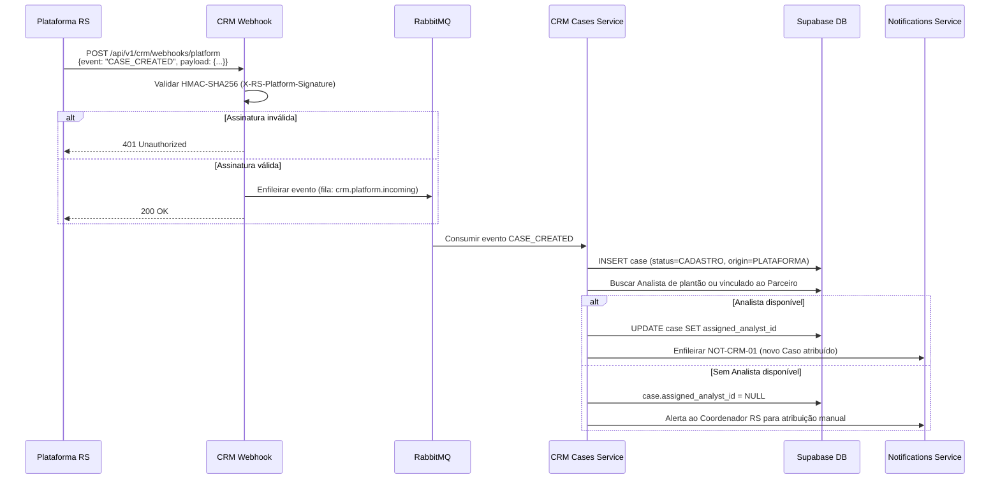

**Fluxo B — Plataforma → CRM (documento sincronizado)**

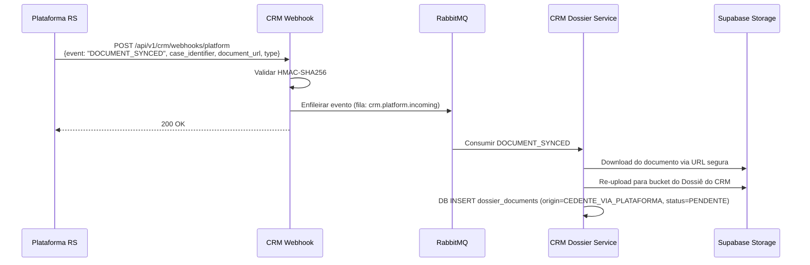

**Fluxo C — CRM → Plataforma (atualização de estado)**

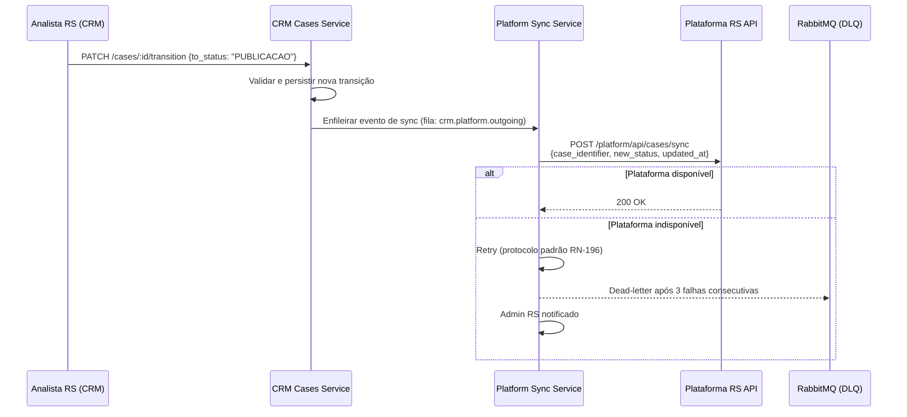

### 3.3 Configuração Técnica

| Parâmetro | Valor |
|---|---|
| Autenticação (entrada) | HMAC-SHA256 — Header `X-RS-Platform-Signature` |
| Autenticação (saída) | Bearer token de serviço (`PLATFORM_SERVICE_TOKEN`) |
| Fila de entrada | `crm.platform.incoming` (RabbitMQ) |
| Fila de saída | `crm.platform.outgoing` (RabbitMQ) |
| Dead-letter queue | `crm.platform.dlq` |
| Latência máxima | 2 minutos (RN-183) |
| Retry policy | 3 tentativas (2min → 10min → DLQ) |

### 3.4 Comportamento em Falha

| Cenário | Comportamento |
|---|---|
| Plataforma indisponível (saída) | Retry policy padrão. Estado no CRM permanece correto. Plataforma atualizada na próxima tentativa bem-sucedida. |
| HMAC inválido (entrada) | 401. Evento descartado. Log de segurança registrado. |
| Caso duplicado | Idempotência por `case_identifier`. Segundo evento ignorado. |
| Analista de plantão indisponível | Caso criado como não atribuído. Alerta ao Coordenador RS. |
| Documento sync falha após 1h | Admin RS notificado. Analista RS pode fazer upload manual. |

---

## 4. Integração 2 — WhatsApp Business API (Meta Cloud API)

### 4.1 Descrição

Canal principal de comunicação do CRM com Cedentes e Cessionários. Mensagens são enviadas pelo Analista RS via CRM, que chama a Meta Cloud API. Respostas chegam ao CRM via webhook da Meta.

**Regras críticas:**
- Janela de 24h: mensagem de texto livre só é permitida se o Contato enviou mensagem nas últimas 24h (RN-187).
- Fora da janela: apenas templates HSM pré-aprovados pela Meta (RN-187).
- Opt-out: contatos com opt-out registrado não recebem mensagens (RN-188).
- Opt-in para marketing: obrigatório antes de enviar template de categoria MARKETING (RN-188).

### 4.2 Fluxos

**Fluxo A — CRM envia mensagem ao Contato**

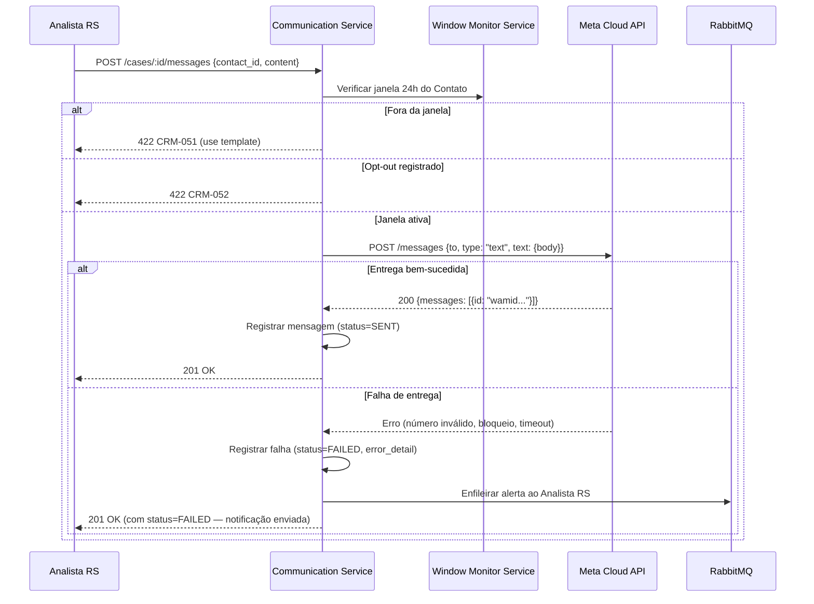

**Fluxo B — Contato responde (webhook Meta → CRM)**

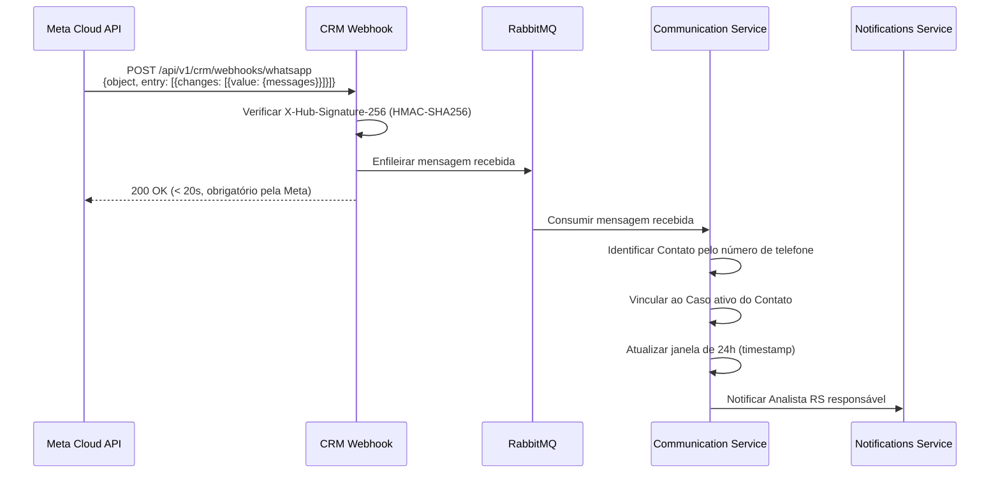

### 4.3 Configuração Técnica

| Parâmetro | Valor |
|---|---|
| Base URL | `https://graph.facebook.com/v21.0/{phone_number_id}/messages` |
| Autenticação saída | Bearer `META_WHATSAPP_TOKEN` |
| Autenticação entrada webhook | `X-Hub-Signature-256` (HMAC-SHA256) |
| Verify token (setup) | `META_WEBHOOK_VERIFY_TOKEN` |
| Fila de mensagens recebidas | `crm.whatsapp.incoming` |
| Fila de mensagens enviadas | `crm.whatsapp.outgoing` |
| Fila de status updates | `crm.whatsapp.status` |
| Timeout de resposta ao webhook | 20 segundos (SLA obrigatório da Meta) |

### 4.4 Comportamento em Falha

| Cenário | Comportamento |
|---|---|
| API Meta indisponível (envio) | Mensagem marcada como FAILED. Analista RS notificado para contato alternativo (RN-187). |
| Número inválido | Erro registrado na timeline do Caso. Analista RS notificado. |
| Número bloqueou a conta | Erro `131026` registrado. Analista RS notificado. Flag `whatsapp_blocked=true` no Contato. |
| Webhook Meta não respondido em 20s | Meta retentativa automática — sistema deve ser idempotente por `wamid`. |
| Template rejeitado pela Meta | 422 CRM-053. Analista RS orientado a usar texto livre (se dentro da janela). |

---

## 5. Integração 3 — ZapSign (Assinatura Eletrônica)

### 5.1 Descrição

Plataforma de assinatura eletrônica usada para contratos de cessão imobiliária. O CRM cria envelopes ZapSign com os signatários (Cedente, Cessionário, representante RS), monitora o status via webhook e executa régua de lembretes (RN-189).

### 5.2 Régua de Lembretes

| Dia | Ação |
|---|---|
| D+0 | Criação do envelope — link de assinatura enviado por e-mail a cada signatário |
| D+2 | 1º lembrete automático — e-mail enviado pelo ZapSign |
| D+4 | 2º lembrete urgente — e-mail + alerta ao Analista RS no CRM |
| D+5 | Contrato expirado — Admin RS notificado para decisão de reemissão |

### 5.3 Fluxos

**Fluxo A — Criar envelope e enviar contrato**

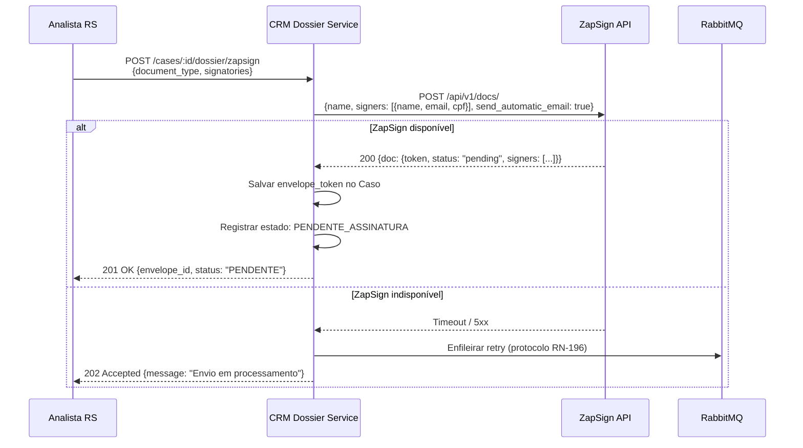

**Fluxo B — Webhook ZapSign → CRM (atualização de assinatura)**

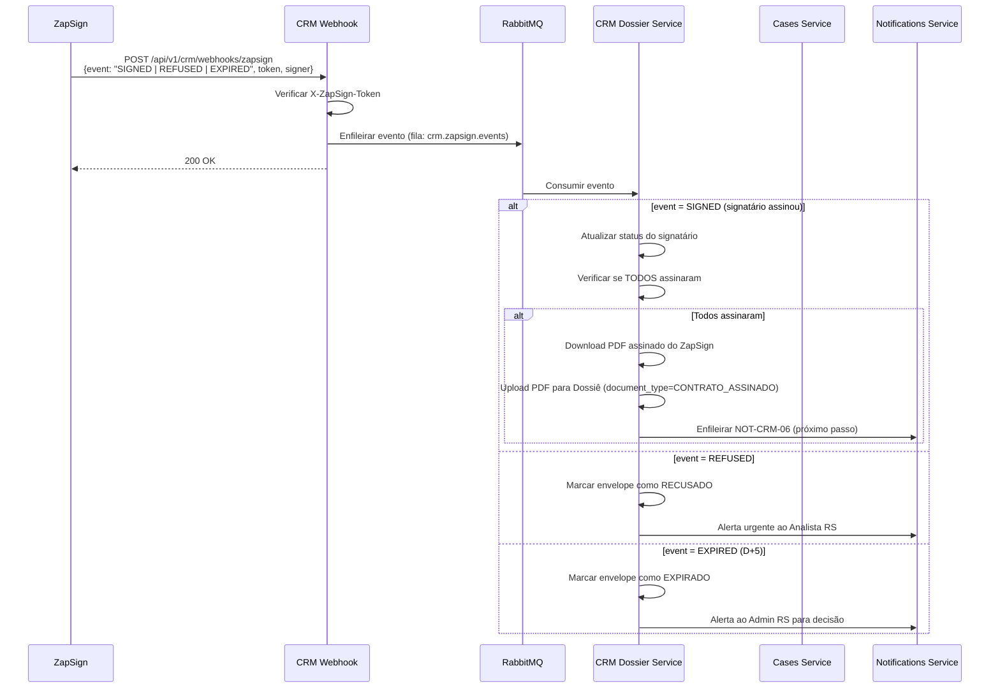

**Fluxo C — Retry manual (RN-190)**

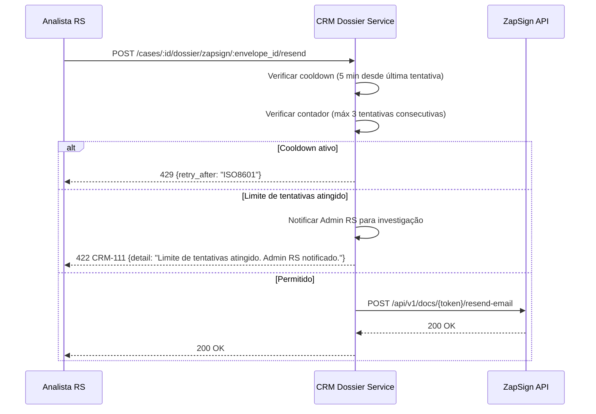

### 5.4 Configuração Técnica

| Parâmetro | Valor |
|---|---|
| Base URL | `https://api.zapsign.com.br/api/v1` |
| Autenticação saída | Bearer `ZAPSIGN_API_TOKEN` |
| Autenticação entrada webhook | Header `X-ZapSign-Token` comparado com `ZAPSIGN_WEBHOOK_SECRET` |
| Fila de eventos | `crm.zapsign.events` |
| Dead-letter queue | `crm.zapsign.dlq` |
| Tentativas de criação | máx 3, cooldown 5min (RN-190) |
| Validade do envelope | D+5 corridos |

### 5.5 Comportamento em Falha

| Cenário | Comportamento |
|---|---|
| ZapSign indisponível na criação | Retry policy padrão. Caso permanece em FORMALIZACAO. Analista RS notificado. |
| 3 falhas consecutivas de criação | Admin RS notificado para investigação (RN-190). |
| Webhook não entregue | ZapSign tem retry próprio. CRM processa com idempotência por `token`. |
| PDF assinado indisponível para download | Retry 3x. Se falhar, Analista RS pode fazer upload manual com aprovação de Coordenador RS. |

---

## 6. Integração 4 — Escrow (Celcoin)

### 6.1 Descrição

Confirmação de depósito na Conta Escrow como critério de Fechamento do Caso. O CRM recebe confirmação via webhook HMAC-SHA256. Fallback manual com aprovação do Coordenador RS (RN-191, RN-192).

### 6.2 Fluxos

**Fluxo A — Webhook de confirmação de depósito**

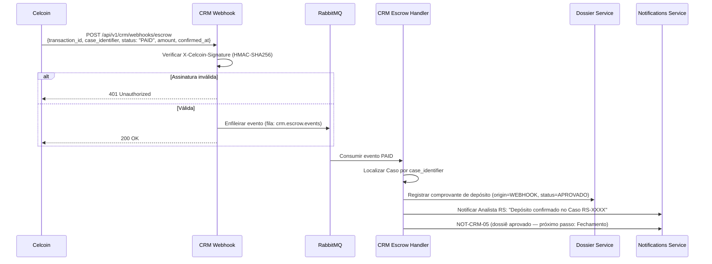

**Fluxo B — Fallback: depósito sem webhook**

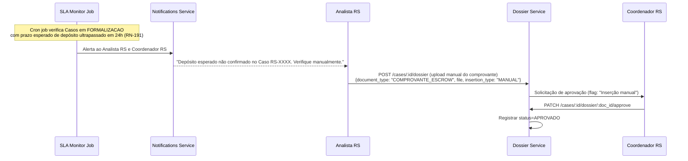

### 6.3 Configuração Técnica

| Parâmetro | Valor |
|---|---|
| Autenticação entrada webhook | Header `X-Celcoin-Signature` (HMAC-SHA256) |
| Chave HMAC | `CELCOIN_WEBHOOK_SECRET` |
| Fila de eventos | `crm.escrow.events` |
| Dead-letter queue | `crm.escrow.dlq` |
| Janela de fallback | 24h após prazo esperado (RN-191) |
| Upload manual | Requer aprovação de Coordenador RS (RN-192) |

### 6.4 Comportamento em Falha

| Cenário | Comportamento |
|---|---|
| Webhook não chega em 24h | Alerta ao Analista RS e Coordenador RS. Upload manual habilitado. |
| Webhook status=FAILED | Analista RS notificado. Verificação manual junto ao parceiro financeiro. |
| Webhook status=REVERSED | Alerta crítico ao Coordenador RS. Caso não pode avançar para Fechamento. |
| Comprovante manual sem aprovação | Documento marcado como PENDENTE. Não conta como critério de Fechamento. |

---

## 7. Integração 5 — Supabase Auth

### 7.1 Descrição

Toda autenticação e autorização do CRM é gerenciada pelo Supabase Auth. JWT com claims de papel (`role`) validados em cada requisição à API NestJS. RLS (Row-Level Security) no banco garante isolamento de dados por papel e por Analista (RN-193).

### 7.2 Fluxos

**Fluxo A — Login e emissão de JWT**

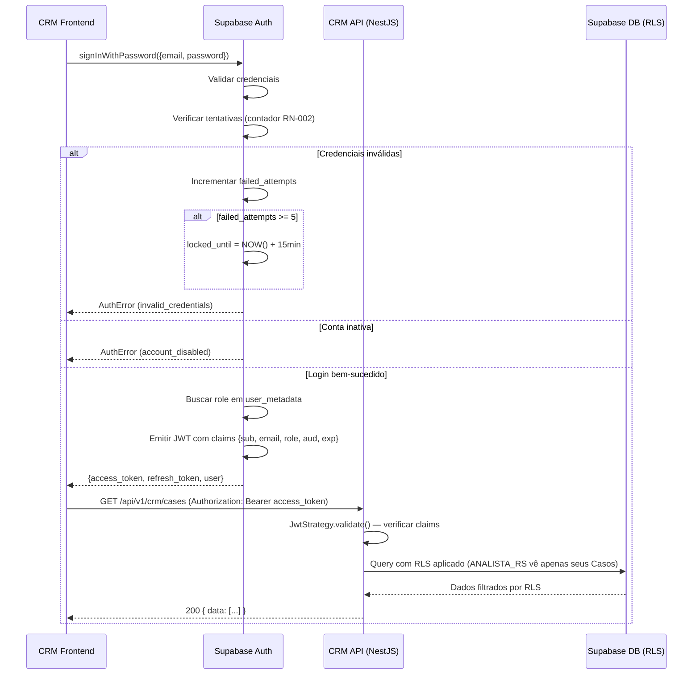

**Fluxo B — Renovação automática de token**

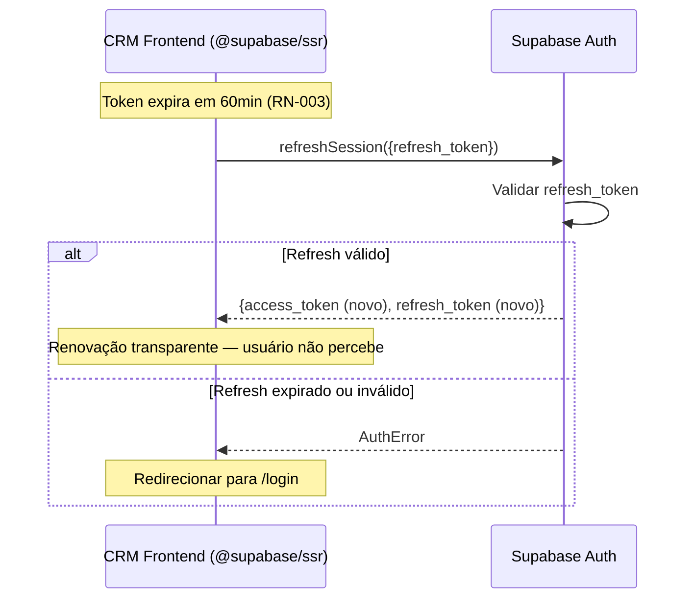

### 7.3 Estrutura do JWT

```json
{
  "sub": "user-uuid-supabase",
  "email": "analista@repasseseguro.com.br",
  "role": "authenticated",
  "user_metadata": {
    "crm_role": "ANALISTA_RS",
    "name": "Ana Lima"
  },
  "app_metadata": {
    "provider": "email"
  },
  "aud": "authenticated",
  "iat": 1711094400,
  "exp": 1711097600
}
```

> **Nota:** O campo `crm_role` em `user_metadata` é o claim de papel do CRM. Definido pelo Admin RS ao criar o usuário via `supabase.auth.admin.updateUserById()`. Validado em cada requisição pelo `CrmJwtStrategy`.

### 7.4 Políticas RLS Relevantes

```sql
-- Analistas RS só acessam Casos atribuídos a eles
CREATE POLICY "analistas_see_own_cases" ON cases
  FOR SELECT
  USING (
    auth.uid() = assigned_analyst_id
    OR (auth.jwt()->>'crm_role') IN ('COORDENADOR_RS', 'ADMIN_RS')
  );

-- Parceiros Externos só acessam Casos vinculados ao seu Parceiro
CREATE POLICY "parceiros_see_partner_cases" ON cases
  FOR SELECT
  USING (
    (auth.jwt()->>'crm_role') = 'PARCEIRO_EXTERNO'
    AND partner_id = (
      SELECT partner_id FROM users WHERE id = auth.uid()
    )
  );

-- Log de auditoria: append-only para todos
CREATE POLICY "audit_log_insert_only" ON audit_log
  FOR INSERT WITH CHECK (true);

-- Nenhum UPDATE ou DELETE no audit_log
CREATE POLICY "audit_log_no_update" ON audit_log
  FOR UPDATE USING (false);

CREATE POLICY "audit_log_no_delete" ON audit_log
  FOR DELETE USING (false);
```

### 7.5 Configuração Técnica

| Parâmetro | Valor |
|---|---|
| Provedor | Supabase Auth (`@supabase/ssr` no frontend, validação JWT no backend) |
| Algoritmo JWT | HS256 |
| Expiração do access token | 60 minutos (RN-003) |
| Renovação | Automática via `@supabase/ssr` antes do vencimento |
| Bloqueio por tentativas | 5 tentativas → bloqueio por 15 min (RN-002) |
| Sessão de inatividade | 60 min (RN-003) |
| RLS | Habilitado em todas as tabelas de domínio |

### 7.6 Comportamento em Falha

| Cenário | Comportamento |
|---|---|
| Token expirado durante sessão | `@supabase/ssr` renova automaticamente. Se refresh falhar, redireciona para login. |
| Role alterado enquanto usuário está logado | Próxima validação de JWT (máx 60min) detecta role atualizado. Para aplicar imediatamente: revogar sessão via Admin API. |
| Supabase Auth indisponível | API retorna 503. Frontend exibe mensagem de erro e tenta reconnect. |
| RLS bloqueando query esperada | Erro 403 na API com `code: "CRM-023"`. Log de segurança registrado. |

---

## 8. Resumo de Filas RabbitMQ

| Fila | Tipo | Produtor | Consumidor | DLQ |
|---|---|---|---|---|
| `crm.platform.incoming` | Eventos da Plataforma RS | WebhookController | PlatformWebhookHandler | `crm.platform.dlq` |
| `crm.platform.outgoing` | Sync de estado para Plataforma RS | CasesService | PlatformSyncService | `crm.platform.dlq` |
| `crm.whatsapp.incoming` | Mensagens recebidas | WebhookController | CommunicationService | `crm.whatsapp.dlq` |
| `crm.whatsapp.outgoing` | Mensagens a enviar | CommunicationService | WhatsAppClient | `crm.whatsapp.dlq` |
| `crm.whatsapp.status` | Status de entrega | WebhookController | CommunicationService | `crm.whatsapp.dlq` |
| `crm.zapsign.events` | Eventos de assinatura | WebhookController | ZapsignWebhookHandler | `crm.zapsign.dlq` |
| `crm.escrow.events` | Confirmação de depósito | WebhookController | EscrowWebhookHandler | `crm.escrow.dlq` |
| `crm.notifications` | Todas as notificações do CRM | Vários services | NotificationsConsumer | `crm.notifications.dlq` |

**Configuração padrão de todas as filas:**
- `durable: true` — sobrevivem a restart do broker
- `x-dead-letter-exchange: crm.dlx` — DLX compartilhado
- `x-message-ttl: 86400000` — TTL de 24h para mensagens na DLQ
- Prefetch: 10 mensagens por consumidor

---

## 9. Changelog

| Versão | Data | Autor | Descrição |
|---|---|---|---|
| v1.0 | 2026-03-23 | Claude Code Desktop | Versão inicial — 5 integrações, diagramas Mermaid de sequência, retry policy padrão, filas RabbitMQ, RLS policies Supabase. |
