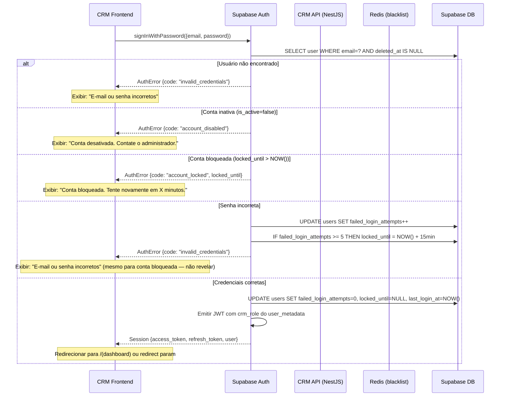
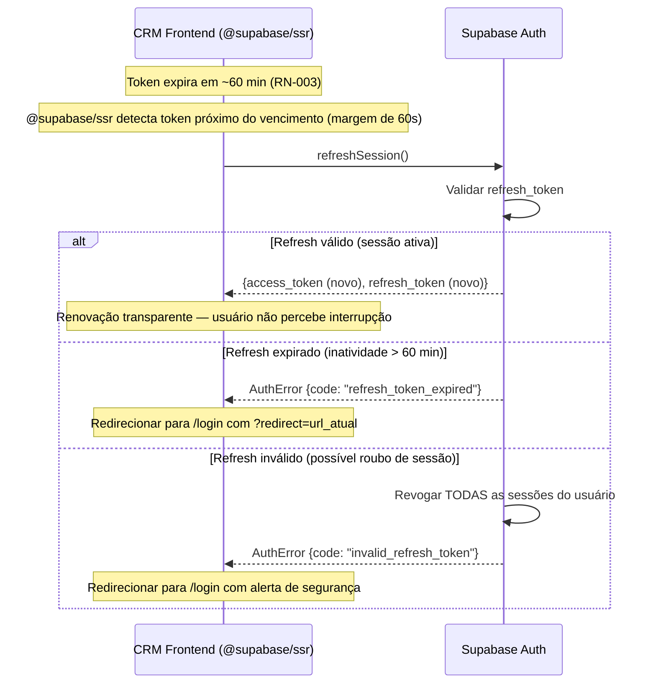
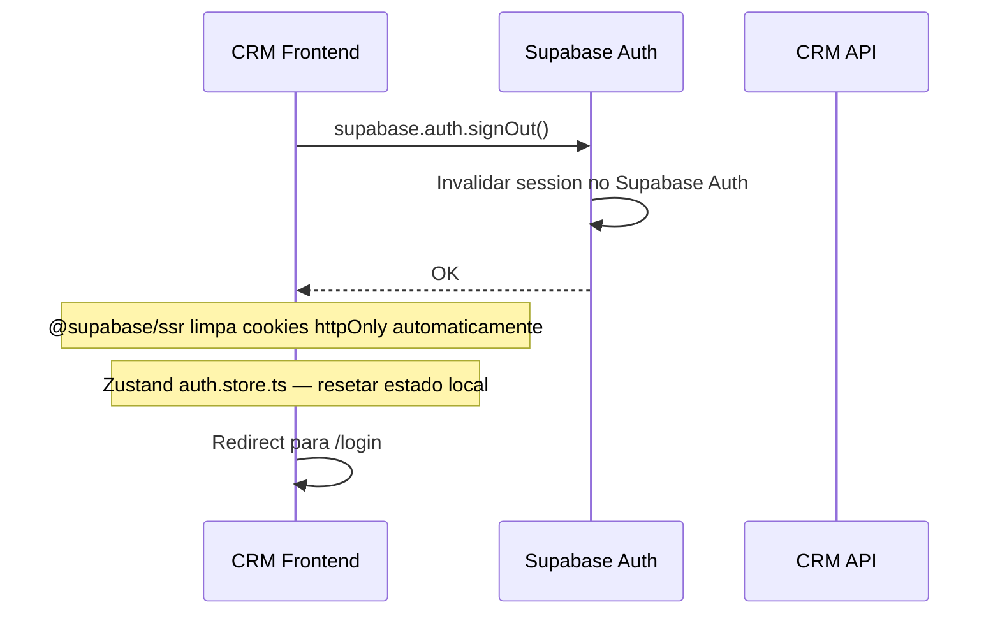
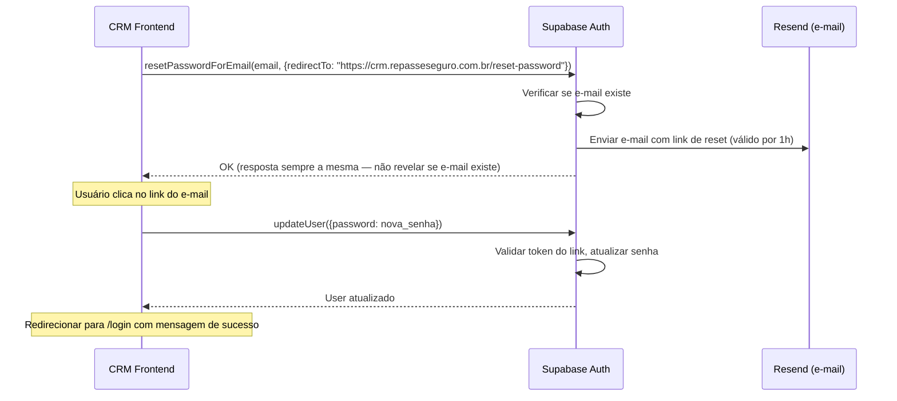
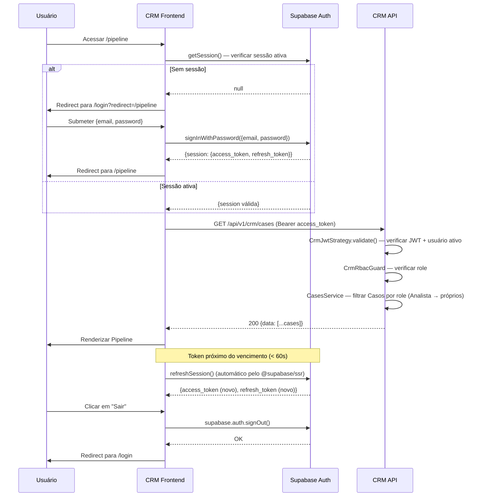

# 18 - Fluxos de Autenticação e Autorização

## Repasse Seguro — Módulo CRM

| **Campo** | **Valor** |
|---|---|
| **Destinatário** | Backend Lead, Frontend Lead, QA, Segurança |
| **Escopo** | Fluxos completos de autenticação JWT via Supabase Auth, renovação de token, logout, RBAC por role e proteção de rotas |
| **Módulo** | CRM |
| **Versão** | v1.0 |
| **Responsável** | Claude Code Desktop |
| **Data** | 2026-03-23 — America/Fortaleza |
| **Dependências** | Doc 01.1 RN-001 a RN-005 · Doc 01.5 RN-193 · Doc 02 Stacks CRM · Doc 16 API CRM |

---

> **TL;DR**
>
> - **Supabase Auth com JWT** — access token 60 min, refresh automático via `@supabase/ssr`.
> - **Sem 2FA/OTP no MVP** — CRM é ferramenta interna. Login por e-mail/senha apenas.
> - **Bloqueio de conta:** 5 tentativas → bloqueio por 15 min (RN-002). Contador reset no login bem-sucedido.
> - **RBAC:** 4 roles — `ADMIN_RS > COORDENADOR_RS > ANALISTA_RS / PARCEIRO_EXTERNO`. `@CrmRoles()` em todos os endpoints.
> - **Sessão de inatividade:** 60 min com renovação automática enquanto o usuário está ativo (RN-003).
> - **RLS no banco:** Analistas RS veem apenas Casos atribuídos; Parceiros Externos veem apenas Casos do seu Parceiro.
> - **Validação de role a cada requisição:** não apenas no login — mudança de role aplica no próximo request (RN-193).

---

## 1. Tokens JWT

### 1.1 Estrutura do Access Token (emitido pelo Supabase Auth)

```json
{
  "sub": "user-uuid-supabase",
  "email": "analista@repasseseguro.com.br",
  "role": "authenticated",
  "user_metadata": {
    "crm_role": "ANALISTA_RS",
    "name": "Ana Lima"
  },
  "app_metadata": {
    "provider": "email"
  },
  "aud": "authenticated",
  "iat": 1745481600,
  "exp": 1745485200
}
```

> **`crm_role`** é o claim de papel do CRM dentro de `user_metadata`. Configurado pelo Admin RS ao criar o usuário (`supabase.auth.admin.updateUserById()`). Validado pelo `CrmJwtStrategy` em cada requisição.

### 1.2 Armazenamento de Tokens

| Contexto | Access Token | Refresh Token |
|---|---|---|
| CRM SPA (Next.js / browser) | `httpOnly cookie` gerenciado por `@supabase/ssr` | `httpOnly cookie` gerenciado por `@supabase/ssr` |

> **Segurança:** `@supabase/ssr` armazena ambos os tokens em cookies `httpOnly; Secure; SameSite=Strict`, protegidos contra XSS. Nunca usar `localStorage` para tokens.

### 1.3 Ciclo de Vida da Sessão

| Evento | Comportamento |
|---|---|
| Login bem-sucedido | Access token emitido (60 min), refresh token emitido |
| Usuário ativo | `@supabase/ssr` renova o access token automaticamente antes da expiração |
| Inatividade > 60 min | Sessão expira. Redirect para `/login` na próxima ação (RN-003) |
| Logout explícito | `supabase.auth.signOut()` — tokens invalidados no Supabase Auth |
| Role alterado pelo Admin RS | Próxima validação de JWT detecta novo role. Para aplicação imediata: revogar sessão via Supabase Admin API |

---

## 2. Fluxo de Login



**Segurança UX:** Mensagens de erro não distinguem entre "usuário não existe" e "senha incorreta" para evitar enumeração de usuários.

---

## 3. Fluxo de Renovação de Token



---

## 4. Fluxo de Logout



> **Logout server-side:** `POST /api/v1/crm/auth/logout` pode ser chamado para invalidar sessão server-side quando necessário (ex: remoção de usuário pelo Admin RS).

---

## 5. Fluxo de Recuperação de Senha



---

## 6. Validação de Token em Cada Request (NestJS)

```typescript
// crm-jwt.strategy.ts
@Injectable()
export class CrmJwtStrategy extends PassportStrategy(Strategy, 'crm-jwt') {
  constructor(
    private readonly prisma: PrismaService,
    private readonly redis: RedisService,
  ) {
    super({
      jwtFromRequest: ExtractJwt.fromAuthHeaderAsBearerToken(),
      secretOrKey: process.env.SUPABASE_JWT_SECRET,
      issuer: process.env.SUPABASE_URL + '/auth/v1',
      audience: 'authenticated',
    });
  }

  async validate(payload: SupabaseJwtPayload): Promise<CrmUser> {
    // 1. Verificar blacklist (logout explícito)
    const blacklisted = await this.redis.get(`crm:blacklist:${payload.sub}`);
    if (blacklisted) throw new UnauthorizedException('Sessão invalidada');

    // 2. Verificar usuário ainda ativo no banco (RN-193)
    const user = await this.prisma.user.findFirst({
      where: {
        supabase_id: payload.sub,
        is_active: true,
        deleted_at: null,
      },
      select: { id: true, supabase_id: true, name: true, email: true, role: true },
    });

    if (!user) throw new UnauthorizedException('Usuário não encontrado ou inativo');

    // 3. Validar role do JWT contra role no banco (detecta alteração de role)
    const jwtRole = payload.user_metadata?.crm_role;
    if (jwtRole !== user.role) {
      // Role alterado — aceitar mas logar para auditoria
      // Token atual ainda válido; próximo login terá role atualizado
      this.logger.warn(`Role divergência: JWT=${jwtRole}, DB=${user.role}, user=${user.id}`);
    }

    return user; // Disponível via @CurrentUser() nos controllers
  }
}
```

---

## 7. RBAC — Controle de Acesso por Role

### 7.1 Hierarquia de Roles

```
ADMIN_RS               → Acesso total — configurações críticas, equipe, todos os Casos, todos os relatórios
  └─ COORDENADOR_RS    → Supervisão — aprovações, redistribuição de Casos, relatórios gerenciais
       └─ ANALISTA_RS  → Operação — Casos atribuídos, contatos, atividades, comunicação
  └─ PARCEIRO_EXTERNO  → Somente leitura — Casos vinculados ao seu Parceiro (sem edição)
```

> **Nota:** `PARCEIRO_EXTERNO` é paralelo ao `COORDENADOR_RS` — não há hierarquia entre eles. `ADMIN_RS` sempre tem acesso total.

### 7.2 Implementação do Guard RBAC

```typescript
// crm-roles.decorator.ts
export const CRM_ROLES_KEY = 'crm_roles';
export const CrmRoles = (...roles: CrmRole[]) =>
  SetMetadata(CRM_ROLES_KEY, roles);

// crm-rbac.guard.ts
@Injectable()
export class CrmRbacGuard implements CanActivate {
  constructor(private readonly reflector: Reflector) {}

  canActivate(context: ExecutionContext): boolean {
    const requiredRoles = this.reflector.getAllAndOverride<CrmRole[]>(
      CRM_ROLES_KEY,
      [context.getHandler(), context.getClass()],
    );

    if (!requiredRoles || requiredRoles.length === 0) return true;

    const { user } = context.switchToHttp().getRequest<Request>();

    // ADMIN_RS sempre tem acesso total
    if (user.role === CrmRole.ADMIN_RS) return true;

    return requiredRoles.includes(user.role);
  }
}

// Uso em controllers
@Get('/cases')
@UseGuards(CrmJwtAuthGuard, CrmRbacGuard)
@CrmRoles(CrmRole.ANALISTA_RS, CrmRole.COORDENADOR_RS, CrmRole.PARCEIRO_EXTERNO)
async getCases(@CurrentUser() user: CrmUser) { ... }

// Restrição adicional em service — Analista vê apenas Casos atribuídos
async findAll(user: CrmUser, filters: CaseFiltersDto) {
  const where = {
    deleted_at: null,
    ...(user.role === CrmRole.ANALISTA_RS
      ? { assigned_analyst_id: user.id }
      : {}),
    ...(user.role === CrmRole.PARCEIRO_EXTERNO
      ? { partner_id: user.partner_id }
      : {}),
  };
  return this.casesRepository.findMany({ where, ...filters });
}
```

### 7.3 Matriz de Acesso por Módulo

| Módulo | ANALISTA_RS | COORDENADOR_RS | ADMIN_RS | PARCEIRO_EXTERNO |
|---|---|---|---|---|
| Dashboard pessoal | Leitura (próprios) | Leitura (equipe) | Leitura total | — |
| Pipeline de Casos | CRUD (Casos atribuídos) | CRUD todos | CRUD todos | Leitura (do Parceiro) |
| Transições de estado | Regular | Regular + Cancelar | Todas | — |
| Atribuição de Casos | — | ✅ | ✅ | — |
| Redistribuição | — | ✅ | ✅ | — |
| Contatos | CRUD (dos seus Casos) | CRUD todos | CRUD todos | Leitura |
| Atividades | CRUD (próprias) | CRUD todas | CRUD todas | — |
| Comunicação WhatsApp | Enviar + Histórico | Enviar + Histórico | Enviar + Histórico | — |
| Dossiê — Upload | ✅ | ✅ | ✅ | — |
| Dossiê — Aprovar/Rejeitar | — | ✅ | ✅ | — |
| Negociações | CRUD | CRUD | CRUD | — |
| Comissão — Visualizar | ✅ | ✅ | ✅ | — |
| Comissão — Ajustar | — | ✅ | ✅ | — |
| SLA — Alertas | Próprios | Todos | Todos | — |
| SLA — Configurar | — | — | ✅ | — |
| Relatórios | — | ✅ | ✅ | — |
| Equipe — Visualizar | — | ✅ | ✅ | — |
| Equipe — Criar/Editar | — | — | ✅ | — |
| Configurações do sistema | — | Leitura | CRUD | — |
| Log de auditoria | — | — | ✅ | — |

---

## 8. Middleware de Autorização (Ordem de Execução)

```
Request HTTP
  │
  ▼
[1] RequestContextMiddleware     — Request ID, timestamp, IP
  │
  ▼
[2] CrmJwtAuthGuard              — Valida JWT, extrai user do Supabase
  │                              — Verifica blacklist e usuário ativo no DB
  ▼
[3] CrmRbacGuard                 — Verifica role do usuário contra @CrmRoles()
  │
  ▼
[4] ValidationPipe               — Valida DTO de entrada (class-validator)
  │
  ▼
[5] Controller / Service         — Aplica filtro adicional (Analista → próprios Casos)
  │
  ▼
[6] AuditInterceptor             — Registra ação no audit_log (RN-194)
  │
  ▼
[7] TransformInterceptor         — Wrap response em { data, meta }
```

---

## 9. Proteção de Rotas no Frontend (Next.js App Router)

```typescript
// middleware.ts — proteção de rotas autenticadas
import { createServerClient } from '@supabase/ssr';
import { NextResponse } from 'next/server';
import type { NextRequest } from 'next/server';

export async function middleware(request: NextRequest) {
  const response = NextResponse.next();
  const supabase = createServerClient(
    process.env.NEXT_PUBLIC_SUPABASE_URL!,
    process.env.NEXT_PUBLIC_SUPABASE_ANON_KEY!,
    {
      cookies: {
        getAll: () => request.cookies.getAll(),
        setAll: (cookies) => cookies.forEach(({ name, value, options }) =>
          response.cookies.set(name, value, options)
        ),
      },
    }
  );

  const { data: { session } } = await supabase.auth.getSession();

  // Rota protegida sem sessão → redirecionar para login
  const isPublicRoute = request.nextUrl.pathname.startsWith('/login') ||
    request.nextUrl.pathname.startsWith('/forgot-password') ||
    request.nextUrl.pathname.startsWith('/reset-password');

  if (!session && !isPublicRoute) {
    const redirectUrl = new URL('/login', request.url);
    redirectUrl.searchParams.set('redirect', request.nextUrl.pathname);
    return NextResponse.redirect(redirectUrl);
  }

  // Sessão ativa na página de login → redirecionar para dashboard
  if (session && isPublicRoute) {
    return NextResponse.redirect(new URL('/', request.url));
  }

  return response;
}

export const config = {
  matcher: ['/((?!_next/static|_next/image|favicon.ico|robots.txt).*)'],
};
```

```typescript
// Proteção por role em Server Components
// app/(dashboard)/team/page.tsx

import { createServerClient } from '@supabase/ssr';
import { cookies } from 'next/headers';
import { redirect } from 'next/navigation';

export default async function TeamPage() {
  const cookieStore = cookies();
  const supabase = createServerClient(
    process.env.NEXT_PUBLIC_SUPABASE_URL!,
    process.env.NEXT_PUBLIC_SUPABASE_ANON_KEY!,
    { cookies: { getAll: () => cookieStore.getAll() } }
  );

  const { data: { user } } = await supabase.auth.getUser();
  const crmRole = user?.user_metadata?.crm_role;

  // Equipe acessível apenas por Coordenador RS e Admin RS
  if (!['COORDENADOR_RS', 'ADMIN_RS'].includes(crmRole)) {
    redirect('/?error=forbidden');
  }

  // ... render
}
```

---

## 10. Bloqueio por Tentativas de Login (RN-002)

```typescript
// crm-auth.service.ts — lógica de bloqueio via Supabase Auth

const MAX_ATTEMPTS = 5;
const LOCKOUT_MINUTES = 15;

async login(email: string, password: string): Promise<AuthResponse> {
  // Verificar estado de bloqueio antes de tentar login
  const user = await this.prisma.user.findUnique({
    where: { email },
    select: { id: true, is_active: true, failed_login_attempts: true, locked_until: true },
  });

  if (user?.locked_until && user.locked_until > new Date()) {
    throw new HttpException(
      {
        statusCode: 423,
        code: 'CRM-003',
        detail: `Conta bloqueada por excesso de tentativas. Tente novamente em ${LOCKOUT_MINUTES} minutos.`,
        locked_until: user.locked_until.toISOString(),
      },
      HttpStatus.LOCKED,
    );
  }

  // Tentar autenticação via Supabase Auth
  const { data, error } = await this.supabase.auth.signInWithPassword({ email, password });

  if (error) {
    // Incrementar contador de tentativas
    await this.prisma.user.update({
      where: { email },
      data: {
        failed_login_attempts: { increment: 1 },
        locked_until: user && (user.failed_login_attempts + 1) >= MAX_ATTEMPTS
          ? new Date(Date.now() + LOCKOUT_MINUTES * 60 * 1000)
          : null,
      },
    });
    throw new UnauthorizedException({ code: 'CRM-001', detail: 'E-mail ou senha incorretos' });
  }

  // Reset contador após login bem-sucedido
  await this.prisma.user.update({
    where: { email },
    data: { failed_login_attempts: 0, locked_until: null, last_login_at: new Date() },
  });

  return data;
}
```

---

## 11. Segurança Adicional

| Medida | Implementação | RN |
|---|---|---|
| Rate limiting no login | `@nestjs/throttler`: 10 req/min por IP | RN-002 |
| Rate limiting geral | 200 req/min por token (ferramenta interna) | — |
| CORS | Apenas `NEXT_PUBLIC_CRM_URL` permitida | — |
| Helmet | CSP, HSTS, X-Frame-Options, X-Content-Type-Options | — |
| Input sanitization | `class-validator` + `class-transformer` no `ValidationPipe` | — |
| SQL injection | Prisma parameterized queries exclusivamente | — |
| Password hashing | bcrypt com 12 rounds (via Supabase Auth) | — |
| Brute force | Bloqueio por conta (5 tentativas / 15 min) + rate limit por IP | RN-002 |
| Sessão de inatividade | 60 min, renovação automática | RN-003 |
| Cookies de token | `httpOnly; Secure; SameSite=Strict` via `@supabase/ssr` | RN-193 |
| HTTPS | TLS 1.3+ obrigatório. HTTP redireciona para HTTPS (Vercel + Railway) | — |
| Log de auditoria | Toda ação registrada em `audit_log` (imutável, 10 anos) | RN-194 |
| RLS | Isolamento de dados por role no banco | RN-193 |
| Mascaramento de dados | CPF/telefone/e-mail mascarados em listagens (RN-012) | RN-012 |

---

## 12. Diagrama de Sequência Completo — Ciclo de Sessão



---

## 13. Changelog

| Versão | Data | Autor | Descrição |
|---|---|---|---|
| v1.0 | 2026-03-23 | Claude Code Desktop | Versão inicial — Supabase Auth, JWT sem 2FA (uso interno), refresh automático, RBAC 4 roles, bloqueio por tentativas (15 min), proteção de rotas Next.js App Router, RLS, middleware de autorização. |
