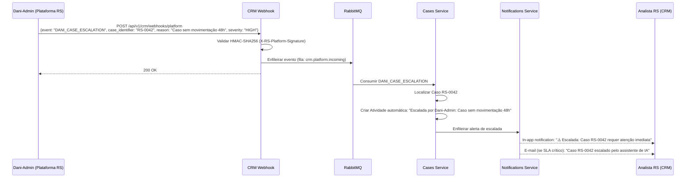
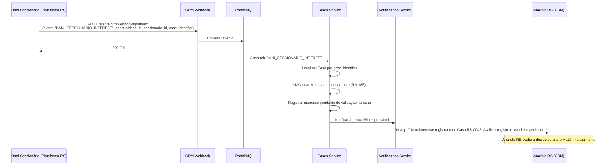

# 19 - Criação de Agentes de IA

## Repasse Seguro — Módulo CRM

| **Campo** | **Valor** |
|---|---|
| **Destinatário** | Backend Lead, Produto, Engenharia |
| **Escopo** | Estratégia de IA do CRM — ausência de agente autônomo no MVP, integrações passivas com Dani-Admin/Dani-Cedente/Dani-Cessionário, relatório de inteligência com k-anonymity |
| **Módulo** | CRM |
| **Versão** | v1.0 |
| **Responsável** | Claude Code Desktop |
| **Data** | 2026-03-23 — America/Fortaleza |
| **Dependências** | Doc 01.4 RN-182 · Doc 01.5 RN-183–RN-193 · Doc 02 Stacks CRM (ADR CRM-ADR-004) |

---

> **TL;DR**
>
> - **O CRM NÃO tem agente de IA autônomo no MVP.** [DECISÃO AUTÔNOMA: complexidade e custo não justificam no MVP interno — ADR CRM-ADR-004]
> - **3 integrações passivas:** Dani-Admin (escalada de Casos via webhook), Dani-Cedente e Dani-Cessionário (alertas automáticos de proposta), Relatório de Inteligência (k-anonymity RN-182).
> - **Fase 2:** agente de sugestão de ação para Analistas RS — backlog priorizado após validação operacional.

---

## 1. Decisão de Arquitetura — Sem Agente Autônomo no MVP

### 1.1 Justificativa (ADR CRM-ADR-004)

O CRM v1.0 é uma ferramenta interna operada por profissionais (Analistas RS, Coordenadores RS) em fluxos de trabalho bem definidos. A introdução de um agente autônomo de IA no MVP apresenta os seguintes riscos sem benefícios compensatórios validados:

| Risco | Impacto |
|---|---|
| Custo de LLM (GPT-4o) em produção interna | Alto — ~800 Casos/mês projetados, cada com múltiplas chamadas de contexto |
| Latência adicionada ao fluxo operacional | Analistas RS esperam < 300ms. Chamadas LLM: 1–5s |
| Confiabilidade de respostas de IA em Casos jurídicos/financeiros | Risco de sugestão incorreta em contexto de cessão imobiliária |
| Complexidade de implementação e manutenção | LangChain.js + GPT-4o + vector store para contexto de Casos — fora do escopo do MVP |

**Decisão:** Adiar agente autônomo para a Fase 2. No MVP, o CRM integra-se passivamente com os agentes Dani (já operacionais na Plataforma RS) e oferece relatório de inteligência como ferramenta de apoio à decisão humana.

### 1.2 O que está implementado no MVP

| Capacidade | Status | Descrição |
|---|---|---|
| Integração com Dani-Admin | ✅ MVP | Webhook passivo — Dani escalona Casos para o CRM |
| Alertas de proposta via Dani-Cedente/Cessionário | ✅ MVP | Webhook passivo — Dani notifica CRM sobre interesse |
| Relatório de inteligência (k-anonymity) | ✅ MVP | Estatísticas agregadas de desempenho (RN-182) |
| Agente autônomo de sugestão de ação | 🔵 Fase 2 | Backlog — LangChain.js + GPT-4o |
| Resumo automático de Caso por IA | 🔵 Fase 2 | Backlog |
| Sugestão de próximo estado | 🔵 Fase 2 | Backlog |

---

## 2. Integração com Dani-Admin (AI-Dani-Admin)

### 2.1 Descrição

Dani-Admin é o agente supervisor da Plataforma RS. Monitora Casos na plataforma pública e, quando detecta situações que requerem intervenção humana, aciona o CRM via webhook para escalada ao Analista RS responsável.

**Direção:** Plataforma RS (Dani-Admin) → CRM (passivo)

### 2.2 Eventos Suportados

| Evento | Gatilho | Ação no CRM |
|---|---|---|
| `DANI_CASE_ESCALATION` | Dani-Admin detecta Caso sem movimentação por > 48h na plataforma | Alerta de escalada ao Analista RS + Coordenador RS |
| `DANI_DOCUMENT_ISSUE` | Dani-Admin detecta documento enviado com qualidade insuficiente | Alerta ao Analista RS para solicitar novo envio |
| `DANI_CEDENTE_INACTIVE` | Dani-Admin detecta Cedente sem resposta por > 72h | Alerta ao Analista RS para follow-up manual |

### 2.3 Fluxo de Integração



### 2.4 Payload de Escalada

```json
{
  "event": "DANI_CASE_ESCALATION",
  "source": "dani-admin",
  "case_identifier": "RS-0042",
  "reason": "Caso sem movimentação por 48 horas na plataforma",
  "severity": "HIGH | MEDIUM | LOW",
  "context": {
    "last_activity_at": "ISO8601",
    "current_platform_state": "string",
    "cedente_last_interaction": "ISO8601?"
  },
  "timestamp": "ISO8601"
}
```

### 2.5 Registro Automático de Atividade

Cada escalada de Dani-Admin cria automaticamente uma Atividade do tipo `NOTA` no Caso, com:
- `summary`: "Escalada automática: [reason]"
- `notes`: Contexto completo do evento
- `created_by`: sistema (ID reservado para eventos automáticos)
- Visível na timeline do Caso

---

## 3. Integração com Dani-Cedente e Dani-Cessionário

### 3.1 Descrição

Dani-Cedente e Dani-Cessionário são os agentes conversacionais da Plataforma RS que interagem diretamente com Cedentes e Cessionários. Quando um Cessionário sinaliza interesse formal em uma oportunidade, Dani-Cessionário notifica o CRM. O CRM não age automaticamente — o Analista RS valida antes de criar o Match (RN-185).

**Direção:** Plataforma RS (Dani-Cedente / Dani-Cessionário) → CRM (passivo)

### 3.2 Eventos Suportados

| Evento | Gatilho | Ação no CRM |
|---|---|---|
| `DANI_CESSIONARIO_INTEREST` | Cessionário sinaliza interesse formal via Dani-Cessionário | Alerta ao Analista RS: "Novo interesse — avaliar Match" |
| `DANI_CEDENTE_QUESTION` | Cedente faz pergunta sobre o Caso que requer resposta do Analista RS | Alerta ao Analista RS com contexto da pergunta |
| `DANI_PROPOSAL_REACTION` | Cessionário reage (positivamente/negativamente) a proposta pelo app | Alerta ao Analista RS para acompanhamento |

### 3.3 Fluxo — Interesse de Cessionário



### 3.4 Payload de Interesse

```json
{
  "event": "DANI_CESSIONARIO_INTEREST",
  "source": "dani-cessionario",
  "case_identifier": "RS-0042",
  "oportunidade_id": "OPR-0099",
  "cessionario_id": "uuid",
  "cessionario_name_masked": "Ma**** S****",
  "timestamp": "ISO8601"
}
```

---

## 4. Relatório de Inteligência com k-Anonymity (RN-182)

### 4.1 Descrição

O CRM gera relatórios estatísticos agregados sobre desempenho de Casos, Analistas e negociações. Para proteger a privacidade de Cedentes e Cessionários individuais, dados sensíveis são apresentados com k-anonymity: nenhum registro individual é identificável se não compuser um grupo de ao menos **k=5 registros** (RN-182).

### 4.2 Dados Incluídos no Relatório

```
Relatório de Inteligência CRM (gerado semanalmente — NOT-CRM-07)
├── Volume de Casos
│   ├── Total no período (sem identificação individual)
│   ├── Por estado do pipeline
│   ├── Por cenário (A, B, C, D)
│   └── Taxa de conversão por etapa
│
├── Performance de Negociação
│   ├── Valor médio de contrato (agregado)
│   ├── Desconto médio de comissão (percentual)
│   ├── Tempo médio de negociação (dias)
│   └── Taxa de aceite de proposta (%)
│
├── SLA
│   ├── % de Casos dentro do SLA por estado
│   ├── Tempo médio por estado (dias)
│   └── Estados com maior gargalo
│
├── Analistas (agregado por equipe, não individual se <5 Analistas)
│   ├── Casos concluídos no período
│   ├── SLA médio
│   └── Comissão gerada (agregado)
│
└── Integrações
    ├── Taxa de entrega WhatsApp (%)
    ├── Taxa de assinatura ZapSign (%)
    └── Tempo médio de confirmação Escrow (horas)
```

### 4.3 Aplicação de k-Anonymity

```typescript
// reports.service.ts — aplicar k-anonymity antes de retornar dados

const K_THRESHOLD = 5;

function applyKAnonymity<T extends { count: number }>(
  data: T[],
  threshold = K_THRESHOLD
): T[] {
  return data.map((item) => ({
    ...item,
    // Suprimir grupos com menos de K registros
    count: item.count < threshold ? null : item.count,
    suppressed: item.count < threshold,
  }));
}

// Exemplo: distribuição de Casos por empreendimento
// Se apenas 3 Casos de um empreendimento → suprimir (não exibir)
const byEmpreendimento = await this.getCasesByEmpreendimento(period);
const anonymized = applyKAnonymity(byEmpreendimento);
```

### 4.4 Dados NUNCA Incluídos no Relatório de Inteligência

- Nome, CPF, e-mail ou telefone de Cedentes/Cessionários
- Valor exato de Casos individuais identificáveis
- Histórico de negociação de Casos específicos
- Endereço de imóveis em Casos com < 5 registros no mesmo empreendimento

### 4.5 Endpoint do Relatório

```http
GET /api/v1/crm/reports/intelligence
Authorization: Bearer <token>
```

**Role:** `COORDENADOR_RS`, `ADMIN_RS`

```json
// Response 200
{
  "data": {
    "period": { "from": "ISO8601", "to": "ISO8601" },
    "generated_at": "ISO8601",
    "k_threshold": 5,
    "volume": {
      "total_cases": 134,
      "by_status": [
        { "status": "NEGOCIACAO", "count": 23, "suppressed": false }
      ],
      "conversion_rate_percent": 34.5
    },
    "negotiation": {
      "avg_contract_value": "285000.00",
      "avg_commission_discount_percent": 3.2,
      "avg_negotiation_days": 6.1,
      "proposal_acceptance_rate_percent": 58.3
    },
    "sla": {
      "within_sla_percent": 72.4,
      "bottleneck_state": "VERIFICACAO",
      "avg_days_by_state": [
        { "state": "CADASTRO", "avg_days": 1.2 },
        { "state": "VERIFICACAO", "avg_days": 4.8 }
      ]
    }
  }
}
```

---

## 5. Fase 2 — Agente de Sugestão de Ação (Backlog)

> **Atenção:** Esta seção descreve funcionalidade de Fase 2. NÃO implementar na v1.0.

### 5.1 Visão da Funcionalidade

Um assistente de IA integrado à interface do CRM que sugere a próxima ação recomendada para o Analista RS no contexto de cada Caso. Não executa ações — apenas sugere.

**Nome proposto:** Dani-Admin (extensão do agente supervisor)

### 5.2 Casos de Uso Prioritários (Fase 2)

| Caso de Uso | Gatilho | Sugestão |
|---|---|---|
| Caso parado no Cadastro | Caso sem movimentação > 24h | "Sugestão: ligar para o Cedente para verificar disponibilidade de documentos" |
| Proposta próxima da expiração | Expira em < 24h | "Sugestão: enviar lembrete ao Cessionário pelo WhatsApp" |
| Dossiê com documento rejeitado | Doc rejeitado há > 48h | "Sugestão: registrar atividade de follow-up com o Cedente" |
| SLA em estado crítico | SLA > 85% consumido | "Sugestão: escalar ao Coordenador RS para desbloqueio" |
| Múltiplos Cessionários interessados | > 3 interesses no mesmo Caso | "Sugestão: priorizar Cessionário com histórico de fechamento" |

### 5.3 Stack Tecnológica Planejada (Fase 2)

| Componente | Tecnologia | Justificativa |
|---|---|---|
| LLM | GPT-4o (OpenAI SDK 4.x+) | Modelo com melhor compreensão de contexto financeiro/jurídico |
| Orquestração | LangChain.js 0.3+ | Framework de agente aprovado pelo baseline |
| Contexto do Caso | Vector store (pgvector no Supabase) | Recuperação eficiente de histórico de Casos similares |
| Cache de sugestões | Redis (TTL 5min) | Evitar recálculo em acesso rápido |
| Interface | Painel lateral no CRM (drawer) | Não interrompe o fluxo do Analista RS |

### 5.4 Princípios de Design do Agente (Fase 2)

1. **Sugestão, não execução.** O agente nunca executa ações automaticamente. O Analista RS sempre confirma.
2. **Transparência.** Toda sugestão exibe o raciocínio simplificado: "Sugerido porque: [motivo]".
3. **Descartável.** O Analista RS pode dispensar sugestões com um clique. Feedback negativo alimenta o modelo.
4. **Auditável.** Toda sugestão gerada registrada no `audit_log` com prompt, resposta e decisão do Analista.
5. **Opt-in por papel.** Ativado apenas para `ANALISTA_RS`. `COORDENADOR_RS` e `ADMIN_RS` veem painel de performance do agente.

---

## 6. Considerações de Segurança e LGPD

| Aspecto | Implementação |
|---|---|
| Dados pessoais no contexto de IA | Cedentes e Cessionários nunca identificados por nome/CPF no prompt. Usar IDs internos e dados agregados. |
| Logs de prompts | Armazenados com mascaramento de PII. Retenção de 30 dias (menor que log de auditoria). |
| k-Anonymity | Aplicada em todos os dados enviados para análise estatística (RN-182). |
| Consentimento (Fase 2) | Sugestões de IA são ferramenta interna. LGPD não exige consentimento de usuários para uso em ferramenta interna de operações. |
| Terceiros (OpenAI) | Dados de Casos não são enviados para treinamento do modelo (opt-out via API agreement). |

---

## 7. Changelog

| Versão | Data | Autor | Descrição |
|---|---|---|---|
| v1.0 | 2026-03-23 | Claude Code Desktop | Versão inicial — decisão de ausência de agente autônomo no MVP (ADR CRM-ADR-004), 3 integrações passivas com Dani, relatório de inteligência com k-anonymity (RN-182), backlog Fase 2. |
