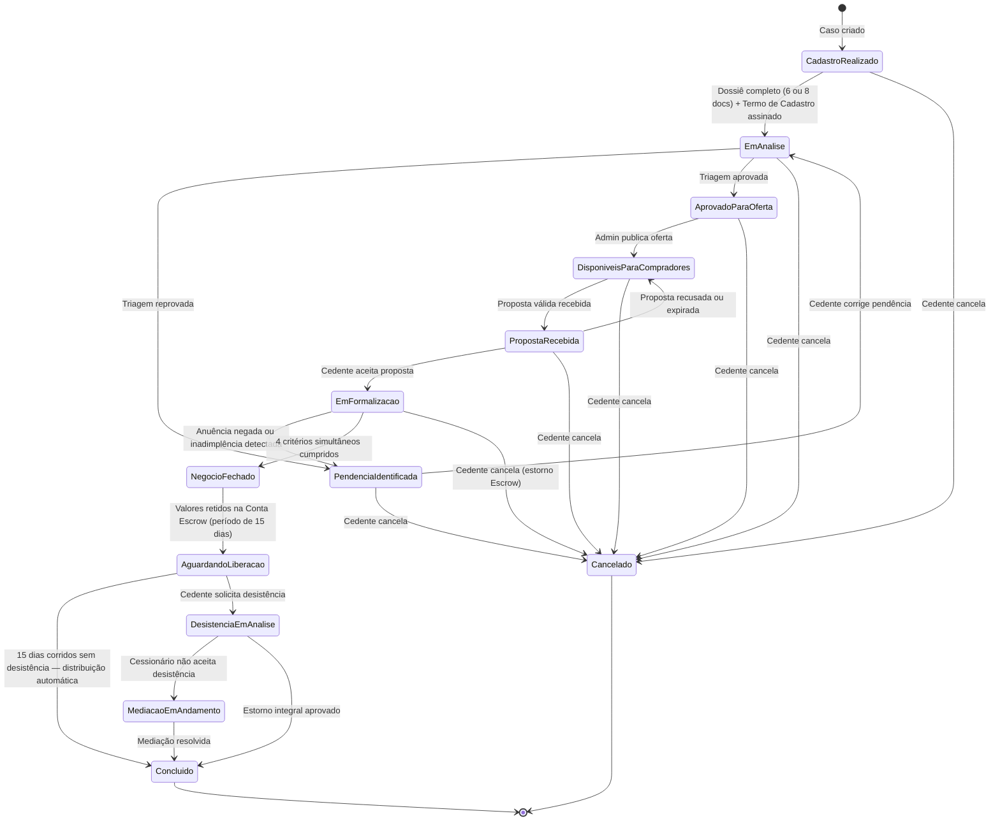

# 🏗️ Regras de Negócio — Módulo Cedente

## Parte 01.1 — Fundação e Acessos

| **Campo** | **Valor** |
|---|---|
| **Destinatário** | Equipe de Produto e Engenharia |
| **Escopo** | Glossário · Tipos de usuário e permissões · Cadastro e autenticação · Estados e ciclo de vida da conta · Onboarding · Mapa de módulos |
| **Módulo** | Cedente |
| **Parte** | Parte 1 de 5 — Fundação e Acessos |
| **Versão** | v1.1 |
| **Responsável** | Claude Code Desktop |
| **Data da versão** | 2026-03-22 (America/Fortaleza) |
| **Continuidade** | Início |
| **Origem do arquivo de entrada** | 01 - Regras de Negócio.md |

---

> 📌 **TL;DR**
>
> Este arquivo define as fundações do Módulo Cedente: quem são os atores, o que cada termo significa, como o Cedente cria e ativa a sua conta, quais estados a conta atravessa e como o painel é organizado. Toda regra dos arquivos 01.2 a 01.5 pressupõe o domínio do conteúdo aqui descrito. As RNs cobertas são **RN-001 a RN-020**.

---

## 🎯 1. Objetivo Estratégico do Módulo Cedente

O Módulo Cedente é a interface principal da pessoa que possui um contrato imobiliário e deseja transferi-lo para outra pessoa por meio do Repasse Seguro. O módulo oferece um painel self-service com menu lateral fixo (sidebar) que permite ao Cedente cadastrar o imóvel, acompanhar o andamento do caso, visualizar e responder propostas, assinar documentos e acompanhar o fluxo financeiro — tudo sem necessidade de atendimento humano para as ações principais.

O Cedente é o ator de entrada do negócio: sem Cedente cadastrado com dossiê aprovado, não há oferta, não há proposta, não há receita.

---

## 💡 2. Glossário

| **Termo** | **Definição** |
|---|---|
| **Cedente** | Pessoa física (CPF) ou jurídica (CNPJ) que possui um contrato imobiliário e deseja repassá-lo. É o usuário principal deste módulo. |
| **Cessionário** | Pessoa que adquire o direito do contrato do Cedente. O Cedente nunca vê dados pessoais do Cessionário na plataforma. |
| **Caso** | Cada imóvel cadastrado na plataforma pelo Cedente. Cada caso tem um ciclo de vida próprio com estados definidos. |
| **Dossiê** | Conjunto de documentos obrigatórios vinculados ao caso. O Cedente é responsável por enviar todos os documentos via upload. |
| **Cenário de Retorno (A, B, C, D)** | Opção que define o quanto o Cedente deseja receber no repasse. A = apenas transferir o saldo devedor (sem comissão). B = 100% do valor pago. C = 100% + 30%. D = 100% + 50%. |
| **Valor Recuperado** | Valor que o Cedente efetivamente recebe no fechamento do repasse. |
| **Valor Distrato Referência** | Valor que o Cedente receberia caso optasse pelo distrato com a construtora. Calculado como 50% do valor pago pelo Cedente. |
| **Escalonamento** | Processo pelo qual o Cedente desce de cenário (D → C, C → B, B → A) quando o caso não atrai compradores. Sempre descendente; para subir, é necessário cancelar e cadastrar novamente. |
| **Conta Escrow** | Conta garantia operada por parceiro bancário ou fintech regulado. Recebe o depósito do Cessionário, retém os valores por 15 dias corridos após o Fechamento (período de reversão) e libera o valor líquido ao Cedente automaticamente após esse período, caso não haja solicitação de reversão. |
| **Fechamento** | Evento que confirma o negócio. Exige 4 critérios simultâneos: (1) instrumento assinado pelas partes; (2) preço do repasse confirmado por evidência documental; (3) anuência da construtora formalizada; (4) depósito confirmado na Conta Escrow. > **Nota:** O critério (4) — confirmação do depósito na Conta Escrow — é gerenciado pelo Cessionário e confirmado pelo sistema. O Cedente acompanha o status pelo badge 'Depósito Confirmado' no painel de formalização. |
| **Reversão** | Cancelamento do negócio dentro dos 15 dias corridos após o Fechamento. A Conta Escrow estorna os valores integralmente. |
| **Anuência** | Autorização formal da construtora para transferir o contrato. Sem anuência, o Fechamento não acontece (salvo contratos com cessão livre). |
| **Guardião do Retorno** | Agente de inteligência artificial disponível 24 horas no painel do Cedente. Apoia simulações, cadastro assistido, FAQ e acompanhamento de status. |
| **Proposta** | Oferta de valor feita por um Cessionário (anônimo) para adquirir o repasse. O Cedente recebe a proposta pelo painel e pode aceitar, recusar ou contrapropor. |
| **Sidebar** | Menu fixo no lado esquerdo do painel do Cedente. Permite navegar entre todas as áreas sem sair da plataforma. |
| **Rascunho** | Cadastro de imóvel iniciado e não concluído. Permanece disponível por 30 dias corridos antes de ser descartado automaticamente. |
| **Termo de Cadastro** | Documento gerado automaticamente ao confirmar o cadastro do imóvel. Inclui declaração de adimplência e autorização para intermediação. |
| **Termo de Aceite de Escalonamento** | Documento gerado quando o Cedente solicita mudança descendente de cenário. |
| **Termo Comercial** | Documento gerado antes do Fechamento. Define comissões e condições acordadas. |
| **Instrumento de Cessão** | Documento gerado no Fechamento que formaliza a transferência do contrato. |

---

## ⚙️ 3. Entidades do Módulo Cedente

| **Entidade** | **O que o Cedente vê e faz** | **Quem cria** | **Quando deixa de ser acessível** |
|---|---|---|---|
| **Caso** | Status, dados do imóvel, cenário escolhido, próximos passos e linha do tempo de eventos. | Cedente (via cadastro) | Nunca. Casos concluídos e cancelados ficam no histórico permanente. |
| **Dossiê** | Upload de documentos e status de cada um (verificado, em análise, rejeitado, pendente). | Sistema (automático ao criar o caso) | Nunca. Fica arquivado. |
| **Proposta** | Valor oferecido, simulação de valores líquidos e comparativo com o cenário. Sem identificação do proponente. | Cessionário (anônimo), apresentado pelo Admin | Quando aceita, recusada ou o caso é cancelado. |
| **Envelope de Assinatura** | Documentos pendentes de assinatura e documentos já assinados via ZapSign. | Admin (via sistema) | Quando todos assinam ou o caso é cancelado. |
| **Conta Escrow** | Status (aberta, depósito confirmado, distribuída, em reversão, estornada) e valor líquido a receber. Somente leitura. | Sistema (automático) | Quando os valores são distribuídos ou estornados. |
| **Notificação** | Avisos de mudança de status, propostas, pendências e próximos passos. | Sistema (automático) | Quando lida ou o evento que a originou é resolvido. |

---

## 🎯 4. Atores e Perfis de Acesso

### 4.1 Atores do Módulo Cedente

| **Ator** | **Tipo** | **Função no módulo** |
|---|---|---|
| **Cedente PF** | Usuário externo — pessoa física | Cadastra imóvel, envia documentos, avalia propostas, assina documentos, acompanha financeiro. |
| **Cedente PJ** | Usuário externo — pessoa jurídica | Mesmas ações do Cedente PF, com campos adicionais e representante legal designado. |
| **Admin** | Usuário interno | Faz triagem do dossiê, publica ofertas, apresenta propostas, solicita anuência e conduz o Fechamento. Toda comunicação com o Cessionário passa pelo Admin. |
| **Guardião do Retorno** | Agente de IA | Apoia o Cedente 24h com simulações, orientações e cadastro assistido. Não executa ações operacionais. |
| **Sistema** | Automação | Executa validações, gera documentos, envia notificações, controla prazos e atualiza estados. |

### 4.2 Matriz de Permissões por Tela

| **Tela / Ação** | **Cedente PF** | **Cedente PJ** | **Admin** | **Guardião IA** |
|---|---|---|---|---|
| Dashboard — visualizar resumo | ✅ Leitura | ✅ Leitura | ✅ Leitura | Sem acesso direto |
| Meus Casos — visualizar lista | ✅ Leitura | ✅ Leitura | ✅ Leitura | Consulta via API |
| Meus Casos — cancelar caso | ✅ Ação | ✅ via Representante Legal | ✅ Ação Admin | ❌ |
| Cadastrar Imóvel — criar caso | ✅ Ação | ✅ via Representante Legal | ❌ (Admin não cadastra pelo Cedente) | Assistência apenas |
| Documentos — upload | ✅ Ação | ✅ via Representante Legal | ✅ Verificação/Rejeição | ❌ |
| Propostas — aceitar/recusar/contrapropor | ✅ Ação | ✅ via Representante Legal | Apresentação apenas | Orientação apenas |
| Assinaturas — assinar documento | ✅ Ação | ✅ Representante Legal assina | Geração do envelope | ❌ |
| Financeiro — visualizar | ✅ Leitura | ✅ Leitura | ✅ Leitura + Gestão | ❌ |
| Assistente IA — conversar | ✅ Ação | ✅ Ação | Supervisão | Opera o chat |
| Meu Perfil — editar dados | ✅ Ação (exceto CPF) | ✅ Ação (exceto CNPJ) | Suporte para correção | ❌ |

---

## ⚙️ 5. Mapa de Módulos (Sidebar)

O Cedente acessa um painel dedicado com menu lateral (sidebar) fixo no lado esquerdo. Cada clique no menu troca a área de trabalho sem recarregar a página.

| **Menu** | **Ícone** | **Função principal** | **Regras detalhadas em** |
|---|---|---|---|
| Dashboard | 📊 | Resumo visual dos casos: status, próximos passos e alertas. | RN-015 a RN-018 (este arquivo) |
| Meus Casos | 📋 | Lista de todos os imóveis cadastrados com status atual e histórico. | RN-019 a RN-020 (este arquivo) |
| Cadastrar Imóvel | 🏠 | Wizard de 5 etapas para cadastrar novo caso. | Parte 01.2 e 01.3 |
| Documentos | 📁 | Checklist do dossiê: upload, status e reenvio. | Parte 01.3 |
| Propostas | 💰 | Visualizar e responder propostas de Cessionários. | Parte 01.2 |
| Assinaturas | ✍️ | Documentos pendentes e assinados via ZapSign. | Parte 01.3 |
| Financeiro | 💵 | Comissões, Conta Escrow e valor líquido. Somente leitura. | Parte 01.3 |
| Assistente IA | 🤖 | Chat 24h com o Guardião do Retorno. | Parte 01.4 |
| Meu Perfil | 👤 | Dados pessoais, segurança e configurações de notificação. | RN-011 a RN-014 (este arquivo) |

---

## ⚙️ 6. Estados Visíveis para o Cedente

Os 13 estados abaixo são como o Cedente vê o progresso do seu caso. Os estados internos do Admin (ex: "Escalonado", que é transitório) não aparecem para o Cedente.

| **#** | **Nome visível para o Cedente** | **Estado interno (Admin)** | **Mensagem explicativa exibida no painel** |
|---|---|---|---|
| 1 | Cadastro realizado | Captado | "Seu imóvel foi cadastrado. Envie os documentos pendentes para que possamos iniciar a análise." |
| 2 | Em análise | Em Triagem | "Estamos verificando seus documentos. Prazo estimado: 3 dias úteis." |
| 3 | Pendência identificada | Bloqueado | "Identificamos uma pendência nos seus documentos. Verifique os detalhes e resolva para continuar." |
| 4 | Aprovado para oferta | Qualificado | "Seus documentos foram aprovados! Seu imóvel será disponibilizado para potenciais compradores em breve." |
| 5 | Disponível para compradores | Oferta Ativa | "Seu imóvel está disponível para compradores qualificados. Você será notificado quando receber uma proposta." |
| 6 | Proposta recebida | Em Negociação | "Você recebeu uma proposta! Acesse Propostas para avaliar e responder." |
| 7 | Em formalização | Em Formalização | "Estamos preparando os documentos finais para o fechamento. Fique atento para assinaturas pendentes." |
| 8 | Negócio fechado | Fechamento | "Parabéns! O repasse foi formalizado. Seus valores estão retidos na Conta Escrow pelo período de segurança de 15 dias. A distribuição acontece automaticamente ao final desse período." |
| 9 | Aguardando liberação | Pós Fechamento | "Seus valores estão retidos na Conta Escrow. O período de segurança termina em [data]. Após essa data, a distribuição será processada automaticamente." |
| 10 | Desistência em análise | Em Reversão | "Sua solicitação de desistência está sendo analisada." |
| 11 | Mediação em andamento | Em Mediação | "Estamos mediando a situação entre as partes. Prazo estimado: 10 dias úteis." |
| 12 | Concluído | Concluído | "Repasse concluído com sucesso. Valor de R$ [X] liberado para sua conta." |
| 13 | Cancelado | Cancelado | "Este caso foi cancelado. Você pode cadastrar o imóvel novamente a qualquer momento." |

> 💡 O estado "Escalonado" é interno e transitório: quando o Cedente conclui o escalonamento, o caso retorna diretamente para "Disponível para compradores" no novo cenário, sem estado intermediário visível.

---

## ⚙️ 7. Regras de Negócio — Fundação e Acessos

### 7.1 Cadastro e Autenticação da Conta

---

**RN-001: Cadastro e ativação da conta do Cedente**

> Origem: CED-01

1. O Cedente acessa a plataforma e preenche o formulário de cadastro com: nome completo, CPF ou CNPJ, e-mail, telefone e senha.
2. O sistema valida: CPF/CNPJ com formato correto e não duplicado na plataforma; e-mail com formato válido e não duplicado; senha com no mínimo 8 caracteres, 1 letra maiúscula e 1 número.
3. **Se todas as condições são atendidas:** o sistema cria a conta com status "Pendente de ativação" e envia e-mail de confirmação com link válido por 48 horas.
4. **Se alguma condição não é atendida:** o sistema exibe mensagem específica para cada campo inválido e não cria a conta.
   - CPF/CNPJ duplicado: "Este CPF/CNPJ já possui uma conta. Faça login ou recupere sua senha."
   - E-mail duplicado: "Este e-mail já está cadastrado. Faça login ou recupere sua senha."
   - Senha fraca: "A senha deve ter pelo menos 8 caracteres, uma letra maiúscula e um número."
5. **Validação inline dos campos:** cada campo é validado ao perder o foco (on blur). Se válido, indicador verde ao lado do campo. Se inválido, indicador vermelho com mensagem de erro. [CORRIGIDO: PROBLEMA-002]
6. **Estado de carregamento ao submeter:** ao clicar em "Cadastrar", o botão exibe spinner com texto "Verificando dados..." e fica desabilitado até a resposta do sistema. [CORRIGIDO: PROBLEMA-001] [DECISÃO APLICADA: DEC-001 — spinner no botão com texto contextual; DEC-002 — validação on blur]
7. **Efeito no estado da conta:** Inexistente → Pendente de ativação.
8. **Consequência se violada:** O Cedente não consegue acessar o painel nem cadastrar imóveis.

---

**RN-002: Ativação da conta por confirmação de e-mail**

> Origem: CED-01

1. O Cedente recebe o e-mail de confirmação e clica no link de ativação.
2. O sistema verifica se o link está dentro do prazo de 48 horas e se corresponde à conta criada.
3. **Se o link é válido:** o sistema muda o status da conta para "Ativo" e exibe tela intermediária de sucesso: "Sua conta foi ativada com sucesso! Bem-vindo ao Repasse Seguro." com botão "Acessar meu painel". Se o Cedente não clicar, o sistema redireciona automaticamente para o painel após 3 segundos. [CORRIGIDO: PROBLEMA-003] [DECISÃO APLICADA: DEC-003]
4. **Se o link expirou (mais de 48 horas):** o sistema exibe: "O link de confirmação expirou. Solicite um novo link na tela de login."
5. **Efeito no estado da conta:** Pendente de ativação → Ativo.
6. **Consequência se violada:** A conta permanece inativa e o Cedente não pode usar a plataforma.

---

**RN-003: Reenvio do e-mail de confirmação**

> Origem: CED-01

1. O Cedente que ainda não confirmou o e-mail acessa a tela de login e clica em "Reenviar e-mail de confirmação".
2. O sistema verifica se a conta existe com status "Pendente de ativação".
3. **Se a conta existe:** o sistema gera novo link (válido por mais 48 horas) e envia novo e-mail. O link anterior é invalidado. O botão "Reenviar" fica desabilitado por 60 segundos com timer regressivo visível: "Reenviar disponível em [X] segundos." [CORRIGIDO: PROBLEMA-004] [DECISÃO APLICADA: DEC-004]
4. **Se a conta não existe ou já está ativa:** o sistema exibe: "Não encontramos uma conta pendente com este e-mail. Verifique se já confirmou anteriormente ou cadastre-se."
5. **Efeito no estado:** Nenhuma alteração de status — apenas novo link gerado.
6. **Consequência se violada:** Cedente fica bloqueado fora da plataforma indefinidamente.

---

**RN-004: Recuperação de senha**

> Origem: PERF-04 [DECISÃO AUTÔNOMA — o arquivo de entrada menciona recuperação de senha na tela de login mas não detalha o fluxo. Decisão: fluxo padrão de link por e-mail com validade de 1 hora, pois é o modelo de menor fricção e maior adoção. Alternativa descartada: recuperação via SMS — não há menção de SMS no produto além de SC1.]

1. O Cedente clica em "Recuperar senha" na tela de login e informa o e-mail cadastrado.
2. O sistema verifica se o e-mail corresponde a uma conta ativa.
3. **Se o e-mail existe:** o sistema envia link de redefinição de senha com validade de 1 hora.
4. **Se o e-mail não existe:** o sistema exibe: "Se este e-mail estiver cadastrado, você receberá as instruções em breve." (sem confirmar ou negar existência da conta, por segurança.) Em ambos os casos, a tela exibe ícone de e-mail e orientação: "Verifique sua caixa de entrada e a pasta de spam. O link expira em 1 hora." [CORRIGIDO: PROBLEMA-005]
5. **Efeito no estado:** Nenhuma alteração de status — apenas link de redefinição gerado.
6. **Consequência se violada:** Cedente perde acesso permanente à conta se esquecer a senha.

---

**RN-005: Bloqueio de conta por tentativas de login**

> Origem: PERF-04, USR-08 (Admin)

1. O Cedente tenta fazer login com credenciais incorretas.
2. O sistema contabiliza as tentativas consecutivas com falha.
3. **Após 5 tentativas consecutivas com falha:** o sistema bloqueia o acesso pelo período de 15 minutos e exibe: "Sua conta foi temporariamente bloqueada por segurança. Tente novamente a partir de [horário exato]." com timer regressivo visível. [CORRIGIDO: PROBLEMA-007] [DECISÃO APLICADA: DEC-006]
4. **Antes de 5 tentativas:** o sistema exibe mensagem genérica: "E-mail ou senha incorretos." sem revelar qual campo está errado. A partir da 3a tentativa, o sistema adiciona: "Você tem mais [X] tentativas antes do bloqueio temporário." [CORRIGIDO: PROBLEMA-006] [DECISÃO APLICADA: DEC-005]
5. **Efeito no estado da conta:** Ativo → Bloqueado temporariamente (15 minutos).
6. **Consequência se violada:** Conta exposta a tentativas de acesso não autorizado.

---

**RN-006: Expiração de sessão por inatividade**

> Origem: PERF-04

1. O Cedente acessa o painel e realiza ações normalmente.
2. O sistema monitora o tempo de inatividade (ausência de qualquer ação na plataforma).
3. **5 minutos antes da expiração:** o sistema exibe modal de aviso: "Sua sessão expira em 5 minutos por inatividade. Deseja continuar?" com botão "Continuar sessão". Se o Cedente clicar, o timer reinicia. Dados de formulários em preenchimento são preservados em rascunho local. [CORRIGIDO: PROBLEMA-008] [DECISÃO APLICADA: DEC-007]
4. **Após 24 horas de inatividade contínua (sem renovação):** o sistema encerra a sessão automaticamente e redireciona o Cedente para a tela de login.
4. **Se o Cedente tentar acessar uma tela após o encerramento:** o sistema exibe: "Sua sessão expirou por inatividade. Faça login novamente para continuar."
5. **Efeito no estado da sessão:** Ativa → Encerrada.
6. **Consequência se violada:** Sessões abertas em dispositivos não supervisionados expõem dados financeiros sensíveis do Cedente.

---

### 7.2 Perfil do Cedente

---

**RN-007: Imutabilidade do CPF/CNPJ**

> Origem: PERF-01

1. O Cedente acessa "Meu Perfil" e tenta editar o campo CPF/CNPJ.
2. O sistema verifica que o campo é protegido contra edição pelo próprio Cedente.
3. **O campo está desabilitado para edição:** o sistema exibe o valor em modo somente leitura.
4. **Se o Cedente precisar corrigir o CPF/CNPJ:** o sistema exibe: "CPF/CNPJ não pode ser alterado diretamente. Entre em contato com nosso suporte para correções."
5. **Efeito no estado:** Nenhuma alteração — campo permanece inalterado.
6. **Consequência se violada:** Alteração de CPF/CNPJ poderia criar inconsistências com documentos já assinados e registros financeiros.

---

**RN-008: Alteração de e-mail com dupla confirmação**

> Origem: PERF-02

1. O Cedente acessa "Meu Perfil" e informa um novo endereço de e-mail.
2. O sistema valida que o novo e-mail tem formato válido e não está cadastrado em outra conta.
3. **Se o novo e-mail é válido:** o sistema envia link de confirmação para o novo endereço. O e-mail anterior permanece ativo até a confirmação. Em Meu Perfil, o e-mail atual é exibido com badge "Ativo" e o novo e-mail com badge "Pendente de confirmação" e timer de 48h. Botão "Cancelar troca" disponível. [CORRIGIDO: PROBLEMA-009] [DECISÃO APLICADA: DEC-008]
4. **Se o Cedente não confirmar o novo e-mail:** o sistema mantém o e-mail anterior ativo indefinidamente e descarta a solicitação de troca após 48 horas.
5. **Efeito no estado do e-mail:** E-mail anterior (ativo) → E-mail anterior (ativo) + E-mail novo (pendente de confirmação) → E-mail novo (ativo).
6. **Consequência se violada:** Troca de e-mail sem confirmação poderia redirecionar notificações críticas (propostas, fechamento) para endereço incorreto.

---

**RN-009: Configuração de preferências de notificação**

> Origem: PERF-03 (inferido das regras de notificação da seção 7 do arquivo de entrada)

1. O Cedente acessa "Meu Perfil" e navega até a seção "Notificações".
2. O sistema exibe a lista de tipos de notificação por e-mail com opção de ativar ou desativar cada categoria.
3. **Notificações de lembrete (desativáveis):** documentos pendentes (evento 3), proposta expirando (evento 9), assinatura pendente (evento 12) e rascunho expirando (evento 17) podem ser desativadas pelo Cedente.
4. **Notificações críticas (não desativáveis):** nova proposta recebida (evento 8), fechamento confirmado (evento 13) e distribuição realizada (evento 14) não podem ser desativadas. Estas notificações são exibidas com ícone de cadeado e tooltip "Esta notificação é obrigatória" desde a abertura da tela. O toggle é visualmente desabilitado (cinza). [CORRIGIDO: PROBLEMA-010]
5. **Notificações no painel:** sempre ativas, independentemente das preferências de e-mail.
6. **Consequência se violada:** Cedente pode perder notificações críticas sobre propostas ou pagamentos.

---

**RN-010: Solicitação de exclusão de dados (LGPD)**

> Origem: PERF-03

1. O Cedente acessa "Meu Perfil" e clica em "Solicitar exclusão dos meus dados".
2. O sistema exibe tela de confirmação com aviso: "A exclusão dos seus dados é irreversível e encerrará seu acesso à plataforma. Casos ativos serão cancelados. Confirmar?"
3. **Se o Cedente confirmar:** o sistema registra a solicitação com data e horário, atribui número de protocolo e encaminha ao Admin para processamento. O Cedente recebe confirmação: "Sua solicitação foi registrada com protocolo [número]. Responderemos em até 15 dias corridos." O Cedente permanece logado com banner no topo do painel: "Sua solicitação de exclusão está em processamento (protocolo [número]). Prazo: até [data]. Seus dados permanecem acessíveis até a conclusão." Botão "Cancelar solicitação" disponível durante o prazo de processamento. [CORRIGIDO: PROBLEMA-011] [DECISÃO APLICADA: DEC-009]
4. **Se o Cedente cancelar a ação:** o sistema fecha a tela de confirmação sem nenhuma alteração.
5. **Efeito no estado:** Solicitação registrada. A exclusão efetiva é processada pelo Admin em até 15 dias corridos.
6. **Consequência se violada:** Descumprimento da Lei Geral de Proteção de Dados (LGPD). [DEFINIÇÃO PENDENTE — prazo de resposta de 15 dias corridos precisa ser validado com assessoria jurídica. Opção A: 15 dias corridos (mais favorável ao usuário). Opção B: 30 dias corridos (prazo legal máximo da LGPD). Decisão provisória: 15 dias corridos — mais restritivo que o legal e diferencial de confiança.]

---

### 7.3 Segurança e Isolamento de Dados

---

**RN-011: Isolamento total de dados do Cedente**

> Origem: CED-12

1. O Cedente autentica-se no painel e acessa qualquer tela.
2. O sistema filtra todos os dados exibidos pelo identificador único do Cedente logado.
3. **O Cedente vê exclusivamente:** seus próprios casos, documentos, propostas, assinaturas e dados financeiros.
4. **O Cedente nunca vê:** dados de outros Cedentes, dados pessoais de Cessionários, valores de outros casos ou quantidade de usuários na plataforma.
5. **Se houver tentativa de acesso a dados de outro usuário (ex: manipulação de URL):** o sistema bloqueia a requisição, exibe: "Você não tem permissão para acessar este conteúdo." e registra o evento no log de segurança.
6. **Consequência se violada:** Exposição de dados financeiros sensíveis e quebra de confidencialidade comercial entre partes — risco legal e de confiança.

---

**RN-012: Anonimato do Cessionário nas propostas**

> Origem: PROP-01, CED-12

1. O Admin apresenta uma proposta de Cessionário ao Cedente pelo painel.
2. O sistema exibe a proposta com: identificação sequencial ("Proposta 1", "Proposta 2"), valor oferecido, simulação financeira e prazo de resposta.
3. **O sistema nunca exibe:** nome, CPF, e-mail, telefone ou qualquer dado que identifique o Cessionário.
4. **Se o Cedente perguntar ao Guardião do Retorno quem é o Cessionário:** o agente responde: "Por segurança e política da plataforma, não compartilhamos dados pessoais do comprador. O processo é mediado pela nossa equipe."
5. **Efeito no estado:** Nenhum estado alterado — é uma regra de exibição permanente.
6. **Consequência se violada:** Cedente e Cessionário poderiam negociar diretamente, eliminando a intermediação e a receita do Repasse Seguro.

---

### 7.4 Dashboard

---

**RN-013: Dashboard como visão consolidada — somente leitura**

> Origem: DC-02

1. O Cedente faz login na plataforma.
2. O sistema exibe automaticamente o Dashboard como primeira tela, com dados atualizados do Cedente.
3. **O Dashboard exibe:** cards de resumo (casos ativos, pendências, propostas recebidas, valor líquido estimado), lista resumida de casos ativos, painel de próximos passos prioritários e feed dos últimos 10 eventos.
4. **O Dashboard não permite:** nenhuma ação operacional direta (não é possível cancelar, aceitar proposta ou fazer upload pela Dashboard).
5. **Se o Cedente não tiver nenhum caso (primeiro acesso):** o sistema exibe: (a) mensagem de boas-vindas personalizada com nome do Cedente, (b) checklist visual de 3 passos ("Cadastre seu imóvel", "Envie os documentos", "Receba propostas"), (c) botão "Cadastrar meu primeiro imóvel" em destaque visual, (d) link "Fale com nosso assistente" para o Guardião do Retorno. [CORRIGIDO: PROBLEMA-012] [DECISÃO APLICADA: DEC-010]
6. **Consequência se violada:** Permitir ações diretas na Dashboard causaria inconsistências de estado sem os fluxos de confirmação necessários.

---

**RN-014: Dados exclusivos do Cedente no Dashboard**

> Origem: DC-01

1. O sistema monta o Dashboard após o login do Cedente.
2. Todos os dados exibidos pertencem exclusivamente aos casos do Cedente logado.
3. **Se um dado de outro Cedente aparecer por qualquer motivo:** trata-se de falha crítica de isolamento — deve ser registrada e corrigida imediatamente. O usuário deve ver: "Ocorreu um problema ao carregar seus dados. Tente novamente."
4. **Os dados são atualizados:** a cada 60 segundos por polling ou em tempo real via conexão persistente, o que ocorrer primeiro. Indicador discreto de última atualização no rodapé: "Atualizado há [X] segundos". Se a conexão falhar: "Dados podem estar desatualizados. Verificando conexão..." [CORRIGIDO: PROBLEMA-013]
5. **Consequência se violada:** Exposição de dados financeiros de terceiros — falha grave de segurança.

---

**RN-015: Valor líquido estimado com disclaimer obrigatório**

> Origem: DC-03

1. O sistema calcula o valor líquido estimado dos casos em negociação ou formalização.
2. O cálculo é: melhor proposta ativa recebida menos a comissão RS estimada com base no cenário atual.
3. **O card de valor líquido estimado exibe sempre:** o valor calculado e a nota: "Valor estimado com base no cenário atual. Sujeito a alteração conforme negociação."
4. **Se não houver proposta ativa:** o sistema exibe ícone de espera discreto com texto "Aguardando primeira proposta" em tom secundário. Card com menor opacidade que os cards com dados ativos. [CORRIGIDO: PROBLEMA-014]
5. **Consequência se violada:** Cedente pode tomar decisões financeiras baseado em valor não garantido sem ciência do risco.

---

**RN-016: Destaque de urgência para pendências próximas do prazo**

> Origem: DC-04

1. O sistema verifica, a cada atualização da Dashboard, se há pendências com prazo vencendo em até 1 dia útil.
2. **Se houver pendência com prazo ≤ 1 dia útil:** o item aparece com destaque vermelho no painel de próximos passos, com ícone do tipo de ação (documento, caneta, moeda) e texto curto da ação requerida: "Assinar documento", "Enviar documento" ou "Responder proposta". [CORRIGIDO: PROBLEMA-015]
3. **Se a pendência tiver prazo entre 2 e 3 dias úteis:** o item aparece com destaque amarelo.
4. **Se a pendência tiver prazo acima de 3 dias úteis:** o item aparece sem destaque especial de cor.
5. **Efeito no estado:** Apenas visual — não altera o status do caso.
6. **Consequência se violada:** Cedente pode perder prazos críticos de proposta ou assinatura por falta de sinalização adequada.

---

### 7.5 Meus Casos

---

**RN-017: Histórico permanente de todos os casos**

> Origem: MC-01

1. O Cedente acessa "Meus Casos".
2. O sistema exibe todos os casos do Cedente: ativos, concluídos e cancelados, ordenados por data de criação (mais recente primeiro).
3. **Casos concluídos e cancelados:** permanecem visíveis para sempre no histórico. O Cedente pode consultar dados, documentos e linha do tempo mesmo após o encerramento.
4. **Filtros disponíveis:** por status (ativo, concluído, cancelado) e por cenário (A, B, C, D). Campo de busca por nome do imóvel ou endereço. Paginação numérica no rodapé com setas "Anterior/Próximo" e total: "Exibindo 1-10 de [X] casos". [CORRIGIDO: PROBLEMA-016]
5. **Consequência se violada:** Perda de acesso a histórico financeiro e documental que pode ser necessário para fins fiscais ou jurídicos do Cedente.

---

**RN-018: Status exibido com linguagem simples e próximo passo**

> Origem: MC-02

1. O sistema exibe cada caso na lista com o nome amigável do status (conforme tabela da seção 6) e uma frase explicativa.
2. **A frase explicativa inclui:** o que está acontecendo agora, o que o Cedente pode ou deve fazer e prazo estimado quando aplicável.
3. **Exemplo:** o status "Em análise" exibe "Estamos verificando seus documentos. Prazo estimado: 3 dias úteis."
4. **O sistema nunca exibe:** termos técnicos internos como "Captado", "Qualificado" ou "Oferta Ativa" diretamente para o Cedente — apenas os nomes amigáveis.
5. **Consequência se violada:** Cedente não entende o que está acontecendo com seu caso e pode abandonar a plataforma ou acionar o suporte desnecessariamente.

---

**RN-019: Bloqueio de edição de dados do imóvel após triagem**

> Origem: MC-03

1. O Cedente tenta editar dados do imóvel (endereço, construtora, valor do contrato) em um caso com status "Aprovado para oferta" ou posterior.
2. O sistema verifica que o caso passou pela triagem do Admin.
3. **O sistema bloqueia a edição** dos dados do imóvel após a triagem e exibe: "Os dados do imóvel não podem ser alterados após a aprovação do dossiê. Se precisar de uma correção, entre em contato com nosso suporte."
4. **Se o caso ainda está em "Cadastro realizado" ou "Em análise":** a edição de dados é permitida pelo Cedente, pois o caso ainda não foi aprovado.
5. **Efeito no estado:** Nenhuma alteração de status — apenas bloqueio de edição.
6. **Consequência se violada:** Alterações nos dados do imóvel após a triagem invalidariam a análise já realizada e poderiam gerar inconsistência com documentos assinados.

---

**RN-020: Detalhe completo do caso em abas**

> Origem: MC (layout seção 4.2 do arquivo de entrada)

1. O Cedente clica em um caso na lista de "Meus Casos".
2. O sistema abre o detalhe completo do caso com as abas: Resumo, Documentos, Propostas, Financeiro e Histórico. As abas são navegáveis por teclado (setas esquerda/direita) com atributos de acessibilidade (role tablist/tab/tabpanel, aria-selected). [CORRIGIDO: PROBLEMA-017]
3. **Aba Resumo:** dados do imóvel, cenário escolhido, valor pago, valor distrato referência, simulação dos 4 cenários e status atual com explicação.
4. **Aba Histórico:** linha do tempo completa e imutável com todas as mudanças de status, datas e explicações em linguagem simples.
5. **As abas Documentos, Propostas e Financeiro:** funcionam como atalhos para as respectivas telas do menu lateral, exibindo os dados do caso selecionado.
6. **Consequência se violada:** Cedente perde rastreabilidade do progresso do caso e não consegue consultar histórico de decisões.

---

### 7.6 Cadastrar Imóvel

---

**RN-088: Upload de documentos opcional na criação do caso**

> Origem: CAD-03 (arquivo de entrada)

1. O Cedente chega à Etapa 5 do wizard de cadastro (Upload de Documentos).
2. O sistema exibe os campos de upload dos 6 documentos obrigatórios e um botão "Pular esta etapa".
3. **Se o Cedente fizer o upload dos documentos na Etapa 5:** o caso é criado com status "Cadastro realizado" e o dossiê já contém os arquivos enviados.
4. **Se o Cedente clicar em "Pular esta etapa":** o sistema cria o caso com status "Cadastro realizado" e dossiê incompleto. O Cedente recebe notificação: "Seu imóvel foi cadastrado. Envie os documentos pendentes pelo menu Documentos para iniciar a análise."
5. **O caso não avança para "Em análise"** enquanto todos os documentos obrigatórios não forem enviados e o Termo de Cadastro não estiver assinado — independentemente de o upload ter sido feito na Etapa 5 ou depois.
6. **Efeito no estado:** Rascunho → "Cadastro realizado" (com dossiê incompleto se a etapa for pulada).
7. **Consequência se violada:** Bloquear a etapa de upload forçaria Cedentes sem os arquivos disponíveis no momento a abandonar o cadastro — reduzindo a taxa de conversão sem benefício operacional.

---

**RN-089: Assistência do Guardião do Retorno em todas as etapas do cadastro**

> Origem: CAD-05 (arquivo de entrada)

1. O Cedente inicia o wizard de cadastro e avança por qualquer uma das 5 etapas.
2. O sistema exibe o chat do Guardião do Retorno no canto inferior direito da tela em todas as etapas do wizard — sem exceção.
3. **Se o Cedente digitar uma pergunta no chat:** o Guardião responde com base no contexto da etapa atual (ex: na Etapa 2, explica como calcular o valor pago; na Etapa 3, simula cenários).
4. **Se o Cedente pedir para o Guardião preencher um campo** (cadastro assistido): o Guardião solicita as informações necessárias por chat e preenche o campo automaticamente, exibindo o valor para confirmação antes de salvar.
5. **O Guardião nunca avança o wizard em nome do Cedente:** a confirmação de cada etapa é sempre uma ação explícita do Cedente.
6. **Consequência se violada:** Cedente sem suporte contextual abandona o cadastro em etapas de maior complexidade — especialmente Etapa 2 (valores financeiros) e Etapa 3 (simulador de cenários).

---

**RN-013.a: Regras específicas para Cedente Pessoa Jurídica (PJ)**

> Origem: Decisão autônoma — gap identificado em auditoria cross-doc (2026-03-22)

🎯 **Objetivo:** Garantir que empresas cedentes tenham seu processo adaptado às particularidades jurídicas e documentais de pessoas jurídicas.

**Documentação adicional obrigatória para Cedente PJ (além dos 6 documentos padrão):**
- Contrato Social ou Estatuto Social (versão consolidada).
- Cartão CNPJ atualizado (emitido nos últimos 30 dias).
- Documento de identidade do(s) representante(s) legal(is) com poderes para ceder contratos imobiliários.
- Procuração ou ata de assembleia autorizando a cessão (quando os representantes legais do contrato original diferirem dos atuais signatários).

**Total de documentos para Cedente PJ:** 10 documentos (6 padrão + 4 adicionais). O checklist de triagem é expandido automaticamente ao detectar CNPJ no cadastro.

**Assinatura via ZapSign:**
- O envelope ZapSign deve incluir o(s) representante(s) legal(is) como signatário(s), não a empresa como entidade.
- O campo "Razão Social" é exibido no envelope, mas a assinatura é sempre do representante físico com CPF validado.
- Se houver 2 assinaturas obrigatórias por força do contrato social (ex: firma de dois sócios), o Analista configura 2 signatários no envelope ZapSign para o Cedente.

**Distribuição do Escrow para PJ:**
- O valor é transferido para a conta bancária cadastrada em nome do CNPJ.
- O sistema emite comprovante com CNPJ do beneficiário para fins contábeis.

**Bloqueio por situação fiscal:**
- Ao entrar em triagem, o sistema consulta automaticamente a situação cadastral do CNPJ na Receita Federal.
- **Se o CNPJ estiver inapto, suspenso ou baixado:** o caso é bloqueado com notificação ao Cedente PJ: "O CNPJ [número] está com situação irregular na Receita Federal. Regularize a situação antes de prosseguir."
- A consulta é repetida a cada 15 dias enquanto o caso estiver ativo.

**Responsabilidade solidária:**
- O Termo Comercial para Cedente PJ inclui cláusula de responsabilidade solidária do representante legal, conforme configuração padrão do Master.

**Consequência se violada:** Processar uma cessão de contrato imobiliário feita por empresa sem verificar representação legal e situação fiscal gera risco de nulidade jurídica da operação.

---

## 📌 8. Tabela de SLAs desta Parte

| **Evento** | **SLA** | **Consequência do não cumprimento** |
|---|---|---|
| Link de ativação de e-mail | 48 horas de validade | Link expira; Cedente deve solicitar reenvio. |
| Link de recuperação de senha | 1 hora de validade | Link expira; Cedente deve solicitar novo link. |
| Bloqueio por tentativas de login | 5 tentativas → 15 minutos | Conta bloqueada temporariamente. |
| Expiração de sessão por inatividade | 24 horas | Sessão encerrada; Cedente redirecionado para login. |
| Solicitação de exclusão LGPD (resposta) | 15 dias corridos | [DEFINIÇÃO PENDENTE — ver RN-010] |
| Atualização do Dashboard (polling) | 60 segundos ou tempo real | Dashboard pode exibir dados desatualizados. |

---

## 🔴 9. Edge Cases desta Parte

| **Situação** | **Comportamento esperado** | **Referência** |
|---|---|---|
| Cedente tenta criar conta com CNPJ de empresa baixada | Sistema rejeita com mensagem específica sobre situação cadastral. Ver Parte 01.4 para fluxo completo de Cedente PJ. | RN-001, EC-01 (Parte 01.4) |
| Cedente confirma e-mail em dispositivo diferente do cadastro | Link é válido por 48 horas independentemente do dispositivo. Ativação é confirmada normalmente. | RN-002 |
| Cedente altera e-mail e o novo endereço não existe mais | Link enviado mas nunca clicado. E-mail anterior permanece ativo. Solicitação descartada após 48 horas. | RN-008 |
| Dashboard com muitos casos — desempenho | O sistema deve exibir no máximo 10 eventos no feed e paginar a lista de casos. [DECISÃO AUTÔNOMA — paginação de 10 por tela; alternativa descartada: scroll infinito — mais complexo para MVP.] | RN-013 |

---

*Parte 1 de 5 — Continuidade: RN-021 (Parte 01.2)*
