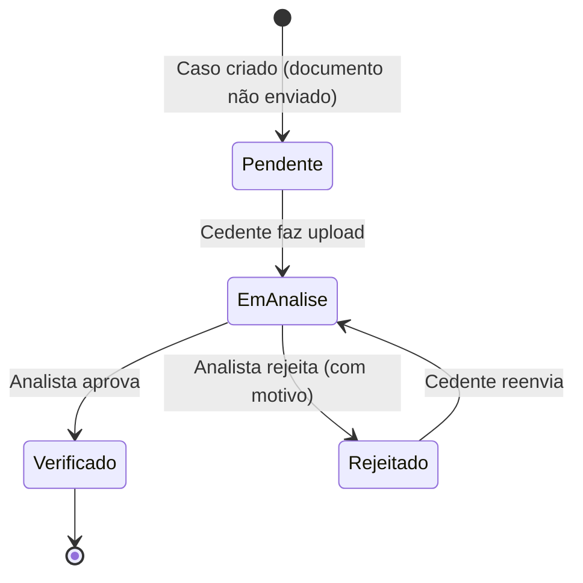
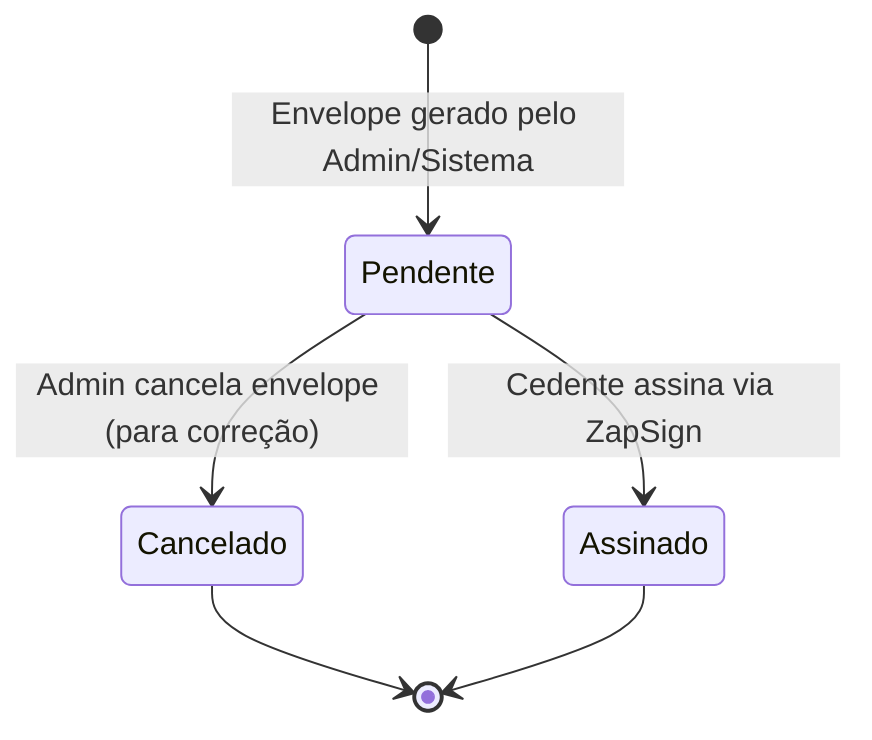
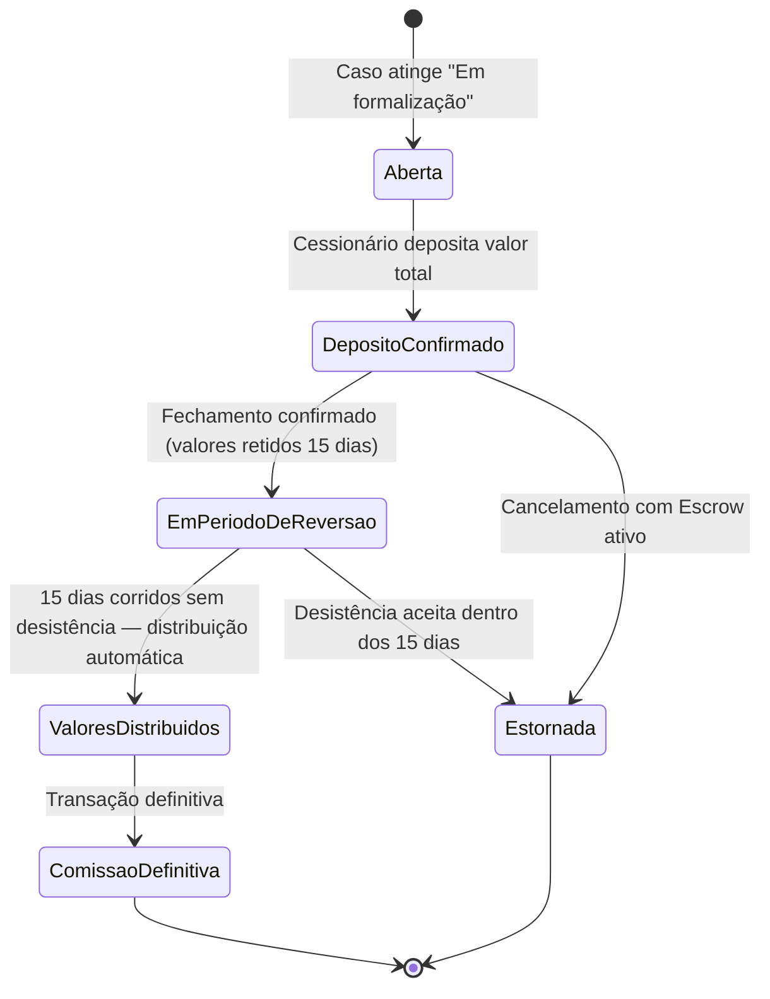

# ⚙️ Regras de Negócio — Módulo Cedente

## Parte 01.3 — Módulos Operação e Suporte

| **Campo** | **Valor** |
|---|---|
| **Destinatário** | Equipe de Produto e Engenharia |
| **Escopo** | Dossiê e documentos · Assinaturas eletrônicas · Financeiro do Cedente · Cancelamento de caso · Notificações |
| **Módulo** | Cedente |
| **Parte** | Parte 3 de 5 — Módulos Operação e Suporte |
| **Versão** | v1.1 |
| **Responsável** | Claude Code Desktop |
| **Data da versão** | 2026-03-22 (America/Fortaleza) |
| **Continuidade** | RN-040 (Parte 01.2) |
| **Origem do arquivo de entrada** | 01 - Regras de Negócio.md |

---

> 📌 **TL;DR**
>
> Este arquivo cobre os módulos que sustentam a operação do Módulo Cedente: gestão do dossiê (upload e verificação de documentos), assinaturas eletrônicas via ZapSign, acompanhamento financeiro (Conta Escrow e comissão), cancelamento de caso antes do Fechamento e sistema de notificações. Sem estes módulos, o fluxo principal trava — mas eles não geram receita por si só. As RNs cobertas são **RN-041 a RN-057**.

---

## 🎯 1. Objetivo dos Módulos de Operação

Os módulos desta parte garantem que o caso avance de etapa em etapa com segurança documental e jurídica. O Dossiê é o pré-requisito da triagem; as Assinaturas são o pré-requisito do Fechamento; o painel Financeiro garante transparência sobre os valores; e as Notificações garantem que o Cedente esteja sempre informado. O Cancelamento é o mecanismo de saída antes do Fechamento.

---

## ⚙️ 2. Módulo: Documentos (Dossiê)

**Objetivo:** Centralizar a gestão dos documentos obrigatórios do caso. O Cedente faz upload, acompanha o status de verificação e reenvia documentos rejeitados. Sem dossiê completo, o caso não avança para triagem.

**Atores:** Cedente (upload e reenvio), Admin/Analista (verificação e rejeição), Sistema (validação automática de formato e tamanho).

**Objeto principal:** Documento (vinculado ao Caso).

**Estados possíveis de cada documento:**

---

**RN-041: Documentos obrigatórios para Cedente pessoa física**

> Origem: CED-02, DOC-01

1. O Cedente acessa o menu "Documentos" e vê o checklist do dossiê do caso selecionado.
2. O sistema exibe os 6 documentos obrigatórios com status visual (Pendente, Em análise, Verificado, Rejeitado). Cada documento inclui aria-label descritivo para acessibilidade: "[Nome do documento] — status: [status]". Ícones de status com texto alternativo correspondente. [CORRIGIDO: PROBLEMA-037]
   - 1. Contrato original do imóvel (com a construtora).
   - 2. Comprovantes das últimas 3 parcelas pagas.
   - 3. Declaração de adimplência assinada pelo Cedente.
   - 4. Documento de identidade do Cedente (RG ou CNH).
   - 5. Comprovante de endereço atualizado (últimos 90 dias).
   - 6. Tabela do Contrato (valor original do imóvel).
3. **Para cada documento pendente:** o sistema exibe botão "Enviar". Para documentos rejeitados: botão "Reenviar" com o motivo de rejeição visível.
4. **Documentos verificados:** exibidos com selo de verificação. Não podem ser substituídos pelo Cedente (RN-044).
5. **Consequência se violada:** Dossiê incompleto impede o avanço para triagem e, portanto, para o Fechamento.

---

**RN-042: Validação automática de formato e tamanho no upload**

> Origem: DOC-02

1. O Cedente seleciona ou arrasta um arquivo para o campo de upload de um documento.
2. O sistema valida automaticamente o formato (PDF, JPG ou PNG) e o tamanho (máximo 10 MB por arquivo).
3. **Se o arquivo está no formato correto e dentro do limite:** o sistema exibe barra de progresso com percentual durante upload. Se upload exceder 30 segundos: "Enviando... [X]% concluído. Não feche esta tela." Opção de cancelar upload em andamento. Ao concluir: feedback visual com check verde e preview do arquivo para conferência. [CORRIGIDO: PROBLEMA-033]
4. **Se a conexão cair durante upload:** exibir "A conexão foi interrompida. Tente enviar o documento novamente." com botão "Tentar novamente" que mantém o arquivo selecionado. [CORRIGIDO: PROBLEMA-034]
5. **Se o formato não é aceito:** o sistema rejeita imediatamente e exibe: "Formato não aceito. Envie o documento em PDF, JPG ou PNG."
6. **Se o arquivo excede 10 MB:** o sistema rejeita e exibe: "O arquivo é muito grande. O limite é de 10 MB por documento. Compacte o arquivo ou digitalize com resolução menor."
6. **A validação de formato é feita pelo tipo real do arquivo (MIME type)**, não apenas pela extensão declarada, para evitar manipulações.
7. **Consequência se violada:** Documentos em formatos inválidos não podem ser verificados pelo Analista, travam a triagem e são vetores de segurança.

---

**RN-043: Avanço automático para triagem após dossiê completo**

> Origem: CED-02, DOC-04

1. O Cedente faz upload do último documento obrigatório pendente.
2. O sistema verifica se todos os documentos obrigatórios estão com status "Em análise" ou "Verificado" e se o Termo de Cadastro está assinado (RN-024).
3. **Se todas as condições são cumpridas:** o caso muda automaticamente para o status "Em análise" (triagem do Admin). O Cedente recebe notificação: "Seus documentos foram recebidos e estão sendo analisados. Prazo estimado: 3 dias úteis." Banner temporário no topo do painel: "Seus documentos estão completos! Seu caso avançou para análise." Manter por 10 segundos ou até o Cedente fechar. [CORRIGIDO: PROBLEMA-035]
4. **Não existe aprovação parcial:** todos os 6 documentos (ou 8, para Cedente PJ — conforme RN-056, Parte 01.4) devem estar enviados antes do avanço.
5. **Efeito no estado do caso:** "Cadastro realizado" → "Em análise".
6. **Consequência se violada:** Caso em triagem sem dossiê completo causaria rejeição imediata pelo Analista, criando retrabalho desnecessário.

---

**RN-095: SLAs de análise de KYC/Dossiê e restrições durante a análise** [DECISÃO APLICADA: RP-03]

> Origem: RP-03 (Decisão de Produto — Formalização de Regras de Plataforma); complementa RN-043

1. Após o avanço automático do caso para "Em análise" (conforme RN-043), o sistema aplica os seguintes SLAs distintos conforme o tipo de análise acionada:
   - **Análise automatizada (KYC):** resultado em até 30 minutos após o envio do dossiê completo. Abrange validações automatizadas de documentos (formato, completude, OCR básico) e verificações integradas (ex: validação de CNPJ — RN-082).
   - **Análise manual (triagem pelo Analista):** resultado em até 2 dias úteis após o início da triagem. O Cedente visualiza no painel: "Seus documentos estão em análise manual. Prazo estimado: até 2 dias úteis."
2. **Durante todo o período de análise (automatizada ou manual):**
   - 2.1. O Cedente **não pode publicar** o caso nem avançar para nenhum estado subsequente.
   - 2.2. O Cessionário **não pode enviar propostas** para casos no estado "Em análise".
   - 2.3. O painel do Cedente exibe o status "Em análise" com o tipo de análise em andamento e o prazo estimado.
3. **Se o resultado da análise automatizada indicar necessidade de revisão humana:** o sistema reclassifica para análise manual e reinicia o SLA de 2 dias úteis, notificando o Cedente.
4. **Se o SLA de análise manual for ultrapassado:** o sistema alerta o Admin internamente. O Cedente recebe notificação: "A análise do seu dossiê está levando mais tempo que o previsto. Nossa equipe está trabalhando para concluir em breve."
5. **Consequência se violada:** SLAs sem controle comprometem a confiança do Cedente e criam gargalos operacionais não mensuráveis.

---

**RN-044: Imutabilidade de documento verificado**

> Origem: DOC-03

1. O Analista marca um documento como "Verificado" no painel do Admin.
2. O sistema bloqueia a possibilidade de substituição deste documento pelo Cedente.
3. **Se o Cedente tentar fazer upload de nova versão de documento já verificado:** o sistema exibe: "Este documento já foi verificado e não pode ser substituído. Se precisar de uma correção, entre em contato com nosso suporte."
4. **Para substituição legítima:** o Cedente deve contatar o suporte; a substituição é feita pelo Admin após cancelar a verificação anterior.
5. **Consequência se violada:** Substituição de documento já verificado invalida a triagem realizada e cria risco de fraude documental.

---

**RN-045: Reenvio de documento rejeitado**

> Origem: DOC (seção 4.4 do arquivo de entrada)

1. O Analista rejeita um documento com motivo descrito (ex: "Comprovante ilegível, favor reenviar em melhor resolução").
2. O sistema muda o status do documento para "Rejeitado" e exibe o motivo ao Cedente usando templates padronizados (ex: "Documento ilegível — envie em melhor resolução", "Documento incompleto — todas as páginas devem estar visíveis", "Documento vencido — envie versão atualizada"). Tooltip com "Precisa de ajuda?" que abre o Guardião do Retorno. [CORRIGIDO: PROBLEMA-036]
3. O sistema envia notificação (e-mail + painel): "O documento [nome] foi rejeitado. Motivo: [motivo]. Envie nova versão."
4. **O Cedente clica em "Reenviar"**, envia novo arquivo e o status volta para "Em análise".
5. **O histórico do documento** registra todas as versões enviadas, datas e motivos de rejeição.
6. **Enquanto houver documento rejeitado:** o caso permanece em "Pendência identificada" (não avança para triagem com documento rejeitado sem reenvio).
7. **Consequência se violada:** Cedente sem clareza sobre o motivo da rejeição pode reenviar o mesmo documento errado repetidamente.

---

**RN-046: Lembrete de documentos pendentes**

> Origem: CED-02, DOC (seção 4.4)

1. O caso está em "Cadastro realizado" com dossiê incompleto.
2. O sistema verifica diariamente se há documentos pendentes.
3. **A cada 7 dias corridos** com documentos pendentes: o sistema envia lembrete por e-mail e notificação no painel: "Você tem [X] documentos pendentes. Envie para que possamos avançar com seu caso."
4. **Se o Cedente enviar todos os documentos antes do prazo:** os lembretes cessam automaticamente.
5. **Consequência se violada:** Sem lembretes, Cedentes que esquecem de completar o dossiê ficam paralisados indefinidamente sem saber que precisam agir.

---

## ⚙️ 3. Módulo: Assinaturas (ZapSign)

**Objetivo:** Garantir que o Cedente assine todos os documentos obrigatórios de forma digital, sem sair da plataforma, com rastreabilidade jurídica. Sem assinatura dos documentos da etapa correspondente, o caso não avança.

**Atores:** Cedente (assina), Admin (gera envelopes, monitora prazos), Sistema (integra ZapSign, arquiva documentos assinados), ZapSign (infraestrutura de assinatura eletrônica).

**Objeto principal:** Documento assinável (Envelope ZapSign vinculado ao Caso).

**Documentos que o Cedente assina:**
1. Termo de Cadastro — gerado ao confirmar o cadastro.
2. Termo de Aceite de Escalonamento — gerado ao solicitar mudança de cenário.
3. Termo Comercial — gerado antes do Fechamento.
4. Instrumento de Cessão — gerado no Fechamento.

**Estados do documento assinável:**

---

**RN-047: Assinatura eletrônica inline via ZapSign**

> Origem: CED-08, ASS-01

1. O Cedente acessa o menu "Assinaturas" e vê a lista de documentos pendentes de assinatura.
2. Para cada documento pendente: o sistema exibe nome do documento, caso vinculado, data de envio, prazo para assinatura e botão "Assinar Agora".
3. **O Cedente clica em "Assinar Agora":** o ZapSign é carregado diretamente no painel (iframe ou componente integrado), sem redirecionamento para site externo. Se o iframe não carregar em 10 segundos: exibir "O serviço de assinatura está demorando para responder." com botões "Tentar novamente" e "Abrir em nova aba". Se falhar 3 vezes: "O serviço de assinatura está temporariamente indisponível. Tente novamente em alguns minutos ou entre em contato com o suporte." [CORRIGIDO: PROBLEMA-039] [DECISÃO APLICADA: DEC-017]
4. **Antes de assinar:** o Cedente pode visualizar o documento completo em modo leitura. A assinatura só é possível após a leitura. Se o Cedente fechar a assinatura antes de concluir, o documento permanece como "Pendente" e pode ser retomado a qualquer momento. Ao tentar sair: "Você não concluiu a assinatura. O documento permanecerá disponível para assinatura." [CORRIGIDO: PROBLEMA-038]
5. **Após a assinatura:** o documento fica disponível para download em PDF e o sistema registra data, hora e identificador de sessão da assinatura.
6. **Assinatura não avança o caso automaticamente:** o sistema verifica se todas as assinaturas obrigatórias da etapa foram coletadas (pode exigir assinatura de outras partes, como Admin).
7. **Consequência se violada:** Documentos sem assinatura do Cedente travam o avanço do caso para a próxima etapa.

---

**RN-048: Documentos obrigatórios por etapa — bloqueio de avanço**

> Origem: ASS-01, CED-08

1. O sistema verifica, antes de cada transição de estado do caso, se os documentos obrigatórios da etapa estão assinados.
2. **Para avançar de "Cadastro realizado" para "Em análise":** o Termo de Cadastro deve estar assinado pelo Cedente.
3. **Para avançar de "Em formalização" para "Negócio fechado":** o Termo Comercial e o Instrumento de Cessão devem estar assinados por todas as partes obrigatórias.
4. **Se o Cedente não assinar o documento obrigatório da etapa:** o caso não avança e o Admin recebe alerta para contato ativo (RN-050).
5. **O Guardião do Retorno** lembra o Cedente sobre assinaturas pendentes quando consultado.
6. **Consequência se violada:** Caso avança para etapa subsequente sem respaldo jurídico — risco legal e operacional.

---

**RN-049: Imutabilidade de documento após assinatura**

> Origem: ASS-02

1. O Cedente assina um documento e o status muda para "Assinado".
2. O documento assinado é imutável — não pode ser alterado por nenhuma das partes após a assinatura.
3. **Se for necessário corrigir o documento após a assinatura:** o Admin cancela o envelope no ZapSign, cria novo envelope com o documento corrigido e o Cedente é notificado para assinar novamente.
4. **O Cedente recebe notificação:** "O documento [nome] foi substituído. Um novo documento está aguardando sua assinatura."
5. **Consequência se violada:** Alteração de documento após assinatura invalida a validade jurídica da assinatura eletrônica.

---

**RN-050: Alerta ao Admin por assinatura pendente prolongada**

> Origem: ASS-03

1. O sistema monitora o tempo decorrido desde o envio de cada documento para assinatura.
2. **Após 3 dias úteis sem assinatura:** o sistema envia lembrete automático ao Cedente (e-mail): "Você tem um documento pendente de assinatura há [X] dias. Acesse o painel para assinar."
3. **Após 10 dias úteis sem assinatura:** o sistema gera alerta interno para o Admin, indicando que o Cedente não assinou no prazo esperado.
4. **O Admin pode então** entrar em contato ativo com o Cedente para verificar a situação e oferecer suporte.
5. **O caso não é cancelado automaticamente** por falta de assinatura — a decisão de cancelar é sempre do Admin ou do Cedente.
6. **Consequência se violada:** Casos travados por falta de assinatura ficam invisíveis para o Admin, que não pode agir.

---

## ⚙️ 4. Módulo: Financeiro (Perspectiva do Cedente)

**Objetivo:** Dar transparência total ao Cedente sobre os valores envolvidos no seu caso: comissão RS, valor líquido a receber, status da Conta Escrow e histórico de distribuições. O Cedente não realiza nenhuma ação financeira — apenas acompanha.

**Atores:** Cedente (somente leitura), Admin/Gestor Financeiro (gestão ativa), Sistema (atualização automática via integração com parceiro Escrow).

**Objeto principal:** Conta Escrow vinculada ao Caso.

**Estados da Conta Escrow:**

---

**RN-051: Painel financeiro em modo somente leitura**

> Origem: FIN-C01

1. O Cedente acessa o menu "Financeiro" e seleciona um caso.
2. O sistema exibe o resumo financeiro completo: cenário ativo, Valor Recuperado (confirmado ou estimado), Comissão RS (calculada ou estimada), Valor Líquido do Cedente (destaque visual, maior fonte), status da Conta Escrow e data prevista de distribuição. Se o caso ainda não atingiu "Em formalização" (Conta Escrow inexistente): exibir estado informativo "A área financeira estará disponível quando seu caso avançar para a formalização. Enquanto isso, você pode ver valores estimados no simulador." com link para simulador. [CORRIGIDO: PROBLEMA-040]
3. **O Cedente não pode realizar nenhuma ação financeira** no painel: não deposita, não solicita distribuição, não estorna. Todos esses controles são exclusivos do Admin/Gestor Financeiro.
4. **Se o Cedente tentar acessar uma funcionalidade financeira que não existe para ele:** o sistema não exibe tais opções — o painel é construído sem estes controles.
5. **Consequência se violada:** Cedente com acesso a ações financeiras poderia solicitar distribuições prematuras ou estornos indevidos.

---

**RN-052: Valor líquido como destaque principal**

> Origem: FIN-C02

1. O sistema monta o painel Financeiro de qualquer caso.
2. O valor que o Cedente recebe (Valor Líquido) é sempre exibido como o elemento de maior destaque visual da tela: maior fonte, posição central ou superior, com rótulo claro "Você recebe".
3. **O Valor Líquido nunca é enterrado** em tabelas de rodapé ou seções colapsadas.
4. **Antes do Fechamento:** o Valor Líquido é exibido com a nota "(estimado)" ao lado.
5. **Após o Fechamento:** o Valor Líquido é exibido como valor confirmado, sem nota de estimativa.
6. **Consequência se violada:** Cedente confuso sobre quanto vai receber pode rejeitar propostas ou questionar o sistema desnecessariamente.

---

**RN-053: Transparência sobre o período de reversão no painel Financeiro**

> Origem: FIN-C03

1. O Fechamento é confirmado e os valores ficam retidos na Conta Escrow pelo período de segurança de 15 dias corridos.
2. O painel Financeiro exibe imediatamente após o Fechamento: "Seus valores estão retidos na Conta Escrow pelo período de segurança. A distribuição ocorrerá automaticamente em [data — 15 dias após o Fechamento], caso não haja solicitação de desistência."
3. **O sistema exibe o countdown** dos 15 dias corridos de forma visível no painel.
4. **Se houver desistência formal dentro dos 15 dias (RN-039):** os valores são estornados integralmente via Conta Escrow. O painel exibe: "Desistência solicitada. Aguardando processamento do estorno."
5. **Após os 15 dias:** o painel exibe "Transação concluída e definitiva" e o comprovante de distribuição fica disponível para download.
6. **Consequência se violada:** Cedente pode não entender que recebeu os valores mas que a transação ainda pode ser revertida — causando confusão sobre a disponibilidade real do dinheiro.

---

**RN-054: Cenário A sem cobrança de comissão — exibição específica**

> Origem: FIN-C04

1. O Cedente tem um caso no Cenário A que chega ao Fechamento.
2. O painel Financeiro exibe: "Comissão RS: R$ 0 — Neste cenário, o Repasse Seguro não cobra comissão do Cedente."
3. **O Valor Líquido para o Cedente no Cenário A é R$ 0** (o Cessionário apenas assume o saldo devedor — não há valor em dinheiro para o Cedente).
4. **O sistema exibe disclaimer:** "No Cenário A, o Repasse Seguro auxilia na transferência do contrato sem custo para você. O comprador assume seu saldo devedor."
5. **Consequência se violada:** Cedente no Cenário A pode estranhar ver "R$ 0" sem explicação e questionar se houve erro.

---

## ⚙️ 5. Módulo: Cancelamento de Caso

**Objetivo:** Permitir que o Cedente desista do repasse a qualquer momento antes do Fechamento, de forma simples e sem custo adicional. Após o Fechamento, o mecanismo aplicável é a desistência formal (RN-039, Parte 01.2).

---

**RN-055: Cancelamento de caso antes do Fechamento**

> Origem: CED-09

1. O Cedente clica em "Cancelar Caso" disponível em Meus Casos para qualquer caso com status anterior ao Fechamento.
2. O sistema solicita o motivo do cancelamento (dropdown obrigatório: "Desisti do repasse", "Resolvi pelo distrato", "Negociei diretamente", "Outro") e campo texto para observações opcionais.
3. **Sem Escrow ativo:** o sistema exibe confirmação dupla: "Tem certeza? Esta ação não pode ser desfeita. O caso será cancelado permanentemente."
4. **Se houver depósito ativo na Conta Escrow (caso em "Em formalização"):** sequência de 2 etapas visuais — (1) Modal com motivo do cancelamento, (2) Segundo modal com texto "Passo 2 de 2 — Há um depósito na Conta Escrow. Ao cancelar, o valor será estornado integralmente ao comprador em até 5 dias úteis." Botão final "Confirmar cancelamento" em destaque de ação destrutiva (vermelho). [CORRIGIDO: PROBLEMA-041]
5. **Se o Cedente confirmar:** o caso muda para "Cancelado". O Cedente recebe notificação e o Admin é informado com o motivo.
6. **Efeito no estado:** Qualquer estado pré-Fechamento → "Cancelado".
7. **Consequência se violada:** Sem mecanismo de cancelamento, o Cedente ficaria preso em um caso que não quer mais — com possível impacto jurídico.

---

## ⚙️ 6. Módulo: Notificações

**Objetivo:** Manter o Cedente informado sobre todos os eventos relevantes dos seus casos em tempo real, por e-mail e pelo painel, com priorização por criticidade.

**Matriz de notificações:**

| **#** | **Evento** | **Canal** | **Pode desativar?** | **Mensagem exibida** |
|---|---|---|---|---|
| 1 | Conta criada (link de ativação) | E-mail | Não | "Bem-vindo ao Repasse Seguro! Confirme seu e-mail para ativar sua conta." |
| 2 | Caso cadastrado com sucesso | E-mail + Painel | Não | "Seu imóvel [nome] foi cadastrado. Envie os documentos para iniciar a análise." |
| 3 | Documentos pendentes (lembrete, 7 dias) | E-mail + Painel | Sim | "Você tem [X] documentos pendentes. Envie para que possamos avançar com seu caso." |
| 4 | Documento rejeitado | E-mail + Painel | Não | "O documento [nome] foi rejeitado. Motivo: [motivo]. Envie nova versão." |
| 5 | Caso aprovado na triagem | E-mail + Painel | Não | "Seus documentos foram aprovados! Seu imóvel será disponibilizado para compradores." |
| 6 | Caso bloqueado (pendência) | E-mail + Painel | Não | "Identificamos uma pendência. Verifique os detalhes no painel." |
| 7 | Caso publicado (Oferta Ativa) | E-mail + Painel | Não | "Seu imóvel está disponível para compradores qualificados. Aguarde propostas!" |
| 8 | Nova proposta recebida | E-mail + Painel | **Não (crítico)** | "Você recebeu uma proposta de R$ [valor] para seu imóvel [nome]. Avalie no painel." |
| 9 | Proposta expirando (lembrete) | E-mail + Painel | Sim | "Sua proposta expira em [X] dias. Responda para não perder a oportunidade." |
| 10 | Aceite registrado (caso em formalização) | E-mail + Painel | Não | "Ótima notícia! O valor foi aceito. Estamos preparando a documentação final." |
| 11 | Documento disponível para assinatura | E-mail + Painel | Não | "Há um documento aguardando sua assinatura. Acesse o painel para assinar." |
| 12 | Assinatura pendente (lembrete, 3 dias) | E-mail | Sim | "Você tem um documento pendente de assinatura há [X] dias." |
| 13 | Fechamento confirmado | E-mail + Painel | **Não (crítico)** | "Parabéns! Seu repasse foi formalizado. Valor de R$ [X] será liberado em [data]." |
| 14 | Distribuição realizada (valor liberado) | E-mail + Painel | **Não (crítico)** | "Seu valor de R$ [X] foi liberado! Confira o comprovante no painel Financeiro." |
| 15 | Sugestão de escalonamento | Painel | Sim | "Seu caso está sem proposta há [X] dias. Considere ajustar o cenário para aumentar as chances." |
| 16 | Caso cancelado | E-mail + Painel | Não | "Seu caso [nome] foi cancelado. Você pode cadastrar novamente a qualquer momento." |
| 17 | Rascunho expirando (dias 7, 15 e 25) | E-mail | Sim | "Você tem um cadastro de imóvel incompleto. Complete antes de [data] para não perder o progresso." |

---

**RN-056: Regras de envio de notificações por e-mail**

> Origem: Seção 7 do arquivo de entrada

1. O sistema detecta um evento notificável na plataforma.
2. **Para eventos que geram e-mail:** a mensagem é enviada em até 5 minutos após o evento.
3. **Notificações de lembrete (eventos 3, 9, 12, 17)** podem ser desativadas pelo Cedente em "Meu Perfil > Notificações". As notificações no painel continuam ativas independentemente.
4. **Notificações críticas (eventos 8, 13, 14)** não podem ser desativadas. Se o Cedente tentar desativá-las, o sistema exibe: "Esta notificação é obrigatória para mantê-lo informado sobre eventos financeiros importantes."
5. **Consequência se violada:** Cedente sem notificação de nova proposta (evento 8) pode deixar a proposta expirar sem saber — perda direta de oportunidade de Fechamento.

---

**RN-057: Notificações no painel — badge e direcionamento**

> Origem: Seção 7 do arquivo de entrada

1. O sistema detecta evento notificável e gera notificação no painel.
2. A notificação aparece em até 30 segundos após o evento (via conexão em tempo real).
3. O sistema incrementa o badge numérico no ícone de sino no topo do painel. Badge com contraste mínimo 4.5:1 (WCAG AA) e borda para garantir visibilidade. Aria-label no sino: "Notificações — [X] não lidas". [CORRIGIDO: PROBLEMA-042]
4. **Ao clicar no sino:** o Cedente vê a lista de notificações recentes. Ao clicar em uma notificação, é redirecionado para a tela correspondente ao evento.
5. **As notificações no painel são sempre ativas**, independentemente das preferências de e-mail configuradas em "Meu Perfil".
6. **Consequência se violada:** Cedente sem notificações no painel precisa verificar manualmente cada tela para saber se houve eventos — prejudica gravemente a experiência.

---

## ⚙️ 6.1 Histórico de Escalonamento

---

**RN-092: Histórico de escalonamento visível na aba Histórico de Meus Casos**

> Origem: EC-07 (arquivo de entrada)

1. O Cedente acessa o detalhe de um caso em "Meus Casos" e navega para a aba "Histórico".
2. O sistema exibe a linha do tempo completa do caso, incluindo cada evento de escalonamento registrado.
3. **Para cada escalonamento, o sistema exibe:** data e horário do evento, cenário anterior, cenário novo, valores simulados na época do escalonamento e referência ao Termo de Aceite de Escalonamento assinado (com link para visualização do documento).
4. **O histórico é cronológico e imutável:** nenhum evento pode ser excluído ou editado após o registro.
5. **Se o caso não teve nenhum escalonamento:** a aba Histórico exibe apenas os demais eventos do ciclo de vida, sem seção de escalonamento.
6. **O Guardião do Retorno consulta o histórico de escalonamentos** para contextualizar sugestões futuras — por exemplo, informar ao Cedente que o caso já passou por dois cenários anteriores.
7. **Consequência se violada:** Cedente perde rastreabilidade das decisões tomadas ao longo do ciclo de vida. Em caso de disputa ou dúvida, o histórico é evidência do que foi acordado e quando.

---

## 🔴 7. Edge Cases desta Parte

| **Situação** | **Comportamento esperado** | **Referência** |
|---|---|---|
| Cedente envia documento com extensão .pdf mas conteúdo real de outro tipo | O sistema valida o MIME type real do arquivo, não apenas a extensão. Arquivo é rejeitado se o conteúdo não corresponder ao formato declarado. | RN-042 |
| Cedente rejeita um documento de identidade e o Analista rejeita a nova versão também | Ciclo de rejeição/reenvio pode se repetir quantas vezes for necessário. O Cedente pode usar o Guardião do Retorno para entender o que é esperado. | RN-045 |
| Cedente com múltiplos casos tenta fazer upload no caso errado | O seletor de caso no topo da tela Documentos evita este problema. O sistema confirma o caso selecionado antes de aceitar qualquer upload. | RN-041 |
| Cedente cancela caso em "Em análise" com documento recém-verificado | O cancelamento é permitido em qualquer status pré-Fechamento. Documentos verificados ficam arquivados no histórico do caso cancelado. | RN-055 |
| Cedente cancela caso mas se arrepende imediatamente | O cancelamento é irreversível. O sistema deve exibir confirmação dupla justamente para evitar este cenário. Se o Cedente quiser tentar novamente, deve cadastrar o imóvel como novo caso. | RN-055 |
| Cedente tenta cancelar caso após o Fechamento | O botão "Cancelar Caso" não aparece após o Fechamento. O Cedente deve usar o fluxo de desistência formal (RN-039, Parte 01.2). | RN-055 |
| Notificação de proposta enviada mas Cedente não vê por spam de e-mail | O badge do painel é independente do e-mail e sempre ativo. O Guardião do Retorno também pode alertar proativamente sobre propostas pendentes. | RN-057 |

---

## 📌 8. Tabela de SLAs desta Parte

| **Evento** | **SLA** | **Consequência do não cumprimento** |
|---|---|---|
| Lembrete de documentos pendentes | A cada 7 dias corridos | Cedente não lembrado; dossiê permanece incompleto. |
| Notificação por e-mail após evento | Até 5 minutos | Cedente recebe informação com atraso. |
| Notificação no painel após evento | Até 30 segundos | Badge não atualizado em tempo real. |
| Lembrete de assinatura pendente | Após 3 dias úteis sem assinatura | Cedente não lembrado; caso trava. |
| Alerta ao Admin por assinatura pendente | Após 10 dias úteis sem assinatura | Admin não contacta Cedente; caso trava indefinidamente. |
| Estorno Escrow por cancelamento | Até 5 dias úteis | Cessionário aguarda mais do esperado. |
| Estorno Escrow prioritário (inadimplência) | Até 3 dias úteis | Cessionário aguarda mais do esperado (ver Parte 01.4). |

---

*Parte 3 de 5 — Continuidade: RN-058 (Parte 01.4)*
