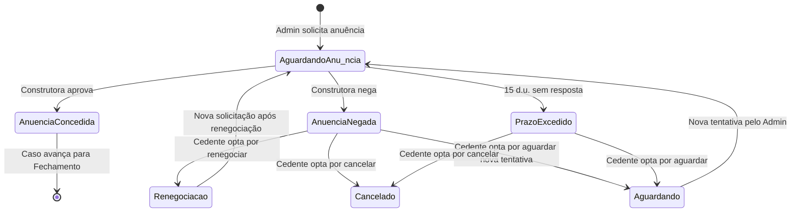

# 🔧 Regras de Negócio — Módulo Cedente

## Parte 01.4 — Módulos Administração e Configuração

| **Campo** | **Valor** |
|---|---|
| **Destinatário** | Equipe de Produto e Engenharia |
| **Escopo** | Assistente IA (Guardião do Retorno) · Anuência da construtora · Cedente PJ · Inadimplência na anuência · Edge cases administrativos |
| **Módulo** | Cedente |
| **Parte** | Parte 4 de 5 — Módulos Administração e Configuração |
| **Versão** | v1.1 |
| **Responsável** | Claude Code Desktop |
| **Data da versão** | 2026-03-22 (America/Fortaleza) |
| **Continuidade** | RN-057 (Parte 01.3) |
| **Origem do arquivo de entrada** | 01 - Regras de Negócio.md |

---

> 📌 **TL;DR**
>
> Este arquivo cobre os módulos usados para configurar, monitorar e administrar aspectos específicos do Módulo Cedente: o comportamento e os limites do Guardião do Retorno (agente IA), o processo de anuência da construtora (com todos os cenários de negativa e inadimplência), as regras específicas para Cedentes pessoa jurídica e os edge cases relacionados à interação entre proposta e escalonamento enfileirado. As RNs cobertas são **RN-058 a RN-079**.

---

## 🎯 1. Objetivo dos Módulos de Administração

Os módulos desta parte não geram receita diretamente nem sustentam o fluxo operacional básico — mas sua remoção quebraria a gestão e o monitoramento do produto: sem Guardião do Retorno, o Cedente perde suporte 24h e o cadastro assistido; sem a lógica de anuência, o Fechamento não tem pré-requisito correto; sem as regras PJ, empresas não podem usar a plataforma; sem os edge cases de inadimplência, casos ficam presos sem fluxo de saída.

---

## 🔧 2. Módulo: Assistente IA (Guardião do Retorno)

**Objetivo:** Oferecer ao Cedente um assistente inteligente disponível 24 horas para: simular cenários, tirar dúvidas sobre o processo, auxiliar no cadastro, explicar status do caso, orientar sobre documentos e oferecer educação financeira contextualizada.

**Atores:** Cedente (usuário do chat), Guardião do Retorno (agente IA), Admin (supervisão e takeover), Sistema (fornece contexto dos casos ao agente).

**Objeto principal:** Conversa (histórico de interações vinculado ao Cedente).

**O que o Guardião PODE fazer:**

| **Capacidade** | **Descrição** |
|---|---|
| Simular cenários | Calcula retorno em cada cenário com valores personalizados em tempo real. |
| Explicar status | Informa o status atual do caso com contexto e próximos passos. |
| Orientar sobre documentos | Explica quais documentos são necessários e como obtê-los. |
| Comparar escalonamento | Apresenta diferença financeira entre cenário atual e cenário inferior. |
| Responder FAQ | Responde dúvidas sobre cessão, distrato, Lei 13.786, comissão e processo. |
| Cadastro assistido | Preenche campos do wizard com base em respostas do Cedente. |
| Sugerir escalonamento | Quando caso está sem proposta por tempo prolongado, sugere ajuste de cenário. |
| Notificar proativamente | Alerta sobre mudanças de status e prazos relevantes. |
| Escalar para humano | Registra e encaminha ao Admin dúvidas que não consegue responder. |

**O que o Guardião NÃO PODE fazer:**

| **Restrição** | **Motivo** |
|---|---|
| Acessar ou revelar dados de Cessionários | Isolamento total entre partes (RN-011, Parte 01.1). |
| Garantir resultados financeiros ou prazos | Risco jurídico e de expectativa frustrada. |
| Executar ações operacionais (aprovar, cancelar, fechar) | O Guardião orienta; o Cedente e o Admin executam. |
| Oferecer consultoria jurídica vinculante | Fora do escopo e sujeito a regulação específica. |
| Alterar dados do caso ou do perfil | Proteção de integridade dos dados. |

---

**RN-058: Contexto do caso disponível ao Guardião do Retorno**

> Origem: IA-C01, CED-11

1. O Cedente abre o chat do Assistente IA. Na primeira abertura do chat, o Guardião envia mensagem proativa: "Olá, [nome]! Sou o Guardião do Retorno, seu assistente 24h. Posso te ajudar com: simular cenários, explicar o processo, orientar sobre documentos. Como posso ajudar?" com sugestões de perguntas como botões clicáveis (ex: "Qual o status do meu caso?", "Simular cenários", "Como enviar documentos"). [CORRIGIDO: PROBLEMA-043] [DECISÃO APLICADA: DEC-018]
2. O sistema fornece automaticamente ao Guardião do Retorno o contexto dos casos do Cedente logado: status atual, cenário, documentos pendentes, propostas ativas e histórico de eventos.
3. **O Guardião responde com contexto específico do caso**, não com respostas genéricas. Exemplo: "Seu caso 'Apartamento Aurora' está em análise desde ontem. Os analistas têm prazo de 3 dias úteis. Seus 6 documentos foram enviados com sucesso."
4. **O Guardião nunca acessa** dados de outros Cedentes, de Cessionários ou de operações internas do Admin.
5. **Consequência se violada:** Guardião respondendo com dados de outros usuários — falha grave de privacidade e confiança.

---

**RN-059: Tom empático e linguagem acessível**

> Origem: IA-C02

1. O Cedente envia qualquer mensagem ao Guardião do Retorno.
2. O Guardião responde sempre com: tom calmo e empático, frases curtas, vocabulário acessível e sem jargões.
3. **O Guardião reconhece o momento emocional do Cedente:** especialmente quando o usuário expressa pressão financeira, frustração ou dúvida sobre o processo.
4. **Exemplos de tom correto:** "Entendo que a espera pode ser difícil. Seu caso está em análise e o prazo estimado é de 3 dias úteis." — e não: "O status do seu record está em triagem com SLA de 72 horas."
5. **Consequência se violada:** Respostas frias ou técnicas em momento de ansiedade afastam o Cedente da plataforma.

---

**RN-060: Proibição de garantias de resultado pelo Guardião**

> Origem: IA-C03

1. O Cedente pergunta ao Guardião: "Quando vou receber uma proposta?" ou "Quanto vou receber?"
2. O Guardião verifica que não pode garantir prazo, valor ou resultado financeiro.
3. **O Guardião responde usando termos de estimativa:** "Com base no cenário C e no perfil do seu imóvel, é provável que propostas comecem a aparecer em algumas semanas — mas não posso garantir um prazo exato."
4. **O Guardião nunca diz:** "Você vai receber propostas em [X] dias" ou "Você vai receber R$ [X]".
5. **Consequência se violada:** Garantia falsa de resultado gera expectativa frustrada e possível responsabilidade jurídica da plataforma.

---

**RN-061: Escalação para humano quando o Guardião não consegue responder**

> Origem: IA-C04

1. O Cedente faz uma pergunta que o Guardião do Retorno não consegue responder com confiança suficiente, ou o Cedente pede explicitamente para falar com um humano.
2. O Guardião reconhece o limite e responde: "Não tenho informação suficiente para responder com precisão. Posso encaminhar sua dúvida para nossa equipe. Deseja que eu faça isso?"
3. **Se o Cedente confirmar:** o sistema registra a pergunta, o contexto da conversa e cria uma solicitação no Admin para atendimento.
4. **O Cedente recebe confirmação:** "Sua dúvida foi encaminhada para nossa equipe. Prazo estimado de resposta: 1 dia útil. Você receberá a resposta por e-mail." Se dentro do horário comercial (8h-18h, segunda a sexta): "Nossa equipe foi notificada e responderá em até 4 horas." [CORRIGIDO: PROBLEMA-044]
5. **Consequência se violada:** Guardião respondendo com informação incorreta em vez de escalar gera desinformação e perda de confiança.

---

**RN-062: Histórico de conversas acessível ao Cedente**

> Origem: IA-C05

1. O Cedente acessa o menu "Assistente IA" em qualquer sessão.
2. O sistema exibe o histórico completo de conversas anteriores, organizadas por data.
3. **O Cedente pode rolar o histórico** e ver todas as perguntas e respostas anteriores.
4. **O histórico é imutável:** nenhuma das partes pode deletar mensagens. [DECISÃO AUTÔNOMA — histórico permanente, pois pode ser consultado pelo Admin em caso de disputa ou supervisão do agente. Alternativa descartada: histórico de 90 dias — criaria lacunas de referência.]
5. **Consequência se violada:** Sem histórico, o Cedente não consegue retomar contexto de conversas anteriores e precisa repetir informações ao Guardião.

---

**RN-063: Supervisão e takeover pelo Admin**

> Origem: CED-11 (seção Supervisão pelo Admin)

1. O Admin monitora as interações do Guardião do Retorno via painel de supervisão (módulo Admin).
2. O sistema registra nível de confiança de cada resposta do Guardião.
3. **Se o Guardião operar abaixo do limiar de confiança configurado pelo Admin:** o sistema sinaliza para o Admin que a conversa requer atenção.
4. **O Admin pode assumir o controle da conversa (takeover):** o Cedente recebe notificação de que um atendente humano assumiu o chat.
5. Ao ocorrer takeover, o sistema exibe mensagem de transição: "Um especialista da nossa equipe está agora no chat para melhor atendê-lo." O tom de atendimento é mantido neutro e acessível em ambas as fases. [CORRIGIDO: PROBLEMA-045]
6. **Consequência se violada:** Guardião operando com baixa confiança sem supervisão pode fornecer orientações incorretas ao Cedente.

---

## 🔧 3. Módulo: Anuência da Construtora (Perspectiva do Cedente)

**Objetivo:** Informar o Cedente sobre o processo de anuência e definir o que acontece em cada cenário: anuência concedida, negada, pendente além do prazo e negada por inadimplência.

**Atores:** Cedente (acompanha e decide sobre opções), Admin (solicita anuência e comunica resultado), Construtora (decide sobre a anuência), Sistema (notifica e controla prazos).

**Objeto principal:** Caso (no estado "Em formalização").

**Estados possíveis da anuência:**

---

**RN-064: Acompanhamento da anuência pelo Cedente**

> Origem: CED-13

1. O caso está em "Em formalização" e o Admin solicita anuência à construtora.
2. O sistema exibe no painel do caso o status atual da anuência: "Aguardando resposta da construtora. Prazo estimado: 15 dias úteis."
3. **O Cedente não solicita a anuência diretamente** — essa é uma ação exclusiva do Admin.
4. **O Guardião do Retorno** pode explicar ao Cedente o que é anuência e o que esperar do processo quando consultado.
5. **Consequência se violada:** Cedente sem visibilidade do processo de anuência gera ansiedade e excesso de contato com o suporte.

---

**RN-065: Anuência concedida — avanço automático**

> Origem: CED-13

1. A construtora concede a anuência e o Admin registra o resultado.
2. O sistema notifica o Cedente: "A construtora autorizou a transferência. Estamos prosseguindo com a formalização."
3. O caso avança normalmente para o Fechamento (assinatura do Termo Comercial e Instrumento de Cessão).
4. **Efeito no estado:** "Em formalização" avança para a etapa de assinaturas finais → "Negócio fechado".
5. **Consequência se violada:** Sem notificação de anuência concedida, o Cedente não sabe que precisa assinar documentos finais.

---

**RN-066: Anuência negada — opções para o Cedente**

> Origem: CED-13

1. A construtora nega a anuência e o Admin registra o motivo.
2. O sistema muda o caso para "Pendência identificada" e notifica o Cedente com mensagem específica: "A construtora não autorizou a transferência neste momento. Motivo: [motivo informado pela construtora]. Nossa equipe está analisando as alternativas."
3. **O Admin apresenta ao Cedente 3 opções como cards clicáveis no painel**, cada um com descrição curta do que implica:
   - 3.1 Renegociação com a construtora (Admin conduz nova tentativa).
   - 3.2 Cancelamento do caso com estorno integral da Conta Escrow (se houver depósito).
   - 3.3 Aguardar nova tentativa em prazo a ser definido pelo Admin.
4. **O Cedente tem 10 dias úteis para escolher** uma opção pelo painel. Após 10 dias sem escolha: lembrete automático. Sem cancelamento automático por inação. [CORRIGIDO: PROBLEMA-046]
5. **Se o Cedente cancelar com depósito ativo na Conta Escrow:** estorno integral processado em até 5 dias úteis.
6. **Consequência se violada:** Cedente sem opções claras após negativa de anuência fica paralisado, com depósito na Escrow sem resolução.

---

**RN-067: Anuência pendente além de 15 dias úteis**

> Origem: CED-13

1. O Admin solicitou anuência à construtora e 15 dias úteis se passaram sem resposta.
2. O sistema gera alerta para o Admin e o Admin notifica o Cedente: "Ainda aguardamos a resposta da construtora. Prazo estimado adicional: [X] dias úteis."
3. **O Cedente pode optar por cancelar o caso** a qualquer momento durante a espera, usando o fluxo padrão de cancelamento (RN-055, Parte 01.3).
4. **O Cedente pode optar por aguardar** — nesse caso, o caso permanece em "Em formalização" até a resposta da construtora.
5. **Não há cancelamento automático** por prazo excedido na anuência — a decisão é sempre do Cedente.
6. **Consequência se violada:** Cedente bloqueado indefinidamente sem poder cancelar — com depósito na Escrow parado sem previsão.

---

**RN-068: Anuência não obrigatória em contratos com cessão livre**

> Origem: CED-13 (Exceções)

1. O Admin analisa o contrato do Cedente durante a triagem e identifica que a cláusula permite cessão livre (sem necessidade de autorização da construtora).
2. O sistema registra a classificação "Cessão livre" no dossiê do caso.
3. **Na fase de formalização:** o caso avança diretamente para assinaturas finais sem aguardar anuência da construtora.
4. **O Cedente é informado:** "Seu contrato permite a transferência sem necessidade de autorização da construtora. Estamos prosseguindo diretamente com a formalização."
5. **Consequência se violada:** Solicitar anuência desnecessária atrasa o Fechamento em até 15 dias úteis sem razão.

---

## 🔧 4. Módulo: Cedente Pessoa Jurídica (PJ)

**Objetivo:** Permitir que empresas (CNPJ) cadastrem imóveis para repasse na plataforma, seguindo o mesmo fluxo do Cedente pessoa física com campos e documentos adicionais.

**Atores:** Representante Legal da empresa (executa ações pelo Cedente PJ), Admin (verifica documentos adicionais), Sistema (valida CNPJ via Receita Federal).

**Objeto principal:** Conta Cedente PJ (vinculada a CNPJ).

---

**RN-069: Cadastro de Cedente pessoa jurídica**

> Origem: EC-01

1. O usuário acessa o formulário de cadastro e seleciona "Pessoa Jurídica".
2. O sistema exibe campos adicionais obrigatórios: Razão Social, Nome Fantasia (opcional), CNPJ, Nome do Representante Legal e CPF do Representante Legal.
3. **O sistema valida o CNPJ** via consulta automática à Receita Federal no momento do preenchimento.
4. **Se o CNPJ está ativo e regular:** o campo exibe indicador verde e o sistema preenche automaticamente Razão Social, Nome Fantasia e badge "Ativa". Campos preenchidos automaticamente são editáveis exceto CNPJ. O cadastro prossegue normalmente (seguindo o fluxo da RN-001, Parte 01.1, com os campos adicionais PJ). [CORRIGIDO: PROBLEMA-050]
5. **Se o CNPJ está com situação "Inapta", "Suspensa" ou "Baixada":** o sistema rejeita e exibe: "O CNPJ informado está com situação irregular na Receita Federal. Regularize a situação e tente novamente."
6. **Exceção — MEI:** Microempreendedores Individuais seguem o fluxo PJ, mas sem exigência de Contrato Social. Documento exigido é o CCMEI (Certificado de Condição de Microempreendedor Individual).
7. **Efeito no estado:** A conta é criada com identificação PJ visível no painel (exibe Razão Social em vez de nome pessoal).
8. **Consequência se violada:** Empresa em situação irregular opera na plataforma — risco jurídico e de fraude.

---

**RN-070: Dossiê ampliado para Cedente PJ — 8 documentos**

> Origem: EC-02

1. O caso é criado por um Cedente PJ.
2. O sistema detecta automaticamente que o Cedente é pessoa jurídica e exibe o checklist de 8 documentos (em vez dos 6 padrão para pessoa física).
3. **Os 2 documentos adicionais são:**
   - 7. Contrato Social atualizado ou CCMEI (para MEI).
   - 8. Documento de identidade do Representante Legal (RG ou CNH).
4. **O caso só muda de "Cadastro realizado" para "Em análise"** quando todos os 8 documentos estiverem enviados e o Termo de Cadastro estiver assinado.
5. **Não existe checklist intermediário** (ex: avançar com 6 de 8 documentos).
6. **Consequência se violada:** Dossiê PJ sem documentos de representação legal não tem validade jurídica para formalizar a cessão em nome da empresa.

---

**RN-071: Assinaturas por Representante Legal no contexto PJ**

> Origem: EC-03

1. Um documento é disponibilizado para assinatura de um Cedente PJ.
2. O sistema envia o envelope ZapSign para o e-mail do Representante Legal cadastrado no perfil da empresa.
3. **O sistema registra o CPF, nome e cargo do signatário.** O CPF do signatário deve coincidir com o CPF do Representante Legal cadastrado.
4. **Se o signatário for procurador** (e não o representante legal direto): a procuração com poderes específicos para cessão deve constar no dossiê como documento verificado. Sem ela, o envelope não é enviado ao procurador.
5. **Efeito no estado:** Mesmo fluxo de assinatura da RN-047 (Parte 01.3), com verificação adicional de identidade do signatário.
6. **Consequência se violada:** Documento assinado por pessoa sem poderes representativos pode ser contestado judicialmente.

---

**RN-072: Financeiro para Cedente PJ — conta bancária vinculada ao CNPJ**

> Origem: EC-04

1. O Cedente PJ chega ao Fechamento e a distribuição Escrow é processada.
2. O sistema verifica que a conta bancária informada para recebimento é de titularidade do CNPJ cadastrado.
3. **Se a conta bancária corresponde ao CNPJ:** o valor líquido é depositado normalmente.
4. **Se a conta bancária não é de titularidade do CNPJ:** [DECISÃO AUTÔNOMA — o sistema bloqueia a distribuição e o Admin é notificado para regularizar a conta bancária. Alternativa descartada: permitir conta de terceiro com justificativa — risco de desvio e lavagem de dinheiro.] O painel Financeiro do Cedente PJ exibe: "A distribuição está pendente. A conta bancária informada não corresponde ao CNPJ cadastrado. Entre em contato com o suporte para atualizar seus dados bancários." com botão "Falar com suporte". [CORRIGIDO: PROBLEMA-049]
5. **O painel Financeiro do Cedente PJ** exibe campos adicionais: "Razão Social" e "CNPJ" em substituição ao nome pessoal.
6. **O cálculo de comissão é idêntico** ao da pessoa física (RN-037, Parte 01.2).
7. **Consequência se violada:** Distribuição para conta não vinculada ao CNPJ cria risco tributário, contábil e de conformidade regulatória.

---

## 🔧 5. Edge Case: Inadimplência Detectada durante Anuência

**Contexto:** A construtora, ao analisar a solicitação de anuência, detecta que o Cedente possui parcelas em atraso e nega a anuência por este motivo específico. Este cenário exige fluxo próprio, separado da negativa por outros motivos.

---

**RN-073: Detecção de inadimplência durante o processo de anuência**

> Origem: EC-12

1. A construtora nega a anuência com motivo explícito: inadimplência do Cedente (parcelas em atraso).
2. O Admin registra o motivo e muda o caso para "Pendência identificada".
3. O sistema notifica o Cedente com mensagem específica: "A construtora informou que há parcelas em atraso no seu contrato. Regularize a situação para prosseguir. Nossa equipe está disponível para orientá-lo."
4. O Cedente recebe também: número de parcelas em atraso (se informado pela construtora) e prazo para regularização (RN-074).
5. **O Guardião do Retorno** é ativado para orientar o Cedente sobre como regularizar a inadimplência e o que esperar do processo.
6. **Consequência se violada:** Cedente sem informação clara sobre a inadimplência não sabe como resolver e o caso fica travado indefinidamente.

---

**RN-074: Prazo de 15 dias úteis para regularização de inadimplência**

> Origem: EC-13

1. O Cedente é notificado sobre inadimplência detectada na anuência (RN-073).
2. O sistema inicia um contador de 15 dias úteis visível no painel do caso com: (a) data-alvo ("Prazo até [data]"), (b) dias restantes ("Faltam [X] dias úteis"), (c) barra de progresso horizontal. Cores: verde >10 dias, amarelo 5-10 dias, vermelho <5 dias. [CORRIGIDO: PROBLEMA-047]
3. **O sistema envia lembretes ao Cedente** nos dias 5 e 10 do prazo.
4. **Para comprovar a regularização:** o Cedente faz upload do comprovante de quitação das parcelas em atraso via menu Documentos (campo adicional ativado pelo sistema para este fim).
5. **Após upload do comprovante:** o Admin verifica e, se aprovado, reenvia a solicitação de anuência à construtora.
6. **O Cedente pode cancelar o caso** a qualquer momento durante o prazo de regularização, usando o fluxo padrão (RN-055, Parte 01.3).
7. **Consequência se violada:** Prazo indefinido para regularização mantém o depósito do Cessionário na Escrow bloqueado sem previsão.

---

**RN-075: Inadimplência não regularizada no prazo — opções do Cedente**

> Origem: EC-14

1. O prazo de 15 dias úteis para regularização expira sem upload de comprovante pelo Cedente.
2. O sistema notifica o Cedente: "O prazo para regularização expirou. Escolha uma das opções abaixo para prosseguir."
3. **O Admin apresenta 2 opções:**
   - 3.1 Cancelar o caso com estorno integral da Conta Escrow (processado em até 3 dias úteis — prazo prioritário por inadimplência, conforme RN-076).
   - 3.2 Extensão de prazo por mais 10 dias úteis (apenas uma vez).
4. **Se o Cedente escolher extensão:** novo prazo de 10 dias úteis começa. Total acumulado: 25 dias úteis desde a notificação. O sistema exibe: "Prazo estendido por mais 10 dias úteis. Esta é sua única extensão disponível. Se o prazo encerrar sem regularização, o caso será cancelado automaticamente com estorno ao comprador." [CORRIGIDO: PROBLEMA-048]
5. **Se a extensão também expirar sem regularização:** cancelamento automático é processado com estorno prioritário ao Cessionário.
6. **Efeito no estado:** "Pendência identificada" → "Cancelado" (com estorno).
7. **Consequência se violada:** Sem mecanismo de saída, o depósito do Cessionário fica bloqueado indefinidamente na Escrow.

---

**RN-076: Estorno prioritário por inadimplência não regularizada**

> Origem: EC-15

1. O caso é cancelado por inadimplência não regularizada (RN-075) com depósito ativo na Conta Escrow.
2. O sistema inicia o processo de estorno com prioridade máxima.
3. **O estorno é processado em até 3 dias úteis** (em vez do prazo padrão de 5 dias úteis para cancelamentos normais).
4. O Cedente recebe notificação: "Seu caso foi cancelado. O valor depositado pelo comprador será devolvido integralmente em até 3 dias úteis."
5. **O Cessionário é notificado** pelo Admin sobre o estorno e o motivo (inadimplência do Cedente — sem detalhes pessoais adicionais).
6. **Consequência se violada:** Cessionário aguarda mais do que o necessário para recuperar o valor depositado — risco de conflito e contestação.

---

**RN-077: Reativação do caso após regularização tardia**

> Origem: EC-16

1. O Cedente regularizou a inadimplência após o cancelamento do caso por EC-14/EC-15.
2. O Cedente acessa "Meus Casos" e verifica que o caso anterior está "Cancelado".
3. **O sistema permite novo cadastro do mesmo imóvel** (a regra RN-019, Parte 01.1, permite cadastro novo quando o caso anterior está "Cancelado").
4. **O novo caso começa do zero:** sem herdar histórico de propostas, negociação ou valores do caso anterior.
5. **O Guardião do Retorno** pode sugerir o mesmo cenário anterior ou cenário inferior, com base no histórico disponível.
6. **Se o mesmo Cessionário ainda tiver interesse:** o Admin pode facilitar a reconexão (fluxo Admin — fora do escopo deste documento).
7. **Consequência se violada:** Cedente "banido" por inadimplência — prejudica a retenção e vai contra o princípio de plataforma acolhedora.

---

## 🔧 6. Edge Case: Proposta Durante Escalonamento Enfileirado

**Contexto:** O Cedente solicita escalonamento enquanto há proposta ativa em negociação. O escalonamento é enfileirado (aguarda a conclusão da negociação). Enquanto está na fila, uma nova proposta pode chegar.

---

**RN-078: Nova proposta cancela escalonamento enfileirado automaticamente**

> Origem: EC-09, EC-10

1. O Cedente tem um escalonamento enfileirado (aguardando conclusão de negociação ativa) e uma nova proposta válida chega para o caso no cenário atual.
2. O sistema detecta a chegada da nova proposta e verifica que há escalonamento na fila.
3. **O sistema cancela automaticamente o escalonamento enfileirado** (que ainda não foi executado — nenhum Termo foi assinado).
4. **O sistema notifica o Cedente por e-mail e painel:** "Você recebeu uma nova proposta! O pedido de ajuste de cenário foi cancelado automaticamente para que você possa avaliar a proposta no cenário atual. Se preferir seguir com o ajuste, poderá solicitá-lo após avaliar a proposta."
5. **O histórico do caso registra:** "Escalonamento cancelado — nova proposta recebida em [data]."
6. **A nova proposta é apresentada normalmente** no painel Propostas.
7. **Consequência se violada:** Escalonamento executado durante proposta ativa poderia criar inconsistência — proposta aceita em cenário diferente do que foi apresentada.

---

**RN-079: Re-solicitação de escalonamento após proposta cancelar a fila**

> Origem: EC-11

1. O Cedente avaliou a proposta que cancelou o escalonamento (RN-078) e a recusou (ou ela expirou sem resposta).
2. O Cedente deseja re-solicitar o escalonamento que havia sido enfileirado.
3. **O botão "Alterar Cenário" é liberado imediatamente** — sem necessidade de aguardar cooldown de 7 dias (RN-027, Parte 01.2).
4. **Justificativa da exceção:** o escalonamento anterior foi cancelado pelo sistema antes de ser executado — nenhum Termo foi assinado, portanto o cooldown não se aplica. O Cedente não deve ser penalizado por uma ação cancelada pelo sistema.
5. **Novo Termo de Aceite de Escalonamento** é gerado normalmente ao confirmar.
6. **Exceção:** se o Cedente aceitou a proposta (em vez de recusar), o escalonamento não faz sentido — o caso avança para formalização no cenário atual.
7. **Consequência se violada:** Cedente penalizado com cooldown injusto por escalonamento que não executou — gera insatisfação e contato desnecessário com suporte.

---

## 📌 7. Tabela de SLAs desta Parte

| **Evento** | **SLA** | **Consequência do não cumprimento** |
|---|---|---|
| Consulta CNPJ na Receita Federal (validação) | Imediata (no ato do preenchimento) | Cadastro PJ travado até conexão disponível. |
| Anuência da construtora (prazo esperado) | 15 dias úteis | Admin notifica Cedente com prazo adicional; Cedente pode cancelar. |
| Prazo para regularização de inadimplência | 15 dias úteis | Opções: cancelamento ou extensão de 10 dias úteis (uma vez). |
| Lembretes durante prazo de regularização | Dias 5 e 10 do prazo | Cedente não lembrado a tempo. |
| Extensão de prazo por inadimplência | 10 dias úteis adicionais (uma vez) | Cancelamento automático com estorno prioritário. |
| Estorno prioritário por inadimplência | Até 3 dias úteis | Cessionário aguarda mais do necessário. |
| Cooldown entre escalonamentos | 7 dias corridos (não se aplica a escalonamento cancelado pelo sistema) | Botão bloqueado sem motivo legítimo se regra for violada. |

---

## 🔴 8. Edge Cases desta Parte

| **Situação** | **Comportamento esperado** | **Referência** |
|---|---|---|
| Cedente PJ tem o Representante Legal substituído após assinatura do Termo de Cadastro | [DEFINIÇÃO PENDENTE — opção A: novo Representante assina todos os documentos futuros sem necessidade de revalidar documentos já assinados. Opção B: todos os documentos são refeitos. Recomendação: opção A, pois documentos já assinados têm validade própria.] | RN-071 |
| Construtora nega anuência mas não informa motivo | O Admin registra "Motivo não informado pela construtora" e apresenta as mesmas opções ao Cedente (renegociar, cancelar, aguardar). | RN-066 |
| Cedente PJ entra em processo de recuperação judicial após o cadastro | [DEFINIÇÃO PENDENTE — opção A: caso é bloqueado até regularização da situação jurídica da empresa. Opção B: processo continua com autorização judicial. Recomendação: consultar assessoria jurídica.] | RN-069 |
| Guardião responde pergunta jurídica específica (ex: "A construtora pode negar a cessão?") | Guardião responde com informação educativa geral ("Contratos geralmente preveem...") sem se posicionar sobre o caso específico e oferece escalar para o Admin. | RN-060, RN-061 |

---

*Parte 4 de 5 — Continuidade: RN-080 (Parte 01.5)*
