# Repasse Seguro — Módulo Cedente
## 06 - Mapa de Telas

| **Campo** | **Valor** |
|---|---|
| **Destinatário** | Produto, UX e frontend |
| **Escopo** | Inventário completo de telas, navegação, estados visuais e mapeamento de componentes |
| **Versão** | v1.1 |
| **Responsável** | Claude Code Desktop |
| **Data da versão** | 2026-03-22 12:00 (America/Fortaleza) |
| **Módulo** | Cedente |

---

> 📌 **TL;DR**
>
> - **52 telas mapeadas** (T-001 a T-052), incluindo 14 modais/overlays com lógica própria.
> - **12 módulos cobertos**: Autenticação, Perfil, Dashboard, Meus Casos, Cadastro de Imóvel, Cenários/Escalonamento, Propostas, Documentos, Assinaturas, Financeiro, Assistente IA (Guardião), Notificações/Configurações.
> - **Plataformas**: Web (Next.js 15, App Router) + Mobile (React Native / Expo SDK 52). Mobile cobre upload por câmera, assinatura ZapSign touch e resposta a propostas (RN-087).
> - **Padrão de navegação web**: sidebar fixa com 9 itens; área logada em route group `(authenticated)/`. Mobile: bottom tab bar com 5 itens principais.
> - **Responsividade**: Mobile-first. Breakpoints: < 768px (mobile), 768px–1024px (tablet), > 1024px (desktop). Sidebar colapsa em drawer em tablet e mobile.
> - **Componentes reutilizáveis identificados**: 12 componentes de alto uso (StatusBadge, DocumentCard, ProposalCard, Countdown, EscrowPanel, GuardiaoChat, NotificationBell, CaseCard, Stepper, FinancialSummary, SignatureInline, UploadZone).
> - **0 seções críticas pendentes** — cobertura 100% dos módulos do PRD.
> - **Auditoria UX B04 aplicada** (v1.1): 25 problemas corrigidos, 7 decisões autônomas. Completude de descrição, estados, responsividade e a11y enriquecidos em todas as telas.

---

## ⚙️ 1. Inventário Completo de Telas

### 1.1 Autenticação (Área Pública)

| ID | Nome da Tela | Descrição | Aplicação | Plataforma | Módulo | Fase | RF relacionado |
|---|---|---|---|---|---|---|---|
| T-001 | Login | Formulário de acesso: campo e-mail* (type="email", placeholder "seu@email.com"), campo senha* (type="password", placeholder "••••••••", toggle "mostrar/ocultar" com ícone 44×44px), botão "Entrar" (primário, largura total), link "Esqueci minha senha" (abaixo do campo senha), link "Criar conta" (rodapé). Ação primária: submit. Estado de loading: botão desabilitado + skeleton substituindo label por spinner 16px. Erro de credenciais: banner vermelho inline "E-mail ou senha incorretos." Erro de e-mail não confirmado: banner âmbar "Confirme seu e-mail antes de acessar." + link "Reenviar confirmação". Contagem de falhas exibida a partir da 3ª tentativa: "X de 5 tentativas. Após 5, sua conta será bloqueada por 15 minutos." Mobile: layout idêntico ao web, campo senha com teclado seguro. [CORRIGIDO: PROBLEMA-001, PROBLEMA-002] | Cedente | Web, Mobile | Autenticação | 1 | RF-007, RF-008, RF-010 |
| T-002 | Cadastro | Formulário de nova conta. Campos obrigatórios*: tipo de pessoa (toggle "Pessoa Física / Pessoa Jurídica" — PF default), nome completo* (text, max 100 chars, placeholder "Seu nome completo"), CPF* se PF / CNPJ* se PJ (text masked, validação de dígitos verificadores inline), e-mail* (type="email", placeholder "seu@email.com"), confirmar e-mail* (type="email", validação de correspondência), telefone* (text masked, formato (XX) XXXXX-XXXX), senha* (type="password", min 8 chars, requisitos: ao menos 1 maiúscula, 1 número, 1 especial — exibir checklist de força em tempo real), confirmar senha* (type="password", validação de correspondência). Toggle PF/PJ reorganiza campos dinamicamente: PJ substitui CPF por CNPJ e adiciona campo "Razão Social*". Validação: inline on-blur com borda vermelha + mensagem específica abaixo do campo. Botão "Criar conta" (primário): habilitado apenas quando todos os campos válidos. Link "Já tenho conta" no rodapé. Loading: botão desabilitado + label "Criando conta...". Sucesso: navega para T-003. Erro de e-mail já cadastrado: mensagem inline "Este e-mail já está cadastrado." + link "Entrar". [CORRIGIDO: PROBLEMA-001, PROBLEMA-002, PROBLEMA-003] | Cedente | Web | Autenticação | 1 | RF-001, RF-002 |
| T-003 | E-mail de ativação pendente | Tela intermediária após cadastro: ícone de envelope 64px (ilustrativo, `aria-hidden="true"`), título "Confirme seu e-mail", instrução "Enviamos um link para [email mascarado]. Clique no link para ativar sua conta.", botão secundário "Reenviar e-mail" com cooldown 60s (contador regressivo visível "Reenviar em Xs" durante cooldown, habilitado após esgotamento), link "Alterar e-mail" (abre campo inline de edição). Estado de loading do reenvio: botão desabilitado + label "Enviando...". Sucesso do reenvio: toast verde "E-mail reenviado com sucesso!" (3s). Erro de reenvio: toast vermelho "Não foi possível reenviar. Tente novamente." Offline: botão de reenvio desabilitado + tooltip "Sem conexão". [CORRIGIDO: PROBLEMA-001, PROBLEMA-004] | Cedente | Web | Autenticação | 1 | RF-003, RF-004, RF-005 |
| T-004 | Ativação de conta — sucesso | Tela de sucesso após clique no link de ativação: ícone checkmark verde 64px animado (scale spring `--ease-spring`, 300ms), título "Conta ativada com sucesso!", subtítulo "Você será redirecionado para a plataforma em 3 segundos.", contador regressivo visual (3...2...1), botão "Ir agora" (primário) para quem não quiser esperar. Redireciona automaticamente para T-013 após 3s. Sem loading state (ação instantânea). [CORRIGIDO: PROBLEMA-001] | Cedente | Web | Autenticação | 1 | RF-003 |
| T-005 | Link de ativação expirado | Tela de erro: ícone de aviso âmbar 64px, título "Link expirado", mensagem "O link de ativação expirou. Links são válidos por 24 horas.", botão "Solicitar novo link" (primário) — ao clicar: estado loading "Enviando..." → sucesso com toast verde "Novo link enviado para [email mascarado]." → retorna ao estado inicial do botão. Erro: toast vermelho "Não foi possível enviar. Tente novamente." [CORRIGIDO: PROBLEMA-001, PROBLEMA-004] | Cedente | Web | Autenticação | 1 | RF-004 |
| T-006 | Recuperação de senha — solicitação | Formulário com campo e-mail* (type="email", placeholder "seu@email.com"), botão "Enviar link de recuperação" (primário, largura total). Loading: botão desabilitado + label "Enviando...". Sucesso: navega para T-007. Erro de e-mail não encontrado: mensagem inline âmbar "Se este e-mail estiver cadastrado, você receberá o link em breve." (não revela se o e-mail existe — segurança). Erro genérico: toast vermelho + retry. Link "Voltar para o login" no rodapé. [CORRIGIDO: PROBLEMA-001] | Cedente | Web | Autenticação | 1 | RF-006 |
| T-007 | Recuperação de senha — confirmação | Tela estática de confirmação: ícone de envelope 64px, título "Verifique sua caixa de entrada", instrução "Enviamos um link de recuperação para o seu e-mail. O link é válido por 1 hora.", botão "Reenviar e-mail" (secundário, com cooldown 60s idêntico ao T-003), link "Voltar para o login". Sem estado de loading relevante (página estática pós-ação). [CORRIGIDO: PROBLEMA-001] | Cedente | Web | Autenticação | 1 | RF-006 |
| T-008 | Redefinição de senha | Formulário acessado via link por e-mail (token na URL validado no backend). Campos: nova senha* (type="password", min 8 chars, checklist de força igual ao T-002), confirmar nova senha* (validação de correspondência). Botão "Redefinir senha" (primário): habilitado apenas quando ambos os campos válidos e correspondentes. Loading: botão desabilitado + label "Redefinindo...". Sucesso: toast verde "Senha redefinida com sucesso!" + redirecionamento para T-001 após 2s. Token inválido ou expirado: exibe mensagem de erro fullscreen "Este link de redefinição expirou ou já foi usado." + botão "Solicitar novo link" que navega para T-006. [CORRIGIDO: PROBLEMA-001, PROBLEMA-003] | Cedente | Web | Autenticação | 1 | RF-006 |
| T-009 | Conta bloqueada temporariamente | Layout de bloqueio: ícone de cadeado vermelho 64px, título "Conta bloqueada temporariamente", mensagem "Você excedeu o número máximo de tentativas. Tente novamente após:", Countdown por hora e minuto (ex: "14:58"), horário exato de liberação em texto secundário ("Liberado às HH:MM"). Countdown usa componente Countdown com atualização a cada segundo. Botão "Voltar para o login" (secundário, desabilitado enquanto contador ativo, habilitado ao zerar). Mobile: layout idêntico, sem adaptações específicas. [CORRIGIDO: PROBLEMA-001] | Cedente | Web, Mobile | Autenticação | 1 | RF-007 |
| T-010 | Modal de expiração de sessão | Modal overlay (`role="dialog"`, `aria-modal="true"`, focus trap obrigatório). Título "Sua sessão está prestes a expirar", mensagem "Por segurança, sua sessão encerrará em:", contador regressivo 5min→0 (atualização a cada segundo), botão "Continuar sessão" (primário, 44px mínimo), botão "Encerrar agora" (secundário, destrutivo). Ao clicar "Continuar": modal fecha com fade-out 150ms, sessão renovada, toast discreto "Sessão renovada." Ao zerar contador ou clicar "Encerrar agora": modal fecha, sessão encerrada, redirecionamento para T-001 com toast âmbar "Sua sessão expirou. Faça login novamente." Focus inicial no botão "Continuar sessão". ESC fecha o modal como "Encerrar agora". [CORRIGIDO: PROBLEMA-001, PROBLEMA-019] [DECISÃO APLICADA: DEC-001] | Cedente | Web, Mobile | Autenticação | 1 | RF-009 |

### 1.2 Área Logada — Estrutura Global

| ID | Nome da Tela | Descrição | Aplicação | Plataforma | Módulo | Fase | RF relacionado |
|---|---|---|---|---|---|---|---|
| T-011 | Shell da área logada — Sidebar | Layout base web: sidebar fixa à esquerda (largura 240px expandida / 64px colapsada). 9 itens de navegação: Dashboard, Meus Casos, Cadastrar Imóvel, Documentos, Propostas, Assinaturas, Financeiro, Assistente IA, Meu Perfil. Cada item: ícone 20px + label texto; item ativo com `--sidebar-primary` destacado + borda esquerda 3px. Header fixo no topo: logo Repasse Seguro à esquerda, NotificationBell com badge numérico à direita, avatar do usuário com dropdown (Ver perfil / Sair). Sidebar colapsa para drawer overlay em tablet (768–1024px) via botão hamburger 44×44px no header. Scroll do conteúdo principal independente da sidebar. Transição de colapso: `--duration-normal` (250ms) com `--ease-in-out`. Loading do shell: skeleton de 3 items na sidebar + header skeleton. Erro de carregamento do shell (raro): mensagem central "Não foi possível carregar a interface." + botão "Tentar novamente". `role="navigation"`, `aria-label="Menu principal"` na sidebar. [CORRIGIDO: PROBLEMA-005] [DECISÃO APLICADA: DEC-002] | Cedente | Web | Global | 1 | RF-016, RF-017 |
| T-012 | Shell mobile — Bottom Tab Bar | Layout base mobile: bottom tab bar fixa no rodapé (altura 60px, `safe-area-inset-bottom` respeitado para dispositivos com home indicator). 5 itens: Dashboard (ícone casa), Meus Casos (ícone pasta), Documentos (ícone documento), Propostas (ícone tag), Mais (ícone grade 2×2). Item ativo: ícone `--primary` + label bold. Items inativos: ícone `--muted-foreground` + label regular 10px. Badge numérico vermelho em Propostas e Mais quando há pendências. Toque em "Mais" abre bottom sheet com: Assistente IA, Assinaturas, Meu Perfil, divider, "Sair". Scale press 0.95 em cada item ao toque. Safe area: padding bottom para iPhone com notch. `role="tablist"`, cada tab com `role="tab"` e `aria-selected`. [CORRIGIDO: PROBLEMA-005] | Cedente | Mobile | Global | 1 | RF-120 |

### 1.3 Dashboard

| ID | Nome da Tela | Descrição | Aplicação | Plataforma | Módulo | Fase | RF relacionado |
|---|---|---|---|---|---|---|---|
| T-013 | Dashboard — com casos | Cards de resumo (casos ativos, pendências, propostas recebidas, valor líquido estimado), lista de casos ativos, próximos passos, feed de eventos | Cedente | Web, Mobile | Dashboard | 1 | RF-019, RF-021, RF-022, RF-023 |
| T-014 | Dashboard — primeiro acesso (sem casos) | Mensagem personalizada, checklist de 3 passos, CTA "Cadastrar meu primeiro imóvel" | Cedente | Web, Mobile | Dashboard | 1 | RF-020 |

### 1.4 Meus Casos

| ID | Nome da Tela | Descrição | Aplicação | Plataforma | Módulo | Fase | RF relacionado |
|---|---|---|---|---|---|---|---|
| T-015 | Lista de Casos | Todos os casos paginados (10/pág) com filtros por status e cenário, busca por nome/endereço | Cedente | Web, Mobile | Meus Casos | 1 | RF-024, RF-025 |
| T-016 | Detalhe do Caso — Visão Geral | Aba principal do detalhe do caso. Layout: cabeçalho com endereço do imóvel (título H1), StatusBadge do status atual (ex: "Em Análise"), botão de ações contextual (kebab menu 44×44px). Zona 1 — Próximo passo: card destacado com `--primary` background sutil, ícone, texto do próximo passo e CTA (ex: "Assinar Termo", "Enviar Documentos"). Zona 2 — Resumo financeiro: componente FinancialSummary com cenário escolhido, valor estimado de retorno, data estimada. Zona 3 — Linha do tempo de eventos: lista cronológica (mais recente no topo) com ícone de evento, descrição e data relativa (ex: "há 2 dias"). Desktop: layout 2 colunas (Zona 1+2 à esquerda, Zona 3 à direita). Tablet: coluna única. Mobile: coluna única, Zona 3 colapsada por padrão + "Ver histórico completo". Loading: skeleton das 3 zonas independentemente. Erro: banner "Não foi possível carregar os detalhes." + retry. Ações condicionais: botão "Cancelar Caso" visível apenas pré-Fechamento, "Solicitar Desistência" visível apenas pós-Fechamento dentro de 15 dias, "Alterar Cenário" visível quando disponível. [CORRIGIDO: PROBLEMA-006, PROBLEMA-014, PROBLEMA-015] [DECISÃO APLICADA: DEC-003] | Cedente | Web, Mobile | Meus Casos | 1 | RF-025, RF-026, RF-027 |
| T-017 | Detalhe do Caso — Documentos | Aba de dossiê dentro do detalhe do caso. Exibe checklist resumido dos documentos do caso (6 PF / 8 PJ): DocumentCard por item com status (pendente / enviado / em análise / verificado / rejeitado), botão "Enviar" ou "Reenviar" inline. Botão "Ver todos os documentos" leva para T-040 (tela dedicada). Loading: skeleton de 6 linhas. Empty state: "Nenhum documento enviado ainda." + CTA "Enviar documentos" que navega para T-040. Mobile: lista vertical com botão câmera destacado em cada item pendente. [CORRIGIDO: PROBLEMA-006] | Cedente | Web, Mobile | Meus Casos | 1 | RF-027, RF-056 |
| T-018 | Detalhe do Caso — Propostas | Aba de propostas dentro do detalhe do caso. Seção "Propostas ativas" (se houver): ProposalCard com valor, timer e ações (Aceitar / Recusar / Contraproposta). Seção "Histórico de propostas": lista de propostas encerradas com status (aceita / recusada / expirada) e data. Loading: skeleton de 2 cards. Empty state ativo: "Nenhuma proposta recebida ainda. Seu imóvel está disponível para compradores qualificados." Empty state histórico: "Nenhuma proposta anterior." [CORRIGIDO: PROBLEMA-006] | Cedente | Web, Mobile | Meus Casos | 1 | RF-027, RF-049 |
| T-019 | Detalhe do Caso — Assinaturas | Aba de assinaturas dentro do detalhe do caso. Lista de documentos para assinar com tipo, data de criação, prazo e status (pendente / assinado). Botão "Assinar" por documento (abre T-044 ZapSign Inline). Loading: skeleton de 3 linhas. Empty state: "Nenhum documento de assinatura pendente." Tela disponível apenas em web (ZapSign inline). Mobile: exibe lista somente leitura com instrução "Acesse via computador para assinar". [CORRIGIDO: PROBLEMA-006] | Cedente | Web | Meus Casos | 1 | RF-027, RF-064 |
| T-020 | Detalhe do Caso — Financeiro | Aba financeira dentro do detalhe do caso. Exibe EscrowPanel com: status da conta (pré-formalização informativo / ativo com breakdown de comissão / distribuído). Pré-formalização: somente leitura com valores estimados e CTA para simulador. Escrow ativo: valor líquido em destaque verde, breakdown colapsável de comissão, countdown dos 15 dias. Loading: skeleton do painel. Sem empty state (sempre exibe estado atual). [CORRIGIDO: PROBLEMA-006] | Cedente | Web | Meus Casos | 1 | RF-027, RF-071 |
| T-021 | Detalhe do Caso — Histórico de Eventos | Aba com linha do tempo imutável de todos os eventos do caso (auditlog). Cada evento: ícone de tipo, descrição em texto, data/hora absoluta + relativa (tooltip). Eventos imutáveis — sem ações. Scroll infinito ou paginação (50 eventos/pág). Loading: skeleton de 10 linhas. Empty state (impossível em prática, mas por robustez): "Nenhum evento registrado ainda." Offline: lista em cache com badge "Atualizado em [data/hora]". [CORRIGIDO: PROBLEMA-006] | Cedente | Web | Meus Casos | 1 | RF-027, RF-084, RF-085 |
| T-022 | Modal de Cancelamento de Caso — Simples | Modal `role="dialog"` com focus trap. Título "Cancelar caso", subtítulo com endereço do imóvel. Passo 1: dropdown "Motivo do cancelamento"* (opções: Mudei de ideia / Encontrei outra solução / Informações incorretas / Outro — se Outro, exibe textarea 20–200 chars). Botão "Continuar" (avança para confirmação). Passo 2: resumo "Você está prestes a cancelar o caso [endereço]. Esta ação é irreversível." Botão "Confirmar cancelamento" (destrutivo, vermelho `--destructive`), botão "Voltar" (secundário). Loading após confirmação: botão desabilitado + label "Cancelando...". Sucesso: modal fecha + toast verde "Caso cancelado." + caso removido da lista ativa. Erro: toast vermelho "Não foi possível cancelar. Tente novamente." Modal fecha com ESC (retorna ao Passo 1 ou fecha se no Passo 1). [CORRIGIDO: PROBLEMA-007, PROBLEMA-025] | Cedente | Web, Mobile | Cancelamento | 1 | RF-075 |
| T-023 | Modal de Cancelamento de Caso — Com Escrow | Modal `role="dialog"` com focus trap, disponível apenas quando caso tem Conta Escrow ativa. Passo 1 (Motivo): idêntico ao T-022. Botão "Continuar" avança. Passo 2 (Aviso de estorno): alerta vermelho destacado "Atenção: há uma Conta Escrow ativa para este caso. O cancelamento iniciará o processo de estorno dos valores. O prazo de devolução pode ser de até 15 dias úteis." Checkbox de confirmação* "Compreendo e aceito as condições do estorno." Botão "Confirmar cancelamento" (destrutivo, vermelho, habilitado apenas após checkbox) + "Voltar". Loading: botão desabilitado + label "Cancelando...". Sucesso/Erro: idêntico ao T-022. [CORRIGIDO: PROBLEMA-007] | Cedente | Web | Cancelamento | 1 | RF-076 |

### 1.5 Cadastro de Imóvel (Wizard)

| ID | Nome da Tela | Descrição | Aplicação | Plataforma | Módulo | Fase | RF relacionado |
|---|---|---|---|---|---|---|---|
| T-024 | Wizard — Etapa 1: Dados do Imóvel | Formulário: Stepper horizontal no topo (5 etapas, etapa 1 ativa). Campos obrigatórios*: endereço completo* (text, com autocomplete via CEP: CEP → preenche rua/bairro/cidade/estado automaticamente), número*, complemento (opcional), construtora* (text, max 100 chars), tipo de imóvel* (select: Apartamento / Casa / Cobertura / Terreno / Comercial). Validação de duplicidade: ao sair do campo endereço, verificação assíncrona com indicador spinner inline — se duplicado: alerta âmbar "Você já tem um caso ativo para este endereço." + botão "Ver caso existente". Validação inline on-blur. Botões: "Próxima etapa" (primário, habilitado quando todos válidos), "Cancelar" (secundário, confirma descarte se houver dados). Auto-save ao clicar "Próxima etapa". [CORRIGIDO: PROBLEMA-001] | Cedente | Web | Cadastro | 1 | RF-028, RF-029 |
| T-025 | Wizard — Etapa 2: Valores do Contrato | Formulário: Stepper etapa 2 ativa. Campos obrigatórios*: valor original do contrato* (currency mask, R$, min R$50.000), total pago até hoje* (currency mask, ≤ valor original — validação inline), saldo devedor* (currency mask — pode ser calculado automaticamente: saldo = total pago; exibir como sugestão calculada com opção de editar manualmente). Helper text abaixo de cada campo explicando o que é o dado (ex: "Quanto você pagou ao total desde o início do contrato, incluindo parcelas e entrada."). Botões: "Próxima etapa" (primário) + "Etapa anterior" (secundário). Validação: saldo devedor não pode ser negativo nem superior ao valor original. [CORRIGIDO: PROBLEMA-001] | Cedente | Web | Cadastro | 1 | RF-028 |
| T-026 | Wizard — Etapa 3: Simulador de Cenários | Stepper etapa 3 ativa. Ao entrar na etapa: botão "Próxima etapa" fica bloqueado por 10s com timer regressivo em barra fina `--primary` no topo da área de cards (não no botão). Cards dos 4 cenários (A, B, C, D) com skeleton loading durante os 10s de cálculo: após skeleton, fade-in staggered (100ms entre cards). Cada card exibe: label do cenário (A/B/C/D), valor estimado de retorno, comissão da plataforma (B/C/D), valor líquido "Você recebe" em verde e negrito. Ícone de "dificuldade de venda" com tooltip explicativo. Cenário A exibe "Comissão: R$ 0" em destaque. Erro de cálculo: banner vermelho "Não foi possível calcular os cenários. Verifique os valores da etapa anterior." + botão "Revisar valores" (volta para T-025). Botão "Próxima etapa" habilita após 10s mesmo sem interação do usuário. [CORRIGIDO: PROBLEMA-001] | Cedente | Web | Cadastro | 1 | RF-030, RF-050, RF-051 |
| T-027 | Wizard — Etapa 4: Escolha do Cenário | Stepper etapa 4 ativa. Cards dos cenários apresentados com `role="radiogroup"`, cada card com `role="radio"`, sem pré-seleção (nenhum card marcado). Ao selecionar card: borda `--primary` 2px + fundo levemente tintado (scale spring 300ms). Checkbox de confirmação* abaixo dos cards (pulsante na primeira exibição por 3s — `--ease-spring`): "Confirmo que li e compreendo as condições do cenário escolhido." Botão "Próxima etapa": habilitado apenas após seleção de cenário + checkbox. Botão "Etapa anterior" (secundário). Sem estado de loading. Erro de seleção (tentar avançar sem selecionar): shake animation no grupo de cards + mensagem inline "Selecione um cenário para continuar." [CORRIGIDO: PROBLEMA-001] | Cedente | Web | Cadastro | 1 | RF-031 |
| T-028 | Wizard — Etapa 5: Revisão e Confirmação | Stepper etapa 5 ativa. Resumo de todos os dados em seções colapsáveis: Dados do Imóvel (endereço, construtora, tipo), Valores (original, pago, saldo), Cenário Escolhido (label + valor líquido estimado em destaque). Hierarquia visual: Cenário e valor líquido são a informação mais importante — exibidos em card destacado com `--primary` border e fonte maior. Botão "Editar" em cada seção (navegação direta à etapa correspondente preservando dados). Botão "Confirmar Cadastro" (primário, largura total). Loading: botão desabilitado + label "Criando caso..." + overlay de loading no stepper. Sucesso: navega para T-029. Erro: toast vermelho "Não foi possível criar o caso. Tente novamente." + botão reativo. [CORRIGIDO: PROBLEMA-001, PROBLEMA-014] | Cedente | Web | Cadastro | 1 | RF-034 |
| T-029 | Cadastro concluído — Tela de Sucesso | Tela pós-cadastro: checkmark animado verde 80px (scale spring bouncy), título "Imóvel cadastrado com sucesso!", subtítulo com endereço do imóvel. Seção de próximos passos em 2 cards horizontais: Card 1 "Assinar o Termo de Cadastro" com ícone e botão "Ir para Assinaturas" (navega para T-043), Card 2 "Enviar documentos do dossiê" com ícone e botão "Ir para Documentos" (navega para T-040). Link "Ver meu caso" no rodapé. Sem loading state (ação já concluída). Mobile (acesso via redirect do web): mensagem "Seu imóvel foi cadastrado com sucesso. Continue pelo app para acompanhar o andamento." + botões de ação. [CORRIGIDO: PROBLEMA-001] | Cedente | Web | Cadastro | 1 | RF-034 |
| T-030 | Banner de Rascunho Salvo | Banner persistente sticky no topo da área de conteúdo (abaixo do header, acima do conteúdo da página "Cadastrar Imóvel"). Cor âmbar (`--chart-1` background sutil). Texto: "Você tem um rascunho salvo para [endereço mascarado ou 'um imóvel']. Deseja continuar?". Botão "Continuar" (primário — carrega rascunho e abre wizard na etapa onde parou). Botão "Descartar" (secundário destrutivo — confirma com alert "Descartar rascunho? Esta ação é irreversível." + botão "Sim, descartar" vermelho). Loading ao carregar rascunho: banner substitui botões por "Carregando rascunho..." com spinner. Erro ao carregar: toast vermelho "Não foi possível carregar o rascunho." + botão "Começar do zero". [CORRIGIDO: PROBLEMA-020] | Cedente | Web | Cadastro | 1 | RF-032 |

### 1.6 Cenários e Escalonamento

| ID | Nome da Tela | Descrição | Aplicação | Plataforma | Módulo | Fase | RF relacionado |
|---|---|---|---|---|---|---|---|
| T-031 | Tela de Escalonamento — Simulação Comparativa | Tela dedicada (não modal) acessada via botão "Alterar Cenário" no detalhe do caso. Hierarquia visual: título "Alterar seu cenário" + subtítulo "Você pode escalar para um cenário com maior retorno estimado." Dois cards lado a lado (desktop) / empilhados (mobile): Card Esquerdo "Cenário atual" (com `--muted` background, label com cor neutra), Card Direito "Novo cenário proposto" (com `--primary` border sutil, label em destaque). Cada card: label do cenário, valor estimado de retorno, comissão, valor líquido "Você recebe". Componente de diferença financeira entre os cards: seta verde para cima + "R$ X a mais" ou diferença percentual. Para múltiplos escalonamentos disponíveis (RF-039-A): seletor de cenário-alvo antes dos cards comparativos (select ou tabs A/B/C/D). Botão "Solicitar escalonamento" (primário). Botão "Voltar" (secundário). Loading: skeleton dos cards. Erro de cálculo: banner vermelho + retry. [CORRIGIDO: PROBLEMA-008] [DECISÃO APLICADA: DEC-004] | Cedente | Web | Cenários | 1 | RF-036, RF-039-A |
| T-032 | Modal de Confirmação de Escalonamento | Modal `role="dialog"` com focus trap. Título "Confirmar escalonamento". Corpo: "Você está prestes a escalar para o Cenário [X]. Esta ação é irreversível." + card resumo com cenário atual → cenário novo (ícone seta) + diferença de valor líquido. Checkbox de confirmação* "Confirmo que compreendo as condições do escalonamento." Botão "Confirmar" (primário, habilitado após checkbox), botão "Cancelar" (secundário). Loading: botão desabilitado + "Solicitando...". Sucesso: modal fecha + toast "Escalonamento solicitado com sucesso!" + status do caso atualiza. Erro: toast vermelho + modal permanece aberto. ESC cancela. [CORRIGIDO: PROBLEMA-008] | Cedente | Web | Cenários | 1 | RF-036 |
| T-033 | Modal de Escalonamento Enfileirado | Modal informativo `role="alertdialog"`. Título "Pedido enfileirado". Corpo: "Você tem uma proposta em análise. Seu pedido de escalonamento foi registrado e será processado automaticamente assim que a proposta for resolvida." Ícone de relógio em âmbar. Botão "Cancelar o enfileiramento" (secundário destrutivo — confirma antes de cancelar: "Cancelar o enfileiramento? Você precisará solicitar novamente quando quiser."). Botão "Entendido" (primário — fecha o modal). Sem loading state relevante (informativo). [CORRIGIDO: PROBLEMA-008] | Cedente | Web | Cenários | 1 | RF-037 |
| T-034 | Modal de Subida de Cenário Bloqueada | Modal informativo `role="alertdialog"`. Título "Não é possível subir de cenário". Corpo: explicação do motivo de bloqueio (ex: "Este imóvel não se qualifica para um cenário superior com base nos valores declarados."). Ícone de bloqueio vermelho. Opção informativa: "Se desejar tentar com valores atualizados, você pode cancelar o caso e recadastrá-lo." Botão "Cancelar o caso" (destrutivo, vermelho — abre T-022 ou T-023 conforme status do Escrow). Botão "Fechar" (primário). Sem loading. [CORRIGIDO: PROBLEMA-008] | Cedente | Web | Cenários | 1 | RF-040 |

### 1.7 Propostas e Negociação

| ID | Nome da Tela | Descrição | Aplicação | Plataforma | Módulo | Fase | RF relacionado |
|---|---|---|---|---|---|---|---|
| T-035 | Lista de Propostas Ativas | Propostas ordenadas por valor decrescente. Badge numérico no item de menu "Propostas" (sidebar/bottom tab) refletindo total de propostas ativas. Cada ProposalCard: valor proposto em destaque, valor líquido "Você recebe" em verde, timer regressivo (Countdown component — dias/horas, vermelho pulsante nas últimas 24h), status (Aguardando resposta / Contraproposta enviada), botões de ação contextuais (Aceitar / Recusar / Contraproposta). Propostas com prazo nas últimas 24h têm card com borda vermelha e badge "Urgente". Desktop: lista com painel lateral (T-036 split view — DA-004). Mobile: cards em coluna única; ações via bottom sheet ao tocar em um card. Loading: skeleton de 2 cards. Empty state: "Nenhuma proposta recebida ainda. Seu imóvel está disponível para compradores qualificados." + ícone ilustrativo. Erro: banner + retry. [CORRIGIDO: PROBLEMA-009] | Cedente | Web, Mobile | Propostas | 1 | RF-041, RF-042, RF-043, RF-048 |
| T-036 | Detalhe da Proposta | Detalhe completo da proposta. Hierarquia visual: (1) "Você recebe: R$ X.XXX" em verde bold H1 — informação primária; (2) Valor proposto pelo comprador; (3) Comissão da plataforma (colapsável por padrão, expansível com chevron); (4) Informações do prazo (Countdown). Seção de histórico de negociação abaixo (histórico de contrapropostas se houver). Desktop: exibido em painel lateral (split view) sem navegação separada. Mobile: tela dedicada com back navigation para T-035. Loading: skeleton do detalhe. Erro: "Não foi possível carregar os detalhes da proposta." + retry. [CORRIGIDO: PROBLEMA-009] | Cedente | Web, Mobile | Propostas | 1 | RF-041, RF-052 |
| T-037 | Modal de Aceite de Proposta | Modal `role="dialog"` com focus trap. Título "Aceitar proposta". Passo 1 — Resumo financeiro completo: valor proposto, comissão (detalhada), valor líquido "Você receberá R$ X.XXX" em verde bold. Aviso: "Ao aceitar, o caso entra em processo de formalização. Esta ação inicia o Contrato de Cessão." Botão "Confirmar aceite" (primário), botão "Voltar" (secundário). Passo 2 (após clicar Confirmar): estado loading — spinner + "Processando..." + botão desabilitado. Sucesso: modal fecha + toast "Proposta aceita! Aguarde o Contrato de Cessão para assinatura." + status do caso atualiza. Erro técnico: toast vermelho "Não foi possível processar o aceite. Tente novamente." + modal permanece. ESC cancela (retorna ao passo 1). [CORRIGIDO: PROBLEMA-009] | Cedente | Web, Mobile | Propostas | 1 | RF-044 |
| T-038 | Modal de Recusa de Proposta | Modal `role="dialog"` com focus trap. Título "Recusar proposta". Corpo: "Confirma a recusa desta proposta? O comprador não será notificado do motivo." Dropdown opcional "Motivo interno" (Valor abaixo da expectativa / Outras condições / Prefiro aguardar — não é enviado ao comprador). Botão "Confirmar recusa" (destrutivo, `--destructive`), botão "Cancelar" (secundário). Loading: botão desabilitado + "Recusando...". Sucesso: modal fecha + toast "Proposta recusada. Seu imóvel continua disponível." + card some da lista. Erro: toast vermelho + modal permanece. ESC cancela. [CORRIGIDO: PROBLEMA-009] | Cedente | Web, Mobile | Propostas | 1 | RF-046 |
| T-039 | Modal de Contraproposta | Modal `role="dialog"` com focus trap. Título "Enviar contraproposta". Campo* "Seu valor" (currency mask, R$, placeholder "R$ 0,00"). Validação em tempo real: se valor < piso do cenário → alerta inline âmbar "Este valor está abaixo do mínimo permitido para este cenário (R$ X.XXX). Ajuste para continuar." + botão "Confirmar" bloqueado. Helper text: "Piso do cenário [X]: R$ X.XXX." Botão "Enviar contraproposta" (primário, habilitado apenas quando valor ≥ piso), botão "Cancelar" (secundário). Loading: botão desabilitado + "Enviando...". Sucesso: modal fecha + toast "Contraproposta enviada! Aguardando resposta do comprador." + status do card atualiza. Erro: toast vermelho + modal permanece. [CORRIGIDO: PROBLEMA-009] | Cedente | Web, Mobile | Propostas | 1 | RF-047 |

### 1.8 Documentos (Dossiê)

| ID | Nome da Tela | Descrição | Aplicação | Plataforma | Módulo | Fase | RF relacionado |
|---|---|---|---|---|---|---|---|
| T-040 | Tela de Documentos — Checklist | Checklist de documentos obrigatórios: 6 itens (PF) ou 8 itens (PJ). Cada item: DocumentCard com nome do documento, `aria-label="[Nome] — status: [status]"`, badge de status (Pendente / Em Análise / Verificado / Rejeitado), botão "Enviar" (pendente/rejeitado) ou "Reenviar" (rejeitado). Documento rejeitado exibe motivo da rejeição em texto âmbar abaixo do card. Documento verificado exibe selo verde com ícone de check — somente leitura (sem botão). Contador de progresso: "X de 6 (ou 8) documentos enviados." Banner de conclusão (10s, fade-out automático): "Dossiê completo! O caso avançará para análise assim que o Termo for assinado." Desktop/Tablet: checklist em lista com preview do arquivo enviado à direita ao hover. Mobile: lista vertical, botão câmera Expo inline após "Enviar". Update em tempo real via Supabase Realtime. Loading: skeleton 6 linhas. Offline: botão "Enviar" desabilitado + tooltip "Você precisa de conexão para enviar documentos." [CORRIGIDO: PROBLEMA-001] | Cedente | Web, Mobile | Documentos | 1 | RF-056, RF-057, RF-059, RF-060, RF-061 |
| T-041 | Upload de Documento — In-progress | Overlay/sheet de progresso de upload que cobre a área de conteúdo (não é modal fullscreen — não bloqueia navegação mas avisa se tentar sair). Exibe: nome do arquivo sendo enviado (truncado com tooltip completo), barra de progresso animada com percentual numérico (0–100%), velocidade de upload estimada (KB/s), botão "Cancelar" (cancela o upload e retorna ao estado anterior do documento — `--destructive` text, não filled). Banner não-intrusivo no topo: "Não feche esta janela durante o envio." Upload concluído: barra chega a 100% + checkmark animado → overlay fecha automaticamente em 1s + DocumentCard atualiza para "Em Análise". Erro MIME inválido: overlay fecha + mensagem inline vermelha no DocumentCard "Formato não aceito. Use PDF, JPG ou PNG." Erro tamanho: "Arquivo muito grande. Máximo 10 MB." Falha de conexão durante upload: barra para em percentual atual + mensagem "Conexão interrompida. Tente novamente." + botão "Retomar" (se possível) ou "Enviar novamente". [CORRIGIDO: PROBLEMA-001, PROBLEMA-023] | Cedente | Web, Mobile | Documentos | 1 | RF-057, RF-058 |
| T-042 | Upload por Câmera — Mobile | Câmera nativa Expo Camera em tela cheia. Orientação: aceita retrato e paisagem (tela adapta automaticamente). Frame de recorte sugerido (overlay de guia para posicionar o documento). Botão de captura 64px centralizado no rodapé. Botão "Usar galeria" (secundário) à esquerda para selecionar da galeria. Botão "Cancelar" (X) no canto superior esquerdo. Após captura: preview da imagem com 2 botões: "Usar esta foto" (primário) + "Tirar novamente" (secundário). Ao confirmar: inicia T-041 com a imagem capturada. Permissão de câmera negada: tela de bloqueio com instrução "Permita o acesso à câmera nas configurações do dispositivo." + botão "Abrir configurações". [CORRIGIDO: PROBLEMA-001] | Cedente | Mobile | Documentos | 1 | RF-120 |

### 1.9 Assinaturas Eletrônicas

| ID | Nome da Tela | Descrição | Aplicação | Plataforma | Módulo | Fase | RF relacionado |
|---|---|---|---|---|---|---|---|
| T-043 | Lista de Documentos para Assinatura | Lista de documentos de assinatura agrupados por caso. Cada item: nome do documento (ex: "Termo de Cadastro", "Instrumento de Cessão"), tipo, data de criação, prazo para assinar (Countdown se houver prazo, âmbar se < 48h), status (Aguardando assinatura / Assinado / Expirado). Botão "Assinar" por documento pendente (web — abre T-044). Mobile: botão "Assinar" exibe mensagem "Assinatura disponível pelo computador" para documentos sem suporte mobile. ZapSign WebView disponível para documentos compatíveis. Loading: skeleton de 3 linhas. Empty state: "Nenhum documento pendente de assinatura. Você está em dia!" + ícone de check. Erro: banner + retry. Aviso de prazo crítico: banner âmbar quando há documento com < 48h para assinar. [CORRIGIDO: PROBLEMA-010] | Cedente | Web, Mobile | Assinaturas | 1 | RF-064, RF-068 |
| T-044 | Assinatura Inline — ZapSign | Web: iframe ZapSign embedado em drawer lateral (640px desktop, fullscreen em tablet). Mobile: WebView ZapSign em tela cheia com botão "Fechar" flutuante no canto superior direito (44×44px). Sem redirecionamento externo. Loading do iframe: spinner leve + mensagem "Carregando documento para assinatura..." (< 3s target). Estado de assinatura parcial preservado pelo ZapSign: ao fechar sem assinar, status permanece "Aguardando assinatura" + badge "Parcialmente preenchido" se aplicável. Ao concluir assinatura dentro do ZapSign: componente detecta evento postMessage do ZapSign → iframe fecha com slide-up animation → DocumentCard na lista atualiza para "Assinado" via Supabase Realtime. Erro de carregamento do ZapSign (timeout 10s): "ZapSign temporariamente indisponível. Tente novamente em instantes." + botão "Tentar novamente" + botão "Cancelar". Offline: "Você precisa de conexão para assinar. O ZapSign não carrega sem internet." Cedente PF: envelope enviado ao e-mail do Cedente PF. Cedente PJ: envelope enviado ao e-mail do Representante Legal. Focus trap no drawer. ESC fecha o drawer (com confirmação "Fechar sem assinar?" se assinatura em andamento). [CORRIGIDO: PROBLEMA-001, PROBLEMA-024] | Cedente | Web, Mobile | Assinaturas | 1 | RF-065, RF-066, RF-067 |

### 1.10 Financeiro (Conta Escrow)

| ID | Nome da Tela | Descrição | Aplicação | Plataforma | Módulo | Fase | RF relacionado |
|---|---|---|---|---|---|---|---|
| T-045 | Painel Financeiro — Pré-formalização | Painel EscrowPanel em estado informativo (somente leitura). Hierarquia: (1) Label "Conta Escrow: Não iniciada" com ícone informativo; (2) Texto explicativo "O valor será depositado na Conta Escrow após a assinatura do Contrato de Cessão." (3) Resumo dos valores estimados do cenário escolhido em card `--muted` background. (4) CTA "Ver simulação de cenários" (link para T-026/T-031). Sem ações de usuário (somente leitura). Loading: skeleton do painel. Offline: painel exibe dados em cache com badge "Dados de [data/hora]. Sem conexão." Responsivo: layout de coluna única em todas as plataformas. [CORRIGIDO: PROBLEMA-011] | Cedente | Web | Financeiro | 1 | RF-071 |
| T-046 | Painel Financeiro — Escrow Aberto | Painel EscrowPanel em estado ativo. Hierarquia: (1) Label "Conta Escrow: Ativa" com badge verde; (2) "Você receberá: R$ X.XXX" em verde bold H1 (destaque máximo — informação primária); (3) Valor em Escrow (total depositado); (4) Breakdown de comissão colapsável (chevron): comissão da plataforma X%, valor da comissão em reais — ao expandir, anima com `--duration-normal`; (5) Countdown "Liberação em: X dias X horas" (componente Countdown); (6) Botão "Solicitar Desistência" (visível apenas nos 15 dias pós-Fechamento, destrutivo, texto-only — não filled). Pós-expiração dos 15 dias: botão "Solicitar Desistência" some, label muda para "Prazo de desistência encerrado." Loading: skeleton do painel. Offline: badge "Dados de [data/hora]." Sem responsividade mobile (tela web only). [CORRIGIDO: PROBLEMA-011, PROBLEMA-014] | Cedente | Web | Financeiro | 1 | RF-072, RF-073, RF-074 |
| T-047 | Modal de Solicitação de Desistência | Modal `role="dialog"` com focus trap. Título "Solicitar desistência". Aviso vermelho proeminente: "Atenção: A solicitação de desistência cancela o processo de repasse. O valor em Escrow será estornado. Este processo pode levar até 15 dias úteis." Passo 1: campo justificativa* (textarea, min 20 / max 500 chars, contador visível "X/500 caracteres", placeholder "Descreva o motivo da desistência..."). Passo 2 (após clicar Continuar): resumo da solicitação + checkbox* "Confirmo que estou solicitando a desistência e compreendo que esta ação é irreversível." + botão "Confirmar desistência" (destrutivo, habilitado apenas após checkbox). Botão "Cancelar" (secundário) em ambos os passos. Loading: "Enviando solicitação..." + botão desabilitado. Sucesso: modal fecha + toast "Solicitação de desistência registrada. Entraremos em contato em até 48 horas." + botão "Solicitar Desistência" some do painel. Erro: toast vermelho + modal permanece. [CORRIGIDO: PROBLEMA-011] | Cedente | Web | Financeiro/Desistência | 1 | RF-053, RF-054 |

### 1.11 Assistente IA (Guardião do Retorno)

| ID | Nome da Tela | Descrição | Aplicação | Plataforma | Módulo | Fase | RF relacionado |
|---|---|---|---|---|---|---|---|
| T-048 | Chat — Guardião do Retorno | Interface de chat com layout dividido (desktop): lista de conversas anteriores à esquerda (sidebar 280px) + área de chat à direita. Cabeçalho do chat: avatar do Guardião + label "Guardião do Retorno" + badge "IA" sutil. Área de mensagens: scroll infinito com agrupamento por data (dividers com data relativa: "Hoje", "Ontem", "22 mar"). Mensagens do Guardião: balão cinza esquerdo, tokens chegando via SSE — cursor caret piscante durante streaming. Mensagens do usuário: balão `--primary` direito. Primeira abertura (sem histórico): mensagem proativa de boas-vindas + 3 botões de sugestão clicáveis (ex: "Qual o status do meu caso?", "Simular um cenário", "Preciso de ajuda com documentos") — botões somem após primeira mensagem enviada. Campo de input: textarea expansível (1–4 linhas, max height 120px), placeholder "Pergunte ao Guardião...", botão "Enviar" (44×44px). SSE loading: avatar animado + cursor caret na área do Guardião. Erro de SSE: "Não consegui processar sua mensagem. Tente novamente." + botão "Tentar novamente". Offline: "Sem conexão. O Guardião estará disponível quando você reconectar." Escalação para humano: toast âmbar "Mensagem encaminhada à equipe. Prazo de resposta: até 2 dias úteis." Mobile: chat em tela cheia, sidebar de histórico acessível via botão "Conversas" no header. `role="log"` na área de mensagens, `aria-live="polite"`, novas mensagens anunciadas ao completar streaming (não token a token — DA-003). [CORRIGIDO: PROBLEMA-001] | Cedente | Web | Guardião IA | 1 | RF-086, RF-087, RF-088, RF-092 |
| T-049 | Chat — Cadastro Assistido | Variante do GuardiaoChat em modo conversacional guiado para preencher o wizard de cadastro via LangGraph.js multi-step. Layout idêntico ao T-048. Diferença: (1) Banner persistente no topo da conversa "Modo: Cadastro Assistido" com ícone wizard e botão "Cancelar cadastro assistido" (encerra o fluxo multi-step, confirma descarte dos dados coletados). (2) Cada step do LangGraph corresponde a um grupo de perguntas: Guardião faz perguntas, aguarda resposta, valida e avança. (3) Indicador de progresso: stepper horizontal simples (5 etapas) acima da área de chat, etapa atual destacada. (4) Ao concluir todos os steps: mensagem do Guardião "Coletei todas as informações! Clique abaixo para revisar e confirmar o cadastro." + botão inline "Revisar e confirmar" (abre T-028 com dados pré-preenchidos). Loading: idêntico ao T-048. Erro de step: Guardião explica o que ficou faltando e repete a pergunta. Abandono: dados coletados até o momento são descartados (sem rascunho). Mobile: tela cheia, idêntico ao T-048. Hierarquia visual: stepper > área de chat > input. [CORRIGIDO: PROBLEMA-012, PROBLEMA-022] [DECISÃO APLICADA: DEC-005] | Cedente | Web | Guardião IA | 1 | RF-090 |

### 1.12 Perfil e Configurações

| ID | Nome da Tela | Descrição | Aplicação | Plataforma | Módulo | Fase | RF relacionado |
|---|---|---|---|---|---|---|---|
| T-050 | Meu Perfil — Dados Pessoais | Aba dentro da tela de Perfil (tab navigation: Dados / Notificações / LGPD). Campos exibidos por tipo de pessoa: **PF** — nome completo (editável, text, max 100 chars), e-mail (editável, type="email", badge "Ativo" verde ou "Pendente de confirmação" âmbar ao lado), telefone (editável, masked), CPF (somente leitura, `aria-readonly="true"`, com helper text "CPF não pode ser alterado"). **PJ** — razão social (editável), CNPJ (somente leitura), seção "Representante Legal" com nome e CPF do representante (somente leitura), cargo (editável). Alteração de e-mail: campo de novo e-mail + confirmação + botão "Atualizar e-mail" — ao salvar: toast "Confirmação enviada para o novo e-mail." + badge muda para "Pendente de confirmação". Botão "Salvar alterações" (primário, 44px, habilitado apenas quando há alterações não salvas). Loading de save: botão desabilitado + "Salvando...". Sucesso: toast "Dados atualizados com sucesso!" Erro: toast vermelho + campos revertidos. Auto-save não aplicável (save explícito obrigatório). [CORRIGIDO: PROBLEMA-013] | Cedente | Web | Perfil | 1 | RF-011, RF-012 |
| T-051 | Meu Perfil — Notificações | Aba de configurações de notificações. Toggles organizados por categoria: Propostas (toggle ativado por padrão), Documentos (toggle), Assinaturas (toggle), Financeiro (toggle). Notificações críticas (não desativáveis): Expiração de sessão, Prazo de proposta < 24h, Desistência/Cancelamento — exibidas com toggle acinzentado + tooltip `aria-describedby` "Esta notificação é obrigatória e não pode ser desativada." Toggles desativáveis com `role="switch"`. Botão "Salvar preferências" (primário) após alterações. Loading: skeleton de 8 linhas. Sem empty state (lista sempre exibida). Sem adaptação mobile específica (coluna única em todos os breakpoints). [CORRIGIDO: PROBLEMA-013] | Cedente | Web | Perfil | 1 | RF-013, RF-014, RF-079, RF-080 |
| T-052 | Meu Perfil — LGPD / Exclusão de Dados | Aba LGPD. Seção de informações: "Seus dados pessoais estão protegidos conforme a Lei Geral de Proteção de Dados (LGPD)." + link para Política de Privacidade. Seção de solicitação de exclusão: botão "Solicitar exclusão de dados" (destrutivo, outline). Ao clicar: modal de confirmação com 3 etapas: (1) Aviso de consequências ("Todos os seus dados serão excluídos. Casos ativos podem ser afetados. Prazo: 30 dias úteis."); (2) Campo "Digite sua senha para confirmar"*; (3) Checkbox "Compreendo e aceito as consequências". Botão "Solicitar exclusão" (vermelho, habilitado após todos os passos). Sucesso: modal fecha + protocolo gerado exibido em card: "Protocolo nº XXXXX-XXXX. Você receberá a confirmação por e-mail em até 30 dias úteis." + banner persistente âmbar no topo da página "Solicitação de exclusão em andamento. Protocolo: XXXXX." Loading: botão desabilitado + "Registrando...". Erro: toast vermelho. [CORRIGIDO: PROBLEMA-013] | Cedente | Web | Perfil/LGPD | 1 | RF-015 |

---

## ⚙️ 2. Hierarquia de Navegação

### 2.1 Navegação Web — Sidebar

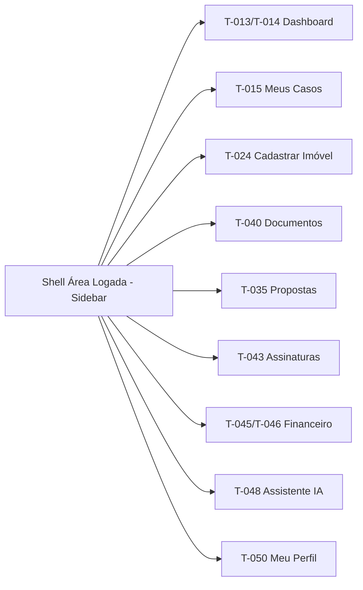

Sidebar com 9 itens fixos. Cada item carrega o conteúdo na área de trabalho sem recarregar a página (SPA com App Router).

### 2.2 Navegação Mobile — Bottom Tab Bar

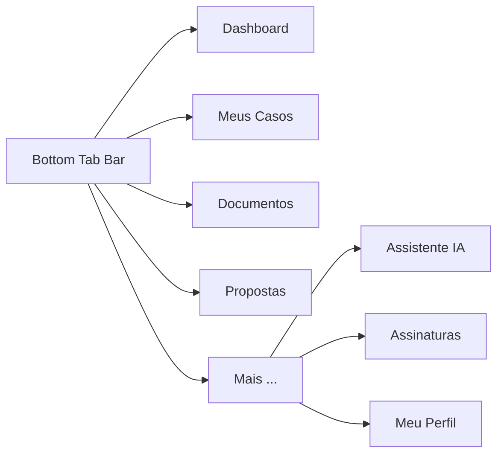

[DECISÃO AUTÔNOMA — bottom tab bar com 5 itens principais para mobile. Os 4 módulos críticos para o Cedente em campo (Dashboard, Casos, Documentos, Propostas) ficam na barra. Módulos de uso menos frequente (Assistente IA, Assinaturas, Perfil) agrupados em "Mais". Alternativa descartada: hamburger menu lateral — esconde navegação, reduz engagement.]

### 2.3 Área Pública (Não Autenticada)

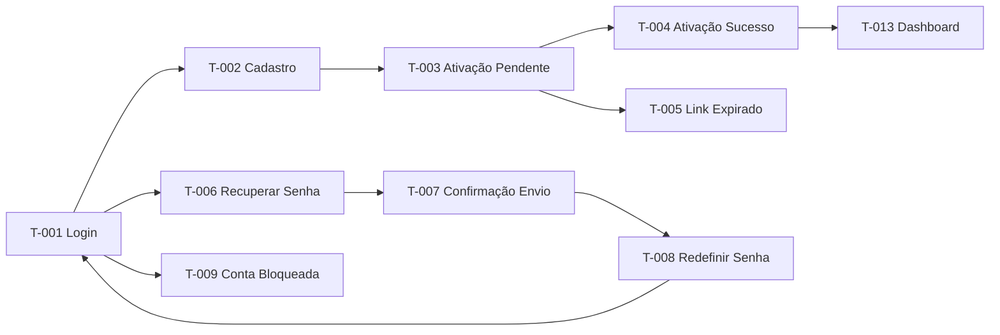

---

## ⚙️ 3. Fluxos de Navegação por Módulo

### 3.1 Módulo: Autenticação

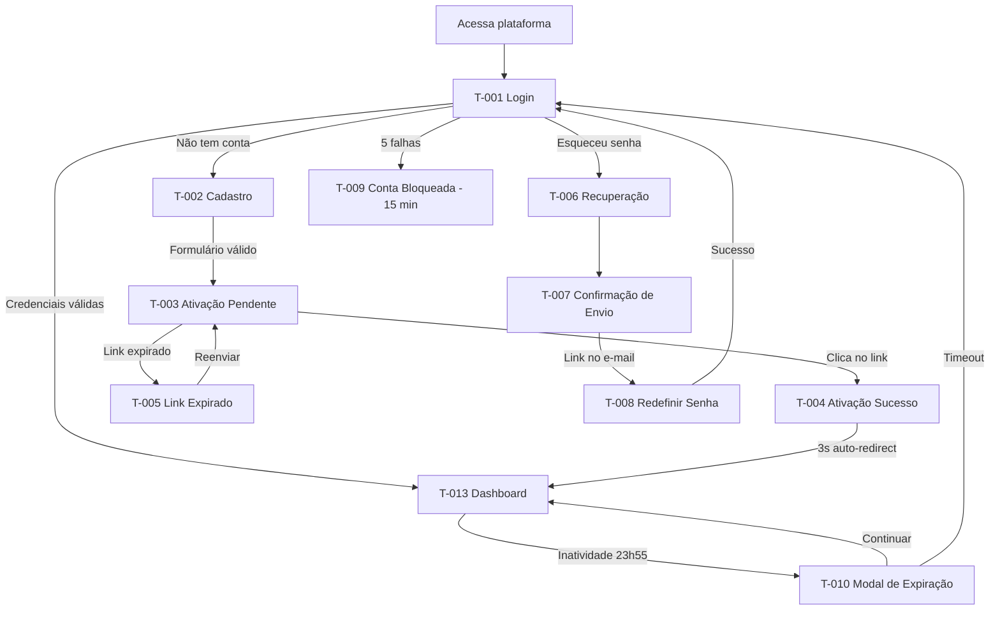

### 3.2 Módulo: Cadastro de Imóvel

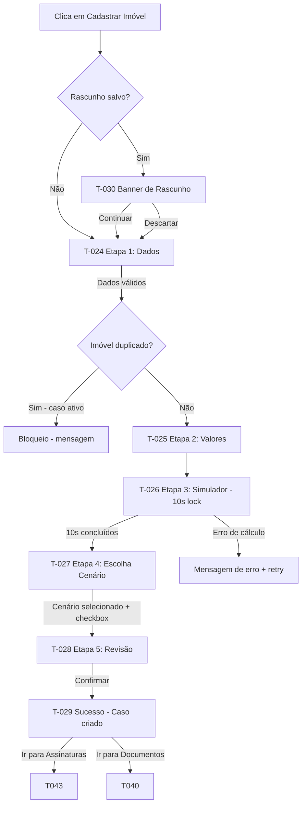

### 3.3 Módulo: Propostas e Negociação

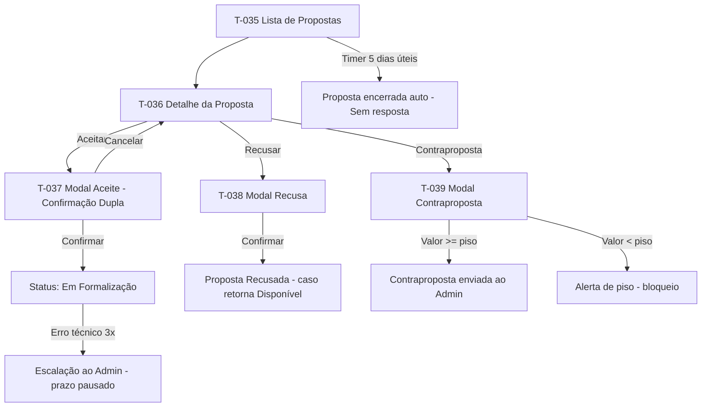

### 3.4 Módulo: Documentos (Dossiê)

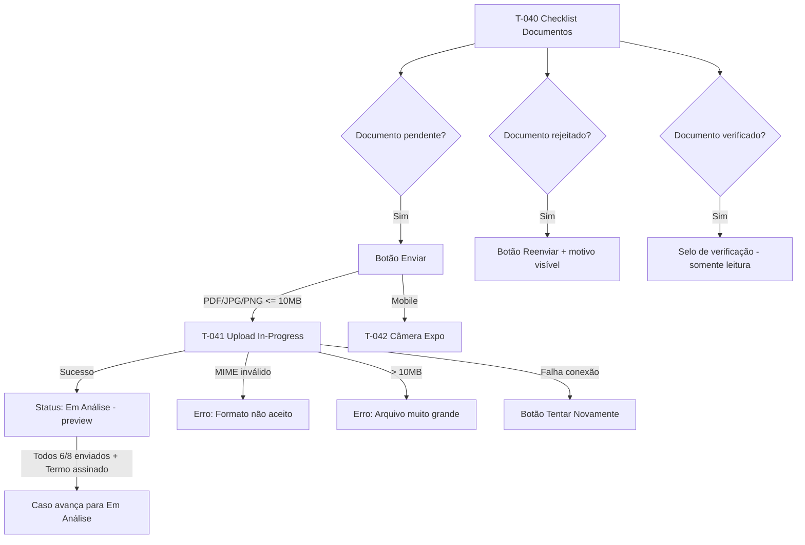

### 3.5 Módulo: Assinaturas

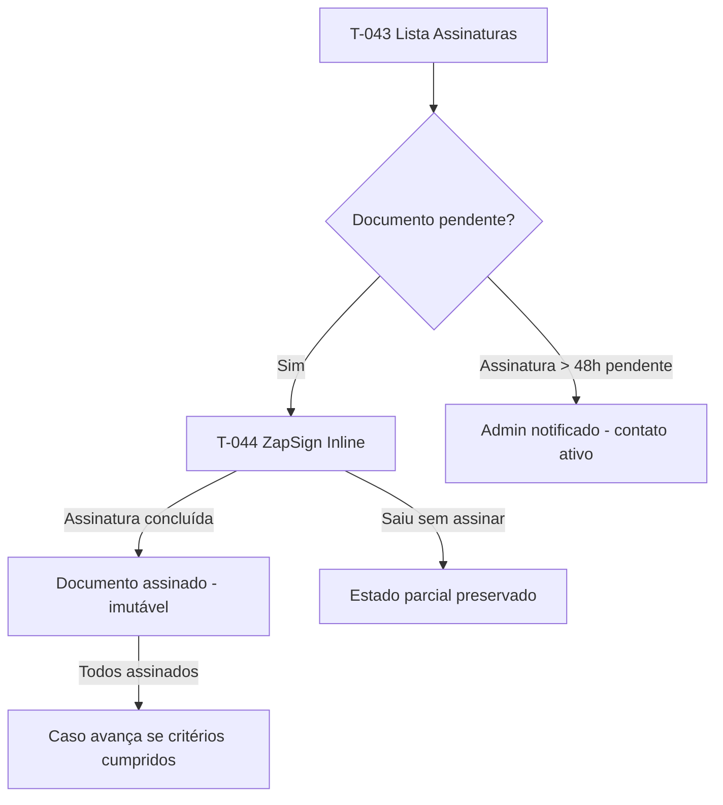

### 3.6 Módulo: Financeiro e Escrow

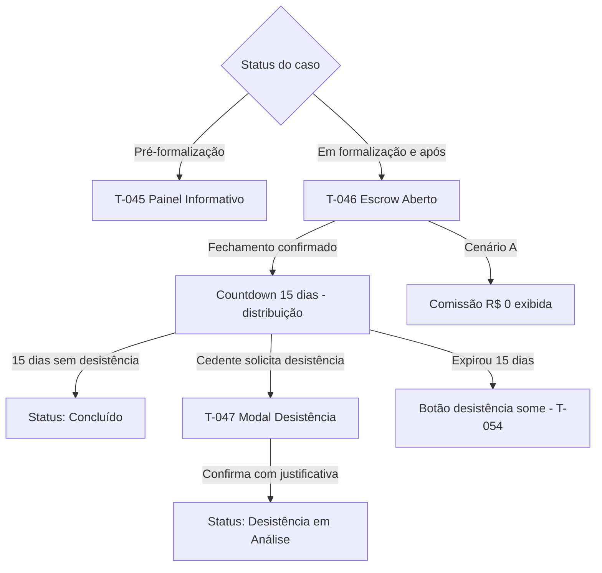

### 3.7 Módulo: Guardião do Retorno (IA)

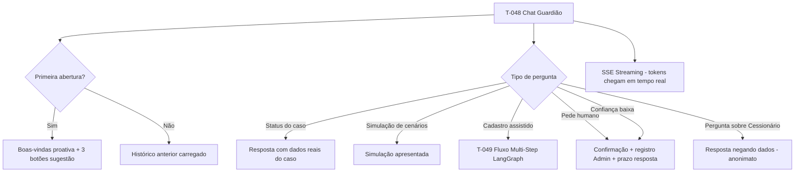

### 3.8 Fluxos Cross-Módulo

#### 3.8.1 Cadastro → Assinatura → Documentos → Triagem

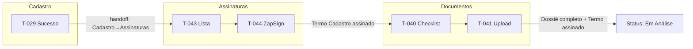

#### 3.8.2 Proposta → Formalização → Assinatura → Escrow

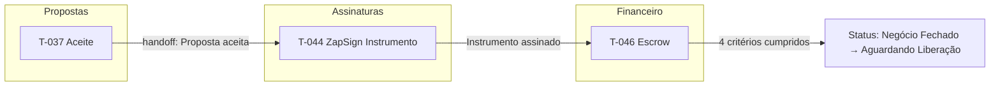

#### 3.8.3 Escalonamento → Assinatura → Retorno ao Mercado

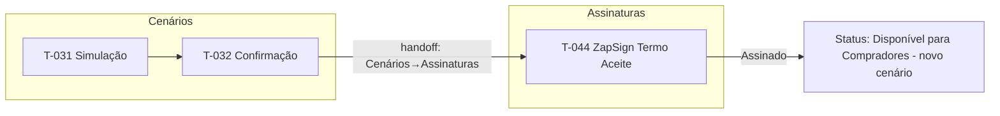

---

## ⚙️ 4. Estados e Transições por Tela

### T-001: Login

- **Loading (submit):** Botão "Entrar" desabilitado + spinner 16px substitui label. Duração: até resposta do servidor.
- **Erro de credenciais:** Banner vermelho inline "E-mail ou senha incorretos." abaixo dos campos.
- **Erro de conta não confirmada:** Banner âmbar "Confirme seu e-mail antes de acessar." + link "Reenviar confirmação".
- **Bloqueio iminente:** Mensagem de contagem após 3 falhas (Dim.6 edge case).
- **Offline:** Botão desabilitado + tooltip "Sem conexão."
- **Transição:** Fade-in da página ao carregar (`--duration-page`, 500ms, `--ease-out`). Submit → loading instantâneo (100ms). [CORRIGIDO: PROBLEMA-016]

### T-002: Cadastro

- **Loading (submit):** Botão "Criar conta" desabilitado + label "Criando conta..."
- **Validação inline:** On-blur por campo. Borda vermelha + mensagem específica abaixo. Cor verde ao validar.
- **Erro de e-mail duplicado:** Mensagem inline âmbar "Este e-mail já está cadastrado." + link "Entrar".
- **Offline:** Botão desabilitado + tooltip "Sem conexão."
- **Transição:** Campos do formulário PF/PJ trocam com fade-in/out `--duration-fast` (150ms) ao trocar toggle. [CORRIGIDO: PROBLEMA-016]

### T-003: E-mail de Ativação Pendente

- **Loading (reenvio):** Botão desabilitado + label "Enviando..."
- **Sucesso de reenvio:** Toast verde "E-mail reenviado com sucesso!" (3s, `--ease-out`).
- **Cooldown ativo:** Botão desabilitado + contador "Reenviar em Xs" decrescente segundo a segundo.
- **Offline:** Botão desabilitado + tooltip "Sem conexão."
- **Transição:** Tela exibida com fade-in `--duration-page` após cadastro. [CORRIGIDO: PROBLEMA-016]

### T-013: Dashboard — com casos

- **Loading:** Skeleton screens para cards de resumo (4 cards), lista de casos e feed de eventos. Animação via Framer Motion. `[DECISÃO AUTÔNOMA — skeleton obrigatório per STK seção 3.4]`
- **Empty:** Redireciona para T-014 (primeiro acesso sem casos).
- **Sucesso:** Cards preenchidos, lista de até 5 casos ativos, feed de últimos 10 eventos. Rodapé: "Atualizado há [X] segundos."
- **Erro:** Banner no topo "Não foi possível carregar os dados." + botão "Tentar novamente".
- **Parcial:** Cards carregados parcialmente com placeholders nos dados ausentes.
- **Offline:** Último estado em cache com badge "Dados de [data/hora]. Sem conexão."
- **Transição:** Skeleton → fade-in suave. Atualização silenciosa a cada 60s via Supabase Realtime. Toast de confirmação (3s) após ações rápidas. [CORRIGIDO: PROBLEMA-016]

### T-015: Lista de Casos

- **Loading:** Skeleton para lista de 3 casos, filtros desabilitados.
- **Empty:** "Você ainda não cadastrou nenhum imóvel." + CTA "Cadastrar meu primeiro imóvel".
- **Sucesso:** Lista paginada (10/pág), filtros, busca funcional, total de resultados visível.
- **Erro:** Banner de erro + retry.
- **Parcial:** Não aplicável — lista completa ou erro.
- **Offline:** Última lista em cache com badge de desatualização.
- **Transição:** Resultado de busca atualiza inline sem reload.

### T-024 a T-028: Wizard de Cadastro

- **Loading:** Skeleton para simulador de cenários (T-026). Etapas 1, 2, 4 e 5 não têm loading significativo.
- **Empty:** Não aplicável — formulário em branco é estado inicial.
- **Sucesso:** Validação inline com indicador verde por campo.
- **Erro:** Indicador vermelho com mensagem específica por campo (on blur).
- **Parcial:** Rascunho auto-salvo ao final de cada etapa; banner T-030 na próxima visita.
- **Offline:** Wizard bloqueia submissão; formulário preservado em localStorage.
- **Transição:** AnimatePresence entre etapas. Barra de progresso animada no stepper. Timer de 10s em barra fina sutil na etapa 3.

### T-035: Lista de Propostas

- **Loading:** Skeleton para 2-3 cards de proposta.
- **Empty:** "Nenhuma proposta recebida ainda. Seu imóvel está disponível para compradores qualificados."
- **Sucesso:** Propostas ordenadas por valor decrescente. Badge numérico no menu.
- **Erro:** Banner de erro + retry.
- **Urgência (substate):** Badge vermelho pulsante nas últimas 24h do prazo (Framer Motion).
- **Transição:** Proposta aceita some da lista com fade-out + toast "Proposta aceita com sucesso!".

### T-040: Checklist de Documentos

- **Loading:** Skeleton para checklist com 6 linhas de documento.
- **Empty:** Não aplicável — checklist sempre exibido com 6 ou 8 itens.
- **Sucesso:** Todos documentos com status visual correto (badge colorido + ícone).
- **Erro (upload):** Mensagem inline por documento com motivo.
- **Avanço automático:** Banner temporário (10s) ao completar dossiê.
- **Transição:** Status do documento atualiza em tempo real via Supabase Realtime.

### T-014: Dashboard — primeiro acesso

- **Loading:** Skeleton do checklist de 3 passos e mensagem de boas-vindas.
- **Sucesso:** Checklist interativo "3 passos para começar" (1. Cadastrar imóvel, 2. Assinar Termo, 3. Enviar documentos), cada passo com ícone, título e CTA. Passos concluídos marcados com check verde.
- **Offline:** Checklist exibido sem status dinâmico (dados estáticos).
- **Transição:** Fade-in `--duration-page`. [CORRIGIDO: PROBLEMA-016, PROBLEMA-017]

### T-016–T-021: Abas do Detalhe do Caso

- **Loading (troca de aba):** Skeleton da zona de conteúdo da aba recém-selecionada (300ms).
- **Erro por aba:** Banner inline "Não foi possível carregar." + retry — não afeta outras abas.
- **Offline:** Dados da aba em cache com badge de timestamp.
- **Transição de aba:** Fade-in `--duration-fast` (150ms, `--ease-out`). Aba ativa: underline `--primary`. [CORRIGIDO: PROBLEMA-016]

### T-022 / T-023: Modais de Cancelamento

- **Loading (submit):** Botão destrutivo desabilitado + label "Cancelando..."
- **Sucesso:** Modal fecha com fade-out 150ms + toast verde "Caso cancelado." + lista atualiza.
- **Erro:** Toast vermelho + modal permanece aberto.
- **Transição:** Modal: scale 0.95→1 + fade-in `--duration-normal`. Saída: fade-out 150ms. [CORRIGIDO: PROBLEMA-016]

### T-031–T-034: Cenários e Escalonamento

- **T-031 Loading:** Skeleton dos 2 cards comparativos.
- **T-031 Erro:** Banner "Não foi possível calcular a comparação." + retry.
- **T-032 Loading:** Botão desabilitado + "Solicitando..." Sucesso: modal fecha + toast.
- **T-033/T-034:** Puramente informativos — sem loading state relevante.
- **Transição (modais):** Scale 0.95→1 + fade-in `--duration-normal`, saída fade-out 150ms. [CORRIGIDO: PROBLEMA-016]

### T-036–T-039: Propostas

- **T-036 Loading:** Skeleton da hierarquia financeira.
- **T-036 Erro:** "Não foi possível carregar os detalhes." + retry.
- **T-037 Loading:** Spinner + botão desabilitado. Sucesso: modal fecha + toast.
- **T-038 Loading:** "Recusando..." Sucesso: modal fecha + card some com fade-out.
- **T-039 Validação:** Inline em tempo real. Loading: "Enviando..."
- **Transição (modais):** Scale 0.95→1 + fade-in `--duration-normal`. [CORRIGIDO: PROBLEMA-016]

### T-043: Lista de Assinaturas

- **Loading:** Skeleton de 3 linhas.
- **Empty:** "Nenhum documento pendente de assinatura. Você está em dia!" + check verde 64px.
- **Aviso prazo crítico:** Banner âmbar sticky "Documento com prazo em menos de 48h: [nome]."
- **Erro:** Banner + retry.
- **Offline:** Lista em cache com badge timestamp.
- **Transição:** Documento assinado muda de status com fade + checkmark `spring-bouncy`. [CORRIGIDO: PROBLEMA-016]

### T-044: Assinatura Inline ZapSign

- **Loading:** Spinner enquanto iframe do ZapSign carrega.
- **Empty:** Não aplicável.
- **Sucesso:** ZapSign exibido inline; ao assinar, componente fecha e status atualiza.
- **Erro:** "ZapSign temporariamente indisponível. Tente novamente em instantes." + retry.
- **Timeout (10s sem resposta do ZapSign):** Exibe erro com retry. [CORRIGIDO: PROBLEMA-024]
- **Parcial:** Estado de assinatura parcial preservado pelo ZapSign — Cedente pode retomar.
- **Offline:** "Você precisa de conexão para assinar." — não abre o iframe.
- **Transição:** Iframe aparece com slide-down animation (Framer Motion). [CORRIGIDO: PROBLEMA-016]

### T-045–T-047: Financeiro e Escrow

- **T-045 Loading:** Skeleton do EscrowPanel informativo.
- **T-045 Offline:** Painel com dados em cache + badge timestamp.
- **T-046 Loading:** Skeleton do EscrowPanel ativo.
- **T-046 Offline:** Painel com badge timestamp.
- **T-047 Loading:** Botão "Confirmar desistência" desabilitado + "Registrando..." Sucesso: modal fecha + toast.
- **Transição (T-047):** Modal scale 0.95→1 + fade-in `--duration-normal`. [CORRIGIDO: PROBLEMA-016]

### T-049: Chat — Cadastro Assistido

- **Loading:** Idêntico ao T-048 (SSE spinner).
- **Erro de step:** Guardião explica o que ficou faltando e repete a pergunta — sem tela de erro separada.
- **Abandono:** Confirmação inline "Cancelar cadastro assistido? Os dados coletados serão descartados." + botão "Sim, cancelar" (destrutivo) + "Continuar" (primário).
- **Conclusão:** Mensagem do Guardião + botão "Revisar e confirmar" inline.
- **Transição:** Stepper de progresso atualiza com fade + scale `spring-gentle`. [CORRIGIDO: PROBLEMA-016]

### T-050–T-052: Perfil e Configurações

- **T-050 Loading:** Skeleton dos campos do formulário.
- **T-050 Save Loading:** Botão desabilitado + "Salvando..." Sucesso: toast. Erro: toast + campos revertidos.
- **T-051 Loading:** Skeleton dos toggles.
- **T-052 Loading:** Skeleton da seção LGPD. Modal loading: botão desabilitado + "Registrando..."
- **Offline (todos):** Campos somente leitura + banner "Sem conexão. Alterações serão sincronizadas quando você reconectar." (exceto T-052 que bloqueia totalmente a ação de exclusão offline). [CORRIGIDO: PROBLEMA-016]

### T-048: Chat Guardião do Retorno

- **Loading:** Spinner leve enquanto primeira mensagem SSE chega (< 3s target).
- **Empty:** Mensagem proativa de boas-vindas com 3 botões de sugestão.
- **Sucesso:** Conversa em andamento com tokens chegando via SSE (streaming visual, letra por letra).
- **Erro:** "Não consegui processar sua mensagem. Tente novamente." + retry.
- **Escalação (substate):** Modal de confirmação "Encaminhar para equipe?".
- **Offline:** "Sem conexão. O Guardião estará disponível quando você reconectar."
- **Transição:** Tokens aparecem incrementalmente via SSE. Scroll automático para nova mensagem. [CORRIGIDO: PROBLEMA-016]

---

## ⚙️ 4.1 Variantes por Perfil de Usuário

### T-016: Detalhe do Caso — Visão Geral

- **Cedente PF:** Exibe dados pessoais do Cedente, cenário ativo, botão "Cancelar Caso" (pré-Fechamento), botão "Solicitar Desistência" (pós-Fechamento, dentro de 15 dias), botão "Alterar Cenário".
- **Cedente PJ:** Idem ao PF, com exibição adicional do nome do Representante Legal e indicação do CNPJ cadastrado.

### T-040: Checklist de Documentos

- **Cedente PF:** 6 documentos obrigatórios.
- **Cedente PJ:** 8 documentos obrigatórios (6 padrão + Contrato Social/CCMEI + documento de identidade do Representante Legal).

### T-050: Meu Perfil — Dados Pessoais

- **Cedente PF:** Campo CPF somente leitura, nome completo editável, e-mail com dupla confirmação, telefone editável.
- **Cedente PJ:** Campo CNPJ somente leitura, razão social editável, nome do Representante Legal, e-mail com dupla confirmação. Seção adicional de "Representante Legal" com campos de CPF (somente leitura) e cargo.

### T-044: Assinatura Inline ZapSign

- **Cedente PF:** Envelope enviado ao e-mail do Cedente PF.
- **Cedente PJ:** Envelope enviado ao e-mail do Representante Legal, não ao e-mail genérico da empresa.

### T-002: Cadastro

- **Cedente PF:** Toggle PF ativo por padrão. Campos: nome completo, CPF, e-mail, telefone, senha.
- **Cedente PJ:** Toggle PJ selecionado. Campos: razão social, CNPJ, e-mail, telefone, senha + seção adicional "Representante Legal" com nome e CPF do representante. [CORRIGIDO: PROBLEMA-025]

### T-022 / T-023: Modais de Cancelamento

- **Cedente PF / PJ:** Comportamento idêntico em ambos. Sem diferença visual por tipo de pessoa.
- **Variante por status de caso:** T-022 (sem Escrow) vs T-023 (com Escrow) — determinada pelo sistema com base no status do caso. Cedente não escolhe qual modal abrir. [CORRIGIDO: PROBLEMA-025]

### T-037 / T-038 / T-039: Modais de Proposta

- **Cedente PF / PJ:** Comportamento idêntico. O resumo financeiro em T-037 exibe o valor líquido independente do tipo de pessoa.
- **Sem variante por tipo:** Propostas e negociação são agnósticas ao tipo de pessoa. [CORRIGIDO: PROBLEMA-025]

---

## ⚙️ 5. Breakpoints e Adaptações Responsivas

### Padrão de breakpoints adotado

| Breakpoint | Faixa | Descrição |
|---|---|---|
| Mobile | < 768px | Layout coluna única, sidebar como drawer, bottom tab bar no mobile nativo |
| Tablet | 768px – 1024px | Sidebar colapsada por padrão (ícones sem labels), layout 2 colunas para Dashboard e Casos |
| Desktop | > 1024px | Sidebar expandida com labels, layout completo 3 colunas onde aplicável |

### Adaptações por tela crítica

**T-013 Dashboard:**
- Mobile: cards de resumo em coluna única (2 por linha em landscape), feed de eventos colapsado, próximos passos em lista vertical.
- Tablet: 2 cards por linha, sidebar em ícones, feed de eventos à direita.
- Desktop: 4 cards em linha, sidebar expandida, layout 3 colunas.

**T-015 Lista de Casos:**
- Mobile: cards de casos em lista vertical, filtros em drawer deslizante inferior (bottom sheet), busca em campo fixo no topo.
- Tablet: sidebar com ícones, filtros expostos lateralmente.
- Desktop: filtros na sidebar esquerda secundária, lista ocupa largura principal.

**T-024–T-028 Wizard:**
- Mobile: wizard não disponível em mobile — [DECISÃO AUTÔNOMA: O wizard de 5 etapas com simulador é complexo demais para mobile. Mobile redireciona para web com mensagem "Para melhor experiência, use o computador para cadastrar seu imóvel. Você pode acompanhar o andamento pelo app."] Alternativa descartada: wizard mobile full — UX degradada para formulários complexos com múltiplos campos e simulador visual.
- Desktop: stepper horizontal no topo, formulário centralizado em 2 colunas onde há campos suficientes.

**T-035 Lista de Propostas:**
- Mobile: cards de proposta em coluna única, timer e valor líquido em destaque máximo no topo do card, ações (Aceitar/Recusar/Contraproposta) em bottom sheet deslizante.
- Tablet: 2 colunas de cards.
- Desktop: lista com painel lateral de detalhe (T-036) que aparece ao clicar sem navegar.

**T-040 Documentos:**
- Mobile: checklist em lista vertical, botão "Enviar" / "Reenviar" inline + botão câmera (Expo Camera) destacado para captura nativa.
- Tablet/Desktop: checklist em tabela com preview do arquivo enviado à direita.

**T-044 Assinatura ZapSign:**
- Mobile: iframe ZapSign em tela cheia (fullscreen), sem menu lateral. Botão "Fechar" flutuante no canto superior.
- Desktop: iframe em modal/drawer lateral.

**T-048 Guardião do Retorno:**
- Mobile: chat ocupa tela inteira com bottom input. Histórico de conversas em lista scrollável.
- Desktop: chat em panel fixo à direita ou em tela dedicada da sidebar.

**T-001 / T-002 / T-006 / T-008 (Formulários de Autenticação):**
- Mobile: formulário em coluna única, largura total, padding 16px lateral. Toggle de senha com ícone touch 44×44px.
- Tablet: formulário centralizado (max-width 480px) com padding 32px lateral.
- Desktop: formulário centralizado (max-width 480px) em card com sombra leve, background `--muted` na página. [CORRIGIDO: PROBLEMA-015] [DECISÃO APLICADA: DEC-006]

**T-011 (Shell Sidebar Web):**
- Mobile: sidebar oculta (não aplicável — shell mobile é T-012).
- Tablet (768–1024px): sidebar colapsada para ícones (64px), botão hamburger no header para abrir como drawer overlay com fundo semi-transparente. Drawer fecha ao clicar fora.
- Desktop (>1024px): sidebar expandida (240px) fixa. [CORRIGIDO: PROBLEMA-015]

**T-016–T-021 (Detalhe do Caso — Abas):**
- Mobile: abas em scroll horizontal (overflow-x auto), conteúdo em coluna única. Abas que só existem em web (T-019, T-020, T-021): exibem mensagem "Disponível apenas na versão web."
- Tablet: abas em linha, conteúdo em coluna única.
- Desktop: abas em linha, layout 2 colunas quando há zonas de informação suficientes. [CORRIGIDO: PROBLEMA-015]

**T-022 / T-023 (Modais de Cancelamento):**
- Mobile: modal ocupa 90% da largura com bordas arredondadas inferiores (bottom sheet style, `--radius-xl`).
- Tablet / Desktop: modal centralizado (max-width 480px). [CORRIGIDO: PROBLEMA-015]

**T-031 (Simulação Comparativa — Cenários):**
- Mobile: cards empilhados em coluna única (cenário atual em cima, novo abaixo). Diferença financeira entre os cards em banner central.
- Tablet: 2 cards lado a lado.
- Desktop: 2 cards lado a lado com seta comparativa entre eles. [CORRIGIDO: PROBLEMA-015]

**T-032 / T-033 / T-034 (Modais de Cenários):**
- Mobile: bottom sheet (90% largura, bordas superiores arredondadas).
- Tablet / Desktop: modal centralizado (max-width 480px). [CORRIGIDO: PROBLEMA-015]

**T-036 (Detalhe da Proposta):**
- Mobile: tela dedicada (back navigation para T-035). Hierarquia financeira em coluna única.
- Tablet: tela dedicada.
- Desktop: painel lateral (split view) ao lado da lista T-035 (DA-004). [CORRIGIDO: PROBLEMA-015]

**T-037 / T-038 / T-039 (Modais de Proposta):**
- Mobile: bottom sheet (90% largura). Teclado numérico no campo de valor do T-039.
- Tablet / Desktop: modal centralizado (max-width 480px). [CORRIGIDO: PROBLEMA-015]

**T-043 (Lista de Assinaturas):**
- Mobile: lista vertical com status e botão "Assinar" inline. Documentos web-only exibem label "Via computador".
- Tablet / Desktop: lista com colunas (nome, tipo, prazo, status, ação). [CORRIGIDO: PROBLEMA-015]

**T-045 / T-046 / T-047 (Financeiro):**
- Web only: telas disponíveis apenas na versão web. Mobile exibe banner de redirecionamento: "O painel financeiro está disponível no computador." [CORRIGIDO: PROBLEMA-015]

**T-049 (Cadastro Assistido):**
- Mobile: chat em tela cheia, stepper compacto (somente ícones e número de etapa).
- Tablet / Desktop: identico ao T-048 (chat com sidebar de histórico). [CORRIGIDO: PROBLEMA-015]

**T-050 / T-051 / T-052 (Perfil):**
- Mobile: abas em scroll horizontal, formulário em coluna única. Toggles touch-friendly (44px height mínimo).
- Tablet / Desktop: abas em linha, formulário em coluna única (max-width 640px). [CORRIGIDO: PROBLEMA-015]

---

## ⚙️ 6. Componentes Reutilizáveis

| Componente | Telas onde aparece | Variantes | Tokens usados |
|---|---|---|---|
| **StatusBadge** | T-015, T-016, T-021, T-040 | 13 estados do caso + 4 estados do documento | `--primary` (análise), `--destructive` (rejeição/cancelado), verde (aprovado/concluído), amarelo (pendência) |
| **CaseCard** | T-013, T-015 | Compacto (Dashboard) / Expandido (Meus Casos) | `--card`, `--card-foreground`, `--border` |
| **ProposalCard** | T-035, T-018 | Ativa (com timer) / Histórico (sem timer) | `--primary`, `--destructive` (urgência), `--chart-4` |
| **DocumentCard** | T-040, T-017 | Pendente / Em análise / Verificado / Rejeitado | `--muted`, `--primary`, `--destructive`, `--ring` |
| **Countdown** | T-035 (timer proposta), T-046 (15 dias Escrow), T-009 (bloqueio de conta), T-043 (prazo de assinatura) | Dias / Horas / Minutos / Segundos | `--destructive` (urgência < 24h), `--chart-2` (normal) | [CORRIGIDO: PROBLEMA-021] |
| **EscrowPanel** | T-045, T-046, T-020 | Informativo / Ativo / Distribuído / Em reversão | `--card`, `--primary`, `--chart-3` |
| **GuardiaoChat** | T-048, T-049 | Standard / Cadastro assistido | `--sidebar`, `--primary`, `--muted-foreground` |
| **NotificationBell** | T-011 (sidebar header) | Com badge numérico / Sem badge | `--destructive` (badge), `--sidebar-foreground` |
| **Stepper** | T-024 a T-028 | 5 etapas, estados: inativo / ativo / concluído | `--primary`, `--muted`, `--border` |
| **FinancialSummary** | T-036, T-046, T-028, T-026 | Estimativa / Confirmado | `--primary` (verde para "Você recebe"), `--muted-foreground` |
| **SignatureInline** | T-044 | Web (iframe) / Mobile (WebView) | N/A (componente externo ZapSign) |
| **UploadZone** | T-040, T-041 | Idle / Active / Uploading / Error / Success | `--border`, `--primary`, `--destructive`, `--muted` |

---

## ⚙️ 7. Acessibilidade Básica (a11y) por Tela Crítica

### T-013: Dashboard

- **Tab order:** logo/marca → menu sidebar (top a bottom) → cards de resumo (esquerda → direita) → lista de casos → próximos passos → feed de eventos → footer.
- **Contraste:** WCAG AA mínimo em todos os elementos. Texto sobre `--card` (#FFFFFF): foreground #0A0A0A → ratio 21:1 (passa AA+).
- **Leitor de tela:** Cards de resumo com `aria-label` descritivo ("Casos ativos: 2", "Pendências: 1", "Valor líquido estimado: R$ 360.000"). Feed de eventos com `role="list"` e `aria-label="Últimos eventos"`.
- **Alternativas textuais:** Ícones de status com `aria-hidden="true"` quando acompanhados de texto; `aria-label` quando ícone isolado.

### T-015: Lista de Casos

- **Tab order:** busca → filtros → lista de casos (navegação por setas) → paginação.
- **Contraste:** Badges de status com contraste mínimo 4.5:1 conforme WCAG AA (RN-057).
- **Leitor de tela:** Lista com `role="list"`, cada item com `aria-label` contendo nome do imóvel, status e data. Filtros com `aria-label` descritivo.
- **Alternativas textuais:** Ícones de status de caso com `alt` ou `aria-label`.

### T-027: Wizard Etapa 4 — Escolha de Cenário

- **Tab order:** cards de cenário (A → B → C → D) → checkbox de confirmação → botão Avançar.
- **Contraste:** Cenário selecionado com borda `--primary` (#0069A8) e fundo levemente tintado — contraste verificado.
- **Leitor de tela:** Cards de cenário com `role="radio"` dentro de `role="radiogroup"`. Cada card: `aria-label="Cenário [X]: Retorno de R$ [Y], comissão R$ [Z], valor líquido R$ [W]"`. Checkbox: `aria-label="Confirmo minha escolha de cenário"`.
- **Alternativas textuais:** Ícone de dificuldade de venda com `alt` textual.

### T-035: Lista de Propostas

- **Tab order:** badge de propostas → lista de propostas → botões de ação por proposta (Aceitar, Recusar, Contraproposta).
- **Contraste:** Badge de urgência vermelho com texto branco — ratio > 4.5:1.
- **Leitor de tela:** Lista com `role="list"`. Cada proposta: `aria-label="Proposta [N]: R$ [valor]. Você recebe: R$ [líquido]. Prazo: [X] dias úteis restantes"`.
- **Timer pulsante:** Acessível apenas visualmente; informação de urgência também comunicada em texto ("Prazo: menos de 24 horas").

### T-040: Checklist de Documentos

- **Tab order:** seletor de caso → lista de documentos (navegação por setas) → botão upload/reenvio por documento.
- **Contraste:** WCAG AA para todos os badges de status.
- **Leitor de tela:** Cada documento com `aria-label="[Nome do documento] — status: [status]"` (RN-041). Ícones de status com `role="img"` e `aria-label`.
- **Alternativas textuais:** Ícone de check verde (verificado), X vermelho (rejeitado), relógio (em análise) — todos com texto alternativo.

### T-048: Chat Guardião

- **Tab order:** campo de mensagem → botão enviar → botões de sugestão (quando visíveis).
- **Contraste:** Balões de mensagem: texto do Guardião sobre fundo --card (#FFFFFF / dark: #171717) com contraste adequado.
- **Leitor de tela:** Chat com `role="log"` e `aria-live="polite"`. Novas mensagens anunciadas automaticamente. Botões de sugestão com `aria-label` descritivo.
- **SSE streaming:** Para leitores de tela, a mensagem é anunciada completa ao finalizar o streaming (não letra por letra). [DECISÃO AUTÔNOMA — anunciar token por token seria insuportável para leitores de tela. Alternativa descartada: anúncio contínuo.]

### T-002: Cadastro

- **Tab order:** toggle PF/PJ → nome → CPF/CNPJ → e-mail → confirmar e-mail → telefone → senha → confirmar senha → botão "Criar conta" → link "Já tenho conta".
- **Contraste:** WCAG AA mínimo. Mensagens de erro vermelhas com contraste ≥ 4.5:1 sobre fundo branco.
- **Leitor de tela:** Campo senha: `aria-describedby` apontando para o checklist de força. Campos obrigatórios: `aria-required="true"`. Mensagens de erro: `aria-live="assertive"` + `aria-describedby` no campo com erro.
- **Touch targets:** Todos os botões e campos com height mínima 44px. [CORRIGIDO: PROBLEMA-018]

### T-010: Modal de Expiração de Sessão

- **Tab order:** foco inicial no botão "Continuar sessão" → botão "Encerrar agora".
- **Focus trap:** obrigatório. ESC aciona "Encerrar agora" (confirmado via `aria-keyshortcuts`).
- **Leitor de tela:** `role="dialog"`, `aria-modal="true"`, `aria-labelledby` no título. Contador regressivo com `aria-live="off"` (não anuncia cada segundo — anunciaria apenas ao fechar).
- **Contraste:** Botão "Continuar sessão" (primário) com contraste ≥ 4.5:1. [CORRIGIDO: PROBLEMA-018, PROBLEMA-019]

### T-022 / T-023: Modais de Cancelamento

- **Tab order:** dropdown motivo → botão "Continuar" (Passo 1) → checkbox (T-023) → botão "Confirmar cancelamento" → botão "Voltar".
- **Focus trap:** obrigatório. Focus inicial no campo de motivo. ESC fecha o modal.
- **Leitor de tela:** `role="dialog"`, `aria-modal="true"`. Botão destrutivo: `aria-label="Confirmar cancelamento do caso — ação irreversível"`. [CORRIGIDO: PROBLEMA-018]

### T-031–T-034: Cenários e Escalonamento

- **T-031 Tab order:** cards comparativos (leitura sequencial) → botão "Solicitar escalonamento" → botão "Voltar".
- **T-031 Leitor de tela:** Cards com `role="article"` + `aria-label` descrevendo cenário e valores.
- **T-032 Focus trap:** obrigatório no modal. Focus inicial no checkbox de confirmação.
- **T-033/T-034 Leitor de tela:** `role="alertdialog"`, `aria-live="assertive"`. [CORRIGIDO: PROBLEMA-018]

### T-043: Lista de Assinaturas

- **Tab order:** filtro de casos (se houver) → lista de documentos → botão "Assinar" por item.
- **Contraste:** WCAG AA para todos os badges de status e texto de prazo.
- **Leitor de tela:** Lista com `role="list"`. Cada item: `aria-label="[Nome do documento] — [tipo] — prazo: [prazo] — status: [status]"`.
- **Touch targets:** Botão "Assinar" com mínimo 44×44px. [CORRIGIDO: PROBLEMA-018]

### T-052: LGPD / Exclusão de Dados

- **Tab order:** abas → seção LGPD → botão "Solicitar exclusão" → (no modal) campo senha → checkbox → botão "Confirmar exclusão".
- **Focus trap no modal:** obrigatório. Focus inicial no campo senha.
- **Leitor de tela:** Botão destrutivo: `aria-label="Solicitar exclusão de todos os dados — ação irreversível"`. Aviso de consequências: `role="alert"`. [CORRIGIDO: PROBLEMA-018]

### T-050/T-051: Perfil e Notificações

- **Tab order:** abas (Dados / Notificações / LGPD) → campos dentro de cada aba.
- **Contraste:** Toggles desabilitados (notificações críticas) mantêm contraste textual adequado mesmo em estado cinza.
- **Leitor de tela:** Toggles com `role="switch"`. Desabilitados: `aria-disabled="true"`. Tooltip de "notificação obrigatória" acessível via `aria-describedby`.
- **Foco:** CPF/CNPJ somente leitura com `aria-readonly="true"` e descrição de suporte. [CORRIGIDO: PROBLEMA-018]

---

## ⚙️ 8. Mapa Visual Consolidado

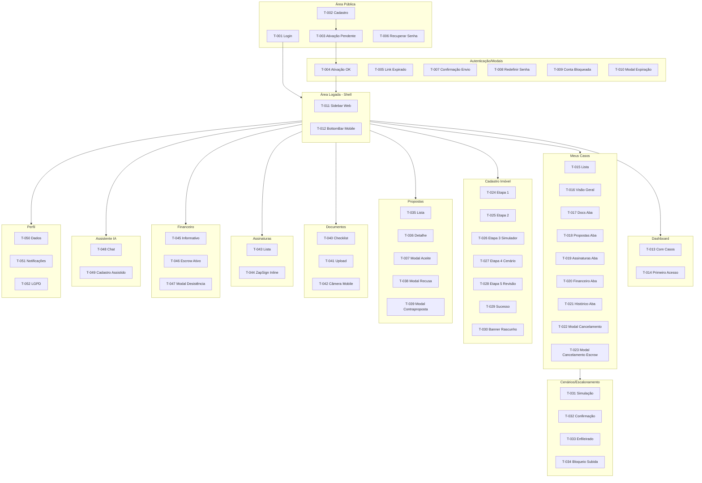

---

## 📋 9. Changelog

| **Data** | **Versão** | **Descrição** |
|---|---|---|
| 2026-03-22 | v1.0 | Criação inicial — 52 telas mapeadas, 12 módulos, 2 plataformas, 12 componentes reutilizáveis, fluxos cross-módulo e a11y por tela crítica. |
| 2026-03-22 | v1.1 | Auditoria UX B04 aplicada — 25 problemas corrigidos, 7 decisões aplicadas. Enriquecimento de completude de descrição em todas as telas, estados explícitos para telas sem cobertura, adaptações responsivas para todas as telas, a11y ampliada para 14 telas, variantes por perfil adicionadas, Countdown corrigido (T-106 → T-009/T-043). |

---

## 📋 10. Backlog de Pendências

| **ID** | **Tipo** | **Tela** | **Descrição** | **Impacto** |
|---|---|---|---|---|
| DA-001 | DECISÃO AUTÔNOMA | T-012 | Bottom tab bar com 5 itens no mobile. Itens: Dashboard, Casos, Documentos, Propostas, Mais. Alternativa descartada: hamburger menu lateral. | Navegação mobile — baixo risco. |
| DA-002 | DECISÃO AUTÔNOMA | T-024–T-028 | Wizard de cadastro não disponível em mobile; redireciona para web com mensagem. Alternativa descartada: wizard mobile. | UX de cadastro — validar com time de produto. |
| DA-003 | DECISÃO AUTÔNOMA | T-048 | Mensagens SSE do chat anunciadas pelo leitor de tela apenas quando o streaming está completo (não token por token). Alternativa descartada: anúncio contínuo. | Acessibilidade do chat — baixo risco. |
| DA-004 | DECISÃO AUTÔNOMA | T-035 | Painel lateral de detalhe da proposta (T-036) no desktop sem navegação separada (split view). Alternativa descartada: tela dedicada com back navigation. | UX propostas desktop — validar com design. |
