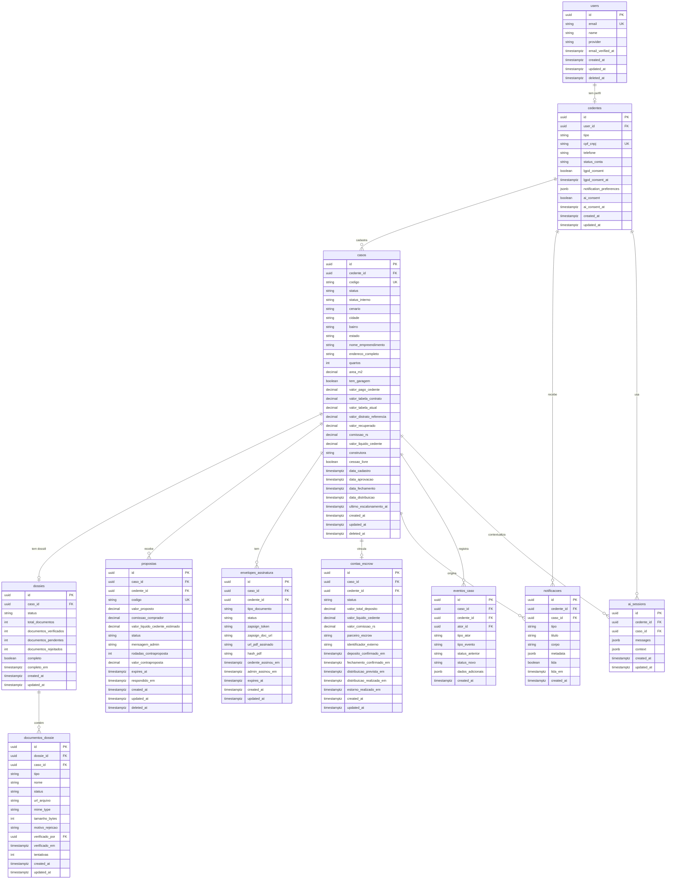

# 12 - Modelo de Dados (ERD / Schema)

## Módulo Cedente · Plataforma Repasse Seguro

| **Campo** | **Valor** |
|---|---|
| **Destinatário** | Tech Lead e Engenharia |
| **Escopo** | Modelo relacional completo · Entidades · Relacionamentos · Diagramas ERD · Índices e constraints |
| **Módulo** | Cedente |
| **Versão** | v1.0 |
| **Responsável** | Claude Code Desktop |
| **Data** | 2026-03-23 (America/Fortaleza) |

---

> **TL;DR**
>
> - O modelo de dados cobre 11 tabelas principais: users, cedentes, casos, dossies, documentos_dossie, propostas, envelopes_assinatura, contas_escrow, notificacoes, eventos_caso, ai_sessions.
> - Toda tabela de domínio usa UUID v4 como PK, `created_at`/`updated_at` em Timestamptz, e soft delete via `deleted_at` nas tabelas principais.
> - RLS habilitado em todas as tabelas com dados de usuários — filtro por `cedente_id` garante isolamento total entre Cedentes (RN-011).
> - A tabela `propostas` nunca expõe `cessionario_id` ao frontend do Cedente — anonimização estrutural obrigatória (RN-012, RN-085).
> - A tabela `casos` é a entidade central do módulo: todas as demais entidades de domínio se relacionam com ela.
> - Extensão `pgcrypto` habilitada para geração de UUIDs. Sem dependência de `pgvector` neste módulo (RAG é no Guardião, baseado em dados de produto, não em embeddings de entidades do Cedente).

---

## 1. Diagrama ERD — Entidades e Relacionamentos

---

## 2. Detalhamento das Tabelas

### 2.1 `users`

Tabela gerenciada pelo Supabase Auth. Dados de autenticação base — compartilhada entre módulos via schema público.

| **Coluna** | **Tipo** | **Constraints** | **Descrição** |
|---|---|---|---|
| `id` | `UUID` | PK, DEFAULT gen_random_uuid() | Identificador único gerado pelo Supabase Auth |
| `email` | `VARCHAR(255)` | NOT NULL, UNIQUE | E-mail de autenticação (RN-001) |
| `name` | `VARCHAR(255)` | NOT NULL | Nome completo do usuário |
| `provider` | `VARCHAR(50)` | NOT NULL, DEFAULT 'email' | Provedor de autenticação: 'email' |
| `email_verified_at` | `TIMESTAMPTZ` | NULL | Data de verificação do e-mail (RN-002) |
| `created_at` | `TIMESTAMPTZ` | NOT NULL, DEFAULT now() | Criação do registro |
| `updated_at` | `TIMESTAMPTZ` | NOT NULL | Última atualização |
| `deleted_at` | `TIMESTAMPTZ` | NULL | Soft delete (exclusão LGPD — RN-010) |

**Índices:**
- `idx_users_email` ON email (busca por e-mail no login)
- `idx_users_deleted_at` ON deleted_at WHERE deleted_at IS NULL (excluir registros deletados das buscas)

---

### 2.2 `cedentes`

Perfil estendido do Cedente. Contém dados de PF (CPF) e PJ (CNPJ), estado da conta, consentimentos LGPD e IA, e preferências de notificação.

| **Coluna** | **Tipo** | **Constraints** | **Descrição** |
|---|---|---|---|
| `id` | `UUID` | PK, DEFAULT gen_random_uuid() | Identificador único do Cedente |
| `user_id` | `UUID` | FK users.id, NOT NULL, UNIQUE | Vínculo 1-1 com users (um user = um Cedente) |
| `tipo` | `ENUM(PF, PJ)` | NOT NULL | Tipo de pessoa: física ou jurídica (RN-001) |
| `cpf_cnpj` | `VARCHAR(18)` | NOT NULL, UNIQUE | CPF (11 dígitos) ou CNPJ (14 dígitos) validado (RN-001) |
| `telefone` | `VARCHAR(20)` | NULL | Telefone com DDD |
| `telefone_verificado_em` | `TIMESTAMPTZ` | NULL | Data de verificação do telefone |
| `status_conta` | `ENUM` | NOT NULL, DEFAULT 'PENDENTE_ATIVACAO' | Estado da conta: PENDENTE_ATIVACAO, ATIVA, BLOQUEADA, ENCERRADA (RN-001, RN-009, RN-010) |
| `bloqueada_ate` | `TIMESTAMPTZ` | NULL | Desbloqueio após tentativas de login (RN-005) |
| `tentativas_login` | `INT` | NOT NULL, DEFAULT 0 | Contagem de tentativas falhas na janela atual (RN-005) |
| `representante_legal_nome` | `VARCHAR(255)` | NULL | Somente PJ — nome do representante (RN-069) |
| `representante_legal_cpf` | `VARCHAR(11)` | NULL | Somente PJ — CPF do representante |
| `lgpd_consent` | `BOOLEAN` | NOT NULL, DEFAULT false | Consentimento LGPD (RN-010) |
| `lgpd_consent_at` | `TIMESTAMPTZ` | NULL | Data do consentimento LGPD |
| `ai_consent` | `BOOLEAN` | NOT NULL, DEFAULT true | Consentimento para uso de dados pela IA (Guardião do Retorno) |
| `ai_consent_at` | `TIMESTAMPTZ` | NULL | Data do consentimento com IA |
| `notification_preferences` | `JSONB` | NOT NULL, DEFAULT '{"email": true, "push": true, "sms": false}' | Canais habilitados (RN-056, RN-057) |
| `created_at` | `TIMESTAMPTZ` | NOT NULL, DEFAULT now() | Criação do registro |
| `updated_at` | `TIMESTAMPTZ` | NOT NULL | Última atualização |

**Índices:**
- `idx_cedentes_user_id` ON user_id
- `idx_cedentes_cpf_cnpj` ON cpf_cnpj (busca e validação de duplicidade — RN-001)
- `idx_cedentes_status_conta` ON status_conta

**Políticas RLS:**
- `SELECT` — Cedente vê apenas sua própria linha (`cedente_id = auth.uid()`)
- `UPDATE` — Cedente pode atualizar apenas sua própria linha (exceto campos imutáveis: cpf_cnpj)

---

### 2.3 `casos`

Entidade central do módulo. Representa cada imóvel cadastrado pelo Cedente. Contém o ciclo de vida completo com 13 estados visíveis e os dados de cálculo de cenário e comissão.

| **Coluna** | **Tipo** | **Constraints** | **Descrição** |
|---|---|---|---|
| `id` | `UUID` | PK, DEFAULT gen_random_uuid() | Identificador único do caso |
| `cedente_id` | `UUID` | FK cedentes.id, NOT NULL | Cedente proprietário do caso |
| `codigo` | `VARCHAR(20)` | NOT NULL, UNIQUE | Código legível: CAS-2026-XXXX |
| `status` | `ENUM` | NOT NULL, DEFAULT 'CADASTRO_REALIZADO' | Status visível ao Cedente (13 estados — RN-006, seção 6 do D01.1) |
| `status_interno` | `ENUM` | NOT NULL | Status interno do Admin (Captado, Em Triagem, Qualificado, Oferta Ativa, Em Negociação, Em Formalização, Fechamento, Pós Fechamento, Em Reversão, Em Mediação, Concluído, Cancelado) |
| `cenario` | `ENUM(A, B, C, D)` | NULL | Cenário de retorno escolhido pelo Cedente (RN-022) |
| `cenario_ativo_desde` | `TIMESTAMPTZ` | NULL | Data em que o cenário atual foi definido |
| `cidade` | `VARCHAR(100)` | NOT NULL | Cidade do imóvel |
| `bairro` | `VARCHAR(100)` | NOT NULL | Bairro do imóvel |
| `estado` | `VARCHAR(2)` | NOT NULL | UF do imóvel |
| `nome_empreendimento` | `VARCHAR(200)` | NOT NULL | Nome do empreendimento/condomínio |
| `endereco_completo` | `VARCHAR(500)` | NOT NULL | Endereço completo (usado para verificação de duplicidade — RN-090) |
| `quartos` | `INT` | NOT NULL | Número de quartos |
| `area_m2` | `DECIMAL(8,2)` | NOT NULL | Área em m² |
| `tem_garagem` | `BOOLEAN` | NOT NULL, DEFAULT false | Indicador de vaga de garagem |
| `construtora` | `VARCHAR(200)` | NULL | Nome da construtora |
| `cessao_livre` | `BOOLEAN` | NOT NULL, DEFAULT false | Contrato permite cessão sem anuência (RN-064) |
| `valor_pago_cedente` | `DECIMAL(15,2)` | NULL | Total pago pelo Cedente até o momento |
| `valor_tabela_contrato` | `DECIMAL(15,2)` | NULL | Valor de tabela no contrato original |
| `valor_tabela_atual` | `DECIMAL(15,2)` | NULL | Valor de tabela atual do imóvel |
| `valor_distrato_referencia` | `DECIMAL(15,2)` | GENERATED (50% do valor_pago_cedente) | Referência para cálculo de comissão (RN-021) |
| `valor_recuperado` | `DECIMAL(15,2)` | NULL | Valor confirmado no Fechamento |
| `comissao_rs` | `DECIMAL(15,2)` | NULL | Comissão calculada pelo Repasse Seguro |
| `valor_liquido_cedente` | `DECIMAL(15,2)` | NULL | Valor líquido após comissão |
| `simulador_visualizado` | `BOOLEAN` | NOT NULL, DEFAULT false | Cedente visualizou o simulador por 10s (RN-021) |
| `simulador_visualizado_em` | `TIMESTAMPTZ` | NULL | Data em que o simulador foi visualizado |
| `rascunho` | `BOOLEAN` | NOT NULL, DEFAULT true | Wizard não concluído (RN-023) |
| `rascunho_expira_em` | `TIMESTAMPTZ` | NULL | Expira 30 dias após início (RN-023) |
| `ultimo_escalonamento_at` | `TIMESTAMPTZ` | NULL | Data do último escalonamento (cooldown 7 dias — RN-027) |
| `escalonamento_enfileirado` | `BOOLEAN` | NOT NULL, DEFAULT false | Escalonamento pendente durante negociação (RN-025) |
| `data_cadastro` | `TIMESTAMPTZ` | NULL | Quando o Cedente confirmou o cadastro |
| `data_aprovacao` | `TIMESTAMPTZ` | NULL | Quando o Admin aprovou para oferta |
| `data_fechamento` | `TIMESTAMPTZ` | NULL | Quando o Fechamento foi confirmado |
| `distribuicao_prevista_em` | `TIMESTAMPTZ` | NULL | 15 dias corridos após data_fechamento (RN-053) |
| `data_distribuicao` | `TIMESTAMPTZ` | NULL | Quando os valores foram distribuídos |
| `desistencia_solicitada_em` | `TIMESTAMPTZ` | NULL | Data da solicitação de desistência (RN-039) |
| `motivo_cancelamento` | `TEXT` | NULL | Motivo informado pelo Cedente ao cancelar (RN-055) |
| `created_at` | `TIMESTAMPTZ` | NOT NULL, DEFAULT now() | Criação do registro |
| `updated_at` | `TIMESTAMPTZ` | NOT NULL | Última atualização |
| `deleted_at` | `TIMESTAMPTZ` | NULL | Soft delete |

**Índices:**
- `idx_casos_cedente_id` ON cedente_id (filtro principal de RLS)
- `idx_casos_status` ON status (listagem por status)
- `idx_casos_codigo` ON codigo (busca por código)
- `idx_casos_endereco_completo` ON endereco_completo (validação de duplicidade — RN-090)
- `idx_casos_rascunho_expira` ON rascunho_expira_em WHERE rascunho = true (job de descarte — RN-023)
- `idx_casos_status_interno` ON status_interno (dashboard do Admin)

**Políticas RLS:**
- `SELECT` — Cedente vê apenas casos onde `cedente_id = auth.uid()`
- `INSERT` — Cedente só pode criar casos vinculados ao seu próprio `cedente_id`
- `UPDATE` — Cedente pode atualizar apenas campos permitidos (não pode alterar status, cenário pós-lock, comissão)

---

### 2.4 `dossies`

Criado automaticamente pelo sistema quando um Caso é criado. Agrupa o estado geral do dossiê e os contadores de documentos.

| **Coluna** | **Tipo** | **Constraints** | **Descrição** |
|---|---|---|---|
| `id` | `UUID` | PK | Identificador único |
| `caso_id` | `UUID` | FK casos.id, NOT NULL, UNIQUE | Relação 1-1 com caso |
| `status` | `ENUM` | NOT NULL, DEFAULT 'INCOMPLETO' | INCOMPLETO, COMPLETO, EM_ANALISE |
| `total_documentos` | `INT` | NOT NULL | 6 (PF) ou 8 (PJ) documentos obrigatórios (RN-041, RN-070) |
| `documentos_verificados` | `INT` | NOT NULL, DEFAULT 0 | Contador atualizado automaticamente |
| `documentos_pendentes` | `INT` | NOT NULL | Calculado: total - verificados - rejeitados - em_analise |
| `documentos_em_analise` | `INT` | NOT NULL, DEFAULT 0 | Documentos enviados aguardando revisão |
| `documentos_rejeitados` | `INT` | NOT NULL, DEFAULT 0 | Documentos com status Rejeitado |
| `completo` | `BOOLEAN` | NOT NULL, DEFAULT false | true quando todos verificados ou em análise (RN-043) |
| `completo_em` | `TIMESTAMPTZ` | NULL | Data em que o dossiê atingiu completude |
| `created_at` | `TIMESTAMPTZ` | NOT NULL, DEFAULT now() | Criação do registro |
| `updated_at` | `TIMESTAMPTZ` | NOT NULL | Última atualização |

**Índices:**
- `idx_dossies_caso_id` ON caso_id
- `idx_dossies_status` ON status

---

### 2.5 `documentos_dossie`

Representa cada documento individual do dossiê. Um dossiê PF tem 6 documentos; um dossiê PJ tem 8 documentos. Cada documento tem ciclo de vida próprio: Pendente → Em Análise → Verificado | Rejeitado.

| **Coluna** | **Tipo** | **Constraints** | **Descrição** |
|---|---|---|---|
| `id` | `UUID` | PK | Identificador único |
| `dossie_id` | `UUID` | FK dossies.id, NOT NULL | Dossiê ao qual pertence |
| `caso_id` | `UUID` | FK casos.id, NOT NULL | Redundância para joins diretos |
| `tipo` | `ENUM` | NOT NULL | CONTRATO_ORIGINAL, COMPROVANTE_PAGAMENTO_1, COMPROVANTE_PAGAMENTO_2, COMPROVANTE_PAGAMENTO_3, DECLARACAO_ADIMPLENCIA, DOCUMENTO_IDENTIDADE, COMPROVANTE_ENDERECO, TABELA_CONTRATO, CONTRATO_SOCIAL (PJ), PROCURACAO (PJ) |
| `nome` | `VARCHAR(255)` | NOT NULL | Nome descritivo para exibição |
| `status` | `ENUM` | NOT NULL, DEFAULT 'PENDENTE' | PENDENTE, EM_ANALISE, VERIFICADO, REJEITADO (RN-041) |
| `url_arquivo` | `VARCHAR(1000)` | NULL | Signed URL no Supabase Storage |
| `storage_path` | `VARCHAR(500)` | NULL | Caminho interno no Supabase Storage |
| `mime_type` | `VARCHAR(100)` | NULL | MIME type real do arquivo (RN-042) |
| `tamanho_bytes` | `INT` | NULL | Tamanho do arquivo em bytes (máx. 10 MB = 10.485.760 bytes) |
| `motivo_rejeicao` | `TEXT` | NULL | Motivo preenchido pelo Analista (RN-045) |
| `verificado_por` | `UUID` | FK users.id, NULL | ID do Admin que verificou |
| `verificado_em` | `TIMESTAMPTZ` | NULL | Data da verificação ou rejeição |
| `tentativas` | `INT` | NOT NULL, DEFAULT 0 | Número de versões enviadas (histórico RN-045) |
| `imutavel` | `BOOLEAN` | NOT NULL, DEFAULT false | true quando status = VERIFICADO (RN-044) |
| `created_at` | `TIMESTAMPTZ` | NOT NULL, DEFAULT now() | Criação do registro |
| `updated_at` | `TIMESTAMPTZ` | NOT NULL | Última atualização |

**Índices:**
- `idx_documentos_dossie_dossie_id` ON dossie_id
- `idx_documentos_dossie_caso_id` ON caso_id
- `idx_documentos_dossie_status` ON status
- `idx_documentos_dossie_tipo` ON tipo

---

### 2.6 `propostas`

Armazena propostas recebidas de Cessionários, mediadas pelo Admin. O Cedente nunca vê `cessionario_id` — a anonimização é estrutural nesta tabela.

| **Coluna** | **Tipo** | **Constraints** | **Descrição** |
|---|---|---|---|
| `id` | `UUID` | PK | Identificador único |
| `caso_id` | `UUID` | FK casos.id, NOT NULL | Caso ao qual a proposta se refere |
| `cedente_id` | `UUID` | FK cedentes.id, NOT NULL | Cedente que recebe a proposta (para RLS) |
| `codigo` | `VARCHAR(20)` | NOT NULL, UNIQUE | Código: PRP-2026-XXXX |
| `valor_proposto` | `DECIMAL(15,2)` | NOT NULL | Valor oferecido pelo Cessionário |
| `comissao_comprador` | `DECIMAL(15,2)` | NOT NULL | Comissão devida pelo Cessionário |
| `valor_liquido_cedente_estimado` | `DECIMAL(15,2)` | NOT NULL | Valor líquido estimado para o Cedente com esta proposta |
| `status` | `ENUM` | NOT NULL, DEFAULT 'RECEBIDA' | RECEBIDA, VISUALIZADA, EM_NEGOCIACAO, ACEITA, RECUSADA, CONTRAPROPOSTA_ENVIADA, EXPIRADA, SUPERADA, CANCELADA (RN-030, RN-031, RN-032, RN-033) |
| `mensagem_admin` | `TEXT` | NULL | Contexto adicional adicionado pelo Admin ao apresentar a proposta |
| `rodadas_contraproposta` | `INT` | NOT NULL, DEFAULT 0 | Número de rodadas de negociação (máx. 3 — RN-037) |
| `valor_contraproposta` | `DECIMAL(15,2)` | NULL | Última contraproposta do Cedente (RN-035) |
| `motivo_recusa` | `TEXT` | NULL | Motivo da recusa pelo Cedente |
| `expires_at` | `TIMESTAMPTZ` | NULL | Prazo para resposta (5 dias úteis — RN-031) |
| `respondido_em` | `TIMESTAMPTZ` | NULL | Data da resposta do Cedente |
| `created_at` | `TIMESTAMPTZ` | NOT NULL, DEFAULT now() | Criação do registro |
| `updated_at` | `TIMESTAMPTZ` | NOT NULL | Última atualização |
| `deleted_at` | `TIMESTAMPTZ` | NULL | Soft delete |

**Índices:**
- `idx_propostas_caso_id` ON caso_id
- `idx_propostas_cedente_id` ON cedente_id (RLS)
- `idx_propostas_status` ON status
- `idx_propostas_expires_at` ON expires_at WHERE status IN ('RECEBIDA', 'EM_NEGOCIACAO') (job de expiração — RN-031)

**Restrição de segurança:**
- A coluna `cessionario_id` não existe nesta tabela. O vínculo com o Cessionário é mantido exclusivamente no módulo Admin — jamais exposto ao Cedente (RN-085).

---

### 2.7 `envelopes_assinatura`

Representa cada documento enviado para assinatura eletrônica via ZapSign. O Cedente assina: Termo de Cadastro, Termo de Aceite de Escalonamento, Termo Comercial e Instrumento de Cessão.

| **Coluna** | **Tipo** | **Constraints** | **Descrição** |
|---|---|---|---|
| `id` | `UUID` | PK | Identificador único |
| `caso_id` | `UUID` | FK casos.id, NOT NULL | Caso ao qual o documento pertence |
| `cedente_id` | `UUID` | FK cedentes.id, NOT NULL | Cedente que assina (para RLS) |
| `tipo_documento` | `ENUM` | NOT NULL | TERMO_CADASTRO, TERMO_ACEITE_ESCALONAMENTO, TERMO_COMERCIAL, INSTRUMENTO_CESSAO (RN-024, RN-025, RN-047) |
| `status` | `ENUM` | NOT NULL, DEFAULT 'PENDENTE' | PENDENTE, ASSINADO_CEDENTE, ASSINADO_ADMIN, CONCLUIDO, CANCELADO (RN-047, RN-049) |
| `zapsign_token` | `VARCHAR(255)` | NULL | Token do documento no ZapSign |
| `zapsign_doc_url` | `VARCHAR(1000)` | NULL | URL do documento no ZapSign para iframe |
| `url_pdf_assinado` | `VARCHAR(1000)` | NULL | URL do PDF final com certificado (Supabase Storage) |
| `hash_pdf` | `VARCHAR(64)` | NULL | SHA-256 do PDF assinado (rastreabilidade — RN-081) |
| `versao_documento` | `INT` | NOT NULL, DEFAULT 1 | Incrementa ao cancelar e recriar (RN-049) |
| `cedente_assinou_em` | `TIMESTAMPTZ` | NULL | Timestamp da assinatura do Cedente |
| `admin_assinou_em` | `TIMESTAMPTZ` | NULL | Timestamp da assinatura do Admin |
| `lembrete_3du_enviado` | `BOOLEAN` | NOT NULL, DEFAULT false | Lembrete enviado após 3 dias úteis (RN-050) |
| `alerta_admin_10du_enviado` | `BOOLEAN` | NOT NULL, DEFAULT false | Alerta ao Admin após 10 dias úteis (RN-050) |
| `expires_at` | `TIMESTAMPTZ` | NULL | Prazo para assinatura |
| `created_at` | `TIMESTAMPTZ` | NOT NULL, DEFAULT now() | Criação do registro |
| `updated_at` | `TIMESTAMPTZ` | NOT NULL | Última atualização |

**Índices:**
- `idx_envelopes_caso_id` ON caso_id
- `idx_envelopes_cedente_id` ON cedente_id (RLS)
- `idx_envelopes_status` ON status WHERE status = 'PENDENTE'
- `idx_envelopes_zapsign_token` ON zapsign_token (callback do ZapSign — RN-080)

---

### 2.8 `contas_escrow`

Representa a conta garantia vinculada ao caso. Criada automaticamente quando o caso avança para "Em formalização". O Cedente tem acesso somente leitura a esta entidade (RN-051).

| **Coluna** | **Tipo** | **Constraints** | **Descrição** |
|---|---|---|---|
| `id` | `UUID` | PK | Identificador único |
| `caso_id` | `UUID` | FK casos.id, NOT NULL, UNIQUE | Relação 1-1 com caso |
| `cedente_id` | `UUID` | FK cedentes.id, NOT NULL | Cedente vinculado (para RLS) |
| `status` | `ENUM` | NOT NULL, DEFAULT 'ABERTA' | ABERTA, DEPOSITO_CONFIRMADO, EM_PERIODO_REVERSAO, VALORES_DISTRIBUIDOS, ESTORNADA (RN-083) |
| `valor_total_deposito` | `DECIMAL(15,2)` | NULL | Valor total depositado pelo Cessionário |
| `valor_liquido_cedente` | `DECIMAL(15,2)` | NULL | Valor que o Cedente receberá (confirmado no Fechamento) |
| `valor_comissao_rs` | `DECIMAL(15,2)` | NULL | Comissão devida ao Repasse Seguro |
| `parceiro_escrow` | `VARCHAR(100)` | NULL | Nome do parceiro (a definir — DP-001) |
| `identificador_externo` | `VARCHAR(255)` | NULL | ID da transação no sistema do parceiro |
| `deposito_confirmado_em` | `TIMESTAMPTZ` | NULL | Data de confirmação do depósito |
| `fechamento_confirmado_em` | `TIMESTAMPTZ` | NULL | Data de confirmação do Fechamento (início do período de reversão) |
| `distribuicao_prevista_em` | `TIMESTAMPTZ` | GENERATED (fechamento + 15 dias) | Data prevista de distribuição automática (RN-053) |
| `distribuicao_realizada_em` | `TIMESTAMPTZ` | NULL | Data da distribuição efetiva |
| `estorno_realizado_em` | `TIMESTAMPTZ` | NULL | Data do estorno (desistência aceita) |
| `ultimo_status_externo_em` | `TIMESTAMPTZ` | NULL | Última atualização recebida do parceiro (RN-083) |
| `created_at` | `TIMESTAMPTZ` | NOT NULL, DEFAULT now() | Criação do registro |
| `updated_at` | `TIMESTAMPTZ` | NOT NULL | Última atualização |

**Índices:**
- `idx_contas_escrow_caso_id` ON caso_id
- `idx_contas_escrow_cedente_id` ON cedente_id (RLS)
- `idx_contas_escrow_status` ON status
- `idx_contas_escrow_distribuicao` ON distribuicao_prevista_em WHERE status = 'EM_PERIODO_REVERSAO' (job de distribuição automática — RN-083)

---

### 2.9 `notificacoes`

Registra todas as notificações enviadas ao Cedente via e-mail e painel. Controladas pelas 17 regras de notificação (RN-056) e pela atualização em tempo real via Supabase Realtime (RN-057).

| **Coluna** | **Tipo** | **Constraints** | **Descrição** |
|---|---|---|---|
| `id` | `UUID` | PK | Identificador único |
| `cedente_id` | `UUID` | FK cedentes.id, NOT NULL | Destinatário da notificação |
| `caso_id` | `UUID` | FK casos.id, NULL | Caso relacionado (se aplicável) |
| `tipo` | `ENUM` | NOT NULL | CONTA_ATIVADA, CASO_EM_ANALISE, PENDENCIA_IDENTIFICADA, APROVADO_OFERTA, PROPOSTA_RECEBIDA, PROPOSTA_EXPIRADA, PROPOSTA_ACEITA, EM_FORMALIZACAO, ASSINATURA_PENDENTE, NEGOCIO_FECHADO, AGUARDANDO_LIBERACAO, CONCLUIDO, CANCELADO, DOCUMENTO_REJEITADO, LEMBRETE_DOCUMENTO, ESCALONAMENTO_CONCLUIDO, ESTORNO_PROCESSADO |
| `titulo` | `VARCHAR(255)` | NOT NULL | Título da notificação |
| `corpo` | `TEXT` | NOT NULL | Corpo da mensagem |
| `metadata` | `JSONB` | NULL | Dados adicionais (ex: valor, data, link) |
| `canal_email_enviado` | `BOOLEAN` | NOT NULL, DEFAULT false | E-mail disparado |
| `canal_push_enviado` | `BOOLEAN` | NOT NULL, DEFAULT false | Push enviado (mobile) |
| `lida` | `BOOLEAN` | NOT NULL, DEFAULT false | Notificação lida no painel |
| `lida_em` | `TIMESTAMPTZ` | NULL | Timestamp da leitura |
| `created_at` | `TIMESTAMPTZ` | NOT NULL, DEFAULT now() | Criação do registro |

**Índices:**
- `idx_notificacoes_cedente_id` ON cedente_id
- `idx_notificacoes_caso_id` ON caso_id
- `idx_notificacoes_lida` ON lida WHERE lida = false (badge de não lidas — RN-057)
- `idx_notificacoes_tipo` ON tipo

---

### 2.10 `eventos_caso`

Log imutável de eventos do caso. Registra todas as transições de estado, escalonamentos e ações relevantes com dados antes/depois. Não pode ser deletado ou editado.

| **Coluna** | **Tipo** | **Constraints** | **Descrição** |
|---|---|---|---|
| `id` | `UUID` | PK | Identificador único |
| `caso_id` | `UUID` | FK casos.id, NOT NULL | Caso ao qual o evento pertence |
| `cedente_id` | `UUID` | FK cedentes.id, NOT NULL | Cedente do caso (para RLS) |
| `ator_id` | `UUID` | FK users.id, NULL | Quem realizou a ação (NULL = Sistema) |
| `tipo_ator` | `ENUM` | NOT NULL | CEDENTE, ADMIN, SISTEMA |
| `tipo_evento` | `VARCHAR(100)` | NOT NULL | Ex: STATUS_MUDADO, CENARIO_ALTERADO, DOCUMENTO_VERIFICADO, PROPOSTA_RECEBIDA |
| `status_anterior` | `VARCHAR(100)` | NULL | Status do caso antes do evento |
| `status_novo` | `VARCHAR(100)` | NULL | Status do caso após o evento |
| `cenario_anterior` | `VARCHAR(1)` | NULL | Cenário antes de escalonamento |
| `cenario_novo` | `VARCHAR(1)` | NULL | Cenário após escalonamento |
| `dados_adicionais` | `JSONB` | NULL | Contexto adicional do evento (valores, motivos, etc.) |
| `created_at` | `TIMESTAMPTZ` | NOT NULL, DEFAULT now() | Timestamp do evento (imutável) |

**Restrição:** Nenhuma coluna desta tabela pode ser atualizada após inserção (`updated_at` não existe por design).

**Índices:**
- `idx_eventos_caso_id` ON caso_id
- `idx_eventos_cedente_id` ON cedente_id (RLS)
- `idx_eventos_tipo_evento` ON tipo_evento
- `idx_eventos_created_at` ON created_at DESC (timeline cronológica)

---

### 2.11 `ai_sessions`

Sessões de conversa com o Guardião do Retorno. Histórico permanente e imutável (RN-062). O contexto inclui o estado do caso no momento da conversa.

| **Coluna** | **Tipo** | **Constraints** | **Descrição** |
|---|---|---|---|
| `id` | `UUID` | PK | Identificador único da sessão |
| `cedente_id` | `UUID` | FK cedentes.id, NOT NULL | Cedente da sessão |
| `caso_id` | `UUID` | FK casos.id, NULL | Caso de contexto (se selecionado) |
| `messages` | `JSONB` | NOT NULL, DEFAULT '[]' | Array de mensagens {role, content, timestamp} |
| `context` | `JSONB` | NULL | Snapshot do estado do caso no início da sessão |
| `total_tokens` | `INT` | NULL | Total de tokens consumidos na sessão |
| `langfuse_trace_id` | `VARCHAR(255)` | NULL | ID de rastreamento no Langfuse (observabilidade) |
| `created_at` | `TIMESTAMPTZ` | NOT NULL, DEFAULT now() | Início da sessão |
| `updated_at` | `TIMESTAMPTZ` | NOT NULL | Última mensagem |

**Índices:**
- `idx_ai_sessions_cedente_id` ON cedente_id
- `idx_ai_sessions_caso_id` ON caso_id

---

## 3. Políticas de Row-Level Security (RLS)

O isolamento de dados entre Cedentes é implementado via RLS no PostgreSQL (Supabase). Esta é a implementação técnica das regras RN-011 (isolamento), RN-012 (anonimato do Cessionário) e RN-010 (LGPD).

### 3.1 Princípio Geral

Toda tabela que contém `cedente_id` tem uma política RLS que filtra automaticamente por `auth.uid()` (JWT do Supabase Auth). Nenhum Cedente pode visualizar, modificar ou deletar dados de outro Cedente — mesmo que conheça o UUID.

### 3.2 Tabela de Políticas por Entidade

| **Tabela** | **SELECT** | **INSERT** | **UPDATE** | **DELETE** |
|---|---|---|---|---|
| `users` | Próprio registro | Via Supabase Auth | Próprio registro (exceto email, provider) | Via Supabase Auth (soft delete) |
| `cedentes` | `user_id = auth.uid()` | `user_id = auth.uid()` | `user_id = auth.uid()` (exceto cpf_cnpj) | Bloqueado — via Admin |
| `casos` | `cedente_id = auth.uid()` | `cedente_id = auth.uid()` | `cedente_id = auth.uid()` (campos permitidos) | Soft delete via status |
| `dossies` | Via caso (join) | Sistema apenas | Sistema apenas | Bloqueado |
| `documentos_dossie` | `caso_id IN (casos do Cedente)` | `cedente_id = auth.uid()` | `cedente_id = auth.uid()` (somente se não imutável) | Bloqueado |
| `propostas` | `cedente_id = auth.uid()` | Sistema/Admin apenas | Sistema/Admin apenas | Bloqueado |
| `envelopes_assinatura` | `cedente_id = auth.uid()` | Sistema/Admin apenas | Sistema/Admin apenas (Cedente assina via ZapSign webhook) | Bloqueado |
| `contas_escrow` | `cedente_id = auth.uid()` | Sistema apenas | Sistema apenas | Bloqueado |
| `notificacoes` | `cedente_id = auth.uid()` | Sistema apenas | `cedente_id = auth.uid()` (marcar como lida) | Bloqueado |
| `eventos_caso` | `cedente_id = auth.uid()` | Sistema apenas | Bloqueado | Bloqueado |
| `ai_sessions` | `cedente_id = auth.uid()` | `cedente_id = auth.uid()` | `cedente_id = auth.uid()` | Bloqueado |

---

## 4. Retenção de Dados (LGPD)

Conforme RN-010 e diretrizes da Lei Geral de Proteção de Dados (Lei 13.709/2018):

| **Entidade** | **Retenção após Conclusão** | **Retenção após Cancelamento** | **Ação após prazo** |
|---|---|---|---|
| `users` | 10 anos | 5 anos | Anonimização dos campos pessoais (nome, e-mail substituídos por hash) |
| `cedentes` | 10 anos | 5 anos | Anonimização (cpf_cnpj, telefone, representante_legal_*) |
| `casos` | 10 anos | 5 anos | Arquivamento imutável (não deletar — base para compliance) |
| `documentos_dossie` | 10 anos | 5 anos | URLs expiradas no Storage; metadados preservados |
| `envelopes_assinatura` | 10 anos (validade jurídica) | 5 anos | PDFs preservados no Storage; metadados preservados |
| `contas_escrow` | 10 anos | 5 anos | Preservação integral para auditoria financeira |
| `eventos_caso` | Permanente | Permanente | Log imutável — nunca deletar |
| `ai_sessions` | 2 anos | 1 ano | Remoção do conteúdo das mensagens (preserva metadados) |
| `notificacoes` | 1 ano | 6 meses | Deleção física após prazo |

**Solicitação de exclusão LGPD (RN-010):** O Cedente pode solicitar exclusão dos seus dados. O Admin processa em até 15 dias corridos. A exclusão aplica anonimização nos campos pessoais identificáveis — os registros de caso e financeiros são preservados para obrigações legais.

---

## 5. Diagrama de Relacionamentos Detalhado (N-N e Cardinalidades)

| **Relacionamento** | **Cardinalidade** | **Regra de Negócio** |
|---|---|---|
| users → cedentes | 1:1 (obrigatório) | Um usuário tem exatamente um perfil de Cedente |
| cedentes → casos | 1:N | Cedente pode ter múltiplos casos (um ativo por imóvel — RN-090) |
| casos → dossies | 1:1 (obrigatório) | Cada caso tem exatamente um dossiê |
| dossies → documentos_dossie | 1:N | Um dossiê tem 6 (PF) ou 8 (PJ) documentos |
| casos → propostas | 1:N | Um caso pode receber múltiplas propostas; apenas 1 aceita |
| casos → envelopes_assinatura | 1:N | Um caso gera múltiplos envelopes (um por tipo de documento) |
| casos → contas_escrow | 1:1 (condicional) | Criada apenas ao atingir "Em formalização" |
| cedentes → notificacoes | 1:N | Cedente recebe múltiplas notificações |
| casos → notificacoes | 1:N | Caso origina múltiplas notificações ao longo do ciclo |
| casos → eventos_caso | 1:N | Log imutável de todas as transições e ações |
| cedentes → ai_sessions | 1:N | Cedente pode ter múltiplas sessões com o Guardião |
