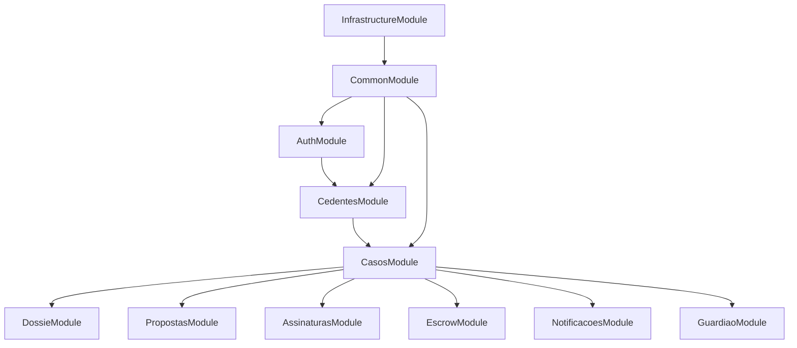
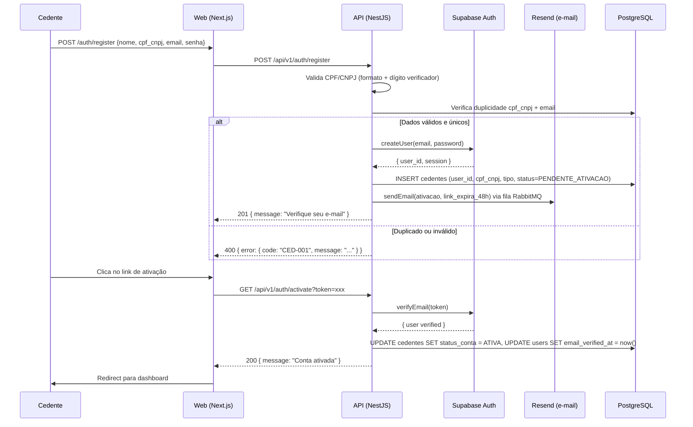
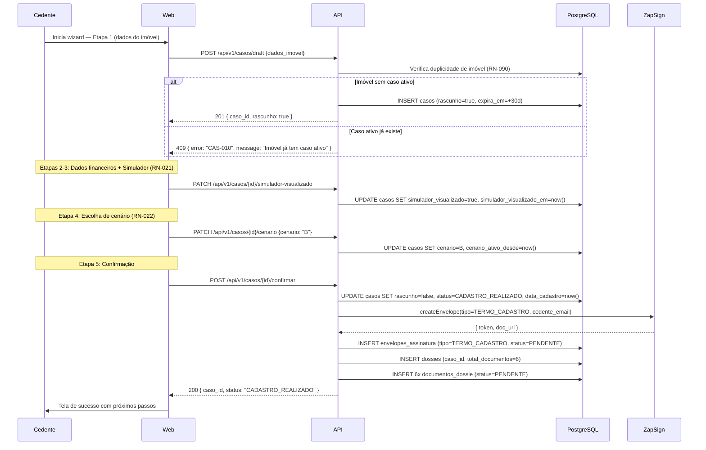
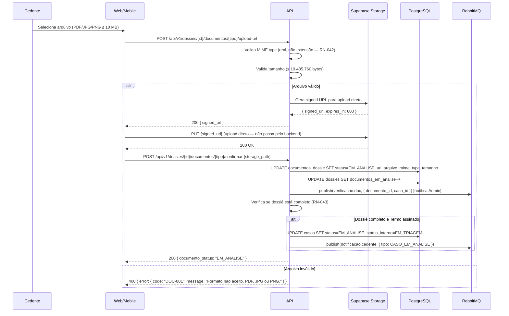
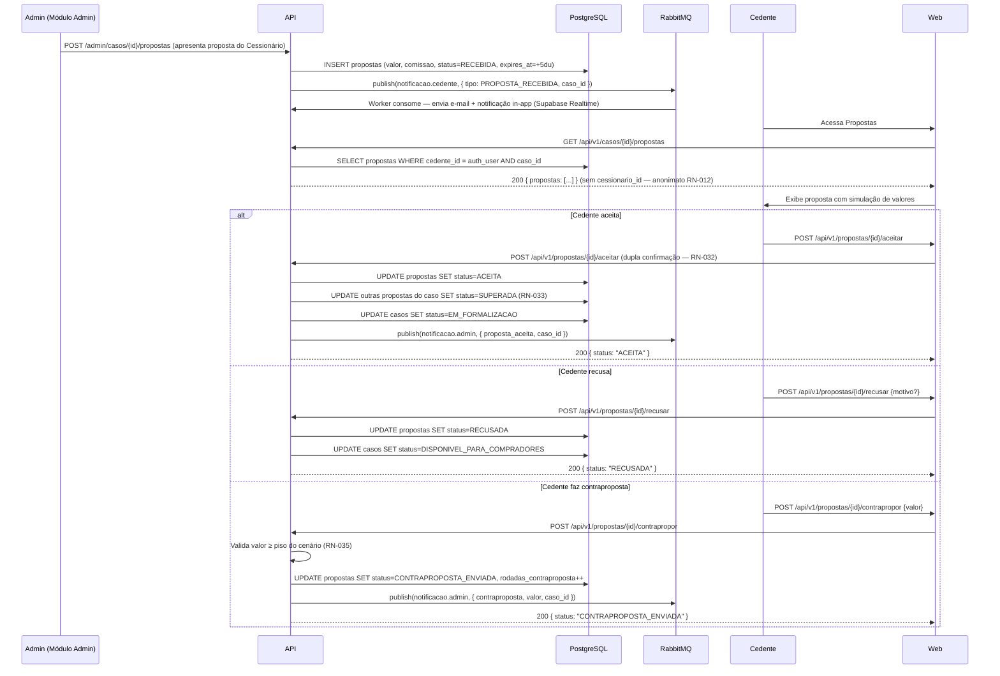
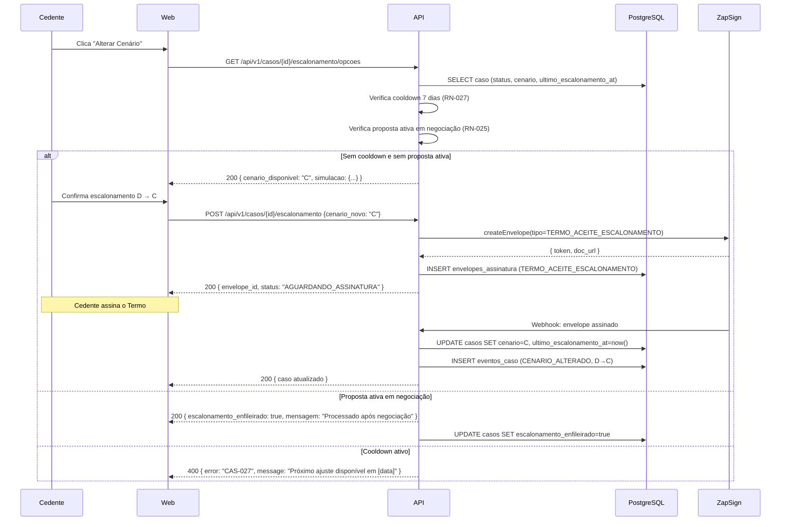
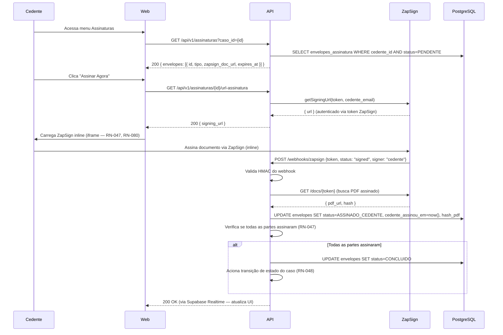
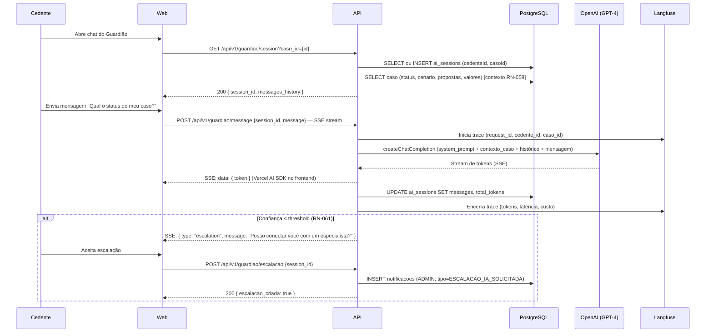

# 14 - Especificações Técnicas

## Módulo Cedente · Plataforma Repasse Seguro

| **Campo** | **Valor** |
|---|---|
| **Destinatário** | Arquitetura e Engenharia |
| **Escopo** | Arquitetura interna — módulos, fluxos críticos, containers, cache, filas e decisões arquiteturais |
| **Módulo** | Cedente |
| **Versão** | v1.0 |
| **Responsável** | Claude Code Desktop — Pipeline ShiftLabs v9.5 |
| **Data da versão** | 2026-03-23 (America/Fortaleza) |
| **Status** | Ativo |
| **Referências** | 01.1 a 01.5 - Regras de Negócio · 02 - Stacks · 12 - Modelo de Dados · 13 - Schema Prisma |

---

> **TL;DR**
>
> - **Padrão arquitetural:** Monorepo Turborepo com 3 workspaces — `apps/web-cedente` (Next.js 15 App Router), `apps/api` (NestJS 10 — módulos de domínio do Cedente), `apps/mobile-cedente` (Expo SDK 52 + React Native 0.76). Banco único PostgreSQL 17 via Supabase com Prisma 6.
> - **6 containers principais:** Web Next.js, Mobile Expo, Backend API NestJS, PostgreSQL (Supabase), Redis (Upstash), RabbitMQ (CloudAMQP) — mais 6 serviços externos.
> - **8 fluxos críticos documentados** com happy path + cenário de erro: Autenticação e ativação de conta, Cadastro de imóvel (wizard 5 etapas), Upload de dossiê, Recebimento e resposta de proposta, Escalonamento de cenário, Assinatura eletrônica ZapSign, Conta Escrow e financeiro, Guardião do Retorno (IA + SSE).
> - **Cache Redis (Upstash):** 7 recursos cacheados — sessão, rascunho de wizard, dados do caso, score de proposta, resultado de IA, notificações não lidas, rate limit. TTLs de 60s a 24h.
> - **Filas RabbitMQ (CloudAMQP):** 5 exchanges, 8 queues, DLQ em todas, retry com backoff exponencial (3 tentativas em 30 min).
> - **ADRs principais:** ADR-CED-001 (Next.js App Router para web pública + autenticada), ADR-CED-002 (SSE para streaming IA), ADR-CED-003 (confirmação manual do Escrow no MVP), ADR-CED-004 (upload direto Supabase Storage via signed URL).
> - **Isolamento total entre Cedentes** via RLS (RN-011). **Anonimato do Cessionário** garantido estruturalmente no modelo de dados (RN-012, RN-085).

---

## 1. Arquitetura Geral (C4 Nível 1)

### 1.1 Diagrama de Contexto

```mermaid
C4Context
    title Sistema Repasse Seguro — Módulo Cedente

    Person(cedente, "Cedente", "Pessoa física (CPF) ou jurídica (CNPJ) que cadastra imóvel e acompanha o repasse. Acessa via web e app mobile.")
    Person(admin, "Admin", "Operador interno. Triagem, publicação, negociação, formalização e fechamento.")

    System_Boundary(repasse, "Plataforma Repasse Seguro") {
        System(web_cedente, "Web Cedente", "Next.js 15 App Router. Painel self-service com sidebar. Rotas públicas (cadastro/login) + área logada.")
        System(mobile_cedente, "Mobile Cedente", "Expo SDK 52 + React Native 0.76. Upload por câmera, assinatura touch, notificações push.")
        System(api, "Backend API", "NestJS 10. Lógica de negócio, autenticação, integrações, módulos do Cedente.")
        SystemDb(db, "PostgreSQL 17", "Supabase. 11 tabelas, RLS por cedente_id, pgcrypto.")
        SystemDb(redis, "Redis", "Upstash. Cache, sessões, rate limiting, estado de wizard.")
        System(queue, "RabbitMQ", "CloudAMQP. Processamento assíncrono — e-mails, notificações, callbacks.")
    }

    System_Ext(supabase_auth, "Supabase Auth", "Autenticação, JWT, ativação por e-mail.")
    System_Ext(supabase_storage, "Supabase Storage", "Documentos do dossiê — PDF, JPG, PNG até 10 MB.")
    System_Ext(supabase_realtime, "Supabase Realtime", "Notificações em tempo real no painel (RN-057 — badge em até 30s).")
    System_Ext(zapsign, "ZapSign", "Assinatura eletrônica — Termo Cadastro, Escalonamento, Comercial, Instrumento.")
    System_Ext(receita_federal, "Receita Federal API", "Validação de CNPJ em tempo real (RN-082) — Cedente PJ.")
    System_Ext(escrow_parceiro, "Parceiro Escrow", "Conta garantia — depósito, distribuição, estorno. Parceiro a definir (DP-001).")
    System_Ext(resend, "Resend", "E-mail transacional — ativação, notificações, lembretes.")
    System_Ext(openai, "OpenAI", "GPT-4 + text-embedding-3-small para o Guardião do Retorno.")
    System_Ext(langfuse, "Langfuse", "Observabilidade de IA — tracing, custo, latência.")
    System_Ext(sentry, "Sentry", "Error tracking em todas as camadas.")
    System_Ext(posthog, "PostHog", "Analytics + session replay + feature flags.")

    Rel(cedente, web_cedente, "Usa", "HTTPS")
    Rel(cedente, mobile_cedente, "Usa", "HTTPS")
    Rel(web_cedente, api, "API REST + SSE", "HTTPS/JSON")
    Rel(mobile_cedente, api, "API REST", "HTTPS/JSON")
    Rel(api, db, "ORM (Prisma)", "PostgreSQL wire")
    Rel(api, redis, "Cache/Rate limit/Wizard", "Redis protocol")
    Rel(api, queue, "Publica/Consome", "AMQP 0-9-1")
    Rel(api, supabase_auth, "JWT validation + sign-up", "HTTPS")
    Rel(api, supabase_storage, "Signed URLs + MIME validation", "HTTPS")
    Rel(web_cedente, supabase_realtime, "Subscriptions notificações", "WebSocket")
    Rel(mobile_cedente, supabase_realtime, "Subscriptions push", "WebSocket")
    Rel(api, zapsign, "REST (criar envelope) + Webhook (callback)", "HTTPS")
    Rel(api, receita_federal, "REST (validação CNPJ)", "HTTPS")
    Rel(api, escrow_parceiro, "REST (status) + Webhook (eventos)", "HTTPS")
    Rel(api, resend, "SDK TypeScript", "HTTPS")
    Rel(api, openai, "SDK OpenAI 4.x", "HTTPS")
    Rel(api, langfuse, "SDK Langfuse 3.x", "HTTPS")
    Rel(web_cedente, sentry, "Error tracking", "HTTPS")
    Rel(mobile_cedente, sentry, "Error tracking", "HTTPS")
    Rel(api, sentry, "Error tracking", "HTTPS")
    Rel(web_cedente, posthog, "Analytics", "HTTPS")
    Rel(mobile_cedente, posthog, "Analytics", "HTTPS")
    Rel(admin, api, "Admin API (módulo admin)", "HTTPS/JSON")
```



### 1.2 Escopo do Módulo

O módulo Cedente abrange:

- **Frontend Web (Next.js 15):** rotas públicas `(public)/` (landing, cadastro, login, onboarding) e área logada `(authenticated)/` (dashboard, casos, documentos, propostas, assinaturas, financeiro, IA, perfil).
- **Frontend Mobile (Expo SDK 52):** funcionalidades críticas para mobile — upload por câmera, assinatura ZapSign touch, resposta a propostas, notificações push (RN-087).
- **Backend API (NestJS):** módulos `auth`, `cedentes`, `casos`, `dossie`, `documentos`, `propostas`, `assinaturas`, `escrow`, `notificacoes`, `guardiao` — dentro do app `apps/api`.
- **Banco (Supabase/PostgreSQL 17):** 11 tabelas, RLS habilitado em todas.
- **Cache (Redis/Upstash):** sessões, wizard, dados críticos, rate limiting.
- **Filas (RabbitMQ/CloudAMQP):** e-mails, notificações, callbacks ZapSign e Escrow.

**Fora do escopo:**
- Módulo Admin (painel interno de operação).
- Módulo Cessionário (marketplace, KYC, propostas do lado comprador).
- Infraestrutura Railway (coberta no D24 — Deploy CI/CD).

---

## 2. Módulos NestJS do Cedente

### 2.1 Diagrama de Módulos



### 2.2 Responsabilidades por Módulo

| **Módulo NestJS** | **Responsabilidade** | **Regras de Negócio** |
|---|---|---|
| `AuthModule` | Cadastro, ativação, login, logout, recuperação de senha, bloqueio por tentativas | RN-001 a RN-009 |
| `CedentesModule` | Perfil, LGPD, consentimentos, dados PJ, representante legal | RN-010 a RN-015, RN-069 a RN-071 |
| `CasosModule` | Ciclo de vida do caso, wizard de cadastro, cenários, escalonamento, cancelamento | RN-016 a RN-029, RN-055, RN-086, RN-090 |
| `DossieModule` | Checklist de documentos, upload, validação de MIME, lembretes de pendência | RN-041 a RN-046 |
| `PropostasModule` | Recebimento, visualização, aceite, recusa, contraproposta, timeout | RN-030 a RN-040 |
| `AssinaturasModule` | Integração ZapSign, geração de envelopes, rastreabilidade, alertas de prazo | RN-047 a RN-050, RN-080, RN-081 |
| `EscrowModule` | Status da conta Escrow, período de reversão, distribuição automática, estorno | RN-051 a RN-054, RN-083 |
| `NotificacoesModule` | Disparo por e-mail (Resend), notificações in-app (Supabase Realtime), 17 tipos | RN-056, RN-057 |
| `GuardiaoModule` | Chat IA (GPT-4), RAG, SSE streaming, escalação para humano, supervisão Admin | RN-058 a RN-063 |
| `AnuenciaModule` | Solicitação à construtora, anuência negada, inadimplência, extensão de prazo | RN-064 a RN-079 |
| `CommonModule` | Guards JWT, pipes de validação, interceptors, filtros de erro, logger Pino | Transversal |
| `InfrastructureModule` | Prisma Service, Redis Service, RabbitMQ Service, Supabase Storage Service | Transversal |

---

## 3. Fluxos Críticos

### 3.1 Fluxo de Autenticação e Ativação de Conta



### 3.2 Fluxo de Cadastro de Imóvel (Wizard 5 Etapas)



### 3.3 Fluxo de Upload de Documento do Dossiê



### 3.4 Fluxo de Recebimento e Resposta de Proposta



### 3.5 Fluxo de Escalonamento de Cenário



### 3.6 Fluxo de Assinatura ZapSign (inline)



### 3.7 Fluxo do Guardião do Retorno (IA + SSE)



---

## 4. Especificações de Performance

### 4.1 Metas de Latência

| **Operação** | **Meta p50** | **Meta p95** | **Meta p99** | **Regra** |
|---|---|---|---|---|
| GET /casos (lista) | < 80ms | < 200ms | < 500ms | Cache Redis 60s |
| GET /casos/{id} (detalhe) | < 60ms | < 150ms | < 300ms | Cache Redis 60s |
| POST /auth/login | < 100ms | < 300ms | < 800ms | Supabase Auth |
| POST /casos/draft (criar rascunho) | < 120ms | < 350ms | < 800ms | DB write + Redis |
| GET /propostas (lista) | < 80ms | < 200ms | < 500ms | Cache Redis 60s |
| POST /propostas/{id}/aceitar | < 150ms | < 400ms | < 1000ms | DB write + queue |
| GET /assinaturas/{id}/url-assinatura | < 200ms | < 500ms | < 1200ms | Chamada ZapSign |
| POST /guardiao/message (até 1º token SSE) | < 500ms | < 1200ms | < 3000ms | OpenAI API |
| Upload de documento (requisição backend) | < 100ms | < 300ms | < 600ms | Signed URL — upload vai direto ao Supabase Storage |
| Notificação in-app (Supabase Realtime) | < 2s | < 5s | < 10s | RN-057: badge em até 30s |
| Callback ZapSign (webhook) | < 200ms | < 500ms | — | Processado via fila RabbitMQ |
| Callback Escrow (webhook) | < 200ms | < 500ms | — | Processado via fila RabbitMQ |

### 4.2 Métricas de Disponibilidade

| **Serviço** | **SLA Alvo** | **Degradação Aceitável** |
|---|---|---|
| API Backend (NestJS/Railway) | 99,5% uptime | Read-only em manutenção |
| Supabase (PostgreSQL + Auth + Storage) | 99,9% (SLA Supabase) | Cache Redis como fallback para leituras |
| ZapSign | 99,0% (SLA ZapSign) | Fila de retry; Cedente notificado de indisponibilidade |
| Parceiro Escrow | Depende do parceiro (DP-001) | Último status cacheado + aviso "Atualizado em [hora]" (RN-083) |
| OpenAI (GPT-4) | 99,5% (SLA OpenAI) | Guardião exibe "Serviço momentaneamente indisponível" — sem fallback de modelo |
| Receita Federal API | Sem SLA público | Se indisponível: cadastro PJ permitido com aviso + verificação manual pelo Admin (RN-082) |

---

## 5. Segurança

### 5.1 Autenticação e Autorização

| **Mecanismo** | **Implementação** | **Regra** |
|---|---|---|
| JWT Bearer Token | Access token 15min (prod) / 30min (staging). Refresh token 30 dias, httpOnly cookie, rotacionado a cada uso | RN-001, RN-007 |
| Supabase Auth | Gerencia criação de conta, ativação por e-mail, recuperação de senha | RN-001 a RN-004 |
| Bloqueio por tentativas | 5 tentativas falhas → bloqueio 15 min. Controlado no campo `bloqueada_ate` da tabela `cedentes` | RN-005 |
| Row Level Security (RLS) | Filtro por `cedente_id = auth.uid()` em todas as tabelas. Garante isolamento absoluto entre Cedentes | RN-011 |
| Guards NestJS | `JwtAuthGuard` em todos os controllers da área logada. `RolesGuard` para endpoints exclusivos do Admin | Transversal |
| Anonimato do Cessionário | `cessionario_id` não existe na tabela `propostas` do módulo Cedente. Anonimização estrutural | RN-012, RN-085 |

### 5.2 Validação de Entrada

| **Validação** | **Implementação** | **Regra** |
|---|---|---|
| CPF | Algoritmo de dígito verificador no backend (não apenas formato) + `UNIQUE` no banco | RN-001 |
| CNPJ | Algoritmo de dígito verificador + consulta Receita Federal (on blur no frontend, confirmado no backend) | RN-001, RN-082 |
| MIME type de documentos | Backend valida tipo MIME real do arquivo (magic bytes), não apenas extensão declarada | RN-042 |
| Tamanho de arquivos | Validação no backend antes de gerar signed URL. Limite: 10.485.760 bytes (10 MB) | RN-042 |
| DTOs NestJS | `class-validator` + `class-transformer` em todos os endpoints. `ValidationPipe` global com `whitelist: true` | Transversal |
| Valores monetários | Inteiros em centavos na API. Validação de range (não-negativos, máximo razoável) | RN-035 |
| Webhook HMAC | Verificação de assinatura HMAC em todos os webhooks (ZapSign, Escrow) antes de processar | RN-080, RN-083 |

### 5.3 Rate Limiting

| **Endpoint / Grupo** | **Limite** | **Janela** | **Comportamento ao atingir** |
|---|---|---|---|
| `POST /auth/login` | 10 req | 15 min | 429 Too Many Requests — `error: AUTH-010` |
| `POST /auth/register` | 5 req | 1h | 429 Too Many Requests |
| `POST /auth/forgot-password` | 3 req | 1h | 429 Too Many Requests |
| `POST /dossies/{id}/documentos/*/upload-url` | 20 req | 10 min | 429 Too Many Requests — `error: DOC-010` |
| `POST /guardiao/message` | 20 req | 1 min | 429 Too Many Requests — `error: AI-010` |
| `POST /propostas/{id}/*` | 30 req | 5 min | 429 Too Many Requests |
| Demais endpoints (geral) | 100 req | 1 min | 429 Too Many Requests |

Implementado via `@nestjs/throttler` com Redis como store (Upstash).

---

## 6. LGPD e Privacidade

### 6.1 Dados Pessoais Coletados

| **Dado** | **Base Legal** | **Finalidade** | **Retenção** |
|---|---|---|---|
| Nome completo | Contrato | Identificação nas transações e documentos | 10 anos (caso concluído) / 5 anos (cancelado) |
| CPF/CNPJ | Contrato + Obrigação legal | Validação de identidade, documentos jurídicos | 10 anos |
| E-mail | Contrato | Comunicação e autenticação | 10 anos (anonimizado após prazo) |
| Telefone | Contrato | Notificações e contato | 10 anos |
| Endereço do imóvel | Contrato | Identificação da transação | 10 anos |
| Valores financeiros | Contrato + Obrigação legal | Cálculo de comissão, documentos | 10 anos (imutável) |
| Conversas com IA | Consentimento explícito | Assistência ao Cedente | 2 anos (concluído) / 1 ano (cancelado) |
| Logs de acesso | Interesse legítimo | Segurança e auditoria | 1 ano |

### 6.2 Direitos do Titular (RN-010)

| **Direito** | **Implementação** | **Prazo** |
|---|---|---|
| Acesso aos dados | GET /api/v1/cedentes/me/dados-pessoais — exportação JSON | Imediato |
| Portabilidade | GET /api/v1/cedentes/me/exportar — arquivo JSON/CSV | Até 15 dias corridos |
| Retificação | PATCH /api/v1/cedentes/me (exceto CPF/CNPJ) | Imediato |
| Exclusão | POST /api/v1/cedentes/me/solicitacao-exclusao → processado pelo Admin | Até 15 dias corridos (RN-010) |
| Revogação do consentimento IA | PATCH /api/v1/cedentes/me { ai_consent: false } | Imediato — histórico de conversas anonimizado |

### 6.3 Anonimização do Cessionário (RN-012, RN-085)

O isolamento entre Cedente e Cessionário é implementado em 3 camadas:

1. **Modelo de dados:** A tabela `propostas` no banco do Cedente não possui coluna `cessionario_id`. O vínculo existe apenas no módulo Admin.
2. **API:** Nenhum endpoint do módulo Cedente retorna dados identificadores do Cessionário.
3. **IA:** O Guardião do Retorno tem instrução explícita no system prompt para nunca revelar informações do Cessionário, mesmo que o Cedente pergunte diretamente.

---

## 7. Cache Redis (Upstash)

| **Recurso** | **Chave Redis** | **TTL** | **Estratégia de Invalidação** | **Regra** |
|---|---|---|---|---|
| Sessão JWT (blacklist) | `rs:cedente:session:blacklist:{jti}` | 30 dias | Expiração natural | RN-007 |
| Rascunho do wizard | `rs:cedente:wizard:{cedente_id}:{step}` | 30 dias | Ao confirmar cadastro ou descartar | RN-023 |
| Dados do caso (detalhe) | `rs:cedente:caso:{caso_id}` | 60s | Invalidação em qualquer UPDATE do caso | Todos os GET /casos/{id} |
| Lista de casos do Cedente | `rs:cedente:casos:{cedente_id}` | 60s | Invalidação em INSERT/UPDATE de caso | GET /casos |
| Notificações não lidas | `rs:cedente:notif:unread:{cedente_id}` | 30s | Invalidação ao criar notificação + ao marcar como lida | RN-057 |
| Proposta ativa (dados rápidos) | `rs:cedente:proposta:{proposta_id}` | 60s | Invalidação em qualquer UPDATE da proposta | GET /propostas/{id} |
| Rate limit geral | `rs:rl:general:{cedente_id}` | 60s | Deslizante (sliding window) | RN-005, Rate limiting |
| Rate limit auth | `rs:rl:auth:{ip}` | 15min | Fixo (fixed window) | RN-005 |

**Prefixo padrão:** `rs:cedente:` — diferencia do namespace do Cessionário (`rs:cessionario:`).

---

## 8. Filas RabbitMQ (CloudAMQP)

### 8.1 Exchanges e Queues

| **Exchange** | **Tipo** | **Queue** | **Consumidor** | **Regras** |
|---|---|---|---|---|
| `cedente.notifications` | direct | `cedente.email.queue` | Email Worker (Resend) | RN-056 — 17 tipos de notificação |
| `cedente.notifications` | direct | `cedente.push.queue` | Push Worker (Supabase Realtime) | RN-057 — badge em até 30s |
| `cedente.documents` | direct | `cedente.document.reminder.queue` | Reminder Worker | RN-046 — lembrete a cada 7 dias |
| `cedente.cases` | direct | `cedente.draft.expiry.queue` | Expiry Worker (cron) | RN-023 — descarte de rascunho após 30 dias |
| `cedente.escrow` | direct | `cedente.escrow.distribution.queue` | Distribution Worker | RN-083 — distribuição automática após 15 dias |
| `cedente.signatures` | direct | `cedente.signature.reminder.queue` | Signature Reminder Worker | RN-050 — lembrete 3 d.u. + alerta admin 10 d.u. |
| `cedente.webhooks` | direct | `cedente.zapsign.callback.queue` | ZapSign Callback Worker | RN-080, RN-081 |
| `cedente.webhooks` | direct | `cedente.escrow.callback.queue` | Escrow Callback Worker | RN-083 |

### 8.2 Configuração de Retry e DLQ

Todas as filas seguem a configuração padrão ShiftLabs v7.0:

- **Retry:** 3 tentativas com backoff exponencial: 1min → 5min → 15min.
- **DLQ:** `{queue_name}.dlq` — mensagens após 3 falhas vão para DLQ e geram alerta no Sentry.
- **Acknowledgment manual:** `noAck: false` — mensagem confirmada apenas após processamento bem-sucedido.
- **Mensagens idempotentes:** toda mensagem carrega `idempotency_key` para evitar processamento duplicado em retry.

---

## 9. Decisões Arquiteturais (ADRs)

### ADR-CED-001 — Next.js 15 App Router para Web Pública + Autenticada

**Contexto:** O módulo Cedente tem face pública (landing page, cadastro, login) com necessidade de SEO, e área logada (dashboard, wizard, propostas) com alta interatividade.

**Decisão:** Um único app Next.js 15 com App Router, dividido em route groups: `(public)/` para rotas públicas (Server Components com SSR) e `(authenticated)/` para a área logada (Client Components com TanStack Query).

**Alternativas descartadas:**
- Dois apps separados (Next.js público + React+Vite privado): duplicação de infra, CORS adicional, ausência de layouts compartilhados.
- SPA React+Vite puro: sem SSR para SEO das páginas públicas; penalidade no ranking de busca.

**Consequências:** Um único deploy no Vercel. Middleware Next.js faz redirecionamento para `/login` quando sessão ausente. Server Components no `(public)/` carregam dados no servidor antes de enviar HTML ao cliente.

---

### ADR-CED-002 — SSE para Streaming do Guardião do Retorno

**Contexto:** O Guardião usa GPT-4 via OpenAI, que retorna resposta como stream de tokens. O frontend precisa exibir os tokens progressivamente.

**Decisão:** Server-Sent Events (SSE) via API Route do Next.js + Vercel AI SDK no frontend para consumo do stream. O backend NestJS faz pipe do stream da OpenAI para o SSE.

**Alternativas descartadas:**
- WebSocket bidirecional: over-engineering para um canal essencialmente unidirecional (servidor → cliente para tokens).
- Polling: experiência ruim — tokens aparecem em blocos, não progressivamente.

**Consequências:** `Content-Type: text/event-stream` na rota `/api/v1/guardiao/message`. Conexão SSE encerrada ao final da resposta. Timeout de 60 segundos para respostas longas.

---

### ADR-CED-003 — Confirmação Manual do Depósito Escrow no MVP

**Contexto:** O parceiro Escrow ainda não está definido (DP-001). Sem API do parceiro, não é possível automatizar a confirmação de depósito.

**Decisão:** No MVP, a confirmação do depósito é realizada pelo Admin via painel interno, que atualiza o status da `ContaEscrow` para `DEPOSITO_CONFIRMADO`. O webhook do parceiro será integrado em versão posterior.

**Alternativas descartadas:**
- Bloquear o fluxo até o parceiro ser definido: impede go-live.
- Confirmação automática por upload de comprovante pelo Cessionário: sem validação real do depósito.

**Consequências:** Campo `parceiro_escrow` e `identificador_externo` na tabela `contas_escrow` ficam nulos no MVP. A arquitetura de webhook já está preparada no módulo `EscrowModule` para ser ativada quando o parceiro for definido.

---

### ADR-CED-004 — Upload de Documentos Direto ao Supabase Storage via Signed URL

**Contexto:** Documentos do dossiê têm até 10 MB. Fazer o upload passar pelo backend NestJS aumenta latência e consome memória do servidor.

**Decisão:** O backend gera uma signed URL temporária (600 segundos) para o Supabase Storage. O frontend faz o upload direto ao Storage sem passar pelo backend. Após o upload, o frontend notifica o backend com o `storage_path` para registrar no banco.

**Alternativas descartadas:**
- Upload via backend (multipart/form-data → NestJS → Storage): backend acumula arquivos em memória/disco durante upload; latência maior; consumo de bandwidth do Railway duplicado.

**Consequências:** Dois requests do frontend por documento (1. obter signed URL, 2. confirmar upload). A validação de MIME type real (magic bytes) ocorre na etapa de confirmação, quando o backend acessa o arquivo pelo `storage_path` antes de registrar.

---

## 10. Monitoramento e Observabilidade

### 10.1 Sentry — Error Tracking

- **Configuração:** `@sentry/nextjs` (web), `@sentry/react-native` (mobile), `@sentry/nestjs` (api).
- **Source maps:** obrigatórios em produção para stack traces legíveis.
- **Performance monitoring:** Transaction tracing em todos os endpoints.
- **Alertas:** P0 (5xx) → PagerDuty imediato. P1 (4xx em volume anormal) → Slack.

### 10.2 PostHog — Analytics

- **Wrapper centralizado:** `apps/web-cedente/src/services/analytics.ts` — único ponto de chamada.
- **Eventos em snake_case:** `caso_cadastrado`, `proposta_aceita`, `documento_enviado`, `guardiao_mensagem_enviada`.
- **Session replay:** habilitado para análise de UX e debugging de fluxos complexos.
- **Feature flags:** controle de rollout de novas funcionalidades sem deploy.

### 10.3 Langfuse — Observabilidade IA

- **Traces:** cada chamada ao GPT-4 gera um trace com `cedente_id`, `caso_id`, tokens consumidos, latência e custo estimado.
- **Alertas:** latência p95 > 3s, custo diário > threshold configurado, taxa de escalação para humano > 20%.
- **IDs vinculados:** `langfuse_trace_id` armazenado na tabela `ai_sessions` para correlação.

### 10.4 Logs Estruturados (Pino)

Todos os logs seguem o formato:

```json
{
  "level": "info",
  "timestamp": "2026-03-23T14:00:00.000Z",
  "requestId": "uuid-v4",
  "module": "CasosModule",
  "action": "confirmarCadastro",
  "cedenteId": "uuid",
  "casoId": "uuid",
  "durationMs": 145,
  "message": "Caso confirmado com sucesso"
}
```

Campos obrigatórios: `level`, `timestamp`, `requestId`, `module`, `action`. Campos opcionais: `cedenteId`, `casoId`, `durationMs`, `error`.
