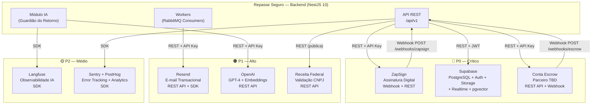
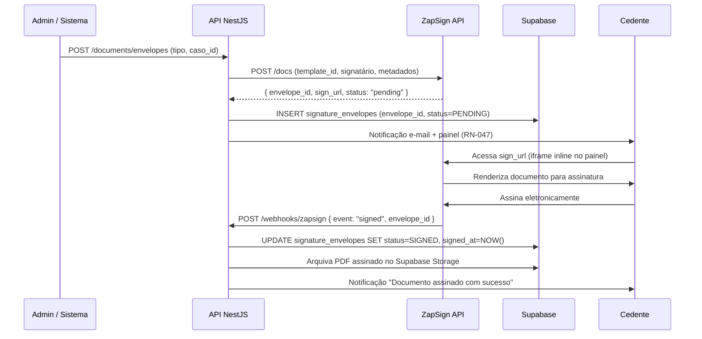
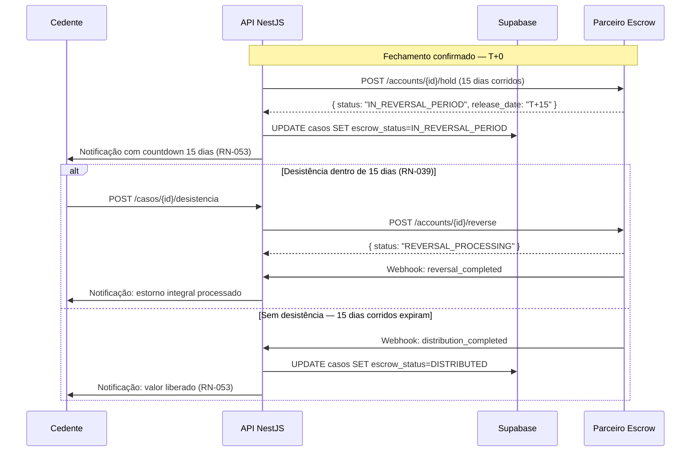
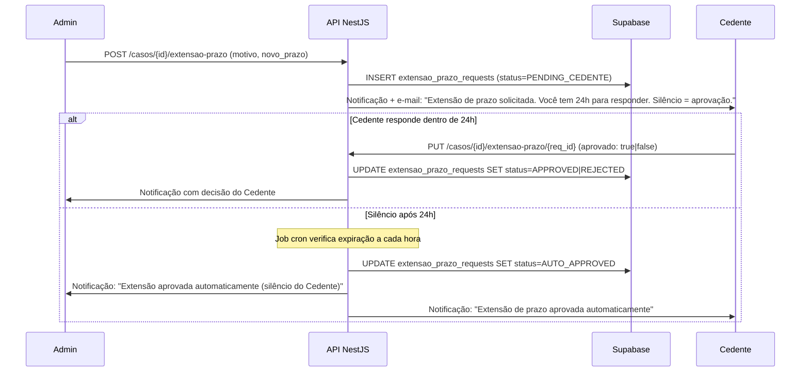
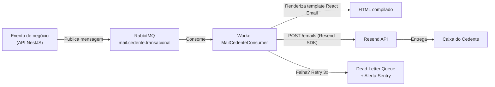
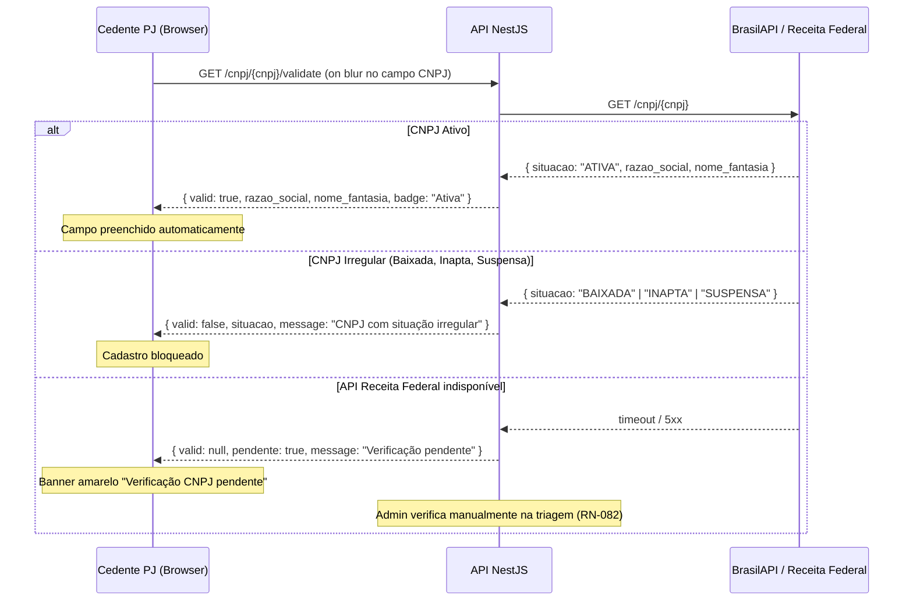
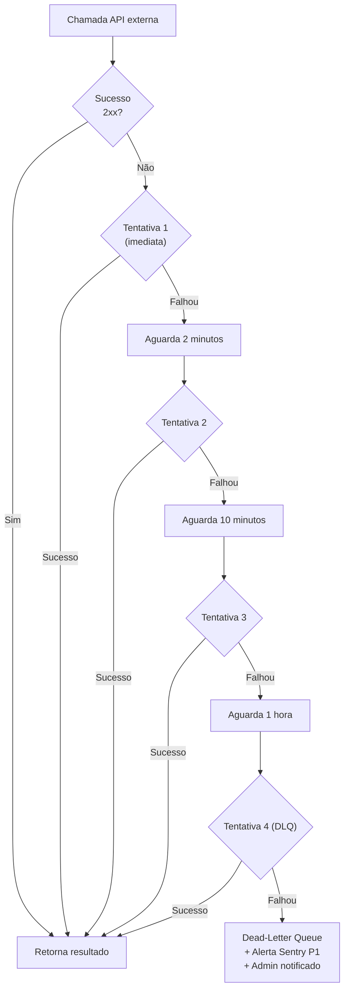

# 17 - Integrações Externas

## Módulo Cedente · Plataforma Repasse Seguro

| **Destinatário** | **Escopo** | **Módulo** | **Versão** | **Responsável** | **Data da versão** |
|---|---|---|---|---|---|
| Backend, Arquitetura e Operação | Mapa de dependências externas com APIs, SDKs, webhooks, quotas, retry, fallback e criticidade | Cedente | v1.0 | Claude Code Desktop | 2026-03-23 |

---

> 📌 **TL;DR — Integrações Externas do Módulo Cedente**
>
> - **8 integrações mapeadas:** ZapSign, Conta Escrow (parceiro TBD), Supabase, Resend, Receita Federal, OpenAI, Langfuse, Sentry/PostHog.
> - **Criticidade:** 3 P0 (ZapSign, Supabase, Conta Escrow), 3 P1 (Resend, OpenAI, Receita Federal), 2 P2 (Langfuse, Sentry/PostHog).
> - **ZapSign:** geração de 4 tipos de envelope (Termo de Cadastro, Aceite de Escalonamento, Termo Comercial, Instrumento de Cessão), régua de lembretes D+2/D+4/D+5, webhook de assinatura, expiração em 5 dias úteis.
> - **Conta Escrow:** webhook de confirmação de depósito, consulta de saldo, reversão em 15 dias corridos, extensão de prazo com aprovação do Cedente (24h, silêncio = aprovação automática).
> - **Retry protocol:** 2min → 10min → 1h para falhas transientes em todas as integrações. Dead-letter queue após 3 tentativas.
> - **Parceiro Escrow:** `[DEFINIÇÃO PENDENTE — DP-001]` — bloqueador de go-live.
> - **Credenciais:** 100% como env vars — nenhuma credencial real neste documento.

---

## 1. Diagrama de Dependências



---

## 2. Inventário de Integrações

### 2.1 Tabela Resumo

| # | Integração | Criticidade | Protocolo | Autenticação | Fallback | RNs relacionadas |
|---|---|---|---|---|---|---|
| 1 | ZapSign | P0 | REST + Webhook | API Key (Bearer) | Retry 3x; sem provedor alternativo no MVP | RN-047, RN-048, RN-049, RN-050, RN-080, RN-081 |
| 2 | Conta Escrow | P0 | REST + Webhook | API Key (Bearer) | Último status em cache; confirmação manual pelo Admin | RN-051, RN-053, RN-083 |
| 3 | Supabase | P0 | REST + SDK + WS | JWT + Service Role Key | PostgreSQL HA nativo (Supabase SLA 99.9%) | RN-011, RN-041, RN-042, RN-057, RN-083 |
| 4 | Resend | P1 | REST API + SDK | API Key | Retry 3x; fila RabbitMQ | RN-046, RN-056 |
| 5 | OpenAI | P1 | REST API | API Key | Degradação graciosa — Guardião offline | RN-058 a RN-063 |
| 6 | Receita Federal | P1 | REST (pública) | Nenhuma (pública) | Avançar com pendência + verificação manual Admin | RN-069, RN-082 |
| 7 | Langfuse | P2 | SDK | API Key | Fire-and-forget; falha silenciosa | RN-063 |
| 8 | Sentry / PostHog | P2 | SDK | API Key / Project Key | Fire-and-forget; falha silenciosa | — |

---

## 3. ZapSign — Assinaturas Eletrônicas

### 3.1 Visão Geral

**Papel:** Infraestrutura de assinatura eletrônica com validade jurídica. Toda assinatura no Módulo Cedente é processada via ZapSign — sem alternativa no MVP.

**Criticidade:** P0. Sem ZapSign, o Cedente não consegue assinar o Termo de Cadastro (bloqueio de início do caso), o Termo de Aceite de Escalonamento, o Termo Comercial nem o Instrumento de Cessão (bloqueio de Fechamento).

**Credenciais:**

```
ZAPSIGN_API_KEY=<env var — nunca commitada>
ZAPSIGN_WEBHOOK_SECRET=<env var — validação HMAC dos webhooks>
ZAPSIGN_BASE_URL=https://api.zapsign.com.br/api/v1
```

### 3.2 Documentos que geram envelope ZapSign

| Documento | Momento de geração | Signatário(s) | Prazo de assinatura |
|---|---|---|---|
| Termo de Cadastro | Ao confirmar o cadastro do imóvel (Etapa 5 do wizard) | Cedente (PF ou Rep. Legal PJ) | 5 dias úteis |
| Termo de Aceite de Escalonamento | Ao confirmar solicitação de mudança de cenário | Cedente | 5 dias úteis |
| Termo Comercial | Ao aceitar proposta e avançar para formalização | Cedente + Admin | 5 dias úteis |
| Instrumento de Cessão | No Fechamento formal | Cedente + Admin | 5 dias úteis |

### 3.3 Fluxo de Geração de Envelope



### 3.4 Régua de Lembretes (D+2 / D+4 / D+5)

A régua de lembretes é processada por um job RabbitMQ agendado diariamente às 08:00 BRT.

| Dia útil após envio | Ação | Canal |
|---|---|---|
| D+2 | Enviar lembrete ao Cedente | E-mail + painel |
| D+4 | Enviar lembrete ao Cedente + alerta ao Admin | E-mail + painel |
| D+5 | Envelope expirado. Notificar Cedente + Admin. Marcar `status=EXPIRED` | E-mail + painel |

```typescript
// Exemplo de payload de lembrete ZapSign (worker RabbitMQ)
interface ZapSignReminderPayload {
  envelope_id: string;
  caso_id: string;
  cedente_id: string;
  tipo_documento: 'termo_cadastro' | 'aceite_escalonamento' | 'termo_comercial' | 'instrumento_cessao';
  dias_uteis_decorridos: number; // 2, 4 ou 5
}
```

### 3.5 Webhook de Assinatura

**Endpoint:** `POST /webhooks/zapsign`

**Validação HMAC:** Toda requisição deve incluir o header `X-Zapsign-Signature`. O backend valida com `ZAPSIGN_WEBHOOK_SECRET` antes de processar. Requisições sem assinatura válida retornam `401 Unauthorized`.

**Eventos suportados:**

| Evento ZapSign | Ação no sistema |
|---|---|
| `doc_signed` | Atualiza `status=SIGNED`, registra hash do PDF, arquiva no Storage, notifica Cedente |
| `doc_refused` | Atualiza `status=REFUSED`, notifica Admin para ação manual |
| `doc_expired` | Atualiza `status=EXPIRED`, dispara régua D+5, notifica Cedente + Admin |

```typescript
// Estrutura do webhook ZapSign (simplificada)
interface ZapSignWebhookPayload {
  event: 'doc_signed' | 'doc_refused' | 'doc_expired';
  envelope_id: string;
  document_hash?: string; // Presente apenas em doc_signed
  signed_at?: string;     // ISO 8601 UTC
  signer: {
    cpf: string;
    name: string;
    ip_address: string;
    session_id: string;
  };
}
```

### 3.6 Tratamento de Expiração (5 Dias Úteis)

Após 5 dias úteis sem assinatura, o envelope expira. O fluxo de expiração é:

1. Worker detecta envelope com `dias_uteis >= 5` e `status = PENDING`.
2. Sistema chama `DELETE /docs/{envelope_id}` na API ZapSign para cancelar.
3. `status` atualizado para `EXPIRED` no banco.
4. Cedente recebe notificação: "O prazo para assinar o documento [nome] expirou."
5. Admin recebe alerta para gerar novo envelope (caso ainda seja necessário).

**Envelope cancelado não pode ser reaberto.** Admin deve criar novo envelope via `POST /documents/envelopes`.

### 3.7 Retry Protocol ZapSign

| Tentativa | Espera | Ação se falhar |
|---|---|---|
| 1ª | Imediata | Registra falha no log |
| 2ª | 2 minutos | Registra falha no log |
| 3ª | 10 minutos | Registra falha no log |
| 4ª (DLQ) | 1 hora | Move para dead-letter queue, alerta Sentry P1, Admin notificado |

**Circuit Breaker ZapSign:** Após 5 falhas consecutivas em 60 segundos, o circuit breaker abre por 5 minutos. Durante esse período, novos envelopes são enfileirados (não descartados). Cedente vê: "O serviço de assinatura está temporariamente indisponível. Tente novamente em alguns minutos."

---

## 4. Conta Escrow — Parceiro Financeiro

> ⚠️ **`[DEFINIÇÃO PENDENTE — DP-001]`** O parceiro bancário/fintech que operará a Conta Escrow não foi definido. Os dados de depósito (banco, agência, conta, chave PIX), endpoints de API, estrutura de webhook e prazo de liquidação dependem desta decisão. Esta é uma **pendência bloqueadora de go-live** para todos os fluxos financeiros do Módulo Cedente.

### 4.1 Visão Geral

**Papel:** Custódia segura dos valores da transação de repasse. O Cessionário deposita na Conta Escrow; após o Fechamento e o período de reversão de 15 dias corridos, o parceiro distribui os valores automaticamente.

**Criticidade:** P0. Sem Conta Escrow operacional, o Fechamento financeiro é impossível.

**Credenciais (placeholder):**

```
ESCROW_API_KEY=<env var>
ESCROW_API_SECRET=<env var>
ESCROW_WEBHOOK_SECRET=<env var>
ESCROW_BASE_URL=<env var — definido após escolha do parceiro>
```

### 4.2 Eventos de Webhook da Conta Escrow

**Endpoint:** `POST /webhooks/escrow`

| Evento | Gatilho | Ação no sistema |
|---|---|---|
| `deposit_confirmed` | Cessionário deposita o valor total | Atualiza status Escrow para `DEPOSIT_CONFIRMED`, notifica Cedente (RN-083) |
| `distribution_completed` | 15 dias corridos após Fechamento sem desistência | Atualiza status para `DISTRIBUTED`, disponibiliza comprovante, notifica Cedente (RN-053) |
| `reversal_completed` | Desistência aceita dentro dos 15 dias | Atualiza status para `REVERSED`, notifica Cedente + Admin |
| `balance_updated` | Qualquer alteração de saldo | Atualiza cache Redis do saldo (TTL 60s) |

### 4.3 Consulta de Saldo

```typescript
// GET /escrow/accounts/{conta_id}/balance
// Resposta esperada (contrato provisório — sujeito a revisão com o parceiro)
interface EscrowBalanceResponse {
  conta_id: string;
  caso_id: string;
  saldo_total: number;       // Em centavos
  saldo_disponivel: number;  // Em centavos
  status: 'OPEN' | 'DEPOSIT_CONFIRMED' | 'IN_REVERSAL_PERIOD' | 'DISTRIBUTED' | 'REVERSED';
  data_abertura: string;     // ISO 8601 UTC
  data_deposito?: string;
  data_prevista_distribuicao?: string; // 15 dias corridos após fechamento
}
```

**Cache Redis:** Saldo é cacheado por 60 segundos para reduzir chamadas à API do parceiro. TTL resetado a cada webhook `balance_updated`.

### 4.4 Processo de Reversão em 15 Dias Corridos



### 4.5 Extensão de Prazo — Aprovação do Cedente

Quando o Cessionário solicita extensão do prazo de reversão (fluxo Admin), o Cedente tem **24 horas para responder**. Silêncio equivale a aprovação automática.



### 4.6 Retry Protocol — Conta Escrow

Idêntico ao ZapSign (seção 3.7). Circuit breaker após 5 falhas em 60s, abertura por 5 minutos. Admin notificado via Sentry P1.

---

## 5. Supabase — Banco, Auth, Storage e Realtime

### 5.1 Papel no Módulo Cedente

O Supabase é a infraestrutura de dados central. Não é uma "integração externa" no sentido clássico, mas é tratado neste documento por completude do mapa de dependências.

| Produto Supabase | Uso no Cedente | RNs |
|---|---|---|
| PostgreSQL 17 | Armazenamento de todos os dados do Cedente | Todas as RNs com persistência |
| Supabase Auth | Cadastro, login, recuperação de senha, JWT, RLS | RN-001 a RN-006 |
| Supabase Storage | Upload de documentos do dossiê (PDF, JPG, PNG, max 10 MB) | RN-041, RN-042 |
| Supabase Realtime | Notificações no painel em ≤30s (RN-057), atualização de Dashboard | RN-014, RN-057, RN-083 |
| pgvector | Base de conhecimento do Guardião do Retorno (RAG) | RN-058 |

### 5.2 Row Level Security (RLS) — Isolamento do Cedente

Toda tabela com dados de Cedente deve ter RLS habilitada. Política padrão:

```sql
-- Política de isolamento: Cedente só vê seus próprios dados
CREATE POLICY "cedente_isolation" ON casos
  FOR ALL
  USING (auth.uid() = cedente_id);

-- Política para documentos: apenas o Cedente do caso ou Admin
CREATE POLICY "documento_access" ON documentos
  FOR ALL
  USING (
    auth.uid() = (SELECT cedente_id FROM casos WHERE id = caso_id)
    OR auth.jwt() ->> 'role' = 'admin'
  );
```

**RLS proibida de desabilitar** em produção sem ADR aprovado. Violação é um finding P0.

### 5.3 Credenciais

```
SUPABASE_URL=<env var>
SUPABASE_ANON_KEY=<env var — frontend, sem privilégios>
SUPABASE_SERVICE_ROLE_KEY=<env var — backend apenas, nunca no frontend>
```

---

## 6. Resend — E-mail Transacional

### 6.1 Visão Geral

**Papel:** Envio de todos os e-mails transacionais do Módulo Cedente. Templates em React Email, compilados em HTML na build.

**Criticidade:** P1. Sem Resend, lembretes e alertas por e-mail não chegam ao Cedente. Notificações no painel continuam funcionando via Supabase Realtime.

**Credenciais:**

```
RESEND_API_KEY=<env var>
RESEND_FROM_EMAIL=noreply@repasseseguro.com.br
RESEND_FROM_NAME=Repasse Seguro
```

### 6.2 Templates de E-mail do Módulo Cedente

| Template ID | Evento | RN | Pode desativar? |
|---|---|---|---|
| `cedente_boas_vindas` | Conta criada — link de ativação | RN-001 | Não |
| `cedente_confirmacao_cadastro` | Caso cadastrado com sucesso | RN-043 | Não |
| `cedente_doc_pendente` | Lembrete documentos pendentes (7 dias) | RN-046 | Sim |
| `cedente_doc_rejeitado` | Documento rejeitado pelo Analista | RN-045 | Não |
| `cedente_proposta_recebida` | Nova proposta (crítico) | RN-056 | Não |
| `cedente_proposta_expirando` | Proposta expirando em [X] dias | RN-031 | Sim |
| `cedente_aceite_registrado` | Aceite registrado — formalização | RN-032 | Não |
| `cedente_assinatura_pendente` | Documento aguardando assinatura (ZapSign) | RN-047 | Não |
| `cedente_lembrete_assinatura` | Lembrete assinatura — 3 dias úteis | RN-050 | Sim |
| `cedente_fechamento_confirmado` | Fechamento confirmado (crítico) | RN-048 | Não |
| `cedente_distribuicao_realizada` | Valor liberado (crítico) | RN-053 | Não |
| `cedente_caso_cancelado` | Caso cancelado | RN-055 | Não |
| `cedente_rascunho_expirando` | Rascunho expirando (dias 7, 15 e 25) | RN-023 | Sim |

### 6.3 Fluxo de Envio (Fila RabbitMQ)



**SLA:** E-mail deve ser enviado em até 5 minutos após o evento (RN-056). O worker processa a fila a cada 30 segundos. Em picos, o consumo é paralelo (até 3 workers simultâneos).

### 6.4 Variáveis dos Templates

```typescript
// Variáveis obrigatórias em todos os templates Cedente
interface CedenteEmailBaseVars {
  cedente_nome: string;
  caso_nome: string;       // Nome do imóvel
  caso_id: string;
  link_painel: string;     // URL deep link para a tela relevante
  data_evento: string;     // Formatada em pt-BR (ex: 23 de março de 2026)
}

// Variáveis adicionais — cedente_proposta_recebida
interface PropostaRecebidaVars extends CedenteEmailBaseVars {
  valor_proposta: string;  // Formatado: "R$ 45.000,00"
  cenario: string;         // "A", "B", "C" ou "D"
  prazo_resposta: string;  // "5 dias úteis"
}
```

---

## 7. Receita Federal — Validação de CNPJ

### 7.1 Visão Geral

**Papel:** Validação em tempo real da situação cadastral de CNPJs de Cedentes PJ no momento do cadastro.

**Criticidade:** P1. Sem esta integração, Cedentes PJ podem avançar no cadastro com CNPJ irregular. A plataforma deve funcionar normalmente para Cedentes PF mesmo sem esta integração.

**Endpoint:** API pública da Receita Federal (ou proxy via BrasilAPI/CNPJ.ws para evitar rate limiting).

```
RECEITA_FEDERAL_BASE_URL=https://brasilapi.com.br/api/cnpj/v1
# Alternativa direta: https://www.receitaws.com.br/v1/cnpj
```

### 7.2 Fluxo de Validação (RN-082)



### 7.3 Rate Limiting e Cache

- **Cache Redis:** Resultado de cada CNPJ cacheado por **24 horas** (TTL). Evita chamadas repetidas para o mesmo CNPJ.
- **Rate limit externo:** BrasilAPI tem limite de 3 req/s. O wrapper implementa throttle automático.
- **Fallback:** Em caso de indisponibilidade, o cadastro avança com flag `cnpj_verificacao_pendente = true` e banner amarelo no painel.

---

## 8. OpenAI — Guardião do Retorno

### 8.1 Visão Geral

**Papel:** Motor LLM do agente Guardião do Retorno (RN-058 a RN-063). Todas as chamadas são feitas exclusivamente pelo backend NestJS — o frontend nunca chama a API OpenAI diretamente.

**Criticidade:** P1. Sem OpenAI, o Guardião fica offline. O painel continua funcionando normalmente — degradação graciosa.

**Credenciais:**

```
OPENAI_API_KEY=<env var>
OPENAI_ORG_ID=<env var>
```

### 8.2 Modelos e Uso

| Modelo | Uso | Razão |
|---|---|---|
| `gpt-4-turbo-2024-04-09` (fixado) | Chat do Guardião, tool calls, simulações | Melhor equilíbrio qualidade/function calling |
| `gpt-4o-mini` | Classificação de intenção, triagem de perguntas | Custo menor para tarefas simples |
| `text-embedding-3-small` | Embeddings para RAG (pgvector) | Custo/performance adequados para a base de conhecimento |

### 8.3 Retry e Fallback

| Cenário | Comportamento |
|---|---|
| `429 Rate Limit` | Exponential backoff: 2s → 10s → 60s |
| `500 / 503 OpenAI` | Retry 3x. Se persistir: "O Guardião está temporariamente indisponível. Tente novamente em alguns minutos." |
| `timeout > 30s` | Abort + mensagem de degradação graciosa ao Cedente |
| Custo > limiar diário | Alerta Sentry P2. Guardião continua operando. |

---

## 9. Langfuse — Observabilidade do Guardião

### 9.1 Visão Geral

**Papel:** Rastreamento completo de todas as conversas do Guardião do Retorno — tokens consumidos, custo, latência, nível de confiança e qualidade das respostas.

**Criticidade:** P2. Falha silenciosa — o Guardião continua operando sem observabilidade, mas o time perde visibilidade de qualidade.

**Credenciais:**

```
LANGFUSE_PUBLIC_KEY=<env var>
LANGFUSE_SECRET_KEY=<env var>
LANGFUSE_BASE_URL=https://cloud.langfuse.com
```

### 9.2 O que é rastreado por conversa

| Dado | Propósito |
|---|---|
| `trace_id` | Identificador único da conversa (não exposto ao Cedente) |
| `session_id` | Agrupamento de mensagens de uma sessão |
| `tokens_input / tokens_output` | Controle de custo |
| `latency_ms` | Monitoramento de SLA de resposta |
| `confidence_score` | Disparador de escalação para humano (RN-063) — limiar: < 0.80 |
| `tool_calls` | Quais ferramentas o Guardião usou |
| `model_version` | Auditoria de qual modelo respondeu |

**LGPD:** O conteúdo das mensagens (texto livre do Cedente) é anonimizado no Langfuse após 90 dias. `cedente_id` nunca é enviado ao Langfuse — apenas `trace_id` interno.

---

## 10. Sentry e PostHog

### 10.1 Sentry — Error Tracking

**Papel:** Captura de erros em todas as camadas (NestJS backend, Next.js frontend, Expo mobile).

**Criticidade:** P2. Falha silenciosa — produto continua operando.

**Severidades para alertas:**

| Severidade | Exemplos no Cedente | Ação |
|---|---|---|
| P0 (Fatal) | Falha total de auth, corrupção de dados | PagerDuty imediato |
| P1 (Error) | Falha em webhook ZapSign/Escrow, falha de envio de e-mail crítico | Slack #alerts em < 5min |
| P2 (Warning) | Rate limit OpenAI, timeout Receita Federal | Slack #warnings em < 30min |
| P3 (Info) | Retry bem-sucedido, degradação graciosa | Apenas log |

### 10.2 PostHog — Analytics

**Papel:** Rastreamento de comportamento do Cedente para otimização de produto.

**Eventos obrigatórios do Módulo Cedente:**

```typescript
// Nomenclatura: snake_case, prefixo "cedente_"
'cedente_cadastro_iniciado'
'cedente_cadastro_concluido'
'cedente_imovel_cadastrado'
'cedente_proposta_recebida'
'cedente_proposta_aceita'
'cedente_proposta_recusada'
'cedente_escalonamento_solicitado'
'cedente_assinatura_concluida'
'cedente_fechamento_realizado'
'cedente_guardiao_consulta'
'cedente_guardiao_escalacao_humano'
```

---

## 11. Protocolo de Retry Unificado

Todas as chamadas a APIs externas seguem o mesmo protocolo de retry, implementado no módulo `RetryService` do NestJS.



**Erros que NÃO entram em retry (terminais imediatos):**

| Código HTTP | Situação | Comportamento |
|---|---|---|
| `400 Bad Request` | Payload inválido enviado pelo sistema | Log de erro + alerta Sentry |
| `401 Unauthorized` | Credencial inválida ou expirada | Alerta Sentry P0 + notificação ao Admin |
| `403 Forbidden` | Permissão negada | Log de erro + alerta Sentry |
| `404 Not Found` | Recurso não existe no provedor | Log de warning |

---

## 12. Circuit Breakers

| Integração | Limiar de abertura | Tempo aberto | Comportamento durante abertura |
|---|---|---|---|
| ZapSign | 5 falhas em 60s | 5 minutos | Novas solicitações enfileiradas (não descartadas) |
| Conta Escrow | 3 falhas em 60s | 10 minutos | Último status em cache; Admin notificado |
| Resend | 5 falhas em 60s | 5 minutos | E-mails enfileirados no RabbitMQ |
| OpenAI | 5 falhas em 60s | 3 minutos | Guardião offline com mensagem de degradação |
| Receita Federal | 10 falhas em 60s | 15 minutos | Cadastro PJ avança com pendência |

---

## 13. Gestão de Credenciais

**Regra absoluta:** Nenhuma credencial real é armazenada em código, documentos ou repositórios Git. Toda credencial é gerenciada exclusivamente via variáveis de ambiente.

**Por ambiente:**

| Variável | Dev Local | Staging | Produção |
|---|---|---|---|
| `ZAPSIGN_API_KEY` | Sandbox ZapSign | Sandbox ZapSign | Produção ZapSign |
| `ESCROW_API_KEY` | Mock/Sandbox | Sandbox parceiro | Produção parceiro |
| `SUPABASE_SERVICE_ROLE_KEY` | Projeto dev | Projeto staging | Projeto produção |
| `RESEND_API_KEY` | Resend test mode | Resend test mode | Resend production |
| `OPENAI_API_KEY` | Compartilhada dev | Compartilhada staging | Produção (quota separada) |

**Rotação:** Credenciais de produção rotacionadas a cada 90 dias ou imediatamente após suspeita de comprometimento.

---

## 14. SLAs e Monitoramento

| Integração | SLA externo declarado | Meta interna de disponibilidade | Monitoramento |
|---|---|---|---|
| Supabase | 99.9% | 99.9% | Supabase Status Page + Sentry |
| ZapSign | Contratual (verificar) | 99.5% | Webhook monitoring + Sentry |
| Conta Escrow | `[DEFINIÇÃO PENDENTE]` | 99.5% | Webhook monitoring + Sentry |
| Resend | 99.9% | 99.9% | Resend Dashboard + Sentry |
| OpenAI | 99.9% | 99% (degradação graciosa aceitável) | Langfuse + Sentry |
| Receita Federal | Não declarado (API pública) | — (fallback disponível) | Log de erros |

---

## 15. Backlog de Pendências

| ID | Descrição | Prioridade | Bloqueador de go-live? |
|---|---|---|---|
| DP-001 | Definir parceiro da Conta Escrow (banco, API, webhooks) | P0 | Sim |
| DP-002 | Obter SLA contratual do ZapSign e Conta Escrow | P1 | Não |
| DP-003 | Validar sandbox ZapSign com os 4 tipos de envelope do Cedente | P1 | Sim (para testes) |
| DP-004 | Confirmar endpoint e rate limits da Receita Federal / BrasilAPI para produção | P1 | Não |
| DP-005 | Configurar Langfuse com políticas de retenção e anonimização LGPD (90 dias) | P2 | Não |
