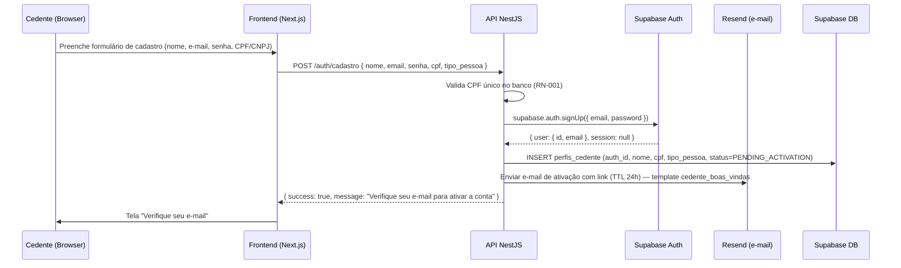
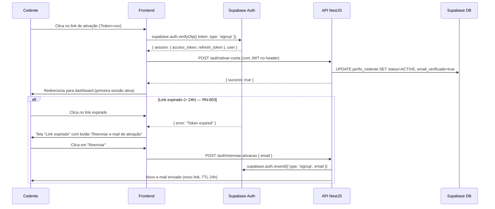
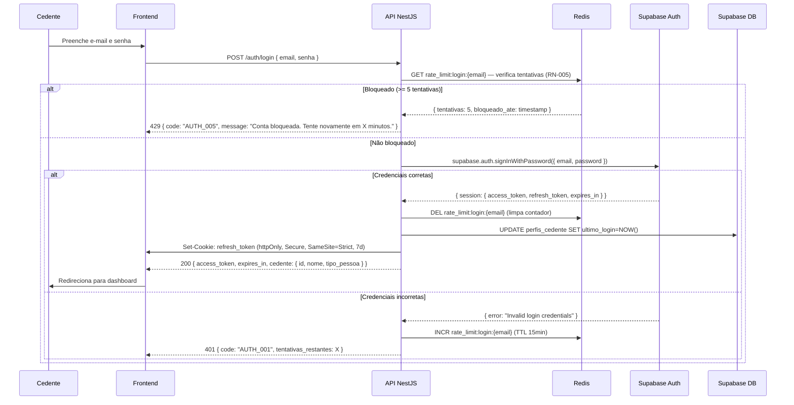
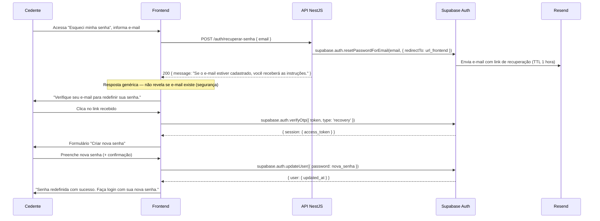
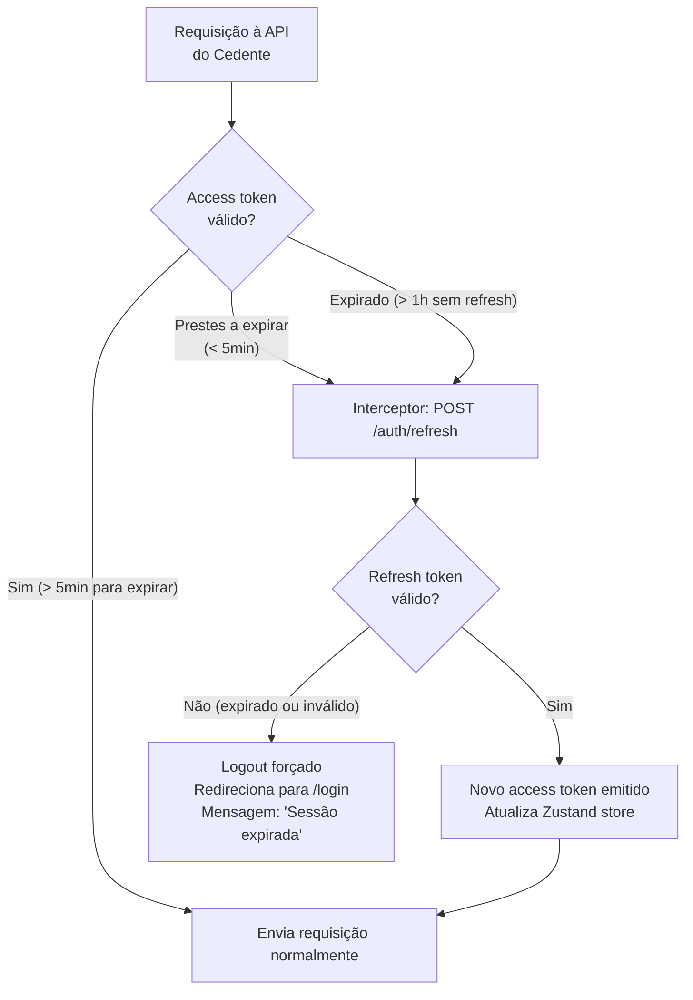
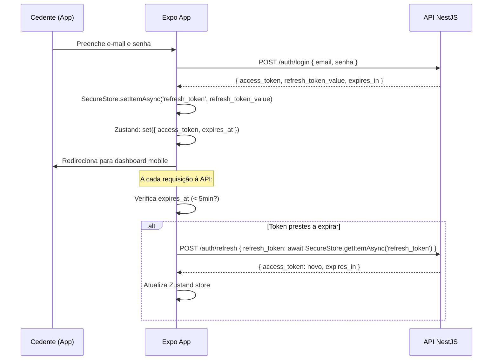
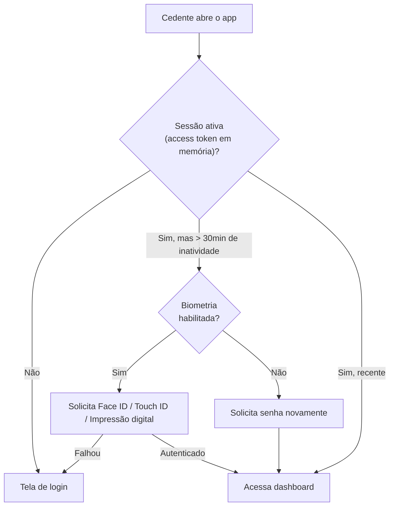
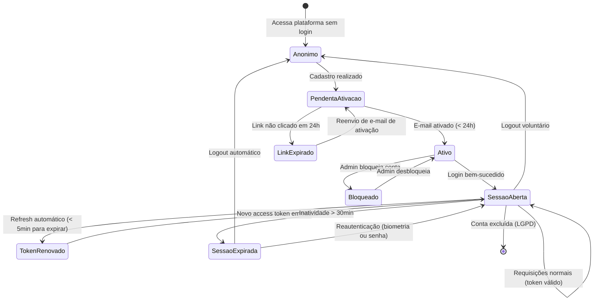

# 18 - Fluxos de Autenticação e Sessão

## Módulo Cedente · Plataforma Repasse Seguro

| **Destinatário** | **Escopo** | **Módulo** | **Versão** | **Responsável** | **Data da versão** |
|---|---|---|---|---|---|
| Backend Lead / Tech Lead | Fluxos de autenticação, sessão, JWT, RLS, mobile e segurança | Cedente | v1.0 | Claude Code Desktop | 2026-03-23 |

---

> 📌 **TL;DR**
>
> - **Dois tipos de autenticação:** Tipo 1 — Sessão do Cedente (e-mail/senha via Supabase Auth); Tipo 2 — API Keys de serviços externos (ZapSign, Escrow, OpenAI — ver D17). Sem OAuth de plataformas externas além do Supabase no MVP.
> - **Fluxo de cadastro:** e-mail/senha + confirmação de e-mail via link de ativação com validade de 24 horas (RN-001, RN-002, RN-003).
> - **Rate limiting de login:** 5 tentativas → bloqueio de 15 minutos via Redis (RN-005).
> - **Tokens:** access token JWT 1 hora; refresh token 7 dias (httpOnly cookie no web; SecureStore no mobile).
> - **Sessão:** expiração por inatividade, renovação automática silenciosa, modal de aviso 5 minutos antes de expirar.
> - **RLS Supabase:** isolamento total de dados entre Cedentes — cada linha de dados protegida por `auth.uid()`.
> - **Mobile:** biometria opcional via `expo-local-authentication`, tokens em `expo-secure-store`.
> - **Recuperação de senha:** link por e-mail com validade de 1 hora.

---

## 1. Persona e Contexto

Este documento é a referência autoritativa para implementação de autenticação e gestão de sessão no Módulo Cedente da plataforma Repasse Seguro. Destina-se ao Backend Lead e Tech Lead responsáveis pela implementação.

**Impacto no pipeline:**

- **D17 — Integrações Externas:** autenticação de serviços externos (API Keys) está documentada lá; este documento foca na sessão do usuário Cedente.
- **D20 — Error Handling:** referencia os códigos de erro de autenticação (AUTH-001 a AUTH-008).
- **D28 — Checklist de Qualidade:** valida a implementação contra o checklist de segurança desta seção 8.

**Dependências:**

- RN-001 a RN-006 (Regras de autenticação e perfil — D01.1)
- `02 - Stacks` (Supabase Auth, Redis, JWT, httpOnly cookies, expo-secure-store)
- `17 - Integrações Externas` (Supabase como P0)

---

## 2. Dois Tipos de Autenticação

| Tipo | Nome | Descrição | Provedor |
|---|---|---|---|
| **Tipo 1** | Sessão do Cedente | Login do Cedente na plataforma — acessa casos, documentos, propostas, financeiro e o Guardião do Retorno | Supabase Auth (e-mail/senha) |
| **Tipo 2** | API Keys de Serviços Externos | Autenticação de integrações backend-to-backend | API Keys (ZapSign, Escrow, OpenAI, Resend) — ver D17 |

> **Nota arquitetural:** O Módulo Cedente **não possui OAuth 2.0 de conexão com plataformas externas** (sem "Login com Google" ou social login no MVP). As integrações externas usam API Keys fixas gerenciadas pelo backend. O único fluxo de autenticação do ponto de vista do usuário é **e-mail/senha via Supabase Auth**.

---

## 3. Fluxo de Cadastro — E-mail e Senha

### 3.1 Diagrama de Sequência



### 3.2 Validações no Cadastro

| Campo | Validação | Erro retornado |
|---|---|---|
| E-mail | Formato RFC 5322 + verificação de domínio MX | `CADASTRO_001: E-mail inválido` |
| E-mail | Unicidade no banco | `CADASTRO_002: E-mail já cadastrado` |
| CPF | Formato + dígitos verificadores | `CADASTRO_003: CPF inválido` |
| CPF | Unicidade no banco (RN-001) | `CADASTRO_004: CPF já cadastrado` |
| Senha | Mínimo 8 caracteres, ao menos 1 número e 1 letra | `CADASTRO_005: Senha fraca` |
| CNPJ (PJ) | Formato + dígitos + consulta Receita Federal | `CADASTRO_006: CNPJ inválido ou irregular` |

### 3.3 Ativação da Conta por E-mail (RN-002, RN-003)

O link de ativação tem validade de **24 horas**. O Cedente deve clicar antes do prazo.



**Conta não ativada em 7 dias:** Lembrete automático por e-mail no dia 3 e no dia 7. Após 30 dias sem ativação, a conta é marcada como `EXPIRED` e pode ser recadastrada com o mesmo e-mail.

---

## 4. Fluxo de Login

### 4.1 Diagrama de Sequência



### 4.2 Rate Limiting de Login (RN-005)

| Tentativas | Ação | Mensagem ao Cedente |
|---|---|---|
| 1–4 | Incrementa contador Redis (TTL 15min) | "E-mail ou senha incorretos. Tentativas restantes: [X]" |
| 5 | Bloqueia por 15 minutos | "Muitas tentativas. Aguarde 15 minutos antes de tentar novamente." |
| Após desbloqueio | Contador zerado | Fluxo normal retomado |

**Chave Redis:** `rate_limit:login:{email}` com TTL de 15 minutos após primeira tentativa falha.

### 4.3 Resposta de Login — Tokens

```typescript
// Response body: POST /auth/login
interface LoginResponse {
  access_token: string;    // JWT, válido por 1 hora
  expires_in: number;      // 3600 (segundos)
  token_type: 'Bearer';
  cedente: {
    id: string;
    nome: string;
    email: string;
    tipo_pessoa: 'PF' | 'PJ';
    status: 'ACTIVE';
  };
}

// Cookie: refresh_token
// httpOnly: true | Secure: true | SameSite: Strict | Max-Age: 604800 (7 dias)
```

---

## 5. Fluxo de Recuperação de Senha



**Validade do link:** 1 hora. Após expiração, o Cedente deve solicitar novo link.

**Resposta genérica obrigatória:** A API sempre retorna `200` independente de o e-mail existir ou não — evita enumeração de contas (OWASP A01).

---

## 6. Gestão de Sessão e Tokens JWT

### 6.1 Configuração de Tokens

| Token | Validade | Armazenamento (Web) | Armazenamento (Mobile) |
|---|---|---|---|
| Access Token (JWT) | 1 hora | Memória (Zustand store) — nunca em localStorage | Memória (Zustand) |
| Refresh Token | 7 dias | httpOnly cookie (Secure, SameSite=Strict) | `expo-secure-store` |

**Access token nunca em localStorage:** Vulnerável a XSS. Zustand store é destruído ao fechar o navegador — comportamento intencional de segurança.

### 6.2 Renovação Automática Silenciosa



**Interceptor no fetch wrapper** (`src/services/api.ts`): intercepta respostas `401`, tenta refresh automático uma vez, reenvia a requisição original com o novo token. Se o refresh falhar, realiza logout forçado.

### 6.3 Modal de Aviso de Expiração

5 minutos antes do access token expirar (com refresh token ainda válido), o sistema exibe um modal não-bloqueante:

> "Sua sessão está prestes a expirar em 5 minutos. Salve qualquer alteração em andamento ou clique em 'Continuar' para manter a sessão ativa."

| Ação do Cedente | Comportamento |
|---|---|
| Clica "Continuar" | Renovação automática silenciosa do token |
| Ignora / fecha modal | Token expira; próxima requisição aciona renovação automática |
| Sem atividade por 30 minutos | Logout automático por inatividade; modal de aviso aos 25min |

### 6.4 Expiração por Inatividade

- **Tempo de inatividade:** 30 minutos sem interação com a API.
- **Implementação:** Timestamp `last_activity` atualizado a cada requisição bem-sucedida. Job Redis verifica tokens inativos a cada 5 minutos.
- **Aviso:** Modal não-bloqueante aos 25 minutos de inatividade.
- **Logout:** Automático aos 30 minutos. Zustand store limpo, cookie de refresh removido.

### 6.5 Endpoint de Refresh

```typescript
// POST /auth/refresh
// Requisição: sem body (usa httpOnly cookie automaticamente)
// Resposta:
interface RefreshResponse {
  access_token: string;
  expires_in: 3600;
  token_type: 'Bearer';
}
// Novo httpOnly cookie com refresh token renovado (sliding window 7 dias)
```

---

## 7. Row Level Security (RLS) — Isolamento de Dados

### 7.1 Princípio

O Supabase RLS garante que cada Cedente acessa **apenas seus próprios dados**, mesmo que haja erros de lógica na camada de aplicação. É uma segunda linha de defesa obrigatória (RN-011).

### 7.2 Políticas RLS por Tabela

```sql
-- 1. Tabela: casos
CREATE POLICY "cedente_ver_proprios_casos" ON casos
  FOR SELECT USING (auth.uid() = cedente_auth_id);

CREATE POLICY "cedente_criar_caso" ON casos
  FOR INSERT WITH CHECK (auth.uid() = cedente_auth_id);

-- Cedente não pode UPDATE nem DELETE diretamente
-- (apenas via API com validações de negócio)

-- 2. Tabela: documentos
CREATE POLICY "cedente_ver_documentos_do_seu_caso" ON documentos
  FOR SELECT USING (
    auth.uid() = (SELECT cedente_auth_id FROM casos WHERE id = caso_id)
  );

CREATE POLICY "cedente_upload_documento" ON documentos
  FOR INSERT WITH CHECK (
    auth.uid() = (SELECT cedente_auth_id FROM casos WHERE id = caso_id)
  );

-- 3. Tabela: propostas
-- Cedente só vê propostas dos seus próprios casos
CREATE POLICY "cedente_ver_propostas_dos_seus_casos" ON propostas
  FOR SELECT USING (
    auth.uid() = (SELECT cedente_auth_id FROM casos WHERE id = caso_id)
  );

-- 4. Tabela: notificacoes
CREATE POLICY "cedente_ver_proprias_notificacoes" ON notificacoes
  FOR ALL USING (auth.uid() = destinatario_auth_id);

-- 5. Tabela: conversas_guardiao
CREATE POLICY "cedente_ver_propria_conversa" ON conversas_guardiao
  FOR ALL USING (auth.uid() = cedente_auth_id);
```

### 7.3 Teste Obrigatório de Isolamento (T-38)

```typescript
// Cenário de teste: Cedente A não pode ver dados do Cedente B
describe('RLS — Isolamento entre Cedentes', () => {
  it('Cedente A não acessa casos do Cedente B via API direta', async () => {
    const casoB_id = await createCaso(cedenteB);
    const response = await apiRequest
      .get(`/casos/${casoB_id}`)
      .set('Authorization', `Bearer ${tokenCedenteA}`);
    expect(response.status).toBe(403);
  });

  it('Cedente A não acessa casos do Cedente B via Supabase direto', async () => {
    const { data } = await supabaseClientA
      .from('casos')
      .select('*')
      .eq('id', casoB_id);
    expect(data).toHaveLength(0); // RLS bloqueia silenciosamente
  });
});
```

---

## 8. Autenticação Mobile (Expo)

### 8.1 Diferenças em Relação ao Web

| Aspecto | Web (Next.js) | Mobile (Expo) |
|---|---|---|
| Refresh token storage | httpOnly cookie | `expo-secure-store` (criptografado no keychain/keystore) |
| Access token storage | Memória (Zustand) | Memória (Zustand) |
| Biometria | Não (MVP) | Opcional via `expo-local-authentication` |
| Deep linking auth | — | `repasseseguro://auth/callback` |
| Token no SSR | Sim (cookie enviado automaticamente) | Não aplicável |

### 8.2 Fluxo de Login Mobile



**Nota:** No mobile, o refresh token é enviado no **body** da requisição (não em cookie, que é exclusivo do browser). O endpoint `/auth/refresh-mobile` aceita o token no body.

### 8.3 Biometria Opcional (RN-087)



**Habilitação:** O Cedente habilita biometria em "Perfil > Segurança > Autenticação biométrica". A biometria **não substitui** a autenticação inicial — é usada apenas para reautenticação após inatividade.

**Implementação:**

```typescript
import * as LocalAuthentication from 'expo-local-authentication';

async function reautenticarComBiometria(): Promise<boolean> {
  const hasHardware = await LocalAuthentication.hasHardwareAsync();
  const isEnrolled = await LocalAuthentication.isEnrolledAsync();

  if (!hasHardware || !isEnrolled) return false;

  const result = await LocalAuthentication.authenticateAsync({
    promptMessage: 'Confirme sua identidade para acessar o Repasse Seguro',
    fallbackLabel: 'Usar senha',
    cancelLabel: 'Cancelar',
    disableDeviceFallback: false,
  });

  return result.success;
}
```

---

## 9. Logout

### 9.1 Tipos de Logout

| Tipo | Gatilho | Ação |
|---|---|---|
| Logout voluntário | Cedente clica em "Sair" | Invalida refresh token no Supabase, limpa cookie, limpa Zustand, SecureStore (mobile) |
| Logout por inatividade | 30 minutos sem atividade | Mesmo que logout voluntário + mensagem "Sessão encerrada por inatividade" |
| Logout por expiração | Refresh token expirado (7 dias) | Mesmo que logout voluntário + mensagem "Sua sessão expirou. Faça login novamente." |
| Logout forçado (Admin) | Admin bloqueia conta | Supabase invalida todos os tokens do usuário imediatamente |

### 9.2 Endpoint

```typescript
// POST /auth/logout
// Headers: Authorization: Bearer {access_token}
// Body: vazio
// Ação:
//   1. supabase.auth.signOut() — invalida sessão no Supabase
//   2. Remove httpOnly cookie de refresh token
//   3. Resposta: 204 No Content
```

---

## 10. Códigos de Erro de Autenticação

| Código | Situação | HTTP Status | Mensagem ao usuário |
|---|---|---|---|
| `AUTH_001` | Credenciais incorretas | 401 | "E-mail ou senha incorretos." |
| `AUTH_002` | Conta não ativada | 403 | "Confirme seu e-mail antes de fazer login. Reenviar e-mail?" |
| `AUTH_003` | Conta bloqueada (admin) | 403 | "Sua conta está temporariamente suspensa. Entre em contato com o suporte." |
| `AUTH_004` | Token JWT inválido ou expirado | 401 | "Sessão inválida. Faça login novamente." |
| `AUTH_005` | Rate limit atingido (5 tentativas) | 429 | "Muitas tentativas. Aguarde [X] minutos." |
| `AUTH_006` | Refresh token expirado | 401 | "Sua sessão expirou. Faça login novamente." |
| `AUTH_007` | Link de ativação expirado (> 24h) | 400 | "O link de ativação expirou. Solicite um novo." |
| `AUTH_008` | Link de recuperação expirado (> 1h) | 400 | "O link de recuperação expirou. Solicite um novo." |

---

## 11. Checklist de Segurança de Autenticação

| # | Verificação | Status | Referência |
|---|---|---|---|
| 1 | Access token nunca em localStorage ou sessionStorage | Obrigatório | OWASP A02 |
| 2 | Refresh token somente em httpOnly cookie (web) ou SecureStore (mobile) | Obrigatório | RN-006 |
| 3 | Rate limiting de login implementado via Redis (5 tentativas / 15min) | Obrigatório | RN-005 |
| 4 | Resposta de recuperação de senha genérica (não revela se e-mail existe) | Obrigatório | OWASP A01 |
| 5 | RLS habilitada em todas as tabelas com dados de Cedente | Obrigatório | RN-011 |
| 6 | HTTPS em todos os endpoints (TLS 1.2+) | Obrigatório | — |
| 7 | JWT com algoritmo RS256 ou HS256 (nunca `alg: none`) | Obrigatório | OWASP A02 |
| 8 | Logout invalida refresh token no Supabase (server-side) | Obrigatório | — |
| 9 | Biometria mobile não substitui auth inicial — apenas reautenticação | Obrigatório | Seção 8.3 |
| 10 | `SUPABASE_SERVICE_ROLE_KEY` nunca exposta no frontend | Obrigatório | D17 |
| 11 | Teste de isolamento T-38 executado antes de cada release | Obrigatório | RN-011 |
| 12 | Headers de segurança: Helmet configurado no NestJS desde o primeiro commit | Obrigatório | `02 - Stacks` |

---

## 12. Diagrama de Estados da Sessão



---

## 13. Implementação — Pontos de Atenção

### 13.1 Estrutura de Arquivos (Backend NestJS)

```
apps/api/src/modules/auth/
  auth.module.ts
  auth.controller.ts       # POST /auth/cadastro, /login, /logout, /refresh, /recuperar-senha
  auth.service.ts          # Lógica de autenticação com Supabase Auth
  guards/
    jwt-auth.guard.ts      # Extrai e valida JWT em todas as rotas protegidas
    rate-limit.guard.ts    # Redis rate limiting para /login
  dto/
    cadastro.dto.ts
    login.dto.ts
    recuperar-senha.dto.ts
  strategies/
    jwt.strategy.ts        # Passport JWT strategy
```

### 13.2 Estrutura de Arquivos (Frontend Next.js)

```
apps/web-cedente/src/
  services/
    api.ts                 # Fetch wrapper com interceptor de token
    auth.ts                # Wrappers de login, logout, refresh
  stores/
    auth.store.ts          # Zustand: access_token, expires_at, cedente
  hooks/
    useAuth.ts             # Hook que lê o store e expõe helpers
  middleware.ts            # Next.js middleware — protege rotas (authenticated)
  app/(authenticated)/
    layout.tsx             # Verifica sessão ativa antes de renderizar
```

### 13.3 Middleware Next.js para Rotas Autenticadas

```typescript
// apps/web-cedente/src/middleware.ts
import { NextRequest, NextResponse } from 'next/server';

export function middleware(request: NextRequest) {
  const accessToken = request.cookies.get('access_token_hint');
  // access_token não está em cookie — middleware verifica presença de refresh token
  const refreshToken = request.cookies.get('refresh_token');

  const isAuthRoute = request.nextUrl.pathname.startsWith('/dashboard') ||
                      request.nextUrl.pathname.startsWith('/casos');

  if (isAuthRoute && !refreshToken) {
    return NextResponse.redirect(new URL('/login', request.url));
  }

  return NextResponse.next();
}

export const config = {
  matcher: ['/dashboard/:path*', '/casos/:path*', '/financeiro/:path*'],
};
```
