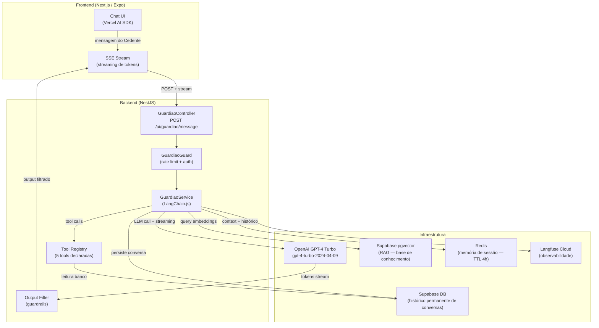
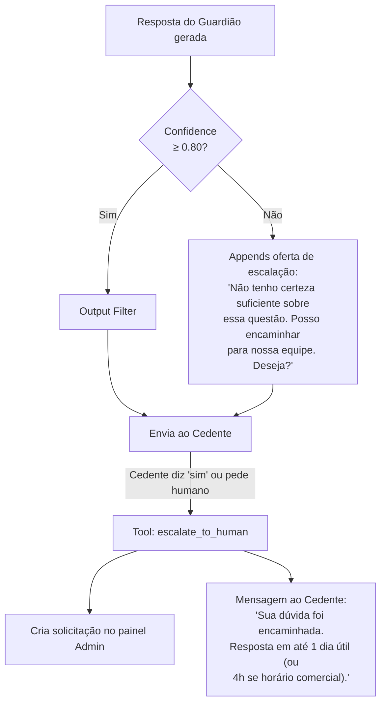
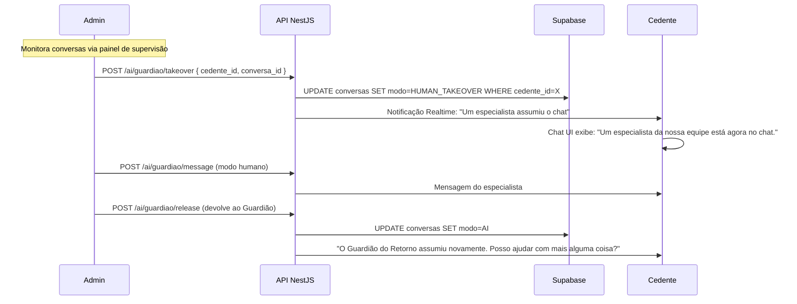
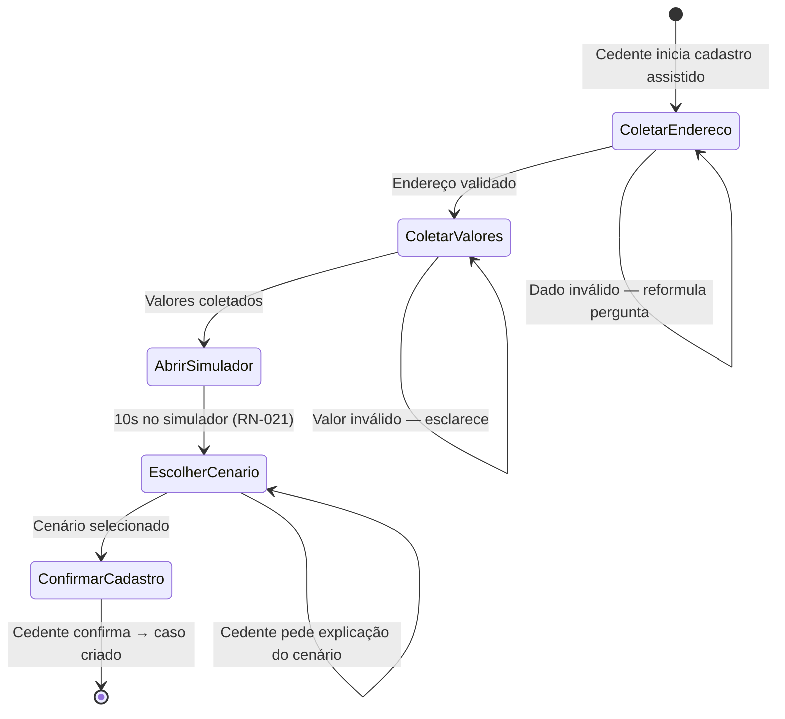

# 19 - Criação de Agentes de IA

## Módulo Cedente · Plataforma Repasse Seguro

| **Destinatário** | **Escopo** | **Módulo** | **Versão** | **Responsável** | **Data da versão** |
|---|---|---|---|---|---|
| Arquitetura e Engenharia de IA | Guardião do Retorno — arquitetura, tool calls, RAG, memória, guardrails e observabilidade | Cedente | v1.0 | Claude Code Desktop | 2026-03-23 |

---

> 📌 **TL;DR**
>
> - **1 agente definido:** Guardião do Retorno (Dani-Cedente) — agente conversacional com RAG + memória de sessão + tool calls de leitura. Disponível 24h no painel do Cedente.
> - **Stack fixa:** Node.js 22 + TypeScript 5.4, LangChain.js 0.3+, LangGraph.js 0.2+ (cadastro assistido), GPT-4 Turbo (`gpt-4-turbo-2024-04-09` — versão fixada), `text-embedding-3-small` para RAG.
> - **RAG:** pgvector (HNSW index) no Supabase PostgreSQL 17 — mesmo banco dos dados operacionais. Chunking: 512 tokens, overlap 64 tokens.
> - **Memória:** curta por sessão (Redis, TTL 4h), longa e imutável no banco (histórico permanente de conversas — RN-062).
> - **Tool calls:** apenas leitura — consulta status do caso, simulação de valores, lista de documentos pendentes. Sem ações com efeito colateral.
> - **Escalação para humano:** threshold de confiança < 0.80 ou solicitação explícita do Cedente (RN-061). Takeover pelo Admin (RN-063).
> - **Rate limiting:** 30 mensagens por hora por Cedente.
> - **Observabilidade:** Langfuse Cloud — tracing completo, custo, latência, nível de confiança.
> - **LGPD:** conteúdo das mensagens anonimizado após 90 dias. `cedente_id` nunca enviado ao Langfuse.

---

## 1. Critérios de Decisão: Tipo de Agente

### 1.1 Tabela de Decisão

| Cenário | Tipo de agente | Justificativa |
|---|---|---|
| Simular cenário de repasse (A, B, C, D) | Informacional + tool call (leitura) | Cálculo determinístico; LLM narra o resultado contextualizado |
| Explicar status atual do caso | Informacional + tool call (leitura) | Precisa buscar status em tempo real do banco |
| Orientar sobre documentos pendentes | Informacional + tool call (leitura) + RAG | Combina dados do caso com FAQ de documentação |
| Responder dúvidas sobre cessão/Lei 13.786 | RAG + streaming SSE | Base documental estática; resposta narrativa |
| Cadastro assistido (wizard multi-step) | LangGraph.js (stateful) + tool call | Precisa de checkpoints e branching entre etapas |
| Sugerir escalonamento de cenário | Informacional + tool call (leitura) | Analisa histórico e propõe escalonamento; não executa |
| Aprovar documento, cancelar caso, aceitar proposta | ❌ Proibido | O Guardião orienta; humano executa. Sem efeitos colaterais |
| Garantir prazos ou valores financeiros | ❌ Proibido (RN-060) | Risco jurídico e de expectativa frustrada |

### 1.2 Regra Binária de Classificação

```
SE o objetivo é consultar, explicar, simular ou orientar → agente informacional
SE o objetivo é criar, modificar, aprovar, cancelar, assinar → PROIBIDO para o Guardião
SE a qualidade depende de dados em tempo real do caso → tool call obrigatória
SE a qualidade depende de conteúdo documental estático → RAG obrigatório
SE a saída é narrativa livre → streaming SSE com guardrail
SE o fluxo tem múltiplos passos e checkpoints → LangGraph.js
```

---

## 2. O Guardião do Retorno — Visão Geral

### 2.1 Identidade e Personalidade

**Nome:** Guardião do Retorno (apelido interno: Dani-Cedente)

**Personalidade:** Tom empático, calmo e acessível. Frases curtas. Vocabulário simples — sem jargões financeiros ou técnicos desnecessários. Reconhece o estado emocional do Cedente (ansiedade, frustração) e responde com empatia antes de apresentar informações (RN-059).

**Boas-vindas (primeira abertura):**
> "Olá, [nome]! Sou o Guardião do Retorno, seu assistente 24h. Posso te ajudar com: simular cenários, explicar o processo, orientar sobre documentos, esclarecer dúvidas. Como posso ajudar?"

Com botões de ação rápida:
- "Qual o status do meu caso?"
- "Simular cenários"
- "Como enviar documentos"
- "Tirar uma dúvida"

### 2.2 O que o Guardião PODE fazer

| Capacidade | Ferramenta usada | RN |
|---|---|---|
| Simular valores por cenário | `get_simulation` (tool call) | RN-058 |
| Explicar status atual do caso | `get_case_status` (tool call) | RN-058 |
| Listar documentos pendentes | `get_pending_documents` (tool call) | RN-058 |
| Orientar sobre como obter cada documento | RAG | RN-041, RN-045 |
| Comparar cenários de escalonamento | `get_simulation` + RAG | RN-025, RN-058 |
| Responder FAQ sobre cessão e processo | RAG | RN-059 |
| Explicar o que é anuência | RAG | RN-064 |
| Sugerir escalonamento quando sem proposta | Tool call + RAG | RN-058 |
| Escalar para humano | `escalate_to_human` (tool call) | RN-061, RN-063 |
| Cadastro assistido (wizard multi-etapas) | LangGraph.js | RN-058 |
| Notificar proativamente sobre prazos | Tool call (leitura de deadlines) | RN-058 |

### 2.3 O que o Guardião NÃO PODE fazer

| Restrição | Motivo | RN |
|---|---|---|
| Acessar ou revelar dados de Cessionários | Isolamento total entre partes | RN-011, RN-085 |
| Garantir resultados financeiros ou prazos | Risco jurídico | RN-060 |
| Executar ações operacionais (aprovar, cancelar, assinar) | O Guardião orienta; humano executa | RN-058, RN-063 |
| Oferecer consultoria jurídica vinculante | Fora do escopo | RN-059 |
| Alterar dados do caso ou perfil | Proteção de integridade | — |
| Responder sobre dados de outros Cedentes | Isolamento de dados | RN-011 |

---

## 3. Arquitetura do Agente

### 3.1 Diagrama de Componentes



### 3.2 Componentes Obrigatórios

```typescript
// apps/api/src/modules/ai/guardiao/
interface GuardiaoComponents {
  // 1. System Prompt — identidade, restrições e formatação de resposta
  systemPrompt: SystemPromptTemplate;

  // 2. Memory Manager — sessão (Redis TTL 4h) + histórico permanente (DB)
  memoryManager: GuardiaoMemoryManager;

  // 3. RAG Retriever — pgvector HNSW, top-k=5, score mínimo 0.75
  ragRetriever: SupabaseVectorStoreRetriever;

  // 4. Tool Registry — 5 tools de leitura + 1 de escalação
  toolRegistry: GuardiaoToolRegistry;

  // 5. Output Filter — guardrails antes de enviar ao Cedente
  outputFilter: GuardiaoOutputFilter;

  // 6. Confidence Scorer — calcula nível de confiança por resposta
  confidenceScorer: ConfidenceScorer;

  // 7. Langfuse Tracer — observabilidade
  langfuseTracer: LangfuseCallbackHandler;
}
```

---

## 4. Tool Calls

### 4.1 Regra de Uso

Todas as tool calls do Guardião são **somente leitura**. O agente **nunca** executa mutações no banco de dados, não envia e-mails, não cria envelopes ZapSign, não aprova documentos.

### 4.2 Definição das Tools

```typescript
// src/modules/ai/guardiao/tools/index.ts

const tools: Tool[] = [

  // Tool 1: Status do caso
  {
    name: 'get_case_status',
    description: 'Retorna o status atual de um caso do Cedente, incluindo etapa do ciclo de vida, documentos pendentes, propostas ativas e próximos passos.',
    parameters: z.object({
      caso_id: z.string().uuid().describe('ID do caso a ser consultado'),
    }),
    execute: async ({ caso_id }) => {
      // Valida que caso_id pertence ao Cedente logado (isolamento)
      return await casoService.getStatusSummary(caso_id, cedente_id);
    },
  },

  // Tool 2: Simulação de cenário
  {
    name: 'get_simulation',
    description: 'Simula o valor estimado de retorno para um imóvel em um ou mais cenários (A, B, C, D). Retorna: valor recuperado estimado, comissão RS, valor líquido do Cedente.',
    parameters: z.object({
      caso_id: z.string().uuid(),
      cenarios: z.array(z.enum(['A', 'B', 'C', 'D'])).describe('Cenários a simular'),
    }),
    execute: async ({ caso_id, cenarios }) => {
      return await simuladorService.simularCenarios(caso_id, cenarios);
    },
  },

  // Tool 3: Documentos pendentes
  {
    name: 'get_pending_documents',
    description: 'Lista os documentos do dossiê que ainda estão pendentes de envio ou foram rejeitados, com o motivo de rejeição quando aplicável.',
    parameters: z.object({
      caso_id: z.string().uuid(),
    }),
    execute: async ({ caso_id }) => {
      return await documentoService.getPendingDocuments(caso_id, cedente_id);
    },
  },

  // Tool 4: Histórico de escalonamentos
  {
    name: 'get_escalonamento_history',
    description: 'Retorna o histórico de escalonamentos de cenário de um caso, incluindo cenário anterior, novo cenário, data e valores na época.',
    parameters: z.object({
      caso_id: z.string().uuid(),
    }),
    execute: async ({ caso_id }) => {
      return await casoService.getEscalonamentoHistory(caso_id, cedente_id);
    },
  },

  // Tool 5: Deadlines e prazos ativos
  {
    name: 'get_active_deadlines',
    description: 'Retorna os prazos ativos do caso: prazo de proposta, prazo de assinatura de documentos, contador de reversão Escrow, prazo de regularização de inadimplência.',
    parameters: z.object({
      caso_id: z.string().uuid(),
    }),
    execute: async ({ caso_id }) => {
      return await casoService.getActiveDeadlines(caso_id, cedente_id);
    },
  },

  // Tool 6: Escalação para humano
  {
    name: 'escalate_to_human',
    description: 'Registra a dúvida do Cedente e cria uma solicitação de atendimento humano no painel do Admin. Usar quando: (1) confiança < 0.80, (2) Cedente pede explicitamente para falar com um humano, (3) pergunta jurídica específica.',
    parameters: z.object({
      motivo: z.string().describe('Resumo da dúvida do Cedente'),
      caso_id: z.string().uuid().optional(),
      contexto_conversa: z.string().describe('Últimas 3 mensagens da conversa para contexto'),
    }),
    execute: async ({ motivo, caso_id, contexto_conversa }) => {
      return await atendimentoService.createHumanRequest({
        cedente_id,
        motivo,
        caso_id,
        contexto_conversa,
        urgencia: 'NORMAL',
      });
    },
  },
];
```

---

## 5. Sistema de Memória

### 5.1 Dois Níveis de Memória

| Nível | Armazenamento | TTL | Escopo | Uso |
|---|---|---|---|---|
| Memória de sessão | Redis | 4 horas | Conversa atual | Histórico recente para o LLM manter coerência da conversa |
| Histórico permanente | Supabase DB | Permanente (anonimizado após 90 dias) | Todas as conversas | Auditoria, supervisão pelo Admin, continuidade entre sessões |

### 5.2 Memória de Sessão (Redis)

```typescript
// Chave Redis: guardiao:session:{cedente_id}
// TTL: 4 horas (renovado a cada nova mensagem)
// Máximo de tokens mantidos: últimas 20 mensagens ou 8.000 tokens (o que vier primeiro)

interface GuardiaoSession {
  cedente_id: string;
  messages: Array<{
    role: 'user' | 'assistant';
    content: string;
    timestamp: string;
    tool_calls?: ToolCall[];
    confidence_score?: number;
  }>;
  caso_id_contexto?: string; // Caso em foco na conversa atual
  created_at: string;
  updated_at: string;
}
```

### 5.3 Histórico Permanente (Supabase DB)

```sql
-- Tabela: conversas_guardiao
CREATE TABLE conversas_guardiao (
  id UUID PRIMARY KEY DEFAULT gen_random_uuid(),
  cedente_auth_id UUID NOT NULL REFERENCES auth.users(id),
  caso_id UUID REFERENCES casos(id),

  -- Mensagem
  role VARCHAR(20) NOT NULL CHECK (role IN ('user', 'assistant', 'tool')),
  content TEXT,                    -- Anonimizado após 90 dias
  content_hash VARCHAR(64),        -- Hash SHA-256 preservado mesmo após anonimização

  -- Metadados do LLM
  model_version VARCHAR(50),
  tokens_input INTEGER,
  tokens_output INTEGER,
  latency_ms INTEGER,
  confidence_score DECIMAL(3,2),   -- 0.00 a 1.00

  -- Rastreabilidade
  trace_id UUID,                   -- Langfuse trace_id
  escalado_para_humano BOOLEAN DEFAULT FALSE,

  -- Auditoria
  created_at TIMESTAMPTZ DEFAULT NOW(),
  anonimizado_em TIMESTAMPTZ       -- Preenchido após 90 dias pelo job LGPD

  -- RLS: Cedente vê apenas suas próprias conversas
);

CREATE INDEX idx_conversas_cedente ON conversas_guardiao(cedente_auth_id, created_at DESC);
CREATE INDEX idx_conversas_caso ON conversas_guardiao(caso_id);
```

**Job LGPD:** Executado diariamente às 02:00 BRT. Anonimiza `content` de registros com `created_at < NOW() - INTERVAL '90 days'`, preservando `content_hash`, `confidence_score`, `tokens_*` e `latency_ms` para análise de qualidade.

---

## 6. RAG — Base de Conhecimento

### 6.1 Conteúdo da Base

| Categoria | Conteúdo | Atualização |
|---|---|---|
| Processo de repasse | Como funciona o fluxo completo do Cedente (cadastro → fechamento) | Manual (por release) |
| Documentos obrigatórios | Quais são, como obter cada um, formato aceito | Manual |
| Cenários (A, B, C, D) | O que é cada cenário, diferenças de comissão, quando escolher | Manual |
| FAQ — perguntas frequentes | 50+ perguntas e respostas validadas | Manual + curadoria |
| Lei 13.786 | Resumo acessível do direito de desistência (sem consultoria jurídica) | Manual |
| Anuência da construtora | O que é, prazo, o que fazer se negada | Manual |
| Glossário | Cessão, distrato, Escrow, formalização, dossiê | Manual |

### 6.2 Configuração do Pipeline RAG

```typescript
// src/modules/ai/guardiao/rag/config.ts
export const RAG_CONFIG = {
  // Chunking
  chunk_size: 512,        // tokens por chunk
  chunk_overlap: 64,      // overlap entre chunks
  separators: ['\n\n', '\n', '. ', '! ', '? '],

  // Embedding
  embedding_model: 'text-embedding-3-small',
  embedding_dimensions: 1536,

  // Retrieval
  top_k: 5,               // documentos recuperados por query
  score_threshold: 0.75,  // score mínimo de similaridade

  // Índice pgvector
  index_type: 'hnsw',     // Hierarchical Navigable Small World
  distance_function: 'cosine',
  hnsw_m: 16,
  hnsw_ef_construction: 200,
} as const;
```

### 6.3 Schema do Vector Store (Supabase pgvector)

```sql
-- Habilita extensão pgvector
CREATE EXTENSION IF NOT EXISTS vector;

-- Tabela de embeddings da base de conhecimento
CREATE TABLE guardiao_knowledge_base (
  id UUID PRIMARY KEY DEFAULT gen_random_uuid(),
  categoria VARCHAR(50) NOT NULL,
  titulo VARCHAR(200) NOT NULL,
  conteudo TEXT NOT NULL,
  conteudo_embedding VECTOR(1536),
  metadata JSONB,           -- { fonte, versao, tags[] }
  ativo BOOLEAN DEFAULT TRUE,
  created_at TIMESTAMPTZ DEFAULT NOW(),
  updated_at TIMESTAMPTZ DEFAULT NOW()
);

-- Índice HNSW para buscas vetoriais rápidas
CREATE INDEX idx_knowledge_embedding ON guardiao_knowledge_base
  USING hnsw (conteudo_embedding vector_cosine_ops)
  WITH (m = 16, ef_construction = 200);
```

### 6.4 Query Híbrida (Vetorial + SQL)

```typescript
async function retrieveContext(query: string, caso_id?: string): Promise<string> {
  // 1. Gera embedding da query
  const queryEmbedding = await openai.embeddings.create({
    model: 'text-embedding-3-small',
    input: query,
  });

  // 2. Busca vetorial na base de conhecimento
  const { data: knowledgeDocs } = await supabase.rpc('match_knowledge', {
    query_embedding: queryEmbedding.data[0].embedding,
    match_threshold: RAG_CONFIG.score_threshold,
    match_count: RAG_CONFIG.top_k,
  });

  // 3. Busca contextual do caso (se caso_id fornecido)
  let casoContext = '';
  if (caso_id) {
    const casoStatus = await casoService.getStatusSummary(caso_id, cedente_id);
    casoContext = formatCasoContext(casoStatus);
  }

  // 4. Combina contextos
  return formatRAGContext(knowledgeDocs, casoContext);
}
```

---

## 7. Guardrails e Controle de Qualidade

### 7.1 Guardrails de Entrada (Input Filtering)

Aplicados **antes** de enviar a mensagem ao LLM:

| Regra | Implementação |
|---|---|
| Rate limit: 30 msg/hora por Cedente | Redis INCR com TTL 1h. Resposta 429: "Você atingiu o limite de mensagens. Tente novamente em [X] minutos." |
| Comprimento máximo: 1.000 caracteres por mensagem | Rejeição com: "Mensagem muito longa. Por favor, seja mais conciso." |
| Injeção de prompt (prompt injection) | Filtro de padrões conhecidos (ex: "ignore previous instructions"). Log de tentativa. |
| Perguntas sobre Cessionários | Detectado por classifier GPT-4o-mini antes do agente principal. Resposta padrão: "Não tenho acesso a informações sobre compradores." |

### 7.2 Guardrails de Saída (Output Filtering)

Aplicados **após** a resposta do LLM, antes de enviar ao Cedente:

```typescript
// src/modules/ai/guardiao/filters/output-filter.ts
export class GuardiaoOutputFilter {
  filter(response: string, confidence: number): FilteredResponse {
    // 1. Bloqueio de garantias de resultado (RN-060)
    const hasGuarantee = GUARANTEE_PATTERNS.some(p => p.test(response));
    if (hasGuarantee) {
      return this.replaceWithEstimate(response);
    }

    // 2. Bloqueio de dados de Cessionários
    const hasCessionarioData = CESSIONARIO_PATTERNS.some(p => p.test(response));
    if (hasCessionarioData) {
      return { text: 'Não tenho acesso a essas informações.', filtered: true };
    }

    // 3. Baixa confiança → sugerir escalação (RN-061)
    if (confidence < 0.80) {
      return this.appendEscalationOffer(response);
    }

    // 4. Linguagem jurídica vinculante
    const hasLegalAdvice = LEGAL_ADVICE_PATTERNS.some(p => p.test(response));
    if (hasLegalAdvice) {
      return this.addLegalDisclaimer(response);
    }

    return { text: response, filtered: false };
  }
}
```

### 7.3 Padrões Proibidos na Saída

```typescript
// Garantias de resultado (RN-060) — PROIBIDO
const GUARANTEE_PATTERNS = [
  /você (vai|irá) receber (em|dentro de|até)/i,
  /garantimos que/i,
  /certamente (receberá|virá|acontecerá)/i,
  /prazo (exato|certo|garantido)/i,
  /com certeza/i,
];

// Linguagem de urgência/FOMO — PROIBIDO
const FOMO_PATTERNS = [
  /não perca essa oportunidade/i,
  /oferta por tempo limitado/i,
  /últimas vagas/i,
  /corra/i,
];
```

---

## 8. Confidence Scoring e Escalação para Humano

### 8.1 Cálculo do Score de Confiança

O score de confiança é calculado combinando sinais do LLM e do pipeline RAG:

```typescript
function calculateConfidence(params: {
  llm_logprobs: number[];           // Log-probabilities do GPT-4
  rag_top_score: number;            // Melhor score de similaridade no RAG (0-1)
  has_case_context: boolean;        // Se há contexto do caso disponível
  tool_calls_successful: boolean;   // Se todas as tool calls executaram sem erro
}): number {
  const llm_confidence = Math.exp(
    params.llm_logprobs.reduce((a, b) => a + b, 0) / params.llm_logprobs.length
  );
  const rag_confidence = params.rag_top_score;
  const context_bonus = params.has_case_context ? 0.1 : 0;
  const tool_penalty = params.tool_calls_successful ? 0 : -0.2;

  return Math.min(1, (llm_confidence * 0.5 + rag_confidence * 0.5) + context_bonus + tool_penalty);
}
```

### 8.2 Fluxo de Escalação (RN-061)



### 8.3 Takeover pelo Admin (RN-063)



---

## 9. Cadastro Assistido com LangGraph.js

O cadastro assistido é implementado como um grafo stateful com LangGraph.js. O Cedente conversa com o Guardião que preenche o wizard de 5 etapas por ele.

### 9.1 Grafo de Estados



### 9.2 Checkpoints LangGraph

```typescript
// src/modules/ai/guardiao/graph/cadastro-assistido.graph.ts
import { StateGraph, END } from '@langchain/langgraph';

const graph = new StateGraph<CadastroState>({
  channels: {
    step: { reducer: (a, b) => b ?? a },
    dados_coletados: { reducer: (a, b) => ({ ...a, ...b }) },
    messages: { reducer: (a, b) => [...a, ...b] },
  },
})
.addNode('coletar_endereco', coletarEnderecoNode)
.addNode('coletar_valores', coletarValoresNode)
.addNode('abrir_simulador', abrirSimuladorNode)
.addNode('escolher_cenario', escolherCenarioNode)
.addNode('confirmar_cadastro', confirmarCadastroNode)
.addEdge('coletar_endereco', 'coletar_valores')
.addEdge('coletar_valores', 'abrir_simulador')
.addEdge('abrir_simulador', 'escolher_cenario')
.addEdge('escolher_cenario', 'confirmar_cadastro')
.addEdge('confirmar_cadastro', END)
.addCheckpoint(new SupabaseCheckpointer()); // Persiste estado entre mensagens
```

---

## 10. Observabilidade com Langfuse

### 10.1 O que é rastreado por mensagem

```typescript
// Cada interação com o Guardião gera um trace no Langfuse
const trace = langfuse.trace({
  name: 'guardiao-message',
  sessionId: `guardiao-${cedente_id}-${Date.now()}`,
  metadata: {
    // LGPD: cedente_id NÃO é enviado ao Langfuse
    trace_id: ulid(),          // ID interno
    caso_id_hash: hashSHA256(caso_id ?? ''),
    tipo_pessoa: 'PF' | 'PJ',  // Sem dados pessoais
    tools_used: string[],
    confidence_score: number,
    escalated: boolean,
  },
});

// Spans registrados:
// - rag_retrieval: latência e score do retrieval
// - llm_call: modelo, tokens, custo, latência
// - tool_call: tool_name, latência, sucesso
// - output_filter: se filtrou e por qual regra
```

### 10.2 Alertas Langfuse

| Métrica | Limiar de alerta | Severidade |
|---|---|---|
| Latência p95 > 10s | Por hora | P2 (Slack #warnings) |
| Confidence médio < 0.70 | Últimas 100 conversas | P1 (Slack #alerts) |
| Taxa de escalação > 30% | Por hora | P2 |
| Custo diário > $50 | Por dia | P2 |
| Taxa de erros > 5% | Por hora | P1 |

### 10.3 Datasets de Avaliação (Golden Dataset)

Mínimo de 30 exemplos por categoria, validados manualmente:

| Categoria | Exemplos | Critério de aprovação |
|---|---|---|
| Status do caso | 10 | Resposta correta + tool call executada |
| Simulação de cenários | 10 | Valores corretos + linguagem de estimativa |
| FAQ de documentos | 10 | Informação correta + sem garantias |
| Escalação correta | 10 | Escala quando deve; não escala quando não deve |
| Rejeição de perguntas proibidas | 10 | 100% de rejeição de perguntas sobre Cessionários |

---

## 11. Rate Limiting e Limites Operacionais

| Limite | Valor | Ação ao atingir |
|---|---|---|
| Mensagens por hora por Cedente | 30 | 429 com `retry_after` em segundos |
| Tokens por mensagem (input) | 1.000 caracteres | Rejeição com orientação para encurtar |
| Mensagens em memória de sessão (Redis) | 20 mensagens ou 8.000 tokens | Truncagem das mais antigas |
| Histórico por cedente (banco) | Permanente | Anonimização do conteúdo após 90 dias |
| Tool calls por mensagem | 3 (máximo) | Responde com base no contexto disponível |
| Timeout de chamada ao OpenAI | 30 segundos | Abort + mensagem de degradação graciosa |

---

## 12. Estrutura de Arquivos

```
apps/api/src/modules/ai/guardiao/
  guardiao.module.ts
  guardiao.controller.ts      # POST /ai/guardiao/message, /takeover, /release
  guardiao.service.ts         # Orquestra todos os componentes
  memory/
    session-memory.service.ts # Redis TTL 4h
    history.service.ts        # Supabase DB — histórico permanente
  rag/
    knowledge-base.service.ts # Ingestion e retrieval
    embeddings.service.ts     # text-embedding-3-small
  tools/
    index.ts                  # Registry de tools
    get-case-status.tool.ts
    get-simulation.tool.ts
    get-pending-documents.tool.ts
    get-escalonamento-history.tool.ts
    get-active-deadlines.tool.ts
    escalate-to-human.tool.ts
  filters/
    output-filter.ts          # Guardrails de saída
    input-filter.ts           # Guardrails de entrada
  graph/
    cadastro-assistido.graph.ts  # LangGraph.js
  scoring/
    confidence-scorer.ts      # Cálculo do score de confiança
  prompts/
    system-prompt.ts          # System prompt versionado
    user-prompt.ts
  observability/
    langfuse-tracer.ts        # Langfuse callback handler
  dto/
    message.dto.ts
    takeover.dto.ts
```

---

## 13. Decisões de Arquitetura (ADRs)

| ADR | Decisão | Alternativa descartada | Justificativa |
|---|---|---|---|
| ADR-AI-001 | GPT-4 Turbo com versão fixada (`gpt-4-turbo-2024-04-09`) | Alias `gpt-4-turbo` (atualização automática) | Evita breaking changes silenciosos em produção. Versão atualizada deliberadamente com testes de regressão. |
| ADR-AI-002 | Memória de sessão em Redis (TTL 4h) | Apenas banco de dados | Redis tem latência < 5ms para leitura de contexto — essencial para streaming responsivo. |
| ADR-AI-003 | Histórico permanente e imutável (RN-062) | Histórico com janela de 90 dias | Histórico é evidência em caso de disputa ou supervisão do Admin. Anonimização do conteúdo preserva privacidade sem perder rastreabilidade. |
| ADR-AI-004 | LangGraph.js somente para cadastro assistido | LangGraph.js em todo o agente | Overhead desnecessário para perguntas simples. Chain básica do LangChain.js cobre 90% dos casos. |
| ADR-AI-005 | Threshold de confiança 0.80 para escalação | 0.70 ou 0.90 | 0.70 gera muitas escalações desnecessárias; 0.90 retém perguntas que deveria escalar. 0.80 validado com golden dataset. |
