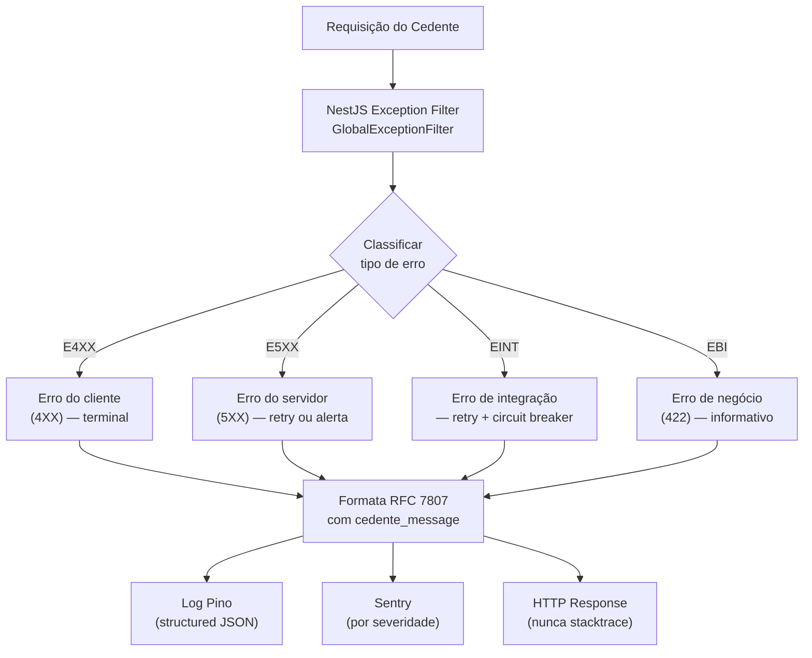
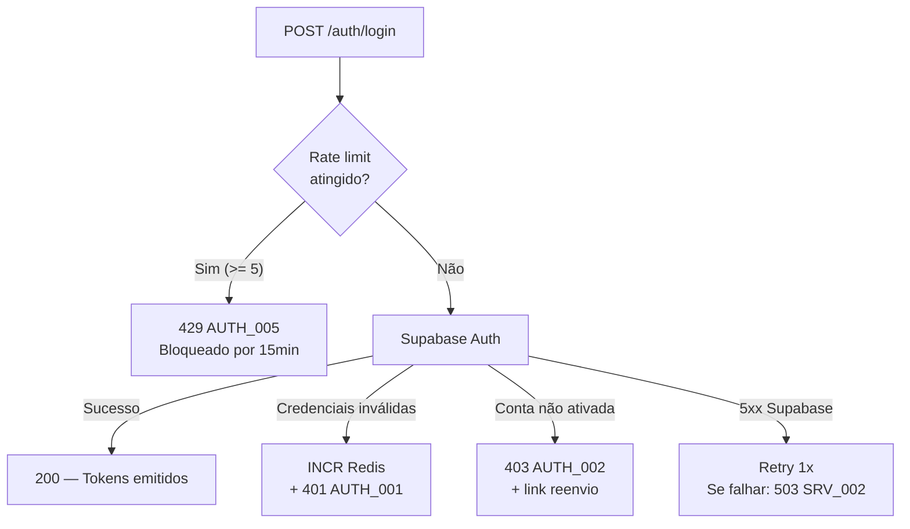
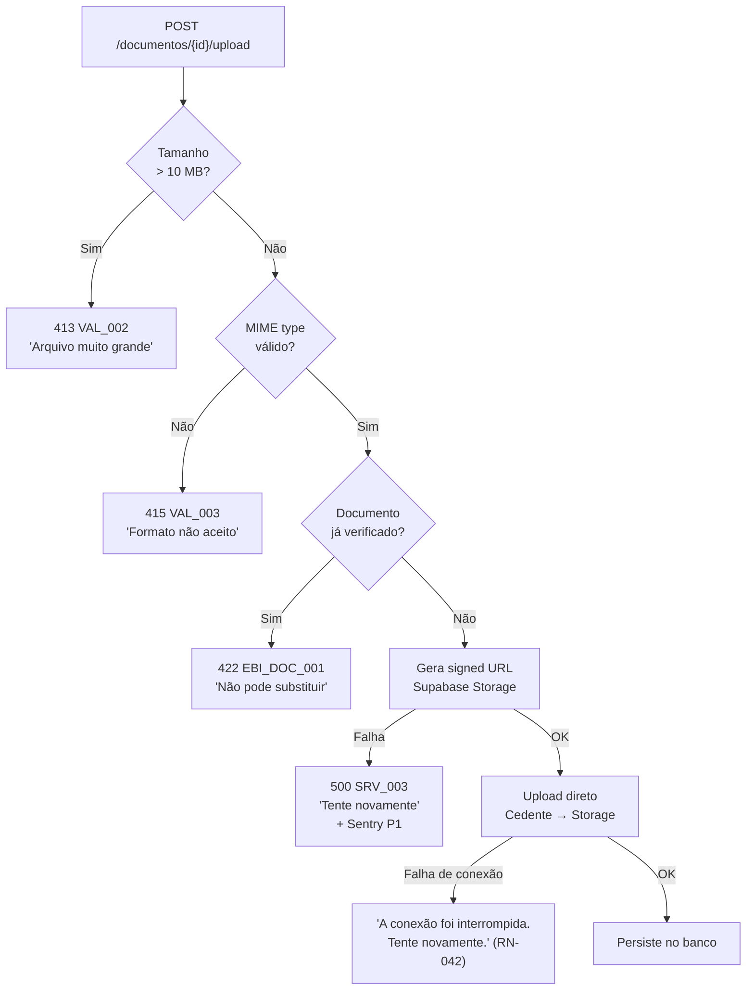
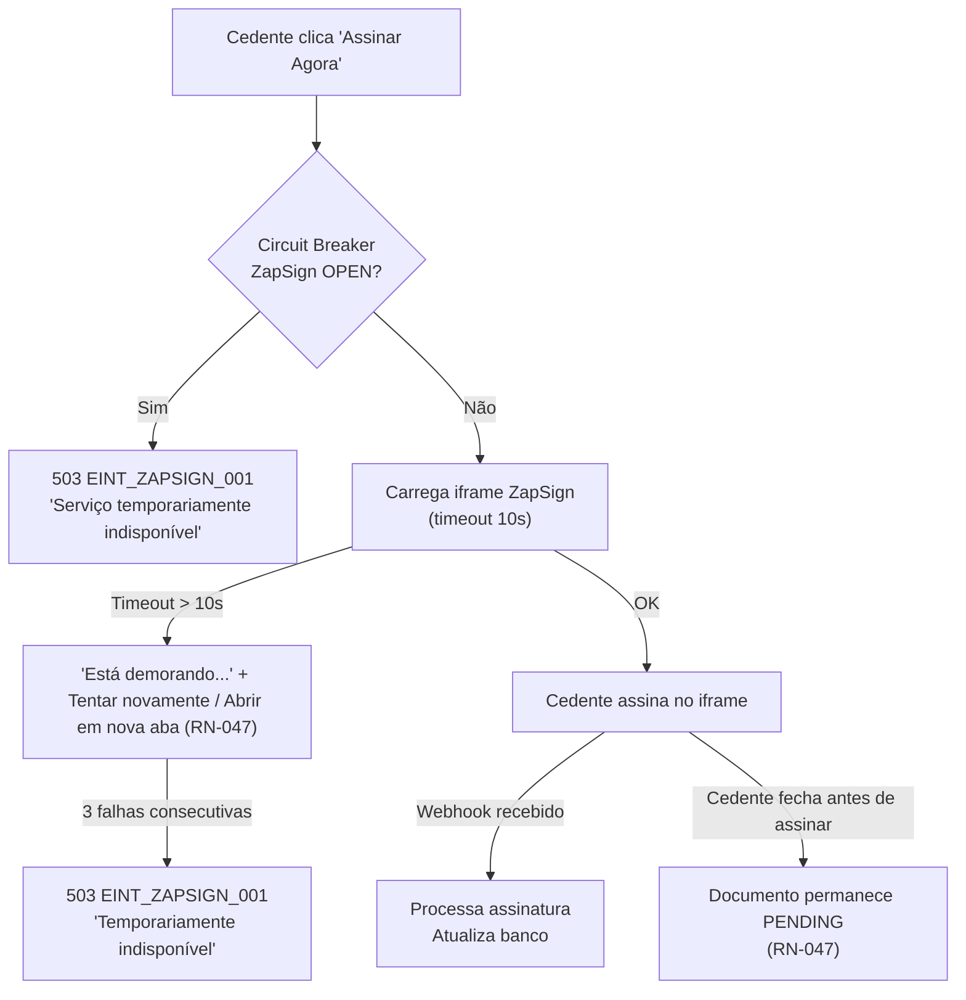
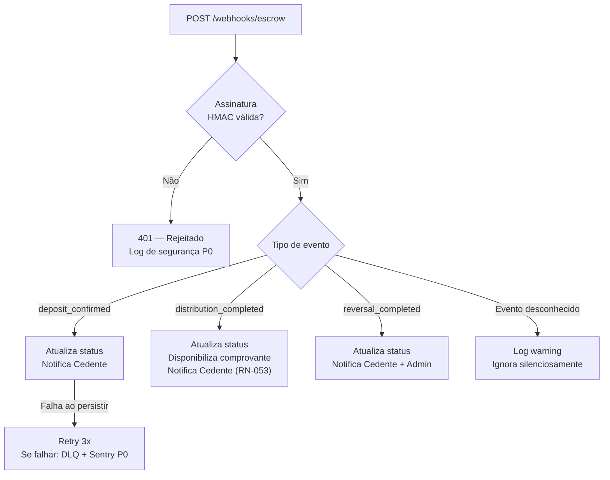
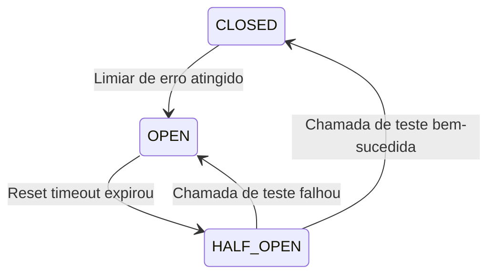

# 20 - Error Handling

## Módulo Cedente · Plataforma Repasse Seguro

| **Destinatário** | **Escopo** | **Módulo** | **Versão** | **Responsável** | **Data da versão** |
|---|---|---|---|---|---|
| Backend Lead / Tech Lead / Frontend Lead | Taxonomia de erros, padrão de resposta RFC 7807, retry, circuit breaker e alertas Sentry | Cedente | v1.0 | Claude Code Desktop | 2026-03-23 |

---

> 📌 **TL;DR**
>
> - **4 famílias de erro:** E4XX (erros do cliente), E5XX (erros do servidor), EINT (integrações externas), EBI (regras de negócio).
> - **Padrão de resposta:** RFC 7807 Problem Details — campos `type`, `title`, `status`, `detail`, `instance`, `code`, `cedente_message`.
> - **Dois níveis de mensagem:** `detail` (log técnico, nunca exibido ao usuário) + `cedente_message` (texto amigável, sempre exibido).
> - **Retry automático vs terminal:** erros 4XX são terminais (não há retry); erros 5XX e EINT têm retry 3x com backoff.
> - **Circuit breakers:** ZapSign e Conta Escrow com circuit breaker dedicado.
> - **Alertas Sentry por severidade:** P0 (PagerDuty), P1 (Slack #alerts < 5min), P2 (Slack #warnings < 30min).
> - **Sem erros genéricos ao usuário:** toda mensagem de erro tem `cedente_message` específica, nunca "Erro interno do servidor".

---

## 1. Princípios de Error Handling

### 1.1 Regras Fundamentais

| # | Regra | Razão |
|---|---|---|
| 1 | **Nunca expor stacktraces ao Cedente.** | Segurança — stacktrace revela infraestrutura interna. |
| 2 | **Toda mensagem ao Cedente deve ser acionável.** | "Tente novamente" ou "Entre em contato com o suporte" — nunca "Algo deu errado" sem próximos passos. |
| 3 | **Log técnico separado da mensagem de usuário.** | `detail` (Sentry/Pino) vs `cedente_message` (UI). |
| 4 | **Erros de validação devem ser específicos por campo.** | "O campo CPF é obrigatório" — não "Dados inválidos". |
| 5 | **Erros de integrações externas não bloqueiam todo o sistema.** | Degradação graciosa — funcionalidade reduzida, não zero. |
| 6 | **Toda falha de integração é rastreada no Sentry.** | Visibilidade operacional em tempo real. |
| 7 | **Circuit breakers protegem integrações críticas.** | Evita cascata de falhas em ZapSign e Escrow. |

### 1.2 Fluxo de Tratamento de Erros



---

## 2. Padrão de Resposta de Erro (RFC 7807 Problem Details)

Todos os erros da API do Módulo Cedente seguem o padrão RFC 7807.

### 2.1 Estrutura do Payload de Erro

```typescript
// Padrão obrigatório para todos os erros da API
interface ProblemDetails {
  type: string;            // URI que identifica o tipo de problema (ex: "/errors/auth/credentials-invalid")
  title: string;           // Resumo curto e imutável do tipo de problema
  status: number;          // Código HTTP (400, 401, 403, 404, 422, 429, 500, 503)
  detail: string;          // Descrição técnica para logs — NUNCA exibida ao Cedente
  instance: string;        // URI da requisição que causou o erro (ex: "/api/v1/casos/abc123")
  code: string;            // Código de erro interno (ex: "AUTH_001", "DOC_003")
  cedente_message: string; // Mensagem amigável e acionável para exibição na UI
  timestamp: string;       // ISO 8601 UTC
  trace_id?: string;       // Correlação com logs e Sentry (quando disponível)
  validation_errors?: ValidationError[]; // Apenas para erros de validação (400)
}

interface ValidationError {
  field: string;           // Nome do campo (ex: "cpf", "email")
  message: string;         // Mensagem amigável para o campo
  code: string;            // Código do erro de validação
}
```

### 2.2 Exemplos por Tipo de Erro

**Erro de autenticação (401):**
```json
{
  "type": "/errors/auth/credentials-invalid",
  "title": "Credenciais inválidas",
  "status": 401,
  "detail": "supabase.auth.signInWithPassword returned error: Invalid login credentials",
  "instance": "/api/v1/auth/login",
  "code": "AUTH_001",
  "cedente_message": "E-mail ou senha incorretos. Verifique seus dados e tente novamente.",
  "timestamp": "2026-03-23T14:30:00Z",
  "trace_id": "01HVXYZ123456789"
}
```

**Erro de validação (400):**
```json
{
  "type": "/errors/validation/invalid-input",
  "title": "Dados inválidos",
  "status": 400,
  "detail": "DTO validation failed: cpf must be a valid CPF",
  "instance": "/api/v1/auth/cadastro",
  "code": "VAL_001",
  "cedente_message": "Corrija os campos indicados para continuar.",
  "timestamp": "2026-03-23T14:30:00Z",
  "validation_errors": [
    { "field": "cpf", "message": "CPF inválido. Verifique os dígitos informados.", "code": "CADASTRO_003" }
  ]
}
```

**Erro de integração ZapSign (503):**
```json
{
  "type": "/errors/integration/zapsign-unavailable",
  "title": "Serviço de assinatura indisponível",
  "status": 503,
  "detail": "ZapSign API returned 503 after 3 retry attempts. Circuit breaker OPEN.",
  "instance": "/api/v1/documentos/envelopes",
  "code": "EINT_ZAPSIGN_001",
  "cedente_message": "O serviço de assinatura está temporariamente indisponível. Tente novamente em alguns minutos ou entre em contato com o suporte.",
  "timestamp": "2026-03-23T14:30:00Z",
  "trace_id": "01HVXYZ123456789"
}
```

**Erro de negócio (422):**
```json
{
  "type": "/errors/business/document-already-verified",
  "title": "Documento já verificado",
  "status": 422,
  "detail": "Attempt to replace document doc_id=abc123 which has status=VERIFIED",
  "instance": "/api/v1/documentos/abc123/upload",
  "code": "EBI_DOC_001",
  "cedente_message": "Este documento já foi verificado e não pode ser substituído. Se precisar de uma correção, entre em contato com nosso suporte.",
  "timestamp": "2026-03-23T14:30:00Z"
}
```

---

## 3. Taxonomia de Erros

### 3.1 Família E4XX — Erros do Cliente

Erros causados por dados incorretos, falta de autenticação ou acesso a recursos não permitidos. **São terminais — sem retry automático.**

| Código | HTTP | Situação | cedente_message |
|---|---|---|---|
| `AUTH_001` | 401 | Credenciais de login incorretas | "E-mail ou senha incorretos. Verifique seus dados e tente novamente." |
| `AUTH_002` | 403 | Conta não ativada | "Confirme seu e-mail antes de fazer login. Deseja reenviar o e-mail de ativação?" |
| `AUTH_003` | 403 | Conta bloqueada pelo Admin | "Sua conta está temporariamente suspensa. Entre em contato com o suporte." |
| `AUTH_004` | 401 | Token JWT inválido ou expirado | "Sua sessão expirou. Faça login novamente." |
| `AUTH_005` | 429 | Rate limit de login (5 tentativas) | "Muitas tentativas. Aguarde [X] minutos antes de tentar novamente." |
| `AUTH_006` | 401 | Refresh token expirado | "Sua sessão expirou. Faça login novamente." |
| `AUTH_007` | 400 | Link de ativação expirado (> 24h) | "O link de ativação expirou. Solicite um novo." |
| `AUTH_008` | 400 | Link de recuperação expirado (> 1h) | "O link de recuperação expirou. Solicite um novo." |
| `CADASTRO_001` | 400 | E-mail com formato inválido | "E-mail inválido. Verifique o endereço informado." |
| `CADASTRO_002` | 409 | E-mail já cadastrado | "Este e-mail já está cadastrado. Faça login ou recupere sua senha." |
| `CADASTRO_003` | 400 | CPF inválido (formato ou dígitos) | "CPF inválido. Verifique os dígitos informados." |
| `CADASTRO_004` | 409 | CPF já cadastrado (RN-001) | "Este CPF já possui uma conta cadastrada." |
| `CADASTRO_005` | 400 | Senha fraca | "A senha deve ter no mínimo 8 caracteres, com ao menos 1 número e 1 letra." |
| `CADASTRO_006` | 422 | CNPJ inválido ou irregular | "O CNPJ informado está com situação irregular na Receita Federal. Regularize antes de continuar." |
| `ACESSO_001` | 403 | Cedente tenta acessar caso de outro Cedente | "Acesso negado. Você não tem permissão para acessar este recurso." |
| `ACESSO_002` | 404 | Caso não encontrado ou não pertence ao Cedente | "Caso não encontrado. Verifique se o endereço está correto." |
| `VAL_001` | 400 | Erro de validação de DTO (genérico) | "Corrija os campos indicados para continuar." (com `validation_errors`) |
| `VAL_002` | 413 | Upload acima de 10 MB (RN-042) | "O arquivo é muito grande. O limite é de 10 MB por documento. Compacte o arquivo ou digitalize com resolução menor." |
| `VAL_003` | 415 | Formato de arquivo não suportado (RN-042) | "Formato não aceito. Envie o documento em PDF, JPG ou PNG." |
| `VAL_004` | 400 | Contraproposta abaixo do piso do cenário (RN-035) | "O valor informado está abaixo do mínimo permitido para o cenário [X]. O valor mínimo é R$ [valor]." |
| `AI_001` | 429 | Rate limit do Guardião (30 msg/h) | "Você atingiu o limite de mensagens. Tente novamente em [X] minutos." |
| `AI_002` | 400 | Mensagem ao Guardião muito longa (> 1.000 chars) | "Mensagem muito longa. Por favor, seja mais conciso e tente novamente." |

### 3.2 Família E5XX — Erros do Servidor

Erros internos inesperados. **Têm retry automático na camada de infraestrutura.** Alerta obrigatório no Sentry.

| Código | HTTP | Situação | cedente_message | Sentry |
|---|---|---|---|---|
| `SRV_001` | 500 | Erro inesperado não tratado | "Algo inesperado aconteceu. Nossa equipe foi notificada. Tente novamente em alguns minutos." | P0 |
| `SRV_002` | 500 | Falha ao persistir no banco (Supabase) | "Não foi possível salvar suas informações. Tente novamente." | P0 |
| `SRV_003` | 500 | Falha ao gerar signed URL para upload | "Não foi possível iniciar o upload. Tente novamente." | P1 |
| `SRV_004` | 500 | Falha ao publicar mensagem no RabbitMQ | Log interno. Retry automático. | P1 |
| `SRV_005` | 503 | Serviço em manutenção planejada | "O Repasse Seguro está em manutenção. Previsão de retorno: [horário]." | P2 |

### 3.3 Família EINT — Erros de Integração

Erros de APIs externas. **Têm retry automático (3x com backoff) e circuit breaker.**

| Código | Integração | Situação | cedente_message | Circuit Breaker |
|---|---|---|---|---|
| `EINT_ZAPSIGN_001` | ZapSign | Serviço indisponível (5xx) | "O serviço de assinatura está temporariamente indisponível. Tente novamente em alguns minutos." | Sim |
| `EINT_ZAPSIGN_002` | ZapSign | Timeout ao carregar iframe | "O serviço de assinatura está demorando para responder. Tente novamente ou abra em nova aba." | Não (timeout unitário) |
| `EINT_ZAPSIGN_003` | ZapSign | Webhook com assinatura inválida | Log de segurança P0. Requsição rejeitada silenciosamente. | Não |
| `EINT_ESCROW_001` | Conta Escrow | Serviço indisponível | "O serviço financeiro está temporariamente indisponível. Última atualização: [data/hora]." | Sim |
| `EINT_ESCROW_002` | Conta Escrow | Falha ao confirmar depósito | Log interno + alerta Admin. Não exibido ao Cedente. | Não |
| `EINT_RESEND_001` | Resend | Falha no envio de e-mail | Log interno + retry automático. Não exibido ao Cedente. | Não |
| `EINT_OPENAI_001` | OpenAI | Rate limit (429) | "O Guardião está sobrecarregado agora. Tente novamente em alguns minutos." | Não |
| `EINT_OPENAI_002` | OpenAI | Serviço indisponível (5xx) | "O Guardião está temporariamente indisponível. Tente novamente mais tarde." | Sim |
| `EINT_OPENAI_003` | OpenAI | Timeout (> 30s) | "O Guardião está demorando para responder. Tente novamente." | Não |
| `EINT_RF_001` | Receita Federal | API indisponível | Banner amarelo: "Verificação do CNPJ pendente. O cadastro será submetido, mas pode ser rejeitado se o CNPJ estiver irregular." | Não (fallback disponível) |

### 3.4 Família EBI — Erros de Regras de Negócio

Erros que indicam violação de uma regra de negócio. Retornam `422 Unprocessable Entity`. **São terminais — comunicam claramente a restrição ao Cedente.**

| Código | Situação | cedente_message | RN |
|---|---|---|---|
| `EBI_DOC_001` | Upload em documento já verificado (RN-044) | "Este documento já foi verificado e não pode ser substituído. Se precisar de uma correção, entre em contato com o suporte." | RN-044 |
| `EBI_DOC_002` | Avanço para triagem com dossiê incompleto | "Você ainda tem [X] documentos pendentes. Envie todos os documentos antes de avançar." | RN-043 |
| `EBI_CASO_001` | Cadastro de imóvel duplicado (RN-019) | "Este imóvel já possui um caso ativo na plataforma. Um imóvel só pode ter um caso ativo por vez." | RN-019 |
| `EBI_CASO_002` | Cancelamento de caso após Fechamento | "Não é possível cancelar um caso após o Fechamento. Para desistir, use o fluxo de desistência formal disponível no painel." | RN-055 |
| `EBI_PROP_001` | Contraproposta abaixo do piso | "O valor informado está abaixo do mínimo permitido para o cenário selecionado." | RN-035 |
| `EBI_PROP_002` | Resposta após expiração da proposta (RN-031) | "Esta proposta já expirou e não pode mais ser respondida. Aguarde novas propostas." | RN-031 |
| `EBI_ESC_001` | Escalonamento acima do cenário atual (RN-029) | "Não é possível subir de cenário. O escalonamento só é permitido para cenários inferiores." | RN-029 |
| `EBI_ESC_002` | Escalonamento durante cooldown de 7 dias (RN-027) | "Você já realizou um escalonamento recentemente. Próximo escalonamento liberado em [data]." | RN-027 |
| `EBI_ESC_003` | Escalonamento durante negociação ativa (fila) | "Há uma proposta em negociação. Seu pedido de escalonamento foi colocado em fila e será processado após a conclusão da negociação." | RN-025 |
| `EBI_ASS_001` | Tentativa de substituir documento assinado (RN-049) | "Este documento já foi assinado e não pode ser substituído. Entre em contato com o suporte se precisar de uma correção." | RN-049 |
| `EBI_FIN_001` | Distribuição para conta bancária de CNPJ divergente (RN-072) | "A distribuição está pendente. A conta bancária informada não corresponde ao CNPJ cadastrado. Entre em contato com o suporte." | RN-072 |
| `EBI_LGPD_001` | Tentativa de desativar notificação crítica | "Esta notificação é obrigatória para mantê-lo informado sobre eventos financeiros importantes e não pode ser desativada." | RN-056 |

---

## 4. Error Handling por Domínio

### 4.1 Autenticação



### 4.2 Upload de Documentos



### 4.3 Assinatura ZapSign



### 4.4 Conta Escrow



---

## 5. Retry Automático vs Erro Terminal

| Tipo de erro | Retry automático? | Estratégia |
|---|---|---|
| `4XX` (E4XX) | **Não** | Terminal — erro do cliente. Retorna imediatamente. |
| `422 EBI_*` | **Não** | Terminal — violação de regra de negócio. Informa o Cedente. |
| `429 Rate Limit` | **Não** | Terminal — aguardar `retry_after`. |
| `5XX E5XX` (exceto 503 manutenção) | **Sim** | Retry 3x: imediato → 2min → 10min. Se persistir: DLQ + Sentry P0. |
| `EINT_ZAPSIGN_*` | **Sim** (para operações de geração) | Retry 3x: 2min → 10min → 1h. Circuit breaker após 5 falhas/60s. |
| `EINT_ESCROW_*` | **Sim** (para consultas de saldo) | Retry 3x. Usa cache Redis como fallback. |
| `EINT_RESEND_*` | **Sim** (via RabbitMQ) | Retry 3x com DLQ. Não bloqueia o fluxo principal. |
| `EINT_OPENAI_*` | **Sim** (para respostas do Guardião) | Exponential backoff: 2s → 10s → 60s. Máx 3 tentativas. |

---

## 6. Circuit Breakers

### 6.1 ZapSign — Circuit Breaker

```typescript
// Implementação com nestjs-circuit-breaker ou Opossum
const zapSignCircuitBreaker = new CircuitBreaker(zapSignApiCall, {
  timeout: 10000,           // 10 segundos por requisição
  errorThresholdPercentage: 50,  // Abre após 50% de falhas
  resetTimeout: 300000,     // 5 minutos em estado OPEN
  volumeThreshold: 5,       // Mínimo 5 chamadas para avaliar
  fallback: () => {
    throw new ServiceUnavailableException({
      code: 'EINT_ZAPSIGN_001',
      cedente_message: 'O serviço de assinatura está temporariamente indisponível. Tente novamente em alguns minutos.',
    });
  },
});
```

### 6.2 Conta Escrow — Circuit Breaker

```typescript
const escrowCircuitBreaker = new CircuitBreaker(escrowApiCall, {
  timeout: 15000,           // 15 segundos (transações financeiras podem ser lentas)
  errorThresholdPercentage: 40,
  resetTimeout: 600000,     // 10 minutos em estado OPEN
  volumeThreshold: 3,
  fallback: (cached_status) => {
    // Retorna último status conhecido com nota de stale data
    return {
      ...cached_status,
      stale: true,
      stale_since: new Date().toISOString(),
    };
  },
});
```

### 6.3 Estados do Circuit Breaker



| Estado | Comportamento |
|---|---|
| CLOSED | Operação normal — chamadas passam normalmente |
| OPEN | Todas as chamadas retornam fallback imediatamente — sem bater na API |
| HALF-OPEN | Uma chamada de teste é permitida para verificar recuperação |

---

## 7. Mensagens de Erro por Contexto de UI

### 7.1 Princípio UX — Mensagens Acionáveis

Toda mensagem de erro exibida ao Cedente deve conter:

1. **O que aconteceu** (em linguagem simples)
2. **O que ele pode fazer** (próximo passo claro)

| ❌ Errado | ✅ Correto |
|---|---|
| "Erro interno do servidor" | "Algo inesperado aconteceu. Nossa equipe foi notificada. Tente novamente em alguns minutos." |
| "Dados inválidos" | "O CPF informado está incorreto. Verifique os dígitos e tente novamente." |
| "Acesso negado" | "Você não tem permissão para acessar este recurso. Se acredita que isto é um erro, entre em contato com o suporte." |
| "Arquivo rejeitado" | "O arquivo é muito grande. O limite é de 10 MB. Compacte o arquivo ou digitalize com resolução menor." |
| "Serviço indisponível" | "O serviço de assinatura está temporariamente indisponível. Tente novamente em alguns minutos." |

### 7.2 Componentes de Erro no Frontend

```typescript
// Componente padrão para exibição de erros na UI
// apps/web-cedente/src/components/ErrorDisplay.tsx

interface ErrorDisplayProps {
  code: string;
  cedente_message: string;
  action?: {
    label: string;
    onClick: () => void;
  };
  severity: 'error' | 'warning' | 'info';
}

// Uso nos formulários — erros de campo
interface FieldErrorProps {
  field: string;
  message: string; // da propriedade validation_errors[].message
}
```

### 7.3 Toast vs Inline vs Modal

| Tipo de erro | Componente UI | Exemplo |
|---|---|---|
| Erro de campo de formulário | Inline (abaixo do campo) | "CPF inválido" |
| Erro de ação (botão) | Toast (snackbar, 5s) | "Não foi possível salvar. Tente novamente." |
| Erro bloqueante de negócio | Inline (dentro da seção) | "Este documento já foi verificado e não pode ser substituído." |
| Erro de serviço crítico | Modal (não dispensável) | ZapSign offline — não pode assinar |
| Rate limit / cooldown | Banner topo (dismissível) | "Aguarde X dias para o próximo escalonamento." |

---

## 8. Observabilidade e Alertas Sentry

### 8.1 Configuração por Severidade

| Severidade | Limiar de alerta | Canal | Tempo de resposta |
|---|---|---|---|
| P0 (Fatal) | Qualquer ocorrência | PagerDuty + Slack #incidents | Imediato |
| P1 (Error) | > 1 ocorrência em 5min | Slack #alerts | < 5 minutos |
| P2 (Warning) | > 10 ocorrências em 30min | Slack #warnings | < 30 minutos |
| P3 (Info) | Sem alerta ativo | Log apenas | — |

### 8.2 Erros P0 (Fatal) do Módulo Cedente

| Erro | Motivo ser P0 |
|---|---|
| Falha total de autenticação Supabase | Todo o painel fica inacessível |
| Webhook ZapSign com assinatura inválida (tentativa de fraude) | Segurança — possível ataque |
| Falha ao persistir assinatura no banco (após webhook ZapSign) | Perda de dado legal crítico |
| Distribução Escrow sem comprovante | Erro financeiro irreversível |
| Acesso cruzado de dados entre Cedentes (RLS leak) | Violação de privacidade grave |

### 8.3 Contexto Obrigatório no Sentry

```typescript
// Configuração de contexto no GlobalExceptionFilter
Sentry.withScope((scope) => {
  scope.setTag('module', 'cedente');
  scope.setTag('error_family', errorFamily); // 'E4XX' | 'E5XX' | 'EINT' | 'EBI'
  scope.setTag('error_code', errorCode);
  scope.setUser({ id: cedente_id_hash }); // Hash — nunca PII direta
  scope.setExtra('request_id', trace_id);
  scope.setExtra('endpoint', request.url);
  scope.setExtra('http_method', request.method);
  // Nunca incluir: senha, token JWT, dados pessoais do Cedente
  Sentry.captureException(error);
});
```

---

## 9. GlobalExceptionFilter (NestJS)

```typescript
// apps/api/src/filters/global-exception.filter.ts
@Catch()
export class GlobalExceptionFilter implements ExceptionFilter {
  constructor(
    private readonly logger: PinoLogger,
    private readonly sentryService: SentryService,
  ) {}

  catch(exception: unknown, host: ArgumentsHost): void {
    const ctx = host.switchToHttp();
    const response = ctx.getResponse<Response>();
    const request = ctx.getRequest<Request>();

    // 1. Classifica o erro
    const { status, code, cedente_message, family } = this.classify(exception);

    // 2. Gera trace_id para correlação
    const trace_id = request.headers['x-trace-id'] as string || ulid();

    // 3. Monta Problem Details (RFC 7807)
    const problemDetails: ProblemDetails = {
      type: `/errors/${family.toLowerCase()}/${code.toLowerCase()}`,
      title: this.getTitleByCode(code),
      status,
      detail: exception instanceof Error ? exception.message : String(exception),
      instance: request.url,
      code,
      cedente_message,
      timestamp: new Date().toISOString(),
      trace_id,
    };

    // 4. Loga estruturado (Pino)
    this.logger.error({
      trace_id,
      code,
      family,
      status,
      url: request.url,
      method: request.method,
      error: exception instanceof Error ? exception.stack : String(exception),
    });

    // 5. Alerta Sentry (apenas E5XX e EINT com severidade >= P2)
    if (['E5XX', 'EINT'].includes(family)) {
      this.sentryService.captureWithContext(exception, { trace_id, code, family });
    }

    // 6. Responde ao Cedente (nunca stacktrace)
    response.status(status).json(problemDetails);
  }
}
```

---

## 10. Checklist de Error Handling

| # | Verificação | Obrigatório |
|---|---|---|
| 1 | Todo endpoint tem `cedente_message` específica — sem "Erro interno" genérico | Sim |
| 2 | Stacktraces nunca retornados na resposta HTTP | Sim |
| 3 | Erros de validação incluem `validation_errors[]` com campos específicos | Sim |
| 4 | Rate limiting de login implementado (5 tentativas / 15min) | Sim |
| 5 | Circuit breaker configurado para ZapSign e Conta Escrow | Sim |
| 6 | Webhooks ZapSign e Escrow validam HMAC antes de processar | Sim |
| 7 | Alertas Sentry P0/P1 configurados com canal e tempo de resposta | Sim |
| 8 | `GlobalExceptionFilter` registrado em todos os módulos NestJS | Sim |
| 9 | Erros de integração não vazam dados internos na `cedente_message` | Sim |
| 10 | Retry automático implementado para E5XX e EINT (exceto terminais) | Sim |
