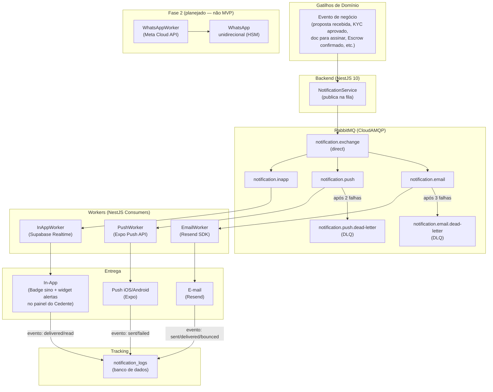
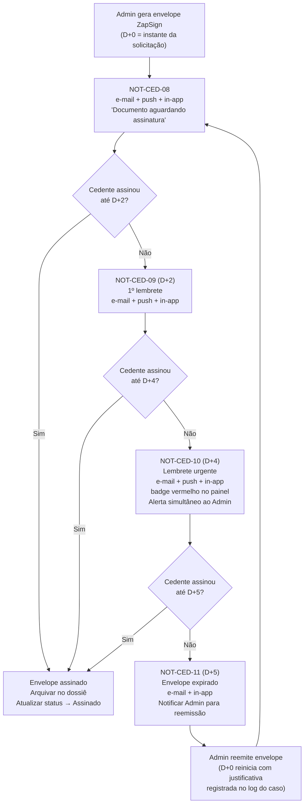
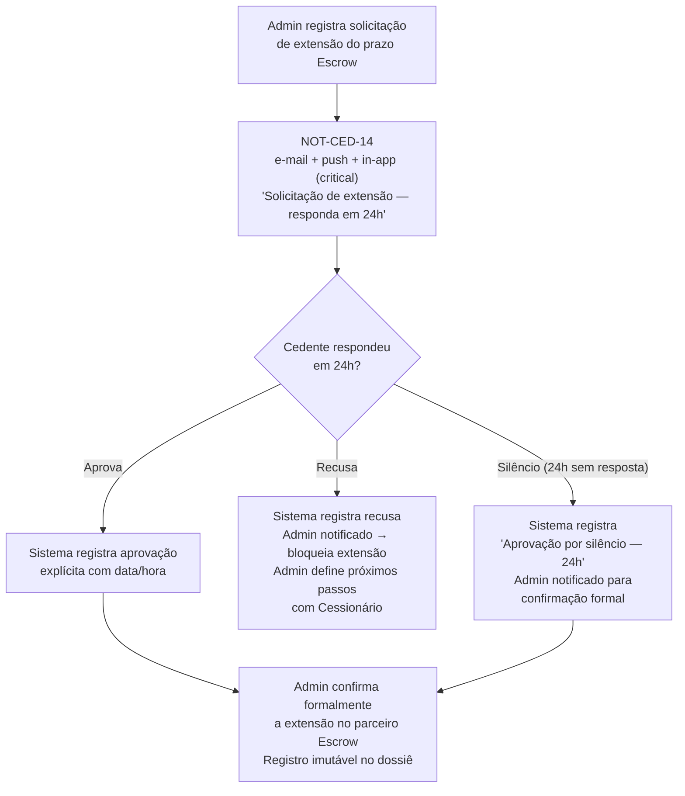

# 21 - Notificações, Templates e Implementação

## Módulo Cedente · Plataforma Repasse Seguro

| **Nome do Documento** | **Versão** | **Data** | **Autor** | **Status** |
|---|---|---|---|---|
| 21 - Notificações, Templates e Implementação | v1.0 | 2026-03-23 (America/Fortaleza) | Claude Code Desktop | Aprovado |

---

> **TL;DR**
>
> - **4 canais suportados:** e-mail (Resend — obrigatório, nunca desabilitável), push mobile (Expo Notifications), in-app (Supabase Realtime), WhatsApp unidirecional (Fase 2 — planejado, não implementado no MVP).
> - **14 templates mapeados** (NOT-CED-01 a NOT-CED-14) cobrindo ativação de conta, KYC, publicação de caso, propostas, negociação, assinaturas ZapSign, Escrow e conclusão de caso.
> - **Envio assíncrono obrigatório** via RabbitMQ — nunca síncrono na request principal.
> - **Notificações críticas** (proposta recebida, assinatura ZapSign, Escrow, fechamento, distribuição) não podem ser desabilitadas; e-mail é canal mínimo garantido (RN-056).
> - **In-app como fallback universal:** se todos os canais externos falham, o Cedente acessa notificações no painel via Supabase Realtime.
> - **Régua ZapSign (RN-094):** D+0 (envio), D+2 (1º lembrete), D+4 (lembrete urgente + alerta Admin), D+5 (expiração).
> - **Fluxo Escrow (RN-093):** solicitação de extensão de prazo notifica Cedente com janela de 24h para aprovar ou recusar.
> - **LGPD:** opt-out disponível para canais não críticos; retenção de logs de notificação: 90 dias.
> - **WhatsApp:** planejar estrutura de templates HSM mas não implementar no MVP.

---

## 1. Arquitetura de Notificações



### 1.1 Fluxo de Envio

```typescript
// NotificationService — publicação assíncrona na fila
async function notify(event: NotificationEvent): Promise<void> {
  // 1. Buscar preferências do usuário (Cedente)
  const prefs = await getNotificationPreferences(event.cedenteId)

  // 2. Determinar canais elegíveis (respeitar preferências e regras de criticidade)
  const channels = getEligibleChannels(event.notificationId, prefs)

  // 3. Criar registro in-app ANTES de publicar na fila (garantia de entrega)
  await db.notifications.create({
    cedenteId: event.cedenteId,
    type: event.notificationId,
    title: renderTitle(event.templateId, event.variables),
    body: renderBody(event.templateId, event.variables),
    deepLink: event.deepLink,
    isRead: false
  })

  // 4. Publicar mensagem na fila para cada canal externo
  for (const channel of channels.filter(c => c !== 'inapp')) {
    await rabbitmq.publish('notification.exchange', channel, {
      notificationId: event.notificationId,
      cedenteId: event.cedenteId,
      templateId: event.templateId,
      variables: event.variables,
      priority: event.priority,
      correlationId: event.correlationId,
      scheduledAt: event.scheduledAt ?? new Date()
    })
  }
}
```

---

## 2. Canais

### 2.1 E-mail (Resend) — Canal Mínimo Obrigatório

> **Regra RN-056:** E-mail nunca pode ser desabilitado pelo Cedente. É o canal mínimo garantido para todas as notificações críticas (proposta recebida, fechamento, distribuição financeira). O sistema rejeita qualquer tentativa de desabilitação exibindo: "Esta notificação é obrigatória para mantê-lo informado sobre eventos importantes."

| Campo | Valor |
|---|---|
| Provedor | Resend SDK (`resend` npm) |
| Remetente | `noreply@repasseseguro.com.br` com display name `"Repasse Seguro"` |
| Retry | 3 tentativas com backoff exponencial (30s → 60s → 120s) |
| DLQ após | 3 falhas consecutivas → `notification.email.dead-letter` |
| Rate limit | 50.000 e-mails/mês (plano Resend Pro); 100 req/s |
| Prioridade de fila | `critical` e `high` → fila prioritária; `normal` → fila padrão |
| Templates | React Email (`.tsx` em `src/modules/notification/templates/email/`) |
| Fallback | In-app como fallback universal |
| SLA de envio (RN-056) | Máximo 5 minutos após o evento de domínio |

**Payload da fila:**
```json
{
  "channel": "email",
  "to": "cedente@email.com",
  "templateId": "NOT-CED-05",
  "variables": {
    "name": "João Silva",
    "propertyName": "Apto 302 — Residencial das Flores",
    "proposalValue": "45000.00",
    "casoCode": "CAS-0087",
    "deepLink": "repasse://cedente/casos/cas-0087/propostas"
  },
  "correlationId": "uuid-v4",
  "priority": "critical"
}
```

### 2.2 Push Mobile (Expo Notifications)

| Campo | Valor |
|---|---|
| Provedor | Expo Push API (`https://exp.host/--/api/v2/push/send`) |
| Token storage | `notification_tokens` table (`userId`, `pushToken`, `platform`, `createdAt`) |
| Retry | 2 tentativas com backoff (30s → 60s) |
| DLQ após | 2 falhas consecutivas → `notification.push.dead-letter` |
| Tokens inválidos | `DeviceNotRegistered` → token removido automaticamente da tabela |
| Deep links | Obrigatório em toda push — esquema `repasse://` |
| Permissão | Solicitada contextualmente no primeiro evento relevante ao Cedente |
| Fallback | E-mail + in-app |

**Payload de push:**
```json
{
  "to": "ExponentPushToken[xxxxx]",
  "title": "Nova proposta recebida",
  "body": "Você recebeu uma proposta de R$ 45.000 para o Apto 302 — Residencial das Flores. Avalie no painel.",
  "data": {
    "deepLink": "repasse://cedente/casos/cas-0087/propostas",
    "notificationId": "NOT-CED-05",
    "casoId": "cas-0087"
  },
  "sound": "default",
  "badge": 1
}
```

### 2.3 In-App (Supabase Realtime)

| Campo | Valor |
|---|---|
| Mecanismo | Supabase Realtime (WebSocket subscription na tabela `notifications`) |
| Subscription | Filtrada por `cedente_id` (isolamento via RLS) |
| Retry | Reconexão automática via Supabase Realtime SDK |
| Exibição | Badge no ícone de sino (aria-label: "Notificações — [X] não lidas") + widget de alertas no painel (RN-057) |
| SLA de exibição (RN-057) | Máximo 30 segundos após o evento |
| Canal garantido | Sim — always on; entregue independentemente de preferências do usuário |
| Retenção | 90 dias no banco (soft delete após prazo) |

> **RN-057:** O badge de sino incrementa a cada nova notificação não lida. Ao clicar no sino, o Cedente vê a lista de notificações recentes e, ao clicar em cada item, é redirecionado para a tela contextual do evento.

### 2.4 WhatsApp Unidirecional — Fase 2 (Planejado, não MVP)

> **[DECISÃO: Fase 2]** WhatsApp não implementado no MVP. Motivo: exige aprovação prévia de templates HSM pela Meta (processo de 1–7 dias úteis), número de telefone dedicado e opt-in explícito do usuário (obrigação regulatória da Meta e LGPD). Custo adicional por mensagem. E-mail + push + in-app cobrem 100% dos casos críticos no MVP. WhatsApp entra como canal complementar na Fase 2 para aumentar taxa de leitura em notificações críticas (ZapSign, Escrow).

**Estrutura planejada de templates HSM (para aprovação futura na Meta):**

| Template HSM | Caso de uso | Variáveis previstas |
|---|---|---|
| `repasse_seguro_ativacao` | NOT-CED-01 — Ativação de conta | `{{1}}` = nome, `{{2}}` = link de ativação |
| `repasse_seguro_proposta` | NOT-CED-05 — Proposta recebida | `{{1}}` = nome, `{{2}}` = imóvel, `{{3}}` = valor |
| `repasse_seguro_zapsign_d0` | NOT-CED-08 — Doc para assinar | `{{1}}` = nome, `{{2}}` = tipo de documento, `{{3}}` = prazo |
| `repasse_seguro_zapsign_d2` | NOT-CED-09 — Lembrete D+2 | `{{1}}` = nome, `{{2}}` = dias decorridos |
| `repasse_seguro_zapsign_urgente` | NOT-CED-10 — Lembrete urgente D+4 | `{{1}}` = nome, `{{2}}` = imóvel |
| `repasse_seguro_escrow_confirmado` | NOT-CED-12 — Escrow confirmado | `{{1}}` = nome, `{{2}}` = valor depositado |
| `repasse_seguro_pagamento_liberado` | NOT-CED-13 — Pagamento liberado | `{{1}}` = nome, `{{2}}` = valor líquido |

---

## 3. Templates (Inventário Completo)

| ID | Nome | Gatilho | Canais | Prioridade | Pode desativar? | Variáveis |
|---|---|---|---|---|---|---|
| NOT-CED-01 | Ativação de conta | Cadastro concluído (RN-001) | E-mail | `high` | Não | `name`, `verificationLink`, `expiresInHours` |
| NOT-CED-02 | Aprovação de conta (KYC aprovado) | KYC aprovado pelo Admin | E-mail, Push, In-app | `high` | Push: Sim | `name` |
| NOT-CED-03 | Rejeição KYC (com motivo) | KYC reprovado pelo Admin | E-mail, Push, In-app | `high` | Push: Sim | `name`, `reason`, `supportLink` |
| NOT-CED-04 | Novo caso cadastrado / publicado | Caso muda para "Oferta Ativa" (RN-057 evento 7) | E-mail, Push, In-app | `high` | Push: Sim | `name`, `propertyName`, `casoCode`, `deepLink` |
| NOT-CED-05 | Proposta recebida de Cessionário | Admin registra proposta para o Cedente (RN-057 evento 8) | E-mail, Push, In-app | **`critical`** | Não | `name`, `propertyName`, `proposalValue`, `casoCode`, `expiresAt`, `deepLink` |
| NOT-CED-06 | Prazo de resposta à proposta expirando (24h) | 4 dias úteis após recebimento da proposta (RN-031) | E-mail, Push, In-app | **`critical`** | Não | `name`, `propertyName`, `proposalValue`, `casoCode`, `deadlineDate`, `deepLink` |
| NOT-CED-07 | Negociação finalizada — aceite mútuo | Aceite registrado; caso avança para formalização (RN-057 evento 10) | E-mail, Push, In-app | `high` | Push: Sim | `name`, `propertyName`, `agreedValue`, `casoCode`, `deepLink` |
| NOT-CED-08 | Documento para assinar disponível (ZapSign D+0) | Admin gera envelope ZapSign (RN-080, RN-094 D+0) | E-mail, Push, In-app | `high` | Push: Sim | `name`, `documentType`, `casoCode`, `signingDeadline`, `deepLink` |
| NOT-CED-09 | Lembrete ZapSign D+2 (1º lembrete) | 2 dias úteis sem assinatura (RN-094 D+2) | E-mail, Push, In-app | `high` | Push: Sim | `name`, `documentType`, `casoCode`, `daysElapsed`, `signingDeadline`, `deepLink` |
| NOT-CED-10 | Lembrete urgente ZapSign D+4 (2º lembrete) | 4 dias úteis sem assinatura — badge vermelho (RN-094 D+4) | E-mail, Push, In-app | **`critical`** | Não | `name`, `documentType`, `casoCode`, `daysElapsed`, `signingDeadline`, `deepLink` |
| NOT-CED-11 | Envelope ZapSign expirado (D+5) | 5 dias úteis sem assinatura (RN-094 D+5) | E-mail, In-app | `high` | Não | `name`, `documentType`, `casoCode`, `supportLink` |
| NOT-CED-12 | Escrow confirmado — depósito recebido | Admin confirma depósito na Conta Escrow (RN-083) | E-mail, Push, In-app | **`critical`** | Não | `name`, `propertyName`, `confirmedAmount`, `casoCode`, `releaseDate`, `deepLink` |
| NOT-CED-13 | Caso concluído — pagamento liberado | Distribuição realizada após período de reversão (RN-053, RN-057 evento 14) | E-mail, Push, In-app | **`critical`** | Não | `name`, `propertyName`, `netAmount`, `casoCode`, `receiptDeepLink` |
| NOT-CED-14 | Solicitação de extensão do Escrow (RN-093) | Admin registra solicitação de extensão de prazo | E-mail, Push, In-app | **`critical`** | Não | `name`, `propertyName`, `casoCode`, `extensionReason`, `newDeadlineProposed`, `responseDeadline`, `deepLink` |

> **Notificações críticas e indesabilitáveis:** NOT-CED-05, NOT-CED-06, NOT-CED-10, NOT-CED-12, NOT-CED-13, NOT-CED-14. E-mail é garantido mesmo que todos os outros canais estejam desabilitados (RN-056).

> **RN-085 — Isolamento total:** Nenhum template do Cedente revela dados do Cessionário (nome, CPF, e-mail, telefone). A variável `proposalValue` exibe apenas o valor da proposta — nunca quem a enviou.

### 3.1 Exemplo de Template — NOT-CED-05 (E-mail React Email)

```tsx
// apps/api/src/modules/notification/templates/email/not-ced-05.tsx
import {
  Html, Head, Preview, Body, Container,
  Heading, Text, Button, Section
} from '@react-email/components'

interface NotCed05Variables {
  name: string
  propertyName: string
  proposalValue: string      // ex: "45000.00"
  casoCode: string           // ex: "CAS-0087"
  expiresAt: string          // ex: "28/03/2026"
  deepLink: string
}

export function PropostaRecebidaEmailTemplate({
  name,
  propertyName,
  proposalValue,
  casoCode,
  expiresAt,
  deepLink
}: NotCed05Variables) {
  return (
    <Html>
      <Head />
      <Preview>Nova proposta recebida para {propertyName} — avalie agora</Preview>
      <Body style={{ fontFamily: 'Inter, sans-serif', backgroundColor: '#ffffff' }}>
        <Container>
          <Heading>Você recebeu uma proposta!</Heading>
          <Text>
            Olá, {name}. Uma proposta de{' '}
            <strong>R$ {formatCurrency(proposalValue)}</strong> foi recebida
            para o seu imóvel <strong>{propertyName}</strong> ({casoCode}).
          </Text>
          <Text>
            Você tem até <strong>{expiresAt}</strong> para avaliar e responder.
            Após este prazo, a proposta expirará automaticamente.
          </Text>
          <Section>
            <Button href={deepLink}>Avaliar proposta no painel</Button>
          </Section>
          <Text style={{ color: '#6B7280', fontSize: '12px' }}>
            Esta é uma notificação obrigatória. Não é possível desativá-la.
            Para dúvidas, acesse o painel e use o Guardião do Retorno.
          </Text>
        </Container>
      </Body>
    </Html>
  )
}
```

### 3.2 Exemplo de Template — NOT-CED-14 (Extensão Escrow — E-mail React Email)

```tsx
// apps/api/src/modules/notification/templates/email/not-ced-14.tsx
export function ExtensaoEscrowEmailTemplate({
  name,
  propertyName,
  casoCode,
  extensionReason,
  newDeadlineProposed,
  responseDeadline,
  deepLink
}: NotCed14Variables) {
  return (
    <Html>
      <Head />
      <Preview>Solicitação de extensão da Conta Escrow — responda até {responseDeadline}</Preview>
      <Body style={{ fontFamily: 'Inter, sans-serif', backgroundColor: '#ffffff' }}>
        <Container>
          <Heading>Extensão de prazo da Conta Escrow solicitada</Heading>
          <Text>
            Olá, {name}. Foi solicitada uma extensão do prazo da Conta Escrow
            para o seu imóvel <strong>{propertyName}</strong> ({casoCode}).
          </Text>
          <Text>
            <strong>Motivo:</strong> {extensionReason}<br />
            <strong>Novo prazo proposto:</strong> {newDeadlineProposed}
          </Text>
          <Text style={{ color: '#DC2626' }}>
            Você tem até <strong>{responseDeadline}</strong> para aprovar ou recusar.
            Se não responder, a extensão será considerada aprovada automaticamente
            (aprovação por silêncio — RN-093).
          </Text>
          <Section>
            <Button href={deepLink}>Responder no painel</Button>
          </Section>
        </Container>
      </Body>
    </Html>
  )
}
```

### 3.3 Anti-exemplos de Templates

> **Anti-exemplo 1 — Template hardcoded inline:**
> ```typescript
> await resend.emails.send({
>   subject: 'Proposta recebida',
>   html: `<h1>Olá ${name}</h1><p>Você recebeu uma proposta...</p>`  // inline — ERRADO
> })
> ```
> **Correto:** Template em arquivo `.tsx` separado em `templates/email/`, importado pelo `EmailWorker`.

> **Anti-exemplo 2 — Push sem deep link:**
> ```json
> { "title": "Proposta recebida", "body": "Avalie a proposta." }
> ```
> **Correto:** Toda push inclui `data.deepLink` apontando para a tela contextual (`repasse://cedente/casos/{casoId}/propostas`).

> **Anti-exemplo 3 — Envio síncrono na request:**
> ```typescript
> // No handler de proposta — ERRADO
> await notificationService.sendEmail(cedenteId, 'NOT-CED-05', variables)
> return { success: true }  // usuário aguarda o envio do e-mail
> ```
> **Correto:** `notificationService.notify()` persiste in-app e publica na fila imediatamente. Worker envia de forma assíncrona.

> **Anti-exemplo 4 — Revelar dados do Cessionário (viola RN-085):**
> ```typescript
> variables: {
>   buyerName: 'João Comprador',   // NUNCA — viola isolamento total
>   proposalValue: '45000.00'
> }
> ```
> **Correto:** Templates do Cedente nunca incluem nome, CPF ou dados do Cessionário.

> **Anti-exemplo 5 — Desabilitar NOT-CED-05 via API:**
> ```typescript
> // PATCH /cedentes/me/notification-preferences
> { "pushProposalReceived": false }  // PERMITIDO apenas para push
> // Mas "emailProposalReceived": false → BLOQUEADO (RN-056)
> ```
> **Correto:** Backend rejeita qualquer payload que tente desabilitar e-mail de notificações críticas.

---

## 4. Régua ZapSign — Implementação (RN-094)

A régua de lembretes de assinatura é implementada via scheduled jobs que consultam envelopes pendentes e disparam os eventos correspondentes.

### 4.1 Fluxo Completo da Régua



### 4.2 Scheduler — Implementação

```typescript
// apps/api/src/modules/notification/schedulers/zapsign-reminder.scheduler.ts
@Injectable()
export class ZapSignReminderScheduler {
  constructor(
    private readonly db: PrismaService,
    private readonly notificationService: NotificationService,
    private readonly businessDaysService: BusinessDaysService
  ) {}

  // Roda a cada hora — verifica envelopes pendentes
  @Cron('0 * * * *')
  async checkPendingEnvelopes(): Promise<void> {
    const pendingEnvelopes = await this.db.zapSignEnvelope.findMany({
      where: {
        status: 'pending',
        signedAt: null
      },
      include: { caso: true, cedente: true }
    })

    for (const envelope of pendingEnvelopes) {
      const businessDaysElapsed = this.businessDaysService.countBusinessDays(
        envelope.createdAt,
        new Date()
      )

      if (businessDaysElapsed >= 5 && !envelope.expiredNotifiedAt) {
        // D+5: envelope expirado
        await this.notificationService.notify({
          notificationId: 'NOT-CED-11',
          cedenteId: envelope.cedenteId,
          templateId: 'NOT-CED-11',
          variables: {
            name: envelope.cedente.name,
            documentType: envelope.documentType,
            casoCode: envelope.caso.code,
            supportLink: `repasse://cedente/casos/${envelope.casoId}/assinaturas`
          },
          priority: 'high',
          correlationId: envelope.id,
          deepLink: `repasse://cedente/casos/${envelope.casoId}/assinaturas`
        })
        await this.db.zapSignEnvelope.update({
          where: { id: envelope.id },
          data: { status: 'expired', expiredNotifiedAt: new Date() }
        })
        // Alertar Admin (canal interno)
        await this.adminAlertService.notifyEnvelopeExpired(envelope)

      } else if (businessDaysElapsed >= 4 && !envelope.urgentReminderSentAt) {
        // D+4: lembrete urgente + alerta Admin
        await this.notificationService.notify({
          notificationId: 'NOT-CED-10',
          cedenteId: envelope.cedenteId,
          templateId: 'NOT-CED-10',
          variables: {
            name: envelope.cedente.name,
            documentType: envelope.documentType,
            casoCode: envelope.caso.code,
            daysElapsed: String(businessDaysElapsed),
            signingDeadline: this.businessDaysService.addBusinessDays(envelope.createdAt, 5),
            deepLink: `repasse://cedente/casos/${envelope.casoId}/assinaturas`
          },
          priority: 'critical',
          correlationId: envelope.id,
          deepLink: `repasse://cedente/casos/${envelope.casoId}/assinaturas`
        })
        await this.db.zapSignEnvelope.update({
          where: { id: envelope.id },
          data: { urgentReminderSentAt: new Date() }
        })
        await this.adminAlertService.notifySigningOverdue(envelope, businessDaysElapsed)

      } else if (businessDaysElapsed >= 2 && !envelope.firstReminderSentAt) {
        // D+2: 1º lembrete
        await this.notificationService.notify({
          notificationId: 'NOT-CED-09',
          cedenteId: envelope.cedenteId,
          templateId: 'NOT-CED-09',
          variables: {
            name: envelope.cedente.name,
            documentType: envelope.documentType,
            casoCode: envelope.caso.code,
            daysElapsed: String(businessDaysElapsed),
            signingDeadline: this.businessDaysService.addBusinessDays(envelope.createdAt, 5),
            deepLink: `repasse://cedente/casos/${envelope.casoId}/assinaturas`
          },
          priority: 'high',
          correlationId: envelope.id,
          deepLink: `repasse://cedente/casos/${envelope.casoId}/assinaturas`
        })
        await this.db.zapSignEnvelope.update({
          where: { id: envelope.id },
          data: { firstReminderSentAt: new Date() }
        })
      }
    }
  }
}
```

---

## 5. Fluxo de Extensão do Escrow (RN-093)

### 5.1 Diagrama do Fluxo



### 5.2 Handler de Resposta à Extensão

```typescript
// PATCH /api/v1/cedentes/me/casos/:casoId/escrow-extension/:requestId
async function respondEscrowExtension(
  cedenteId: string,
  casoId: string,
  requestId: string,
  decision: 'approve' | 'refuse'
): Promise<void> {
  const request = await db.escrowExtensionRequest.findFirst({
    where: { id: requestId, casoId, status: 'pending' }
  })

  if (!request) throw new NotFoundException('Solicitação não encontrada ou já respondida.')

  const hoursElapsed = differenceInHours(new Date(), request.createdAt)
  if (hoursElapsed > 24) throw new BadRequestException('Prazo de resposta de 24h expirado.')

  await db.escrowExtensionRequest.update({
    where: { id: requestId },
    data: {
      status: decision === 'approve' ? 'approved' : 'refused',
      respondedAt: new Date(),
      respondedBy: cedenteId,
      decisionLabel: decision === 'approve' ? 'Aprovação explícita' : 'Recusa explícita'
    }
  })

  // Notificar Admin
  await adminAlertService.notifyEscrowExtensionDecision(requestId, decision)
}

// Job agendado: verificar silêncio após 24h
@Cron('0 * * * *')
async function checkEscrowExtensionSilence(): Promise<void> {
  const expiredRequests = await db.escrowExtensionRequest.findMany({
    where: {
      status: 'pending',
      createdAt: { lte: subHours(new Date(), 24) }
    }
  })

  for (const req of expiredRequests) {
    await db.escrowExtensionRequest.update({
      where: { id: req.id },
      data: {
        status: 'approved',
        respondedAt: new Date(),
        decisionLabel: 'Aprovação por silêncio — 24h'
      }
    })
    await adminAlertService.notifyEscrowExtensionSilenceApproval(req)
  }
}
```

---

## 6. Preferências do Usuário (Opt-out)

### 6.1 Schema de Preferências

```typescript
// Tabela: notification_preferences (por Cedente)
interface CedenteNotificationPreferences {
  cedenteId: string

  // E-mail: NUNCA desabilitável (RN-056)
  emailEnabled: true                    // sempre true — imutável

  // Push — habilitável/desabilitável por categoria
  pushEnabled: boolean                  // default: true
  pushKycUpdates: boolean               // default: true (NOT-CED-02, NOT-CED-03)
  pushCasoPublished: boolean            // default: true (NOT-CED-04)
  pushProposalReceived: boolean         // default: true (NOT-CED-05) — push pode ser desativado, e-mail não
  pushNegotiationFinalized: boolean     // default: true (NOT-CED-07)
  pushDocumentSigning: boolean          // default: true (NOT-CED-08, NOT-CED-09)

  // Lembretes (e-mail + push — podem ser desativados — RN-056)
  emailDocumentPendingReminder: boolean // default: true (lembrete 7 dias documentos pendentes)
  emailDraftExpiring: boolean           // default: true (lembretes rascunho dias 7/15/25)
  emailSigningReminder: boolean         // default: true (NOT-CED-09 — D+2 lembrete)
  pushProposalExpiring: boolean         // default: true (NOT-CED-06 — push opcional, e-mail obrigatório)

  // In-app: SEMPRE ativo (fallback universal — RN-057)
  inAppEnabled: true                    // sempre true — imutável

  updatedAt: Date
}
```

### 6.2 Regra de Canais por Notificação

```typescript
// Notificações críticas — nunca desabilitáveis (e-mail + push obrigatórios)
const CRITICAL_NOTIFICATIONS = [
  'NOT-CED-05',  // Proposta recebida (RN-056 evento 8)
  'NOT-CED-06',  // Prazo de proposta expirando (RN-056)
  'NOT-CED-10',  // Lembrete urgente ZapSign D+4 (RN-094)
  'NOT-CED-12',  // Escrow confirmado (RN-083)
  'NOT-CED-13',  // Pagamento liberado (RN-056 evento 14)
  'NOT-CED-14',  // Extensão Escrow — resposta 24h (RN-093)
]

function getEligibleChannels(
  notificationId: string,
  prefs: CedenteNotificationPreferences
): Channel[] {
  const channels: Channel[] = ['inapp']  // in-app sempre incluído (RN-057)

  // E-mail SEMPRE incluído (RN-056)
  channels.push('email')

  // Push: verificar preferências — críticas ignoram opt-out de push
  if (CRITICAL_NOTIFICATIONS.includes(notificationId)) {
    channels.push('push')  // críticas ignoram prefs de push
    return channels
  }

  if (!prefs.pushEnabled) return channels

  const pushRules: Record<string, boolean> = {
    'NOT-CED-02': prefs.pushKycUpdates,
    'NOT-CED-03': prefs.pushKycUpdates,
    'NOT-CED-04': prefs.pushCasoPublished,
    'NOT-CED-05': prefs.pushProposalReceived,
    'NOT-CED-07': prefs.pushNegotiationFinalized,
    'NOT-CED-08': prefs.pushDocumentSigning,
    'NOT-CED-09': prefs.pushDocumentSigning,
    'NOT-CED-11': prefs.pushDocumentSigning,
  }

  if (pushRules[notificationId]) {
    channels.push('push')
  }

  return channels
}
```

### 6.3 API de Preferências

```
GET    /api/v1/cedentes/me/notification-preferences
PATCH  /api/v1/cedentes/me/notification-preferences
```

**Response GET:**
```json
{
  "emailEnabled": true,
  "pushEnabled": true,
  "pushKycUpdates": true,
  "pushCasoPublished": true,
  "pushProposalReceived": true,
  "pushNegotiationFinalized": true,
  "pushDocumentSigning": true,
  "emailDocumentPendingReminder": true,
  "emailDraftExpiring": true,
  "emailSigningReminder": true,
  "pushProposalExpiring": true,
  "inAppEnabled": true
}
```

**Payload PATCH — campos bloqueados:**
```typescript
// Backend valida e rejeita qualquer tentativa de alterar campos imutáveis
const IMMUTABLE_FIELDS = ['emailEnabled', 'inAppEnabled']

// Se o payload tentar definir emailEnabled: false:
// → HTTP 400 Bad Request
// → Mensagem: "Esta notificação é obrigatória para mantê-lo informado sobre eventos importantes."
```

> **LGPD:** O Cedente tem direito de desabilitar canais opcionais a qualquer momento via `PATCH`. A atualização é imediata e confirmada com toast "Preferências de notificação atualizadas."

---

## 7. Fila e Processamento

### 7.1 Configuração RabbitMQ

| Exchange | Tipo | Queue | Dead-Letter Queue | Retry | Prioridade |
|---|---|---|---|---|---|
| `notification.exchange` | direct | `notification.email` | `notification.email.dead-letter` | 3x backoff exponencial (30s/60s/120s) | 4 níveis: `critical`=4, `high`=3, `normal`=2, `low`=1 |
| `notification.exchange` | direct | `notification.push` | `notification.push.dead-letter` | 2x backoff (30s/60s) | 3 níveis: `critical`=3, `high`=2, `normal`=1 |
| `notification.exchange` | direct | `notification.inapp` | — (sem DLQ — persistido no banco antes de publicar) | Sem retry | — |

### 7.2 Configuração de Filas (NestJS)

```typescript
// apps/api/src/modules/notification/notification.module.ts
const notificationQueues = {
  email: {
    exchange: 'notification.exchange',
    routingKey: 'email',
    options: {
      durable: true,
      arguments: {
        'x-dead-letter-exchange': 'notification.dlx',
        'x-dead-letter-routing-key': 'email.dead-letter',
        'x-max-priority': 4   // 4 níveis: 1=low, 2=normal, 3=high, 4=critical
      }
    }
  },
  push: {
    exchange: 'notification.exchange',
    routingKey: 'push',
    options: {
      durable: true,
      arguments: {
        'x-dead-letter-exchange': 'notification.dlx',
        'x-dead-letter-routing-key': 'push.dead-letter',
        'x-max-priority': 3
      }
    }
  },
  inapp: {
    exchange: 'notification.exchange',
    routingKey: 'inapp',
    options: {
      durable: true
      // Sem DLQ: in-app é persistido no banco ANTES de publicar
    }
  }
}
```

### 7.3 Rate Limiting por Canal

| Canal | Limite | Janela | Ação se exceder |
|---|---|---|---|
| E-mail (Resend) | 100 req/s | Contínuo | Backoff automático do SDK Resend |
| Push (Expo) | Batch de 100 tokens por request | Por request | Chunking automático no `PushWorker` |
| In-app (Supabase Realtime) | Sem limite relevante no MVP | — | — |

---

## 8. Tracking e Métricas

### 8.1 Schema de Log de Notificação

```typescript
// Tabela: notification_logs
interface NotificationLog {
  id: string                    // UUID
  notificationId: string        // NOT-CED-XX
  cedenteId: string
  channel: 'email' | 'push' | 'inapp'
  status: NotificationStatus
  externalId?: string           // ID do Resend ou ticket Expo
  metadata?: Record<string, unknown>  // ex: bounce reason, Expo error code
  correlationId: string
  createdAt: Date
  updatedAt: Date
}

enum NotificationStatus {
  QUEUED = 'queued',
  SENT = 'sent',
  DELIVERED = 'delivered',
  FAILED = 'failed',
  BOUNCED = 'bounced',
  READ = 'read'        // in-app: quando Cedente abre a notificação no painel
}
```

### 8.2 Eventos de Tracking por Canal

| Canal | Evento | Trigger |
|---|---|---|
| E-mail | `queued` | Mensagem publicada na fila |
| E-mail | `sent` | Resend aceita o e-mail para envio |
| E-mail | `delivered` | Webhook Resend: `email.delivered` |
| E-mail | `bounced` | Webhook Resend: `email.bounced` — marcar e-mail como inválido no cadastro |
| Push | `sent` | Expo retorna `ok` para o token |
| Push | `failed` | Expo retorna erro (`DeviceNotRegistered`, `InvalidCredentials`, etc.) |
| In-app | `delivered` | Registro criado no banco + Realtime entregue via WebSocket |
| In-app | `read` | Cedente clica na notificação no sino ou widget de alertas (RN-057) |

### 8.3 Métricas de Monitoramento

| Métrica | Threshold de Alerta | Canal de Alerta |
|---|---|---|
| Taxa de falha de e-mail | > 5% em 1h | Sentry + Slack #ops |
| Taxa de bounce de e-mail | > 2% em 24h | Slack #ops — revisão de lista de e-mails |
| Taxa de falha de push | > 10% em 1h | Slack #ops |
| Itens na DLQ de e-mail | > 10 | Slack #ops urgente |
| Itens na DLQ de push | > 20 | Slack #ops |
| NOT-CED-05/NOT-CED-06 não entregues (proposta crítica) | > 0 por 30min | PagerDuty P0 |
| NOT-CED-14 não entregue (extensão Escrow) | > 0 por 15min | PagerDuty P0 |
| NOT-CED-08/NOT-CED-10 não entregues (ZapSign crítico) | > 0 por 1h | Slack #ops urgente |

---

## 9. Testes

### 9.1 Modo de Teste em Desenvolvimento

- **E-mail (Resend):** Em `dev`, e-mails são enviados mas visíveis apenas no Resend Dashboard. Em testes unitários, configurar `RESEND_TEST_MODE=true` para interceptar envios sem delivery real.
- **Push (Expo):** Usar `ExponentPushToken[xxxxTEST]` para simular envios sem dispositivo real. Expo retorna `ok` para tokens de teste.
- **In-app:** Funciona normalmente via Supabase Realtime local (`supabase start`).
- **ZapSign Scheduler:** Usar `BUSINESS_DAYS_MOCK=true` para simular passagem de dias úteis sem aguardar tempo real.

### 9.2 Cenários de Teste Obrigatórios

| Cenário | Tipo | Expectativa |
|---|---|---|
| NOT-CED-05 enviado quando Admin registra proposta | Integration | E-mail + push + in-app entregues; `notification_logs` com status `sent` |
| NOT-CED-05 com push desabilitado pelo Cedente | Unit | E-mail e in-app enviados; push ignorado; log correto por canal |
| NOT-CED-05 com Resend indisponível | Unit (mock) | Retry 3x com backoff; in-app disponível; DLQ registrada |
| Webhook Resend `email.bounced` recebido | Integration | E-mail marcado como `bounced` em `notification_logs`; e-mail do Cedente marcado para revisão |
| Token Expo `DeviceNotRegistered` | Integration | Token removido da tabela `notification_tokens` automaticamente |
| In-app marcada como lida | E2E | Status `read` em `notification_logs`; badge decrementado |
| Scheduler ZapSign — D+2 lembrete enviado | Integration | NOT-CED-09 enviado; campo `firstReminderSentAt` preenchido; não reenviado na próxima execução |
| Scheduler ZapSign — D+4 lembrete urgente + alerta Admin | Integration | NOT-CED-10 enviado (priority=critical); Admin alerta gerado; push enviado mesmo com `pushDocumentSigning=false` |
| Scheduler ZapSign — D+5 expiração | Integration | NOT-CED-11 enviado; envelope marcado como `expired`; Admin notificado para reemissão |
| RN-093 — Cedente aprova extensão Escrow em 24h | E2E | Aprovação registrada com timestamp; Admin notificado; status `approved` |
| RN-093 — Cedente não responde (silêncio 24h) | Integration | Job marca `'Aprovação por silêncio — 24h'`; Admin notificado |
| RN-093 — Cedente recusa extensão Escrow | E2E | Recusa registrada; Admin notificado; extensão bloqueada |
| Tentativa de desabilitar e-mail via PATCH | Unit | HTTP 400; mensagem de erro adequada (RN-056) |
| Notificação com dados do Cessionário (violação RN-085) | Unit (segurança) | Template rejeita variáveis de identidade do Cessionário; teste de schema de variáveis |

---

## 10. LGPD e Compliance

### 10.1 Regras de Conformidade

| Regra | Implementação |
|---|---|
| **Opt-out disponível** para canais não críticos | `PATCH /api/v1/cedentes/me/notification-preferences` — efeito imediato |
| **Canal mínimo obrigatório** (e-mail) não pode ser desabilitado | `emailEnabled` imutável (sempre `true`) — validado no backend com rejeição HTTP 400 |
| **In-app sempre ativo** (fallback universal) | `inAppEnabled` imutável — widget de alertas e badge de sino sempre funcionam (RN-057) |
| **Retenção de logs** de notificação | 90 dias em `notification_logs`; soft delete após prazo com job de limpeza |
| **PII em templates** | E-mail e nome do Cedente. CPF **nunca** incluído em notificações. Dados do Cessionário **nunca** incluídos (RN-085) |
| **Exportação LGPD** | Logs de notificações incluídos na exportação de dados do Cedente (requisito LGPD) |
| **Exclusão de dados** (direito ao esquecimento) | Anonimização de `notification_logs` + remoção de `push_tokens` quando conta é encerrada |
| **Opt-in explícito para push** | Solicitado contextualmente — nunca no onboarding inicial (aguarda primeiro evento relevante) |

---

## 11. Estrutura de Arquivos no Projeto

```
apps/api/src/modules/notification/
├── notification.module.ts
├── notification.service.ts          # publish na fila + criação in-app
├── notification.preferences.ts      # getEligibleChannels()
├── schedulers/
│   ├── zapsign-reminder.scheduler.ts   # régua D+2/D+4/D+5 (RN-094)
│   └── escrow-extension.scheduler.ts  # silêncio 24h (RN-093)
├── workers/
│   ├── email.worker.ts              # consume notification.email
│   ├── push.worker.ts               # consume notification.push
│   └── inapp.worker.ts              # consume notification.inapp
├── templates/
│   └── email/
│       ├── not-ced-01.tsx           # Ativação de conta
│       ├── not-ced-02.tsx           # Aprovação KYC
│       ├── not-ced-03.tsx           # Rejeição KYC
│       ├── not-ced-04.tsx           # Caso publicado
│       ├── not-ced-05.tsx           # Proposta recebida (critical)
│       ├── not-ced-06.tsx           # Prazo proposta expirando (critical)
│       ├── not-ced-07.tsx           # Negociação finalizada
│       ├── not-ced-08.tsx           # Doc para assinar ZapSign D+0
│       ├── not-ced-09.tsx           # Lembrete ZapSign D+2
│       ├── not-ced-10.tsx           # Lembrete urgente ZapSign D+4 (critical)
│       ├── not-ced-11.tsx           # Envelope expirado D+5
│       ├── not-ced-12.tsx           # Escrow confirmado (critical)
│       ├── not-ced-13.tsx           # Pagamento liberado (critical)
│       └── not-ced-14.tsx           # Extensão Escrow solicitada (critical)
└── __tests__/
    ├── notification.service.spec.ts
    ├── email.worker.spec.ts
    ├── push.worker.spec.ts
    ├── zapsign-reminder.scheduler.spec.ts
    └── escrow-extension.scheduler.spec.ts
```

---

## 12. Glossário

| Termo | Definição |
|---|---|
| NOT-CED-XX | Identificador de template de notificação do módulo Cedente |
| Canal crítico | Canal que não pode ser desabilitado pelo Cedente: e-mail (todas as notificações) e in-app (sempre) |
| DLQ | Dead-Letter Queue — fila para mensagens que falharam após todos os retries configurados |
| Deep link | URL do esquema `repasse://cedente/...` que navega diretamente para a tela contextual no app mobile |
| In-app | Notificação exibida dentro da plataforma: badge no ícone de sino + widget de alertas no painel |
| Fallback universal | Canal in-app — sempre disponível mesmo quando todos os canais externos falham |
| Bounce | E-mail que não pôde ser entregue (endereço inválido, caixa cheia, filtro de spam) |
| Régua ZapSign | Sequência automática de notificações de lembrete de assinatura: D+0, D+2, D+4, D+5 (RN-094) |
| Aprovação por silêncio | Mecanismo RN-093: se o Cedente não responde à solicitação de extensão Escrow em 24h, o sistema registra aprovação automática |
| HSM | Highly Structured Message — formato de template aprovado pela Meta para envio de mensagens WhatsApp via API (Fase 2) |
| Dias úteis | Dias de segunda a sexta-feira, excluindo feriados nacionais — usados na contagem da régua ZapSign (RN-094) |

---

## 13. Backlog de Pendências

| Item | Marcador | Seção | Justificativa / Trade-off | Impacto | Status |
|---|---|---|---|---|---|
| WhatsApp unidirecional | `[FASE 2]` | 2.4 — Canais | Não implementado no MVP. Requer aprovação de templates HSM pela Meta (1–7 d.u.), número dedicado e opt-in LGPD. E-mail + push cobrem 100% dos casos críticos. Templates HSM planejados na seção 2.4 para agilizar Fase 2. | Médio — melhoria de taxa de leitura em notificações críticas | Planejado (Fase 2) |
| Parceiro Escrow — dados de integração | `[DADO PENDENTE: DP-001]` | 5 — Fila / 8 — Tracking | O parceiro bancário/fintech da Conta Escrow ainda não foi definido (Admin/01.5 DP-001). Webhooks de confirmação de depósito (NOT-CED-12) e liberação de pagamento (NOT-CED-13) dependem dos eventos do parceiro. | Alto — bloqueador de go-live para fluxos Escrow | Pendente (depende de decisão de produto) |
| Feriados nacionais no cálculo de dias úteis | `[DECISÃO AUTÔNOMA]` | 4 — Régua ZapSign | Scheduler usa biblioteca `date-fns-holiday-br` para identificar feriados nacionais. Feriados estaduais e municipais não são considerados no MVP por complexidade de configuração por estado/cidade. | Baixo — pode causar envio de lembrete em feriado estadual | Implementado (MVP) |
| NOT-CED-10 como indesabilitável para push | `[DECISÃO AUTÔNOMA]` | 6 — Preferências | D+4 ZapSign é urgente e impede avanço do caso — push incluído nas críticas mesmo que Cedente tenha `pushDocumentSigning=false`. Critério: 1 dia útil restante justifica comportamento crítico. | Alto — sem push urgente, Cedente pode não ver a urgência | Implementado |
