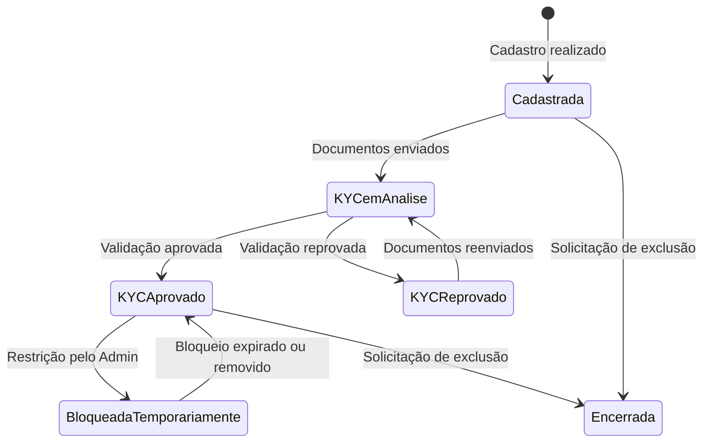

# 🏗️ Regras de Negócio — Fundação e Acessos

## Módulo Cessionário · Plataforma Repasse Seguro

| **Campo** | **Valor** |
|---|---|
| **Destinatário** | Equipe de Produto e Engenharia |
| **Escopo** | Glossário · Tipos de usuário e permissões · Cadastro e autenticação · Estados e ciclo de vida da conta · Onboarding · Mapa de módulos |
| **Módulo** | Cessionário |
| **Parte** | Parte 1 de 5 — Fundação e Acessos |
| **Versão** | v1.1 |
| **Responsável** | Claude Code Desktop |
| **Data da versão** | 2026-03-22 (America/Fortaleza) |
| **Continuidade** | Início |
| **Origem do arquivo de entrada** | 01 - Regras de Negócio.md |

---

> 📌 **TL;DR — Parte 01.1**
>
> - O **Cessionário** é o investidor/comprador que adquire contratos de cessão imobiliária na plataforma, atuando como contraparte do Cedente.
> - O cadastro é livre, mas a **primeira proposta exige KYC aprovado** (documento de identidade + comprovante de endereço + selfie).
> - O Cessionário nunca visualiza dados pessoais do Cedente — o anonimato é estrutural e protegido em todas as camadas.
> - A sessão expira após 30 minutos de inatividade; ações críticas exigem re-autenticação.
> - Este documento cobre os fundamentos: quem é o Cessionário, o que ele pode fazer, como acessa o sistema e quais estados governam sua conta.

---

## 1. Glossário

| **Termo** | **Definição** |
|---|---|
| Cessionário | Investidor ou comprador que adquire direitos de um contrato de cessão imobiliária na plataforma Repasse Seguro. |
| Cedente | Parte que transfere seus direitos contratuais ao Cessionário. Dados pessoais do Cedente são anonimizados para o Cessionário em todas as camadas da plataforma. |
| Escrow | Conta-garantia onde o Cessionário deposita o valor total (Preço Repasse + Comissão Comprador) antes da formalização da cessão. |
| Preço Repasse | Valor negociado da cessão que será transferido ao Cedente após o fechamento da operação. |
| Comissão Comprador | Taxa cobrada do Cessionário pela plataforma: 20% × Δ (Tabela Atual − Tabela Contrato). Exceção: quando Δ ≤ 0, aplica-se 20% × Valor Pago pelo Cedente. |
| Tabela Atual | Valor atualizado do imóvel conforme tabela vigente da construtora ou incorporadora. |
| Tabela Contrato | Valor original do imóvel conforme contrato de compra e venda do Cedente. |
| Δ (Delta) | Diferença entre Tabela Atual e Tabela Contrato. Serve de base para o cálculo da Comissão Comprador. |
| KYC | Know Your Customer — verificação de identidade obrigatória antes da primeira proposta. Composta por documento de identidade com foto, comprovante de endereço e selfie de prova de vida. |
| Anuência | Autorização formal emitida pela construtora ou incorporadora para que a cessão de direitos seja efetivada. |
| Analista de Oportunidades | Agente de IA disponível ao Cessionário. Tom analítico e orientado a dados. Sem acesso a dados pessoais do Cedente. |
| Formalização | Etapa de assinatura digital do instrumento de cessão e documentos acessórios, realizada via ZapSign. |
| Reversão | Cancelamento de operação já fechada, solicitado dentro de 15 dias corridos após a data de fechamento, com reembolso total via Escrow se aprovado pelo Admin. |
| Comissão Vendedor | Taxa cobrada do Cedente pela Repasse Seguro nos Cenários B, C e D: 20% × (Valor Recuperado − Valor Distrato Referência). No Cenário A, é R$ 0. Detalhes no documento de regras do módulo Cedente. |
| Cenários A/B/C/D | Opções de retorno escolhidas pelo Cedente no cadastro. A: apenas saldo devedor (sem comissão da RS). B: 100% do valor pago. C: valor pago + 30%. D: valor pago + 50%. Cenários B, C e D geram Comissão Vendedor. O Cessionário não visualiza o cenário escolhido pelo Cedente. |
| Admin | Operador interno da Repasse Seguro responsável por analisar propostas, confirmar depósitos, intermediar negociações e aprovar formalizações. |
| Oportunidade | Contrato de cessão disponível no marketplace, identificado por código anônimo (ex.: OPR-2026-0042). |
| ZapSign | Plataforma de assinatura digital integrada à Repasse Seguro, utilizada na formalização dos documentos de cessão. |

---

## 2. Atores do Módulo Cessionário

| **Ator** | **Papel** | **Pode agir sem KYC?** |
|---|---|---|
| Cessionário | Investidor que faz propostas, negocia, deposita em Escrow e assina documentos | Somente navegar e consultar a IA |
| Admin | Operador interno que analisa propostas, confirma depósitos e intermediar negociações | Não se aplica |
| Cedente | Contrapartida anônima que detém o contrato a ser cedido | Não se aplica |
| Sistema | Plataforma que executa automações, calcula comissões e envia notificações | Não se aplica |

---

## 3. Mapa de Módulos do Cessionário

| **Menu** | **Descrição** | **Seção de Regras** | **Parte D01** |
|---|---|---|---|
| Dashboard | Visão consolidada: propostas ativas, negociações em andamento, valores em Escrow, alertas. | CES-DASH-01 | Parte 01.3 |
| Oportunidades | Marketplace anonimizado com filtros de busca, análise de IA e ação de proposta. | CES-OPR-01 a 03 | Parte 01.2 |
| Minhas Propostas | Lista de propostas enviadas, com status e histórico. | CES-PRP-01 a 03 | Parte 01.2 |
| Negociações | Negociações ativas após aceitação de proposta pelo Admin. | CES-NEG-01 a 04 | Parte 01.2 |
| Assinaturas | Documentos pendentes e concluídos de formalização. | CES-ASS-01 a 03 | Parte 01.2 |
| Financeiro | Depósitos em Escrow, comissões, extratos, comprovantes. | CES-FIN-01 a 04 | Parte 01.2 |
| Assistente IA | Chat com o Analista de Oportunidades — análise de risco, comparativos, recomendações. | CES-IA-01 a 03 | Parte 01.3 |
| Meu Perfil | Dados pessoais, KYC, preferências, configurações de notificação. | CES-PRF-01 a 02 | Parte 01.1 |

---

## 4. Estados e Ciclo de Vida da Conta do Cessionário

### 4.1 Estados Possíveis da Conta

| **Estado** | **Descrição** | **O que o Cessionário pode fazer** |
|---|---|---|
| Cadastrada | Conta criada, KYC não iniciado. | Navegar no marketplace, consultar a IA. |
| KYC em Análise | Documentos enviados, aguardando validação automática ou manual. | Navegar no marketplace, consultar a IA. |
| KYC Aprovado | Identidade verificada. Acesso completo. | Todas as funcionalidades. |
| KYC Reprovado | Documentos não aprovados. Motivo informado. | Reenviar documentos, navegar, consultar a IA. |
| Bloqueada Temporariamente | Conta suspensa por excesso de falhas de KYC ou restrição pelo Admin. | Aguardar liberação ou contatar suporte. |
| Encerrada | Conta excluída ou anonimizada a pedido do titular. | Nenhuma ação. |

### 4.2 Diagrama de Ciclo de Vida da Conta

---

## 5. Regras de Negócio — Cadastro, Autenticação e Perfil

---

### RN-001: Cadastro na Plataforma

> Origem: CES-PRF-01 (01 - Regras de Negócio.md)

1. O visitante acessa a plataforma Repasse Seguro e preenche os dados de cadastro: nome completo, e-mail e senha.
2. O sistema exibe indicadores visuais de força da senha em tempo real (fraca, média, forte) à medida que o visitante digita. [CORRIGIDO: PROBLEMA-001]
3. O sistema verifica se o e-mail informado já está cadastrado.
4. **Se o e-mail não está cadastrado:** o sistema cria a conta com status *Cadastrada*, envia e-mail de verificação e redireciona o usuário para o Dashboard com banner de boas-vindas. O banner de boas-vindas permanece visível até ser dispensado pelo usuário (botão "×") e inclui os CTAs "Completar KYC" e "Explorar Oportunidades". [CORRIGIDO: PROBLEMA-002]
5. **Se o e-mail já está cadastrado:** o sistema exibe a mensagem: "Este e-mail já está em uso. Tente fazer login ou recupere sua senha." O campo de e-mail é destacado com borda vermelha e o foco permanece no campo. [CORRIGIDO: PROBLEMA-003]
6. **Se o envio do formulário falha por erro de conexão:** o sistema exibe: "Não foi possível concluir o cadastro. Verifique sua conexão e tente novamente." Os dados preenchidos são preservados no formulário. [CORRIGIDO: PROBLEMA-004]
7. **Validação de campos em tempo real:** campos obrigatórios são validados ao perder o foco (on blur). Campos inválidos exibem mensagem de erro abaixo do campo em vermelho. [CORRIGIDO: PROBLEMA-005]
8. **Efeito no estado da conta:** [Inexistente → Cadastrada].
9. **Consequência se violada:** Cadastros duplicados comprometem o isolamento de dados e a integridade das notificações.

---

### RN-002: Login com E-mail e Senha

> Origem: CES-SEC-01 (01 - Regras de Negócio.md)

1. O Cessionário informa e-mail e senha na tela de login.
2. O sistema exibe indicador de carregamento no botão "Entrar" durante a verificação (botão desabilitado com spinner). [CORRIGIDO: PROBLEMA-006]
3. O sistema verifica se as credenciais correspondem a uma conta ativa.
4. **Se as credenciais estão corretas:** o sistema inicia a sessão e redireciona para o Dashboard.
5. **Se as credenciais estão incorretas:** o sistema exibe: "E-mail ou senha incorretos. Verifique seus dados ou recupere sua senha." A mensagem aparece acima do formulário em banner de erro. O campo de senha é limpo automaticamente; o campo de e-mail preserva o valor digitado. [CORRIGIDO: PROBLEMA-007]
6. **Se a conta está bloqueada temporariamente:** o sistema exibe: "Sua conta está temporariamente suspensa. Entre em contato com o suporte para mais informações." [CORRIGIDO: PROBLEMA-008]
7. **Se a conta está encerrada:** o sistema exibe: "Esta conta foi encerrada. Não é possível fazer login." [CORRIGIDO: PROBLEMA-008]
8. **Efeito no estado da conta:** nenhum (sessão criada sem alterar o estado da conta).
9. **Consequência se violada:** Acesso não autorizado a dados financeiros e documentos de cessão.

---

### RN-003: Login com Google (OAuth)

> Origem: CES-SEC-01 (01 - Regras de Negócio.md)

1. O Cessionário seleciona a opção "Entrar com Google" na tela de login.
2. O sistema redireciona para a autenticação Google e aguarda retorno.
3. **Se a autenticação Google é bem-sucedida e o e-mail corresponde a uma conta existente:** o sistema inicia a sessão.
4. **Se a autenticação Google é bem-sucedida mas o e-mail não tem cadastro:** o sistema cria uma nova conta com os dados do Google e exibe o fluxo de boas-vindas.
5. **Se a autenticação Google falha ou é cancelada:** o sistema retorna à tela de login com a mensagem: "Não foi possível conectar com o Google. Tente novamente ou use seu e-mail e senha."
6. **Consequência se violada:** Usuários sem conta podem ser criados automaticamente com dados incompletos, impactando o fluxo de KYC.

---

### RN-004: Expiração de Sessão por Inatividade

> Origem: CES-SEC-01 (01 - Regras de Negócio.md)

1. O Cessionário realiza login e inicia uma sessão ativa.
2. O sistema monitora o tempo desde a última ação do usuário na plataforma.
3. **Se o Cessionário permanece 25 minutos sem interação:** o sistema exibe modal de aviso: "Sua sessão expira em 5 minutos. Deseja continuar?" com botões "Continuar sessão" e "Sair agora". [CORRIGIDO: PROBLEMA-009] [DECISÃO APLICADA: DEC-001 — Aviso prévio de 5 minutos antes da expiração. Justificativa: evitar perda de dados em formulários parcialmente preenchidos. Alternativa descartada: expiração abrupta sem aviso, pois causa frustração especialmente em fluxos de proposta ou Escrow.]
4. **Se o Cessionário não responde ao aviso em 5 minutos:** o sistema encerra a sessão automaticamente e redireciona para a tela de login com a mensagem: "Sua sessão expirou por inatividade. Faça login novamente para continuar."
5. **Se o Cessionário clica em "Continuar sessão":** o contador de inatividade é reiniciado e a sessão permanece ativa.
6. **Se o Cessionário interage antes de 25 minutos:** o contador de inatividade é reiniciado e a sessão permanece ativa.
5. **Efeito no estado da conta:** nenhum (sessão encerrada; conta permanece no estado atual).
6. **Consequência se violada:** Sessões abertas em dispositivos compartilhados expõem dados financeiros e documentos a terceiros.

> 🔒 **Nota de segurança — Prazo autoritativo:** Este prazo (30 minutos) é o **valor autoritativo** para o perfil Cessionário, conforme decisão de segurança documentada. O módulo Admin/01.1 referencia este valor para o perfil Cessionário. Justificativa: perfil de investidor com acesso a dados financeiros sensíveis exige sessão mais curta.

---

### RN-005: Re-autenticação para Ações Críticas

> Origem: CES-SEC-01 (01 - Regras de Negócio.md)

1. O Cessionário tenta executar uma ação crítica: depósito em Escrow, assinatura de documento ou alteração de dados bancários.
2. O sistema verifica se a última autenticação foi realizada há mais de 15 minutos. [DECISÃO AUTÔNOMA — 15 minutos escolhido como janela de confiança para ações críticas; alternativa descartada: re-autenticar sempre, pois geraria fricção excessiva em formalizações com múltiplos documentos.]
3. **Se a autenticação é recente (dentro de 15 minutos):** a ação prossegue normalmente.
4. **Se a autenticação não é recente:** o sistema exibe modal de re-autenticação sobreposto à tela atual (overlay), sem perder o contexto da ação em curso. O modal solicita confirmação de senha ou biometria antes de prosseguir. [CORRIGIDO: PROBLEMA-010]
5. **Se a confirmação é bem-sucedida:** o modal fecha e a ação prossegue automaticamente sem que o Cessionário precise repetir a ação original. [CORRIGIDO: PROBLEMA-010]
6. **Se a confirmação falha:** o sistema exibe no modal: "Não foi possível confirmar sua identidade. Verifique sua senha e tente novamente." O Cessionário pode tentar novamente ou cancelar e voltar à tela anterior.
7. **Se o Cessionário cancela a re-autenticação:** o modal fecha e a ação não é executada. O Cessionário permanece na tela original. [CORRIGIDO: PROBLEMA-011]
5. **Consequência se violada:** Ações financeiras e jurídicas executadas sem consentimento ativo do titular.

---

### RN-006: Bloqueio por Excesso de Falhas no KYC

> Origem: CES-SEC-01 (01 - Regras de Negócio.md)

1. O Cessionário realiza uploads de documentos para o KYC.
2. O sistema contabiliza as tentativas de upload com falha de validação automática dentro de uma janela de 1 hora.
3. **Se o número de tentativas com falha atinge 5 em 1 hora:** o sistema bloqueia temporariamente a funcionalidade de envio de documentos por 30 minutos e exibe: "Muitas tentativas sem sucesso. O envio de documentos está temporariamente suspenso. Tente novamente em 30 minutos." O botão de envio é desabilitado e exibe contador regressivo visível com o tempo restante (ex.: "Disponível em 28:34"). [CORRIGIDO: PROBLEMA-012]
4. **Se o Cessionário aguarda 30 minutos:** o bloqueio é removido automaticamente, o botão de envio é reabilitado e o contador desaparece. O Cessionário pode tentar novamente sem recarregar a página. [CORRIGIDO: PROBLEMA-012]
5. **Efeito no estado da conta:** [KYC em Análise → Bloqueada Temporariamente (parcial, apenas para upload de KYC) → KYC em Análise após 30 min].
6. **Consequência se violada:** Ataques automatizados podem saturar o serviço de validação de documentos.

---

### RN-007: Edição de Dados do Perfil

> Origem: CES-PRF-01 (01 - Regras de Negócio.md)

1. O Cessionário acessa "Meu Perfil" e edita um dos campos disponíveis: nome completo, e-mail, telefone, dados bancários para reembolso ou preferências de investimento.
2. O sistema verifica se o campo editado exige verificação adicional.
   - 2.1. **Se o campo é e-mail:** o sistema envia um link de verificação para o novo endereço antes de salvar a alteração.
   - 2.2. **Se o campo é telefone:** o sistema envia um código SMS para o novo número antes de salvar.
   - 2.3. **Se o campo é dados bancários:** o sistema exige re-autenticação (conforme RN-005) antes de salvar.
3. **Se a verificação é concluída com sucesso:** o sistema salva a alteração e exibe toast de confirmação: "Dado atualizado com sucesso." (desaparece em 5 segundos). O campo exibe o novo valor salvo. [CORRIGIDO: PROBLEMA-013]
4. **Se a verificação não é concluída em 10 minutos:** o código/link expira. O campo permanece com o valor anterior e o sistema exibe: "Alteração não confirmada. O código expirou. Solicite um novo código para salvar." [CORRIGIDO: PROBLEMA-014]
5. **Se a verificação falha (código incorreto):** o sistema exibe: "Código incorreto. Verifique e tente novamente." O Cessionário pode tentar até 3 vezes antes de solicitar novo código. [CORRIGIDO: PROBLEMA-014]
5. **Consequência se violada:** Dados bancários incorretos resultam em reembolsos enviados para contas erradas.

---

### RN-008: Configurações de Notificação

> Origem: CES-PRF-01 (01 - Regras de Negócio.md)

1. O Cessionário acessa "Meu Perfil" e ajusta suas preferências de notificação por canal: e-mail, push ou SMS.
2. O sistema verifica se ao menos um canal está habilitado.
3. **Se ao menos um canal está habilitado:** o sistema salva as preferências e aplica imediatamente às próximas notificações.
4. **Se o Cessionário tenta desabilitar todos os canais:** o sistema mantém o e-mail ativo por padrão e exibe: "O e-mail não pode ser desabilitado — é o canal mínimo obrigatório para notificações críticas de prazo." [DECISÃO AUTÔNOMA — e-mail mantido como canal mínimo obrigatório; alternativa descartada: bloquear a ação de desabilitar, pois seria mais restritivo sem ganho de segurança proporcional.]
5. **Consequência se violada:** Cessionários sem nenhum canal ativo não recebem alertas de prazo de Escrow, resultando em cancelamento automático de negociações.

---

## 6. Regras de Negócio — KYC (Know Your Customer)

---

### RN-009: Pré-requisito de KYC para Propostas

> Origem: CES-PRF-02 / CES-OPR-03 (01 - Regras de Negócio.md)

1. O Cessionário acessa a tela de detalhe de uma oportunidade e tenta clicar em "Fazer Proposta".
2. O sistema verifica o status do KYC do Cessionário.
3. **Se o KYC está aprovado:** o botão "Fazer Proposta" está habilitado e o Cessionário prossegue para a criação da proposta (conforme RN-013 — Parte 01.2).
4. **Se o KYC não está aprovado:** o botão "Fazer Proposta" permanece desabilitado. Um banner persistente no topo da tela exibe: "Complete sua verificação para fazer propostas. Acesse Meu Perfil para enviar seus documentos."
5. **Efeito no estado da conta:** nenhum nesta etapa.
6. **Consequência se violada:** Propostas sem KYC comprometem a conformidade regulatória e a rastreabilidade das partes envolvidas na cessão.

---

### RN-010: Envio de Documentos para KYC

> Origem: CES-PRF-02 (01 - Regras de Negócio.md)

1. O Cessionário acessa "Meu Perfil" e inicia o processo de KYC enviando os documentos obrigatórios.
2. O sistema exibe o fluxo de envio em etapas (stepper de 3 passos), indicando claramente o passo atual e os restantes. [CORRIGIDO: PROBLEMA-015] [DECISÃO APLICADA: DEC-002 — Fluxo de KYC em stepper de 3 passos. Justificativa: reduz a carga cognitiva e permite progresso incremental. Alternativa descartada: formulário único com todos os campos, pois intimidaria o usuário e aumentaria o abandono.]
3. O sistema verifica se todos os 3 documentos foram enviados:
   - 3.1. **Passo 1:** Documento de identidade com foto (RG ou CNH) — frente e verso. Formatos aceitos: JPG, PNG ou PDF. Tamanho máximo: 10 MB por arquivo. [CORRIGIDO: PROBLEMA-016]
   - 3.2. **Passo 2:** Comprovante de endereço com data de emissão nos últimos 90 dias. Formatos aceitos: JPG, PNG ou PDF. Tamanho máximo: 10 MB.
   - 3.3. **Passo 3:** Selfie de prova de vida (liveness check). O sistema ativa a câmera do dispositivo com instruções visuais na tela (enquadramento do rosto, iluminação). [CORRIGIDO: PROBLEMA-017]
4. **Para cada documento enviado:** o sistema exibe preview do arquivo com opção de remover e reenviar antes de avançar ao próximo passo. [CORRIGIDO: PROBLEMA-018]
5. **Se todos os documentos foram enviados:** o sistema registra o status como *KYC em Análise*, exibe tela de confirmação: "Documentos enviados. Você será notificado sobre o resultado." e inicia a validação automática. [CORRIGIDO: PROBLEMA-019]
6. **Se algum documento está ausente ou em formato inválido:** o sistema indica qual documento está com problema (destacado em vermelho no stepper) e exibe: "Envio incompleto. Verifique os documentos indicados e tente novamente."
7. **Se o Cessionário abandona o fluxo no meio:** os documentos já enviados nos passos anteriores são preservados por 24 horas. Ao retornar, o stepper exibe os passos já concluídos e posiciona no próximo passo pendente. [CORRIGIDO: PROBLEMA-020] [DECISÃO APLICADA: DEC-003 — Preservação de progresso parcial do KYC por 24 horas. Justificativa: evitar reenvio desnecessário de documentos já validados. Alternativa descartada: descartar progresso ao sair, pois causa frustração e aumenta o abandono.]
5. **Efeito no estado da conta:** [Cadastrada → KYC em Análise].
6. **Consequência se violada:** KYC incompleto impede o Cessionário de fazer propostas e compromete a conformidade com a LGPD.

---

### RN-011: Validação Automática do KYC

> Origem: CES-PRF-02 (01 - Regras de Negócio.md)

1. Após o envio dos documentos, o sistema executa validação automática via OCR e liveness check em até 5 minutos.
2. O sistema exibe na tela de KYC o status "Verificação em andamento" com indicador de progresso animado (barra ou spinner). O Cessionário pode sair da tela sem interromper a validação. [CORRIGIDO: PROBLEMA-021]
3. O sistema avalia a legibilidade dos documentos e a correspondência entre a identidade e a selfie.
4. **Se a validação automática aprova os documentos:** o status muda para *KYC Aprovado*, a tela de perfil exibe badge verde "Verificado" ao lado do nome e o Cessionário recebe notificação NOT-CES-01 por e-mail e push. [CORRIGIDO: PROBLEMA-022]
5. **Se a validação automática reprova os documentos:** o status muda para *KYC Reprovado*, o Cessionário recebe notificação NOT-CES-02 com o motivo da reprovação (ex.: "Documento ilegível", "Selfie não correspondente") e a tela de KYC exibe o motivo específico ao lado de cada documento reprovado, com botão "Reenviar" habilitado apenas para os documentos com problema. [CORRIGIDO: PROBLEMA-023]
6. **Se a validação automática não consegue concluir (inconclusiva):** o caso é encaminhado para revisão manual pelo Admin em até 24 horas úteis (conforme SLA definido na Parte 01.4). O Cessionário vê status "Em análise manual" com a mensagem: "Sua verificação requer análise adicional. Prazo estimado: até 24 horas úteis." [CORRIGIDO: PROBLEMA-024]
6. **Efeito no estado da conta:** [KYC em Análise → KYC Aprovado] ou [KYC em Análise → KYC Reprovado].
7. **Consequência se violada:** Aprovações incorretas expõem a plataforma a risco de fraude de identidade em operações de cessão imobiliária.

---

### RN-012: Reenvio de Documentos após Reprovação de KYC

> Origem: CES-PRF-02 (01 - Regras de Negócio.md)

1. O Cessionário recebe notificação de KYC reprovado com o motivo da reprovação.
2. O Cessionário acessa "Meu Perfil" e encontra a seção de KYC com os documentos reprovados destacados em vermelho e o motivo da reprovação visível ao lado de cada documento. [CORRIGIDO: PROBLEMA-025]
3. O Cessionário reenvia apenas os documentos que foram reprovados; documentos aprovados anteriormente permanecem válidos e não precisam ser reenviados. [CORRIGIDO: PROBLEMA-025] [DECISÃO APLICADA: DEC-004 — Reenvio parcial de documentos no KYC. Justificativa: evitar que o Cessionário refaça todo o fluxo por causa de um único documento. Alternativa descartada: exigir reenvio completo, pois causa fricção desnecessária.]
4. **Se os novos documentos são enviados corretamente:** o status retorna para *KYC em Análise* e o processo de validação reinicia (conforme RN-011).
5. **Se o Cessionário tenta reenviar sem corrigir o problema apontado:** o sistema aceita o envio mas a validação provavelmente reprovará novamente, sujeito ao limite de tentativas da RN-006. O sistema exibe tooltip de orientação: "Verifique se o documento está legível e corresponde ao tipo solicitado." [CORRIGIDO: PROBLEMA-026]
5. **Efeito no estado da conta:** [KYC Reprovado → KYC em Análise].
6. **Consequência se violada:** Sem mecanismo de reenvio, Cessionários com documentos temporariamente ilegíveis ficariam permanentemente bloqueados, prejudicando a taxa de conversão.

---

## 7. Regras de Negócio — Segurança, Privacidade e LGPD

---

### RN-013: Isolamento de Dados por Perfil (RBAC)

> Origem: CES-SEC-01 (01 - Regras de Negócio.md)

1. O Cessionário realiza qualquer consulta de dados na plataforma (propostas, negociações, documentos, financeiro).
2. O sistema filtra todos os resultados pelo identificador único do Cessionário logado.
3. **Se a consulta retorna apenas dados do próprio Cessionário:** a resposta é exibida normalmente.
4. **Se qualquer consulta tentasse retornar dados de outro Cessionário ou do Cedente:** o sistema bloqueia a resposta e não exibe dados de terceiros. O Cessionário vê apenas: "Nenhum resultado encontrado."
5. **Consequência se violada:** Vazamento de dados financeiros ou documentais entre Cessionários, com impacto jurídico e de reputação para a plataforma.

---

### RN-014: Anonimização Permanente do Cedente

> Origem: CES-SEC-01 / CES-OPR-01 (01 - Regras de Negócio.md)

1. O Cessionário acessa qualquer tela da plataforma: marketplace, negociação, assinaturas ou financeiro.
2. O sistema verifica que nenhum dado pessoal do Cedente está presente nas respostas enviadas ao frontend do Cessionário.
   - 2.1. Dados suprimidos: nome, CPF, contato, endereço e quaisquer identificadores pessoais do Cedente.
   - 2.2. Identificadores internos do Cedente nunca trafegam para o dispositivo do Cessionário.
3. **Se a verificação confirma ausência de dados pessoais do Cedente:** o conteúdo é exibido normalmente.
4. **Se algum dado pessoal do Cedente for detectado nas respostas:** o sistema bloqueia a exibição antes de chegar ao frontend. [DECISÃO AUTÔNOMA — bloqueio preventivo no backend; alternativa descartada: filtrar no frontend, pois os dados já teriam trafegado pela rede.]
5. **Consequência se violada:** Exposição de dados pessoais do Cedente ao Cessionário viola a LGPD, o modelo de negócio anonimizado e as condições contratuais com o Cedente.

---

### RN-015: Direitos do Titular (LGPD)

> Origem: CES-SEC-01 (01 - Regras de Negócio.md)

1. O Cessionário acessa "Meu Perfil" e solicita exportação ou exclusão dos seus dados pessoais.
2. O sistema exibe modal de confirmação antes de processar a solicitação, explicando o que será feito e o prazo estimado. [CORRIGIDO: PROBLEMA-027]
3. O sistema verifica o tipo de solicitação.
   - 3.1. **Se a solicitação é de exportação:** o sistema gera um arquivo (JSON ou PDF) com todos os dados pessoais do Cessionário e disponibiliza para download em até 48 horas. [DECISÃO AUTÔNOMA — prazo de 48 horas para exportação; alternativa descartada: exportação imediata, pois pode envolver consolidação de dados de múltiplos módulos.] O Cessionário vê status "Exportação em processamento" na tela de perfil com prazo estimado. [CORRIGIDO: PROBLEMA-028]
   - 3.2. **Se a solicitação é de exclusão:** o sistema exibe alerta de confirmação irreversível: "Esta ação não pode ser desfeita. Seus dados pessoais serão anonimizados. Dados financeiros serão retidos por 5 anos conforme legislação." com botões "Confirmar exclusão" (vermelho) e "Cancelar". [CORRIGIDO: PROBLEMA-029] [DECISÃO APLICADA: DEC-005 — Confirmação explícita e diferenciada para exclusão de conta. Justificativa: ação destrutiva irreversível requer dupla confirmação com linguagem clara. Alternativa descartada: confirmação simples, pois o impacto é permanente.]
4. **Se a solicitação é de exportação e é processada com sucesso:** o Cessionário recebe o arquivo por e-mail e na plataforma. A tela de perfil exibe link de download disponível por 7 dias. [CORRIGIDO: PROBLEMA-028]
5. **Se a solicitação é de exclusão confirmada:** o sistema confirma o recebimento com mensagem: "Solicitação recebida. Seus dados não financeiros serão anonimizados em até 48 horas. Dados financeiros serão retidos por 5 anos conforme legislação vigente."
5. **Consequência se violada:** Descumprimento da LGPD (Lei 13.709/2018), sujeito a sanções administrativas e reputacionais.

---

### RN-016: Consentimento para Uso de Dados pela IA

> Origem: CES-SEC-01 (01 - Regras de Negócio.md)

1. O visitante realiza o cadastro na plataforma.
2. O sistema exibe os Termos de Uso, a Política de Privacidade e o consentimento específico para uso dos dados pelo agente de IA Analista de Oportunidades.
3. **Se o visitante aceita todos os termos:** o cadastro é concluído com consentimento registrado para uso de dados pela IA. Os checkboxes de aceite são individuais: um para Termos de Uso + Política de Privacidade (obrigatório) e outro para uso de dados pela IA (obrigatório). Links para os documentos completos abrem em nova aba. [CORRIGIDO: PROBLEMA-030]
4. **Se o visitante não aceita:** o cadastro não é concluído. O sistema informa: "A aceitação dos Termos de Uso e da Política de Privacidade é necessária para usar a plataforma." O botão de cadastro permanece desabilitado até que os termos obrigatórios sejam aceitos. [CORRIGIDO: PROBLEMA-031]
5. **Após o cadastro:** o Cessionário pode revogar o consentimento de uso de dados pela IA a qualquer momento em "Meu Perfil". O sistema exibe modal explicativo antes da revogação: "Ao revogar, você deixará de receber recomendações personalizadas. As demais funcionalidades permanecem disponíveis." com botões "Revogar" e "Manter ativo". [CORRIGIDO: PROBLEMA-032]
6. **Consequência se violada:** Processamento de dados pessoais sem base legal configura infração à LGPD.

---

## 8. Matriz de Permissões por Estado da Conta

| **Funcionalidade** | **Cadastrada (sem KYC)** | **KYC em Análise** | **KYC Reprovado** | **KYC Aprovado** | **Bloqueada Temporariamente** |
|---|---|---|---|---|---|
| Navegar no marketplace | Sim | Sim | Sim | Sim | Não |
| Consultar Analista de Oportunidades (IA) | Sim | Sim | Sim | Sim | Não |
| Visualizar detalhe de oportunidade | Sim | Sim | Sim | Sim | Não |
| Fazer proposta | Não | Não | Não | Sim | Não |
| Acessar Minhas Propostas | Não | Não | Sim (histórico) | Sim | Não |
| Acessar Negociações | Não | Não | Sim (somente leitura) | Sim | Não |
| Depositar em Escrow | Não | Não | Não | Sim | Não |
| Assinar documentos | Não | Não | Não | Sim | Não |
| Acessar Financeiro | Não | Não | Sim (somente leitura) | Sim | Não |
| Editar perfil | Sim | Sim | Sim | Sim | Não |
| Enviar documentos KYC | Sim | Não | Sim | Não | Não |
| Solicitar exportação de dados | Sim | Sim | Sim | Sim | Não |

> 💡 **Nota:** O estado "Bloqueada Temporariamente" da RN-006 é parcial — afeta apenas o envio de documentos KYC por 30 minutos. A linha "Bloqueada Temporariamente" na tabela acima representa o cenário de bloqueio total aplicado pelo Admin (restrição administrativa). O bloqueio parcial de KYC não impede navegação.

---

## 9. Estados Visíveis ao Cessionário — Visão Geral

> 💡 O Cessionário visualiza apenas estados relevantes ao seu fluxo. Estados internos do Admin e do Cedente são ocultados.

| **Etapa** | **Estado Visível ao Cessionário** |
|---|---|
| Proposta | Enviada · Em Análise · Aceita · Recusada · Expirada · Cancelada |
| Negociação | Em Negociação · Em Contraproposta · Aguardando Depósito · Depósito Confirmado |
| Formalização | Documentos Disponíveis · Assinatura Pendente (Cessionário) · Assinatura Pendente (Cedente) · Aguardando Anuência · Formalização Concluída · Formalização Cancelada |
| Fechamento | Operação Concluída |
| Pós-Fechamento | Em Reversão · Reembolso Processado |
| Cancelamento | Operação Cancelada |

---

## 10. SLAs Relacionados a Acesso e KYC

| **Processo** | **SLA** | **Responsável** |
|---|---|---|
| Validação automática de KYC | Até 5 minutos | Sistema |
| Validação manual de KYC (revisão pelo Admin) | Até 24 horas úteis | Admin |
| Expiração de sessão por inatividade | 30 minutos | Sistema |
| Desbloqueio após excesso de falhas de KYC | 30 minutos automáticos | Sistema |
| Exportação de dados (LGPD) | Até 48 horas | Sistema + Admin |

---

## 11. Mensagens ao Usuário — Fundação e Acessos

| **Código** | **Situação** | **Mensagem** |
|---|---|---|
| MSG-001 | E-mail já cadastrado | "Este e-mail já está em uso. Tente fazer login ou recupere sua senha." |
| MSG-002 | Credenciais de login incorretas | "E-mail ou senha incorretos. Verifique seus dados ou recupere sua senha." |
| MSG-003 | Falha na autenticação Google | "Não foi possível conectar com o Google. Tente novamente ou use seu e-mail e senha." |
| MSG-004 | Sessão expirada | "Sua sessão expirou por inatividade. Faça login novamente para continuar." |
| MSG-005 | Re-autenticação necessária | "Não foi possível confirmar sua identidade. Verifique sua senha e tente novamente." |
| MSG-006 | Bloqueio de KYC por excesso de tentativas | "Muitas tentativas sem sucesso. O envio de documentos está temporariamente suspenso. Tente novamente em 30 minutos." |
| MSG-007 | Perfil sem KYC tentando fazer proposta | "Complete sua verificação para fazer propostas. Acesse Meu Perfil para enviar seus documentos." |
| MSG-008 | Documentos de KYC incompletos | "Envio incompleto. Verifique os documentos indicados e tente novamente." |
| MSG-009 | Canal de notificação mínimo bloqueado | "O e-mail não pode ser desabilitado — é o canal mínimo obrigatório para notificações críticas de prazo." |
| MSG-010 | Alteração de perfil não confirmada | "Alteração não confirmada. Complete a verificação para salvar." |
| MSG-011 | Consentimento obrigatório para cadastro | "A aceitação dos Termos de Uso e da Política de Privacidade é necessária para usar a plataforma." |

---

## 12. Notificações de KYC

| **Código** | **Evento** | **Canal** | **Mensagem** |
|---|---|---|---|
| NOT-CES-01 | KYC aprovado | E-mail + Push | "Sua verificação foi aprovada. Agora você pode fazer propostas." |
| NOT-CES-02 | KYC reprovado | E-mail + Push | "Sua verificação foi reprovada. Motivo: {motivo}. Reenvie os documentos." |

---

## 13. Edge Cases — Fundação e Acessos

| **Cenário** | **Comportamento Esperado** |
|---|---|
| Cessionário tenta fazer proposta com KYC em análise | Botão desabilitado; banner de KYC em análise exibido. |
| Cessionário envia documentos corretos após reprovação | KYC volta a "Em Análise"; prazo de validação reinicia. |
| Cessionário revoga consentimento da IA com propostas ativas | Recomendações personalizadas são suspensas; propostas ativas não são afetadas. |
| Cessionário solicita exclusão com operação em andamento | Sistema informa que dados financeiros são retidos por 5 anos e que a exclusão parcial é aplicada imediatamente para dados não financeiros. |
| Dois Cessionários se cadastram com o mesmo e-mail simultaneamente | O sistema aceita apenas o primeiro cadastro concluído; o segundo recebe MSG-001. |
| Cessionário tenta acessar URL de negociação de outro Cessionário diretamente | O sistema retorna estado vazio sem dados (RN-013). |

---

> ⚙️ **Continuidade:** Esta parte cobre RN-001 a RN-016. A Parte 01.2 inicia em RN-017 e cobre os módulos Core e Receita (Oportunidades, Propostas, Negociações, Assinaturas e Financeiro).
