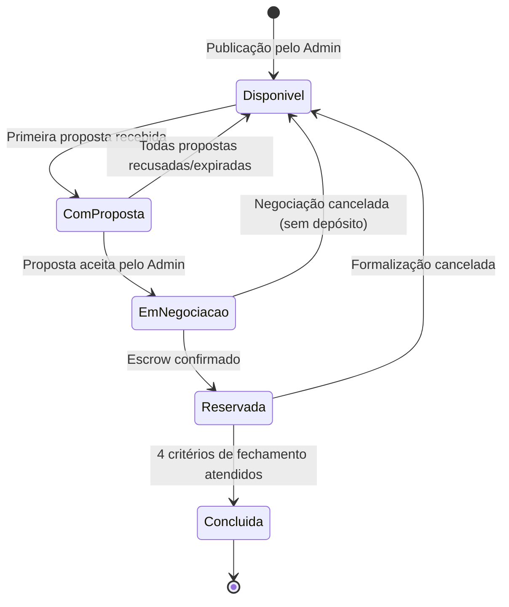
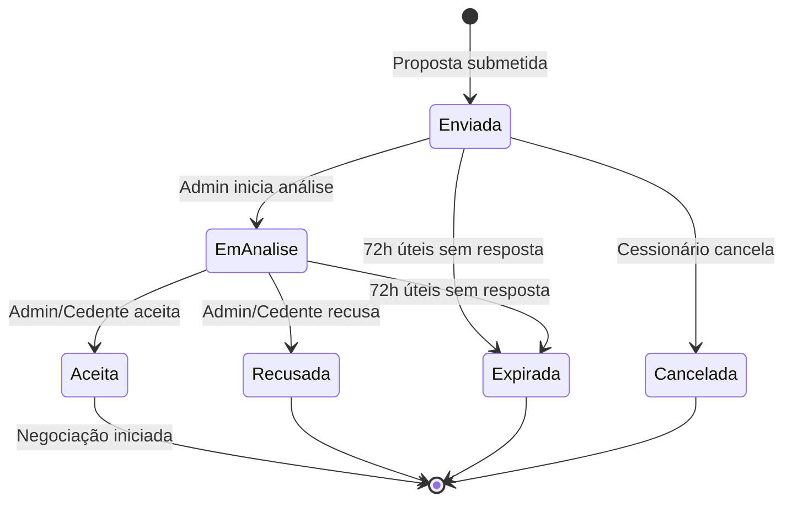
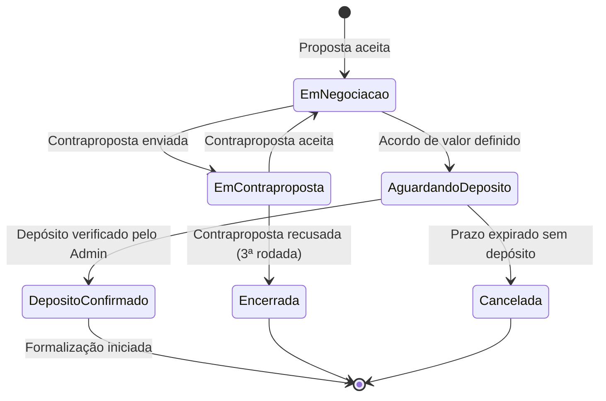
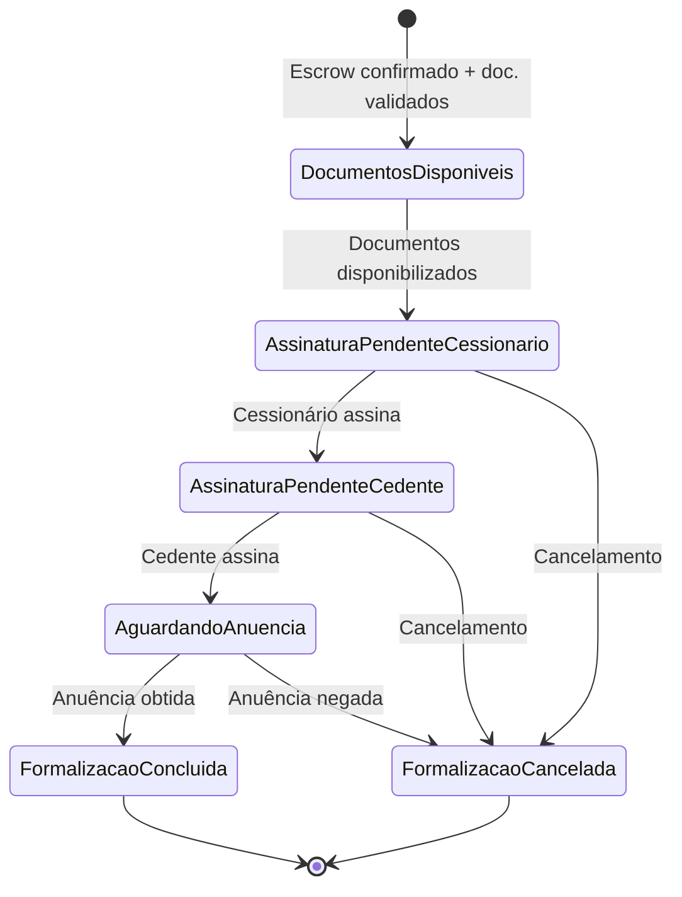

# 💰 Regras de Negócio — Módulos Core e Receita

## Módulo Cessionário · Plataforma Repasse Seguro

| **Campo** | **Valor** |
|---|---|
| **Destinatário** | Equipe de Produto e Engenharia |
| **Escopo** | Marketplace de Oportunidades · Propostas · Negociações · Formalização · Financeiro e Escrow · Fechamento e Reversão |
| **Módulo** | Cessionário |
| **Parte** | Parte 2 de 5 — Módulos Core e Receita |
| **Versão** | v1.1 |
| **Responsável** | Claude Code Desktop |
| **Data da versão** | 2026-03-22 (America/Fortaleza) |
| **Continuidade** | RN-016 (Parte 01.1) |
| **Origem do arquivo de entrada** | 01 - Regras de Negócio.md |

---

> 📌 **TL;DR — Parte 01.2**
>
> - O fluxo de receita da plataforma passa integralmente por esta parte: marketplace → proposta → negociação → Escrow → formalização → fechamento.
> - A **Comissão Comprador** é calculada como 20% × Δ (Tabela Atual − Tabela Contrato). Quando Δ ≤ 0, aplica-se 20% × Valor Pago pelo Cedente.
> - A Conta Escrow é criada automaticamente ao caso entrar em Formalização. O depósito pelo Cessionário é obrigatório como critério do Fechamento, dentro do prazo de 10 dias úteis + extensão única de 5 dias úteis, sujeita a aprovação do Admin.
> - Limite de 3 propostas simultâneas e 10 propostas a cada 24 horas por Cessionário.
> - O fechamento exige 4 critérios simultâneos: instrumento assinado + preço confirmado + anuência obtida + Escrow confirmado.
> - Reversão disponível em até 15 dias corridos após o fechamento: (a) de forma consensual, quando ambas as partes concordam com a desistência; (b) unilateral com mediação formal de 10 dias úteis pelo Coordenador, se a outra parte não aceitar.

---

## 1. Objetivo dos Módulos Core

Os módulos desta parte constituem o coração operacional e financeiro do produto. São os módulos que geram diretamente a receita da Repasse Seguro (comissões sobre cessões formalizadas) e cuja remoção inviabilizaria o funcionamento do produto. O fluxo coberto é: exploração de oportunidades → envio de proposta → negociação de valor → depósito em Escrow → assinatura digital → fechamento → pós-fechamento.

---

## 2. Atores Envolvidos

| **Ator** | **Papel nesta parte** |
|---|---|
| Cessionário | Explora oportunidades, envia propostas, negocia, deposita em Escrow, assina documentos, solicita reversão. |
| Admin | Analisa propostas, confirma depósitos, intermedia negociações, aprova formalizações e processa reembolsos. |
| Cedente | Aceita ou rejeita contrapropostas (via Admin); assina documentos de cessão. Permanece anônimo para o Cessionário. |
| Sistema | Calcula comissões, monitora prazos, envia notificações automáticas, aplica regras de expiração e cancela negociações por vencimento. |
| ZapSign | Plataforma de assinatura digital integrada, utilizada na formalização. |

---

## 3. Módulo: Oportunidades (Marketplace)

### Objeto principal: Oportunidade

### Estados possíveis da Oportunidade

| **Estado** | **Descrição** |
|---|---|
| Disponível | Oportunidade publicada e visível no marketplace para todos os Cessionários com KYC aprovado. |
| Com Proposta | Há ao menos uma proposta ativa vinculada (não bloqueia novas propostas de outros Cessionários). |
| Em Negociação | Proposta aceita, negociação em andamento. |
| Reservada | Escrow confirmado, formalização em curso. |
| Concluída | Fechamento realizado com sucesso. |
| Cancelada | Operação cancelada; oportunidade retorna ao estado Disponível. |

### Diagrama de estados da Oportunidade

---

### RN-017: Listagem de Oportunidades no Marketplace

> Origem: CES-OPR-01 (01 - Regras de Negócio.md)

1. O Cessionário acessa o módulo "Oportunidades".
2. O sistema carrega todas as oportunidades com status *Disponível* ou *Com Proposta*, exibindo apenas dados anonimizados.
3. **Se há oportunidades disponíveis:** o sistema exibe os cards com os dados abaixo para cada oportunidade:
   - 3.1. Código anônimo da oportunidade (ex.: OPR-2026-0042).
   - 3.2. Localização: cidade, bairro e nome do empreendimento (sem endereço exato).
   - 3.3. Tipologia: número de quartos, metragem e vaga de garagem.
   - 3.4. Valor da Tabela Atual (preço atualizado do imóvel).
   - 3.5. Valor da Tabela Contrato (preço original do contrato).
   - 3.6. Δ (Delta): diferença calculada automaticamente entre Tabela Atual e Tabela Contrato.
   - 3.7. Percentual pago pelo Cedente sobre a Tabela Contrato.
   - 3.8. Score de risco calculado pela IA (escala de 1 a 10).
   - 3.9. Data de publicação da oportunidade.
4. **Estado de carregamento:** durante a busca de oportunidades, o sistema exibe skeleton cards (placeholders animados) no layout da listagem por no máximo 3 segundos. Se a busca exceder 3 segundos, os skeletons permanecem com indicador de progresso. [CORRIGIDO: PROBLEMA-033] [DECISÃO APLICADA: DEC-006 — Skeleton cards no carregamento do marketplace. Justificativa: preserva a percepção de velocidade e evita layout shift. Alternativa descartada: spinner centralizado, pois não comunica a estrutura da resposta esperada.]
5. **Se não há oportunidades disponíveis:** o sistema exibe o estado vazio com a mensagem: "Nenhuma oportunidade encontrada com esses filtros." e opções para limpar filtros ou ajustar a busca (conforme RN-052 — Parte 01.3).
5. **Dados nunca exibidos no marketplace:**
   - 5.1. Nome, CPF, contato ou qualquer dado pessoal do Cedente.
   - 5.2. Cenário escolhido pelo Cedente (A, B, C ou D).
   - 5.3. Termos de negociação definidos pelo Cedente.
   - 5.4. Motivo da cessão informado pelo Cedente.
6. **Consequência se violada:** Exposição de dados do Cedente compromete o modelo de negócio anonimizado e viola a LGPD (conforme RN-014 — Parte 01.1).

---

### RN-018: Filtros e Ordenação do Marketplace

> Origem: CES-OPR-02 (01 - Regras de Negócio.md)

1. O Cessionário aplica filtros na listagem de oportunidades.
2. O sistema processa os filtros e retorna apenas oportunidades que atendem a todos os critérios selecionados simultaneamente.
3. **Filtros disponíveis:**
   - 3.1. Localização: estado, cidade ou bairro.
   - 3.2. Faixa de preço da Tabela Atual (mínimo e máximo).
   - 3.3. Tipologia: número de quartos e/ou faixa de metragem.
   - 3.4. Score de risco: faixa mínima e máxima (1 a 10).
   - 3.5. Delta mínimo: valor em R$ ou percentual.
4. **Ordenações disponíveis:** mais recentes, maior delta, menor risco, recomendados pela IA.
5. **Ordenação padrão:** "Recomendados pela IA", baseada no perfil de investimento e histórico do Cessionário.
6. **Se o Cessionário não tem histórico suficiente para personalização:** o sistema aplica automaticamente a ordenação "Mais recentes" como fallback. [DECISÃO AUTÔNOMA — fallback para "Mais recentes" garante experiência funcional sem personalização; alternativa descartada: exibir ordenação aleatória, pois não agrega valor ao Cessionário.]
7. **Se nenhuma oportunidade atende aos filtros:** o sistema exibe estado vazio com opção de limpar filtros.
8. **Consequência se violada:** Filtros com falha expõem oportunidades fora do perfil do Cessionário, reduzindo a qualidade das propostas e o volume de fechamentos.

---

### RN-019: Detalhe de Oportunidade

> Origem: CES-OPR-03 (01 - Regras de Negócio.md)

1. O Cessionário clica em uma oportunidade na listagem para ver os detalhes.
2. O sistema exibe a tela de detalhe com as informações expandidas da oportunidade.
3. **Informações exibidas no detalhe:**
   - 3.1. Todos os campos da listagem (RN-017) em formato expandido.
   - 3.2. Gráfico de valorização do empreendimento, quando disponível.
   - 3.3. Comparativo com oportunidades similares, gerado automaticamente pela IA.
   - 3.4. Simulação de custos: valor total da operação (Preço Repasse sugerido + Comissão Comprador estimada).
4. **Botão "Fazer Proposta":** disponível somente se as 3 condições abaixo forem atendidas simultaneamente:
   - 4.1. KYC do Cessionário está aprovado (conforme RN-009 — Parte 01.1).
   - 4.2. O Cessionário não atingiu o limite de 3 propostas simultâneas (conforme RN-020).
   - 4.3. O Cessionário não atingiu o rate limit de 10 propostas nas últimas 24 horas (conforme RN-020).
5. **Se alguma condição não é atendida:** o botão "Fazer Proposta" permanece desabilitado (opacidade reduzida) com tooltip explicando o motivo específico ao passar o cursor ou tocar (mobile). Cada condição não atendida gera tooltip diferente: [CORRIGIDO: PROBLEMA-034]
   - 5.1. KYC não aprovado: "Complete sua verificação de identidade para fazer propostas."
   - 5.2. Limite simultâneo atingido: "Você atingiu o limite de 3 propostas simultâneas."
   - 5.3. Rate limit atingido: "Limite de propostas diárias atingido. Próxima disponível às {horário}."
6. **Botão "Consultar Analista":** disponível para qualquer Cessionário, independente do status do KYC. Posicionado como ação secundária (outline) ao lado do botão primário "Fazer Proposta". [CORRIGIDO: PROBLEMA-035] [DECISÃO APLICADA: DEC-007 — Hierarquia visual: "Fazer Proposta" como botão primário (preenchido), "Consultar Analista" como botão secundário (outline). Justificativa: a ação de proposta gera receita e deve ter prioridade visual. Alternativa descartada: ambos com mesmo peso visual, pois dilui a conversão.]
7. **Consequência se violada:** Acesso ao botão de proposta sem as condições mínimas abre brechas para spam de propostas e operações sem identificação.

---

## 4. Módulo: Minhas Propostas

### Objeto principal: Proposta

### Estados possíveis da Proposta

| **Estado** | **Descrição** | **Conta no limite simultâneo?** | **Ações do Cessionário** |
|---|---|---|---|
| Enviada | Proposta submetida, aguardando análise do Admin. | Sim | Cancelar |
| Em Análise | Admin está avaliando a proposta. | Sim | Aguardar |
| Aceita | Proposta aceita — negociação iniciada automaticamente. | Não | Ir para Negociações |
| Recusada | Proposta recusada pelo Admin ou pelo Cedente. | Não | Ver motivo · Nova proposta |
| Expirada | Sem resposta do Admin em 72 horas úteis. | Não | Nova proposta |
| Cancelada | Cancelada pelo Cessionário antes da análise. | Não | Nova proposta |

### Diagrama de estados da Proposta

---

### RN-020: Limites de Propostas por Cessionário

> Origem: CES-PRP-01 (01 - Regras de Negócio.md)

1. O Cessionário tenta enviar uma proposta.
2. O sistema verifica dois limites simultaneamente antes de habilitar o envio.
3. **Limite 1 — Propostas simultâneas:**
   - 3.1. O sistema conta as propostas do Cessionário com status *Enviada* ou *Em Análise*.
   - 3.2. **Se a contagem é menor que 3:** o envio pode prosseguir (sujeito ao Limite 2).
   - 3.3. **Se a contagem já é 3:** o botão "Fazer Proposta" é desabilitado com tooltip: "Você atingiu o limite de 3 propostas simultâneas. Aguarde uma resposta antes de enviar uma nova proposta."
4. **Limite 2 — Rate limit de 24 horas:**
   - 4.1. O sistema conta as propostas enviadas pelo Cessionário nas últimas 24 horas (janela móvel).
   - 4.2. **Se a contagem é menor que 10:** o envio pode prosseguir.
   - 4.3. **Se a contagem já é 10:** o envio é bloqueado e o sistema exibe: "Você atingiu o limite de 10 propostas nas últimas 24 horas. Próxima proposta disponível às {horário}."
5. **Consequência se violada:** Sem limites, um único Cessionário pode saturar o Admin com análises e bloquear oportunidades para outros investidores.

> ⚙️ **Nota:** Os limites de 3 propostas simultâneas e 10 propostas/24h são propostas documentadas neste arquivo. [DEFINIÇÃO PENDENTE — validar com Produto se os limites estão corretos. Opção A: manter 3 simultâneas / 10 por dia (conservador, adequado ao MVP). Opção B: aumentar para 5 simultâneas / 20 por dia para Cessionários com histórico de bom pagamento.]

---

### RN-021: Criação e Envio de Proposta

> Origem: CES-PRP-02 (01 - Regras de Negócio.md)

1. O Cessionário clica em "Fazer Proposta" na tela de detalhe de uma oportunidade.
2. O sistema abre o formulário de proposta com os campos obrigatórios.
3. O Cessionário preenche os campos:
   - 3.1. Oportunidade vinculada: preenchida automaticamente pelo sistema.
   - 3.2. Valor da proposta em R$: preenchido pelo Cessionário (deve ser maior que zero).
   - 3.3. Mensagem opcional ao Admin: texto livre com no máximo 500 caracteres.
   - 3.4. Confirmação de ciência dos termos e da comissão calculada: checkbox obrigatório.
4. O Cessionário clica em "Enviar Proposta".
5. O sistema executa as seguintes validações antes de registrar:
   - 5.1. KYC aprovado (conforme RN-009 — Parte 01.1).
   - 5.2. Limite de propostas simultâneas não atingido (conforme RN-020).
   - 5.3. Rate limit de 24 horas não atingido (conforme RN-020).
   - 5.4. Valor da proposta maior que zero.
   - 5.5. Oportunidade com status *Disponível* no momento do envio.
6. **Se todas as validações passam:** o sistema registra a proposta com status *Enviada*, notifica o Admin e exibe tela de confirmação com: resumo da proposta (oportunidade, valor, comissão estimada), mensagem "Proposta enviada com sucesso! Você será notificado sobre o resultado." e botões "Ver minhas propostas" e "Voltar ao marketplace". [CORRIGIDO: PROBLEMA-036]
7. **Se alguma validação falha:** o sistema informa qual condição não foi atendida (mensagem específica por tipo de erro) e bloqueia o envio sem perder os dados preenchidos. O campo com erro é destacado e o scroll posiciona automaticamente no primeiro campo com problema. A mensagem segue o padrão de 2 frases (ver seção de mensagens ao usuário). [CORRIGIDO: PROBLEMA-037]
8. **Se a oportunidade muda de estado durante o preenchimento da proposta (ex.: fica indisponível):** o sistema exibe modal: "Esta oportunidade não está mais disponível para novas propostas. Explore outras oportunidades no marketplace." com botão "Ir para o marketplace". [CORRIGIDO: PROBLEMA-038]
8. **Efeito no estado da Proposta:** [Inexistente → Enviada].
9. **Consequência se violada:** Propostas sem validação comprometem a integridade do processo de análise e o cálculo correto das comissões.

---

### RN-022: Cancelamento de Proposta pelo Cessionário

> Origem: CES-PRP-03 (01 - Regras de Negócio.md)

1. O Cessionário acessa "Minhas Propostas" e seleciona uma proposta com status *Enviada*.
2. O Cessionário clica em "Cancelar proposta".
3. O sistema solicita confirmação do cancelamento via modal: "Tem certeza que deseja cancelar esta proposta para {código}? Esta ação não pode ser desfeita." com botões "Cancelar proposta" (vermelho) e "Manter proposta". [CORRIGIDO: PROBLEMA-039]
4. **Se o Cessionário confirma:** o sistema muda o status da proposta para *Cancelada*, libera uma vaga no limite de propostas simultâneas, registra o horário do cancelamento e exibe toast: "Proposta cancelada com sucesso." [CORRIGIDO: PROBLEMA-040]
5. **Se o Cessionário não confirma:** o sistema fecha o modal e mantém a proposta no estado *Enviada*.
6. **Restrição:** propostas com status *Em Análise* não podem ser canceladas pelo Cessionário. [DECISÃO AUTÔNOMA — proposta em análise bloqueia cancelamento para proteger o processo de análise do Admin; alternativa descartada: permitir cancelamento a qualquer momento, pois interromperia análises em curso desnecessariamente.]
7. **Efeito no estado da Proposta:** [Enviada → Cancelada].
8. **Consequência se violada:** Cancelamentos de propostas em análise causam retrabalho operacional e podem gerar inconsistências no histórico de negociações.

---

### RN-023: Expiração Automática de Proposta

> Origem: CES-PRP-03 / NOT-CES-15 (01 - Regras de Negócio.md)

1. Uma proposta é enviada e permanece com status *Enviada* ou *Em Análise*.
2. O sistema monitora o tempo decorrido desde o envio da proposta.
3. **Se 72 horas úteis passam sem que o Admin responda:** o sistema muda o status da proposta para *Expirada* automaticamente e envia a notificação NOT-CES-15 ao Cessionário.
4. **Se o Admin responde dentro de 72 horas úteis:** a proposta segue o fluxo normal (aceita ou recusada).
5. **Após expiração:** a vaga no limite de propostas simultâneas é liberada e o Cessionário pode enviar nova proposta para a mesma oportunidade.
6. **Efeito no estado da Proposta:** [Enviada ou Em Análise → Expirada].
7. **Consequência se violada:** Sem expiração automática, propostas sem resposta travam o limite de 3 simultâneas indefinidamente, impedindo o Cessionário de agir em novas oportunidades.

> ⚙️ **Nota:** O prazo de expiração de 72 horas úteis para análise de proposta é tratado como SLA do Admin. [DEFINIÇÃO PENDENTE — validar com operações se 72h úteis é factível considerando o volume esperado. Opção A: manter 72h úteis (padrão atual). Opção B: reduzir para 48h úteis para aumentar a velocidade do funil.]

---

## 5. Módulo: Negociações

### Objeto principal: Negociação

### Estados possíveis da Negociação

| **Estado** | **Descrição** | **Ação disponível ao Cessionário** |
|---|---|---|
| Em Negociação | Negociação ativa após proposta aceita. | Enviar mensagem · Fazer contraproposta |
| Em Contraproposta | Contraproposta enviada, aguardando resposta do Cedente (via Admin). | Aguardar |
| Aguardando Depósito | Valor acordado, Cessionário deve depositar em Escrow. | Depositar · Solicitar extensão de prazo |
| Depósito Confirmado | Admin confirmou recebimento do Escrow. | Aguardar formalização |
| Encerrada | Negociação encerrada sem acordo (após 3 rodadas ou por desistência). | Explorar novas oportunidades |
| Cancelada | Cancelamento automático por falta de depósito dentro do prazo. | Explorar novas oportunidades |

### Diagrama de estados da Negociação

---

### RN-024: Início Automático da Negociação

> Origem: CES-NEG-01 (01 - Regras de Negócio.md)

1. O Admin aceita uma proposta do Cessionário.
2. O sistema cria automaticamente um registro de negociação vinculado à proposta e à oportunidade.
3. O status da negociação é definido como *Em Negociação*.
4. O Cessionário recebe a notificação NOT-CES-03 por e-mail, push e SMS.
5. O Cessionário acessa o módulo "Negociações" e encontra a negociação recém-criada.
6. **Efeito nos estados:** [Proposta: Aceita] · [Negociação: Inexistente → Em Negociação].
7. **Consequência se violada:** Sem criação automática, o Cessionário ficaria aguardando ação manual do Admin para iniciar a negociação, atrasando o funil e o depósito em Escrow.

---

### RN-025: Dados Visíveis ao Cessionário na Negociação

> Origem: CES-NEG-02 (01 - Regras de Negócio.md)

1. O Cessionário acessa uma negociação ativa.
2. O sistema exibe exclusivamente as informações abaixo:
   - 2.1. Código da oportunidade e dados do imóvel (anonimizados, sem dados do Cedente).
   - 2.2. Valor da proposta aceita.
   - 2.3. Valor calculado da Comissão Comprador.
   - 2.4. Valor total para depósito em Escrow (Preço Repasse + Comissão Comprador).
   - 2.5. Prazo para o depósito em Escrow.
   - 2.6. Status atual da negociação.
   - 2.7. Histórico de mensagens trocadas com o Admin.
3. **Dados nunca exibidos ao Cessionário durante a negociação:**
   - 3.1. Identidade do Cedente (permanece anônima durante toda a negociação).
   - 3.2. Termos internos da negociação do lado do Cedente.
   - 3.3. Valor da Comissão Vendedor cobrada do Cedente.
4. **Consequência se violada:** Revelação de dados do Cedente ao Cessionário viola o modelo de negócio, a LGPD e pode comprometer a relação de confiança com o Cedente.

---

### RN-026: Comunicação na Negociação (Chat com Admin)

> Origem: CES-NEG-03 (01 - Regras de Negócio.md)

1. O Cessionário acessa o chat de uma negociação ativa e envia uma mensagem ao Admin.
2. O sistema registra a mensagem com timestamp e a disponibiliza para o Admin.
3. **A comunicação é sempre intermediada pelo Admin:** o Cessionário não tem contato direto com o Cedente em nenhum momento.
4. **Recursos disponíveis no chat:**
   - 4.1. Mensagens de texto.
   - 4.2. Anexo de documentos.
   - 4.3. Histórico completo preservado e visível para Cessionário e Admin.
5. O Admin recebe a notificação de nova mensagem e tem SLA de resposta de 4 horas úteis (conforme SLA — Parte 01.4).
6. **Quando o Admin envia mensagem ao Cessionário:** o sistema envia a notificação NOT-CES-14 ao Cessionário por e-mail e push.
7. **Consequência se violada:** Comunicação direta entre Cessionário e Cedente quebraria o anonimato e poderia levar a acordos fora da plataforma, eliminando a receita de comissão.

---

### RN-027: Contraproposta do Cessionário

> Origem: CES-NEG-03B (01 - Regras de Negócio.md)

1. O Cessionário acessa uma negociação com status *Em Negociação* e decide alterar o valor do Preço Repasse.
2. O Cessionário informa o novo valor e envia a contraproposta.
3. O sistema verifica as condições para aceitar a contraproposta:
   - 3.1. O valor da contraproposta deve ser diferente do valor da proposta anterior.
   - 3.2. O valor deve ser maior que zero.
   - 3.3. O número de rodadas de contraproposta na negociação deve ser menor que 3.
4. **Se todas as condições são atendidas:** o sistema registra a contraproposta, muda o status da negociação para *Em Contraproposta*, recalcula automaticamente a Comissão Comprador com o novo valor e encaminha ao Admin para repasse ao Cedente.
5. **Se o valor é igual ao anterior:** o sistema exibe: "O novo valor deve ser diferente do valor anterior. Altere o valor para enviar a contraproposta."
6. **Se o valor é zero ou negativo:** o sistema exibe: "O valor da proposta deve ser maior que zero. Informe um valor válido."
7. **Se já foram feitas 3 rodadas de contraproposta:** o botão de contraproposta é ocultado. O Admin pode encerrar a negociação após 3 rodadas sem acordo.
8. **Efeito no estado da Negociação:** [Em Negociação → Em Contraproposta].
9. **Consequência se violada:** Sem limite de rodadas, negociações podem se prolongar indefinidamente, travando o Escrow e a receita da plataforma.

---

### RN-028: Depósito em Escrow

> Origem: CES-NEG-04 (01 - Regras de Negócio.md)

1. O valor da negociação é acordado e o status muda para *Aguardando Depósito*.
2. O sistema exibe ao Cessionário tela de instrução de depósito com:
   - 2.1. Valor exato a depositar: Preço Repasse + Comissão Comprador, com breakdown visível (ex.: "R$ 500.000 + R$ 30.000 de comissão = R$ 530.000"). [CORRIGIDO: PROBLEMA-041]
   - 2.2. Dados da conta Escrow designada (para transferência via TED ou PIX) com botão "Copiar dados bancários" que copia todos os dados formatados para a área de transferência. [CORRIGIDO: PROBLEMA-042] [DECISÃO APLICADA: DEC-008 — Botão de copiar dados bancários. Justificativa: reduz erro de digitação em transferências de alto valor. Alternativa descartada: apenas exibir os dados, pois aumenta risco de erro em transferências manuais.]
   - 2.3. Prazo para o depósito: 10 dias úteis a partir da confirmação da negociação, com data-limite formatada (ex.: "até 05/04/2026") e contador de dias restantes visível. [CORRIGIDO: PROBLEMA-043]
3. O Cessionário realiza a transferência bancária e envia o comprovante pela plataforma. O upload do comprovante aceita formatos JPG, PNG e PDF (máx. 10 MB) com preview do arquivo antes do envio. [CORRIGIDO: PROBLEMA-044]
4. **Se o comprovante é enviado dentro do prazo:** o status do Escrow muda para *Depósito Enviado* e aguarda confirmação bancária pelo Admin.
5. **Se o prazo de 10 dias úteis expira sem comprovante enviado (e sem extensão aprovada):** o sistema cancela a negociação automaticamente, retorna a oportunidade ao marketplace e notifica o Cessionário.
6. **Efeito no estado do Escrow:** [Aguardando Depósito → Depósito Enviado].
7. **Efeito no estado da Negociação (em caso de cancelamento por prazo):** [Aguardando Depósito → Cancelada].
8. **Consequência se violada:** Sem prazo e cancelamento automático, oportunidades ficam travadas em negociações sem depósito, impedindo novos Cessionários de fazer propostas.

---

**RN-020.c (referência): Modalidade de depósito fracionado**

Cessionários com status "Qualificado" (habilitado pelo Master) podem depositar em 2 etapas: 50% ao entrar em Formalização e 50% restantes até 3 dias úteis antes do prazo de Fechamento. O Fechamento só é habilitado com 100% confirmado. Ver RN-020.c (Admin/01.2) para regras completas.

---

### RN-029: Extensão de Prazo do Escrow

> Origem: CES-NEG-04 (01 - Regras de Negócio.md)

1. O Cessionário acessa a negociação com status *Aguardando Depósito* e solicita extensão do prazo.
2. O sistema verifica se o Cessionário ainda não utilizou a extensão nesta negociação.
3. **Se a extensão não foi utilizada anteriormente:** o sistema registra a solicitação e encaminha ao Admin para aprovação.
4. **Se o Admin aprova a extensão:** o prazo é estendido em +5 dias úteis a partir do último dia do prazo original. O sistema envia a notificação NOT-CES-16 ao Cessionário.
5. **Se o Admin nega a extensão:** o prazo original é mantido. O sistema envia a notificação NOT-CES-17 ao Cessionário por e-mail, push e SMS.
6. **Se o Cessionário já utilizou a extensão nesta negociação:** o botão de solicitação de extensão é ocultado. Não há segunda extensão. [DECISÃO AUTÔNOMA — extensão única por negociação; alternativa descartada: permitir múltiplas extensões, pois cria incentivo para postergar o depósito indefinidamente.]
7. **Consequência se violada:** Múltiplas extensões sem controle travam oportunidades no marketplace e comprometem o SLA de fechamento.

---

### RN-030: Confirmação do Depósito em Escrow pelo Admin

> Origem: CES-NEG-04 (01 - Regras de Negócio.md)

1. O Admin recebe o comprovante de depósito enviado pelo Cessionário e realiza a verificação bancária.
2. **Se o depósito é confirmado:** o Admin registra a confirmação na plataforma. O status do Escrow muda para *Depósito Confirmado* e o status da negociação muda para *Depósito Confirmado*. O sistema envia a notificação NOT-CES-07 ao Cessionário.
3. **Se o depósito não é localizado:** o Admin solicita novo comprovante ao Cessionário via chat da negociação (RN-026). O prazo continua contando.
4. **SLA de confirmação:** até 24 horas úteis após a identificação bancária do depósito.
5. **Efeito no estado do Escrow:** [Depósito Enviado → Depósito Confirmado].
6. **Efeito no estado da Negociação:** [Aguardando Depósito → Depósito Confirmado].
7. **Consequência se violada:** Confirmação atrasada atrasa a formalização e a liberação da receita de comissão.

---

### RN-031: Notificações de Prazo de Escrow

> Origem: NOT-CES-05 / NOT-CES-06 (01 - Regras de Negócio.md)

1. O sistema monitora os prazos de depósito em Escrow de todas as negociações com status *Aguardando Depósito*.
2. **Se restam 3 dias úteis para o prazo:** o sistema envia a notificação NOT-CES-05 ao Cessionário por e-mail, push e SMS.
3. **Se é o último dia útil do prazo:** o sistema envia a notificação NOT-CES-06 ao Cessionário por e-mail, push e SMS.
4. **Se o prazo expira sem depósito:** o sistema executa o cancelamento automático conforme RN-028.
5. **Consequência se violada:** Sem alertas de prazo, Cessionários perdem negociações por descuido, gerando insatisfação e potencial litígio.

---

## 6. Módulo: Assinaturas (Formalização)

### Objeto principal: Documento de Formalização

### Estados da Formalização (visão do Cessionário)

| **Estado** | **Descrição** | **Ação do Cessionário** |
|---|---|---|
| Documentos Disponíveis | Documentos prontos para revisão e assinatura. | Revisar e assinar |
| Assinatura Pendente (Cessionário) | Aguardando assinatura do Cessionário. | Assinar documentos |
| Assinatura Pendente (Cedente) | Cessionário assinou; aguardando assinatura do Cedente. | Aguardar |
| Aguardando Anuência | Ambos assinaram; aguardando autorização da construtora. | Aguardar |
| Formalização Concluída | Todos os documentos assinados e anuência obtida. | Visualizar documentos finais |
| Formalização Cancelada | Processo cancelado por uma das partes ou pelo Admin. | Ver motivo · Solicitar reembolso |

### Diagrama de estados da Formalização

---

### RN-032: Pré-requisitos para Início da Formalização

> Origem: CES-ASS-01 (01 - Regras de Negócio.md)

1. O Admin conclui as verificações necessárias após o depósito em Escrow.
2. O sistema verifica se os 3 pré-requisitos para habilitar a formalização estão atendidos simultaneamente:
   - 2.1. Depósito em Escrow confirmado pelo Admin (conforme RN-030).
   - 2.2. Documentação do imóvel validada pelo Admin.
   - 2.3. Negociação com status *Depósito Confirmado* (equivalente a *Pronta para Formalização*).
3. **Se todos os pré-requisitos são atendidos:** o sistema gera os documentos de formalização em até 2 horas úteis e muda o status para *Documentos Disponíveis*. O Cessionário recebe a notificação NOT-CES-08.
4. **Se algum pré-requisito não está atendido:** o sistema mantém a formalização bloqueada. O Cessionário vê o status atual da pendência mas não tem ação disponível (aguardar o Admin).
5. **Efeito no estado da Formalização:** [Inexistente → Documentos Disponíveis].
6. **Consequência se violada:** Formalização sem Escrow confirmado cria risco de cessão concluída sem pagamento garantido.

---

### RN-033: Documentos Gerados para Formalização

> Origem: CES-ASS-02 (01 - Regras de Negócio.md)

1. O sistema gera automaticamente os documentos de formalização quando os pré-requisitos da RN-032 são atendidos.
2. **Documentos obrigatórios gerados:**
   - 2.1. Instrumento Particular de Cessão de Direitos e Obrigações.
   - 2.2. Termo de Ciência e Anuência (quando a construtora exige).
   - 2.3. Declaração de Origem de Recursos.
   - 2.4. Comprovante de Depósito em Escrow.
3. O Cessionário pode revisar cada documento antes de assinar. Os documentos são exibidos em visualizador embutido na plataforma com opção de download em PDF. [CORRIGIDO: PROBLEMA-045]
4. **Se o Cessionário identifica divergência em algum documento:** um botão "Reportar divergência" abre o chat da negociação (RN-026) com contexto pré-carregado indicando qual documento tem o problema. O fluxo de assinatura é pausado até resolução. [CORRIGIDO: PROBLEMA-046] [DECISÃO AUTÔNOMA — o Cessionário não pode editar documentos; alterações exigem intervenção do Admin; alternativa descartada: permitir edição direta, pois geraria documentos inconsistentes sem validação jurídica.]
5. **Consequência se violada:** Documentos incorretos ou incompletos comprometem a validade jurídica da cessão.

---

### RN-034: Fluxo de Assinatura Digital

> Origem: CES-ASS-02 / CES-ASS-03 (01 - Regras de Negócio.md)

1. O Cessionário acessa a tela "Assinaturas" e revisa os documentos disponíveis.
2. O Cessionário confirma que leu os documentos e inicia a assinatura digital via ZapSign.
3. **Se a assinatura do Cessionário é concluída com sucesso:** o status muda para *Assinatura Pendente (Cedente)* e os documentos são encaminhados ao Cedente para assinatura.
4. **Se o Cedente assina:** o status muda para *Aguardando Anuência* e os documentos são encaminhados à construtora ou incorporadora quando aplicável.
5. **Se a anuência é obtida:** o status muda para *Formalização Concluída* e o sistema notifica o Cessionário via NOT-CES-09 (anuência) e prepara o fechamento.
6. **Se a anuência é negada:** o status muda para *Formalização Cancelada* e o Cessionário é notificado. O reembolso via Escrow é iniciado.
7. **Efeitos nos estados:** Cada etapa avança o estado conforme o diagrama da seção anterior.
8. **Consequência se violada:** Assinatura por apenas uma das partes não tem validade jurídica para transferência de direitos imobiliários.

---

## 7. Módulo: Financeiro e Escrow

### Objeto principal: Depósito em Escrow / Comissão

### Estados do Escrow

| **Estado** | **Descrição** | **Gatilho** |
|---|---|---|
| Aguardando Depósito | Negociação confirmada; aguardando transferência do Cessionário. | Proposta aceita e negociação confirmada |
| Depósito Enviado | Cessionário enviou comprovante; aguardando confirmação bancária. | Upload de comprovante pelo Cessionário |
| Depósito Confirmado | Admin confirmou o recebimento na conta Escrow. | Verificação bancária pelo Admin |
| Liberado ao Cedente | Fechamento concluído; valor do Preço Repasse liberado ao Cedente. | 4 critérios de fechamento atendidos (RN-035) |
| Reembolsado | Valor devolvido ao Cessionário por cancelamento ou reversão aprovada. | Cancelamento, reversão aprovada ou falha na formalização |

---

### RN-035: Cálculo da Comissão Comprador — Regra Geral

> Origem: CES-FIN-02 (01 - Regras de Negócio.md)

1. O Cessionário visualiza o detalhe de uma oportunidade ou está em uma negociação.
2. O sistema calcula automaticamente a Comissão Comprador.
3. **Regra geral (Δ > 0):** Comissão Comprador = 20% × (Tabela Atual − Tabela Contrato).
4. **Se Tabela Atual é maior que Tabela Contrato (Δ positivo):** o sistema aplica a regra geral. Exemplo: Tabela Atual R$ 500.000, Tabela Contrato R$ 350.000, Δ = R$ 150.000 → Comissão = R$ 30.000.
5. O cálculo é exibido de forma transparente ao Cessionário antes do envio da proposta e antes do depósito em Escrow. A exibição inclui a fórmula aplicada com os valores preenchidos (ex.: "Comissão = 20% x R$ 150.000 = R$ 30.000") e tooltip explicativo: "A comissão é calculada sobre a diferença entre o valor atual e o valor original do contrato." [CORRIGIDO: PROBLEMA-047]
6. **Efeito no estado financeiro:** o valor da comissão é registrado e compõe o total do Escrow.
7. **Consequência se violada:** Comissão calculada incorretamente gera perda de receita para a plataforma ou cobrança indevida ao Cessionário.

---

### RN-036: Cálculo da Comissão Comprador — Exceção Δ ≤ 0

> Origem: CES-FIN-02 (01 - Regras de Negócio.md)

1. O sistema calcula o Δ para uma oportunidade: Δ = Tabela Atual − Tabela Contrato.
2. O sistema verifica se Δ é menor ou igual a zero (sem valorização ou com desvalorização do imóvel).
3. **Se Δ ≤ 0:** o sistema aplica automaticamente a regra excepcional: Comissão Comprador = 20% × Valor Pago pelo Cedente.
4. **Exemplos:**
   - 4.1. Cenário A (Δ = 0): Tabela Atual R$ 400.000 = Tabela Contrato R$ 400.000, Valor Pago R$ 160.000 → Comissão = R$ 32.000.
   - 4.2. Desvalorização (Δ < 0): Tabela Atual R$ 450.000, Tabela Contrato R$ 500.000, Δ = −R$ 50.000, Valor Pago R$ 180.000 → Comissão = R$ 36.000.
5. **Regra de proteção:** Δ negativo nunca gera comissão negativa. O fallback para "Valor Pago pelo Cedente" protege contra esse cenário.
6. O sistema identifica esta condição automaticamente e aplica a regra sem intervenção manual.
7. **Consequência se violada:** Comissão negativa ou nula eliminaria a receita da plataforma em operações de imóveis desvalorizados.

---

### RN-037: Política de Desconto da Comissão (aplicada pelo Admin)

> Origem: CES-FIN-02 (nota interna) (01 - Regras de Negócio.md)

1. O Admin aplica desconto na Comissão Comprador conforme a política de pisos por faixa de Δ.
2. **Pisos de desconto por faixa de Δ:**
   - 2.1. Δ até R$ 100.000: percentual mínimo de 20% (sem desconto).
   - 2.2. Δ entre R$ 100.001 e R$ 300.000: percentual mínimo de 17%.
   - 2.3. Δ acima de R$ 300.000: percentual mínimo de 13%.
3. **O Cessionário não visualiza a política de desconto.** O Cessionário vê apenas o valor final da comissão após eventual desconto aplicado pelo Admin.
4. **Se o Admin aplica percentual abaixo do piso:** o sistema bloqueia a operação e exibe ao Admin uma mensagem de validação. [DECISÃO AUTÔNOMA — bloqueio automático pelo sistema para proteção de margem mínima; alternativa descartada: apenas alertar o Admin sem bloquear, pois permite erro operacional com impacto financeiro direto.]
5. **Consequência se violada:** Descontos abaixo do piso comprometem a margem mínima de receita da Repasse Seguro.

---

### RN-038: Painel Financeiro do Cessionário

> Origem: CES-FIN-01 (01 - Regras de Negócio.md)

1. O Cessionário acessa o módulo "Financeiro".
2. O sistema exibe o painel com as seções:
   - 2.1. **Depósitos em Escrow:** lista de todos os depósitos realizados com status atual (Aguardando Depósito, Depósito Enviado, Depósito Confirmado, Liberado ao Cedente, Reembolsado).
   - 2.2. **Comissões:** detalhamento das comissões cobradas por operação, com fórmula aplicada e valor calculado.
   - 2.3. **Extrato:** movimentações financeiras do Cessionário na plataforma em ordem cronológica.
   - 2.4. **Comprovantes:** downloads disponíveis de comprovantes de depósito e recibos de operações concluídas.
3. **Se o Cessionário não tem histórico financeiro:** o sistema exibe o estado vazio: "Seu histórico financeiro aparecerá aqui após sua primeira operação." com CTA para explorar oportunidades.
4. **Consequência se violada:** Sem transparência financeira, Cessionários não conseguem conciliar seus investimentos nem verificar a correção das comissões cobradas.

---

## 8. Módulo: Fechamento e Pós-Fechamento

### Objeto principal: Operação de Cessão

### Estados da Operação no Fechamento

| **Estado** | **Descrição** |
|---|---|
| Em Formalização | Documentos em processo de assinatura e anuência. |
| Operação Concluída | Todos os 4 critérios de fechamento atendidos. |
| Em Reversão | Solicitação de reversão registrada e em análise pelo Admin. |
| Reembolso Processado | Reversão aprovada e reembolso executado via Escrow. |
| Operação Cancelada | Cancelamento em qualquer etapa anterior ao fechamento. |

---

### RN-039: Critérios de Fechamento da Operação

> Origem: CES-FEC-01 (01 - Regras de Negócio.md)

1. O sistema monitora continuamente os 4 critérios de fechamento após a conclusão da formalização.
2. **A operação é considerada fechada somente quando os 4 critérios são atendidos simultaneamente:**
   - 2.1. Instrumento de cessão assinado por ambas as partes (Cedente e Cessionário).
   - 2.2. Preço de repasse confirmado — valores conciliados com o depósito em Escrow.
   - 2.3. Anuência obtida — construtora ou incorporadora autorizou formalmente a cessão.
   - 2.4. Depósito em Escrow confirmado — valor total (Preço Repasse + Comissão) verificado pelo Admin.
3. **Se todos os 4 critérios são atendidos:** o sistema executa as ações de fechamento automaticamente:
   - 3.1. Status da operação muda para *Operação Concluída*.
   - 3.2. Valores ficam retidos na Conta Escrow pelo período de segurança de 15 dias corridos. A distribuição ao Cedente ocorre automaticamente após esse período, caso não haja solicitação de reversão.
   - 3.3. Comissão Comprador é retida pela plataforma.
   - 3.4. Comissão Vendedor é debitada do valor do Cedente.
   - 3.5. Documentos finais ficam disponíveis para download pelo Cessionário.
   - 3.6. Cessionário recebe notificação NOT-CES-10 por e-mail, push e SMS.
4. **Se algum critério não está atendido:** a operação permanece em estado *Em Formalização*. O Cessionário visualiza checklist de progresso com os 4 critérios, cada um com status (concluído/pendente) e ícone correspondente (check verde para concluído, relógio amarelo para pendente). [CORRIGIDO: PROBLEMA-048] [DECISÃO APLICADA: DEC-009 — Checklist visual dos 4 critérios de fechamento. Justificativa: dá visibilidade ao progresso e reduz incerteza do Cessionário sobre em que etapa a operação se encontra. Alternativa descartada: apenas exibir o status genérico "Em Formalização", pois não comunica o progresso real.]
5. **Efeito no estado da Operação:** [Em Formalização → Operação Concluída].
6. **Consequência se violada:** Fechamento sem todos os critérios pode resultar em cessão juridicamente inválida e liberação prematura de valores sem garantia.

---

### RN-040: Solicitação de Reversão pelo Cessionário

> Origem: CES-FEC-02 (01 - Regras de Negócio.md)

1. O Cessionário acessa uma operação com status *Operação Concluída* e decide solicitar a reversão.
2. O sistema verifica se a solicitação está dentro do prazo de 15 dias corridos após a data de fechamento.
3. **Se a solicitação está dentro do prazo (até 15 dias corridos):**
   - 3.1. O sistema solicita ao Cessionário que informe o motivo da desistência (campo de texto livre, para fins de registro).
   - 3.2. A solicitação é encaminhada ao Admin, que contata o Cedente para verificar se há aceite consensual. Se o Cedente aceitar: reversão processada integralmente. Se o Cedente não aceitar: o Coordenador abre mediação formal de 10 dias úteis (conforme RN-038 do Admin).
   - 3.3. A solicitação é registrada com status *Em Reversão* e encaminhada ao Admin para análise. O Cessionário vê confirmação: "Solicitação de reversão registrada. O resultado será comunicado por notificação." [CORRIGIDO: PROBLEMA-050]
4. **Se a solicitação está fora do prazo (após 15 dias corridos):** o sistema rejeita automaticamente e exibe: "O prazo para solicitação de reversão encerrou em {data}. Não é possível abrir uma solicitação após 15 dias corridos do fechamento."
5. **Efeito no estado da Operação:** [Operação Concluída → Em Reversão (se dentro do prazo)].
6. **Consequência se violada:** Reversões sem prazo ou critério criam insegurança jurídica para todas as partes e risco financeiro para a plataforma.

---

### RN-041: Processamento da Reversão pelo Admin

> Origem: CES-FEC-02 (01 - Regras de Negócio.md)

1. O Admin recebe a solicitação de reversão e analisa a fundamentação apresentada pelo Cessionário.
2. **Se a reversão é aprovada:** o Admin registra a aprovação. O sistema inicia o reembolso total via Escrow ao Cessionário em até 5 dias úteis. O Cessionário recebe a notificação NOT-CES-11.
3. **Se a reversão é reprovada:** o Admin registra a reprovação com justificativa. A operação permanece com status *Operação Concluída*. O Cessionário recebe notificação com o motivo da reprovação.
4. **Após reembolso processado:** o Cessionário recebe a notificação NOT-CES-12 com o valor do reembolso.
5. **Efeito no estado da Operação:**
   - Reversão aprovada: [Em Reversão → Reembolso Processado].
   - Reversão reprovada: [Em Reversão → Operação Concluída].
6. **Efeito no estado do Escrow:** [Liberado ao Cedente → Reembolsado (parcial ou total, dependendo do caso)]. [DECISÃO AUTÔNOMA — o reembolso ao Cessionário na reversão é total conforme o documento de entrada; a questão do reembolso ao Cedente (que já recebeu) é tratada entre Admin e Cedente fora do escopo desta parte.]
7. **Consequência se violada:** Reversões sem análise e reembolso estruturado geram disputas financeiras sem rastreabilidade.

---

## 9. Matriz de Permissões — Módulos Core

| **Ação** | **Cessionário (KYC Aprovado)** | **Cessionário (KYC Pendente)** | **Admin** | **Sistema** |
|---|---|---|---|---|
| Visualizar oportunidades | Sim | Sim | Sim | — |
| Enviar proposta | Sim | Não | — | — |
| Cancelar proposta própria (status Enviada) | Sim | — | Não | — |
| Enviar contraproposta | Sim | — | Não | — |
| Depositar em Escrow | Sim | — | Não | — |
| Solicitar extensão de prazo Escrow | Sim | — | Não | — |
| Aprovar extensão de prazo Escrow | Não | — | Sim | — |
| Confirmar depósito Escrow | Não | — | Sim | — |
| Assinar documentos de formalização | Sim | — | Não | — |
| Encerrar negociação por falta de acordo | Não | — | Sim | — |
| Fechar operação | Não | — | Sim | Sim (automático) |
| Solicitar reversão | Sim | — | Não | — |
| Aprovar reversão | Não | — | Sim | — |
| Processar reembolso | Não | — | Sim | Sim (automático) |

---

## 10. Exemplos Numéricos de Comissão

> Origem: CES-FIN-04 (01 - Regras de Negócio.md)

| **Cenário** | **Tabela Atual** | **Tabela Contrato** | **Δ** | **Valor Pago** | **Comissão Comprador** | **Fórmula Aplicada** |
|---|---|---|---|---|---|---|
| B (Δ positivo) | R$ 500.000 | R$ 350.000 | R$ 150.000 | R$ 120.000 | R$ 30.000 | 20% × R$ 150.000 |
| C (Δ alto) | R$ 800.000 | R$ 500.000 | R$ 300.000 | R$ 200.000 | R$ 60.000 | 20% × R$ 300.000 |
| A (Δ = 0) | R$ 400.000 | R$ 400.000 | R$ 0 | R$ 160.000 | R$ 32.000 | 20% × R$ 160.000 (exceção) |
| D (Δ alto com desconto) | R$ 1.200.000 | R$ 800.000 | R$ 400.000 | R$ 500.000 | R$ 52.000 | 13% × R$ 400.000 (piso Δ > R$ 300k) |
| Desvalorização (Δ < 0) | R$ 450.000 | R$ 500.000 | −R$ 50.000 | R$ 180.000 | R$ 36.000 | 20% × R$ 180.000 (fallback Δ ≤ 0) |

---

## 11. SLAs dos Módulos Core

| **Processo** | **SLA** | **Responsável** |
|---|---|---|
| Análise de proposta | Até 48 horas úteis (expiração automática em 72h úteis) | Admin |
| Confirmação de depósito Escrow | Até 24 horas úteis após identificação bancária | Admin |
| Geração de documentos para assinatura | Até 2 horas úteis após Escrow confirmado | Sistema |
| Resposta a mensagem na negociação | Até 4 horas úteis | Admin |
| Distribuição do Escrow pós-fechamento | 15 dias corridos após o Fechamento (período de retenção obrigatório) | Sistema (automático) |
| Processamento de reembolso (reversão aprovada) | Até 5 dias úteis | Admin + Financeiro |

> ⚙️ **Nota:** SLAs sem equivalente confirmado no documento-fonte (análise de proposta 48h, geração de documentos 2h) são propostas a serem validadas com a equipe operacional. [DEFINIÇÃO PENDENTE — validar com operações. Opção A: manter SLAs propostos (mais agressivos). Opção B: SLA de análise de 72h úteis alinhado ao prazo de expiração automática.]

---

## 12. Notificações dos Módulos Core

| **Código** | **Evento** | **Canal** | **Mensagem** |
|---|---|---|---|
| NOT-CES-03 | Proposta aceita | E-mail + Push + SMS | "Sua proposta para {código} foi aceita! Inicie a negociação." |
| NOT-CES-04 | Proposta recusada | E-mail + Push | "Sua proposta para {código} foi recusada. Motivo: {motivo}." |
| NOT-CES-05 | Prazo Escrow — 3 dias restantes | E-mail + Push + SMS | "Restam 3 dias úteis para o depósito em Escrow de {código}." |
| NOT-CES-06 | Prazo Escrow — último dia | E-mail + Push + SMS | "Hoje é o último dia para o depósito em Escrow de {código}." |
| NOT-CES-07 | Depósito em Escrow confirmado | E-mail + Push | "Depósito de R$ {valor} confirmado para {código}." |
| NOT-CES-08 | Documentos prontos para assinatura | E-mail + Push | "Documentos de {código} estão prontos para assinatura." |
| NOT-CES-09 | Anuência obtida | E-mail + Push | "Anuência obtida para {código}. Operação em fase final." |
| NOT-CES-10 | Operação concluída | E-mail + Push + SMS | "Operação {código} concluída com sucesso!" |
| NOT-CES-11 | Reversão aprovada | E-mail + Push + SMS | "Reversão de {código} aprovada. Reembolso em processamento." |
| NOT-CES-12 | Reembolso processado | E-mail + Push | "Reembolso de R$ {valor} processado para {código}." |
| NOT-CES-14 | Nova mensagem do Admin na negociação | E-mail + Push | "Nova mensagem na negociação de {código}." |
| NOT-CES-15 | Proposta expirada (72h sem resposta) | E-mail + Push | "Sua proposta para {código} expirou sem resposta. Você pode enviar uma nova proposta." |
| NOT-CES-16 | Extensão de prazo Escrow aprovada | E-mail + Push | "Extensão de prazo aprovada para {código}. Novo prazo: {data}." |
| NOT-CES-17 | Extensão de prazo Escrow negada | E-mail + Push + SMS | "Extensão negada para {código}. Deposite até {data} para não perder a negociação." |

---

## 13. Mensagens ao Usuário — Módulos Core

| **Código** | **Situação** | **Mensagem** |
|---|---|---|
| MSG-012 | Limite de 3 propostas simultâneas atingido | "Você atingiu o limite de 3 propostas simultâneas. Aguarde uma resposta antes de enviar uma nova proposta." |
| MSG-013 | Rate limit de 10 propostas/24h atingido | "Você atingiu o limite de 10 propostas nas últimas 24 horas. Próxima proposta disponível às {horário}." |
| MSG-014 | Valor da proposta igual ao anterior (contraproposta) | "O novo valor deve ser diferente do valor anterior. Altere o valor para enviar a contraproposta." |
| MSG-015 | Valor de proposta inválido (zero ou negativo) | "O valor da proposta deve ser maior que zero. Informe um valor válido." |
| MSG-016 | Reversão fora do prazo | "O prazo para solicitação de reversão encerrou em {data}. Não é possível abrir uma solicitação após 15 dias corridos do fechamento." |
| MSG-017 | Oportunidade não disponível ao tentar proposta | "Esta oportunidade não está mais disponível para novas propostas. Explore outras oportunidades no marketplace." |
| MSG-018 | Negociação cancelada por falta de depósito | "A negociação de {código} foi encerrada por falta de depósito dentro do prazo. A oportunidade voltou ao marketplace." |
| MSG-019 | Segunda extensão de prazo Escrow solicitada | "A extensão de prazo já foi utilizada nesta negociação. Realize o depósito antes de {data} para manter a negociação." |

---

## 14. Edge Cases — Módulos Core

| **Cenário** | **Comportamento Esperado** |
|---|---|
| Dois Cessionários enviam proposta para a mesma oportunidade simultaneamente | Propostas são tratadas independentemente; limites individuais são respeitados; Admin decide qual aceitar. |
| Cessionário faz contraproposta e a oportunidade muda de estado durante análise | A contraproposta permanece registrada; o Admin notifica o Cessionário se a negociação for encerrada por evento externo. |
| Cessionário deposita valor incorreto (inferior ao total) | O comprovante é recebido pelo Admin, que solicita complemento via chat; o prazo continua contando. |
| Cessionário solicita reversão sem fundamentação | O sistema exige o campo de motivo antes de registrar; simples arrependimento não é aceito como justificativa. |
| Formalização cancelada após Escrow confirmado | O Escrow é reembolsado integralmente ao Cessionário em até 5 dias úteis. |
| Prazo de Escrow expira no mesmo dia que a extensão é aprovada | A extensão retroage ao último dia do prazo original; o Cessionário tem +5 dias úteis a partir desse ponto. |
| Oportunidade desvalorizada (Δ < 0) sem valor pago informado | [DEFINIÇÃO PENDENTE — o sistema precisa do "Valor Pago pelo Cedente" para calcular a comissão. Opção A: bloquear a publicação da oportunidade até que o valor pago seja informado. Opção B: o Admin insere o valor manualmente antes da publicação.] |

---

> ⚙️ **Continuidade:** Esta parte cobre RN-017 a RN-041. A Parte 01.3 inicia em RN-042 e cobre os módulos de Operação e Suporte (Dashboard, Assistente IA, UX e Empty States).
