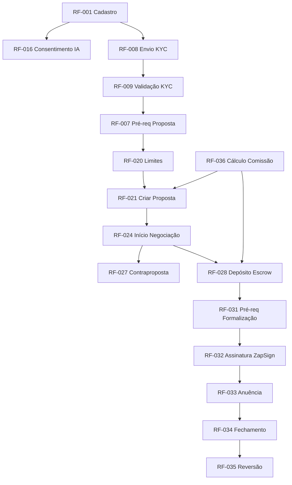

# 05.5 - PRD — RNFs, Transversais e Consolidação

## Módulo Cessionário · Plataforma Repasse Seguro

| **Campo** | **Valor** |
|---|---|
| **Destinatário** | Produto e Engenharia |
| **Escopo** | Requisitos Não Funcionais · Restrições · Critérios Globais de Aceite · Matriz de Rastreabilidade · Grafo de Dependências · Backlog de Decisões Autônomas |
| **Módulo** | Cessionário |
| **Parte** | Parte 5 de 5 — RNFs, Transversais e Consolidação |
| **Versão** | v1.0 |
| **Responsável** | Claude Code Desktop |
| **Data** | 22/03/2026 00:00 (America/Fortaleza) |

---

> 📌 **TL;DR — Parte 05.5**
>
> - RNFs cobrem: performance, segurança, disponibilidade, escalabilidade, acessibilidade, LGPD e observabilidade.
> - Total de requisitos funcionais: RF-001 a RF-073 (73 RFs).
> - Total de requisitos não funcionais: RNF-001 a RNF-015 (15 RNFs).
> - Todas as 72 RNs do D01 foram mapeadas para pelo menos 1 RF neste PRD — rastreabilidade 100%.
> - Decisões autônomas consolidadas: 15 decisões tomadas autonomamente durante a elaboração do PRD.

---

## 1. Requisitos Não Funcionais (RNFs)

### RNF-001 — Performance — Tempo de Resposta de API
> **Origem:** Stacks D02, RN-050 (D01.3)

**Descrição:** APIs de listagem (marketplace, propostas, negociações) devem responder em até 500ms (p95). APIs de ação (criar proposta, confirmar depósito) em até 1 segundo (p95). O Assistente IA deve iniciar streaming em até 5 segundos (p95) para análises individuais.

**Critério de aceite:**
- Medido via Langfuse (IA) e logs estruturados Pino (APIs).

---

### RNF-002 — Disponibilidade
> **Origem:** Objetivos do Produto (Parte 05.1)

**Descrição:** A plataforma deve ter uptime ≥ 99,5% (≤ 3,65 horas de indisponibilidade/mês). Janelas de manutenção programadas devem ser notificadas com 24 horas de antecedência.

**Critério de aceite:**
- Uptime monitorado via Railway e Sentry. Alertas automáticos se uptime cai abaixo de 99,5%.

---

### RNF-003 — Segurança — Autenticação e Autorização
> **Origem:** RN-013, RN-014, RN-067, RN-068 (D01.1, D01.5)

**Descrição:** Toda API autenticada via JWT. RLS habilitado em todas as tabelas do Supabase com dados de usuários. CSRF obrigatório em todos os endpoints de mutação. Helmet configurado desde o primeiro commit. `service_role` key do Supabase nunca exposta no frontend.

**Critério de aceite:**
- Dado que uma requisição sem token válido é feita, então o retorno é 401 Unauthorized.
- Dado que o RLS está habilitado, então queries que tentam acessar dados de outro Cessionário retornam vazio.

---

### RNF-004 — Segurança — Dados em Trânsito e em Repouso
> **Origem:** LGPD, Stacks D02

**Descrição:** Todo tráfego deve ser via HTTPS/TLS 1.2+. Dados sensíveis (CPF, documentos KYC) criptografados em repouso no Supabase Storage. Backups automáticos diários com retenção de 30 dias.

**Critério de aceite:**
- Conexões HTTP plain são redirecionadas automaticamente para HTTPS.
- Documentos KYC são armazenados via signed URL com expiração, nunca em URL pública permanente.

---

### RNF-005 — Segurança — Rate Limiting
> **Origem:** RN-006, RN-020 (D01.1, D01.2)

**Descrição:** Endpoints de autenticação: máx 10 tentativas em 15 minutos por IP. Endpoints de propostas: limitados por lógica de negócio (RF-020). Endpoints de LLM: 20–60 chamadas/minuto por Cessionário (ADR-001). Implementado via `@nestjs/throttler` + Redis.

**Critério de aceite:**
- Dado que um IP tenta login 11 vezes em 15 minutos, então a 11ª tentativa retorna 429 Too Many Requests.

---

### RNF-006 — Conformidade LGPD
> **Origem:** RN-015, RN-016, RN-067 (D01.1, D01.5)

**Descrição:** Toda funcionalidade que processa dados pessoais deve ter base legal documentada. Dados do Cedente nunca trafegam ao frontend do Cessionário. Exportação de dados em até 48 horas. Anonimização de conta em até 48 horas após solicitação de exclusão. Dados financeiros retidos por 5 anos.

**Critério de aceite:**
- Zero incidentes de exposição de dados pessoais do Cedente ao Cessionário em produção.

---

### RNF-007 — Escalabilidade
> **Origem:** Stacks D02

**Descrição:** A arquitetura deve suportar crescimento horizontal sem redesign. RabbitMQ para processamento assíncrono. Redis para cache e rate limiting. Supabase gerenciado para escalabilidade de banco. Railway para auto-scaling do backend.

**Critério de aceite:**
- O sistema deve processar picos de 10x o tráfego médio sem degradação perceptível de performance.

---

### RNF-008 — Observabilidade
> **Origem:** Stacks D02

**Descrição:** Logs estruturados via Pino com request ID, timestamp, nível e contexto. Sentry para error tracking com alertas em tempo real. PostHog para analytics e session replay. Langfuse para observabilidade de IA. Dashboard de métricas de SLA disponível para o time de operações.

**Critério de aceite:**
- Todo erro em produção gera alerta no Sentry em até 5 minutos.
- Todo request no backend gera log estruturado com request ID.

---

### RNF-009 — Acessibilidade
> **Origem:** Stacks D02 (shadcn/ui + Radix Primitives)

**Descrição:** A interface deve ser acessível via teclado (keyboard navigation completa via Radix Primitives). Todos os elementos interativos devem ter labels ARIA. Contraste de cores deve atender WCAG 2.1 AA. Focus management correto em modais e overlays.

**Critério de aceite:**
- Todo o fluxo de proposta pode ser completado usando apenas teclado.
- Contraste de texto principal ≥ 4.5:1 (WCAG AA).

---

### RNF-010 — Compatibilidade de Browser
> **Origem:** Stacks D02

**Descrição:** O frontend web deve funcionar em: Chrome 120+, Firefox 120+, Safari 17+, Edge 120+. Não há suporte a IE.

**Critério de aceite:**
- Todos os fluxos críticos (cadastro, KYC, proposta, Escrow, assinatura) funcionam em todos os browsers listados.

---

### RNF-011 — Mobile Responsivo
> **Origem:** RN-017 (D01.2) — Cessionário acessa via mobile para acompanhamento

**Descrição:** O frontend web deve ser responsivo (layout adaptado para viewport < 768px). As funcionalidades de acompanhamento (Dashboard, notificações, status) devem ser plenamente usáveis em mobile web.

**Critério de aceite:**
- O Dashboard é completamente legível e utilizável em viewport de 375px (iPhone SE).

---

### RNF-012 — Backup e Recuperação
> **Origem:** Stacks D02 (Supabase)

**Descrição:** Backups automáticos diários do banco de dados com retenção de 30 dias. RTO (Recovery Time Objective): ≤ 4 horas. RPO (Recovery Point Objective): ≤ 24 horas.

**Critério de aceite:**
- Dado um cenário de disaster recovery, então o sistema é restaurado em até 4 horas a partir do último backup.

---

### RNF-013 — TypeScript Strict Mode
> **Origem:** Stacks D02

**Descrição:** `strict: true` obrigatório em todos os projetos (backend, frontend, mobile). Arquivos `.js` no backend são proibidos. Arquivos `.jsx` no frontend são proibidos.

**Critério de aceite:**
- CI/CD bloqueia o deploy de qualquer PR que introduza erro de TypeScript em modo strict.

---

### RNF-014 — Monorepo Turborepo + pnpm
> **Origem:** Stacks D02

**Descrição:** Todo o código do módulo Cessionário reside em monorepo gerenciado com Turborepo + pnpm. Pacotes compartilhados (tipos, utils, design tokens) ficam em `packages/`. Deploy por workspace independente.

**Critério de aceite:**
- `turbo build` executa sem erros em todos os workspaces.
- `pnpm install` resolve todas as dependências sem conflitos.

---

### RNF-015 — Proteção contra Prompt Injection
> **Origem:** Stacks D02 (Analista de Oportunidades)

**Descrição:** Todo input do Cessionário para o Assistente IA deve ser sanitizado antes de ser inserido em prompts. Instruções de sistema nunca são expostas ao usuário. Outputs do LLM passam pelo filtro de conteúdo antes de exibição (RF-046).

**Critério de aceite:**
- Tentativas de prompt injection ("Ignore as instruções anteriores...") não resultam em divulgação de dados do sistema ou de outros usuários.

---

## 2. Restrições e Dependências

| **Restrição** | **Tipo** | **Impacto** |
|---|---|---|
| Stack normativa D02 | Técnica | Desvios exigem ADR aprovado |
| MVP: confirmação Escrow manual | Técnica | Celcoin automático apenas na v2 (ADR-003) |
| ZapSign obrigatório para formalização | Técnica/Negócio | Sem ZapSign, não há formalização digital |
| idwall para KYC | Técnica | Fallback manual disponível |
| LGPD Lei 13.709/2018 | Regulatória | Toda funcionalidade deve ter base legal |
| Anonimato do Cedente | Arquitetural | Não pode ser removido sem redesign completo |
| Sessão expira em 30 minutos | Segurança | Valor autoritativo para o perfil Cessionário |

---

## 3. Critérios Globais de Aceite

| **Critério** | **Métricas** |
|---|---|
| Cobertura de testes | ≥ 80% de cobertura nos módulos core (propostas, negociações, cálculo de comissão) |
| Zero dados Cedente no frontend | Auditoria automatizada de payloads de resposta |
| Notificações críticas entregues | 100% das NOT-CES-05, 06, 17 entregues via e-mail |
| Performance de APIs | p95 ≤ 500ms para listagens, ≤ 1s para ações |
| Acessibilidade | WCAG 2.1 AA para fluxos críticos |
| TypeScript strict | Zero erros em modo strict em CI/CD |

---

## 4. Matriz de Rastreabilidade RN → RF

| **RN** | **RF(s) Correspondente(s)** | **Parte PRD** |
|---|---|---|
| RN-001 | RF-001 | 05.2 |
| RN-002 | RF-002 | 05.2 |
| RN-003 | RF-003 | 05.2 |
| RN-004 | RF-004 | 05.2 |
| RN-005 | RF-005 | 05.2 |
| RN-006 | RF-006 | 05.2 |
| RN-007 | RF-011 | 05.2 |
| RN-008 | RF-012, RF-039 | 05.2, 05.3 |
| RN-009 | RF-007 | 05.2 |
| RN-010 | RF-008 | 05.2 |
| RN-011 | RF-009 | 05.2 |
| RN-012 | RF-010 | 05.2 |
| RN-013 | RF-013 | 05.2 |
| RN-014 | RF-014 | 05.2 |
| RN-015 | RF-015 | 05.2 |
| RN-016 | RF-016 | 05.2 |
| RN-017 | RF-017, RF-052, RF-054 | 05.2, 05.3 |
| RN-018 | RF-018 | 05.2 |
| RN-019 | RF-019 | 05.2 |
| RN-020 | RF-020 | 05.2 |
| RN-021 | RF-021, RF-057 | 05.2, 05.3 |
| RN-022 | RF-022 | 05.2 |
| RN-023 | RF-023 | 05.2 |
| RN-024 | RF-024 | 05.2 |
| RN-025 | RF-025 | 05.2 |
| RN-026 | RF-026 | 05.2 |
| RN-027 | RF-027 | 05.2 |
| RN-028 | RF-028 | 05.2 |
| RN-029 | RF-029 | 05.2 |
| RN-030 | RF-028 | 05.2 |
| RN-031 | RF-030 | 05.2 |
| RN-032 | RF-031 | 05.2 |
| RN-033 | RF-032 | 05.2 |
| RN-034 | RF-033 | 05.2 |
| RN-035 | RF-034 | 05.2 |
| RN-036 | RF-035 | 05.2 |
| RN-037 | RF-037 | 05.2 |
| RN-038 | RF-036 | 05.2 |
| RN-039 | RF-038 | 05.2 |
| RN-040 | RF-037 | 05.2 |
| RN-041 | RF-037 | 05.2 |
| RN-042 | RF-041 | 05.3 |
| RN-043 | RF-042, RF-055 | 05.3 |
| RN-044 | RF-043 | 05.3 |
| RN-045 | RF-044, RF-054 | 05.3 |
| RN-046 | RF-045 | 05.3 |
| RN-047 | RF-046 | 05.3 |
| RN-048 | RF-047 | 05.3 |
| RN-049 | RF-048 | 05.3 |
| RN-050 | RF-049 | 05.3 |
| RN-051 | RF-050 | 05.3 |
| RN-052 | RF-051, RF-056, RF-057, RF-058 | 05.3 |
| RN-053 | RF-059, RF-062 | 05.4 |
| RN-054 | RF-060, RF-062 | 05.4 |
| RN-055 | RF-061, RF-062 | 05.4 |
| RN-056 | RF-062 | 05.4 |
| RN-057 | RF-062 | 05.4 |
| RN-058 | RF-038, RF-062 | 05.2, 05.4 |
| RN-059 | RF-049, RF-062 | 05.3, 05.4 |
| RN-060 | RF-063 | 05.4 |
| RN-061 | RF-064 | 05.4 |
| RN-062 | RF-064, RF-065 | 05.4 |
| RN-063 | RF-032, RF-066 | 05.2, 05.4 |
| RN-064 | RF-028, RF-069 | 05.2, 05.4 |
| RN-065 | RF-009, RF-067 | 05.2, 05.4 |
| RN-066 | RF-012, RF-068 | 05.2, 05.4 |
| RN-067 | RF-014 | 05.2 |
| RN-068 | RF-013, RF-048 | 05.2, 05.3 |
| RN-069 | RF-039 | 05.3 |
| RN-070 | RF-005 | 05.2 |
| RN-071 | RF-040 | 05.2 |
| RN-072 | RF-014, RF-017 | 05.2 |

**Cobertura: 72/72 RNs mapeadas (100%).**

---

## 5. Grafo de Dependências Críticas

---

## 6. Backlog de Decisões Autônomas — Consolidado

| **ID** | **Decisão** | **Justificativa** | **Alternativa Descartada** |
|---|---|---|---|
| DEC-001 | Aviso prévio de 5 min antes da expiração de sessão | Evitar perda de dados em formulários | Expiração abrupta sem aviso |
| DEC-002 | Fluxo KYC em stepper de 3 passos | Reduz abandono por carga cognitiva | Formulário único |
| DEC-003 | Preservar progresso parcial do KYC por 24h | Evitar reenvio desnecessário | Descartar progresso ao sair |
| DEC-004 | Reenvio parcial de documentos no KYC | Apenas documentos reprovados precisam ser reenviados | Reenvio completo forçado |
| DEC-005 | Confirmação dupla para exclusão de conta | Ação irreversível exige dupla confirmação | Confirmação simples |
| DEC-006 | Skeleton cards no carregamento do marketplace | Preserva percepção de velocidade | Spinner centralizado |
| DEC-007 | "Fazer Proposta" primário, "Consultar Analista" secundário | Hierarquia visual para conversão | Mesmo peso visual para os dois |
| DEC-008 | Botão copiar dados bancários no Escrow | Reduz erro em transferências de alto valor | Apenas exibir dados |
| DEC-009 | 15 min como janela de confiança para re-autenticação | Equilíbrio entre segurança e usabilidade | Re-autenticar sempre |
| DEC-010 | Escala de cores urgência: amarelo (3 dias), vermelho (último dia) | Hierarquia visual de urgência padrão | Cor única para todos os prazos |
| DEC-011 | Extensão única por negociação (+5 dias úteis) | Evitar incentivo para postergar indefinidamente | Múltiplas extensões |
| DEC-012 | Máximo 3 rodadas de contraproposta por negociação | Evitar negociações sem fim que travam o Escrow | Sem limite de rodadas |
| DEC-013 | Fallback para "Mais recentes" quando sem histórico IA | Garantir experiência funcional sem personalização | Ordenação aleatória |
| DEC-014 | Tela de transição antes do redirecionamento ao ZapSign | Prepara o contexto, reduz desorientação | Redirecionar sem aviso |
| DEC-015 | Notificação in-app como canal de fallback universal | Garante informação mesmo com falha em canais externos | Depender exclusivamente de canais externos |

---

## 7. Cronograma Macro

| **Fase** | **Escopo** | **Dependências** |
|---|---|---|
| Sprint 1 | Autenticação (RF-001 a RF-005), Perfil (RF-011 a RF-013), KYC (RF-006 a RF-010) | Stack configurada, Supabase Auth, idwall |
| Sprint 2 | Marketplace (RF-017 a RF-019), Propostas (RF-020 a RF-023) | Sprint 1 concluída, Supabase Realtime |
| Sprint 3 | Negociações (RF-024 a RF-030), Chat | Sprint 2, RabbitMQ |
| Sprint 4 | Formalização (RF-031 a RF-033), ZapSign | Sprint 3, ZapSign configurado |
| Sprint 5 | Fechamento (RF-034, RF-035), Financeiro (RF-036 a RF-038) | Sprint 4, Celcoin |
| Sprint 6 | Dashboard (RF-041 a RF-045), Assistente IA (RF-046 a RF-050) | Sprint 2, OpenAI, pgvector |
| Sprint 7 | Notificações (RF-064, RF-065), Integrações (RF-066 a RF-073) | Sprints 1-6, Resend, Expo Push |
| Sprint 8 | LGPD (RF-015, RF-016), Empty States (RF-051 a RF-058), Polimentos | Sprints 1-7 |

---

## 8. Changelog Consolidado

| **Data** | **Versão** | **Descrição** |
|---|---|---|
| 22/03/2026 | v1.0 | Criação inicial — Pipeline ShiftLabs v9.5 |
