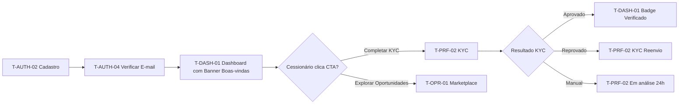
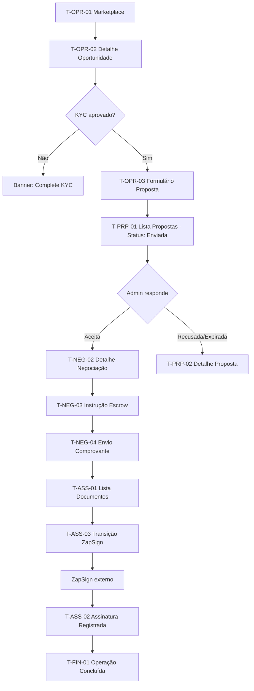
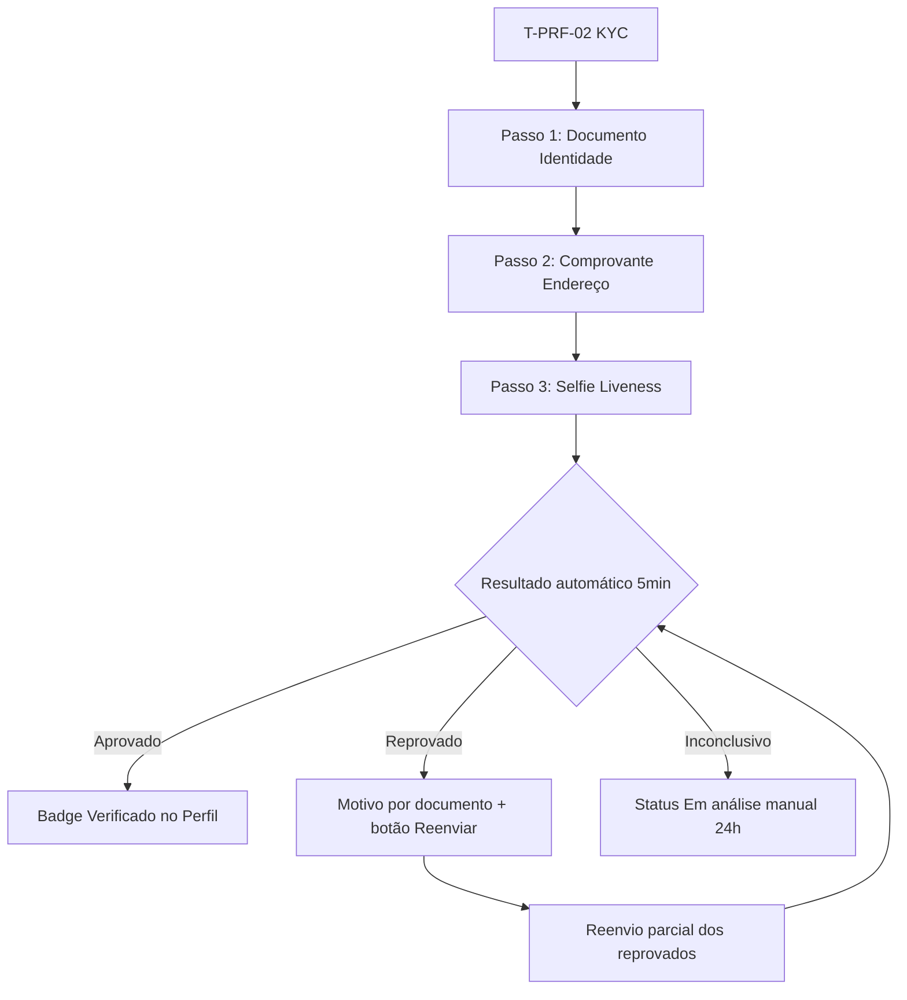

# 06 - Mapa de Telas

## Módulo Cessionário · Plataforma Repasse Seguro

| **Campo** | **Valor** |
|---|---|
| **Destinatário** | Design, Frontend e Produto |
| **Escopo** | Inventário completo de telas · Hierarquia de navegação · Fluxos de usuário · Estados de tela · Origem nos RFs |
| **Módulo** | Cessionário |
| **Versão** | v1.0 |
| **Responsável** | Claude Code Desktop |
| **Data** | 22/03/2026 00:00 (America/Fortaleza) |

---

> 📌 **TL;DR**
>
> - O módulo Cessionário tem **8 módulos principais** com **34 telas** no total (web).
> - Navegação principal via sidebar: Dashboard · Oportunidades · Minhas Propostas · Negociações · Assinaturas · Financeiro · Assistente IA · Meu Perfil.
> - Toda a aplicação é 100% logada (SPA React + Vite) — não há páginas públicas além do fluxo de autenticação.
> - Fluxo principal: Cadastro → KYC → Marketplace → Proposta → Negociação → Escrow → Formalização → Fechamento.
> - Telas com estados em tempo real (Supabase Realtime): Dashboard, Oportunidades, Propostas, Negociações.

---

## 1. Hierarquia de Navegação

```mermaid
graph TD
    A[Plataforma Repasse Seguro] --> B[Autenticação]
    A --> C[App — Logado]

    B --> B1[Login]
    B --> B2[Cadastro]
    B --> B3[Recuperar Senha]
    B --> B4[Verificar E-mail]

    C --> D[Dashboard]
    C --> E[Oportunidades]
    C --> F[Minhas Propostas]
    C --> G[Negociações]
    C --> H[Assinaturas]
    C --> I[Financeiro]
    C --> J[Assistente IA]
    C --> K[Meu Perfil]

    E --> E1[Lista de Oportunidades]
    E --> E2[Detalhe de Oportunidade]
    E --> E3[Formulário de Proposta]

    F --> F1[Lista de Propostas]
    F --> F2[Detalhe de Proposta]

    G --> G1[Lista de Negociações]
    G --> G2[Detalhe de Negociação]
    G --> G3[Instrução de Depósito Escrow]
    G --> G4[Envio de Comprovante]

    H --> H1[Lista de Documentos]
    H --> H2[Detalhe do Documento]
    H --> H3[Transição para ZapSign]

    I --> I1[Extrato Financeiro]
    I --> I2[Detalhe de Operação]

    K --> K1[Dados Pessoais]
    K --> K2[KYC — Status e Envio]
    K --> K3[Notificações]
    K --> K4[Segurança]
    K --> K5[Dados e Privacidade LGPD]
```

---

## 2. Inventário Completo de Telas

### 2.1 Bloco A — Autenticação (4 telas)

| **ID** | **Nome da Tela** | **RFs de Origem** | **URL** |
|---|---|---|---|
| T-AUTH-01 | Login | RF-002, RF-003 | `/login` |
| T-AUTH-02 | Cadastro | RF-001, RF-016 | `/cadastro` |
| T-AUTH-03 | Recuperar Senha | RF-002 | `/recuperar-senha` |
| T-AUTH-04 | Verificar E-mail | RF-001, RF-011 | `/verificar-email` |

---

### 2.2 Bloco B — Dashboard (1 tela principal + overlays)

| **ID** | **Nome da Tela** | **RFs de Origem** | **URL** |
|---|---|---|---|
| T-DASH-01 | Dashboard | RF-041 a RF-045, RF-054 | `/dashboard` |
| T-DASH-01a | Modal: Aviso de Expiração de Sessão (overlay) | RF-004 | overlay |
| T-DASH-01b | Modal: Re-autenticação (overlay) | RF-005 | overlay |

---

### 2.3 Bloco C — Oportunidades / Marketplace (3 telas)

| **ID** | **Nome da Tela** | **RFs de Origem** | **URL** |
|---|---|---|---|
| T-OPR-01 | Lista de Oportunidades | RF-017, RF-018, RF-051, RF-052 | `/oportunidades` |
| T-OPR-02 | Detalhe de Oportunidade | RF-019, RF-007 | `/oportunidades/:id` |
| T-OPR-03 | Formulário de Proposta | RF-020, RF-021 | `/oportunidades/:id/proposta` |

---

### 2.4 Bloco D — Minhas Propostas (2 telas)

| **ID** | **Nome da Tela** | **RFs de Origem** | **URL** |
|---|---|---|---|
| T-PRP-01 | Lista de Propostas | RF-022, RF-023 | `/propostas` |
| T-PRP-02 | Detalhe de Proposta | RF-022 | `/propostas/:id` |

---

### 2.5 Bloco E — Negociações (4 telas + overlay)

| **ID** | **Nome da Tela** | **RFs de Origem** | **URL** |
|---|---|---|---|
| T-NEG-01 | Lista de Negociações | RF-024, RF-042 | `/negociacoes` |
| T-NEG-02 | Detalhe de Negociação (+ Chat) | RF-025, RF-026, RF-027 | `/negociacoes/:id` |
| T-NEG-03 | Instrução de Depósito Escrow | RF-028, RF-029 | `/negociacoes/:id/escrow` |
| T-NEG-04 | Envio de Comprovante | RF-028 | `/negociacoes/:id/comprovante` |
| T-NEG-04a | Modal: Confirmação de Contraproposta (overlay) | RF-027 | overlay |

---

### 2.6 Bloco F — Assinaturas / Formalização (3 telas)

| **ID** | **Nome da Tela** | **RFs de Origem** | **URL** |
|---|---|---|---|
| T-ASS-01 | Lista de Documentos | RF-031, RF-032 | `/assinaturas` |
| T-ASS-02 | Detalhe do Documento | RF-031, RF-032 | `/assinaturas/:id` |
| T-ASS-03 | Tela de Transição para ZapSign | RF-032 | `/assinaturas/:id/assinar` |

---

### 2.7 Bloco G — Financeiro (3 telas)

| **ID** | **Nome da Tela** | **RFs de Origem** | **URL** |
|---|---|---|---|
| T-FIN-01 | Extrato Financeiro | RF-037, RF-040 | `/financeiro` |
| T-FIN-02 | Detalhe de Operação | RF-036, RF-038 | `/financeiro/:id` |
| T-FIN-03 | Detalhe de Reembolso | RF-038 | `/financeiro/reembolso/:id` |

---

### 2.8 Bloco H — Assistente IA (1 tela)

| **ID** | **Nome da Tela** | **RFs de Origem** | **URL** |
|---|---|---|---|
| T-IA-01 | Chat com Analista de Oportunidades | RF-046 a RF-050 | `/assistente` |

---

### 2.9 Bloco I — Meu Perfil (5 telas)

| **ID** | **Nome da Tela** | **RFs de Origem** | **URL** |
|---|---|---|---|
| T-PRF-01 | Dados Pessoais | RF-011 | `/perfil` |
| T-PRF-02 | KYC — Status e Envio (Stepper) | RF-007, RF-008, RF-009, RF-010, RF-006 | `/perfil/kyc` |
| T-PRF-03 | Configurações de Notificação | RF-012, RF-039 | `/perfil/notificacoes` |
| T-PRF-04 | Segurança (Alterar Senha) | RF-002, RF-005 | `/perfil/segurança` |
| T-PRF-05 | Dados e Privacidade (LGPD) | RF-015, RF-016 | `/perfil/privacidade` |

---

## 3. Fluxos Principais de Usuário

### 3.1 Fluxo de Onboarding

---

### 3.2 Fluxo Principal de Operação (Proposta → Fechamento)

---

### 3.3 Fluxo do KYC

---

## 4. Estados de Cada Tela

### 4.1 T-OPR-01 — Lista de Oportunidades

| **Estado** | **Trigger** | **UI** |
|---|---|---|
| Carregando | Entrada na tela / mudança de filtro | Skeleton cards animados (Framer Motion) |
| Com resultados | Dados carregados | Grid de cards com todos os campos (RF-017) |
| Sem resultados (filtros ativos) | Nenhuma oportunidade com filtros | Empty state: mensagem + CTA "Limpar filtros" |
| Sem resultados (sem filtros) | Nenhuma oportunidade disponível | Empty state: mensagem + ilustração |
| Erro de carregamento | Falha de API | Empty state de erro com botão "Tentar novamente" |

---

### 4.2 T-OPR-02 — Detalhe de Oportunidade

| **Estado** | **UI do botão "Fazer Proposta"** |
|---|---|
| KYC não aprovado | Desabilitado + tooltip "Complete sua verificação..." |
| Limite simultâneo atingido | Desabilitado + tooltip "Limite de 3 propostas..." |
| Rate limit atingido | Desabilitado + tooltip "Próxima proposta às {horário}..." |
| Todos os requisitos atendidos | Habilitado (cor primária #0069A8) |

---

### 4.3 T-PRF-02 — KYC Stepper

| **Passo** | **Conteúdo** | **Estado de progresso** |
|---|---|---|
| Passo 1 | Upload: documento de identidade (frente + verso) | ○ Pendente / ⟳ Enviando / ✓ Concluído / ✗ Reprovado |
| Passo 2 | Upload: comprovante de endereço (últimos 90 dias) | ○ Pendente / ⟳ Enviando / ✓ Concluído / ✗ Reprovado |
| Passo 3 | Câmera: selfie de prova de vida (liveness) | ○ Pendente / ⟳ Capturando / ✓ Concluído / ✗ Reprovado |
| Resultado | Aprovado / Reprovado / Em análise manual | Badge colorido com mensagem contextual |

---

### 4.4 T-NEG-02 — Detalhe de Negociação

| **Estado** | **UI** |
|---|---|
| Em Negociação | Chat ativo + botão "Contraproposta" + status indicator |
| Em Contraproposta | Chat em modo leitura + status "Aguardando resposta" |
| Aguardando Depósito | CTA "Depositar em Escrow" destacado + contador de dias (amarelo/vermelho por prazo) |
| Depósito Confirmado | Status success + CTA "Ver documentos de formalização" |
| Encerrada / Cancelada | Status final + CTA "Explorar novas oportunidades" |

---

## 5. Componentes Globais

| **Componente** | **Descrição** | **Telas** |
|---|---|---|
| Sidebar de Navegação | 8 itens com badges de notificação | Todas as telas logadas |
| Header | Logo + nome do usuário + avatar + notificações bell | Todas as telas logadas |
| Modal de Re-autenticação | Overlay para ações críticas (Escrow, assinatura, dados bancários) | T-NEG-03, T-ASS-03, T-PRF-01 |
| Modal de Expiração de Sessão | Countdown 5 minutos + "Continuar" / "Sair" | Todas as telas logadas |
| Toast de Confirmação | Auto-dismissível em 5 segundos, canto inferior direito | Todas as telas com ações |
| Skeleton Screens | Cards e listagens durante carregamento (Framer Motion) | T-OPR-01, T-PRP-01, T-NEG-01, T-FIN-01 |
| Badge de Status | Cores semânticas: azul (em análise), verde (aprovado/concluído), vermelho (recusado/urgente), amarelo (atenção) | Todas as telas com status |

---

## 6. Regras de Navegação

| **Regra** | **Descrição** |
|---|---|
| Toda rota logada requer sessão ativa | Redirecionamento para `/login` se sem token válido |
| Sidebar sempre visível em telas logadas | Exceto durante transição para ZapSign (T-ASS-03) |
| Breadcrumb nas telas de detalhe | Permite retorno ao módulo pai |
| Filtros persistem na sessão | Filtros do marketplace mantidos ao voltar da tela de detalhe |
| Deep link para notificações | Clicar em notificação → abre a tela correspondente diretamente |
| AnimatePresence em todas as trocas de rota | Via Framer Motion, conforme D04 Motion Spec |

---

## 7. Telas de Erro e Estados Vazios

| **Tela** | **Tipo de Erro** | **Mensagem** | **CTA** |
|---|---|---|---|
| T-OPR-01 | Sem oportunidades com filtros | "Nenhuma oportunidade encontrada com esses filtros." | Limpar filtros |
| T-PRP-01 | Sem propostas | "Você ainda não enviou nenhuma proposta." | Explorar Oportunidades |
| T-NEG-01 | Sem negociações | "Nenhuma negociação ativa no momento." | Explorar Oportunidades |
| T-FIN-01 | Sem transações | "Nenhuma transação registrada ainda." | Ver Oportunidades |
| T-ASS-01 | Sem documentos | "Nenhum documento pendente de assinatura." | Ver Negociações |
| T-IA-01 | Primeira interação | "Olá! Sou o Analista de Oportunidades. Como posso ajudar?" | — |
| Qualquer | Erro 404 | "Página não encontrada." | Voltar ao Dashboard |
| Qualquer | Erro 500 | "Erro inesperado. Tente novamente." | Tentar novamente |

---

## 8. Changelog

| **Data** | **Versão** | **Descrição** |
|---|---|---|
| 22/03/2026 | v1.0 | Criação inicial — Pipeline ShiftLabs v9.5 |
