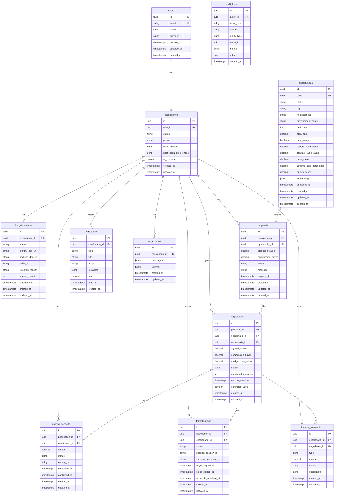

# 12 - Modelo de Dados (ERD / Schema)

## Módulo Cessionário · Plataforma Repasse Seguro

| **Campo** | **Valor** |
|---|---|
| **Destinatário** | Tech Lead e Engenharia |
| **Escopo** | Modelo relacional completo · Entidades · Relacionamentos · Diagramas ERD · Índices e constraints |
| **Módulo** | Cessionário |
| **Versão** | v1.0 |
| **Responsável** | Claude Code Desktop |
| **Data** | 22/03/2026 00:00 (America/Fortaleza) |

---

> 📌 **TL;DR**
>
> - O modelo de dados cobre 12 tabelas principais: users, cessionarios, kyc_documents, opportunities, proposals, negotiations, escrow_deposits, formalizations, financial_transactions, notifications, ai_sessions, audit_logs.
> - Toda tabela de domínio usa UUID v4 como PK, `created_at`/`updated_at` em Timestamptz, e soft delete via `deleted_at`.
> - RLS habilitado em todas as tabelas com dados de usuários — filtro por `cessionario_id` garante isolamento (RN-013, RN-068).
> - A tabela `opportunities` nunca expõe `cedente_id` diretamente ao frontend do Cessionário — anonimização estrutural (RN-014, RN-067).
> - Extensão `pgvector` habilitada para embeddings do Analista de Oportunidades (RAG).

---

## 1. Diagrama ERD — Entidades e Relacionamentos

---

## 2. Detalhamento das Tabelas

### 2.1 `users`
Tabela gerenciada pelo Supabase Auth. Dados de autenticação base.

| **Coluna** | **Tipo** | **Constraints** | **Descrição** |
|---|---|---|---|
| `id` | `UUID` | PK, DEFAULT gen_random_uuid() | Identificador único |
| `email` | `VARCHAR(255)` | NOT NULL, UNIQUE | E-mail de autenticação |
| `name` | `VARCHAR(255)` | NOT NULL | Nome completo |
| `provider` | `VARCHAR(50)` | DEFAULT 'email' | 'email' ou 'google' |
| `email_verified_at` | `TIMESTAMPTZ` | NULL | Data de verificação do e-mail |
| `created_at` | `TIMESTAMPTZ` | NOT NULL, DEFAULT now() | Criação do registro |
| `updated_at` | `TIMESTAMPTZ` | NOT NULL | Última atualização |
| `deleted_at` | `TIMESTAMPTZ` | NULL | Soft delete (exclusão LGPD) |

---

### 2.2 `cessionarios`
Perfil estendido do Cessionário, com status de KYC, preferências e dados financeiros.

| **Coluna** | **Tipo** | **Constraints** | **Descrição** |
|---|---|---|---|
| `id` | `UUID` | PK | Identificador único |
| `user_id` | `UUID` | FK users.id, UNIQUE | Vínculo 1-1 com users |
| `status` | `ENUM` | NOT NULL | CADASTRADA, KYC_EM_ANALISE, KYC_APROVADO, KYC_REPROVADO, BLOQUEADA_TEMPORARIAMENTE, ENCERRADA |
| `phone` | `VARCHAR(20)` | NULL | Telefone verificado |
| `phone_verified_at` | `TIMESTAMPTZ` | NULL | Data de verificação |
| `bank_account` | `JSONB` | NULL | Dados bancários para reembolso (criptografado) |
| `bank_account_verified_at` | `TIMESTAMPTZ` | NULL | Data de verificação dos dados bancários |
| `notification_preferences` | `JSONB` | NOT NULL, DEFAULT '{"email": true, "push": true, "sms": true}' | Canais habilitados |
| `ai_consent` | `BOOLEAN` | NOT NULL, DEFAULT true | Consentimento para uso de dados pela IA |
| `ai_consent_at` | `TIMESTAMPTZ` | NULL | Data do consentimento |
| `investment_preferences` | `JSONB` | NULL | Preferências de investimento (localização, faixa de valor) |
| `created_at` | `TIMESTAMPTZ` | NOT NULL, DEFAULT now() | |
| `updated_at` | `TIMESTAMPTZ` | NOT NULL | |

**Índices:**
- `idx_cessionarios_user_id` ON user_id
- `idx_cessionarios_status` ON status

---

### 2.3 `kyc_documents`
Controla o fluxo de KYC do Cessionário.

| **Coluna** | **Tipo** | **Constraints** | **Descrição** |
|---|---|---|---|
| `id` | `UUID` | PK | |
| `cessionario_id` | `UUID` | FK cessionarios.id | |
| `status` | `ENUM` | NOT NULL | PENDENTE, EM_ANALISE, APROVADO, REPROVADO |
| `identity_doc_front_url` | `VARCHAR` | NULL | Signed URL (Supabase Storage) — frente |
| `identity_doc_back_url` | `VARCHAR` | NULL | Signed URL — verso |
| `address_doc_url` | `VARCHAR` | NULL | Signed URL — comprovante endereço |
| `selfie_url` | `VARCHAR` | NULL | Signed URL — selfie liveness |
| `identity_status` | `ENUM` | DEFAULT PENDENTE | Status individual do documento de identidade |
| `address_status` | `ENUM` | DEFAULT PENDENTE | Status individual do comprovante |
| `selfie_status` | `ENUM` | DEFAULT PENDENTE | Status individual da selfie |
| `rejection_reason` | `TEXT` | NULL | Motivo da reprovação (por documento) |
| `idwall_session_id` | `VARCHAR` | NULL | ID da sessão no idwall |
| `attempt_count` | `INT` | DEFAULT 0 | Contagem de tentativas na janela de 1h |
| `blocked_until` | `TIMESTAMPTZ` | NULL | Bloqueio de upload (RN-006) |
| `reviewer_id` | `UUID` | NULL | Admin que fez revisão manual |
| `reviewed_at` | `TIMESTAMPTZ` | NULL | Data da revisão manual |
| `created_at` | `TIMESTAMPTZ` | NOT NULL, DEFAULT now() | |
| `updated_at` | `TIMESTAMPTZ` | NOT NULL | |

---

### 2.4 `opportunities`
Marketplace de oportunidades — dados de cessão imobiliária.

| **Coluna** | **Tipo** | **Constraints** | **Descrição** |
|---|---|---|---|
| `id` | `UUID` | PK | |
| `code` | `VARCHAR(20)` | NOT NULL, UNIQUE | Ex: OPR-2026-0042 |
| `status` | `ENUM` | NOT NULL | DISPONIVEL, COM_PROPOSTA, EM_NEGOCIACAO, RESERVADA, CONCLUIDA, CANCELADA |
| `city` | `VARCHAR(100)` | NOT NULL | |
| `neighborhood` | `VARCHAR(100)` | NOT NULL | |
| `state` | `VARCHAR(2)` | NOT NULL | |
| `development_name` | `VARCHAR(200)` | NOT NULL | Nome do empreendimento |
| `bedrooms` | `INT` | NOT NULL | |
| `area_sqm` | `DECIMAL(8,2)` | NOT NULL | |
| `has_garage` | `BOOLEAN` | NOT NULL | |
| `current_table_value` | `DECIMAL(15,2)` | NOT NULL | Tabela Atual |
| `contract_table_value` | `DECIMAL(15,2)` | NOT NULL | Tabela Contrato |
| `delta_value` | `DECIMAL(15,2)` | GENERATED ALWAYS AS (current_table_value - contract_table_value) | Δ calculado |
| `cedente_paid_percentage` | `DECIMAL(5,2)` | NOT NULL | % pago pelo Cedente |
| `cedente_paid_value` | `DECIMAL(15,2)` | NOT NULL | Valor pago pelo Cedente (para fallback comissão) |
| `ai_risk_score` | `DECIMAL(4,2)` | NULL | Score de risco IA (1-10) |
| `embedding` | `vector(1536)` | NULL | Embedding pgvector (text-embedding-3-small) |
| `appreciation_data` | `JSONB` | NULL | Dados históricos de valorização |
| `published_at` | `TIMESTAMPTZ` | NULL | Data de publicação no marketplace |
| `created_at` | `TIMESTAMPTZ` | NOT NULL | |
| `updated_at` | `TIMESTAMPTZ` | NOT NULL | |
| `deleted_at` | `TIMESTAMPTZ` | NULL | Soft delete |

**Nota de segurança:** A tabela `opportunities` não armazena `cedente_id` — o vínculo ao Cedente existe apenas em tabela interna do Admin, nunca exposta ao módulo Cessionário.

**Índices:**
- `idx_opportunities_status` ON status
- `idx_opportunities_city_state` ON (city, state)
- `idx_opportunities_embedding` USING hnsw (embedding vector_cosine_ops)

---

### 2.5 `proposals`
Propostas enviadas pelo Cessionário.

| **Coluna** | **Tipo** | **Constraints** | **Descrição** |
|---|---|---|---|
| `id` | `UUID` | PK | |
| `cessionario_id` | `UUID` | FK cessionarios.id | |
| `opportunity_id` | `UUID` | FK opportunities.id | |
| `proposed_value` | `DECIMAL(15,2)` | NOT NULL, > 0 | Preço Repasse proposto |
| `commission_buyer` | `DECIMAL(15,2)` | NOT NULL | 20% × delta (ou fallback) |
| `message` | `TEXT` | NULL | Mensagem ao Admin (máx 500 chars) |
| `status` | `ENUM` | NOT NULL | ENVIADA, EM_ANALISE, ACEITA, RECUSADA, EXPIRADA, CANCELADA |
| `rejection_reason` | `TEXT` | NULL | Motivo da recusa |
| `expires_at` | `TIMESTAMPTZ` | NOT NULL | Expira em 72h úteis |
| `created_at` | `TIMESTAMPTZ` | NOT NULL | |
| `updated_at` | `TIMESTAMPTZ` | NOT NULL | |
| `deleted_at` | `TIMESTAMPTZ` | NULL | |

**Índices:**
- `idx_proposals_cessionario_id` ON cessionario_id
- `idx_proposals_opportunity_id` ON opportunity_id
- `idx_proposals_status` ON status
- `idx_proposals_cessionario_status` ON (cessionario_id, status) — para verificação de limites

---

### 2.6 `negotiations`
Negociações originadas de propostas aceitas.

| **Coluna** | **Tipo** | **Constraints** | **Descrição** |
|---|---|---|---|
| `id` | `UUID` | PK | |
| `proposal_id` | `UUID` | FK proposals.id, UNIQUE | |
| `cessionario_id` | `UUID` | FK cessionarios.id | |
| `opportunity_id` | `UUID` | FK opportunities.id | |
| `agreed_value` | `DECIMAL(15,2)` | NULL | Valor final acordado |
| `commission_buyer` | `DECIMAL(15,2)` | NULL | Comissão calculada com valor final |
| `total_escrow_value` | `DECIMAL(15,2)` | NULL | agreed_value + commission_buyer |
| `status` | `ENUM` | NOT NULL | EM_NEGOCIACAO, EM_CONTRAPROPOSTA, AGUARDANDO_DEPOSITO, DEPOSITO_CONFIRMADO, ENCERRADA, CANCELADA |
| `counteroffer_rounds` | `INT` | DEFAULT 0, MAX 3 | Rodadas de contraproposta |
| `escrow_deadline` | `TIMESTAMPTZ` | NULL | Prazo para depósito (10 dias úteis) |
| `extension_used` | `BOOLEAN` | DEFAULT false | Se a extensão única foi usada |
| `extended_deadline` | `TIMESTAMPTZ` | NULL | Prazo pós-extensão (+5 dias úteis) |
| `created_at` | `TIMESTAMPTZ` | NOT NULL | |
| `updated_at` | `TIMESTAMPTZ` | NOT NULL | |

---

### 2.7 `escrow_deposits`
Depósitos em conta Escrow.

| **Coluna** | **Tipo** | **Constraints** | **Descrição** |
|---|---|---|---|
| `id` | `UUID` | PK | |
| `negotiation_id` | `UUID` | FK negotiations.id | |
| `cessionario_id` | `UUID` | FK cessionarios.id | |
| `amount` | `DECIMAL(15,2)` | NOT NULL | Valor depositado |
| `status` | `ENUM` | NOT NULL | AGUARDANDO_DEPOSITO, DEPOSITO_ENVIADO, DEPOSITO_CONFIRMADO, REEMBOLSADO |
| `receipt_url` | `VARCHAR` | NULL | Signed URL do comprovante |
| `submitted_at` | `TIMESTAMPTZ` | NULL | Quando o comprovante foi enviado |
| `confirmed_at` | `TIMESTAMPTZ` | NULL | Quando o Admin confirmou |
| `confirmed_by` | `UUID` | NULL | Admin que confirmou |
| `created_at` | `TIMESTAMPTZ` | NOT NULL | |
| `updated_at` | `TIMESTAMPTZ` | NOT NULL | |

---

### 2.8 `formalizations`
Processo de formalização via ZapSign.

| **Coluna** | **Tipo** | **Constraints** | **Descrição** |
|---|---|---|---|
| `id` | `UUID` | PK | |
| `negotiation_id` | `UUID` | FK negotiations.id, UNIQUE | |
| `cessionario_id` | `UUID` | FK cessionarios.id | |
| `status` | `ENUM` | NOT NULL | DOCUMENTOS_DISPONIVEIS, ASSINATURA_PENDENTE_CESSIONARIO, ASSINATURA_PENDENTE_CEDENTE, AGUARDANDO_ANUENCIA, CONCLUIDA, CANCELADA |
| `zapsign_session_id` | `VARCHAR` | NULL | ID da sessão ZapSign |
| `zapsign_buyer_sign_url` | `VARCHAR` | NULL | URL de assinatura do Cessionário |
| `document_url` | `VARCHAR` | NULL | URL do documento final assinado |
| `buyer_signed_at` | `TIMESTAMPTZ` | NULL | |
| `seller_signed_at` | `TIMESTAMPTZ` | NULL | |
| `anuencia_obtained_at` | `TIMESTAMPTZ` | NULL | |
| `created_at` | `TIMESTAMPTZ` | NOT NULL | |
| `updated_at` | `TIMESTAMPTZ` | NOT NULL | |

---

### 2.9 `financial_transactions`
Registro financeiro de todas as operações.

| **Coluna** | **Tipo** | **Constraints** | **Descrição** |
|---|---|---|---|
| `id` | `UUID` | PK | |
| `cessionario_id` | `UUID` | FK cessionarios.id | |
| `negotiation_id` | `UUID` | FK negotiations.id, NULL | |
| `type` | `ENUM` | NOT NULL | ESCROW_DEPOSIT, COMMISSION, REFUND, OPERATION_COMPLETED |
| `amount` | `DECIMAL(15,2)` | NOT NULL, >= 0 | Nunca negativo (RN-071) |
| `status` | `ENUM` | NOT NULL | PENDENTE, PROCESSADO, FALHOU |
| `description` | `TEXT` | NULL | |
| `created_at` | `TIMESTAMPTZ` | NOT NULL | |
| `updated_at` | `TIMESTAMPTZ` | NOT NULL | |

---

### 2.10 `notifications`
Notificações in-app do Cessionário.

| **Coluna** | **Tipo** | **Constraints** | **Descrição** |
|---|---|---|---|
| `id` | `UUID` | PK | |
| `cessionario_id` | `UUID` | FK cessionarios.id | |
| `type` | `VARCHAR(50)` | NOT NULL | Ex: 'NOT_CES_01' |
| `title` | `VARCHAR(200)` | NOT NULL | |
| `body` | `TEXT` | NOT NULL | |
| `metadata` | `JSONB` | NULL | Contexto adicional (id da oportunidade, valor, etc.) |
| `read` | `BOOLEAN` | DEFAULT false | |
| `read_at` | `TIMESTAMPTZ` | NULL | |
| `created_at` | `TIMESTAMPTZ` | NOT NULL | |

**Índices:**
- `idx_notifications_cessionario_unread` ON (cessionario_id, read) WHERE read = false

---

### 2.11 `ai_sessions`
Sessões de chat com o Analista de Oportunidades.

| **Coluna** | **Tipo** | **Constraints** | **Descrição** |
|---|---|---|---|
| `id` | `UUID` | PK | |
| `cessionario_id` | `UUID` | FK cessionarios.id | |
| `messages` | `JSONB` | NOT NULL, DEFAULT '[]' | Histórico de mensagens [{role, content, timestamp}] |
| `context` | `JSONB` | NULL | Contexto de oportunidades consultadas |
| `created_at` | `TIMESTAMPTZ` | NOT NULL | |
| `updated_at` | `TIMESTAMPTZ` | NOT NULL | |

---

### 2.12 `audit_logs`
Registro imutável de ações críticas (LGPD, segurança, operações financeiras).

| **Coluna** | **Tipo** | **Constraints** | **Descrição** |
|---|---|---|---|
| `id` | `UUID` | PK | |
| `actor_id` | `UUID` | NOT NULL | Quem realizou a ação |
| `actor_type` | `ENUM` | NOT NULL | CESSIONARIO, ADMIN, SYSTEM |
| `action` | `VARCHAR(100)` | NOT NULL | Ex: 'KYC_APPROVED', 'PROPOSAL_CREATED' |
| `entity_type` | `VARCHAR(50)` | NOT NULL | Ex: 'proposals', 'negotiations' |
| `entity_id` | `UUID` | NULL | ID da entidade afetada |
| `before` | `JSONB` | NULL | Estado antes |
| `after` | `JSONB` | NULL | Estado depois |
| `ip_address` | `VARCHAR(45)` | NULL | IP do ator |
| `created_at` | `TIMESTAMPTZ` | NOT NULL | Imutável — sem updated_at |

---

## 3. Regras de Row Level Security (RLS)

| **Tabela** | **Política RLS** |
|---|---|
| `cessionarios` | SELECT/UPDATE: WHERE user_id = auth.uid() |
| `kyc_documents` | SELECT/INSERT/UPDATE: WHERE cessionario_id IN (SELECT id FROM cessionarios WHERE user_id = auth.uid()) |
| `proposals` | SELECT/INSERT/UPDATE: WHERE cessionario_id = [id do Cessionário logado] |
| `negotiations` | SELECT: WHERE cessionario_id = [id do Cessionário logado] |
| `escrow_deposits` | SELECT/INSERT: WHERE cessionario_id = [id do Cessionário logado] |
| `formalizations` | SELECT: WHERE cessionario_id = [id do Cessionário logado] |
| `financial_transactions` | SELECT: WHERE cessionario_id = [id do Cessionário logado] |
| `notifications` | SELECT/UPDATE: WHERE cessionario_id = [id do Cessionário logado] |
| `ai_sessions` | SELECT/INSERT/UPDATE: WHERE cessionario_id = [id do Cessionário logado] |
| `opportunities` | SELECT: ALL (marketplace público para Cessionários autenticados) |
| `audit_logs` | Nenhuma policy pública — acesso apenas via service_role (Admin) |

---

## 4. Changelog

| **Data** | **Versão** | **Descrição** |
|---|---|---|
| 22/03/2026 | v1.0 | Criação inicial — Pipeline ShiftLabs v9.5 |
