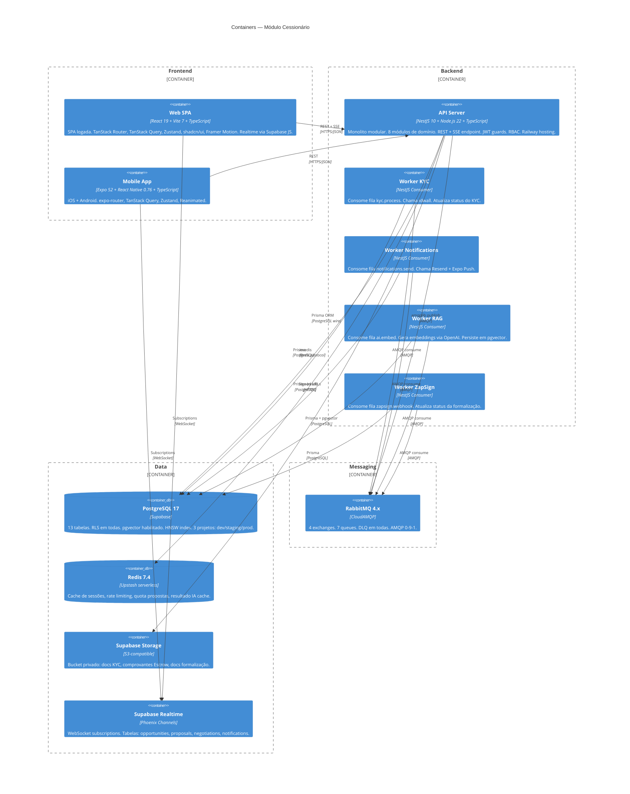
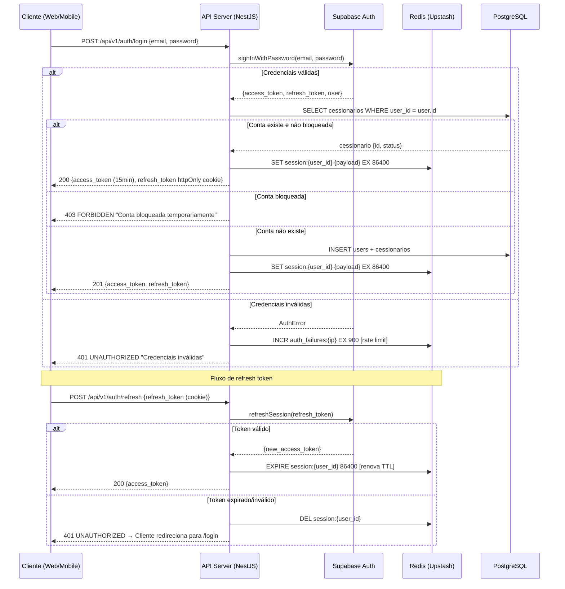
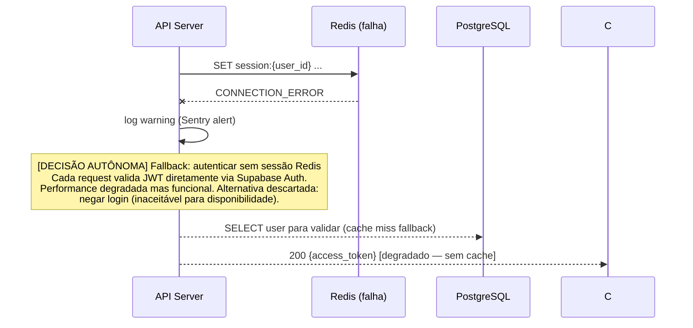
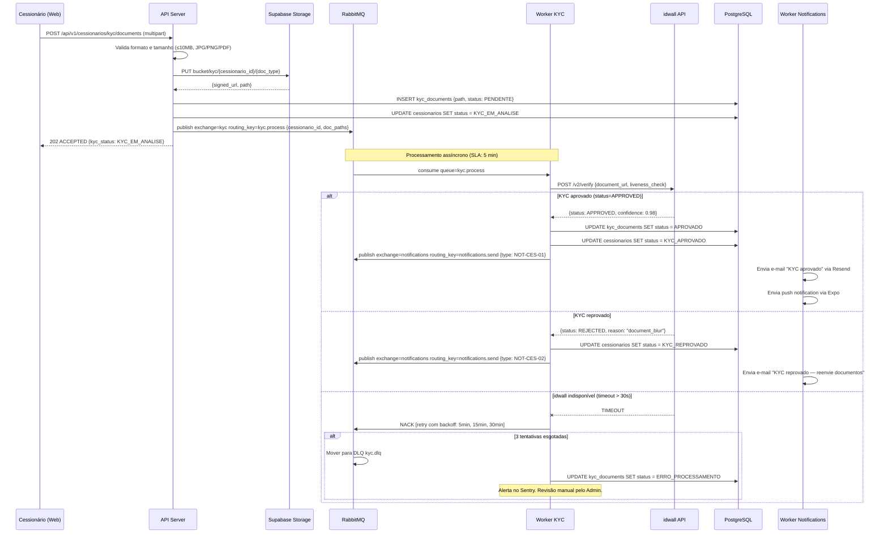
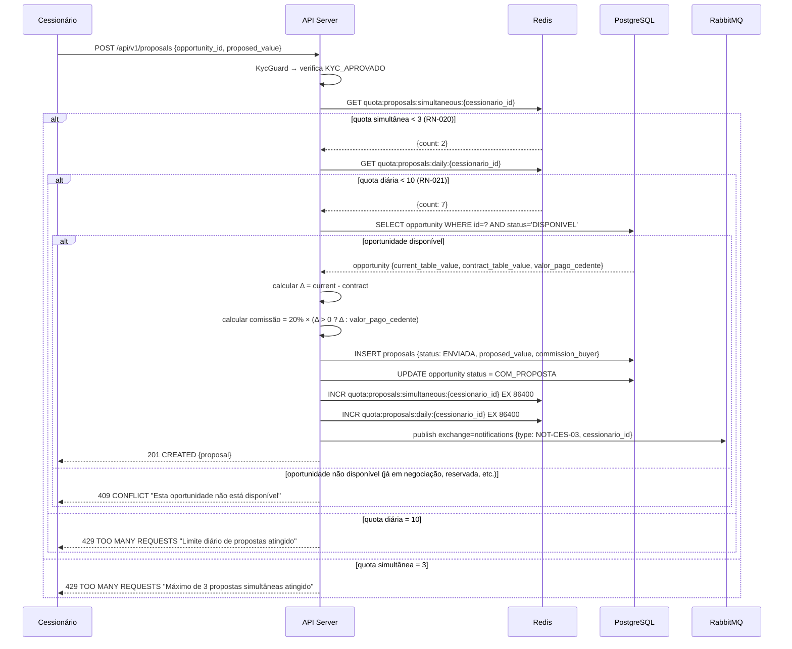
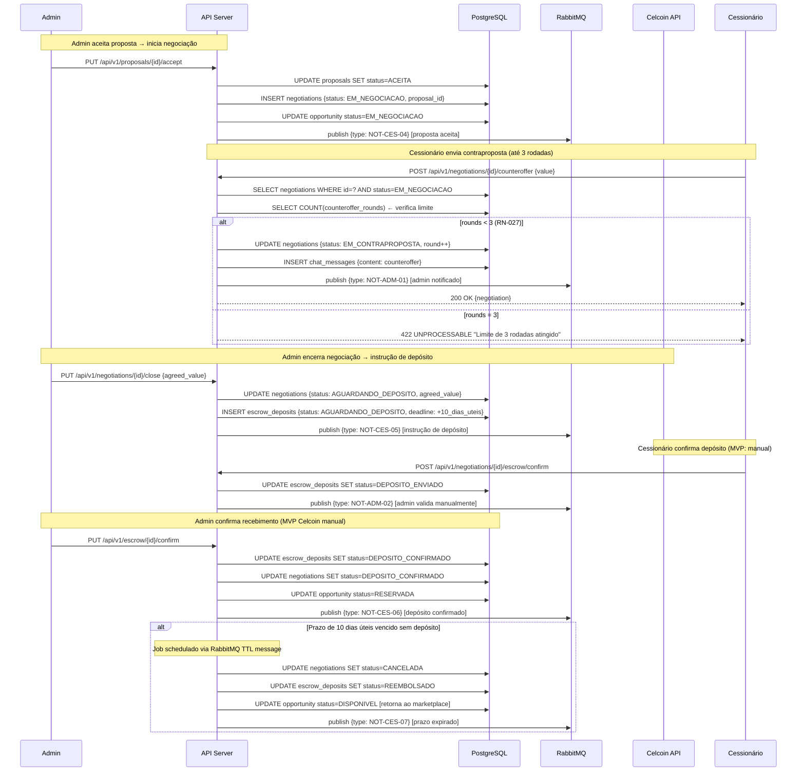
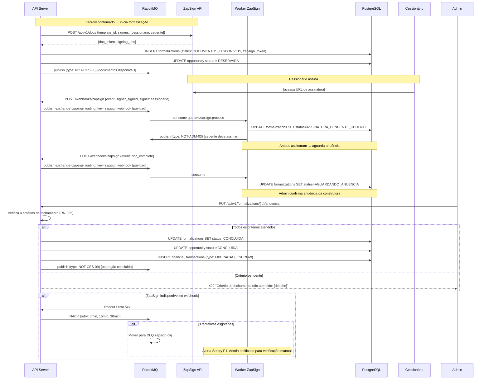
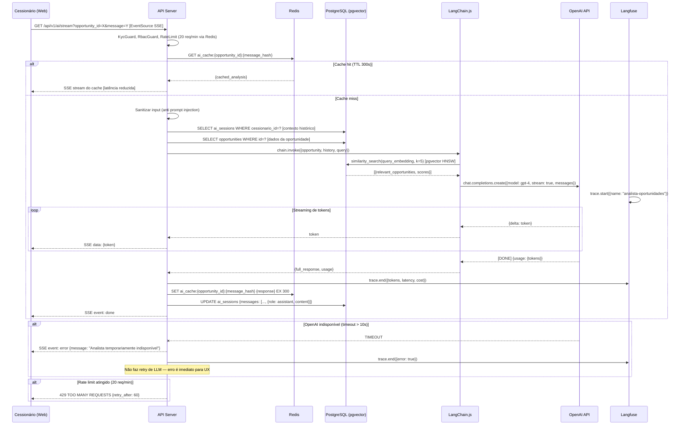
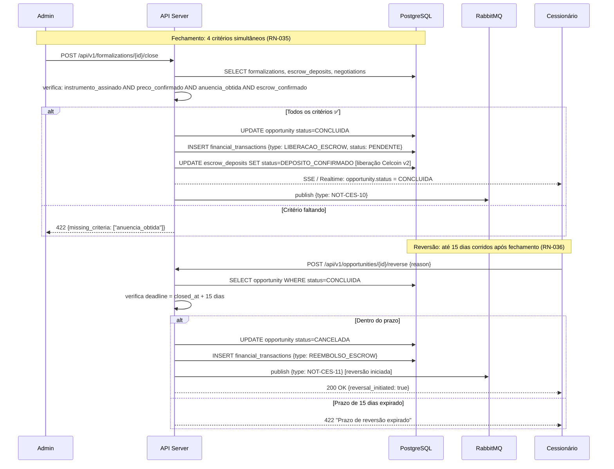

# 14 - Especificações Técnicas

## Módulo Cessionário · Plataforma Repasse Seguro

| **Campo** | **Valor** |
|---|---|
| **Destinatário** | Arquitetura e Engenharia |
| **Escopo** | Arquitetura interna — módulos, fluxos críticos, containers, cache, filas e decisões arquiteturais |
| **Versão** | v1.0 |
| **Responsável** | Claude Code Desktop — Pipeline ShiftLabs v9.5 |
| **Data da versão** | 22/03/2026 00:00 (America/Fortaleza) |
| **Status** | Ativo |
| **Referências** | 01 - Regras de Negócio · 02 - Stacks · 05 - PRD · 06 - Mapa de Telas · 10 - Glossário Técnico · 12 - Modelo de Dados |

---

> 📌 **TL;DR**
>
> - **Padrão arquitetural:** Monorepo Turborepo com 3 workspaces — `apps/web` (SPA React 19 + Vite 7), `apps/api` (NestJS 10 — 8 módulos de domínio), `apps/mobile` (Expo 52 + React Native 0.76). Banco único PostgreSQL 17 via Supabase com Prisma 6.
> - **6 containers principais:** Web SPA, Mobile App, Backend API, PostgreSQL (Supabase), Redis (Upstash), RabbitMQ (CloudAMQP) — mais 6 serviços externos.
> - **7 fluxos críticos documentados** com happy path + cenário de erro: Autenticação JWT, KYC assíncrono, Ciclo de Proposta, Negociação + Escrow, Formalização ZapSign, Fechamento, Analista de IA (RAG + SSE).
> - **Cache Redis (Upstash):** 6 recursos cacheados — sessão, quota de propostas, dados de oportunidade, rate limit KYC, resultado de análise IA, notificações in-app. TTLs de 60s a 24h.
> - **Filas RabbitMQ (CloudAMQP):** 4 exchanges, 7 queues, DLQ em todas, retry com backoff exponencial (3 tentativas em 30 min).
> - **ADRs mais impactantes:** ADR-001 (NestJS monolito modular vs. microserviços), ADR-002 (Supabase Realtime vs. WebSocket próprio), ADR-003 (Confirmação manual do Escrow no MVP), ADR-004 (pgvector vs. Pinecone para RAG).
> - **Zero decisões pendentes** por falta de dado — todas resolvidas com `[DECISÃO AUTÔNOMA]`.

---

## 1. Arquitetura Geral (C4 Nível 1)

### 1.1 Diagrama de Contexto

```mermaid
C4Context
    title Sistema Repasse Seguro — Módulo Cessionário

    Person(cessionario, "Cessionário", "Investidor/comprador de cessões imobiliárias. Acessa via web SPA e app mobile.")
    Person(admin, "Admin", "Operador interno. Gerencia oportunidades, propostas, negociações e formalização.")

    System_Boundary(repasse, "Plataforma Repasse Seguro") {
        System(web, "Web SPA", "React 19 + Vite 7. Interface do Cessionário no navegador.")
        System(mobile, "Mobile App", "Expo 52 + React Native. Interface do Cessionário em iOS/Android.")
        System(api, "Backend API", "NestJS 10. Lógica de negócio, autenticação, integrações.")
        SystemDb(db, "PostgreSQL 17", "Supabase. Dados transacionais, RLS, pgvector.")
        SystemDb(redis, "Redis", "Upstash. Cache, sessões, rate limiting.")
        System(queue, "RabbitMQ", "CloudAMQP. Processamento assíncrono.")
    }

    System_Ext(supabase_auth, "Supabase Auth", "Autenticação, JWT, OAuth Google.")
    System_Ext(supabase_storage, "Supabase Storage", "Documentos KYC, comprovantes Escrow.")
    System_Ext(supabase_realtime, "Supabase Realtime", "Subscriptions de dados em tempo real.")
    System_Ext(zapsign, "ZapSign", "Assinatura digital de documentos de cessão.")
    System_Ext(idwall, "idwall", "KYC: OCR de documentos + liveness detection.")
    System_Ext(resend, "Resend", "E-mail transacional.")
    System_Ext(celcoin, "Celcoin", "Conta Escrow digital.")
    System_Ext(openai, "OpenAI", "GPT-4 + text-embedding-3-small.")
    System_Ext(sentry, "Sentry", "Error tracking.")
    System_Ext(posthog, "PostHog", "Analytics + session replay.")
    System_Ext(langfuse, "Langfuse", "Observabilidade de IA.")

    Rel(cessionario, web, "Usa", "HTTPS")
    Rel(cessionario, mobile, "Usa", "HTTPS")
    Rel(web, api, "API REST", "HTTPS/JSON + SSE")
    Rel(mobile, api, "API REST", "HTTPS/JSON")
    Rel(api, db, "ORM (Prisma)", "PostgreSQL wire")
    Rel(api, redis, "Cache/Rate limit", "Redis protocol")
    Rel(api, queue, "Publica/Consome", "AMQP 0-9-1")
    Rel(api, supabase_auth, "JWT validation", "HTTPS")
    Rel(api, supabase_storage, "Upload/Signed URLs", "HTTPS")
    Rel(web, supabase_realtime, "Subscriptions", "WebSocket")
    Rel(mobile, supabase_realtime, "Subscriptions", "WebSocket")
    Rel(api, zapsign, "REST + Webhook", "HTTPS")
    Rel(api, idwall, "REST + Job async", "HTTPS")
    Rel(api, resend, "SDK", "HTTPS")
    Rel(api, celcoin, "REST", "HTTPS")
    Rel(api, openai, "SDK", "HTTPS")
    Rel(api, langfuse, "SDK", "HTTPS")
    Rel(web, sentry, "Error tracking", "HTTPS")
    Rel(mobile, sentry, "Error tracking", "HTTPS")
    Rel(api, sentry, "Error tracking", "HTTPS")
    Rel(web, posthog, "Analytics", "HTTPS")
    Rel(mobile, posthog, "Analytics", "HTTPS")
    Rel(admin, api, "Admin API", "HTTPS/JSON")
```



### 1.2 Escopo do Sistema

O módulo Cessionário abrange:

- **Frontend Web (SPA):** 100% autenticado. Sem rota pública, sem SSR. React 19 + Vite 7.
- **Frontend Mobile (Expo):** React Native 0.76 + Expo SDK 52. iOS + Android.
- **Backend API (NestJS):** 8 módulos de domínio + módulo de IA + módulos transversais. REST + SSE.
- **Banco de dados (Supabase/PostgreSQL 17):** 13 tabelas, RLS em todas, pgvector para RAG.
- **Cache (Redis/Upstash):** Sessões, rate limiting, resultados de IA, quota de propostas.
- **Filas (RabbitMQ/CloudAMQP):** KYC, notificações, RAG pipeline, ZapSign callbacks.

**Fora do escopo deste documento:**
- Módulo Admin (painel de administração).
- Módulo Cedente.
- Infraestrutura Railway (coberta no D24 - Deploy CI/CD).

---

## 2. Diagrama de Containers (C4 Nível 2)



### 2.1 Detalhamento de Containers

| Container | Tecnologia | Hosting | Responsabilidade |
|---|---|---|---|
| Web SPA | React 19 + Vite 7 | Vercel / Railway static | Interface do Cessionário — 100% autenticada |
| Mobile App | Expo 52 + RN 0.76 | App Store + Google Play | iOS/Android — mesma API do web |
| API Server | NestJS 10 + Node 22 | Railway (auto-scaling) | Lógica de negócio, auth, integrações síncronas |
| Worker KYC | NestJS Consumer | Railway | Processa docs KYC via idwall (assíncrono) |
| Worker Notifications | NestJS Consumer | Railway | Envia e-mails (Resend) + push (Expo) |
| Worker RAG | NestJS Consumer | Railway | Gera embeddings OpenAI + persiste pgvector |
| Worker ZapSign | NestJS Consumer | Railway | Processa webhooks ZapSign |
| PostgreSQL 17 | Supabase | Supabase Cloud | Banco transacional único |
| Redis 7.4 | Upstash serverless | Upstash Cloud | Cache + rate limiting + sessões |
| RabbitMQ 4.x | CloudAMQP | CloudAMQP Cloud | Filas assíncronas com DLQ |
| Supabase Storage | S3-compatible | Supabase Cloud | Armazenamento de arquivos privados |
| Supabase Realtime | Phoenix Channels | Supabase Cloud | Subscriptions WebSocket por tabela |

---

## 3. Estrutura de Módulos do Backend

### 3.1 Organização por Domínio

```
apps/api/src/
├── modules/
│   ├── auth/               # Autenticação e autorização
│   ├── users/              # Usuários e perfis
│   ├── cessionarios/       # Perfil do Cessionário + KYC
│   ├── opportunities/      # Marketplace de oportunidades
│   ├── proposals/          # Propostas e limites
│   ├── negotiations/       # Negociações + contraproposta + Escrow
│   ├── formalizations/     # Formalização + ZapSign
│   ├── financial/          # Transações financeiras
│   ├── notifications/      # Notificações in-app + e-mail + push
│   ├── ai/                 # Analista de Oportunidades (RAG + SSE)
│   └── admin/              # Endpoints admin (fora do escopo Cessionário)
├── common/
│   ├── guards/             # AuthGuard, RbacGuard, KycGuard
│   ├── interceptors/       # LoggingInterceptor, SentryInterceptor
│   ├── decorators/         # @CurrentUser, @Roles, @KycRequired
│   ├── pipes/              # ValidationPipe, ParseUuidPipe
│   ├── filters/            # GlobalExceptionFilter
│   └── dto/                # DTOs compartilhados (pagination, etc.)
├── infrastructure/
│   ├── database/           # PrismaService, PrismaModule
│   ├── redis/              # RedisService, RedisModule
│   ├── rabbitmq/           # RabbitMQService, consumers
│   ├── storage/            # StorageService (Supabase Storage)
│   └── realtime/           # RealtimeService (Supabase Realtime broadcast)
└── main.ts                 # Bootstrap NestJS
```

### 3.2 Padrão por Módulo

Cada módulo de domínio segue o padrão NestJS + Clean Architecture:

```
modules/<dominio>/
├── <dominio>.module.ts         # Imports, providers, exports
├── <dominio>.controller.ts     # HTTP handlers, Swagger decorators
├── <dominio>.service.ts        # Lógica de negócio, orquestra repositório
├── <dominio>.repository.ts     # Acesso ao banco via Prisma
├── dto/
│   ├── create-<dominio>.dto.ts
│   ├── update-<dominio>.dto.ts
│   └── <dominio>-response.dto.ts
├── types/
│   └── <dominio>.types.ts      # Interfaces TypeScript do módulo
└── __tests__/
    ├── <dominio>.service.spec.ts
    └── <dominio>.controller.spec.ts
```

### 3.3 Módulos e Responsabilidades

| Módulo | Controller Prefix | Responsabilidade | Dependências internas |
|---|---|---|---|
| `AuthModule` | `/api/v1/auth` | JWT validation, Supabase Auth, re-auth, CSRF | `UsersModule`, `RedisModule` |
| `UsersModule` | `/api/v1/users` | CRUD de usuários, perfil, anonimização LGPD | `PrismaModule` |
| `CessionariosModule` | `/api/v1/cessionarios` | Perfil Cessionário, KYC upload, status | `StorageModule`, `RabbitMQModule`, `PrismaModule` |
| `OpportunitiesModule` | `/api/v1/opportunities` | Listagem, filtros, detalhe, score IA | `PrismaModule`, `RedisModule`, `AiModule` |
| `ProposalsModule` | `/api/v1/proposals` | CRUD propostas, validação quotas | `PrismaModule`, `RedisModule`, `OpportunitiesModule` |
| `NegotiationsModule` | `/api/v1/negotiations` | Negociação, contraproposta, Escrow | `PrismaModule`, `ProposalsModule`, `NotificationsModule` |
| `FormalizationsModule` | `/api/v1/formalizations` | Formalização, ZapSign, anuência | `PrismaModule`, `RabbitMQModule`, `NotificationsModule` |
| `FinancialModule` | `/api/v1/financial` | Transações, comprovantes, histórico | `PrismaModule`, `StorageModule` |
| `NotificationsModule` | `/api/v1/notifications` | Listagem, leitura, preferências | `PrismaModule`, `RabbitMQModule`, `RedisModule` |
| `AiModule` | `/api/v1/ai` | SSE streaming, análise IA, RAG, score | `PrismaModule`, `RedisModule`, `OpenAI SDK`, `LangChain`, `Langfuse` |

### 3.4 Guards e Autorização

```typescript
// Hierarquia de guards aplicada globalmente na ordem:
// 1. JwtAuthGuard → valida JWT (via Supabase Auth)
// 2. RbacGuard → verifica role (CESSIONARIO | ADMIN)
// 3. KycGuard → verifica KYC_APROVADO para módulos que exigem

// Exemplos de uso:
@UseGuards(JwtAuthGuard, RbacGuard)
@Roles('CESSIONARIO')
@Controller('proposals')
class ProposalsController { ... }

// Decorator @KycRequired aplica KycGuard na action
@KycRequired()
@Post()
async createProposal(@CurrentUser() user: JwtPayload) { ... }
```

---

## 4. Fluxos Internos Críticos

### 4.1 Fluxo de Autenticação JWT



**Cenário de erro: Redis indisponível**



---

### 4.2 Fluxo de KYC (Assíncrono)



---

### 4.3 Fluxo de Criação de Proposta



---

### 4.4 Fluxo de Negociação e Escrow



---

### 4.5 Fluxo de Formalização ZapSign



---

### 4.6 Fluxo do Analista de IA (RAG + SSE Streaming)



---

### 4.7 Fluxo de Fechamento e Reversão



---

## 5. Estratégia de Cache

### 5.1 Tecnologia

Redis 7.4 via **Upstash serverless** em produção. Docker local em desenvolvimento.

Biblioteca: `ioredis` com retry automático (3 tentativas, backoff exponencial) no NestJS via `RedisModule` singleton.

### 5.2 Recursos Cacheados

| Recurso | Chave | TTL | Invalidação | Fallback (miss/indisponível) |
|---|---|---|---|---|
| Sessão de usuário | `session:{user_id}` | 86400s (24h) | Logout, troca de senha, inatividade >2h (`EXPIRE` reset) | Valida JWT via Supabase Auth diretamente |
| Quota propostas simultâneas | `quota:proposals:sim:{cessionario_id}` | 86400s (24h) | Quando proposta é aceita/recusada/expirada (DECR) | Consulta COUNT no DB, penaliza performance |
| Quota propostas diárias | `quota:proposals:daily:{cessionario_id}` | Até meia-noite UTC | Por TTL natural (janela de 24h) | Consulta COUNT no DB |
| Rate limit auth | `auth_failures:{ip}` | 900s (15min) | Por TTL natural | Sem fallback — request prossegue sem rate limit |
| Rate limit LLM | `llm_ratelimit:{cessionario_id}` | 60s (janela 1min) | Por TTL natural | Sem fallback — request prossegue sem rate limit |
| Resultado análise IA | `ai_cache:{opportunity_id}:{msg_hash}` | 300s (5min) | Quando oportunidade é atualizada (DEL padrão) | Consulta LLM diretamente (latência aumenta) |
| Score de risco IA | `ai_risk_score:{opportunity_id}` | 3600s (1h) | Quando oportunidade é atualizada | Consulta DB coluna `ai_risk_score` |
| Dados de oportunidade (listagem) | `opp:list:{filters_hash}:{page}` | 60s | Quando nova oportunidade publicada (DEL padrão) | Consulta DB diretamente |

### 5.3 Regras Gerais de Cache

- **TTL obrigatório** em toda chave — nenhuma chave sem expiração.
- **Namespace por tipo** — prefixo identifica o domínio (`session:`, `quota:`, `ai_cache:`, etc.).
- **Cache indisponível:** fallback para banco em todos os casos. Log de warning + alerta Sentry após 30s de indisponibilidade.
- **Invalidação proativa** via `DEL` ao atualizar entidade base — nunca aguardar TTL para dados críticos de quota.
- **Redis como suporte, banco como fonte de verdade** — nenhuma lógica de negócio dependente exclusivamente do Redis.

---

## 6. Estratégia de Filas

### 6.1 Tecnologia

RabbitMQ 4.x via **CloudAMQP** em produção. Docker local em desenvolvimento.

Biblioteca: `amqplib` com `@nestjs/microservices` no padrão `ClientProxy` para publishers e consumer classes para workers.

### 6.2 Exchanges e Queues

| Exchange | Tipo | Routing Keys | Queues Bind | Propósito |
|---|---|---|---|---|
| `kyc` | `direct` | `kyc.process` | `kyc.process` | Processamento KYC idwall |
| `notifications` | `topic` | `notifications.send.*` | `notifications.email`, `notifications.push` | E-mail Resend + Push Expo |
| `ai` | `direct` | `ai.embed` | `ai.embed` | Geração de embeddings OpenAI |
| `zapsign` | `direct` | `zapsign.webhook` | `zapsign.process` | Callbacks ZapSign |

### 6.3 Configuração de Retry e DLQ

| Queue | Retry máx | Backoff | DLQ | Idempotência |
|---|---|---|---|---|
| `kyc.process` | 3 | 5min, 15min, 30min | `kyc.dlq` | `kyc_document_id` — verifica status antes de processar |
| `notifications.email` | 5 | 1min, 2min, 4min, 8min, 5min | `notifications.email.dlq` | `notification_id` — verifica `sent_at` antes de enviar |
| `notifications.push` | 3 | 1min, 5min, 10min | `notifications.push.dlq` | `notification_id` — idem |
| `ai.embed` | 3 | 2min, 5min, 10min | `ai.embed.dlq` | `opportunity_id + version` — verifica `embedding_updated_at` |
| `zapsign.process` | 3 | 5min, 15min, 30min | `zapsign.dlq` | `zapsign_token + event_type` — verifica status formalization |

### 6.4 Monitoramento de Filas

- **Alertas no RabbitMQ Management:** fila com > 100 mensagens acumuladas → alerta Sentry P2.
- **DLQ não vazia:** alerta Sentry P1 + notificação Slack do time de operações.
- **Métricas via Langfuse** (para `ai.embed`): latência de embedding p50/p95/p99.
- **Healthcheck:** NestJS `@nestjs/terminus` verifica conexão RabbitMQ + Redis no endpoint `/api/health`.

---

## 7. ADRs (Architecture Decision Records)

### 7.1 ADR-001 — Monolito Modular NestJS vs. Microserviços

💡 **Contexto:** o backend do módulo Cessionário tem 8 módulos de domínio + IA + workers. A escolha entre monolito modular e microserviços afeta complexidade operacional, latência inter-serviço e velocidade de desenvolvimento.

**Decisão:** Monolito modular NestJS com workers via RabbitMQ como processos separados apenas para tarefas assíncronas (KYC, RAG, ZapSign, Notifications).

**Alternativas avaliadas:**

| Alternativa | Prós | Contras |
|---|---|---|
| (A) Monolito modular + workers assíncronos | Simples de deployar, sem latência de rede inter-serviço, Railway escala instâncias, workers isolam falhas assíncronas | Módulos compartilham processo — falha crítica afeta tudo |
| (B) Microserviços completos | Isolamento total, escala independente | Overhead operacional alto (service discovery, distributed tracing), incompatível com velocidade de desenvolvimento por IA |

**Justificativa:** o volume de usuários do MVP não justifica a complexidade de microserviços. Módulos NestJS são isolados por injeção de dependências. Workers separados via RabbitMQ garantem que falhas assíncronas (idwall offline, ZapSign lento) não afetam o fluxo síncrono do Cessionário.

**Consequências:** dependência de Railway para escala horizontal da API. Mitigação: Railway auto-scaling configurado por CPU/memória.

---

### 7.2 ADR-002 — Supabase Realtime vs. WebSocket Próprio

💡 **Contexto:** marketplace, negociações e notificações requerem atualizações em tempo real com lag máximo de 60s (SLA definido em D01.3).

**Decisão:** Supabase Realtime (Phoenix Channels) para todas as subscriptions em tempo real.

**Alternativas:**

| Alternativa | Prós | Contras |
|---|---|---|
| (A) Supabase Realtime | Zero infraestrutura adicional, subscriptions filtradas por RLS, SDK JS nativo | Limite de conexões por plano Supabase; não é ideal para mensagens > 1MB |
| (B) WebSocket próprio (Socket.io ou ws) | Controle total, sem limites de plano | Infraestrutura adicional (sticky sessions no Railway), complexidade de autenticação |

**Justificativa:** Supabase Realtime já é infraestrutura existente do banco. RLS garante isolamento por Cessionário sem lógica adicional. SLA de 60s é confortavelmente atendido. Custo zero adicional no plano Pro.

**Consequências:** se Supabase Realtime falhar, frontend faz polling com TanStack Query a cada 30s como fallback.

---

### 7.3 ADR-003 — Escrow MVP com Confirmação Manual vs. Celcoin Automático

💡 **Contexto:** integração Celcoin para conta Escrow digital requer validação de contrato, onboarding e testes com a fintech. Não disponível no prazo do MVP.

**Decisão:** MVP opera com confirmação manual do Escrow pelo Admin. Celcoin automático em v2.

**Alternativas:**

| Alternativa | Prós | Contras |
|---|---|---|
| (A) MVP manual + Celcoin v2 | Lança produto sem bloqueio de integração; workflow bem definido para Admin | Operação manual não escala; risco de erro humano |
| (B) Bloquear lançamento até Celcoin | Operação automatizada desde o início | Atrasa lançamento 2-3 sprints; mais risco de bugs de integração no MVP |

**Justificativa:** velocidade de go-to-market priorizada no MVP. Admin confirma depósitos manualmente. Interface Admin mostra comprovantes enviados pelos Cessionários. V2 migra para Celcoin automático sem breaking change na API (campo `escrow_provider` em `escrow_deposits`).

**Consequências:** SLA de confirmação de Escrow depende de disponibilidade do Admin. Risco mitigado com notificações prioritárias para Admin.

---

### 7.4 ADR-004 — pgvector vs. Pinecone para RAG

💡 **Contexto:** Analista de Oportunidades usa RAG com embeddings de oportunidades. Precisa de vector store para busca por similaridade semântica.

**Decisão:** pgvector no mesmo PostgreSQL 17 (Supabase), índice HNSW, embeddings `text-embedding-3-small` (1536 dimensões).

**Alternativas:**

| Alternativa | Prós | Contras |
|---|---|---|
| (A) pgvector (PostgreSQL Supabase) | Zero infraestrutura adicional, transações ACID com dados relacionais, queries JOIN entre vetores e tabelas | Performance inferior ao Pinecone para bilhões de vetores |
| (B) Pinecone | Performance excelente, totalmente gerenciado, API simples | Custo adicional, dados duplicados entre Postgres e Pinecone, sem JOINs |

**Justificativa:** o volume de oportunidades no MVP/v1 é de centenas a poucos milhares — pgvector com HNSW atende com latência < 200ms. Sem necessidade de escala Pinecone. Integração no mesmo banco elimina sincronização de dados. Pode migrar para Pinecone com ADR se volume ultrapassar 1M de vetores.

**Consequências:** monitorar latência de busca vetorial via Langfuse. Se p99 > 500ms com HNSW, reavaliar Pinecone.

---

### 7.5 ADR-005 — TanStack Router vs. React Router v7

💡 **Contexto:** roteamento do SPA web com suporte a type-safe routes, loaders e integração com TanStack Query.

**Decisão:** TanStack Router 1.x com type-safe routes.

**Alternativas:**

| Alternativa | Prós | Contras |
|---|---|---|
| (A) TanStack Router | Type-safe routes nativos, integração nativa com TanStack Query (loaders), tree-shaking superior | API mais verbosa que React Router |
| (B) React Router v7 | Mais maduro, maior ecosistema | Type-safety menos rigoroso, integração com TanStack Query requer mais boilerplate |

**Justificativa:** product completamente autenticado sem SSR — TanStack Router é a escolha padrão do ShiftLabs Stacks v7.0 para apps React + Vite. Type-safe routes eliminam bugs de navegação. Loaders integram nativamente com TanStack Query.

---

## 8. Requisitos Não-Funcionais

### 8.1 Performance

| Métrica | Target | Monitoramento |
|---|---|---|
| Latência API p50 | < 150ms | Sentry Performance |
| Latência API p95 | < 500ms | Sentry Performance |
| Latência API p99 | < 2000ms | Sentry Performance |
| Streaming IA p50 (first token) | < 5s | Langfuse |
| Streaming IA comparativo p50 | < 10s | Langfuse |
| Dashboard update (Realtime) | < 60s (SLA) | Supabase Realtime metrics |
| Bundle JS web (gzipped) | < 300KB | CI check Vite build |
| KYC processing (SLA) | < 5min | Worker metric + Langfuse |

### 8.2 Escalabilidade

- **Backend (Railway):** escala horizontal por CPU > 70% ou latência p95 > 1s. Mínimo 2 instâncias em produção (HA).
- **Workers:** escala independente via Railway — worker KYC e worker RAG escalam por tamanho de fila.
- **PostgreSQL (Supabase):** read replicas via Supabase Pro para queries de leitura pesada (listagem marketplace, histórico financeiro).
- **Redis (Upstash):** serverless — sem necessidade de provisionar capacidade.
- **RabbitMQ (CloudAMQP):** plano que suporta 100 conexões simultâneas e 10k mensagens/s.

### 8.3 Disponibilidade

| Componente | SLA target | Estratégia de HA |
|---|---|---|
| API Server | 99.5% | Mínimo 2 instâncias Railway + health checks |
| PostgreSQL | 99.9% | Supabase SLA (Multi-AZ) |
| Redis | 99.9% | Upstash serverless (gerenciado) |
| RabbitMQ | 99.5% | CloudAMQP HA pair |
| Supabase Realtime | 99.5% | Supabase SLA |

**Degradação graceful:** se Supabase Realtime falhar → frontend usa TanStack Query polling (30s). Se Redis falhar → JWT validado diretamente via Supabase Auth. Se RabbitMQ falhar → e-mails síncronos via Resend como fallback para notificações críticas.

### 8.4 Segurança

| Requisito | Implementação | RN |
|---|---|---|
| Autenticação | JWT Supabase Auth, access token 15-30min, refresh token httpOnly cookie / expo-secure-store | RN-001 a RN-005 |
| RBAC | Guards NestJS por role (CESSIONARIO / ADMIN) | RN-013 |
| RLS | Row Level Security em todas as tabelas Supabase por `cessionario_id` | RN-068 |
| Anonimização Cedente | Nenhum campo do Cedente retornado em endpoints do Cessionário | RN-014, RN-067 |
| Re-autenticação | Modal de senha para ações críticas (proposta, cancelamento, LGPD) | RN-005, RN-070 |
| CSRF | `@nestjs/csrf` em endpoints mutáveis (POST/PUT/DELETE) | RN-013 |
| Rate limiting | `@nestjs/throttler` — auth: 10 req/15min por IP; LLM: 20 req/min por usuário | RN-020, RN-021 |
| HTTPS | TLS 1.3 obrigatório em todos os containers | RNF-009 |
| Headers de segurança | `helmet` middleware (CSP, HSTS, X-Frame-Options) | RNF-009 |
| Input sanitization | `class-validator` + `class-transformer` em DTOs; sanitização antes de prompts LLM | RN-049 |
| service_role key | Nunca exposta no frontend — apenas no backend NestJS | RN-068 |
| Signed URLs | Documentos KYC e Escrow acessados apenas via signed URL temporária (Supabase Storage) | RN-033 |
| Logs de auditoria | Tabela `audit_logs` com actor, action, entity, timestamp para todas as mutations | RN-013 |

---

## 9. Changelog

| Data | Versão | Descrição |
|---|---|---|
| 22/03/2026 | v1.0 | Criação inicial — Pipeline ShiftLabs v9.5. Diagramas C4 L1 e L2, 8 módulos de domínio, 7 fluxos críticos com happy path + erro, cache Redis completo (8 recursos), filas RabbitMQ (4 exchanges, 7 queues, DLQ em todas), 5 ADRs, RNFs completos. |

---

## 10. Backlog de Pendências

| Item | Tipo | Seção | Impacto | Justificativa / Decisão | Dono | Status |
|---|---|---|---|---|---|---|
| Monolito modular + workers assíncronos vs. microserviços | Decisão Autônoma | ADR-001 | P1 | Volume MVP não justifica microserviços; Railway escala monolito horizontalmente; workers isolados via RabbitMQ | Tech Lead | Decidido |
| Supabase Realtime como solução de tempo real | Decisão Autônoma | ADR-002 | P1 | Infraestrutura já existente; RLS garante isolamento; SLA 60s atendido; fallback polling via TanStack Query | Tech Lead | Decidido |
| Escrow MVP com confirmação manual do Admin | Decisão Autônoma | ADR-003 | P0 | Celcoin não disponível no prazo do MVP; workflow manual documentado; v2 migra sem breaking change | Tech Lead | Decidido |
| pgvector HNSW para RAG vs. Pinecone | Decisão Autônoma | ADR-004 | P1 | Volume MVP < 100k vetores; pgvector atende com latência < 200ms; sem custo adicional | Tech Lead | Decidido |
| TanStack Router vs. React Router v7 | Decisão Autônoma | ADR-005 | P2 | Padrão ShiftLabs Stacks v7.0 para SPA React + Vite; type-safe routes; integração nativa TanStack Query | Tech Lead | Decidido |
| Redis como fallback: validar JWT diretamente se Redis indisponível | Decisão Autônoma | §4.1 | P1 | Disponibilidade > consistência de cache; autenticação não pode falhar por Redis offline; alternativa descartada: 503 | Tech Lead | Decidido |
| Rate limit LLM: 20 req/min por usuário | Decisão Autônoma | §5.2 | P2 | Baseado em custo OpenAI estimado; balanceia UX e custo; threshold configurável no Langfuse | Tech Lead | Decidido |
