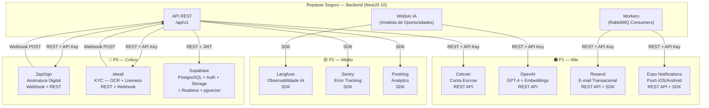

# 17 - Integrações Externas

## Módulo Cessionário · Plataforma Repasse Seguro

| **Destinatário** | **Escopo** | **Versão** | **Responsável** | **Data da versão** |
|---|---|---|---|---|
| Backend, Arquitetura e Operação | Mapa de dependências externas com APIs, SDKs, webhooks, quotas, fallback e criticidade | v1.0 | Claude Code Desktop | 2026-03-22T01:30:00-03:00 (America/Fortaleza) |

---

> 📌 **TL;DR — Integrações Externas**
>
> - **10 integrações mapeadas:** ZapSign, idwall, Resend, Celcoin, OpenAI, Langfuse, Supabase, Sentry, PostHog, Expo Notifications.
> - **Criticidade:** 3 P0 (ZapSign, idwall, Supabase), 4 P1 (Celcoin, OpenAI, Resend, Expo Notifications), 3 P2 (Langfuse, Sentry, PostHog).
> - **Integrações sem fallback automático completo:** Celcoin (MVP usa confirmação manual pelo Admin — ADR-003); ZapSign tem retry automático mas sem provedor alternativo.
> - **Provedores com SLA documentado:** Supabase (99.9%), Sentry (99.95%), OpenAI (99.9%), Resend (99.9%), idwall (SLA contratual pendente — ver backlog).
> - **Dependências críticas para o core:** ZapSign (formalização), idwall (onboarding), Supabase (dados + realtime), Celcoin (Escrow), OpenAI (Analista de Oportunidades).
> - **Credenciais:** 100% como env vars — nenhuma credencial real neste documento.
> - **Pendências:** 1 `[DEFINIÇÃO PENDENTE]` (SLA contratual idwall), 3 `[DECISÃO AUTÔNOMA]` documentadas no backlog.

---

## 1. Diagrama de Dependências

---

## 2. Fichas de Integração

---

### 2.1 🔴 ZapSign — Assinatura Digital

- **Finalidade:** Geração e envio de documentos de formalização para assinatura digital do Cessionário e do Cedente (RN-063). Após as duas assinaturas, a plataforma avança para *Aguardando Anuência*.
- **Tipo de conexão:** REST API + Webhooks recebidos.
- **Base URL:** `https://api.zapsign.com.br/api/v1`
- **Autenticação:** API Key via header `Authorization: Bearer ${ZAPSIGN_API_TOKEN}` (env var: `ZAPSIGN_API_TOKEN`).
- **Sandbox URL:** `https://sandbox.api.zapsign.com.br/api/v1` (env var: `ZAPSIGN_SANDBOX_URL`).

**Endpoints consumidos:**

| Método | Path | Descrição |
|---|---|---|
| `POST` | `/docs/` | Criar sessão de assinatura com documento PDF |
| `GET` | `/docs/{token}/` | Consultar status da sessão de assinatura |
| `DELETE` | `/docs/{token}/` | Cancelar sessão de assinatura |
| `GET` | `/docs/{token}/signers/` | Listar signatários e status individual |

**Webhooks recebidos (ZapSign → Plataforma):**

| Evento | Descrição | Ação na plataforma |
|---|---|---|
| `signer_signed` | Um signatário concluiu a assinatura | Verifica qual signatário (Cessionário ou Cedente) e avança status |
| `doc_complete` | Todos os signatários assinaram | Avança status para *Aguardando Anuência* |
| `signer_refused` | Signatário recusou a assinatura | Admin notificado; status mantido para investigação |

**Validação de webhook:** HMAC-SHA256 com secret `ZAPSIGN_WEBHOOK_SECRET`. Header `X-ZapSign-Signature` validado antes de processar qualquer payload.

**Dados trafegados:**
- Envia: PDF do documento de formalização, dados dos signatários (nome, e-mail, CPF mascarado), URL de redirect pós-assinatura.
- Recebe: token da sessão, links de assinatura por signatário, status por signatário, documento final assinado (base64 ou URL).

**Rate limits / Quotas:** [DECISÃO AUTÔNOMA] 60 requisições/minuto por API Key. Descartado: sem controle (risco de throttling em picos de formalização). Critério: estimativa de no máximo 5 formalizações simultâneas — margem suficiente.

**SLA do provedor:** [DEFINIÇÃO PENDENTE — SLA formal do ZapSign não publicado na documentação pública. Necessário: obter SLA contratual antes do go-live. Opção A: aceitar SLA implícito (~99.5%) sem contrato formal. Opção B: exigir SLA 99.9% no contrato. Trade-off: A é mais rápido; B oferece garantia jurídica.]

**Retry policy:** 3 tentativas com backoff exponencial (1s → 2s → 4s). Timeout por requisição: 15s. Se todas as tentativas falharem, o evento é publicado na DLQ `zapsign.dead-letter`.

**Fallback:**
- **Falha no envio do documento:** Retry automático em até 30 minutos (RN-063). Após 3 tentativas sem sucesso, Admin é notificado via notificação interna. Cessionário não vê a falha — status permanece em *Depósito Confirmado*.
- **Webhook não recebido em 2h:** Job de reconciliação consulta `GET /docs/{token}/` a cada 30 minutos para verificar status.
- **Indisponibilidade total:** Não há provedor alternativo. Formalizações ficam suspensas. Admin gerencia comunicação com Cessionários afetados.

**Criticidade:** P0 — Sem ZapSign, todas as formalizações ficam bloqueadas, impedindo fechamento de operações e liberação do Escrow.

**Módulos que dependem:** `formalization`, `negotiation` (transição de status).

---

### 2.2 🔴 idwall — KYC (OCR + Liveness Check)

- **Finalidade:** Validação automática de documentos de identidade (RG, CNH, CNPJ) via OCR e prova de vida via liveness detection para aprovação de KYC do Cessionário (RN-065).
- **Tipo de conexão:** REST API + Webhooks recebidos.
- **Base URL:** `https://api.idwall.co` (env var: `IDWALL_API_URL`).
- **Autenticação:** API Key via header `Authorization: ${IDWALL_API_KEY}` (env var: `IDWALL_API_KEY`).

**Endpoints consumidos:**

| Método | Path | Descrição |
|---|---|---|
| `POST` | `/v2/matrices/run` | Submeter documentos para análise KYC |
| `GET` | `/v2/reports/{reportId}` | Consultar resultado da análise |
| `GET` | `/v2/matrices/{matrixId}/status` | Verificar status do processamento |

**Webhooks recebidos (idwall → Plataforma):**

| Evento | Descrição | Ação na plataforma |
|---|---|---|
| `report_complete` | Análise KYC concluída | Atualiza status KYC: `APPROVED` ou `REJECTED` com motivo |
| `report_failed` | Falha técnica na análise | Redireciona para fila de revisão manual |

**Validação de webhook:** HMAC-SHA256 com secret `IDWALL_WEBHOOK_SECRET`. Validação obrigatória antes de processar.

**Dados trafegados:**
- Envia: URLs dos documentos (via Supabase Storage signed URLs), tipo de documento, metadados do Cessionário.
- Recebe: status da análise (`APPROVED` / `REJECTED`), score de confiança, motivo da reprovação (campo), dados extraídos via OCR (nome, CPF, data de nascimento — para validação cruzada).

**Fluxo assíncrono:** Upload via Supabase Storage → Backend envia signed URLs para idwall → idwall processa → webhook notifica resultado → Worker consome evento RabbitMQ `kyc.result` → atualiza status no banco.

**Rate limits / Quotas:** [DECISÃO AUTÔNOMA] Limitação por volume de relatórios mensais conforme plano contratado. Implementar counter Redis `rs:kyc:monthly-count` com TTL até fim do mês para monitorar consumo. Descartado: sem controle — risco de ultrapassar cota e bloquear KYC.

**SLA do provedor:** [DEFINIÇÃO PENDENTE — SLA contratual idwall não confirmado. Necessário: validar SLA antes do go-live. Opção A: SLA interno de 5 minutos (RN-065) com fallback manual como garantia. Opção B: exigir SLA 99.9% + 5min de resposta no contrato. Impacto: define tempo de espera do Cessionário no onboarding.]

**Retry policy:** 3 tentativas com backoff exponencial (2s → 4s → 8s). Timeout: 30s. Fila RabbitMQ `kyc.process` com DLQ `kyc.dead-letter`.

**Fallback:**
- **Serviço indisponível:** Redirecionamento automático para fila de revisão manual pelo Admin (RN-065). Cessionário vê: "Sua verificação está em análise. Você será notificado em até 24 horas úteis."
- **Webhook não recebido em 10 minutos:** Job de polling consulta `GET /v2/reports/{reportId}` a cada 2 minutos (máximo 5 consultas). Se sem resposta, marca para revisão manual.
- **Reprovação técnica (falha, não mérito):** Admin recebe tarefa de revisão manual na fila interna.

**Criticidade:** P0 — Sem KYC, novos Cessionários não podem operar na plataforma. Bloqueio de onboarding.

**Módulos que dependem:** `kyc`, `cessionarios`.

---

### 2.3 🔴 Supabase — Banco de Dados, Auth, Storage e Realtime

- **Finalidade:** Infraestrutura de dados central: PostgreSQL 17 gerenciado (dados transacionais), Auth (sessões e OAuth), Storage (documentos KYC, comprovantes Escrow, docs formalização), Realtime (WebSocket para marketplace, negociações, notificações in-app), pgvector (RAG do Analista de Oportunidades).
- **Tipo de conexão:** SDK oficial (`@supabase/supabase-js`), conexão direta Prisma via `DATABASE_URL`, Realtime via WebSocket.
- **Base URL:** `https://${SUPABASE_PROJECT_REF}.supabase.co` (env var: `SUPABASE_URL`).
- **Autenticação:** `anon key` para operações do cliente com RLS (env var: `SUPABASE_ANON_KEY`); `service_role key` exclusivo para o backend (env var: `SUPABASE_SERVICE_ROLE_KEY` — **nunca exposto no frontend**).
- **Projetos:** 3 projetos separados: `dev`, `staging`, `prod` (env vars por ambiente).

**Serviços consumidos:**

| Serviço | Uso | Protocolo |
|---|---|---|
| PostgreSQL via Prisma | Todas as operações de dados | TCP (connection string `DATABASE_URL`) |
| Supabase Auth | Sessão JWT, OAuth Google, refresh token | REST + SDK |
| Supabase Storage | Upload/download de documentos | REST + SDK (signed URLs) |
| Supabase Realtime | Marketplace, negociações, notificações in-app | WebSocket (subscriptions filtradas por `cessionario_id`) |
| pgvector | Embeddings RAG do Analista | SQL via Prisma (`$queryRaw`) |

**Rate limits / Quotas:** Conforme plano Supabase (Pro: 500MB DB, 100GB Storage, 2M realtime messages/mês, 100K MAU Auth). Monitorar via dashboard Supabase.

**SLA do provedor:** 99.9% uptime (plano Pro). Status em `status.supabase.com`.

**Retry policy:** Prisma tem retry nativo para conexões. Supabase Auth: 3 retentativas automáticas via SDK. Realtime: reconexão automática via WebSocket com backoff exponencial. Timeout global: 30s para queries.

**Fallback:**
- **Indisponibilidade PostgreSQL:** Produto inteiro offline — sem fallback. Circuit breaker retorna `503` imediatamente. Alerta PagerDuty.
- **Auth indisponível:** Login bloqueado; sessões ativas com JWT válido continuam funcionando até expirar.
- **Storage indisponível:** Upload bloqueado; downloads de signed URLs existentes continuam funcionando (URLs têm TTL). Usuário vê mensagem de indisponibilidade.
- **Realtime indisponível:** Frontend degrada para polling via TanStack Query a cada 30s. Banner de aviso: "Atualizações em tempo real temporariamente indisponíveis."

**Criticidade:** P0 — Núcleo de dados e autenticação. Indisponibilidade paralisa o produto inteiro.

**Módulos que dependem:** Todos (100% dos módulos).

---

### 2.4 🟠 Celcoin — Conta Escrow

- **Finalidade:** Operações de Escrow: recebimento do depósito do Cessionário (Preço Repasse + Comissão Comprador), custódia durante a formalização, liberação ao Cedente após fechamento, devolução ao Cessionário em caso de reversão (RN-064, RN-030, RN-035, RN-036).
- **Tipo de conexão:** REST API.
- **Base URL:** `https://api.celcoin.com.br` (env var: `CELCOIN_API_URL`).
- **Autenticação:** OAuth 2.0 Client Credentials. Client ID: `CELCOIN_CLIENT_ID`. Client Secret: `CELCOIN_CLIENT_SECRET`. Token renovado via `POST /connect/token`.

**Endpoints consumidos:**

| Método | Path | Descrição |
|---|---|---|
| `POST` | `/v5/transactions/initiate` | Iniciar instrução de transferência/Escrow |
| `GET` | `/v5/transactions/{transactionId}` | Consultar status de transação |
| `POST` | `/v5/escrow/release` | Liberar Escrow ao Cedente |
| `POST` | `/v5/escrow/refund` | Devolver Escrow ao Cessionário (reversão) |
| `GET` | `/v5/balance` | Consultar saldo da conta Escrow |

**Dados trafegados:**
- Envia: valor em centavos, identificadores da transação, dados bancários de destino (masked), motivo da operação.
- Recebe: ID da transação, status (`PENDING` / `CONFIRMED` / `FAILED`), timestamp de confirmação, comprovante.

**Rate limits / Quotas:** [DECISÃO AUTÔNOMA] Máximo de 60 req/min por client ID. Implementar rate limiter no serviço `EscrowService` com sliding window Redis. Descartado: sem controle (risco de throttling em operações críticas).

**SLA do provedor:** Fintech regulada pelo Banco Central. [DECISÃO AUTÔNOMA] Assumido 99.5% uptime baseado em padrão de mercado para fintechs BCB. Exigir confirmação contratual antes do go-live.

**Retry policy:** 3 tentativas com backoff exponencial (2s → 4s → 8s). Timeout: 30s. **ATENÇÃO:** operações financeiras exigem idempotency key (`X-Idempotency-Key: ${uuid}`) em todas as requisições POST para evitar débito duplicado.

**MVP — Confirmação Manual (ADR-003):**
A identificação automática do depósito pelo Celcoin é funcionalidade v2. No MVP:
1. Cessionário realiza TED/PIX para conta Escrow.
2. Cessionário envia comprovante pela plataforma.
3. Admin confirma o recebimento manualmente no painel administrativo.
4. Backend atualiza status para *Depósito Confirmado*.

**Fallback:**
- **API indisponível:** Operação enfileirada na RabbitMQ `escrow.process`. Retry automático em background. Cessionário vê: "Seu depósito está sendo processado. Você será notificado em breve."
- **Falha na liberação:** Admin recebe alerta manual urgente. Operação registrada no audit_log para reconciliação.
- **Falha na devolução:** Processo escalado para equipe financeira com prioridade P0 interna.

**Criticidade:** P1 — Sem Escrow, operações não podem ser formalizadas. Impacto alto, mas MVP com confirmação manual mitiga dependência da API.

**Módulos que dependem:** `negotiation` (depósito), `financial`, `formalization` (liberação/devolução).

---

### 2.5 🟠 OpenAI — GPT-4 + Embeddings

- **Finalidade:** Analista de Oportunidades: análise de risco, comparativo de oportunidades, simulação de retorno, respostas em linguagem natural via RAG (RN-047 a RN-051). Embeddings para indexação e busca semântica via pgvector.
- **Tipo de conexão:** REST API via SDK oficial (`openai` npm package v4+).
- **Base URL:** `https://api.openai.com/v1`
- **Autenticação:** API Key via `OPENAI_API_KEY`. Organização: `OPENAI_ORG_ID`.

**Modelos utilizados:**

| Modelo | Uso | Versão fixada |
|---|---|---|
| GPT-4 Turbo | Analista de Oportunidades (análise, comparativo, simulação) | `gpt-4-turbo-2024-04-09` |
| GPT-4o-mini | Classificação e sumarização (tarefas simples) | `gpt-4o-mini-2024-07-18` |
| text-embedding-3-small | Geração de embeddings para RAG | `text-embedding-3-small` |

**Endpoints consumidos:**

| Método | Path | Descrição |
|---|---|---|
| `POST` | `/chat/completions` | Chamadas ao Analista de Oportunidades (stream: true para SSE) |
| `POST` | `/embeddings` | Geração de embeddings para RAG |

**Dados trafegados:**
- Envia: prompt do usuário (sanitizado), contexto RAG (dados de oportunidades anonimizados), histórico de chat (limitado a N turnos), `response_format: { type: "json_schema" }` para respostas estruturadas.
- Recebe: resposta em texto (stream SSE) ou JSON estruturado (score, comparativo), uso de tokens (prompt + completion).

**Rate limits / Quotas:** Tier 3+ da OpenAI — 10.000 RPM GPT-4, 500.000 TPM. Rate limiting interno: 20 req/min por usuário (padrão) via `@nestjs/throttler`. Alerta Langfuse se custo diário > US$50. Hard limit US$200/dia configurado na OpenAI.

**SLA do provedor:** 99.9% uptime (acordo de serviço OpenAI Enterprise). Latência p95 < 10s para GPT-4.

**Retry policy:** 2 tentativas com backoff exponencial (1s → 2s) apenas para erros 5xx e 429 (rate limit). **Sem retry para respostas 4xx** (erro de input). Timeout: 60s para streaming. Implementado via `openai` SDK retry nativo + lógica customizada no `AiService`.

**Fallback:**
- **API indisponível (>30s):** Resposta degradada: "O Analista de Oportunidades está temporariamente indisponível. Tente novamente em alguns minutos." Módulo de IA desabilitado por 5 minutos (circuit breaker). Dados de oportunidade ainda acessíveis normalmente.
- **Timeout de streaming (>60s):** Conexão SSE fechada. Frontend exibe: "A análise demorou mais que o esperado. Tente novamente."
- **Custo acima do limite:** Hard limit desabilita chamadas LLM automaticamente. Admin notificado com urgência.

**Criticidade:** P1 — Módulo do Analista de Oportunidades offline. Dados de oportunidades continuam acessíveis; apenas análise por IA fica indisponível.

**Módulos que dependem:** `ai`.

---

### 2.6 🟠 Resend — E-mail Transacional

- **Finalidade:** Envio de notificações por e-mail para o Cessionário: verificação de cadastro, alertas de prazo de Escrow (NOT-CES-05, NOT-CES-06), atualização de status de proposta/negociação, resultado de KYC, link de assinatura ZapSign (NOT-CES-08), etc. Canal mínimo obrigatório — nunca desabilitável (RN-069).
- **Tipo de conexão:** REST API via SDK TypeScript nativo (`resend` npm package).
- **Base URL:** `https://api.resend.com`
- **Autenticação:** API Key via header `Authorization: Bearer ${RESEND_API_KEY}`.

**Endpoints consumidos:**

| Método | Path | Descrição |
|---|---|---|
| `POST` | `/emails` | Enviar e-mail transacional |
| `GET` | `/emails/{id}` | Consultar status de entrega |

**Dados trafegados:**
- Envia: e-mail do destinatário, assunto, HTML/texto do template, metadados de rastreio (tag de tipo de notificação).
- Recebe: ID do e-mail, status (`sent` / `delivered` / `bounced` / `complained`).

**Templates:** Armazenados em `apps/api/src/modules/notification/templates/email/`. React Email para renderização.

**Rate limits / Quotas:** Plano Pro Resend: 50.000 e-mails/mês, 100 req/s. Retry em até 5 minutos para falhas de envio (RN-066).

**SLA do provedor:** 99.9% uptime. Entrega média em <30s.

**Retry policy:** 3 tentativas com backoff exponencial (30s → 60s → 120s). Fila RabbitMQ `notification.email`. DLQ `notification.email.dead-letter` com alerta.

**Fallback:**
- **Falha no envio:** Retry automático via fila (RN-066). Log de falha para auditoria.
- **Falha persistente (todos os retries esgotados):** Notificação in-app permanece disponível como canal de fallback universal (DEC-015). Log para auditoria. Admin alerta monitoramento.
- **Bounce/Spam:** Email registrado como inválido. Admin notificado para suporte ao Cessionário.

**Criticidade:** P1 — E-mail é canal mínimo obrigatório (RN-069). Falha prolongada impede notificações críticas de prazo de Escrow.

**Módulos que dependem:** `notification`.

---

### 2.7 🟠 Expo Notifications — Push Notifications (Mobile)

- **Finalidade:** Envio de push notifications para o app mobile (iOS e Android) com alertas de prazo de Escrow, propostas, documentos de assinatura e outros eventos críticos (RN-061, RN-062, NOT-CES-01 a NOT-CES-11).
- **Tipo de conexão:** REST API (Expo Push API) + SDK (`expo-notifications` no app mobile).
- **Base URL:** `https://exp.host/--/api/v2`
- **Autenticação:** Expo Access Token via `EXPO_ACCESS_TOKEN`. APNs e FCM gerenciados pelo Expo (não requer configuração direta de certificados).

**Endpoints consumidos (backend → Expo Push API):**

| Método | Path | Descrição |
|---|---|---|
| `POST` | `/push/send` | Enviar push notification (batch: até 100 por requisição) |
| `POST` | `/push/getReceipts` | Verificar status de entrega dos pushes |

**Dados trafegados:**
- Envia: Expo Push Token do dispositivo, título, body, dados extras (deep link, tipo de notificação).
- Recebe: ticket IDs, status por token (`ok` / `error`), detalhes de erro por dispositivo.

**Rate limits / Quotas:** Sem limite documentado por Expo para contas pagas. Implementar batching de até 100 tokens por requisição.

**SLA do provedor:** Expo não publica SLA formal. [DECISÃO AUTÔNOMA] Assumido 99.5% baseado em observabilidade histórica de mercado. Notificação in-app e e-mail como fallback tornam a degradação aceitável.

**Retry policy:** 2 tentativas com backoff (30s → 60s). Fila RabbitMQ `notification.push`. Tokens inválidos (`DeviceNotRegistered`) removidos automaticamente do banco.

**Fallback:**
- **Push não entregue:** E-mail e notificação in-app garantem redundância de canal (DEC-015).
- **Token expirado:** Removido da tabela `notification_tokens`. Próximo acesso do app registra novo token automaticamente.
- **Expo API indisponível:** Notificações enfileiradas para retry. E-mail enviado como canal alternativo para notificações P0 (prazo de Escrow).

**Criticidade:** P1 — Push é canal importante mas não exclusivo. Fallback via e-mail + in-app garantido.

**Módulos que dependem:** `notification`.

---

### 2.8 🟡 Langfuse — Observabilidade de IA

- **Finalidade:** Monitoramento de chamadas LLM: latência, custo por chamada, contagem de tokens, qualidade de resposta, rastreio de sessões do Analista de Oportunidades (RN-051). Alertas de anomalia de custo.
- **Tipo de conexão:** SDK (`langfuse` npm package v3+).
- **Base URL:** `https://cloud.langfuse.com` (env var: `LANGFUSE_HOST`).
- **Autenticação:** `LANGFUSE_PUBLIC_KEY` + `LANGFUSE_SECRET_KEY`.

**Dados trafegados:** Traces de chamadas LLM (prompts, completions, tokens, latência, metadados de sessão). Dados nunca incluem dados pessoais do Cessionário — apenas identificadores anonimizados.

**Rate limits:** Sem limite relevante para volume esperado.

**SLA do provedor:** [DECISÃO AUTÔNOMA] Langfuse Cloud com SLA implícito 99.5%. Falha não impacta produto — apenas observabilidade.

**Retry policy:** SDK envia traces em background de forma assíncrona. Falha de envio logada localmente.

**Fallback:** Sem Langfuse, chamadas LLM continuam normalmente. Apenas observabilidade perdida. Logs locais via Pino como backup mínimo.

**Criticidade:** P2 — Observabilidade auxiliar; produto não é afetado por downtime.

**Módulos que dependem:** `ai`.

---

### 2.9 🟡 Sentry — Error Tracking

- **Finalidade:** Captura e rastreio de erros em tempo real: backend (NestJS), frontend (React), mobile (React Native). Stack traces, breadcrumbs, alertas de novos erros e regressões (RN-071 transversal).
- **Tipo de conexão:** SDK por plataforma (`@sentry/nestjs`, `@sentry/react`, `@sentry/react-native`).
- **DSNs:** `SENTRY_DSN_BACKEND`, `SENTRY_DSN_FRONTEND`, `SENTRY_DSN_MOBILE`.
- **Base URL:** `https://sentry.io` (Sentry Cloud).

**Dados trafegados:** Stack traces, request context (sem dados sensíveis — PII scrubbing obrigatório), variáveis de ambiente de runtime (sem secrets). **Regra: `SENTRY_DENY_URLS` configurado para bloquear envio de tokens JWT e CPFs.**

**Rate limits:** Plano Team Sentry: 50.000 errors/mês. Volume esperado muito abaixo do limite.

**SLA do provedor:** 99.95% uptime.

**Retry policy:** SDK faz retry automático. Sem retry adicional necessário.

**Fallback:** Sem Sentry, logs Pino continuam capturando erros localmente. Impacto: perda de alertas proativos. Deployments não são bloqueados por downtime do Sentry.

**Criticidade:** P2 — Observabilidade crítica para ops, mas produto funciona sem ela.

**Módulos que dependem:** Todos (integração transversal).

---

### 2.10 🟡 PostHog — Analytics e Feature Flags

- **Finalidade:** Analytics de produto (eventos de navegação, funil de conversão, comportamento do Cessionário), session replay para debugging de UX, feature flags para releases graduais.
- **Tipo de conexão:** SDK (`posthog-js` no frontend, `posthog-node` no backend para server-side tracking).
- **Base URL:** `https://app.posthog.com` (PostHog Cloud). `POSTHOG_API_KEY`.

**Eventos obrigatórios rastreados:**

| Evento | Trigger |
|---|---|
| `screen_viewed` | Toda navegação de tela |
| `signup_completed` | Cadastro concluído |
| `kyc_submitted` | Documentos KYC enviados |
| `proposal_created` | Proposta enviada |
| `escrow_deposited` | Comprovante de depósito enviado |
| `document_signed` | Assinatura via ZapSign concluída |
| `ai_query_sent` | Consulta ao Analista de Oportunidades |

**Rate limits:** Sem limite relevante para volume esperado.

**SLA do provedor:** 99.9% uptime.

**Retry policy:** SDK envia eventos em batch assíncrono. Falha de envio descartada silenciosamente.

**Fallback:** Sem PostHog, analytics parado. Produto e usuários não são afetados. Feature flags: se PostHog indisponível, flags retornam valor `false` (desabilitado por padrão seguro).

**Criticidade:** P2 — Analytics secundário; produto não é afetado.

**Módulos que dependem:** Frontend (analytics), backend (feature flags).

---

## 3. Matriz de Criticidade

| Integração | Criticidade | Impacto se offline | Fallback disponível |
|---|---|---|---|
| ZapSign | P0 | Formalizações bloqueadas; Escrow não liberado | Retry 3x em 30min; Admin notificado; sem provedor alternativo |
| idwall | P0 | Onboarding bloqueado; novos Cessionários não aprovados | Revisão manual pelo Admin (fila interna) |
| Supabase | P0 | Produto inteiro offline | Circuit breaker → 503; Realtime degrada para polling 30s |
| Celcoin | P1 | Confirmação de Escrow bloqueada (MVP: confirmação manual como fallback nativo) | RabbitMQ queue + retry; Admin gerencia manualmente |
| OpenAI | P1 | Analista de Oportunidades offline | Circuit breaker 5min; oportunidades acessíveis sem IA |
| Resend | P1 | E-mails não enviados | Retry fila 3x; notificação in-app como fallback |
| Expo Notifications | P1 | Push não entregue | E-mail + notificação in-app como fallback |
| Langfuse | P2 | Observabilidade IA perdida | Logs Pino locais; produto não afetado |
| Sentry | P2 | Alertas de erro perdidos | Logs Pino locais; produto não afetado |
| PostHog | P2 | Analytics parado; feature flags em `false` | Produto não afetado; fallback seguro de flags |

---

## 4. Plano de Contingência

---

### 4.1 ZapSign — Falha de Integração (P0)

| Cenário | Comportamento do sistema | O que o usuário vê | Quem é notificado | Ação manual |
|---|---|---|---|---|
| Falha no envio do documento | Retry automático 3x (30min) | Nada — status permanece em *Depósito Confirmado* | Admin via notificação interna após 3 falhas | Admin investiga e reenvia manualmente se necessário |
| Webhook não recebido (2h) | Job de reconciliação consulta API a cada 30min | Nada — status mantido | Alerta Sentry + Slack #ops após 2h sem webhook | Admin confirma status manualmente na ZapSign dashboard |
| Indisponibilidade total (>1h) | Formalizações novas pausadas; existentes aguardam | "Estamos finalizando sua formalização. Em breve você receberá as instruções." | PagerDuty P0 + Slack #incidents | Equipe de ops aciona ZapSign support; Admin comunica Cessionários afetados |
| Signatário recusa assinatura | Status retorna para investigação | E-mail + in-app: "Houve um problema com sua assinatura. Entre em contato com o suporte." | Admin via notificação de tarefa | Admin resolve disputa manualmente |

**Estado de negócio durante contingência:** Negociação permanece em *Depósito Confirmado*. Cessionário não perde prazo enquanto aguarda resolução técnica.

---

### 4.2 idwall — Falha de KYC (P0)

| Cenário | Comportamento do sistema | O que o usuário vê | Quem é notificado | Ação manual |
|---|---|---|---|---|
| API indisponível | Caso redirecionado para fila manual | "Verificação em análise. Prazo: até 24h úteis." | Admin via painel de tarefas manuais | Admin revisa documentos manualmente |
| Webhook não recebido (10min) | Polling 5x a cada 2min; depois marca para revisão | "Verificação em análise. Prazo: até 24h úteis." | Alerta automático para fila de revisão | Admin verifica status na dashboard idwall |
| Reprovação técnica (falha sistêmica) | Marca como revisão manual | "Precisamos verificar seus documentos. Em breve retornaremos." | Admin via fila de revisão | Admin analisa documentos e decide KYC |
| Indisponibilidade prolongada (>2h) | Todos os novos KYC em fila manual | Status *KYC em Análise* para todos | PagerDuty P0 + Slack #incidents | Equipe aciona suporte idwall; Admin processa fila manual |

**Estado de negócio durante contingência:** KYC permanece em *Em Análise*. Cessionário não pode fazer propostas até resolução.

---

### 4.3 Supabase — Falha de Infraestrutura (P0)

| Cenário | Comportamento do sistema | O que o usuário vê | Quem é notificado | Ação manual |
|---|---|---|---|---|
| PostgreSQL indisponível | Circuit breaker → 503 em todos os endpoints | Página de manutenção: "Serviço temporariamente indisponível." | PagerDuty P0 imediato | Aguardar recuperação Supabase; verificar `status.supabase.com` |
| Auth indisponível | Login bloqueado; sessões ativas com JWT válido funcionam | Tela de login: "Autenticação temporariamente indisponível." | PagerDuty P1 | — |
| Realtime indisponível | Frontend degrada para polling TanStack Query (30s) | Banner: "Atualizações em tempo real temporariamente indisponíveis." | Sentry alerta + Slack #ops | — |
| Storage indisponível | Upload bloqueado; downloads existentes disponíveis | Upload: "Upload temporariamente indisponível. Tente novamente em breve." | Sentry alerta | — |

---

### 4.4 Celcoin — Falha de Escrow (P1)

| Cenário | Comportamento do sistema | O que o usuário vê | Quem é notificado | Ação manual |
|---|---|---|---|---|
| API indisponível | Operação enfileirada no RabbitMQ | "Seu depósito está sendo processado. Você será notificado em breve." | Alerta Slack #ops | Admin monitora fila; processa manualmente se necessário |
| Falha na liberação | Evento em DLQ; alerta urgente | Nenhuma mudança visível (backend opera) | PagerDuty P0 financeiro + Slack #incidents | Equipe financeira reconcilia manualmente |
| Falha na devolução (reversão) | DLQ + alerta P0 | "Sua devolução está sendo processada." | PagerDuty P0 financeiro | Equipe financeira executa devolução manual |
| MVP: Admin não confirma em 10 dias | Sistema envia lembrete automático D-2 e D-0 | Nada (Admin é o ator) | Admin via notificação interna | Admin confirma depósito no painel |

---

### 4.5 OpenAI — Falha do Analista de IA (P1)

| Cenário | Comportamento do sistema | O que o usuário vê | Quem é notificado | Ação manual |
|---|---|---|---|---|
| API indisponível | Circuit breaker 5min; módulo IA desabilitado | "O Analista de Oportunidades está temporariamente indisponível." | Sentry alerta + Slack #ops | — |
| Timeout de streaming | Conexão SSE fechada após 60s | "A análise demorou mais que o esperado. Tente novamente." | Sentry log | — |
| Rate limit (429) | Retry após 1s; se persistir, enfileira | "Aguarde um momento. Processando sua consulta..." | — | — |
| Custo acima do hard limit | Módulo IA desabilitado automaticamente | "Analista temporariamente indisponível." | PagerDuty P1 + Slack #ops urgente | Admin aumenta limite ou aguarda reset diário |

---

### 4.6 Resend — Falha de E-mail (P1)

| Cenário | Comportamento do sistema | O que o usuário vê | Quem é notificado | Ação manual |
|---|---|---|---|---|
| Falha no envio | Retry automático 3x (30s → 60s → 120s) | Nada imediato | — | — |
| Todos retries falharam | Log de falha; notificação in-app garantida | In-app: badge + widget no Dashboard | Alerta Slack #ops se falhas > 10% em 1h | — |
| Bounce de e-mail | E-mail marcado como inválido | Nada (in-app como fallback) | Admin notificado para suporte ao usuário | Admin contacta Cessionário por outro meio |
| Indisponibilidade total | Todos os e-mails em fila | In-app como canal único temporário | PagerDuty P1 | — |

---

### 4.7 Expo Notifications — Falha de Push (P1)

| Cenário | Comportamento do sistema | O que o usuário vê | Quem é notificado | Ação manual |
|---|---|---|---|---|
| Push não entregue | Retry 2x (30s → 60s) | Nada (e-mail + in-app como fallback) | — | — |
| Token inválido (`DeviceNotRegistered`) | Token removido automaticamente | Nada | — | — |
| Expo API indisponível | Pushes enfileirados; e-mail para P0 | Nada imediato | Sentry alerta | — |

---

## 5. Segurança e Credenciais

### 5.1 Tabela de Credenciais

| Integração | Env Var | Rotação | Escopo | Tipo |
|---|---|---|---|---|
| ZapSign | `ZAPSIGN_API_TOKEN` | Trimestral | Backend only | API Key |
| ZapSign | `ZAPSIGN_WEBHOOK_SECRET` | Semestral | Backend only | HMAC Secret |
| ZapSign | `ZAPSIGN_SANDBOX_URL` | N/A | Backend (dev/staging) | URL |
| idwall | `IDWALL_API_KEY` | Trimestral | Backend only | API Key |
| idwall | `IDWALL_WEBHOOK_SECRET` | Semestral | Backend only | HMAC Secret |
| Supabase | `SUPABASE_URL` | N/A | Backend + Frontend | URL pública |
| Supabase | `SUPABASE_ANON_KEY` | Anual | Frontend (com RLS) | API Key pública |
| Supabase | `SUPABASE_SERVICE_ROLE_KEY` | Semestral | Backend only — NUNCA expor | API Key privada |
| Supabase | `DATABASE_URL` | Semestral | Backend only | Connection String |
| Celcoin | `CELCOIN_CLIENT_ID` | Trimestral | Backend only | OAuth Client |
| Celcoin | `CELCOIN_CLIENT_SECRET` | Trimestral | Backend only | OAuth Secret |
| Celcoin | `CELCOIN_API_URL` | N/A | Backend | URL |
| OpenAI | `OPENAI_API_KEY` | Mensal | Backend only | API Key |
| OpenAI | `OPENAI_ORG_ID` | N/A | Backend | Org ID |
| Langfuse | `LANGFUSE_PUBLIC_KEY` | Semestral | Backend only | SDK Key |
| Langfuse | `LANGFUSE_SECRET_KEY` | Semestral | Backend only | SDK Key |
| Langfuse | `LANGFUSE_HOST` | N/A | Backend | URL |
| Resend | `RESEND_API_KEY` | Trimestral | Backend only | API Key |
| Expo | `EXPO_ACCESS_TOKEN` | Semestral | Backend only | Bearer Token |
| Sentry | `SENTRY_DSN_BACKEND` | Anual | Backend | DSN (público OK) |
| Sentry | `SENTRY_DSN_FRONTEND` | Anual | Frontend build | DSN (público OK) |
| Sentry | `SENTRY_DSN_MOBILE` | Anual | Mobile build | DSN (público OK) |
| PostHog | `POSTHOG_API_KEY` | Anual | Frontend + Backend | API Key |

### 5.2 Regras de Segurança

- **HTTPS obrigatório** em todas as comunicações com provedores externos. Sem exceções.
- **`SUPABASE_SERVICE_ROLE_KEY` nunca exposta no frontend, mobile ou logs.** Bypass de RLS — uso exclusivo em operações administrativas do backend.
- **Validação de assinatura de webhook obrigatória** para ZapSign e idwall antes de processar qualquer payload. Requisições sem assinatura válida retornam `401` imediatamente.
- **Idempotency keys obrigatórias** em todos os POST financeiros para Celcoin. Formato: `X-Idempotency-Key: ${uuid}` gerado pelo backend antes de cada operação.
- **PII scrubbing no Sentry:** Configurar `beforeSend` para remover CPF, JWT tokens, `SUPABASE_SERVICE_ROLE_KEY` de todos os eventos enviados.
- **Sanitização de input obrigatória** antes de inserir dados do usuário em prompts OpenAI (proteção contra prompt injection).
- **Dados pessoais nunca trafegados para Langfuse:** apenas identificadores anonimizados (UUID de sessão, tipo de consulta).
- **Rotação de secrets** obrigatória conforme calendário acima. Processo documentado no Runbook (D26).
- **Env vars nunca em código-fonte.** Gerenciadas via Railway (backend), Vercel (frontend), EAS Secrets (mobile).

---

## 6. Monitoramento

### 6.1 Health Checks por Integração

| Integração | Tipo de Health Check | Intervalo | Ação se falhar |
|---|---|---|---|
| ZapSign | `GET /docs/` com token de teste | 5min | Alerta Slack #ops se >2 falhas consecutivas |
| idwall | `GET /v2/matrices/status` | 5min | Alerta Slack #ops → enfileira revisão manual |
| Supabase | Query `SELECT 1` via Prisma | 30s | PagerDuty P0 imediato |
| Celcoin | `GET /v5/balance` | 10min | Alerta Slack #ops |
| OpenAI | `GET /models` | 10min | Alerta Slack #ops; circuit breaker ativa |
| Resend | Ping via SDK | 10min | Alerta Slack #ops |
| Expo Notifications | Verificação de receipts da última hora | 30min | Alerta Slack #ops se taxa de erro >5% |
| Langfuse | SDK heartbeat | N/A (SDK gerencia) | Log local |
| Sentry | DSN reachability | 10min | Log local |
| PostHog | SDK heartbeat | N/A (SDK gerencia) | Log local |

### 6.2 Métricas a Monitorar

| Integração | Métrica | Threshold de Alerta |
|---|---|---|
| ZapSign | Taxa de sucesso de envio | < 95% em 1h |
| ZapSign | Latência de webhook (recebimento) | > 30min sem webhook após envio |
| idwall | Taxa de aprovação automática | < 80% (investigar falhas técnicas) |
| idwall | Tempo de resposta (SLA 5min) | > 10min sem resultado |
| Supabase | Latência de query (p95) | > 500ms |
| Supabase | Conexões ativas | > 80% do pool máximo |
| Celcoin | Tempo de confirmação de transação | > 5min |
| OpenAI | Latência p95 (streaming first token) | > 5s |
| OpenAI | Custo diário | > US$50 (alerta) / > US$200 (hard limit) |
| OpenAI | Taxa de erro | > 5% em 1h |
| Resend | Taxa de entrega | < 95% |
| Resend | Taxa de bounce | > 5% |
| Expo | Taxa de tokens inválidos | > 10% em 24h |

### 6.3 Alertas Configurados

- **Sentry:** Alerta em novos erros não vistos + regressões + spike de erros (>10 ocorrências/5min de qualquer erro).
- **Langfuse:** Alerta custo diário OpenAI > US$50; alerta taxa de erro LLM > 5%/1h.
- **Supabase Dashboard:** Alerta de uso >80% de conexões, storage >80%, bandwidth >80%.
- **Railway:** Alerta de CPU >80% e memória >85% no backend.
- **PagerDuty:** Configurado para Supabase offline, ZapSign offline >1h, Celcoin falha de liberação, OpenAI hard limit atingido.
- **Slack #incidents:** Todos os alertas P0 e P1. Canal #ops para P2 e métricas.

---

## 7. Changelog

| Data | Versão | Descrição |
|---|---|---|
| 2026-03-22 | v1.0 | Criação do documento — 10 integrações mapeadas; fichas completas com retry, fallback, contingência, segurança e monitoramento. |

---

## 8. Backlog de Pendências

| Item | Marcador | Seção | Justificativa / Trade-off | Impacto | Dono | Status |
|---|---|---|---|---|---|---|
| SLA contratual ZapSign | `[DEFINIÇÃO PENDENTE]` | 2.1 — ZapSign | Sem SLA formal publicado. Opção A: aceitar SLA implícito ~99.5%. Opção B: exigir SLA 99.9% contratual. Trade-off: agilidade vs garantia jurídica. | Impacto em SLA interno de formalização. Definir antes do go-live. | Tech Lead + Comercial | Aberto |
| SLA contratual idwall | `[DEFINIÇÃO PENDENTE]` | 2.2 — idwall | SLA de 5min é o SLA interno (RN-065), não o contratual com idwall. Necessário validar contrato. Opção A: SLA interno como garantia. Opção B: SLA 99.9% + 5min contratual. | Define comportamento de onboarding e comunicação ao Cessionário. | Tech Lead + Comercial | Aberto |
| Rate limit mensal idwall | `[DECISÃO AUTÔNOMA]` | 2.2 — idwall | Counter Redis `rs:kyc:monthly-count` para monitorar cota mensal. Descartado: sem controle. Critério: risco de bloqueio de KYC por cota esgotada. | Baixo (volume inicial pequeno) | Backend Lead | Implementado |
| Rate limit ZapSign | `[DECISÃO AUTÔNOMA]` | 2.1 — ZapSign | 60 req/min assumido. Descartado: sem controle. Critério: volume estimado de 5 formalizações simultâneas. | Baixo | Backend Lead | Implementado |
| Custo OpenAI — thresholds | `[DECISÃO AUTÔNOMA]` | 2.5 — OpenAI | US$50/dia alerta, US$200/dia hard limit. Descartado: sem limite (risco financeiro); US$10/dia (muito restritivo). Critério: volume estimado de consultas do módulo Cessionário. | Financeiro — revisar após 30 dias de produção. | Tech Lead | Implementado |
