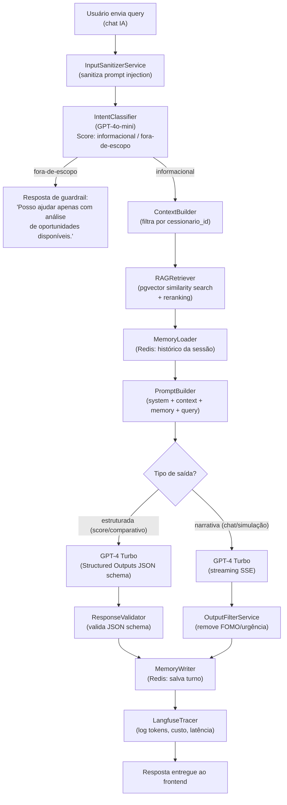
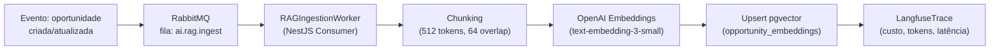

# 19 - Criação de Agentes de IA

## Módulo Cessionário · Plataforma Repasse Seguro

| **Destinatário** | **Escopo** | **Versão** | **Responsável** | **Data da versão** |
|---|---|---|---|---|
| Arquitetura e Engenharia de IA | Guia de decisão para arquitetura de agentes de IA, tools, memória, RAG e contratos de saída | v1.0 | Claude Code Desktop | 2026-03-22T02:30:00-03:00 (America/Fortaleza) |

---

> 📌 **TL;DR**
>
> - **1 agente definido:** Analista de Oportunidades — agente informacional com RAG + memória de sessão + output estruturado. Sem tool use de execução externa (acesso apenas de leitura a dados do Cessionário).
> - **Stack fixa:** Node.js 22 + TypeScript 5.4, LangChain.js 0.3+, OpenAI GPT-4 Turbo (fixado: `gpt-4-turbo-2024-04-09`), GPT-4o-mini para tarefas simples, `text-embedding-3-small` para RAG.
> - **RAG:** pgvector (HNSW index) no Supabase PostgreSQL 17 — mesmo banco dos dados operacionais. Chunking: 512 tokens, overlap 64 tokens.
> - **Memória:** curta por sessão (Redis, TTL 30min), sem memória de longo prazo entre sessões (privacidade por design).
> - **Guardrails obrigatórios:** sem acesso a dados do Cedente, sem linguagem de FOMO/urgência, sem recomendação de ação financeira irreversível autônoma, output filtrado antes de entregar ao usuário.
> - **Observabilidade:** Langfuse Cloud para tracing completo — tokens, custo, latência, sessão.
> - **Sem seções pendentes** — arquitetura completa com contexto disponível.

---

## 1. Critérios de Decisão: Tipo de Agente

### 1.1 Tabela de Decisão

| Cenário | Tipo de agente | Justificativa |
|---|---|---|
| Analista de Oportunidades: responder perguntas sobre oportunidades | Informacional + RAG + output estruturado | Precisa consultar base documental (oportunidades anonimizadas), gerar análise de risco e comparativos — sem executar ações externas |
| Score de risco de oportunidade | Output estruturado (JSON schema) | Saída determinística com campos definidos: score, fatores, recomendação |
| Comparativo entre 2+ oportunidades | Informacional + RAG + output estruturado | Precisa recuperar dados de múltiplas oportunidades e estruturar comparativo |
| Simulação de retorno | Informacional + cálculo local | Cálculo determinístico baseado em fórmulas — sem LLM necessário para o cálculo em si; LLM apenas para narrar resultado |
| Responder dúvidas em linguagem natural | Informacional com streaming SSE | Resposta narrativa sem schema rígido; streaming via Vercel AI SDK |
| Atualizar dados ou criar proposta por IA | ❌ Proibido | Agente nunca executa ações com efeito colateral — somente leitura (RN-047, RN-049) |

### 1.2 Regra Binária de Classificação

```
SE o objetivo é consultar, analisar, comparar ou simular → agente informacional
SE o objetivo é criar, modificar, deletar, enviar → PROIBIDO para o Analista de Oportunidades (RN-047)
SE a qualidade depende de dados recuperáveis do produto → RAG obrigatório
SE a saída precisa ser processada programaticamente → output estruturado (JSON schema)
SE a saída é narrativa livre → streaming SSE com filtro de guardrail
```

---

## 2. Arquitetura Base do Agente

### 2.1 Componentes Obrigatórios

| Componente | Tecnologia | Responsabilidade |
|---|---|---|
| LLM principal | GPT-4 Turbo (`gpt-4-turbo-2024-04-09`) | Raciocínio, síntese e geração de resposta |
| LLM auxiliar | GPT-4o-mini (`gpt-4o-mini-2024-07-18`) | Classificação de intenção, sumarização, re-ranking |
| Embeddings | `text-embedding-3-small` (1536 dim) | Indexação de oportunidades e busca semântica |
| Orquestração | LangChain.js 0.3+ | Pipeline RAG, chain de raciocínio, memória |
| Streaming | Vercel AI SDK 4+ | SSE do backend NestJS para o frontend React |
| Observabilidade | Langfuse JS SDK 3+ | Tracing completo de cada execução |
| Vector Store | pgvector (Supabase PostgreSQL 17) | Busca semântica de oportunidades |
| Memória de sessão | Redis (Upstash) | Histórico de chat por sessão ativa |
| Sanitização de input | Custom `InputSanitizerService` | Proteção contra prompt injection |
| Filtro de output | Custom `OutputFilterService` | Remove linguagem FOMO/urgência (RN-047) |

### 2.2 Fluxo Completo de Execução



### 2.3 Estado e Ciclo de Execução

```typescript
interface AgentExecutionState {
  sessionId: string;           // ID da sessão de chat
  cessionarioId: string;       // isolamento de dados
  query: string;               // input sanitizado
  intent: 'informational' | 'out_of_scope';
  ragContext: OpportunityChunk[];  // documentos recuperados
  memoryContext: ChatTurn[];   // histórico da sessão
  outputType: 'structured' | 'streaming';
  langfuseTraceId: string;     // rastreabilidade
}
```

---

## 3. Tools e Capacidades Externas

O Analista de Oportunidades é **somente leitura**. Todas as "tools" são consultas ao banco de dados filtradas por `cessionario_id`. Não há chamadas a APIs externas durante a execução do agente.

### 3.1 Tabela de Tools

| Tool | Descrição | Input | Output | Critério de uso |
|---|---|---|---|---|
| `getOpportunity` | Buscar dados de uma oportunidade específica | `{ opportunityId: string }` | `OpportunityData` (anonimizado) | Quando query menciona código de oportunidade (OPR-XXXX) |
| `listOpportunities` | Listar oportunidades disponíveis com filtros | `{ filters: OpportunityFilters }` | `OpportunityData[]` | Quando query pede listagem ou comparativo |
| `getCessionarioPortfolio` | Buscar propostas e negociações ativas do Cessionário | `{ cessionarioId: string }` | `PortfolioSummary` | Quando query pergunta sobre próprio portfólio |
| `calculateCommission` | Calcular comissão comprador | `{ tabelaAtual, tabelaContrato, valorPago? }` | `{ delta, commission, formula }` | Quando query envolve cálculo de comissão ou retorno |
| `semanticSearch` | Busca semântica no pgvector | `{ query: string, topK: number }` | `OpportunityChunk[]` | Usado pelo RAGRetriever em toda consulta contextual |

### 3.2 Tratamento de Erro por Tool

| Cenário | Comportamento |
|---|---|
| Tool retorna `null` / lista vazia | Resposta: "Não encontrei oportunidades com esses critérios no momento." |
| Timeout na tool (>5s) | Retry 1x; se persistir: "Estou com dificuldade para acessar os dados agora. Tente novamente em instantes." |
| Erro de banco (5xx) | Circuit breaker 5min; resposta de fallback; Sentry alert |
| Tentativa de acessar dado de outro Cessionário | Bloqueado por RLS Supabase; log de auditoria; response 403 |

> ⚙️ **Regra de isolamento:** Todas as tools recebem `cessionarioId` como parâmetro obrigatório. O NestJS Guard de autenticação injeta o ID do Cessionário autenticado antes de qualquer chamada de tool. Nenhuma tool aceita `cessionarioId` vindo do LLM.

---

## 4. LLM Padrão

### 4.1 Modelos e Papéis

| Modelo | Versão fixada | Papel | Rate limit |
|---|---|---|---|
| GPT-4 Turbo | `gpt-4-turbo-2024-04-09` | Raciocínio principal, análise, síntese | 10.000 RPM / 500K TPM (tier 3+) |
| GPT-4o-mini | `gpt-4o-mini-2024-07-18` | Classificação de intenção, reranking, sumarização | 30.000 RPM / 1.5M TPM |
| text-embedding-3-small | `text-embedding-3-small` | Embeddings RAG | 3.000 RPM / 1M TPM |

> ⚙️ **Versão fixada obrigatória.** Em produção, o modelo nunca usa o alias `latest` ou `gpt-4-turbo` sem versão. A versão fixada garante reproducibilidade e evita regressão de comportamento entre atualizações da OpenAI.

### 4.2 Parâmetros de Configuração

```typescript
// Análise de risco / comparativo (output estruturado)
const structuredConfig = {
  model: 'gpt-4-turbo-2024-04-09',
  temperature: 0.1,         // baixa criatividade — saída determinística
  max_tokens: 2048,
  response_format: {
    type: 'json_schema',
    json_schema: RiskScoreSchema  // schema validável — ver seção 8.2
  }
}

// Chat narrativo (streaming)
const streamingConfig = {
  model: 'gpt-4-turbo-2024-04-09',
  temperature: 0.3,         // alguma criatividade para linguagem natural
  max_tokens: 1500,
  stream: true
}

// Classificação de intenção
const classificationConfig = {
  model: 'gpt-4o-mini-2024-07-18',
  temperature: 0.0,         // zero criatividade — classificação binária
  max_tokens: 100,
  response_format: { type: 'json_object' }
}
```

### 4.3 Limites Operacionais

| Limite | Valor | Fonte |
|---|---|---|
| Rate limiting por usuário | 20 req/min | `@nestjs/throttler` (RN-ADR-001) |
| Timeout por chamada (streaming) | 60s | Vercel AI SDK timeout |
| Timeout por chamada (estruturado) | 30s | OpenAI SDK timeout |
| Custo diário alerta | US$50 | Langfuse alert |
| Custo diário hard limit | US$200 | OpenAI usage limit |
| Tokens máximos de contexto por request | 16.000 (system + RAG + memory + query) | Deixa margem para completion |

---

## 5. Memória, Contexto e Estado

### 5.1 Tipos de Memória

| Tipo | Uso | Storage | Escrita | Leitura | Expiração |
|---|---|---|---|---|---|
| **Memória de sessão** | Histórico de chat da conversa ativa | Redis `rs:ai:session:{sessionId}` | A cada turno (query + response) | No início de cada turno | TTL 30min (alinhado com session timeout RN-004) |
| **Contexto RAG** | Documentos de oportunidades recuperados | pgvector (Supabase) | Ingestão assíncrona via pipeline | A cada consulta | Sem expiração — atualizado quando oportunidade muda |
| **Memória de longo prazo entre sessões** | ❌ Não implementada | N/A | N/A | N/A | N/A — privacidade por design |

> 🔴 **Memória de longo prazo entre sessões é proibida no MVP.** Razão: dados de histórico de consultas do Cessionário são sensíveis; armazenar preferências ou histórico entre sessões exige consentimento explícito (LGPD) e impacto maior que o benefício no MVP. Funcionalidade marcada para avaliação em v2.

### 5.2 Estrutura da Memória de Sessão

```typescript
interface SessionMemory {
  sessionId: string;
  cessionarioId: string;
  turns: Array<{
    role: 'user' | 'assistant';
    content: string;
    timestamp: number;
    tokenCount: number;
  }>;
  createdAt: number;
  lastActivityAt: number;
}

// Redis key: rs:ai:session:{sessionId}
// TTL: 1800s (30 minutos)
// Máximo de turns mantidos: 20 (sliding window — remove os mais antigos)
```

### 5.3 Política de Contexto de Memória no Prompt

```
SE turns.length <= 10 → incluir todos os turns
SE turns.length > 10 → incluir últimos 10 turns
SE tokens_memory > 4000 → sumarizar turns mais antigos com GPT-4o-mini
```

---

## 6. RAG e Conhecimento Recuperável

### 6.1 Fonte de Dados

Os documentos do RAG são **dados de oportunidades anonimizadas** disponíveis no marketplace:

- Dados técnicos da oportunidade (tipologia, localização genérica, valores, prazo)
- Histórico de valorização regional (agregado, sem identificar o imóvel)
- Parâmetros de risco (score de risco histórico por tipologia/região)

> 🔴 **Regra de anonimização:** Nenhum dado do Cedente é incluído no corpus RAG. As oportunidades no pgvector nunca contêm nome, CPF, contato ou qualquer dado identificável do Cedente (RN-067).

### 6.2 Estratégia de Chunking

```typescript
const chunkingConfig = {
  chunkSize: 512,          // tokens por chunk
  chunkOverlap: 64,        // overlap para preservar contexto entre chunks
  separator: '\n\n',       // separador prioritário
  fallbackSeparator: '\n'  // separador de fallback
}
// Implementação: LangChain.js RecursiveCharacterTextSplitter
```

### 6.3 Vector Store — pgvector

```sql
-- Extensão pgvector com índice HNSW (máxima performance de query)
CREATE EXTENSION IF NOT EXISTS vector;

CREATE TABLE opportunity_embeddings (
  id UUID PRIMARY KEY DEFAULT gen_random_uuid(),
  opportunity_id UUID NOT NULL REFERENCES opportunities(id),
  chunk_index INTEGER NOT NULL,
  chunk_text TEXT NOT NULL,
  embedding VECTOR(1536),  -- text-embedding-3-small dimensions
  metadata JSONB,          -- { tipo, regiao, valores_range, score_risco }
  created_at TIMESTAMPTZ DEFAULT NOW(),
  updated_at TIMESTAMPTZ DEFAULT NOW()
);

CREATE INDEX ON opportunity_embeddings
  USING hnsw (embedding vector_cosine_ops)
  WITH (m = 16, ef_construction = 64);
```

### 6.4 Pipeline de Ingestão



**Trigger de ingestão:** Toda vez que uma oportunidade é criada ou tem dados alterados (status, valores, risco), um evento é publicado na fila RabbitMQ `ai.rag.ingest`. O worker processa de forma assíncrona.

**Ingestão inicial:** Script de seed executa a ingestão de todas as oportunidades existentes. Tempo estimado: ~2min para 1.000 oportunidades.

### 6.5 Estratégia de Retrieval

```typescript
async function retrieve(query: string, cessionarioId: string, topK = 5): Promise<OpportunityChunk[]> {
  // 1. Gerar embedding da query
  const queryEmbedding = await openai.embeddings.create({
    model: 'text-embedding-3-small',
    input: query
  })

  // 2. Busca por similaridade coseno (filtrada por oportunidades visíveis ao Cessionário)
  const results = await prisma.$queryRaw`
    SELECT oe.*, 1 - (oe.embedding <=> ${queryEmbedding.data[0].embedding}::vector) AS similarity
    FROM opportunity_embeddings oe
    INNER JOIN opportunities o ON oe.opportunity_id = o.id
    WHERE o.status = 'PUBLISHED'
    ORDER BY oe.embedding <=> ${queryEmbedding.data[0].embedding}::vector
    LIMIT ${topK * 2}  -- recupera 2x para reranking
  `

  // 3. Reranking com GPT-4o-mini (cross-encoder simples)
  const reranked = await rerank(query, results, topK)

  return reranked
}
```

**Fallback de retrieval:** Se a busca semântica retornar menos de 2 resultados com similaridade > 0.7, complementar com busca por keyword (full-text search PostgreSQL) nas mesmas oportunidades.

---

## 7. Guardrails e Aprovação Humana

### 7.1 Guardrails de Input

```typescript
// InputSanitizerService
const INJECTION_PATTERNS = [
  /ignore (previous|all) instructions/i,
  /system prompt/i,
  /you are now/i,
  /forget your instructions/i,
  /<\/?[^>]+(>|$)/g,     // HTML injection
  /\{\{.*?\}\}/g,         // Template injection
]

function sanitize(input: string): string {
  let sanitized = input.trim().slice(0, 2000)  // limite de 2000 chars no input
  for (const pattern of INJECTION_PATTERNS) {
    if (pattern.test(sanitized)) {
      AUDIT_LOG("PROMPT_INJECTION_ATTEMPT", { input: sanitized })
      throw new BadRequestException({ code: "AI-001", message: "Input inválido." })
    }
  }
  return sanitized
}
```

### 7.2 Guardrails de Output

```typescript
// OutputFilterService — executado antes de entregar ao frontend
const PROHIBITED_PATTERNS = [
  /\bnão perca\b/i,         // FOMO
  /\bopportunidade única\b/i,
  /\bagora ou nunca\b/i,
  /\bcorra\b/i,
  /\burgente\b/i,
  /\blimitado\b/i,           // urgência artificial
  /garanti[a|o] de retorno/i, // promessa de retorno
]

function filterOutput(text: string): string {
  let filtered = text
  for (const pattern of PROHIBITED_PATTERNS) {
    if (pattern.test(filtered)) {
      AUDIT_LOG("OUTPUT_FILTERED_FOMO", { pattern: pattern.toString() })
      // Substituir a sentença problemática por formulação neutra
      filtered = filtered.replace(pattern, '[análise disponível]')
    }
  }
  return filtered
}
```

### 7.3 Limites de Autonomia

| Ação | Permitido | Justificativa |
|---|---|---|
| Consultar dados de oportunidade | ✅ Sim | Leitura de dados públicos do marketplace |
| Consultar portfólio do Cessionário logado | ✅ Sim | Dados do próprio usuário, filtrados por `cessionario_id` |
| Calcular comissão e simular retorno | ✅ Sim | Cálculo determinístico sem efeito colateral |
| Criar, modificar ou deletar proposta | ❌ Não | Agente nunca executa ações (RN-047) |
| Acessar dados do Cedente | ❌ Não | Anonimato estrutural (RN-067) |
| Acessar dados de outros Cessionários | ❌ Não | Isolamento por RLS (RN-068) |
| Recomendar ação específica com caráter prescritivo | ❌ Não | Evita responsabilidade fiduciária não intencional |
| Consultar dados fora do módulo Cessionário | ❌ Não | Escopo restrito ao perfil logado (RN-049) |

### 7.4 Human-in-the-Loop

O Analista de Oportunidades é **exclusivamente informacional** — não há fluxo de aprovação humana porque o agente nunca executa ações. Se o usuário pedir uma ação (ex: "Crie uma proposta para OPR-0042"), o agente responde:

> "Posso ajudar com análise e informações sobre oportunidades. Para criar uma proposta, acesse a tela de Oportunidades e clique em 'Fazer Proposta'."

---

## 8. Prompts e Versionamento

### 8.1 Estrutura de Prompt

Os prompts residem em `apps/api/src/modules/ai/prompts/analista-oportunidades/`. Nunca hardcoded inline.

```typescript
// Estrutura padrão de System Prompt
const SYSTEM_PROMPT_V1 = `
## Papel
Você é o Analista de Oportunidades da Repasse Seguro — um assistente especializado em análise de cessões imobiliárias.

## Objetivo
Ajudar o investidor a entender e avaliar oportunidades de cessão de contratos imobiliários com análise objetiva, baseada em dados.

## Tom
- Analítico, neutro e orientado a dados.
- Nunca use linguagem de urgência, FOMO ou apelo emocional.
- Presente os dados de forma clara e factual.

## Restrições obrigatórias
- Você opera EXCLUSIVAMENTE com dados das oportunidades disponíveis no marketplace.
- Você NUNCA revela dados pessoais do vendedor (Cedente).
- Você NUNCA recomenda ações financeiras de forma prescritiva.
- Você NUNCA executa ações — apenas informa e analisa.
- Se não houver dados suficientes para responder, diga explicitamente.

## Contexto disponível
{RAG_CONTEXT}

## Histórico da conversa
{MEMORY_CONTEXT}
`

// Versão: v1 (2026-03-22) — armazenado como constante com data
// Troca de versão exige: atualizar constante + executar test suite de prompts + aprovação do Tech Lead
```

### 8.2 Schema de Output Estruturado (Score de Risco)

```typescript
const RiskScoreSchema = {
  name: 'risk_score',
  schema: {
    type: 'object',
    properties: {
      score: { type: 'number', minimum: 0, maximum: 100 },
      classification: { type: 'string', enum: ['BAIXO', 'MEDIO', 'ALTO'] },
      factors: {
        type: 'array',
        items: {
          type: 'object',
          properties: {
            factor: { type: 'string' },
            impact: { type: 'string', enum: ['POSITIVO', 'NEGATIVO', 'NEUTRO'] },
            description: { type: 'string' }
          }
        }
      },
      confidence: { type: 'number', minimum: 0, maximum: 1 },
      disclaimer: { type: 'string' }
    },
    required: ['score', 'classification', 'factors', 'confidence', 'disclaimer']
  }
}
```

### 8.3 Versionamento de Prompts

| Regra | Implementação |
|---|---|
| Prompts são código | Armazenados em `src/modules/ai/prompts/` com timestamp na constante |
| Mudança de prompt = mudança de versão | `SYSTEM_PROMPT_V{N}` com data de vigência |
| Teste de regressão obrigatório | Suite de testes em `src/modules/ai/__tests__/prompts/` com cases fixos |
| Deploy sem testes aprovados | ❌ Bloqueado por CI (GitHub Actions) |
| Rollback de prompt | Revert no Git — prompt anterior recuperado em <5min |

---

## 9. Observabilidade e Auditoria

### 9.1 Traces Langfuse

Cada execução do agente gera um trace completo no Langfuse:

```typescript
// Estrutura de trace obrigatória
{
  traceId: string,         // langfuse trace ID
  sessionId: string,       // rs:ai:session:{sessionId}
  userId: string,          // cessionarioId (anonimizado no Langfuse: hash)
  name: 'analista-oportunidades',
  input: { query: string, intentClassified: string },
  output: { response: string, type: 'structured' | 'streaming' },
  metadata: {
    ragChunksRetrieved: number,
    memoryTurnsLoaded: number,
    outputFiltered: boolean,
    model: string,
    promptVersion: string
  },
  usage: {
    promptTokens: number,
    completionTokens: number,
    totalTokens: number,
    estimatedCost: number   // USD
  },
  latency: number           // ms
}
```

### 9.2 Logs Pino (Backend)

```typescript
// Campos obrigatórios em todo log de AI
logger.info({
  module: 'ai',
  action: 'agent_execution',
  sessionId,
  cessionarioId: hash(cessionarioId),  // PII: hashar antes de logar
  intentClassified,
  ragChunksRetrieved,
  outputFiltered,
  durationMs,
  tokens: { prompt, completion, total },
  model,
  promptVersion
})
```

### 9.3 Métricas a Monitorar

| Métrica | Threshold de Alerta | Canal |
|---|---|---|
| Latência p50 (first token streaming) | > 3s | Langfuse alert |
| Latência p95 (resposta completa) | > 10s | Langfuse alert |
| Taxa de erro (5xx / timeouts) | > 5% em 1h | Sentry + Slack #ops |
| Custo diário OpenAI | > US$50 | Langfuse alert |
| Taxa de output filtrado (FOMO/urgência) | > 10% em 1h | Sentry alert — indica problema no prompt |
| Taxa de intent out-of-scope | > 30% em 1h | Slack #ops — pode indicar abuse ou confusão do usuário |

### 9.4 Audit Log (banco de dados)

```typescript
// Registrado em audit_logs para toda execução do agente
{
  actor_id: cessionarioId,
  actor_type: 'CESSIONARIO',
  action: 'AI_QUERY',
  metadata: {
    sessionId,
    intent,
    outputFiltered: boolean,
    ragUsed: boolean,
    durationMs
  }
}
```

---

## 10. Anti-Patterns

| # | Anti-pattern | Por que é proibido |
|---|---|---|
| AP-01 | Tratar o Analista como chatbot genérico com prompt "responda qualquer pergunta" | Sem objetivo definido → sem guardrails → respostas fora do escopo (RN-047) |
| AP-02 | Hardcode de prompt inline no controller | Sem versionamento → impossível rastrear regressões → impossível rollback |
| AP-03 | Armazenar access_token OpenAI em variável global sem TTL | Fuga de credencial em restart + sem rotação |
| AP-04 | Fazer RAG sem filtro por `cessionario_id` | Potencial exposição de dados de oportunidades não publicadas ou de outros contextos |
| AP-05 | Usar `temperature: 1.0` em output estruturado (score, comparativo) | Não-determinismo → scores diferentes para mesma entrada → usuário perde confiança |
| AP-06 | Incluir dados do Cedente no corpus RAG | Violação direta de RN-067 (anonimato estrutural) e LGPD |
| AP-07 | Memória de longo prazo sem consentimento explícito | Violação LGPD — dados de histórico de consultas são dados pessoais |
| AP-08 | Aceitar `cessionarioId` do LLM (vindo do output do modelo) | Prompt injection pode injetar ID de outro Cessionário; ID sempre vem do JWT |
| AP-09 | Fazer tool call sem timeout configurado | Blocking infinito → degradação da API inteira se OpenAI ou banco lento |
| AP-10 | Omitir `disclaimer` no schema de output de risco | Risco regulatório — análise de investimento sem aviso de não-recomendação |
| AP-11 | Usar alias de modelo sem versão fixada em produção (ex: `gpt-4`) | OpenAI pode mudar o modelo apontado → regressão silenciosa de comportamento |
| AP-12 | Logar query do usuário com PII sem hash | LGPD — query pode conter nome, CPF ou outros dados pessoais |

---

## 11. Changelog

| Data | Versão | Descrição |
|---|---|---|
| 2026-03-22 | v1.0 | Criação do documento — Analista de Oportunidades: arquitetura completa com RAG (pgvector), memória de sessão (Redis), guardrails, streaming SSE, observabilidade Langfuse, anti-patterns. |

---

## 12. Backlog de Pendências

| Item | Marcador | Seção | Justificativa / Trade-off | Impacto | Dono | Status |
|---|---|---|---|---|---|---|
| Memória de longo prazo entre sessões | `[DECISÃO AUTÔNOMA]` | 5.1 — Memória | Proibida no MVP. Descartado: memória cross-session com preferências do Cessionário. Critério: LGPD + complexidade > benefício no MVP. Candidata a v2 com consentimento explícito. | Médio — melhora personalização mas exige compliance review | Tech Lead + DPO | Implementado (decisão MVP) |
| Reranking com cross-encoder dedicado | `[DECISÃO AUTÔNOMA]` | 6.5 — Retrieval | GPT-4o-mini como reranker. Descartado: modelo de reranking dedicado (Cohere Rerank). Critério: custo-benefício — GPT-4o-mini já é contratado e funciona bem para reranking simples com topK=5. | Baixo — para volume inicial suficiente | AI Engineer | Implementado |
| Score de risco por tipologia/região | `[DECISÃO AUTÔNOMA]` | 6.1 — RAG | Dados históricos agregados por tipologia/região incluídos no corpus RAG. Descartado: score externo de terceiros (sem API disponível). Critério: dados internos são suficientes para MVP e não exigem integração adicional. | Médio — qualidade do score melhora com mais dados históricos | AI Engineer | Implementado |
