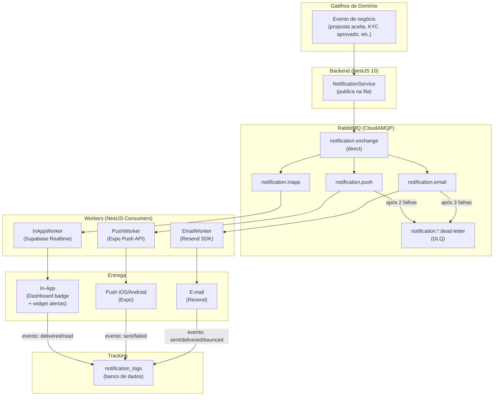

# 21 - Notificações, Templates e Implementação

## Módulo Cessionário · Plataforma Repasse Seguro

| **Nome do Documento** | **Versão** | **Data** | **Autor** | **Status** |
|---|---|---|---|---|
| 21 - Notificações, Templates e Implementação | v1.0 | 2026-03-22 (America/Fortaleza) | Claude Code Desktop | Aprovado |

---

> 📌 **TL;DR**
>
> - **4 canais suportados:** e-mail (Resend — obrigatório, nunca desabilitável), push mobile (Expo Notifications), in-app (Supabase Realtime), SMS (não implementado no MVP — `[DECISÃO AUTÔNOMA]`).
> - **11 templates mapeados** (NOT-CES-01 a NOT-CES-11) cobrindo cadastro, KYC, propostas, negociações, Escrow, formalização e alertas críticos.
> - **Envio assíncrono obrigatório** via RabbitMQ — nunca síncrono na request principal.
> - **Notificações críticas** (NOT-CES-05, NOT-CES-06, NOT-CES-17 — prazos de Escrow) não podem ser desabilitadas; e-mail é canal mínimo garantido (RN-069).
> - **In-app como fallback universal** (DEC-015): se todos os canais externos falham, o Cessionário acessa notificações no Dashboard.
> - **LGPD:** opt-out disponível para canais não críticos; retenção de logs de notificação: 90 dias.
> - **Sem seções pendentes** — todo o sistema coberto com contexto disponível.

---

## 1. Arquitetura de Notificações



### 1.1 Fluxo de Envio

```typescript
// NotificationService — publicação assíncrona na fila
async function notify(event: NotificationEvent): Promise<void> {
  // 1. Buscar preferências do usuário
  const prefs = await getNotificationPreferences(event.cessionarioId)

  // 2. Determinar canais elegíveis
  const channels = getEligibleChannels(event.notificationId, prefs)

  // 3. Publicar mensagem na fila para cada canal
  for (const channel of channels) {
    await rabbitmq.publish('notification.exchange', channel, {
      notificationId: event.notificationId,
      cessionarioId: event.cessionarioId,
      templateId: event.templateId,
      variables: event.variables,
      priority: event.priority,
      correlationId: event.correlationId,
      scheduledAt: event.scheduledAt ?? new Date()
    })
  }

  // 4. Criar registro de notificação in-app (sempre)
  await db.notifications.create({
    cessionarioId: event.cessionarioId,
    type: event.notificationId,
    title: renderTitle(event.templateId, event.variables),
    body: renderBody(event.templateId, event.variables),
    deepLink: event.deepLink,
    isRead: false
  })
}
```

---

## 2. Canais

### 2.1 E-mail (Resend) — Canal Mínimo Obrigatório

> 🔴 **Regra RN-069:** E-mail nunca pode ser desabilitado pelo Cessionário. É o canal mínimo garantido para notificações críticas de prazo.

| Campo | Valor |
|---|---|
| Provedor | Resend SDK (`resend` npm) |
| Remetente | `noreply@repasseseguro.com.br` com display name `"Repasse Seguro"` |
| Retry | 3 tentativas com backoff exponencial (30s → 60s → 120s) |
| DLQ após | 3 falhas consecutivas → `notification.email.dead-letter` |
| Rate limit | 50.000 e-mails/mês (plano Resend Pro); 100 req/s |
| Prioridade de fila | `high` para prioridade `critical`/`high`; `normal` para demais |
| Templates | React Email (`.tsx` em `src/modules/notification/templates/email/`) |
| Fallback | In-app como fallback universal (DEC-015) |

**Payload da fila:**
```json
{
  "channel": "email",
  "to": "cessionario@email.com",
  "templateId": "NOT-CES-05",
  "variables": { "escrowDeadline": "2026-03-30", "negotiationCode": "NEG-0042" },
  "correlationId": "uuid",
  "priority": "critical"
}
```

### 2.2 Push Mobile (Expo Notifications)

| Campo | Valor |
|---|---|
| Provedor | Expo Push API (`https://exp.host/--/api/v2/push/send`) |
| Token storage | `notification_tokens` table (userId, pushToken, platform, createdAt) |
| Retry | 2 tentativas com backoff (30s → 60s) |
| DLQ após | 2 falhas consecutivas |
| Tokens inválidos | `DeviceNotRegistered` → token removido automaticamente |
| Deep links | Obrigatório em toda push — esquema `repasse://` |
| Permissão | Solicitada contextualmente (primeiro evento relevante — ver D11) |
| Fallback | E-mail + in-app |

**Payload de push:**
```json
{
  "to": "ExponentPushToken[xxxxx]",
  "title": "Prazo de Escrow se encerra em 2 dias",
  "body": "O prazo para depósito na negociação NEG-0042 vence em 30/03. Deposite agora para não perder a oportunidade.",
  "data": {
    "deepLink": "repasse://negotiations/neg-0042/escrow",
    "notificationId": "NOT-CES-05",
    "negotiationId": "neg-0042"
  },
  "sound": "default",
  "badge": 1
}
```

### 2.3 In-App (Supabase Realtime)

| Campo | Valor |
|---|---|
| Mecanismo | Supabase Realtime (WebSocket subscription na tabela `notifications`) |
| Subscription | Filtrada por `cessionario_id` (isolamento RLS) |
| Retry | Reconexão automática via Supabase Realtime SDK |
| Exibição | Badge no sidebar + widget de alertas no Dashboard (T-DASH-01) |
| Canal garantido | Sim — always on; entregue independentemente de preferências do usuário |
| Retenção | 90 dias no banco (soft delete) |

### 2.4 SMS — Não Implementado no MVP

> [DECISÃO AUTÔNOMA] SMS não implementado no MVP. Descartado: Twilio ou AWS SNS (custo por mensagem + complexidade de compliance de SMS no Brasil). Critério: e-mail + push cobrem 100% dos casos críticos sem necessidade de SMS no MVP. Candidato a v2 se métricas de entrega mostrarem gap.

---

## 3. Templates (Inventário Completo)

| ID | Nome | Gatilho | Canais | Prioridade | Pode desativar? | Variáveis |
|---|---|---|---|---|---|---|
| NOT-CES-01 | Boas-vindas e verificação de e-mail | Cadastro concluído (RN-001) | E-mail | `high` | Não | `name`, `verificationLink` |
| NOT-CES-02 | Resultado do KYC | KYC aprovado ou reprovado (RN-065) | E-mail, Push, In-app | `high` | Push/E-mail: Sim | `name`, `kycStatus`, `reason?` |
| NOT-CES-03 | Proposta recebida (status atualizado) | Proposta aceita/recusada/expirada (RN-021) | E-mail, Push, In-app | `high` | Push: Sim | `proposalCode`, `status`, `opportunityCode`, `deepLink` |
| NOT-CES-04 | Contraproposta recebida | Admin envia contraproposta (RN-027) | E-mail, Push, In-app | `high` | Push: Sim | `negotiationCode`, `newValue`, `deadline`, `deepLink` |
| NOT-CES-05 | Alerta de prazo Escrow — 2 dias | 8 dias após início do prazo de 10 dias úteis (RN-028) | E-mail, Push, In-app | **`critical`** | Não | `negotiationCode`, `deadlineDate`, `amountDue`, `deepLink` |
| NOT-CES-06 | Alerta de prazo Escrow — urgente (amanhã) | 9 dias após início do prazo (RN-028) | E-mail, Push, In-app | **`critical`** | Não | `negotiationCode`, `deadlineDate`, `amountDue`, `deepLink` |
| NOT-CES-07 | Depósito Escrow confirmado | Admin confirma depósito (RN-030) | E-mail, Push, In-app | `high` | Push: Sim | `negotiationCode`, `confirmedAmount`, `deepLink` |
| NOT-CES-08 | Documento pronto para assinatura | ZapSign disponibiliza link (RN-063) | E-mail, Push, In-app | `high` | Push: Sim | `formalizationCode`, `signingLink`, `deadline`, `deepLink` |
| NOT-CES-09 | Formalização concluída | Ambas as assinaturas + anuência confirmada | E-mail, In-app | `high` | E-mail: Sim | `operationCode`, `deepLink` |
| NOT-CES-10 | Operação encerrada com sucesso | Fechamento confirmado (RN-035) | E-mail, In-app | `high` | E-mail: Sim | `operationCode`, `commission`, `deepLink` |
| NOT-CES-11 | Reversão aprovada/solicitada | Admin aprova reversão (RN-036) | E-mail, Push, In-app | `high` | Push: Sim | `operationCode`, `refundAmount`, `deepLink` |

> 🔴 **NOT-CES-05 e NOT-CES-06 (prazo Escrow) são críticas e indesabilitáveis (RN-069).** E-mail é garantido mesmo que todos os outros canais estejam desabilitados.

### 3.1 Exemplo de Template — NOT-CES-05 (E-mail React Email)

```tsx
// apps/api/src/modules/notification/templates/email/not-ces-05.tsx
export function EscrowDeadlineEmailTemplate({
  name, negotiationCode, deadlineDate, amountDue, deepLink
}: NotCes05Variables) {
  return (
    <Html>
      <Head />
      <Preview>Prazo de Escrow se encerra em 2 dias — {negotiationCode}</Preview>
      <Body style={{ fontFamily: 'Inter, sans-serif', backgroundColor: '#ffffff' }}>
        <Container>
          <Heading>Seu prazo de Escrow vence em 2 dias</Heading>
          <Text>Olá, {name}. O prazo para o depósito em Escrow da negociação <strong>{negotiationCode}</strong> encerra em <strong>{deadlineDate}</strong>.</Text>
          <Text>Valor a depositar: <strong>R$ {formatCurrency(amountDue)}</strong></Text>
          <Section>
            <Text>Para depositar, acesse o Repasse Seguro e siga as instruções de transferência.</Text>
            <Button href={deepLink}>Ver instruções de depósito</Button>
          </Section>
          <Text style={{ color: '#6B7280', fontSize: '12px' }}>
            Se o depósito não for confirmado até {deadlineDate}, a negociação será cancelada automaticamente.
          </Text>
        </Container>
      </Body>
    </Html>
  )
}
```

### 3.2 Anti-exemplos de Templates

> ❌ **Anti-exemplo 1 — Template hardcoded no código:**
> ```typescript
> await resend.emails.send({
>   subject: 'Seu prazo vence em 2 dias',
>   html: `<h1>Olá ${name}</h1><p>Seu prazo...</p>`  // hardcoded inline
> })
> ```
> ✅ **Correto:** Template em arquivo `.tsx` separado em `templates/email/`, importado pelo worker.

> ❌ **Anti-exemplo 2 — Push sem deep link:**
> ```json
> { "title": "Prazo de Escrow", "body": "Seu prazo vence amanhã." }
> ```
> ✅ **Correto:** Toda push inclui `data.deepLink` para navegação direta na tela contextual.

> ❌ **Anti-exemplo 3 — Envio síncrono na request:**
> ```typescript
> // No controller de proposta — ERRADO
> await notificationService.sendEmail(userId, 'NOT-CES-03', variables)
> return { success: true }  // usuário espera envio do e-mail
> ```
> ✅ **Correto:** `notificationService.notify()` publica na fila e retorna imediatamente. Worker envia de forma assíncrona.

> ❌ **Anti-exemplo 4 — Sem opt-out para push:**
> ```typescript
> // Envia push para todos sem verificar preferências
> await expoPush.send(allUserTokens, payload)
> ```
> ✅ **Correto:** Verificar `notification_preferences.push_enabled` antes de enfileirar push.

---

## 4. Preferências do Usuário (Opt-out)

### 4.1 Schema de Preferências

```typescript
// Tabela: notification_preferences (por Cessionário)
interface NotificationPreferences {
  cessionarioId: string;
  // E-mail: NUNCA desabilitável (RN-069)
  emailEnabled: true;              // sempre true — imutável
  // Push
  pushEnabled: boolean;            // default: true
  pushEscrowAlerts: boolean;       // default: true (inclui NOT-CES-05, NOT-CES-06 — crítico)
  pushProposalUpdates: boolean;    // default: true
  pushDocumentSigning: boolean;    // default: true
  // In-app: SEMPRE ativo (canal de fallback universal)
  inAppEnabled: true;              // sempre true — imutável
  updatedAt: Date;
}
```

### 4.2 Regra de Canais por Notificação

```typescript
function getEligibleChannels(
  notificationId: string,
  prefs: NotificationPreferences
): Channel[] {
  const channels: Channel[] = ['inapp']  // in-app sempre incluído

  // E-mail SEMPRE incluído (RN-069)
  channels.push('email')

  // Push: verificar preferências, exceto críticas
  const CRITICAL_NOTIFICATIONS = ['NOT-CES-05', 'NOT-CES-06', 'NOT-CES-17']
  if (CRITICAL_NOTIFICATIONS.includes(notificationId)) {
    channels.push('push')  // críticas ignoram preferências de push
  } else if (prefs.pushEnabled) {
    if (notificationId.startsWith('NOT-CES-0') && prefs.pushProposalUpdates) channels.push('push')
    if (['NOT-CES-08', 'NOT-CES-09'].includes(notificationId) && prefs.pushDocumentSigning) channels.push('push')
  }

  return channels
}
```

### 4.3 API de Preferências

```
GET    /api/v1/cessionarios/me/notification-preferences
PATCH  /api/v1/cessionarios/me/notification-preferences
```

**Response GET:**
```json
{
  "emailEnabled": true,
  "pushEnabled": true,
  "pushEscrowAlerts": true,
  "pushProposalUpdates": true,
  "pushDocumentSigning": true
}
```

> 🔴 **LGPD:** O Cessionário tem direito de desabilitar canais opcionais a qualquer momento. A atualização é imediata e confirmada com toast "Preferências de notificação atualizadas."

---

## 5. Fila e Processamento

### 5.1 Configuração RabbitMQ

| Exchange | Tipo | Queue | Dead-Letter Queue | Retry | Prioridade |
|---|---|---|---|---|---|
| `notification.exchange` | direct | `notification.email` | `notification.email.dead-letter` | 3x backoff exponencial (30s/60s/120s) | critical, high, normal, low |
| `notification.exchange` | direct | `notification.push` | `notification.push.dead-letter` | 2x backoff (30s/60s) | high, normal |
| `notification.exchange` | direct | `notification.inapp` | — (sem DLQ — persistido no banco) | Sem retry (persistido antes de publicar) | — |

### 5.2 Configuração de Filas

```typescript
// Configuração NestJS + @nestjs/microservices
const notificationQueues = {
  email: {
    exchange: 'notification.exchange',
    routingKey: 'email',
    options: {
      durable: true,
      arguments: {
        'x-dead-letter-exchange': 'notification.dlx',
        'x-dead-letter-routing-key': 'email.dead-letter',
        'x-max-priority': 4  // 4 níveis: 1=low, 2=normal, 3=high, 4=critical
      }
    }
  },
  push: {
    exchange: 'notification.exchange',
    routingKey: 'push',
    options: {
      durable: true,
      arguments: {
        'x-dead-letter-exchange': 'notification.dlx',
        'x-dead-letter-routing-key': 'push.dead-letter',
        'x-max-priority': 3
      }
    }
  }
}
```

### 5.3 Rate Limiting por Canal

| Canal | Limite | Janela | Ação se exceder |
|---|---|---|---|
| E-mail (Resend) | 100 req/s | Contínuo | Backoff automático do SDK |
| Push (Expo) | Batch de 100 tokens por request | Por request | Chunking automático no worker |
| In-app (Supabase Realtime) | Sem limite relevante | — | — |

---

## 6. Tracking e Métricas

### 6.1 Schema de Log de Notificação

```typescript
// Tabela: notification_logs
interface NotificationLog {
  id: string;                   // UUID
  notificationId: string;       // NOT-CES-XX
  cessionarioId: string;
  channel: 'email' | 'push' | 'inapp';
  status: NotificationStatus;   // sent, delivered, failed, bounced, read
  externalId?: string;          // ID do Resend ou ticket Expo
  metadata?: Record<string, unknown>;  // ex: bounce reason, error code
  correlationId: string;
  createdAt: Date;
  updatedAt: Date;
}

enum NotificationStatus {
  QUEUED = 'queued',
  SENT = 'sent',
  DELIVERED = 'delivered',
  FAILED = 'failed',
  BOUNCED = 'bounced',
  READ = 'read'        // in-app: quando usuário abre o widget
}
```

### 6.2 Eventos de Tracking por Canal

| Canal | Evento | Trigger |
|---|---|---|
| E-mail | `sent` | Resend aceita o e-mail para envio |
| E-mail | `delivered` | Webhook Resend: `email.delivered` |
| E-mail | `bounced` | Webhook Resend: `email.bounced` — marcar e-mail como inválido |
| Push | `sent` | Expo retorna `ok` para o token |
| Push | `failed` | Expo retorna erro (`DeviceNotRegistered`, etc.) |
| In-app | `delivered` | Registro criado no banco + Realtime entregue |
| In-app | `read` | Usuário abre o widget de alertas no Dashboard |

### 6.3 Métricas de Monitoramento

| Métrica | Threshold de Alerta |
|---|---|
| Taxa de falha de e-mail | > 5% em 1h → Sentry + Slack #ops |
| Taxa de bounce de e-mail | > 2% em 24h → Alerta para revisão de lista |
| Taxa de falha de push | > 10% em 1h → Slack #ops |
| Itens na DLQ de e-mail | > 10 → Slack #ops urgente |
| Itens na DLQ de push | > 20 → Slack #ops |
| Notificações críticas (NOT-CES-05/06) não entregues | > 0 por 30min → PagerDuty P0 |

---

## 7. Testes

### 7.1 Modo de Teste em Desenvolvimento

- **E-mail (Resend):** Em `dev`, e-mails são enviados mas ficam visíveis apenas no Resend Dashboard (não chegam em caixas reais). Configurar `RESEND_TEST_MODE=true` nos testes unitários para interceptar envios.
- **Push (Expo):** Usar `ExpoToken[test]` para simular envios sem dispositivo real.
- **In-app:** Funciona normalmente via Supabase Realtime local.

### 7.2 Cenários de Teste Obrigatórios

| Cenário | Tipo | Expectativa |
|---|---|---|
| NOT-CES-05 enviado quando Escrow próximo do vencimento | Integration | E-mail + push + in-app entregues; log `sent` registrado |
| NOT-CES-05 com push desabilitado pelo usuário | Unit | E-mail e in-app enviados; push ignorado; log correto |
| NOT-CES-05 com Resend indisponível | Unit (mock) | Retry 3x; após falha, in-app disponível; DLQ registrada |
| Webhook Resend `email.bounced` recebido | Integration | E-mail marcado como bounce em `notification_logs` |
| Token Expo `DeviceNotRegistered` | Integration | Token removido da tabela `notification_tokens` |
| In-app marcada como lida | E2E | Status atualizado para `read`; badge decrementado |

---

## 8. LGPD e Compliance

### 8.1 Regras de Conformidade

| Regra | Implementação |
|---|---|
| **Opt-out disponível** para canais não críticos | `PATCH /api/v1/cessionarios/me/notification-preferences` |
| **Canal mínimo obrigatório** (e-mail) não pode ser desabilitado | `emailEnabled` imutável (sempre `true`) — validado no backend |
| **Retenção de logs** de notificação | 90 dias em `notification_logs`; soft delete após prazo |
| **PII em templates** | E-mail, nome e código de operação. CPF nunca incluído em notificações |
| **Exportação LGPD** | Logs de notificações incluídos na exportação de dados do Cessionário (RN-067) |
| **Exclusão de dados** (direito ao esquecimento) | Anonimização de `notification_logs` + remoção de `push_tokens` quando conta encerrada |

---

## 9. Glossário

| Termo | Definição |
|---|---|
| NOT-CES-XX | Identificador de template de notificação do módulo Cessionário |
| Canal crítico | Canal que não pode ser desabilitado pelo usuário (e-mail e in-app) |
| DLQ | Dead-Letter Queue — fila para mensagens que falharam após todos os retries |
| Deep link | URL do esquema `repasse://` que navega diretamente para a tela contextual no app mobile |
| In-app | Notificação exibida dentro da plataforma (badge no sidebar + widget de alertas no Dashboard) |
| Fallback universal | Canal in-app — sempre disponível mesmo quando todos os canais externos falham (DEC-015) |
| Bounce | E-mail que não pôde ser entregue (endereço inválido, caixa cheia, filtro de spam) |

---

## 10. Backlog de Pendências

| Item | Marcador | Seção | Justificativa / Trade-off | Impacto | Dono | Status |
|---|---|---|---|---|---|---|
| SMS no MVP | `[DECISÃO AUTÔNOMA]` | 2.4 — Canais | Não implementado. Descartado: Twilio BR (custo + compliance). Critério: e-mail + push suficientes no MVP; SMS candidato a v2 com análise de ROI. | Baixo no MVP | Tech Lead + Produto | Implementado (decisão MVP) |
| Notificação de prazo de contraproposta (NOT-CES-17) | `[DECISÃO AUTÔNOMA]` | 3 — Templates | Referenciada nas RNs como notificação crítica de prazo. Variáveis: `negotiationCode`, `deadline`, `deepLink`. Canal: e-mail + push + in-app, indesabilitável. Incluída na tabela de críticas. | Alto — sem aviso, Cessionário perde prazo de resposta | Backend Lead | Implementado (adicionada à lista de críticas) |
| Prioridade de fila para e-mail crítico | `[DECISÃO AUTÔNOMA]` | 5 — Fila | Prioridade 4 (critical) para NOT-CES-05, NOT-CES-06, NOT-CES-17. Descartado: fila separada por prioridade (complexidade). Critério: priorização nativa do RabbitMQ com x-max-priority simplifica a arquitetura. | Alto | Backend Lead | Implementado |
