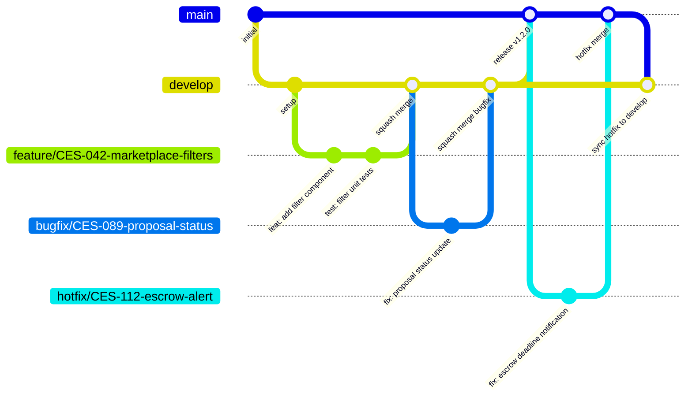
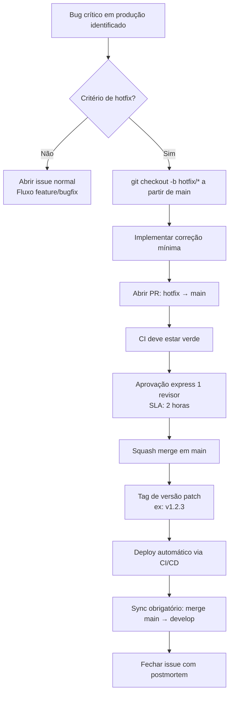

# 23 - Guia de Contribuição

| Campo | Valor |
|---|---|
| **Nome do Documento** | 23 - Guia de Contribuição |
| **Versão** | v1.0 |
| **Data** | 2026-03-22 (America/Fortaleza) |
| **Autor** | Claude Code Desktop |
| **Status** | Rascunho |
| **Produto** | Repasse Seguro — Módulo Cessionário |

---

> 📌 **TL;DR — Contrato de Contribuição**
>
> - **Branching:** Trunk-based simplificado. `main` (produção) + `develop` (integração) + branches curtas por tarefa.
> - **Commits:** Conventional Commits obrigatório — `tipo(escopo): descrição` em inglês, máximo 72 caracteres.
> - **Pull Request:** Template obrigatório, máximo 400 linhas, mínimo 1 aprovação (features) ou 2 (infra/segurança).
> - **Merge Strategy:** Squash merge para features e bugfixes; merge commit para releases. Rebase proibido em branches compartilhadas.
> - **Hotfix:** Branch `hotfix/` criada a partir de `main`, aprovação express 1 revisor, deploy direto após merge.
> - **CI Obrigatório:** Build + lint + testes + type-check devem passar antes de qualquer merge em `develop` ou `main`.
> - **Regra Máxima:** Este documento é contrato, não sugestão. Violações bloqueiam o merge via CI.

---

## 1. Branching Strategy

Este modelo é baseado em **trunk-based development simplificado** com branches de vida curta. O objetivo é manter `main` sempre deployável, eliminar branches de longa duração e garantir integração contínua.

[DECISÃO AUTÔNOMA — Trunk-based simplificado. Alternativa descartada: Git-flow completo (release branches, develop independente) — excessivo para equipe IA sem squads paralelos. Critério: agilidade de integração com CI rigoroso substitui a necessidade de branches de release longas.]

### 1.1 Branches Permanentes (Protegidas)

| Branch | Proteção | Propósito | Merge direto |
|---|---|---|---|
| `main` | ✅ Protegida | Reflete produção. Sempre deployável. | ❌ Proibido |
| `develop` | ✅ Protegida | Integração contínua. Base para features. | ❌ Proibido |

**Regras de proteção obrigatórias (configurar no GitHub):**

- `main` e `develop`: requerem Pull Request, mínimo de aprovações, CI verde.
- Força push (`git push --force`) em branches protegidas: **absolutamente proibido**.
- Deleção de branches protegidas: **absolutamente proibida**.

### 1.2 Nomenclatura de Branches

```
<tipo>/<id-tarefa>-<descricao-curta>
```

| Tipo | Uso | Exemplo |
|---|---|---|
| `feature/` | Nova funcionalidade | `feature/CES-042-marketplace-filters` |
| `bugfix/` | Correção de bug em `develop` | `bugfix/CES-089-proposal-status-update` |
| `hotfix/` | Correção urgente em produção | `hotfix/CES-112-escrow-deadline-alert` |
| `chore/` | Manutenção, deps, config | `chore/update-prisma-v6` |
| `docs/` | Apenas documentação | `docs/CES-055-api-swagger-update` |
| `refactor/` | Refatoração sem mudança de comportamento | `refactor/CES-071-auth-service-cleanup` |
| `test/` | Apenas testes | `test/CES-078-kyc-unit-coverage` |
| `ci/` | Mudanças em pipeline CI/CD | `ci/add-sentry-sourcemaps` |

**Regras de nomenclatura:**

- Sempre em `kebab-case`. Nunca `camelCase` ou `UPPER_CASE`.
- Máximo de 60 caracteres no nome completo.
- ID da tarefa é obrigatório quando existir (linear, jira, notion).
- Descrição deve resumir a mudança, não o problema.

### 1.3 Diagrama do Fluxo de Branches



### 1.4 Vida Útil das Branches

| Tipo | Vida máxima recomendada |
|---|---|
| `feature/` | 3 dias úteis |
| `bugfix/` | 1 dia útil |
| `hotfix/` | 4 horas |
| `chore/` | 2 dias úteis |
| `refactor/` | 2 dias úteis |

Branches com mais de 5 dias sem atividade devem ser fechadas ou convertidas em PR draft.

---

## 2. Convenção de Commits

Todos os commits seguem o padrão **Conventional Commits v1.0.0**. O CI valida a mensagem via `commitlint` — commits fora do padrão são rejeitados automaticamente.

### 2.1 Formato Obrigatório

```
<tipo>(<escopo>): <descrição>

[corpo opcional]

[rodapé opcional]
```

**Regras:**

- Linha de assunto: máximo **72 caracteres**.
- Descrição em **inglês**, imperativo presente ("add", "fix", "update" — nunca "added", "fixed", "updates").
- Escopo é opcional mas recomendado. Deve referenciar o módulo NestJS, página ou serviço afetado.
- Corpo: opcional, em português ou inglês, explicando o **porquê** da mudança.
- Rodapé: `BREAKING CHANGE:` ou `Closes #<id>` quando aplicável.

### 2.2 Tipos Permitidos

| Tipo | Uso | Gera versão (semver) |
|---|---|---|
| `feat` | Nova funcionalidade | Minor (1.x.0) |
| `fix` | Correção de bug | Patch (1.0.x) |
| `docs` | Apenas documentação | Nenhuma |
| `style` | Formatação, sem mudança de lógica | Nenhuma |
| `refactor` | Refatoração sem mudança de comportamento | Nenhuma |
| `test` | Adição ou correção de testes | Nenhuma |
| `chore` | Deps, config, ferramental | Nenhuma |
| `ci` | Pipeline CI/CD | Nenhuma |
| `perf` | Melhoria de performance | Patch |
| `revert` | Reverter commit anterior | Depende |

Tipos não listados acima são rejeitados pelo `commitlint`.

### 2.3 Escopos Recomendados

| Escopo | Módulo / Área |
|---|---|
| `auth` | Autenticação e sessão |
| `kyc` | Verificação de identidade (idwall) |
| `marketplace` | Listagem de oportunidades |
| `proposal` | Propostas |
| `negotiation` | Negociações |
| `escrow` | Conta garantia (Celcoin) |
| `ai` | Analista de Oportunidades |
| `notification` | Notificações (email/push/in-app) |
| `dashboard` | Dashboard do Cessionário |
| `docs` | Documentação |
| `prisma` | Schema e migrations |
| `ci` | Pipeline |
| `deps` | Dependências |

### 2.4 Exemplos Comparativos

| ✅ Correto | ❌ Incorreto | Problema |
|---|---|---|
| `feat(marketplace): add filter by risk score` | `fix stuff` | Genérico, sem tipo, sem escopo, sem descrição |
| `fix(escrow): correct deadline calculation for DST` | `fixes` | Sem tipo válido, sem descrição |
| `test(kyc): add unit tests for liveness validation` | `added tests` | Passado, sem tipo, sem escopo |
| `chore(deps): update prisma to v6.2.1` | `update` | Sem tipo, sem escopo, sem descrição |
| `refactor(auth): extract token rotation to service` | `refactoring auth module` | Gerúndio, sem tipo convencional |
| `feat(ai)!: change RAG chunking from 256 to 512 tokens` | `feature: rag update` | "feature" não é tipo válido; breaking change não sinalizado |

**Anti-exemplo 1 — Commit genérico:**

```bash
# ❌ Errado — rejeitado pelo commitlint
git commit -m "fix stuff"
git commit -m "wip"
git commit -m "update"
git commit -m "changes"

# ✅ Correto
git commit -m "fix(proposal): correct status transition from PENDING to ACCEPTED"
```

**Anti-exemplo 2 — Breaking change não sinalizado:**

```bash
# ❌ Errado — API pública mudou sem aviso
git commit -m "refactor(api): change proposal response schema"

# ✅ Correto — breaking change explícito
git commit -m "feat(api)!: change proposal response schema

BREAKING CHANGE: proposalId field renamed to id in all proposal endpoints.
Consumers must update to v2 API contract.

Closes #CES-099"
```

---

## 3. Pull Request Flow

Todo código que entra em `develop` ou `main` passa por Pull Request. Nenhuma exceção.

### 3.1 Tamanho Máximo de PR

| Métrica | Limite | Ação se exceder |
|---|---|---|
| Linhas alteradas (diff) | **400 linhas** | Dividir em PRs menores antes de abrir |
| Arquivos modificados | **20 arquivos** | Justificar no corpo do PR |
| Commits no branch | Sem limite | Serão squashed no merge |

PRs que excedem 400 linhas sem justificativa válida são fechados sem revisão.

### 3.2 Template Obrigatório de PR

Todo PR deve preencher o template abaixo. PRs sem template são bloqueados pelo CI.

```markdown
## Descrição

<!-- O que esta PR faz? Por que é necessário? Contexto para o revisor. -->

## Tipo de Mudança

- [ ] Nova funcionalidade (`feat`)
- [ ] Correção de bug (`fix`)
- [ ] Refatoração (`refactor`)
- [ ] Documentação (`docs`)
- [ ] Manutenção / deps (`chore`)
- [ ] CI/CD (`ci`)
- [ ] BREAKING CHANGE (marcar + descrever abaixo)

## Mudanças Realizadas

<!--
- Lista de mudanças principais
- Decisões técnicas relevantes tomadas
- Alternativas consideradas e descartadas
-->

## Como Testar

<!--
1. Passos para reproduzir o cenário
2. Dados de teste necessários
3. Resultado esperado
-->

## Checklist

- [ ] Todos os testes passam localmente (`pnpm test`)
- [ ] Type-check sem erros (`pnpm type-check`)
- [ ] Lint sem erros (`pnpm lint`)
- [ ] Commit messages seguem Conventional Commits
- [ ] Não há `console.log` em código de produção
- [ ] Variáveis de ambiente novas adicionadas ao `.env.example` e documentadas em D22
- [ ] Migrations Prisma têm rollback documentado (se aplicável)
- [ ] Endpoints novos documentados no Swagger (`@ApiOperation`, `@ApiResponse`)
- [ ] Dados sensíveis não logados (CPF, token, senha)
- [ ] Testes unitários adicionados/atualizados para mudanças de lógica

## Screenshots / Gravação (se aplicável)

<!-- Para mudanças visuais, incluir antes/depois. -->

## Referências

<!-- Issues, RNs, ADRs, documentos relacionados -->
<!-- Ex: Closes #CES-042 | RN-017 | ADR-003 -->
```

### 3.3 Regras de Review

| Contexto | Aprovações mínimas | SLA de review |
|---|---|---|
| Features (`feature/`) | 1 aprovação | 24 horas úteis |
| Bugfixes (`bugfix/`) | 1 aprovação | 8 horas úteis |
| Infraestrutura, segurança, migrations | 2 aprovações | 24 horas úteis |
| Hotfix (`hotfix/`) | 1 aprovação | 2 horas |
| Docs, chores sem lógica | 1 aprovação | 48 horas úteis |

**Quem pode aprovar:** qualquer membro técnico do time com acesso ao repositório. Em produção com IA, o Claude Code Desktop é o revisor padrão para PRs gerados por agentes externos.

**O que bloqueia aprovação:**

- CI vermelho (qualquer check)
- Testes ausentes para nova lógica
- `console.log` em código de produção
- Variáveis de ambiente sem `.env.example` atualizado
- Dados sensíveis logados sem redação

### 3.4 Labels Automáticos de PR

| Label | Critério de aplicação |
|---|---|
| `size/small` | Diff < 100 linhas |
| `size/medium` | Diff 100–400 linhas |
| `size/large` | Diff > 400 linhas (requer justificativa) |
| `breaking-change` | Commit com `!` ou footer `BREAKING CHANGE:` |
| `needs-migration` | Qualquer arquivo `.prisma` modificado |
| `security` | Mudanças em auth, tokens, RLS, secrets |
| `hotfix` | Branch `hotfix/*` |

---

## 4. Code Review Guidelines

O objetivo do code review é garantir qualidade, segurança e aprendizado coletivo — não é uma auditoria adversarial.

### 4.1 Critérios de Verificação

| Dimensão | Verificações obrigatórias |
|---|---|
| **Funcionalidade** | A lógica implementa corretamente a RN referenciada? Edge cases cobertos? |
| **Testes** | Cobertura para novos caminhos de código? Testes testam comportamento, não implementação? |
| **Segurança** | Inputs validados? Dados do Cedente não expostos? RLS respeitado? Secrets fora do código? |
| **Performance** | N+1 queries? Índices criados para novas colunas em `WHERE`/`ORDER BY`? |
| **Legibilidade** | Nomes de variáveis e funções são descritivos? Funções com mais de 40 linhas? |
| **TypeScript** | Sem `any` implícito? Tipos corretos em interfaces e DTOs? |
| **Logs** | Dados sensíveis não logados? Correlation ID propagado? Nível de log correto? |

### 4.2 Como Dar Feedback Construtivo

| ✅ Feedback útil | ❌ Feedback ineficaz |
|---|---|
| "Essa query pode gerar N+1 porque busca relacionamentos em loop. Considera usar `include` no Prisma ou um `findMany` com join." | "Isso está errado." |
| "Sugiro extrair essa lógica para `AuthService.refreshToken()` — centraliza o comportamento e facilita testes." | "Código feio." |
| "CPF está sendo logado na linha 47. Adicionar ao array `redact` do Pino para conformidade LGPD." | "Não segue os padrões." |

**Prefixos de feedback (usar no comment):**

- `[BLOQUEIO]` — impede aprovação, deve ser corrigido.
- `[SUGESTÃO]` — melhoria não obrigatória, autor decide.
- `[PERGUNTA]` — dúvida técnica, não bloqueia.
- `[NIT]` — detalhe menor de estilo, não bloqueia.

### 4.3 O que Bloqueia vs. O que é Sugestão

| Bloqueia aprovação | Apenas sugestão |
|---|---|
| CI vermelho | Renomear variável para maior clareza |
| Bug lógico comprovado | Extrair função para reuso futuro |
| Dado sensível exposto ou logado | Ordenação de imports |
| Violação de RLS ou segurança | Comentário adicional para clareza |
| Testes ausentes para nova lógica crítica | Usar `const` em vez de `let` onde aplicável |
| Secrets no código | Simplificar condição booleana |
| Migration sem rollback documentado | Escolha de nome de variável não crítica |

---

## 5. Merge Strategy

### 5.1 Regras por Tipo de Branch

| Branch origem | Branch destino | Estratégia | Quem faz o merge |
|---|---|---|---|
| `feature/*` | `develop` | **Squash merge** | Autor do PR (após aprovação) |
| `bugfix/*` | `develop` | **Squash merge** | Autor do PR (após aprovação) |
| `refactor/*` | `develop` | **Squash merge** | Autor do PR (após aprovação) |
| `chore/*` | `develop` | **Squash merge** | Autor do PR (após aprovação) |
| `develop` | `main` | **Merge commit** | Tech Lead / responsável técnico |
| `hotfix/*` | `main` | **Squash merge** | Tech Lead (após aprovação express) |
| `hotfix/*` | `develop` | **Merge commit** | Autor do hotfix (sync obrigatório) |

**Por que squash para features?** Mantém `develop` e `main` com histórico limpo — um commit por funcionalidade, com mensagem bem descrita.

**Por que merge commit de `develop` para `main`?** Preserva o ponto exato de cada release para rastreabilidade e possível rollback.

### 5.2 Regras de Rebase

| Caso | Permitido? | Regra |
|---|---|---|
| Rebase local da branch feature antes de abrir PR | ✅ Permitido | `git rebase develop` para atualizar com base |
| Rebase interativo local antes do PR | ✅ Permitido | `git rebase -i` para limpar commits WIP |
| Rebase em branch compartilhada com outros devs | ❌ Proibido | Altera histórico público, causa conflitos |
| Rebase em `develop` ou `main` | ❌ Proibido | Absolutamente proibido |

### 5.3 Resolução de Conflitos

1. **Quem resolve:** o autor da branch com conflito.
2. **Como:** `git rebase develop` (atualiza a branch com a base atual).
3. **Em caso de dúvida:** abrir PR draft e pedir assistência no review antes de resolver.
4. **Nunca:** resolver conflito fazendo `git merge main` em branch de feature (cria merge commits desnecessários no histórico).

**Anti-exemplo 3 — Merge sem aprovação:**

```bash
# ❌ Errado — merge direto sem PR
git checkout develop
git merge feature/CES-042-marketplace-filters
git push origin develop

# ✅ Correto — sempre via Pull Request no GitHub
# 1. Abrir PR com template preenchido
# 2. Aguardar CI verde
# 3. Obter aprovação mínima
# 4. Usar botão "Squash and merge" no GitHub
```

---

## 6. Hotfix Flow

Hotfixes são para bugs críticos em **produção** que não podem aguardar o ciclo normal de `develop → main`.

**Critério para hotfix:** bug em `main` que causa indisponibilidade, perda de dados, falha de segurança ou impacto direto em transações financeiras (Escrow).

### 6.1 Checklist de Decisão

Antes de abrir um hotfix, confirmar:

- [ ] O bug está em produção (`main`)?
- [ ] Impacta usuários ativos ou transações em andamento?
- [ ] Não pode aguardar o próximo ciclo de release?

Se todas as respostas forem "sim", iniciar o fluxo de hotfix.

### 6.2 Passo a Passo do Hotfix

```bash
# 1. Criar branch hotfix a partir de main (NUNCA de develop)
git checkout main
git pull origin main
git checkout -b hotfix/CES-112-escrow-deadline-alert

# 2. Implementar a correção
# 3. Commitar com tipo 'fix' obrigatório
git commit -m "fix(escrow): correct NOT-CES-05 deadline alert trigger condition"

# 4. Abrir PR: hotfix/* → main
# - Descrição: impacto, causa raiz, solução
# - Aprovação express: 1 revisor em até 2 horas
# - CI deve estar verde

# 5. Após merge em main: sincronizar em develop (obrigatório)
git checkout develop
git pull origin develop
git merge main --no-ff -m "chore: sync hotfix/CES-112 to develop"
git push origin develop
```

### 6.3 Diagrama do Fluxo de Hotfix



### 6.4 Regras do Hotfix

- Branch hotfix criada **exclusivamente** a partir de `main`.
- Correção deve ser **mínima** — apenas o necessário para resolver o bug. Refatorações são proibidas em hotfix.
- Após merge em `main`, sincronização em `develop` é **obrigatória** (evita regressão no próximo release).
- Tag de versão `patch` deve ser criada imediatamente após o merge.
- Postmortem obrigatório para hotfixes que afetam Escrow, autenticação ou KYC.

---

## 7. CI/CD Integration

Todos os checks de CI devem estar **verdes** antes de qualquer merge em `develop` ou `main`. Nenhuma exceção.

### 7.1 Checks Obrigatórios (GitHub Actions)

| Check | Comando | Bloqueia merge |
|---|---|---|
| Type-check | `pnpm type-check` | ✅ Sim |
| Lint | `pnpm lint` | ✅ Sim |
| Testes unitários | `pnpm test` | ✅ Sim |
| Build | `pnpm build` | ✅ Sim |
| Commitlint | Validação automática no PR | ✅ Sim |
| Cobertura de testes | Mínimo 80% em módulos críticos | ✅ Sim (novo código) |
| Audit de dependências | `pnpm audit --audit-level=high` | ✅ Sim |
| PR template preenchido | Verificação de campos obrigatórios | ✅ Sim |

### 7.2 Checks Recomendados (Não Bloqueantes)

| Check | Ferramenta | Ação |
|---|---|---|
| Análise estática de segurança | CodeQL ou Semgrep | Notificação no PR |
| Bundle size regression | `size-limit` | Aviso se regressão > 5% |
| Cobertura geral | Relatório Vitest/Jest | Comentário no PR |

### 7.3 Branch Protection Rules (Configurar no GitHub)

**Para `main`:**
- Require pull request reviews: **2 aprovações**
- Dismiss stale reviews on new commits: ✅ Ativado
- Require status checks to pass: todos os checks obrigatórios
- Require branches to be up to date: ✅ Ativado
- Include administrators: ✅ Ativado (ninguém acima das regras)
- Restrict who can push: apenas GitHub Actions

**Para `develop`:**
- Require pull request reviews: **1 aprovação**
- Require status checks to pass: todos os checks obrigatórios
- Require branches to be up to date: ✅ Ativado

---

## 8. Release Flow

### 8.1 Ciclo de Release

```
develop (features acumuladas)
    ↓ PR com tag de versão
main (release)
    ↓ CI/CD automático
Railway (produção)
```

### 8.2 Versionamento Semântico

O projeto segue **SemVer 2.0.0**: `MAJOR.MINOR.PATCH`

| Incremento | Quando | Exemplo |
|---|---|---|
| `MAJOR` | Breaking change na API ou contrato de dados | `1.0.0 → 2.0.0` |
| `MINOR` | Nova funcionalidade retrocompatível | `1.0.0 → 1.1.0` |
| `PATCH` | Correção de bug retrocompatível | `1.0.0 → 1.0.1` |

### 8.3 Criação de Release

```bash
# 1. Garantir que develop está atualizado e CI verde
git checkout develop
git pull origin develop

# 2. Abrir PR: develop → main
# - Título: "Release v1.2.0"
# - Descrição: changelog das features incluídas
# - 2 aprovações obrigatórias

# 3. Após merge: criar tag no main
git checkout main
git pull origin main
git tag -a v1.2.0 -m "Release v1.2.0: marketplace filters + KYC improvements"
git push origin v1.2.0

# 4. CI/CD dispara deploy automático no Railway
```

### 8.4 Changelog

O changelog é gerado automaticamente a partir das mensagens de commit via `conventional-changelog`. Manter mensagens de commit padronizadas é o que garante changelog legível.

---

## 9. Glossário

| Termo | Definição |
|---|---|
| **Branch protegida** | Branch com regras no GitHub que impedem push direto e exigem PR. |
| **Squash merge** | Estratégia que condensa todos os commits de uma branch em um único commit no destino. |
| **Merge commit** | Merge que preserva o histórico completo, criando um commit de merge explícito. |
| **Hotfix** | Correção urgente aplicada diretamente a `main` para resolver bug crítico em produção. |
| **Conventional Commits** | Especificação de formato de mensagem de commit — ver [conventionalcommits.org](https://www.conventionalcommits.org). |
| **Trunk-based development** | Modelo de branching com branches curtas integradas frequentemente ao tronco principal. |
| **CI** | Continuous Integration — automação de build, teste e validação a cada push/PR. |
| **DLQ** | Dead Letter Queue — fila de mensagens RabbitMQ que falharam após retries. |
| **SLA de review** | Tempo máximo esperado para um revisor responder a um PR aberto. |
| **Tag semver** | Tag Git no formato `vMAJOR.MINOR.PATCH` que marca um ponto de release. |
| **Commitlint** | Ferramenta que valida se mensagens de commit seguem Conventional Commits. |
| **Postmortem** | Documento de análise após incidente em produção — causa raiz, impacto, ações corretivas. |

---

## 10. Anti-Exemplos Consolidados

> 🔴 **Os quatro anti-exemplos obrigatórios que este guia proíbe:**

**Anti-exemplo 1 — Commit com mensagem genérica:**

```bash
# ❌ PROIBIDO — Rejeitado pelo commitlint
git commit -m "fix stuff"
git commit -m "update"
git commit -m "wip"

# ✅ CORRETO
git commit -m "fix(escrow): resolve deadline calculation for DST boundary"
```

**Anti-exemplo 2 — PR grande sem contexto:**

```markdown
<!-- ❌ PROIBIDO — PR fechado sem revisão -->
Título: "Melhorias gerais"
Descrição: (vazia)
Diff: 1.200 linhas em 34 arquivos

<!-- ✅ CORRETO -->
Título: "feat(marketplace): add filter by risk score and property type"
Descrição: Template preenchido, PR ≤ 400 linhas, "Como testar" com passos detalhados
```

**Anti-exemplo 3 — Branch sem padrão de nome:**

```bash
# ❌ PROIBIDO
git checkout -b fix
git checkout -b fernandoBranch
git checkout -b FEATURE_123
git checkout -b feature_marketplace

# ✅ CORRETO
git checkout -b feature/CES-042-marketplace-risk-filter
git checkout -b bugfix/CES-089-proposal-status-update
```

**Anti-exemplo 4 — Merge sem aprovação mínima:**

```bash
# ❌ PROIBIDO — Acesso negado pelas branch protection rules
git checkout develop
git merge feature/CES-042-marketplace-filters --no-ff
git push origin develop  # ERROR: protected branch

# ✅ CORRETO — Sempre via Pull Request com aprovação e CI verde
# Abrir PR no GitHub → aguardar CI → obter aprovação → usar "Squash and merge"
```

---

## 11. Backlog de Pendências

| ID | Item | Tipo | Opções A/B | Prioridade |
|---|---|---|---|---|
| CONTRIB-001 | Definir ferramenta de changelog automático | [DECISÃO AUTÔNOMA] | `conventional-changelog-cli` (CLI, sem config GitHub) vs `release-please` (Action GitHub, integrado). **Decisão: `release-please`** — automatiza tag + GitHub Release + CHANGELOG.md via Action, sem intervenção manual. Descartado: `conventional-changelog-cli` requer execução manual. | Alta |
| CONTRIB-002 | Configurar `commitlint` no repositório | Ação técnica | Adicionar `.commitlintrc.json` e hook `commit-msg` via `husky`. Executar `pnpm dlx husky init` após setup local do D22. | Alta |
| CONTRIB-003 | Template de PR como arquivo no repositório | Ação técnica | Criar `.github/pull_request_template.md` com o template da seção 3.2. Aplicado automaticamente no GitHub. | Alta |

---

*Documento gerado pelo pipeline ShiftLabs v9.5 — Fase 2. Executor: Claude Code Desktop.*
