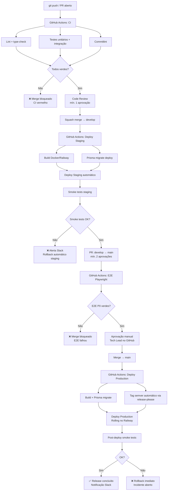
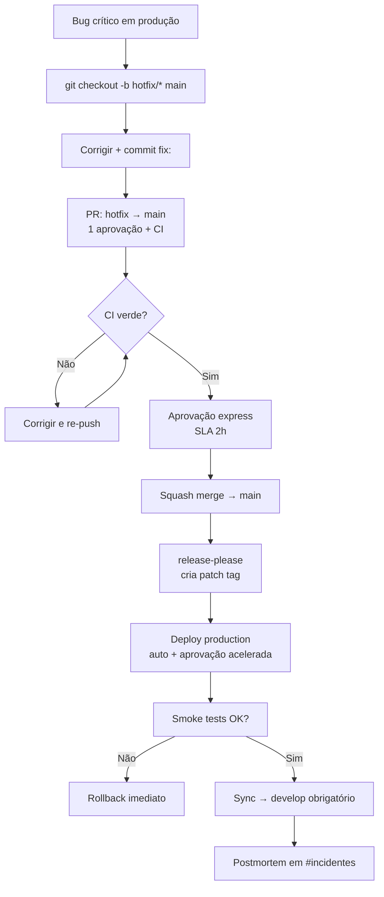

# 24 - Deploy, CI-CD e Versionamento

| Campo | Valor |
|---|---|
| **Nome do Documento** | 24 - Deploy, CI-CD e Versionamento |
| **Versão** | v1.0 |
| **Data** | 2026-03-22 (America/Fortaleza) |
| **Autor** | Claude Code Desktop |
| **Status** | Rascunho |
| **Produto** | Repasse Seguro — Módulo Cessionário |

---

> 📌 **TL;DR — Pipeline de Deploy**
>
> - **Ambientes:** `dev` (local Docker) → `staging` (Railway Preview) → `production` (Railway).
> - **Pipeline:** GitHub Actions — lint + type-check + testes em todo PR; E2E em PRs para `main`; deploy automático em staging ao mergear em `develop`; deploy em produção requer aprovação manual.
> - **Estratégia:** Deploy Rolling no Railway (zero-downtime). Migrations Prisma executadas como pré-deploy step.
> - **Rollback:** Railway `railway rollback` ou revert de commit + redeploy em até 5 minutos.
> - **Versionamento:** SemVer 2.0. Tags Git `vMAJOR.MINOR.PATCH`. Release automático via `release-please`.
> - **Hotfix:** branch `hotfix/*` a partir de `main`, aprovação express 1 revisor, deploy prioritário.
> - **Secrets:** Railway (backend prod/staging), Vercel (frontend), EAS Secrets (mobile). Nunca em código ou CI logs.

---

## 1. Matriz de Ambientes

| Ambiente | Objetivo | URL | Branch | Trigger | Tipo de dados | Responsável pelo promote | Critério de uso |
|---|---|---|---|---|---|---|---|
| `dev` (local) | Desenvolvimento e testes locais | `localhost:3000` | Qualquer | Manual (`pnpm dev`) | Dados sintéticos via seed | Dev individual | Setup conforme D22 |
| `staging` | Integração, QA e E2E | `https://staging.repasse-seguro.com.br` | `develop` | Push automático em `develop` | Dados de teste mascarados | CI automático após merge | Smoke tests verdes |
| `preview` | Revisão de features por PRs específicos | `https://pr-{n}.repasse-seguro.com.br` | `feature/*` (via label) | PR com label `preview` | Dados sintéticos | CI automático | Revisão visual pré-merge |
| `production` | Usuários reais | `https://app.repasse-seguro.com.br` | `main` | Push em `main` + aprovação manual | Dados reais | Tech Lead após aprovação | Todos os gates satisfeitos |

**Regras adicionais:**

- Staging replica exatamente o ambiente de produção (mesmas variáveis, mesma versão Node.js, mesmas políticas RLS).
- Nunca promover para produção na sexta-feira após 16h ou véspera de feriado sem justificativa documentada.
- Preview environments são destruídas automaticamente ao fechar o PR.

---

## 2. Diagrama do Pipeline



---

## 3. Workflows de CI/CD

### 3.1 Workflow: `ci.yml` — Validação de PR

| Campo | Valor |
|---|---|
| **Nome** | CI — Pull Request |
| **Trigger** | `pull_request` para `develop` ou `main` |
| **Runner** | `ubuntu-latest` |
| **Timeout** | 20 minutos |

**Jobs:**

```yaml
# .github/workflows/ci.yml
name: CI

on:
  pull_request:
    branches: [develop, main]

jobs:
  validate:
    runs-on: ubuntu-latest
    timeout-minutes: 20
    steps:
      - uses: actions/checkout@v4
      - uses: pnpm/action-setup@v4
        with: { version: 9 }
      - uses: actions/setup-node@v4
        with: { node-version: '22', cache: 'pnpm' }
      - run: pnpm install --frozen-lockfile
      - run: pnpm lint           # ESLint + Prettier
      - run: pnpm type-check     # tsc --noEmit
      - run: pnpm commitlint     # Valida última mensagem de commit
      - run: pnpm test           # Vitest unitário + integração
      - run: pnpm test:coverage  # Thresholds obrigatórios

  e2e:
    if: github.base_ref == 'main'
    runs-on: ubuntu-latest
    timeout-minutes: 30
    needs: validate
    steps:
      - uses: actions/checkout@v4
      - uses: pnpm/action-setup@v4
        with: { version: 9 }
      - run: pnpm install --frozen-lockfile
      - run: pnpm playwright install --with-deps
      - run: pnpm test:e2e
        env:
          E2E_BASE_URL: ${{ secrets.STAGING_URL }}
          E2E_TEST_USER_EMAIL: ${{ secrets.E2E_TEST_USER_EMAIL }}
          E2E_TEST_USER_PASSWORD: ${{ secrets.E2E_TEST_USER_PASSWORD }}
```

**Artefatos gerados:**

- Relatório de cobertura (HTML + JSON) — retido 7 dias.
- Screenshots e vídeos de falha Playwright — retidos 7 dias.

**Condição de falha:** qualquer job com exit code != 0 bloqueia o merge.

**Notificação se falhar:** comentário automático no PR com link para logs.

---

### 3.2 Workflow: `deploy-staging.yml` — Deploy Automático em Staging

| Campo | Valor |
|---|---|
| **Nome** | Deploy — Staging |
| **Trigger** | `push` em `develop` |
| **Runner** | `ubuntu-latest` |
| **Timeout** | 15 minutos |

```yaml
# .github/workflows/deploy-staging.yml
name: Deploy Staging

on:
  push:
    branches: [develop]

jobs:
  deploy:
    runs-on: ubuntu-latest
    environment: staging
    steps:
      - uses: actions/checkout@v4
      - uses: pnpm/action-setup@v4
        with: { version: 9 }
      - run: pnpm install --frozen-lockfile
      - run: pnpm build
      - name: Deploy to Railway (Staging)
        run: railway up --service backend-staging --environment staging
        env:
          RAILWAY_TOKEN: ${{ secrets.RAILWAY_TOKEN_STAGING }}
      - name: Run Prisma migrations
        run: railway run --service backend-staging prisma migrate deploy
        env:
          RAILWAY_TOKEN: ${{ secrets.RAILWAY_TOKEN_STAGING }}
      - name: Smoke tests
        run: pnpm test:smoke
        env:
          SMOKE_BASE_URL: ${{ secrets.STAGING_URL }}
```

**Secrets consumidos:** `RAILWAY_TOKEN_STAGING`, `STAGING_URL`, variáveis de ambiente do staging.

**Se smoke tests falharem:** notificação Slack no canal `#deploys` + rollback automático via `railway rollback`.

---

### 3.3 Workflow: `deploy-production.yml` — Deploy em Produção

| Campo | Valor |
|---|---|
| **Nome** | Deploy — Production |
| **Trigger** | `push` em `main` (requer aprovação manual no GitHub Environments) |
| **Runner** | `ubuntu-latest` |
| **Timeout** | 20 minutos |

```yaml
# .github/workflows/deploy-production.yml
name: Deploy Production

on:
  push:
    branches: [main]

jobs:
  deploy:
    runs-on: ubuntu-latest
    environment: production  # Requer aprovação manual configurada no GitHub
    steps:
      - uses: actions/checkout@v4
      - uses: pnpm/action-setup@v4
        with: { version: 9 }
      - run: pnpm install --frozen-lockfile
      - run: pnpm build
      - name: Deploy to Railway (Production)
        run: railway up --service backend-prod --environment production
        env:
          RAILWAY_TOKEN: ${{ secrets.RAILWAY_TOKEN_PROD }}
      - name: Run Prisma migrations
        run: railway run --service backend-prod prisma migrate deploy
        env:
          RAILWAY_TOKEN: ${{ secrets.RAILWAY_TOKEN_PROD }}
      - name: Post-deploy smoke tests
        run: pnpm test:smoke
        env:
          SMOKE_BASE_URL: ${{ secrets.PROD_URL }}
      - name: Notify Slack
        if: success()
        uses: slackapi/slack-github-action@v2
        with:
          payload: '{"text":"✅ Deploy produção concluído: ${{ github.sha }}"}'
        env:
          SLACK_WEBHOOK_URL: ${{ secrets.SLACK_WEBHOOK_DEPLOYS }}
```

**Aprovação manual:** configurada no GitHub → Settings → Environments → `production` → Required reviewers: Tech Lead.

**Se smoke tests falharem:** rollback automático + incidente aberto no Sentry + notificação Slack `#incidentes`.

---

### 3.4 Workflow: `release-please.yml` — Versionamento Automático

```yaml
# .github/workflows/release-please.yml
name: Release Please

on:
  push:
    branches: [main]

jobs:
  release-please:
    runs-on: ubuntu-latest
    steps:
      - uses: googleapis/release-please-action@v4
        with:
          token: ${{ secrets.GITHUB_TOKEN }}
          release-type: node
```

[DECISÃO AUTÔNOMA — `release-please` para automação de release. Justificativa: cria automaticamente PR de release com CHANGELOG.md atualizado e tag semver baseados nos commits; integrado nativamente ao GitHub Actions sem dependência externa. Alternativa descartada: `semantic-release` — mais complexo de configurar, conflita com estratégia de Squash merge do D23.]

---

## 4. Estratégia de Deploy

**Abordagem:** Rolling Deploy no Railway.

O Railway aplica deploys de forma rolling — novas instâncias sobem gradualmente enquanto as antigas são mantidas até as novas estarem saudáveis. Não há downtime em deploys normais.

**Pré-condições obrigatórias:**

- [ ] CI verde (todos os checks do workflow `ci.yml`).
- [ ] Aprovação mínima no PR.
- [ ] Migrations Prisma executadas **antes** do novo código entrar em produção (Railway pré-deploy step).
- [ ] Migrations devem ser retrocompatíveis (adicionar colunas nullable antes de torná-las obrigatórias).

**Evidência de sucesso:**

- Railway Dashboard mostra instância nova como "Active".
- Smoke tests retornam 200 em todos os endpoints críticos.
- Sentry não reporta spike de erros nos 5 minutos pós-deploy.
- PostHog mostra sessões ativas normais.

**Quando não usar Rolling Deploy:**

- Migrations destrutivas (remover coluna com dados) → exige janela de manutenção.
- Mudanças no schema de autenticação → exige coordenação com frontend deploy.

**Migrations retrocompatíveis — padrão obrigatório:**

```
1. Adicionar coluna nullable (sem DEFAULT) → deploy do código
2. Preencher dados existentes (backfill script)
3. Adicionar DEFAULT ou NOT NULL constraint → deploy de cleanup
```

---

## 5. Promoção entre Ambientes

### 5.1 Gates de Promoção

| Origem | Destino | Gates técnicos | Gates humanos | Janela permitida |
|---|---|---|---|---|
| `feature/*` | `develop` | CI verde (lint, type-check, testes, cobertura) | 1 aprovação | 24/7 |
| `develop` | `staging` | CI verde + build | Automático (sem humano) | 24/7 |
| Staging | `main` (PR) | E2E P0 verdes + CI verde | 2 aprovações | Seg-Qui 9h-17h (BRT) |
| `main` | Production | Smoke tests staging verdes | Aprovação manual Tech Lead no GitHub | Seg-Qui 10h-15h (BRT) |
| `hotfix/*` | `main` | CI verde + smoke tests básicos | 1 aprovação express | 24/7 |

### 5.2 Checklist de Go/No-Go para Produção

Antes de aprovar o deploy em produção, o Tech Lead verifica:

- [ ] Todos os testes E2E P0 passaram na última execução de staging.
- [ ] Migrations Prisma revisadas e retrocompatíveis.
- [ ] CHANGELOG.md atualizado pelo `release-please`.
- [ ] Sentry staging sem novos alertas críticos.
- [ ] RabbitMQ staging sem DLQ acumulada.
- [ ] Redis staging sem memória crítica.
- [ ] Celcoin/ZapSign/idwall — status das APIs externas verificado.
- [ ] Janela de deploy permitida (não é sexta após 16h nem véspera de feriado).
- [ ] Release notes redigidas e aprovadas.
- [ ] Canal `#deploys` notificado com janela de deploy.

---

## 6. Build e Artefatos

### 6.1 Backend (NestJS)

| Item | Detalhe |
|---|---|
| **Comando** | `pnpm build` → `nest build` |
| **Output** | `dist/` (JavaScript transpilado, source maps) |
| **Artefato no CI** | Docker image — tag: `repasse-seguro/backend:{sha-curto}` |
| **Retenção** | Railway mantém as 5 últimas builds disponíveis para rollback |
| **Source maps** | Gerados e enviados ao Sentry na build de produção; não incluídos na imagem |

### 6.2 Frontend Web (React + Vite)

| Item | Detalhe |
|---|---|
| **Comando** | `pnpm build` → `vite build` |
| **Output** | `dist/` (assets com hash de conteúdo) |
| **Deploy** | Vercel (via integração GitHub automática) |
| **Retenção** | Vercel mantém deployments anteriores para rollback instantâneo |
| **Bundle size** | Verificado via `rollup-plugin-visualizer`; alerta se > 300KB gzipped |

### 6.3 Mobile (Expo)

| Item | Detalhe |
|---|---|
| **Comando** | `eas build --profile production` |
| **Output** | `.aab` (Android) / `.ipa` (iOS) via EAS Build |
| **OTA Updates** | `eas update --branch production` para updates sem store review |
| **Versão** | `app.json` → `version` e `buildNumber`/`versionCode` sincronizados com SemVer |

### 6.4 Prisma Migrations

- Migrations são artefatos versionados em `prisma/migrations/`.
- Nunca editar uma migration já aplicada em produção — criar nova migration.
- Toda migration deve ter rollback documentado como comentário no arquivo SQL.

---

## 7. Rollback

### 7.1 Critérios para Ativar Rollback

| Situação | Ação |
|---|---|
| Smoke tests falhando pós-deploy | Rollback imediato (automático via CI) |
| Spike de erros 5xx no Sentry > 5% em 5min | Rollback manual (Tech Lead) |
| Alerta crítico no Railway Dashboard (instância unhealthy) | Rollback imediato |
| DLQ RabbitMQ acumulando rapidamente pós-deploy | Rollback manual + investigação |
| Falha em endpoint de KYC, Escrow ou Formalização | Rollback imediato |

**Quem pode acionar rollback:**

- Tech Lead — a qualquer momento.
- On-call — durante incidente ativo.
- CI — automaticamente quando smoke tests falham.

### 7.2 Rollback Backend (Railway)

```bash
# 1. Verificar deploys anteriores
railway deployments list --service backend-prod --environment production

# 2. Rollback para deploy anterior
railway rollback --service backend-prod --environment production
# Railway troca o tráfego de volta para a versão anterior em ~30 segundos

# 3. Verificar saúde após rollback
curl -X GET https://app.repasse-seguro.com.br/health
# Esperado: { "status": "ok", "version": "v1.2.2" }

# 4. Verificar Sentry — confirmar que spike de erros cessou
# 5. Notificar #incidentes no Slack: "[ROLLBACK] Backend revertido para v1.2.2 - [hora]"
```

**Tempo esperado de rollback:** 30-60 segundos.

**Riscos colaterais:**

- Migrations já aplicadas **não são revertidas automaticamente**. Se a migration for destrutiva, requerer rollback manual do banco antes do rollback de código.
- Código revertido pode conflitar com migrations existentes se a migration anterior ao rollback não for retrocompatível.

**Validações obrigatórias após rollback:**

- [ ] `/health` retornando `200` com versão correta.
- [ ] Sentry sem spike de novos erros.
- [ ] Endpoints críticos (proposta, KYC, Escrow) respondendo normalmente.
- [ ] RabbitMQ queues sem DLQ acumulando.
- [ ] Alerta de rollback postado no canal `#incidentes`.

### 7.3 Rollback Frontend (Vercel)

```bash
# Via CLI
vercel rollback [deployment-url]

# Via Dashboard Vercel: Deployments → selecionar versão anterior → "Redeploy"
# Tempo esperado: 10-20 segundos
```

### 7.4 Rollback Mobile (Expo OTA)

```bash
# Reverter OTA update para versão anterior
eas update:rollback --branch production --to [previous-update-group-id]
# Apenas para OTA updates — builds de store requerem nova submissão
```

---

## 8. Semantic Versioning

O projeto segue **SemVer 2.0.0**: `MAJOR.MINOR.PATCH[-rc.N]`

| Incremento | Quando | Exemplo | Trigger automático |
|---|---|---|---|
| `MAJOR` | Breaking change na API pública ou contrato de dados | `1.0.0 → 2.0.0` | Commit com `!` ou `BREAKING CHANGE:` |
| `MINOR` | Nova funcionalidade retrocompatível | `1.0.0 → 1.1.0` | Commit `feat:` |
| `PATCH` | Correção de bug retrocompatível | `1.0.0 → 1.0.1` | Commit `fix:` ou `perf:` |
| `rc.N` | Release Candidate em staging | `1.2.0-rc.1` | Manual antes de release major |

**Exemplos práticos:**

```
v1.0.0  — Release inicial MVP
v1.1.0  — feat: adicionar filtro por delta mínimo no marketplace
v1.1.1  — fix: corrigir cálculo de comissão para delta negativo
v1.2.0  — feat: módulo de reversão de operação
v2.0.0  — feat!: nova versão da API de propostas (breaking change)
v1.1.2  — hotfix aplicado como patch
```

**Relação versão ↔ tag Git:**

```bash
# Tag criada automaticamente pelo release-please após merge em main
# Formato: vMAJOR.MINOR.PATCH
git tag v1.2.0
git push origin v1.2.0
```

---

## 9. Ciclo de Release

```
feature/* → develop (integração contínua)
    │
    ├── [automático] deploy staging
    ├── [automático] smoke tests staging
    │
    └── develop → main (PR de release)
         │
         ├── [automático] E2E Playwright
         ├── [humano] 2 aprovações
         ├── [humano] aprovação manual no GitHub Environment
         │
         └── main
              │
              ├── [automático] deploy production (Rolling)
              ├── [automático] smoke tests production
              ├── [automático] tag semver via release-please
              └── [automático] CHANGELOG.md atualizado + GitHub Release criada
```

**Estabilização pós-release:**

- Monitorar Sentry, Railway e RabbitMQ por **30 minutos** após cada deploy em produção.
- Manter o responsável pelo deploy disponível por 1 hora após o deploy.
- Sem novos deploys em produção durante período de estabilização, exceto hotfix urgente.

**Freeze de releases:**

- Não há freeze automático definido.
- [DECISÃO AUTÔNOMA — sem freeze period fixo. Justificativa: equipe IA com deploy automatizado e rollback em 30s tem risco controlado. Alternativa descartada: freeze sexta-tarde a segunda-manhã — muito restritivo para cadência de entrega do produto.]

---

## 10. Changelog

**Formato:** Conventional Changelog (gerado automaticamente pelo `release-please`).

**Local:** `CHANGELOG.md` na raiz do repositório.

**Responsável:** automático via CI; revisão humana opcional antes do release.

**Granularidade:** por tipo de commit — `feat`, `fix`, `perf`, `revert`. Commits `chore`, `docs`, `ci` não aparecem no changelog público.

**Exemplo correto:**

```markdown
## [1.2.0] - 2026-03-22

### Features

- **marketplace:** add filter by minimum delta value (CES-042)
- **kyc:** add retry mechanism for idwall timeout (CES-089)

### Bug Fixes

- **escrow:** correct deadline calculation crossing DST boundary (CES-112)
- **notification:** fix NOT-CES-05 not firing 48h before deadline (CES-099)
```

**Exemplo incorreto:**

```markdown
## v1.2.0

- Melhorias gerais
- Correções de bugs
- Updates
```

---

## 11. Release Notes

Template mínimo de release notes (postado no Slack `#releases` e no GitHub Release):

```markdown
## Release v1.2.0 — 2026-03-22

### Resumo
Adiciona filtro por delta mínimo no marketplace e corrige cálculo de prazo Escrow em mudanças de horário.

### Escopo
- Backend: módulos marketplace, escrow, notification
- Frontend: componente FilterPanel, hook useEscrowDeadline
- Mobile: não impactado

### O que mudou para o usuário
- Novo filtro "Delta mínimo" no marketplace
- Alertas de prazo Escrow agora calculados corretamente no horário de verão

### Riscos conhecidos
- Nenhum

### Ações pós-release
- [ ] Monitorar DLQ `notification.email` por 30min (NOT-CES-05/06)
- [ ] Verificar Langfuse — nenhum aumento de latência no Analista

### Links
- PR: https://github.com/repasse-seguro/app/pull/XXX
- CHANGELOG: https://github.com/repasse-seguro/app/blob/main/CHANGELOG.md
- Sentry Release: https://sentry.io/releases/v1.2.0/
```

---

## 12. Tagging

| Tipo de tag | Formato | Exemplo | Quem cria |
|---|---|---|---|
| Release padrão | `vMAJOR.MINOR.PATCH` | `v1.2.0` | `release-please` (automático) |
| Release candidate | `vMAJOR.MINOR.PATCH-rc.N` | `v2.0.0-rc.1` | Manual antes de release major |
| Hotfix | `vMAJOR.MINOR.PATCH` (patch bump) | `v1.1.2` | `release-please` após hotfix |
| Rollback marker | `rollback-YYYY-MM-DD-HH` | `rollback-2026-03-22-14` | Manual pelo on-call |

**Regras:**

- Tags de release são imutáveis. Nunca deletar ou mover.
- Tags `rc` podem ser deletadas após release oficial.
- Tags de rollback são informativas, não disparam pipeline.

```bash
# Tag de rollback marker (manual, informativa)
git tag rollback-2026-03-22-14 -m "Rollback após incidente CES-INC-001"
git push origin rollback-2026-03-22-14
```

---

## 13. Comunicação de Release

| Momento | Canal | Responsável | Template |
|---|---|---|---|
| 1h antes do deploy | `#deploys` (Slack) | Tech Lead | "🚀 Deploy v1.2.0 previsto para [hora]. Janela: [hora-hora]. Monitorar: [link]." |
| Durante deploy | `#deploys` (Slack) | CI automático | "⏳ Deploy v1.2.0 em andamento..." |
| Deploy bem-sucedido | `#deploys` + `#releases` | CI automático | "✅ Deploy v1.2.0 concluído em produção. Smoke tests ok." |
| Deploy com rollback | `#incidentes` + `#deploys` | Tech Lead | "⚠️ Deploy v1.2.0 revertido. Investigando. Status em [link]." |
| Hotfix em produção | `#incidentes` + `#deploys` | Tech Lead | "🔴 Hotfix v1.1.2 aplicado em produção. Causa: [descrição]. Monitorar por 1h." |

---

## 14. Hotfix Flow

Para correções urgentes em produção. Ver D23 para regras de contribuição correspondentes.

### 14.1 Passo a Passo

```bash
# 1. Criar branch hotfix a partir de main (NUNCA de develop)
git checkout main
git pull origin main
git checkout -b hotfix/CES-112-escrow-deadline-alert

# 2. Implementar a correção mínima
# 3. Commitar com tipo 'fix'
git commit -m "fix(escrow): correct NOT-CES-05 deadline alert trigger condition"

# 4. Abrir PR: hotfix/* → main
# - Título: "hotfix: [descrição]"
# - 1 aprovação express (SLA 2h)
# - CI obrigatório (pode ser executado em paralelo ao review)

# 5. Após merge em main:
# - release-please cria release patch automaticamente
# - CI deploy-production.yml dispara com aprovação manual acelerada

# 6. Após deploy em produção:
# - Verificar smoke tests
# - Sincronizar hotfix em develop
git checkout develop
git pull origin develop
git merge main --no-ff -m "chore: sync hotfix/CES-112 to develop"
git push origin develop

# 7. Postar postmortem em #incidentes (para hotfixes P0)
```

### 14.2 Diagrama Hotfix



### 14.3 Validação Mínima para Hotfix

- [ ] CI verde (lint, type-check, unitário).
- [ ] Smoke tests básicos no staging antes do promote.
- [ ] Endpoint afetado respondendo corretamente.
- [ ] Sentry confirma ausência do erro corrigido.

---

## 15. Backlog de Pendências

| ID | Item | Tipo | Prioridade |
|---|---|---|---|
| DEPLOY-001 | Configurar GitHub Environment `production` com Required Reviewers no repositório | Ação técnica | Alta |
| DEPLOY-002 | Configurar Slack webhook para notificações de deploy nos canais `#deploys` e `#incidentes` | Ação técnica | Alta |
| DEPLOY-003 | Definir smoke tests (`pnpm test:smoke`) para endpoints críticos | Ação técnica | Alta |
| DEPLOY-004 | Configurar `release-please` com `release-type: node` e `changelog-path: CHANGELOG.md` | Ação técnica | Alta |
| DEPLOY-005 | Definir política de acesso ao `RAILWAY_TOKEN_PROD` — apenas CI, nunca local | [DEFINIÇÃO PENDENTE] — Opção A: token de escopo restrito por serviço; Opção B: token de projeto com rotação mensal. Impacto: segurança do acesso a produção. | Alta |

---

*Documento gerado pelo pipeline ShiftLabs v9.5 — Fase 2. Executor: Claude Code Desktop.*
