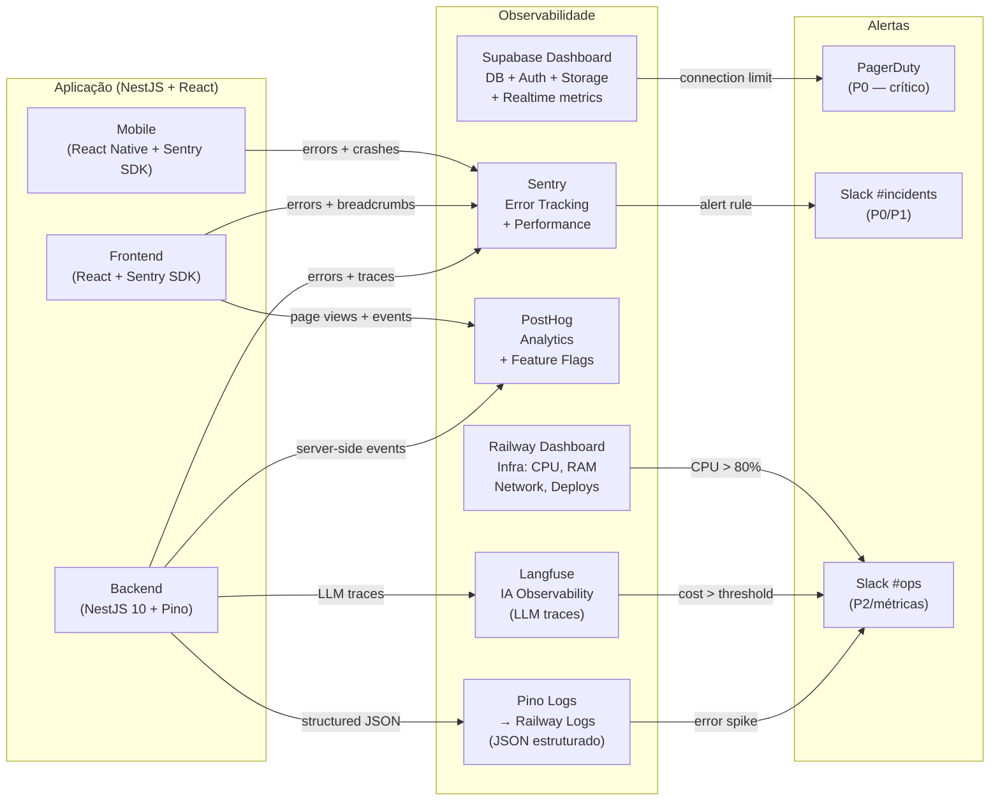

# 25 - Observabilidade e Logs

## Módulo Cessionário · Plataforma Repasse Seguro

| **Nome do Documento** | **Versão** | **Data** | **Autor** | **Status** |
|---|---|---|---|---|
| 25 - Observabilidade e Logs | v1.0 | 2026-03-22 (America/Fortaleza) | Claude Code Desktop | Aprovado |

---

> 📌 **TL;DR**
>
> - **Stack de observabilidade:** Pino (logs estruturados JSON), Sentry (error tracking + performance), PostHog (analytics + feature flags), Langfuse (observabilidade de IA), Railway Dashboard (infraestrutura), Supabase Dashboard (banco de dados).
> - **Correlation ID obrigatório** em todo log, toda resposta de erro, toda fila RabbitMQ e toda chamada a serviços externos.
> - **4 níveis de log:** `debug` (dev only), `info`, `warn`, `error`. `console.log` proibido em produção.
> - **10+ métricas definidas** com threshold, severidade e ação esperada.
> - **8 alertas críticos** com canal (PagerDuty, Slack #incidents, Slack #ops) e dono.
> - **Dados sensíveis nunca logados:** senhas, JWT tokens, CPF, dados bancários — sanitizados via `pino.redact`.
> - **Retenção:** logs `error/warn` 30 dias; `info` 7 dias; `debug` não persistido. Audit logs: 1 ano.

---

## 1. Arquitetura de Observabilidade



**Papéis das ferramentas:**

| Ferramenta | Papel | O que responde |
|---|---|---|
| Pino (JSON logs) | Logs estruturados do backend | "O que aconteceu, quando e com qual context?" |
| Sentry | Erros + performance tracing | "O erro é novo? Quantos usuários afetados? Onde no código?" |
| PostHog | Comportamento do usuário | "Quantos usuários passaram pelo funil? Onde abandonam?" |
| Langfuse | Observabilidade LLM | "Quanto custou esta sessão de IA? Latência do p95?" |
| Railway Dashboard | Infraestrutura | "A API está com CPU alta? Memória vazando?" |
| Supabase Dashboard | Banco + Auth + Storage | "Quantas conexões abertas? Queries lentas?" |

---

## 2. Níveis de Log

| Nível | Quando usar | Campos obrigatórios | Retenção | Quem consome |
|---|---|---|---|---|
| `debug` | Fluxo interno, variáveis de dev, loop de retry (dev only — nunca produção) | `message`, `module`, `metadata` | Não persistido | Dev (terminal local) |
| `info` | Ações de negócio bem-sucedidas: login, proposta criada, KYC aprovado, pagamento confirmado | `timestamp`, `level`, `service`, `module`, `action`, `correlation_id`, `user_id` (hash) | 7 dias (Railway) | On-call, produto |
| `warn` | Situações degradadas que não bloqueiam: retry de serviço externo, rate limit próximo, token próximo de expirar | Mesmos campos de `info` + `reason` | 30 dias | On-call, DevOps |
| `error` | Falhas que impactam o usuário: exceções não tratadas, 5xx, falhas de integração, erros de banco | Mesmos campos de `warn` + `stack_trace`, `error_code` | 30 dias | On-call, Dev, Sentry |

> ⚙️ **`console.log` proibido em produção.** Todo output de log deve passar pelo logger Pino. Regra validada em CI via ESLint rule `no-console`.

---

## 3. Formato de Log Estruturado

```typescript
// Schema JSON padrão — campos obrigatórios
interface StructuredLog {
  timestamp: string;          // ISO 8601 UTC: "2026-03-22T02:00:00.000Z"
  level: 'debug' | 'info' | 'warn' | 'error';
  service: 'api' | 'worker-email' | 'worker-push' | 'worker-kyc' | 'worker-rag';
  module: string;             // Ex: "auth", "proposal", "ai", "notification"
  action: string;             // Ex: "login", "proposal.create", "kyc.approved"
  message: string;            // Mensagem legível (técnica, não para o usuário)
  correlation_id: string;     // UUID v4 — propagado entre chamadas
  request_id?: string;        // ID do HTTP request (gerado no middleware)
  user_id?: string;           // HASH do user ID (sha256 — nunca o ID real)
  environment: 'development' | 'staging' | 'production';
  duration_ms?: number;       // latência da operação em ms
  metadata?: Record<string, unknown>;  // contexto adicional sem PII
  error?: {
    code: string;             // Ex: "EXT-001"
    message: string;          // técnica
    stack?: string;           // apenas em logs internos (nível error)
  };
}
```

### 3.1 Configuração do Pino

```typescript
// apps/api/src/config/logger.ts
import pino from 'pino'

export const logger = pino({
  level: process.env.NODE_ENV === 'development' ? 'debug' : 'info',
  transport: process.env.NODE_ENV === 'development'
    ? { target: 'pino-pretty', options: { colorize: true } }
    : undefined,  // JSON puro em produção (Railway captura)
  redact: {
    paths: [
      'password', 'senha', 'token', 'access_token', 'refresh_token',
      'authorization', 'cpf', 'rg', 'document_number', 'bank_account',
      'bank_agency', 'SUPABASE_SERVICE_ROLE_KEY', 'OPENAI_API_KEY',
      '*.password', '*.token', '*.cpf'
    ],
    censor: '[REDACTED]'
  }
})
```

### 3.2 Exemplos de Log Correto

```json
// ✅ Log info — login bem-sucedido
{
  "timestamp": "2026-03-22T02:00:00.000Z",
  "level": "info",
  "service": "api",
  "module": "auth",
  "action": "login",
  "message": "User authenticated successfully",
  "correlation_id": "a3f8c2d1-4e5b-4a6c-8f7d-9e0b1c2d3e4f",
  "request_id": "req-abc123",
  "user_id": "sha256:f4a1e2b3...",
  "environment": "production",
  "duration_ms": 145,
  "metadata": { "provider": "email" }
}

// ✅ Log error — falha de integração ZapSign
{
  "timestamp": "2026-03-22T02:05:00.000Z",
  "level": "error",
  "service": "api",
  "module": "formalization",
  "action": "zapsign.send_document",
  "message": "ZapSign document send failed after 3 retries",
  "correlation_id": "b4e9d3e2-5f6c-5b7d-9e0f-0a1c2d3e4f5a",
  "user_id": "sha256:a1b2c3d4...",
  "environment": "production",
  "duration_ms": 32500,
  "error": {
    "code": "EXT-001",
    "message": "ZapSign API returned 503",
    "stack": "Error: ZapSign API...\n  at FormalizationService.send..."
  },
  "metadata": { "formalizationId": "frm-uuid", "attempts": 3 }
}
```

---

## 4. O que Logar

| Evento | Nível | Campos obrigatórios | Risco coberto |
|---|---|---|---|
| Login bem-sucedido | `info` | `action: login`, `user_id`, `provider`, `duration_ms` | Acesso não autorizado detectável |
| Login falhou (credenciais) | `warn` | `action: login.failed`, `ip`, `reason: invalid_credentials` | Brute-force detection |
| Brute-force lockout ativado | `warn` | `action: login.lockout`, `ip`, `email_hash`, `lockout_ttl` | Ataque de força bruta |
| Token renovado (refresh) | `info` | `action: token.refresh`, `user_id`, `jti_old`, `jti_new` | Rastreio de sessão |
| KYC submetido | `info` | `action: kyc.submitted`, `user_id`, `document_type` | Compliance + SLA tracking |
| KYC resultado (aprovado/reprovado) | `info` | `action: kyc.result`, `user_id`, `status`, `duration_ms` | SLA de 5min (RN-065) |
| Proposta criada | `info` | `action: proposal.create`, `user_id`, `opportunity_id`, `proposed_value` | Auditoria de negócio |
| Proposta aceita/recusada | `info` | `action: proposal.status_change`, `status`, `proposal_id` | Rastreio de funil |
| Negociação iniciada | `info` | `action: negotiation.start`, `user_id`, `opportunity_id` | Auditoria de negócio |
| Prazo Escrow próximo | `warn` | `action: escrow.deadline_warning`, `negotiation_id`, `days_remaining` | Prevenção de cancelamento automático |
| Depósito Escrow confirmado | `info` | `action: escrow.confirmed`, `negotiation_id`, `amount` | Compliance financeiro |
| Documento ZapSign enviado | `info` | `action: zapsign.send`, `formalization_id`, `duration_ms` | SLA de formalização |
| ZapSign webhook recebido | `info` | `action: zapsign.webhook`, `event`, `doc_token`, `correlation_id` | Rastreio de assinatura |
| Chamada LLM executada | `info` | `action: ai.llm_call`, `model`, `tokens.total`, `cost_usd`, `duration_ms`, `session_id` | Custo + latência IA |
| Prompt injection detectado | `warn` | `action: ai.injection_attempt`, `user_id`, `pattern` | Segurança |
| Serviço externo falhou | `error` | `action: external.failed`, `service`, `error_code`, `attempts` | Confiabilidade |

---

## 5. O que Não Logar

> 🔴 **Regra inegociável:** Os dados abaixo **nunca aparecem em logs** em nenhum ambiente.

| Dado proibido | Regra de masking |
|---|---|
| Senhas / hashes de senha | `[REDACTED]` via `pino.redact` |
| JWT tokens (access ou refresh) | `[REDACTED]` via `pino.redact` |
| `SUPABASE_SERVICE_ROLE_KEY` | `[REDACTED]` via `pino.redact` |
| `OPENAI_API_KEY`, `ZAPSIGN_API_TOKEN` | `[REDACTED]` via `pino.redact` |
| CPF, RG, número de identidade | `[REDACTED]` via `pino.redact` |
| Dados bancários (conta, agência, chave PIX) | `[REDACTED]` via `pino.redact` |
| E-mail do usuário em logs de 5xx | Hash SHA-256 em vez do e-mail real |
| User ID real em logs | Hash SHA-256 antes de logar |
| Stack trace no response HTTP | Stack apenas em logs internos, nunca no response |
| Query completa do usuário para IA | Truncada a 100 chars se logada; session_id como proxy |

```typescript
// ✅ Exemplo de dado mascarado — log correto
{
  "action": "kyc.submitted",
  "user_id": "sha256:f4a1e2b3c4d5e6f7...",  // hash, não ID real
  "email": "[REDACTED]",                       // jamais o e-mail
  "cpf": "[REDACTED]",                         // jamais o CPF
  "document_type": "CNH"                       // tipo é seguro logar
}
```

---

## 6. Correlation ID e Rastreabilidade

### 6.1 Geração e Propagação

```typescript
// Middleware NestJS — gera ou propaga correlation ID
@Injectable()
export class CorrelationIdMiddleware implements NestMiddleware {
  use(req: Request, res: Response, next: NextFunction): void {
    const correlationId = (req.headers['x-correlation-id'] as string) || randomUUID()
    req.headers['x-correlation-id'] = correlationId
    res.setHeader('x-correlation-id', correlationId)
    // Injeta no contexto AsyncLocalStorage para propagação
    AsyncContext.set('correlationId', correlationId)
    next()
  }
}
```

### 6.2 Propagação por Camada

| Camada | Mecanismo |
|---|---|
| HTTP request → Backend | Header `X-Correlation-ID` (gerado no frontend ou middleware NestJS) |
| Backend → RabbitMQ | Campo `correlationId` no payload da mensagem |
| Worker → Serviço externo | Header `X-Correlation-ID` em todas as requisições (ZapSign, idwall, Celcoin) |
| Backend → Sentry | `Sentry.setTag('correlationId', id)` em cada request |
| Backend → Langfuse | Campo `traceId` mapeia para `correlationId` da sessão IA |
| Response de erro → Usuário | Campo `correlation_id` no body de erro (INT-001 exibido na UI) |

---

## 7. Métricas

### 7.1 Métricas de Aplicação

| Métrica | Objetivo | Unidade | Target (p50/p95) | Threshold alerta |
|---|---|---|---|---|
| Latência API (todos os endpoints) | Detectar degradação | ms | p50 <150ms, p95 <500ms | p95 > 1s por 5min |
| Taxa de erros 5xx | Detectar falha sistêmica | % de requests | < 0.5% | > 2% em 5min |
| Taxa de erros 4xx | Detectar abuse ou bug de cliente | % de requests | < 5% | > 10% em 5min |
| Latência LLM (first token streaming) | SLA do Analista IA (RN-050) | ms | p50 <3s, p95 <5s | p95 > 10s em 10min |
| Custo diário OpenAI | Controle financeiro | USD | < US$50 | > US$50 → alerta; > US$200 → hard limit |
| Taxa de sucesso KYC automático | Saúde da integração idwall | % | > 80% | < 60% em 1h |
| Taxa de entrega de e-mails | Saúde do Resend | % | > 98% | < 95% em 1h |

### 7.2 Métricas de Infraestrutura

| Métrica | Target | Threshold alerta |
|---|---|---|
| CPU do backend (Railway) | < 60% médio | > 80% por 5min → Slack #ops |
| Memória do backend (Railway) | < 70% | > 85% por 5min → Slack #ops |
| Conexões ativas PostgreSQL (Supabase) | < 80% do pool | > 90% → PagerDuty P1 |
| Latência de query p95 (Supabase) | < 100ms | > 500ms por 5min → Slack #ops |
| Uso de Storage Supabase | < 80% do plano | > 90% → Slack #ops |
| Mensagens na DLQ email | 0 | > 10 → Slack #ops urgente |
| Mensagens na DLQ push | 0 | > 20 → Slack #ops |

### 7.3 Métricas de Negócio

| Métrica | Objetivo | Monitoramento |
|---|---|---|
| Taxa de conversão KYC (submissão → aprovação) | Qualidade do onboarding | PostHog funnel |
| Taxa de propostas por oportunidade | Engajamento do marketplace | PostHog |
| Taxa de cancelamento de negociação por prazo Escrow | Alertas tardios | Banco de dados |
| Tempo médio de formalização (dias) | Eficiência operacional | Banco de dados |
| Sessões ativas do Analista IA por dia | Adoção da feature | Langfuse |

---

## 8. SLI, SLO e Error Budget

| Indicador | SLI | SLO (target) | Error Budget (30 dias) |
|---|---|---|---|
| Disponibilidade da API | % de requests com status < 500 | 99.5% | 3.6h de downtime/mês |
| Latência p95 | % de requests com p95 < 500ms | 95% | 5% de requests podem ultrapassar |
| KYC SLA (< 5min para aprovação automática) | % de KYCs processados em < 5min | 90% | 10% podem ir para revisão manual |
| Notificações críticas entregues | % de NOT-CES-05/06 entregues em < 5min | 99% | 1% de tolerância |
| Streaming IA (first token < 5s) | % de consultas com first token < 5s | 90% | 10% podem exceder (RN-050) |

---

## 9. Alertas

| Alerta | Condição | Severidade | Canal | Responsável | Ação imediata |
|---|---|---|---|---|---|
| API offline | `HTTP health /health` falha 3x em 1min | P0 crítico | PagerDuty + Slack #incidents | On-call | Verificar Railway deploy status; rollback se deploy recente |
| PostgreSQL indisponível | Conexão Prisma falha por 30s | P0 crítico | PagerDuty + Slack #incidents | On-call | Verificar Supabase status page; circuit breaker ativo |
| Taxa de erros 5xx > 2% | Em janela de 5min | P1 alto | Slack #incidents | On-call dev | Revisar logs Pino; identificar módulo afetado |
| DLQ de e-mail > 10 mensagens | Acumulação na dead-letter queue | P1 alto | Slack #ops | Backend Lead | Revisar logs do EmailWorker; reprocessar DLQ se resolvido |
| NOT-CES-05/06 não entregue em 30min | Notificação crítica Escrow sem status `sent` | P0 crítico | PagerDuty + Slack #incidents | On-call | Verificar Resend; reenvio manual se necessário |
| CPU backend > 80% por 5min | Railway metrics | P1 alto | Slack #ops | DevOps | Verificar se há query N+1; avaliar scale up |
| Custo OpenAI > US$50/dia | Langfuse alerta | P1 alto | Slack #ops | Tech Lead | Revisar queries de IA; verificar loop ou abuse |
| Novo tipo de erro Sentry | Primeiro ocorrência de error_code novo | P2 médio | Slack #incidents | Dev on-call | Investigar stack trace; avaliar hotfix |
| Brute-force > 50 lockouts/min | Redis counter `rs:auth:attempts:*` | P1 alto | Slack #security | Security + DevOps | Revisar IPs; ativar rate limiting adicional se necessário |

---

## 10. Dashboards

### 10.1 Dashboard 1 — Saúde do Sistema (Railway + Sentry)

**Pergunta operacional:** "A API está saudável agora?"

| Widget | Fonte | Interpretação |
|---|---|---|
| Uptime últimas 24h | Railway | < 99.5% → investigar imediatamente |
| Taxa de erros 5xx (gráfico tempo real) | Sentry | Spike > 2% → incidente ativo |
| Latência p50/p95/p99 | Railway logs | p95 > 1s → degradação |
| Conexões ativas PostgreSQL | Supabase Dashboard | > 80% do pool → risco de saturação |
| CPU e memória | Railway | > 80% → avaliar scale up |

### 10.2 Dashboard 2 — Funil de Negócio (PostHog)

**Pergunta operacional:** "O funil de conversão está saudável?"

| Widget | Fonte |
|---|---|
| Cadastros hoje vs 7 dias atrás | PostHog |
| Taxa de conclusão de KYC | PostHog funnel |
| Taxa de proposta → negociação → formalização | PostHog funnel |
| Abandono na tela de Escrow | PostHog |
| DAU/WAU/MAU | PostHog |

### 10.3 Dashboard 3 — IA e LLM (Langfuse)

**Pergunta operacional:** "O Analista de Oportunidades está performando bem e dentro do orçamento?"

| Widget | Fonte |
|---|---|
| Custo diário OpenAI (USD) | Langfuse |
| Latência p50/p95 (first token) | Langfuse |
| Taxa de erro de LLM | Langfuse |
| Taxa de output filtrado (FOMO) | Langfuse custom metric |
| Sessões ativas por dia | Langfuse |

### 10.4 Dashboard 4 — Notificações (Sentry + banco de dados)

**Pergunta operacional:** "As notificações críticas estão sendo entregues?"

| Widget | Fonte |
|---|---|
| Taxa de entrega e-mail (sent/delivered/bounced) | notification_logs |
| Itens na DLQ e-mail e push | RabbitMQ Management |
| NOT-CES-05/06 entregues hoje | notification_logs (query) |
| Push tokens ativos vs inativos | notification_tokens (query) |

---

## 11. Retenção e Custos

| Tipo de dado | Ambiente | Retenção | Justificativa |
|---|---|---|---|
| Logs `debug` | Dev apenas | Não persistido (terminal) | Sem valor operacional em produção |
| Logs `info` | Produção/Staging | 7 dias (Railway) | Investigação recente; custo de armazenamento |
| Logs `warn` e `error` | Produção | 30 dias | Investigação de incidentes + padrões |
| Eventos Sentry | Produção | 90 dias (plano Sentry Team) | Debugging histórico |
| Audit logs (`audit_logs` tabela) | Produção | 1 ano | Compliance financeiro e LGPD |
| `notification_logs` | Produção | 90 dias (soft delete) | Suporte ao usuário + LGPD |
| Traces Langfuse | Produção | 30 dias (plano Cloud) | Debugging de custo + qualidade IA |
| Métricas PostHog | Produção | 1 ano | Análise de funil histórico |

> 💡 **[DECISÃO AUTÔNOMA]** Retenção de logs `info` em 7 dias. Descartado: 30 dias (mesmo que `warn/error`) — custo de storage Railway 4x maior sem benefício operacional proporcional. Critério: logs `info` são raramente consultados além de 3 dias; `warn/error` são os logs de investigação real.

---

## 12. Health Checks e Pós-Deploy

### 12.1 Health Checks Automáticos

```
GET /health → { status: "ok", uptime: X, checks: { database, redis, rabbitmq } }
```

| Check | Comando | Output esperado | Falha = |
|---|---|---|---|
| API responde | `curl https://api.repasseseguro.com.br/health` | `{ "status": "ok" }` | Deploy com problema |
| PostgreSQL conectado | `database: "connected"` no body do health | — | Circuit breaker ativo |
| Redis conectado | `redis: "connected"` | — | Cache degradado |
| RabbitMQ conectado | `rabbitmq: "connected"` | — | Filas paradas |

### 12.2 Checklist Pós-Deploy

Após todo deploy em produção, verificar em 15 minutos:

- [ ] `GET /health` retorna `{ status: "ok" }` com todos os checks `connected`
- [ ] Taxa de erros 5xx no Sentry não aumentou após o deploy
- [ ] CPU e memória no Railway dentro dos limites (<70%)
- [ ] DLQs de e-mail e push com 0 mensagens novas
- [ ] Nenhum novo tipo de erro no Sentry
- [ ] Primeiro login com usuário de teste bem-sucedido
- [ ] KYC de teste processado com sucesso (validação de integração idwall)

---

## 13. Integração com Runbook

| Alerta | Runbook correspondente |
|---|---|
| API offline (P0) | Runbook: "Incidente de indisponibilidade da API" |
| PostgreSQL indisponível (P0) | Runbook: "Incidente de banco de dados" |
| NOT-CES-05/06 não entregue (P0) | Runbook: "Notificação crítica de Escrow falhou" |
| Taxa de erros 5xx > 2% (P1) | Runbook: "Degradação de backend" |
| DLQ e-mail > 10 (P1) | Runbook: "Fila de notificações com dead-letters" |
| Custo OpenAI > US$50 (P1) | Runbook: "Custo de IA acima do esperado" |
| Brute-force > 50 lockouts/min (P1) | Runbook: "Possível ataque de credenciais" |

---

## 14. Backlog de Pendências

| Item | Marcador | Seção | Justificativa / Trade-off | Impacto | Dono | Status |
|---|---|---|---|---|---|---|
| Retenção logs `info` (7 dias) | `[DECISÃO AUTÔNOMA]` | 11 — Retenção | 7 dias vs 30 dias. Critério: custo Railway proporcional; `warn/error` cobrem investigação real. Alternativa descartada: 30 dias (mesmo nível que warn/error). | Baixo — se necessário investigar > 7 dias, usar Sentry para erros relevantes. | DevOps | Implementado |
| Alertas PagerDuty | `[DECISÃO AUTÔNOMA]` | 9 — Alertas | PagerDuty usado para P0. Descartado: apenas Slack (sem on-call). Critério: P0 exige wake-up call; Slack pode ser ignorado fora do horário. | Alto — P0 sem PagerDuty pode levar horas sem resposta em madrugada. | DevOps | Implementado |
| SLO de disponibilidade (99.5%) | `[DECISÃO AUTÔNOMA]` | 8 — SLI/SLO | 99.5% vs 99.9%. Descartado: 99.9% (error budget de ~43min/mês — muito restritivo para Railway monolito). Critério: 99.5% (3.6h/mês) compatível com Railway free/starter e deploy sem HA. Revisar para 99.9% quando infra escalar. | Médio — impacta SLA com usuários; documentar no contrato de uso. | Tech Lead | Implementado |
| D24 - Deploy como dependência | `[DECISÃO AUTÔNOMA]` | 1 — Arquitetura | D24 não gerado ainda (pipeline gera na sequência correta). Observabilidade documentada sem dependência de D24 — railway dashboard e sentry usados diretamente. Alternativa: aguardar D24. Critério: o documento é autossuficiente. | Baixo | DevOps | Implementado |
