# 🔧 Regras de Negócio — AI-Dani-Admin

## AI-Dani · Agente do Administrador

| **Campo** | **Valor** |
|---|---|
| **Destinatário** | Equipe de Produto e Engenharia |
| **Escopo** | Supervisão de interações · Takeover manual · Métricas · Alertas automáticos · Configuração do agente · Critérios de prontidão para lançamento |
| **Agente** | AI-Dani-Admin |
| **Persona do agente** | Dani — Assistente de Supervisão e Gestão da Plataforma |
| **Versão** | v1.0 |
| **Responsável** | Claude Code Desktop |
| **Data da versão** | 2026-03-23 (America/Fortaleza) |
| **Origem** | Desmembrado de: Repasse AI 01.4 + referências transversais de 01.1–01.3 |

---

> 📌 **TL;DR**
>
> - A **Dani-Admin** é a assistente de supervisão dedicada ao Admin (equipe operacional da Repasse Seguro).
> - Cobre todo o ciclo de gestão dos agentes em produção: monitorar → intervir → configurar → auditar.
> - O painel de Supervisão IA é a única fonte de verdade sobre o comportamento dos agentes em produção.
> - Nenhum lançamento do agente Cessionário ou Cedente deve ocorrer sem que todos os critérios de prontidão desta RN estejam atendidos.

---

## 💡 1. Glossário de Domínio

| **Termo** | **Definição** |
|---|---|
| **Admin** | Equipe operacional da plataforma Repasse Seguro. Usuário-alvo da Dani-Admin. |
| **CSAT** | Customer Satisfaction Score — avaliação de satisfação do usuário com o atendimento da IA, em escala de 1 a 5. |
| **Nível de confiança** | Percentual de 0 a 100% que indica a certeza do agente sobre a resposta gerada. |
| **Painel de Supervisão IA** | Interface do Admin para visualizar, filtrar e intervir em interações dos agentes. |
| **Takeover** | Intervenção manual do Admin em uma conversa quando a confiança do agente fica abaixo do threshold configurado (padrão: 80%). |
| **Threshold de confiança** | Percentual mínimo de confiança aceito antes de sinalizar uma interação para revisão do Admin. Configurável entre 50% e 95%. Padrão: 80%. |
| **Taxa de recusa** | Percentual de respostas em que o agente recusou fornecer dados por restrição de perfil. |
| **DesligadoAutomatico** | Estado do agente quando a taxa de erro supera 30% em 15 minutos. Reativação manual pelo Admin. |
| **FallbackAtivo** | Estado do agente quando a API do modelo de IA está indisponível. Calculadora de Comissão assume os cálculos. |

---

## ⚙️ 2. Identidade e Tom de Voz da Dani-Admin

### 2.1 Identidade

| **Atributo** | **Definição** |
|---|---|
| Nome exibido na interface | Dani |
| Nome interno do produto | AI-Dani-Admin |
| Persona | Assistente de supervisão operacional — objetiva, precisa, orientada a dados e incidentes |
| Tom geral | Direto, técnico, baseado em evidências operacionais |

### 2.2 O que a Dani-Admin usa

- Dados de interações dos agentes (volume, latência, confiança, taxa de erro).
- Alertas e condições de disparo configuradas no sistema.
- Histórico de ações do Admin (takeovers, configurações alteradas).
- Métricas de desempenho do agente (CSAT, taxa de recusa, top perguntas).

### 2.3 O que a Dani-Admin não usa

- Dados pessoais de Cessionários ou Cedentes para respostas ao Admin (apenas identificadores anonimizados na listagem).
- Dados financeiros de transações individuais.
- Comunicação emocional ou subjetiva — apenas dados e recomendações baseadas em evidências.

---

## 🔒 3. Acesso e Escopo do Admin

### 3.1 Matriz de permissões do Admin

| **Operação** | **Admin** | **Cessionário** | **Cedente** |
|---|---|---|---|
| Acessar painel de Supervisão IA | ✅ Permitido | ❌ Bloqueado | ❌ Bloqueado |
| Visualizar interações de qualquer usuário | ✅ Permitido | ❌ Apenas próprias | ❌ Apenas próprias |
| Iniciar takeover de conversa | ✅ Permitido | ❌ Não se aplica | ❌ Não se aplica |
| Configurar threshold de confiança | ✅ Permitido | ❌ Bloqueado | ❌ Bloqueado |
| Visualizar Dashboard de métricas do agente | ✅ Permitido | ❌ Bloqueado | ❌ Bloqueado |
| Reativar agente após desligamento automático | ✅ Permitido | ❌ Bloqueado | ❌ Bloqueado |
| Receber alertas automáticos de incidente | ✅ Via Slack e e-mail | ❌ Não se aplica | ❌ Não se aplica |
| Ajustar rate limit do webchat | ✅ Permitido | ❌ Bloqueado | ❌ Bloqueado |
| Aplicar desconto de comissão | ✅ Mediante critério definido | ❌ Bloqueado | ❌ Não se aplica |
| Visualizar logs de auditoria | ✅ Permitido | ❌ Bloqueado | ❌ Bloqueado |

---

## 🎯 4. Módulo: Supervisão de Interações (Painel Supervisão IA)

### 4.1 Objetivo do módulo

Dar ao Admin visibilidade total sobre as interações dos agentes — incluindo perguntas, respostas, nível de confiança e dados utilizados — e a capacidade de intervir manualmente quando necessário.

### 4.2 Estados de uma interação

| **Estado** | **Descrição** |
|---|---|
| Respondida pela IA | Agente respondeu dentro do SLA com confiança acima do threshold |
| Sinalizada para revisão | Confiança abaixo do threshold; aguarda revisão do Admin |
| Em takeover | Admin assumiu a conversa manualmente |
| Encerrada | Conversa concluída (pela IA ou pelo Admin) |

```mermaid
stateDiagram-v2
    [*] --> RespondidaPelaIA : Agente responde com confiança ≥ threshold
    [*] --> SinalizadaParaRevisao : Agente responde com confiança < threshold
    SinalizadaParaRevisao --> EmTakeover : Admin inicia takeover
    SinalizadaParaRevisao --> RespondidaPelaIA : Admin não intervém; agente continua
    RespondidaPelaIA --> Encerrada : Usuário encerra conversa
    EmTakeover --> Encerrada : Admin encerra takeover
    Encerrada --> [*]
```

---

**RN-DA-030: Monitoramento de interações pelo Admin**

1. O Admin acessa o painel de Supervisão IA na sidebar do painel de administração.
2. O sistema carrega a lista de todas as interações dos agentes com os seguintes dados por interação:
   - Identificação do usuário (anonimizada na listagem; detalhada na visualização individual).
   - Data e hora da interação.
   - Pergunta enviada pelo usuário.
   - Resposta gerada pelo agente.
   - Nível de confiança da resposta (percentual de 0 a 100%).
   - Dados utilizados para gerar a resposta.
   - Latência (tempo de resposta em segundos).
   - Identificação do agente (Dani-Cessionário, Dani-Cedente, Dani-Admin) por filtro de nome.
3. **Se a lista está vazia:** exibe estado vazio com ícone ilustrativo e texto: "Nenhuma interação registrada no período selecionado." Inclui sugestão: "Tente ajustar o período ou os filtros aplicados."
4. **Se o Admin aplica filtros (por data, por usuário, por nível de confiança, por agente):** o sistema atualiza a lista com resultados filtrados. Filtros aplicados são exibidos como chips removíveis acima da lista. O Admin pode remover filtros individualmente (clicando no "x" de cada chip) ou limpar todos com botão "Limpar filtros". Durante a aplicação do filtro, a lista exibe skeleton loading inline sem substituir a tela inteira.
5. **Efeito:** visualização registrada nos logs de acesso do Admin.
6. **Consequência se violada:** sem monitoramento, o Admin não consegue identificar padrões problemáticos, respostas incorretas ou tentativas de manipulação do agente.

---

**RN-DA-031: Alertas automáticos de monitoramento**

1. O sistema monitora continuamente as métricas operacionais dos agentes.
2. Para cada condição atingida, o sistema dispara o alerta correspondente:

| **Alerta** | **Condição de disparo** | **Canal de notificação** | **Ação esperada do Admin** |
|---|---|---|---|
| Latência alta | Tempo de resposta ≥ 5.000ms (`LATENCY_SLA_MS=5000`) por 5 minutos consecutivos | Slack + painel Admin | Investigar gargalo de disponibilidade |
| Taxa de erro elevada | Mais de 10% das respostas com erro em 15 minutos | Slack + e-mail Admin | Monitorar e investigar causa |
| Desligamento automático | Taxa de erro acima de 30% em 15 minutos | Slack + e-mail Admin + painel | Reativar manualmente após resolução |
| CSAT degradado | Média abaixo de 3,5 de 5 nas últimas 24 horas | Painel Admin + e-mail | Revisar interações recentes para identificar causa |
| Taxa de recusa alta | Mais de 20% das respostas com recusa de dados em 24 horas | Painel Admin | Verificar tentativas de manipulação ou problema de experiência |
| Consumo de processamento | Acima de 80% do orçamento mensal de processamento | E-mail Admin | Avaliar otimização do volume de dados por interação |

3. **Se múltiplos alertas são disparados simultaneamente:** o sistema os lista em ordem de prioridade (desligamento automático primeiro, latência alta segundo).
4. **Efeito:** alerta registrado no painel Admin com timestamp e condição que o gerou.
5. **Consequência se violada:** sem alertas automáticos, incidentes operacionais podem passar despercebidos por horas, impactando os usuários.

---

## 🎯 5. Módulo: Takeover Manual (Intervenção Humana)

### 5.1 Objetivo do módulo

Permitir que o Admin assuma manualmente uma conversa do agente quando a qualidade da resposta da IA não é adequada para o usuário, mantendo a continuidade do atendimento sem criar ruptura na experiência.

---

**RN-DA-032: Condição de elegibilidade para takeover**

1. O Admin observa uma interação no painel de Supervisão IA.
2. **Se a confiança está abaixo do threshold configurado (padrão: 80%):** o sistema sinaliza a interação para revisão e habilita o botão de takeover.
3. **Se a confiança está acima do threshold:** o Admin ainda pode iniciar o takeover manualmente por qualquer motivo, a qualquer momento.
4. **Efeito:** interação passa para "Sinalizada para revisão" quando abaixo do threshold.
5. **Consequência se violada:** sem sinalização automática, o Admin precisaria revisar manualmente todas as interações para identificar respostas de baixa qualidade.

---

**RN-DA-033: Execução do takeover pelo Admin**

1. O Admin decide iniciar o takeover de uma conversa sinalizada ou em andamento.
2. O Admin acessa a interação no painel de Supervisão IA e clica em "Assumir conversa".
3. O sistema registra o takeover com timestamp, motivo e identificação do Admin.
4. **O usuário recebe imediatamente a mensagem:** "Um analista da equipe Repasse Seguro assumiu essa conversa para ajudá-lo. Como posso ajudar?" Mensagem exibida com avatar diferenciado (ícone de pessoa em vez de ícone do agente IA) e nome do remetente "Equipe Repasse Seguro". Separador visual no chat: linha com texto "Atendimento humano".
5. **O agente para de responder automaticamente** enquanto o takeover está ativo — nenhuma resposta da IA é gerada para aquela sessão. Campo de entrada do usuário permanece ativo normalmente.
6. **Se o Admin encerrar o takeover:** o agente retoma o controle. O usuário recebe: "Você está novamente em atendimento com [nome do agente]." Separador visual de retorno e avatar padrão do agente.
7. **Se o Admin tenta fazer takeover de conversa já encerrada:** sistema bloqueia com status "Conversa encerrada".
8. **Se dois Admins tentam fazer takeover da mesma conversa simultaneamente:** primeiro a confirmar assume; o segundo recebe: "Esta conversa já está em atendimento por outro analista."
9. **Efeito:** conversa passa de "RespondidaPelaIA" ou "SinalizadaParaRevisao" para "EmTakeover".
10. **Consequência se violada:** sem takeover disponível, interações de baixa qualidade não podem ser recuperadas, degradando a experiência do usuário.

---

## 🎯 6. Módulo: Métricas do Dashboard do Admin

### 6.1 Objetivo do módulo

Fornecer ao Admin uma visão consolidada do desempenho dos agentes em tempo real e histórico, permitindo decisões de gestão baseadas em dados.

---

**RN-DA-034: Métricas disponíveis no Dashboard do Admin**

1. O Admin acessa o Dashboard de métricas no painel de Supervisão IA.
2. O sistema exibe os seguintes indicadores, com possibilidade de filtrar por período (dia, semana, mês) e por agente (Dani-Cessionário, Dani-Cedente):
   - **Volume de interações:** total de mensagens trocadas com os agentes por dia e semana.
   - **Top 10 perguntas mais frequentes:** lista das perguntas mais enviadas pelos usuários no período.
   - **Taxa de respostas com recusa:** percentual de respostas em que o agente recusou fornecer dados por restrição de perfil.
   - **CSAT médio:** média das avaliações de satisfação recebidas no período (escala 1–5).
   - **Tempo médio de resposta:** latência média por tipo de interação (análise individual, comparativo, etc.).
3. **Se algum indicador não tiver dados suficientes no período selecionado:** exibe "Dados insuficientes para o período selecionado" para aquele indicador específico, com ícone de informação. O card mantém sua estrutura visual e **nunca exibe "0" ou "0%"** — zero pode ser confundido com desempenho ruim em vez de ausência de dados.
4. **Efeito:** métricas atualizadas em tempo real conforme novas interações ocorrem.
5. **Consequência se violada:** sem métricas centralizadas, o Admin não consegue medir o impacto dos agentes nem identificar áreas de melhoria.

---

## 🎯 7. Módulo: Configuração do Agente

### 7.1 Objetivo do módulo

Permitir que o Admin ajuste parâmetros operacionais dos agentes — como o threshold de confiança para takeover — sem necessidade de alteração técnica no código.

---

**RN-DA-035: Configuração do threshold de confiança para takeover**

1. O Admin acessa Configurações > Supervisão IA.
2. O Admin visualiza o threshold atual de confiança para sinalização automática de interações (padrão: 80%).
3. **Se o Admin ajusta o threshold para um valor entre 50% e 95%:** o sistema salva o novo valor e passa a sinalizar interações com confiança abaixo do novo threshold.
4. **Se o Admin tenta definir um threshold abaixo de 50% ou acima de 95%:** o sistema exibe: "O nível de supervisão precisa estar entre 50% e 95%. Valores fora desse intervalo podem comprometer a qualidade do atendimento." Erro exibido inline abaixo do campo de input, em cor de alerta, sem fechar o modal. Valor inválido permanece no campo para correção sem precisar redigitar.
5. **Ao salvar com sucesso:** toast de confirmação: "Nível de supervisão atualizado para [valor]%." O valor anterior é registrado no log de auditoria com histórico: "Alterado de [anterior]% para [novo]% por [Admin] em [data/hora]".
6. **O novo threshold entra em vigor imediatamente** para todas as novas interações.
7. **Consequência se violada:** threshold inadequado gera excesso ou ausência de sinalizações, comprometendo a supervisão.

---

## 🎯 8. Módulo: Canal Webchat — Configuração

### 8.1 Parâmetros de configuração do webchat

| **Parâmetro** | **Valor configurado** | **Responsável pela alteração** |
|---|---|---|
| Canal | Webchat embutido na plataforma (web e mobile) | Engenharia |
| Disponibilidade | 24/7 (depende da disponibilidade da API do modelo de IA) | Admin monitora |
| Rate limit | 30 mensagens por hora por usuário (janela deslizante) | Admin pode ajustar |
| Persistência do histórico | 90 dias | Admin + Jurídico |
| Entrada de texto | Texto livre + sugestões de perguntas frequentes | Produto |
| FAB global | Ícone fixo visível em todas as telas do módulo Cessionário | Produto / Engenharia |

---

**RN-DA-036: Disponibilidade 24/7 do webchat com dependência de API externa**

1. O sistema verifica se a API do modelo de IA está disponível quando um usuário tenta acessar o chat.
2. **Se a API está disponível:** o chat funciona normalmente, independente do horário.
3. **Se a API está indisponível:** o chat exibe: "O agente está temporariamente indisponível. Os cálculos de comissão e Escrow continuam disponíveis. Tente novamente em instantes." A Calculadora de Comissão permanece ativa. O ícone do FAB global exibe badge de status degradado (cor amarela) para que o usuário saiba antes de abrir o chat que o serviço está em modo limitado.
4. **Efeito:** disponibilidade do chat é proporcional à disponibilidade da API do modelo de IA. A Calculadora de Comissão permanece disponível em qualquer circunstância.

---

## ✅ 9. Módulo: Critérios de Prontidão para Lançamento

### 9.1 Objetivo do módulo

Definir os requisitos que devem ser verificados como "Sim" antes do lançamento de qualquer agente em produção.

---

**RN-DA-037: Isolamento de acesso antes da ativação do modelo de IA**

1. A equipe de engenharia solicita autorização para ativar o modelo de IA em produção.
2. O sistema verifica se os seguintes itens foram implementados e testados:
   - 2.1. **Filtro de escopo:** toda consulta de dados valida que o recurso pertence ao usuário autenticado antes de qualquer processamento.
   - 2.2. **Filtro de contexto:** as informações fornecidas ao agente contêm apenas dados autorizados para o perfil do usuário.
   - 2.3. **Teste de penetração:** o cenário de tentativa de acesso cruzado de dados (ex: "Cessionário tentando ver dados do Cedente") deve ser bloqueado em 100% dos casos testados.
3. **Se todos os itens verificados com sucesso:** o modelo de IA pode ser ativado em produção.
4. **Se qualquer item falhou:** a ativação é bloqueada até que o item seja corrigido e retestado.
5. **Consequência se violada:** ativar o modelo sem isolamento validado expõe dados de usuários, configurando incidente de segurança de prioridade máxima.

---

**RN-DA-038: Cobertura do agente para cenários de recusa**

1. A equipe de produto solicita aprovação das instruções permanentes do agente para lançamento.
2. Para ser aprovado, as instruções do agente devem:
   - 2.1. Definir a identidade e o tom do agente.
   - 2.2. Listar explicitamente os dados bloqueados com exemplos de recusa para cada tipo.
   - 2.3. Incluir exemplos de perguntas que devem ser recusadas com a resposta esperada.
   - 2.4. Reforçar o formato de resposta: toda resposta encerra com um próximo passo claro.
3. **Antes do lançamento:** as instruções devem ser testadas com no mínimo 20 perguntas adversariais que tentam extrair dados bloqueados.
4. **Consequência se violada:** sem cobertura dos cenários de recusa, o agente pode vazar dados restritos por indução de prompt.

---

**RN-DA-039: Supervisão Admin funcional antes do lançamento**

1. A equipe de engenharia solicita autorização para lançamento do agente.
2. O sistema verifica se os seguintes componentes de supervisão estão implementados e testados:
   - 2.1. **Registro de interações:** cada interação grava pergunta, resposta, nível de confiança e latência.
   - 2.2. **Dashboard de métricas:** volume, top perguntas, taxa de recusa, CSAT e latência estão visíveis no painel Admin.
   - 2.3. **Alerta automático de confiança:** interações com confiança abaixo do threshold são sinalizadas automaticamente.
   - 2.4. **Takeover manual:** Admin pode assumir uma conversa com registro de motivo.
3. **Se todos os componentes estão operacionais:** o lançamento é autorizado.
4. **Se qualquer componente está ausente:** o lançamento é bloqueado.
5. **Consequência se violada:** lançar sem supervisão funcional significa operar o agente sem capacidade de resposta a incidentes.

---

## 🔴 10. Edge Cases de Administração

| **Cenário** | **Comportamento esperado** | **RN de referência** |
|---|---|---|
| Admin configura threshold de confiança para 100% | Sistema recusa; exibe mensagem de limite máximo de 95% | RN-DA-035 |
| Admin tenta fazer takeover de uma conversa já encerrada | Sistema bloqueia; exibe status "Conversa encerrada" | RN-DA-033 |
| CSAT degradado e taxa de recusa alta ao mesmo tempo | Ambos os alertas são disparados; Admin decide qual investigar primeiro | RN-DA-031 |
| Dashboard sem dados no período selecionado | Sistema exibe "Dados insuficientes" por indicador — não apresenta zeros que poderiam ser confundidos com desempenho ruim | RN-DA-034 |
| Admin encerra takeover sem resolver a dúvida do usuário | Agente retoma; se o usuário repetir a pergunta, agente responde normalmente | RN-DA-033 |
| Dois Admins tentam fazer takeover da mesma conversa | Primeiro a confirmar assume; segundo recebe mensagem informando que a conversa já está em atendimento | RN-DA-033 |
| Taxa de erro do agente supera 30% em 15 minutos | Desligamento automático + notificação ao Admin | RN-DA-031 |
| Lançamento solicitado sem supervisão implementada | Lançamento bloqueado até implementação e teste de todos os componentes | RN-DA-039 |
