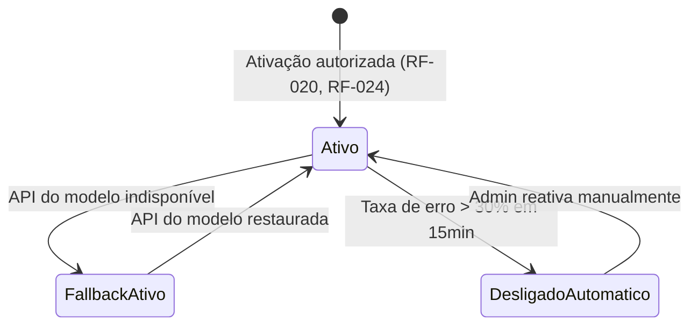

# PRD — AI-Dani-Admin · Parte 5 de 5
## Estados do Sistema, Edge Cases, Rastreabilidade e Changelog

| Campo | Valor |
|---|---|
| Destinatário | Produto e Engenharia |
| Escopo | Diagramas de estado, edge cases, rastreabilidade RN→RF e changelog |
| Módulo | AI-Dani-Admin |
| Versão | v1.0 |
| Responsável | Claude Code Desktop |
| Data da versão | 2026-03-23 (America/Fortaleza) |
| Parte anterior | 05.4 - PRD.md |
| Total de RFs | 26 (RF-001 a RF-026) |
| Total de RNFs | 12 (RNF-001 a RNF-012) |
| Cobertura de RNs | 100% (10/10 RNs do D01) |

---

## 4. Estados do Sistema

### 4.1 Estados de uma Interação

```mermaid
stateDiagram-v2
    [*] --> RespondidaPelaIA : Confiança >= threshold
    [*] --> SinalizadaParaRevisao : Confiança < threshold
    SinalizadaParaRevisao --> EmTakeover : Admin inicia takeover
    SinalizadaParaRevisao --> RespondidaPelaIA : Admin não intervém; agente continua
    RespondidaPelaIA --> EmTakeover : Admin inicia takeover manual
    RespondidaPelaIA --> Encerrada : Usuário encerra conversa
    EmTakeover --> Encerrada : Admin encerra takeover
    Encerrada --> [*]
```

### 4.2 Estados do Agente

---

## 5. Edge Cases Documentados

| Cenário | Comportamento | RF de Referência |
|---|---|---|
| Admin configura threshold para 100% | Sistema recusa; exibe erro de validação; valor permanece no campo | RF-016 |
| Admin tenta takeover de conversa encerrada | Sistema bloqueia com status "Conversa encerrada" | RF-010 |
| Dois Admins tentam takeover da mesma conversa | Primeiro confirma; segundo recebe "Esta conversa já está em atendimento" | RF-011 |
| CSAT degradado + taxa de recusa alta simultâneos | Ambos os alertas disparados; Admin decide qual investigar primeiro | RF-005, RF-006 |
| Dashboard sem dados no período selecionado | "Dados insuficientes" por indicador — nunca zero ou 0% | RF-013 |
| Admin encerra takeover sem resolver dúvida do usuário | Agente retoma; se usuário repetir, agente responde normalmente | RF-009 |
| Taxa de erro > 30% em 15 minutos | Desligamento automático + alerta Admin (Slack + e-mail + painel) | RF-005 |
| Lançamento solicitado sem supervisão implementada | Lançamento bloqueado até todos os componentes estarem testados | RF-024, RF-025 |
| API do modelo indisponível durante interação ativa | FallbackAtivo: Calculadora de Comissão assume; chat exibe mensagem de degradação | RF-018 |
| Tentativa de acesso de Cessionário ao painel Admin | 403 Forbidden sem expor dados | RF-026 |

---

## 6. Rastreabilidade Completa

### 6.1 RNs do D01 → RFs do PRD

| RN (D01) | Módulo | RFs correspondentes |
|---|---|---|
| RN-DA-030 | Supervisão de Interações | RF-001, RF-002, RF-003, RF-004, RF-026 |
| RN-DA-031 | Alertas Automáticos | RF-005, RF-006 |
| RN-DA-032 | Takeover — Elegibilidade | RF-007 |
| RN-DA-033 | Takeover — Execução | RF-008, RF-009, RF-010, RF-011 |
| RN-DA-034 | Dashboard de Métricas | RF-012, RF-013 |
| RN-DA-035 | Configuração de Threshold | RF-014, RF-015, RF-016 |
| RN-DA-036 | Webchat | RF-017, RF-018, RF-019 |
| RN-DA-037 | Prontidão — Isolamento | RF-020, RF-021 |
| RN-DA-038 | Prontidão — Cobertura de Recusa | RF-022, RF-023 |
| RN-DA-039 | Prontidão — Supervisão | RF-024, RF-025 |

**Total: 10 RNs → 26 RFs → cobertura 100%.**

---

## 7. Changelog

| Data | Versão | Descrição |
|---|---|---|
| 2026-03-23 | v1.0 | Versão inicial. 10 RNs traduzidas em 26 RFs e 12 RNFs. Cobertura 100% do D01. Split em 5 partes para consistência com demais agentes. |
